# Segment Anything Model for Medical Image Segmentation (SAM4MIS)

This project is inspired by [SAM4MIS](https://github.com/YichiZhang98/SAM4MIS).  
I forked the original repository as a starting point for my own exploration and would like to sincerely thank the original authors for their valuable work in organizing research on SAM and foundation models for medical image segmentation.

Based on the original project, this repository focuses more on:

- Continuous tracking and supplementation of the latest relevant literature
- More granular task classification and method organization, including zero-shot, Interactive, weak supervision, semi-supervised, and full supervision, etc.
- Experimental records and extended analysis for individual research needs

## Table of Contents

- [About Segment Anything Model (SAM)](#Introduction)
- [Literature Reviews of SAM 2/3 Adaptions for Medical Image Segmentation](#sam234mis)
  - [SAM2/3 4Zero-ShotMIS](#sam234zsmis)
  - [SAM2/3 4Few-ShotMIS](#sam234fsmis)
  - [SAM2/3 4InteractiveMIS](#sam234iwmis)
  - [SAM2/3 4OtherMIS](#sam234others)
- [Literature Reviews of Foundation Models / SAM for Medical Image Segmentation](#sam4mis)
  - [SAM 4SSLMIS](#samsslmis)
  - [SAM 4Zero-ShotMIS](#samzsmis)
  - [SAM 4Few-ShotMIS](#samfsmis)
  - [SAM 4Weakly-SupervisedMIS](#samwsmis)
  - [SAM 4InteractiveMIS](#samiwmis)
  - [SAM 4OtherMIS](#samothers)
- [Article Details](#articledetails)

## 
About Segment Anything Model (SAM)

Segment Anything Model (SAM) uses vision transformer-based image encoder to extract image features and compute an image embedding, and prompt encoder to embed prompts and incorporate user interactions. Then extranted information from two encoders are combined to alightweight mask decoder to generate segmentation results based on the image embedding, prompt embedding, and output token. For more details, please refer to the [original paper of SAM](https://arxiv.org/pdf/2304.02643.pdf).

<!-- AUTO-GENERATED LITERATURE TABLES START -->
## 
Literature Reviews of SAM 2/3 Adaptions for Medical Image Segmentation.

### 
SAM2/3 4Zero-ShotMIS.

| Date   | Authors               | Venue                                                                              | Title                                                                                                                                                                                                                                                                                                                                                                         | Code                                                           |
| ------ | --------------------- | ---------------------------------------------------------------------------------- | ----------------------------------------------------------------------------------------------------------------------------------------------------------------------------------------------------------------------------------------------------------------------------------------------------------------------------------------------------------------------------- | -------------------------------------------------------------- |
| 202511 | H. Buyukpatpat et al. | Journal of Imaging Informatics in Medicine 2025 (SCI  ❌)                                    | A Comparative Evaluation of Zero-Shot Performance of SAM, SAM2, MedSAM, and MedSAM2 Models on Lung Segmentation [(paper)](https://link.springer.com/10.1007/s10278-025-01778-y) [(details)](#a-comparative-evaluation-of-zero-shot-performanc-64e730af)                                                                                                                       | None                                                           |
| 202511 | S. Chakrabarty et al. | MIDL 2026 (CCF  ❌)                                                                      | Comparing SAM 2 and SAM 3 for Zero-Shot Segmentation of 3D Medical Data [(paper)](https://arxiv.org/abs/2511.21926) [(details)](#comparing-sam-2-and-sam-3-for-zero-shot-segmenta-3fd0d129)                                                                                                                                                                                   | None                                                           |
| 202511 | M. Shokri et al.      | 34th ACM International Conference on Information and Knowledge Management 2025 (CCF B)     | Zero-shot Stroke Lesion Segmentation via CAM-guided Prompting of MedSAM2 [(paper)](https://dl.acm.org/doi/10.1145/3746252.3760872) [(details)](#zero-shot-stroke-lesion-segmentation-via-cam-gui-43ac53a2)                                                                                                                                                                    | None                                                           |
| 202511 | X. Yao et al.         | arXiv.org 2025                                                                     | Towards Better Ultrasound Video Segmentation Foundation Model: An Empirical study on SAM2 Finetuning from Data Perspective [(paper)](https://arxiv.org/abs/2511.05731) [(details)](#towards-better-ultrasound-video-segmentation-fou-27091b1b)                                                                                                                                | None                                                           |
| 202508 | M. Fernandez et al.   | 2025 IEEE International Conference on Image Processing (ICIP, CCF C)                      | SAM 2-Driven Self-Training for Mammogram Segmentation: Zero-Shot Mask Generation Via Pseudo-Video [(paper)](https://ieeexplore.ieee.org/document/11084376/) [(details)](#sam-2-driven-self-training-for-mammogram-segment-a7b605d7)                                                                                                                                           | [Code](https://github.com/MauricioFernandezM/Self-TrainingSAM) |
| 202508 | J. He et al.          | IEEE Transactions on Biomedical Engineering 2026   (Q2)                                | Training-Free Breast Ultrasound Image Segmentation With Retrieval-Based SAM2 [(paper)](https://ieeexplore.ieee.org/document/11113315/) [(details)](#training-free-breast-ultrasound-image-segmentati-816e6d33)                                                                                                                                                                | None                                                           |
| 202504 | Y. Yamagishi et al.   | JMIR AI 2025  (JCR Q3)                                                                     | Using Segment Anything Model 2 for Zero-Shot 3D Segmentation of Abdominal Organs in Computed Tomography Scans to Adapt Video Tracking Capabilities for 3D Medical Imaging: Algorithm Development and Validation [(paper)](https://ai.jmir.org/2025/1/e72109) [(details)](#using-segment-anything-model-2-for-zero-shot-3d-406bff6d)                                           | None                                                           |
| 202503 | H. Zu et al.          | arXiv.org 2025                                                                     | Rethinking Few-Shot Medical Image Segmentation by SAM2: A Training-Free Framework with Augmentative Prompting and Dynamic Matching [(paper)](https://arxiv.org/abs/2503.04826) [(details)](#rethinking-few-shot-medical-image-segmentation-b-e1f08ac9)                                                                                                                        | None                                                           |
| 202502 | B. Xie et al.         | arXiv.org 2025                                                                     | RFMedSAM 2: Automatic Prompt Refinement for Enhanced Volumetric Medical Image Segmentation with SAM 2 [(paper)](https://arxiv.org/abs/2502.02741) [(details)](#rfmedsam-2-automatic-prompt-refinement-for-enhan-8b6b56ca)                                                                                                                                                     | None                                                           |
| 202408 | Y. He et al.(Daguang Xu)          | arXiv.org 2024                                                                     | A Short Review and Evaluation of SAM2's Performance in 3D CT Image Segmentation [(paper)](https://arxiv.org/abs/2408.11210) [(details)](#a-short-review-and-evaluation-of-sam2-s-performa-d5027d82)                                                                                                                                                                           | [Code](https://github.com/Project-MONAI/VISTA)                 |
| 202408 | Y. Yamagishi et al.   | arXiv.org 2024                                                                     | Zero-shot 3D Segmentation of Abdominal Organs in CT Scans Using Segment Anything Model 2: Adapting Video Tracking Capabilities for 3D Medical Imaging [(paper)](https://arxiv.org/abs/2408.06170) [(details)](#zero-shot-3d-segmentation-of-abdominal-organs-in-3ba96501)                                                                                                     | None                                                           |
| 202408 | M. Mansoori et al.    | 2025 IEEE 5th International Conference on Human-Machine Systems (ICHMS)            | Polyp SAM 2: Advancing Zero shot Polyp Segmentation in Colorectal Cancer Detection [(paper)](https://ieeexplore.ieee.org/document/11154309/) [(details)](#polyp-sam-2-advancing-zero-shot-polyp-segmentati-cb1cf69c)                                                                                                                                                          | [Code](https://github.com/sajjad-sh33/Polyp-SAM-2)             |
| 202408 | AS. Yu et al.         | arXiv.org 2024                                          | Novel adaptation of video segmentation to 3D MRI: efficient zero-shot knee segmentation with SAM2 [(paper)](https://www.spiedigitallibrary.org/conference-proceedings-of-spie/13411/3047346/Novel-adaptation-of-video-segmentation-to-3D-MRI--efficient/10.1117/12.3047346.full) [(details)](#novel-adaptation-of-video-segmentation-to-3d-mri-24039159)                      | None                                                           |
| 202408 | J. Yu et al.          | Lecture Notes in Computer Science 2026 (Efficient Medical Artificial Intelligence)                                             | SAM 2 in Robotic Surgery: An Empirical Evaluation for Robustness and Generalization in Surgical Video Segmentation [(paper)](https://link.springer.com/10.1007/978-3-032-13961-0_18) [(details)](#sam-2-in-robotic-surgery-an-empirical-evaluation-cb73ba9b)                                                                                                                  | None                                                           |
| 202408 | S. Sengupta et al.    | arXiv.org 2024                                             | Is SAM 2 Better than SAM in Medical Image Segmentation? [(paper)](https://www.spiedigitallibrary.org/conference-proceedings-of-spie/13406/3047370/Is-SAM-2-better-than-SAM-in-medical-image-segmentation/10.1117/12.3047370.full) [(details)](#is-sam-2-better-than-sam-in-medical-image-segmen-7cc5ed0e)                                                                     | None                                                           |
| 202408 | Y. Shen et al.        | Medical Imaging 2025: Image-Guided Procedures, Robotic Interventions, and Modeling | Performance and nonadversarial robustness of the segment anything model 2 in surgical video segmentation [(paper)](https://www.spiedigitallibrary.org/conference-proceedings-of-spie/13408/3047383/Performance-and-nonadversarial-robustness-of-the-segment-anything-model-2/10.1117/12.3047383.full) [(details)](#performance-and-nonadversarial-robustness-of-the-cfdbb3ed) | None                                                           |
| 202408 | A. Lou et al.         | Medical Imaging 2025: Image Processing                                             | Zero-Shot Surgical Tool Segmentation in Monocular Video Using Segment Anything Model 2 [(paper)](https://www.spiedigitallibrary.org/conference-proceedings-of-spie/13406/3047479/Zero-shot-surgical-tool-segmentation-in-monocular-video-using-Segment/10.1117/12.3047479.full) [(details)](#zero-shot-surgical-tool-segmentation-in-monocula-3a1aef32)                       | [Code](https://github.com/AngeLouCN/SAM-2_Surgical_Video)      |
>Updating continuously ...

### 
SAM2/3 4Few-ShotMIS.

| Date   | Authors        | Venue      | Title | Code |
| ------ | -------------- | ---------- | ----- | ---- |
| 202408 | L. Zhao et al. | IEEE Transactions on Neural Networks and Learning Systems 2025 | Retrieval-augmented Few-shot Medical Image Segmentation with Foundation Models [(paper)](https://ieeexplore.ieee.org/document/11021654/) [(details)](#retrieval-augmented-few-shot-medical-image-segme-ec75cd75) | None |
| 202501 | X. He et al.          | arXiv.org 2025                                                                     | Few-Shot Adaptation of Training-Free Foundation Model for 3D Medical Image Segmentation [(paper)](https://arxiv.org/abs/2501.09138) [(details)](#few-shot-adaptation-of-training-free-foundation-8b31dd67)                                                                                                                                                                    | None                                                           |
>Updating continuously ...

### 
SAM2/3 4InteractiveMIS.

| Date   | Authors        | Venue      | Title | Code |
| ------ | -------------- | ---------- | ----- | ---- |
| 202504 | J. Ma et al. | arXiv.org 2025 | MedSAM2: Segment Anything in 3D Medical Images and Videos [(paper)](https://arxiv.org/abs/2504.03600) [(details)](#medsam2-segment-anything-in-3d-medical-images-an-9bde8144) | [Code](https://github.com/bowang-lab/MedSAM2) |
| 202502 | X. Wang et al. | arXiv.org 2025 | Proxy Prompt: Endowing SAM & SAM2with Auto-Interactive-Prompt for Medical Segmentation [(paper)](https://arxiv.org/pdf/2502.03501) [(details)](#proxy-prompt-endowing-sam-sam2with-auto-interact-8f0cff77) | None |
| 202408 | J. Zhu et al. | arXiv.org 2024 | Medical SAM 2: Segment medical images as video via Segment Anything Model 2 [(paper)](https://arxiv.org/abs/2408.00874) [(details)](#medical-sam-2-segment-medical-images-as-video-vi-c5d7ee91) | [Code](https://github.com/MedicineToken/Medical-SAM2) |
| 202408 | H. Dong et al. | IEEE Transactions on Biomedical Engineering 2026 | Segment Anything Model 2: An Application to 2D and 3D Medical Images [(paper)](https://ieeexplore.ieee.org/document/11347005/) [(details)](#segment-anything-model-2-an-application-to-2d-an-91bc686c) | [Code](https://github.com/mazurowski-lab/segment-anything2-medical-evaluation/tree/main) |
| 202408 | C. Shen et al.        | arXiv.org 2024                                                                     | Interactive 3D Medical Image Segmentation with SAM 2 [(paper)](https://arxiv.org/abs/2408.02635) [(details)](#interactive-3d-medical-image-segmentation-with-s-bfc855bf)                                                                                                                                                                                                      | [Code](https://github.com/Chuyun-Shen/SAM_2_Medical_3D)        |
>Updating continuously ...

### 
SAM2/3 4OtherMIS.

| Date   | Authors        | Venue      | Title | Code |
| ------ | -------------- | ---------- | ----- | ---- |
| 202511 | A. Liu et al. | arXiv.org 2025 | MedSAM3: Delving into Segment Anything with Medical Concepts [(paper)](https://arxiv.org/abs/2511.19046) [(details)](#medsam3-delving-into-segment-anything-with-medic-54988e2e) | [Code](https://github.com/Joey-S-Liu/MedSAM3) |
| 202510 | L. Guo et al. | Computerized Medical Imaging and Graphics 2025 | ESAM2-BLS: Enhanced segment anything model 2 for efficient breast lesion segmentation in ultrasound imaging [(paper)](https://linkinghub.elsevier.com/retrieve/pii/S0895611125001636) [(details)](#esam2-bls-enhanced-segment-anything-model-2-for-ec0d5a28) | None |
| 202508 | Y. Chen et al. | Computers &amp; Graphics 2025 | SAM2Med3D: Leveraging video foundation models for 3D breast MRI segmentation [(paper)](https://linkinghub.elsevier.com/retrieve/pii/S0097849325001827) [(details)](#sam2med3d-leveraging-video-foundation-models-for-ed8ec478) | None |
| 202508 | Z. Wu et al. | IEEE Sensors Letters 2025 | Vessel-SAM2: Adapting Segment Anything 2 for Patch-Free Retinal Vessel Segmentation in Ultra-High Resolution Fundus Images [(paper)](https://ieeexplore.ieee.org/document/11107345/) [(details)](#vessel-sam2-adapting-segment-anything-2-for-patc-f33b6dd1) | None |
| 202507 | C. Wang et al. | Lecture Notes in Computer Science 2025 | FreqSAM2-UNet: Adapter Fine-Tuning Frequency-Aware Network of SAM2 for Universal Medical Segmentation [(paper)](https://link.springer.com/10.1007/978-981-95-0036-9_26) [(details)](#freqsam2-unet-adapter-fine-tuning-frequency-awar-57e962a5) | None |
| 202507 | G. Xu et al. | Machine Learning: Science and Technology 2025 | Depthwise-Dilated Convolutional Adapters for Medical Object Tracking and Segmentation Using the Segment Anything Model 2 [(paper)](https://iopscience.iop.org/article/10.1088/2632-2153/ae13d1) [(details)](#depthwise-dilated-convolutional-adapters-for-med-3bd27bdf) | [Code](https://github.com/apple1986/DD-SAM2) |
| 202507 | E. Chukwujindu et al. | European Journal of Radiology Artificial Intelligence 2025 | Improving Medical Image Segmentation with SAM2: Analyzing the Impact of Object Characteristics and Finetuning on Multi-Planar Datasets [(paper)](https://linkinghub.elsevier.com/retrieve/pii/S3050577125000325) [(details)](#improving-medical-image-segmentation-with-sam2-a-be4a6927) | [Code](https://github.com/RadSam2/rad_sam2) |
| 202507 | B. Podvin et al. | Lecture Notes in Computer Science 2026 | SAMUSA: Segment Anything Model 2 for UltraSound Annotation [(paper)](https://link.springer.com/10.1007/978-3-032-05141-7_49) [(details)](#samusa-segment-anything-model-2-for-ultrasound-a-4e4c55ae) | None |
| 202506 | X. Yu et al. | 33rd ACM International Conference on Multimedia 2025 | CRISP-SAM2: SAM2 with Cross-Modal Interaction and Semantic Prompting for Multi-Organ Segmentation [(paper)](https://dl.acm.org/doi/10.1145/3746027.3755108) [(details)](#crisp-sam2-sam2-with-cross-modal-interaction-and-aed849b6) | [Code](https://github.com/YU-deep/CRISP_SAM2.git) |
| 202505 | M. Mansoori et al. | 2025 IEEE International Conference on Image Processing (ICIP) | Advancements in Medical Image Classification through Fine-Tuning Natural Domain Foundation Models [(paper)](https://ieeexplore.ieee.org/document/11084641/) [(details)](#advancements-in-medical-image-classification-thr-7f9403ed) | [Code](https://github.com/sajjad-sh33/Medical-Transfer-Learning) |
| 202505 | G. Huo et al. | 2025 | SAMba-UNet: Synergizing SAM2 and Mamba in UNet with Heterogeneous Aggregation for Cardiac MRI Segmentation [(paper)](https://arxiv.org/pdf/2505.16304) [(details)](#samba-unet-synergizing-sam2-and-mamba-in-unet-wi-2606ca7d) | None |
| 202504 | Y. Chen et al. | IEEE Transactions on Medical Imaging 2026 | Accelerating Volumetric Medical Image Annotation via Short-Long Memory SAM 2 [(paper)](https://ieeexplore.ieee.org/document/11224387/) [(details)](#accelerating-volumetric-medical-image-annotation-c4ec9531) | None |
| 202504 | JD. Gutiérrez et al. | Algorithms 2025 | Prompt Once, Segment Everything: Leveraging Sam 2 Potential for Infinite Medical Image Segmentation with a Single Prompt [(paper)](https://www.mdpi.com/1999-4893/18/4/227) [(details)](#prompt-once-segment-everything-leveraging-sam-2-fc574ae1) | None |
| 202504 | A. Kazemi et al. | Medical Imaging 2025: Clinical and Biomedical Imaging | Semi-automated segmentation of magnitude images in 4D flow MR scans using segment anything model 2 (SAM 2) [(paper)](https://www.spiedigitallibrary.org/conference-proceedings-of-spie/13410/3051724/Semi-automated-segmentation-of-magnitude-images-in-4D-flow-MR/10.1117/12.3051724.full) [(details)](#semi-automated-segmentation-of-magnitude-images-cac696be) | None |
| 202503 | S. Wei et al. | ICASSP 2025 - 2025 IEEE International Conference on Acoustics, Speech and Signal Processing (ICASSP) | Self-Prompting Driven SAM2 for 3D Medical Image Segmentation [(paper)](https://ieeexplore.ieee.org/document/10889344/) [(details)](#self-prompting-driven-sam2-for-3d-medical-image-cd20683a) | None |
| 202501 | G. Hoyer et al. | 2025 | Scalable Evaluation Framework for Foundation Models in Musculoskeletal MRI Bridging Computational Innovation with Clinical Utility [(paper)](https://arxiv.org/pdf/2501.13376) [(details)](#scalable-evaluation-framework-for-foundation-mod-39a30423) | None |
| 202411 | Z. Li et al. | Entropy 2024 | Adapting SAM2 Model from Natural Images for Tooth Segmentation in Dental Panoramic X-Ray Images [(paper)](https://www.mdpi.com/1099-4300/26/12/1059) [(details)](#adapting-sam2-model-from-natural-images-for-toot-dd60d7fc) | None |
| 202408 | M. Mansoori et al. | ICASSP 2025 - 2025 IEEE International Conference on Acoustics, Speech and Signal Processing (ICASSP) | Self-Prompting Polyp Segmentation in Colonoscopy using Hybrid Yolo-SAM 2 Model [(paper)](https://ieeexplore.ieee.org/document/10887638/) [(details)](#self-prompting-polyp-segmentation-in-colonoscopy-15431981) | [Code](https://github.com/sajjad-sh33/YOLO_SAM2) |
| 202408 | X. Chen et al. | ICASSP 2025 - 2025 IEEE International Conference on Acoustics, Speech and Signal Processing (ICASSP) | SAM-OCTA2: Layer Sequence OCTA Segmentation with Fine-tuned Segment Anything Model 2 [(paper)](https://ieeexplore.ieee.org/document/10888853/) [(details)](#sam-octa2-layer-sequence-octa-segmentation-with-8df9f75d) | [Code](https://github.com/ShellRedia/SAM-OCTA2) |
| 202408 | Z. Yildiz et al. | 2024 | SAM & SAM 2 in 3D Slicer: SegmentWithSAM Extension for Annotating Medical Images [(paper)](https://arxiv.org/pdf/2408.15224) [(details)](#sam-sam-2-in-3d-slicer-segmentwithsam-extension-80154364) | [Code](https://github.com/mazurowski-lab/SlicerSegmentWithSAM) |
| 202408 | X. Xiong et al. | Visual Intelligence 2026 | SAM2-UNet: segment anything 2 makes strong encoder for natural and medical image segmentation [(paper)](https://link.springer.com/10.1007/s44267-025-00106-w) [(details)](#sam2-unet-segment-anything-2-makes-strong-encode-8acf7e84) | [Code](https://github.com/WZH0120/SAM2-UNet) |
| 202408 | H. Liu et al. | arXiv.org 2024 | Surgical SAM 2: Real-time Segment Anything in Surgical Video by Efficient Frame Pruning [(paper)](https://arxiv.org/abs/2408.07931) [(details)](#surgical-sam-2-real-time-segment-anything-in-sur-c37ec715) | [Code](https://github.com/jinlab-imvr/Surgical-SAM-2) |
| 202408 | T. Chen et al. | 2024 | SAM2-Adapter: Evaluating & Adapting Segment Anything 2 in Downstream Tasks: Camouflage, Shadow, Medical Image Segmentation, and More [(paper)](https://arxiv.org/pdf/2408.04579) [(details)](#sam2-adapter-evaluating-adapting-segment-anythin-098b6d29) | None |
| 202408 | M. Zhang et al. | 2024 | SAM2-PATH: A better segment anything model for semantic segmentation in digital pathology [(paper)](https://arxiv.org/pdf/2408.03651) [(details)](#sam2-path-a-better-segment-anything-model-for-se-5cf08e5c) | [Code](https://github.com/simzhangbest/SAM2PATH) |
| 202408 | J. Ma et al. | arXiv.org 2024 | Segment Anything in Medical Images and Videos: Benchmark and Deployment [(paper)](https://arxiv.org/abs/2408.03322) [(details)](#segment-anything-in-medical-images-and-videos-be-c913c54f) | [Code](https://github.com/bowang-lab/MedSAM) |
| 202408 | Z. Yan et al. | arXiv.org 2024 | Biomedical SAM 2: Segment Anything in Biomedical Images and Videos [(paper)](https://arxiv.org/abs/2408.03286) [(details)](#biomedical-sam-2-segment-anything-in-biomedical-5fda9d03) | [Code](https://github.com/ZhilingYan/Biomedical-SAM-2) |
>Updating continuously ...

## 
Literature Reviews of Foundation Models / SAM for Medical Image Segmentation.

### 
SAM 4SSLMIS.

| Date   | Authors        | Venue      | Title | Code |
| ------ | -------------- | ---------- | ----- | ---- |
| 202602 | J. Miao et al. | Medical Image Analysis 2026 | SAM-driven cross prompting with adaptive sampling consistency for semi-supervised medical image segmentation [(paper)](https://linkinghub.elsevier.com/retrieve/pii/S1361841526000423) [(details)](#sam-driven-cross-prompting-with-adaptive-samplin-8a7e38d3) | [Code](https://github.com/JuzhengMiao/CPAC-SAM) |
| 202601 | J. Li et al. | Pattern Recognition 2026 | Semi-MedSAM: Adapting SAM-assisted semi-supervised multi-modality learning for medical endoscopic image segmentation [(paper)](https://linkinghub.elsevier.com/retrieve/pii/S0031320326001718) [(details)](#semi-medsam-adapting-sam-assisted-semi-supervise-8d5eb04c) | None |
| 202601 | J. Zhu et al. | Computerized Medical Imaging and Graphics 2026 | AutoPromptSeg: Automated Decoupling of Uncertainty Prompts with SAM for semi-supervised medical image segmentation [(paper)](https://linkinghub.elsevier.com/retrieve/pii/S089561112600011X) [(details)](#autopromptseg-automated-decoupling-of-uncertaint-6671dd23) | None |
| 202510 | H. Chi et al. | IEEE Transactions on Circuits and Systems for Video Technology 2026 | Cross-Hierarchical Decoding With SAM for Semi-Supervised Medical Image Segmentation [(paper)](https://ieeexplore.ieee.org/document/11217143/) [(details)](#cross-hierarchical-decoding-with-sam-for-semi-su-41bb2918) | None |
| 202509 | C. Qin et al. | IEEE Journal of Biomedical and Health Informatics 2026 | DUR-Net+: Semi-Supervised Abdominal CT Pheochromocytoma Segmentation Via Dynamic Uncertainty Rectified and Prior Knowledge From SAM-Med3D [(paper)](https://ieeexplore.ieee.org/document/11162509/) [(details)](#dur-net-semi-supervised-abdominal-ct-pheochromoc-678a0928) | None |
| 202507 | A. Wang et al. | Computerized Medical Imaging and Graphics 2025 | PedSemiSeg: Pedagogy-inspired semi-supervised polyp segmentation [(paper)](https://linkinghub.elsevier.com/retrieve/pii/S0895611125001004) [(details)](#pedsemiseg-pedagogy-inspired-semi-supervised-pol-504fc8d8) | None |
| 202506 | Q. Liang et al. | Expert Systems with Applications 2025 | STAR: Empowering semi-supervised medical image segmentation with SAM-based teacher-student architecture and contrastive consistency regularization [(paper)](https://linkinghub.elsevier.com/retrieve/pii/S0957417425022699) [(details)](#star-empowering-semi-supervised-medical-image-se-2edd8963) | None |
| 202505 | N. Saito et al. | 2025 IEEE International Conference on Image Processing (ICIP) | Zero-Shot Pseudo Labels Generation Using Sam and Clip for Semi-Supervised Semantic Segmentation [(paper)](https://ieeexplore.ieee.org/document/11084652/) [(details)](#zero-shot-pseudo-labels-generation-using-sam-and-3d49e5f3) | None |
| 202505 | Q. Pan et al. | IEEE Transactions on Medical Imaging 2025 | AMVLM: Alignment-Multiplicity Aware Vision-Language Model for Semi-Supervised Medical Image Segmentation [(paper)](https://ieeexplore.ieee.org/document/11014494/) [(details)](#amvlm-alignment-multiplicity-aware-vision-langua-93ce7956) | [Code](https://github.com/QingtaoPan/AMVLM) |
| 202505 | T. Ward et al. | arXiv.org 2024 | Annotation-Efficient Task Guidance for Medical Segment Anything [(paper)](https://arxiv.org/abs/2412.08575) [(details)](#annotation-efficient-task-guidance-for-medical-s-4fb4f47d) | [Code](https://github.com/tbwa233/SAM-Mix) |
| 202504 | Y. Wang et al. | Medical Engineering &amp; Physics 2025 | SAMBV: A fine-tuned SAM with interpolation consistency regularization for semi-supervised bi-ventricle segmentation from cardiac MRI [(paper)](https://iopscience.iop.org/article/10.1016/j.medengphy.2025.104341) [(details)](#sambv-a-fine-tuned-sam-with-interpolation-consis-40e84296) | None |
| 202504 | J. Wei et al. | 2025 IEEE/CVF Conference on Computer Vision and Pattern Recognition Workshops (CVPRW) | Mixture-of-Shape-Experts (MoSE): End-to-End Shape Dictionary Framework to Prompt SAM for Generalizable Medical Segmentation [(paper)](https://ieeexplore.ieee.org/document/11147816/) [(details)](#mixture-of-shape-experts-mose-end-to-end-shape-d-cf02bf93) | None |
| 202504 | Y. Wang et al. | IEEE Transactions on Medical Imaging 2025 | Balancing Multi-Target Semi-Supervised Medical Image Segmentation with Collaborative Generalist and Specialists [(paper)](https://ieeexplore.ieee.org/document/10948494/) [(details)](#balancing-multi-target-semi-supervised-medical-i-a157dd57) | [Code](https://github.com/wangyou0804/CGS) |
| 202503 | Q. Ma et al. | 2025 IEEE/CVF Conference on Computer Vision and Pattern Recognition (CVPR) | Steady Progress Beats Stagnation: Mutual Aid of Foundation and Conventional Models in Mixed Domain Semi-Supervised Medical Image Segmentation [(paper)](https://ieeexplore.ieee.org/document/11094453/) [(details)](#steady-progress-beats-stagnation-mutual-aid-of-f-3db652cb) | [Code](https://github.com/MQinghe/SynFoC) |
| 202503 | B. Cui et al. | arXiv.org 2025 | Learning to Efficiently Adapt Foundation Models for Self-Supervised Endoscopic 3D Scene Reconstruction from Any Cameras [(paper)](https://arxiv.org/abs/2503.15917) [(details)](#learning-to-efficiently-adapt-foundation-models-72774640) | None |
| 202502 | Y. Zhang et al. | Medical Image Analysis 2025 | SemiSAM+: Rethinking Semi-Supervised Medical Image Segmentation in the Era of Foundation Models [(paper)](https://linkinghub.elsevier.com/retrieve/pii/S1361841525002804) [(details)](#semisam-rethinking-semi-supervised-medical-image-d74217a0) | [Code](https://github.com/YichiZhang98/SemiSAM) |
| 202412 | Y. Zhang et al. | arXiv.org 2023 | SemiSAM: Enhancing Semi-Supervised Medical Image Segmentation via SAM-Assisted Consistency Regularization [(paper)](https://arxiv.org/abs/2312.06316) [(details)](#semisam-enhancing-semi-supervised-medical-image-7f39521f) | [Code](https://github.com/YichiZhang98/SemiSAM) |
| 202412 | T. Ward et al. | arXiv.org 2024 | Annotation-Efficient Task Guidance for Medical Segment Anything [(paper)](https://arxiv.org/abs/2412.08575) [(details)](#annotation-efficient-task-guidance-for-medical-s-4fb4f47d) | [Code](https://github.com/tbwa233/SAM-Mix) |
| 202411 | B. Wittmann et al. | 2025 IEEE/CVF Conference on Computer Vision and Pattern Recognition (CVPR) | vesselFM: A Foundation Model for Universal 3D Blood Vessel Segmentation [(paper)](https://ieeexplore.ieee.org/document/11092528/) [(details)](#vesselfm-a-foundation-model-for-universal-3d-blo-212b1244) | [Code](https://github.com/bwittmann/vesselFM) |
| 202411 | G. Xu et al. | Medical Physics 2025 | A SAM-guided and Match-based Semi-Supervised Segmentation Framework for Medical Imaging [(paper)](https://aapm.onlinelibrary.wiley.com/doi/10.1002/mp.17785) [(details)](#a-sam-guided-and-match-based-semi-supervised-seg-e5ff8a3a) | [Code](https://github.com/apple1986/SAMatch) |
| 202411 | R. Keuth et al. | arXiv.org 2024 | SAM Carries the Burden: A Semi-Supervised Approach Refining Pseudo Labels for Medical Segmentation [(paper)](https://arxiv.org/abs/2411.12602) [(details)](#sam-carries-the-burden-a-semi-supervised-approac-6ab7c53e) | [Code](https://github.com/multimodallearning/SamCarriesTheBurden) |
| 202410 | Z. Xu et al. | Lecture Notes in Computer Science 2024 | FM-ABS: Promptable Foundation Model Drives Active Barely Supervised Learning for 3D Medical Image Segmentation [(paper)](https://link.springer.com/10.1007/978-3-031-72111-3_28) [(details)](#fm-abs-promptable-foundation-model-drives-active-edabc19b) | None |
| 202409 | G. Huang et al. | arXiv.org 2024 | MCICSAM: Monte Carlo-guided Interpolation Consistency Segment Anything Model for Semi-Supervised Prostate Zone Segmentation [(paper)](https://arxiv.org/abs/2409.13371) [(details)](#mcicsam-monte-carlo-guided-interpolation-consist-cb70abf3) | None |
| 202407 | J. Miao et al. | Lecture Notes in Computer Science 2024 | Cross Prompting Consistency with Segment Anything Model for Semi-supervised Medical Image Segmentation [(paper)](https://link.springer.com/10.1007/978-3-031-72120-5_16) [(details)](#cross-prompting-consistency-with-segment-anythin-224fb66c) | [Code](https://github.com/JuzhengMiao/CPC-SAM) |
| 202407 | G. Wang et al. | Lecture Notes in Computer Science 2024 | SAM-Med3D-MoE: Towards a Non-Forgetting Segment Anything Model via Mixture of Experts for 3D Medical Image Segmentation [(paper)](https://link.springer.com/10.1007/978-3-031-72114-4_53) [(details)](#sam-med3d-moe-towards-a-non-forgetting-segment-a-cfefd28d) | None |
| 202403 | Z. Cheng et al. | 2024 IEEE/CVF Conference on Computer Vision and Pattern Recognition (CVPR) | Unleashing the Potential of SAM for Medical Adaptation via Hierarchical Decoding [(paper)](https://ieeexplore.ieee.org/document/10656144/) [(details)](#unleashing-the-potential-of-sam-for-medical-adap-c484b446) | [Code](https://github.com/Cccccczh404/H-SAM) |
| 202403 | S. Li et al. | 2024 | Concatenate, Fine-tuning, Re-training: A SAM-enabled Framework for Semi-supervised 3D Medical Image Segmentation [(paper)](https://arxiv.org/pdf/2403.11229.pdf) [(details)](#concatenate-fine-tuning-re-training-a-sam-enable-2ff23cb9) | [Code](https://github.com/ShumengLI/CFR) |
| 202402 | Z. Chen et al. | arXiv.org 2024 | UN-SAM: Universal Prompt-Free Segmentation for Generalized Nuclei Images [(paper)](https://arxiv.org/abs/2402.16663) [(details)](#un-sam-universal-prompt-free-segmentation-for-ge-7f1cd137) | [Code](https://github.com/CUHK-AIM-Group/UN-SAM) |
| 202312 | S. Chen et al. | 2024 IEEE International Symposium on Biomedical Imaging (ISBI) | ASLseg: Adapting SAM in the Loop for Semi-supervised Liver Tumor Segmentation [(paper)](https://ieeexplore.ieee.org/document/10635501/) [(details)](#aslseg-adapting-sam-in-the-loop-for-semi-supervi-77350955) | None |
| 202312 | Y. Zhang et al. | 2023 | SemiSAM: Exploring SAM for Enhancing Semi-Supervised Medical Image Segmentation with Extremely Limited Annotations [(paper)](https://arxiv.org/pdf/2312.06316.pdf) [(details)](#semisam-exploring-sam-for-enhancing-semi-supervi-2e628ec4) | None |
| 202311 | N. Li et al. | SSRN Electronic Journal 2023 | Segment Anything Model for Semi-Supervised Medical Image Segmentation via Selecting Reliable Pseudo-Labels [(paper)](https://www.ssrn.com/abstract=4477443) [(details)](#segment-anything-model-for-semi-supervised-medic-8dc67b2d) | None |
| 202311 | DL. Ferreira and R. Arnaout | Informatik aktuell 2026 | Are foundation models efficient for medical image segmentation? [(paper)](https://link.springer.com/10.1007/978-3-658-51100-5_8) [(details)](#are-foundation-models-efficient-for-medical-imag-e81ab192) | [Code](https://github.com/ArnaoutLabUCSF/CardioML) |
| 202308 | Y. Zhang et al. | Lecture Notes in Computer Science 2025 | SamDSK: Combining Segment Anything Model with Domain-Specific Knowledge for Semi-Supervised Learning in Medical Image Segmentation [(paper)](https://link.springer.com/10.1007/978-981-97-8496-7_24) [(details)](#samdsk-combining-segment-anything-model-with-dom-239cb98b) | None |
>Updating continuously ...

### 
SAM 4Zero-ShotMIS.

| Date   | Authors        | Venue      | Title | Code |
| ------ | -------------- | ---------- | ----- | ---- |
| 202512 | M. Marks et al. | Nature Methods 2025 | CellSAM: a foundation model for cell segmentation [(paper)](https://www.nature.com/articles/s41592-025-02879-w) [(details)](#cellsam-a-foundation-model-for-cell-segmentation-4cb639e7) | [Code](https://cellsam.deepcell.org) |
| 202511 | M. Rokuss et al. | arXiv.org 2025 | VoxTell: Free-Text Promptable Universal 3D Medical Image Segmentation [(paper)](https://arxiv.org/abs/2511.11450) [(details)](#voxtell-free-text-promptable-universal-3d-medica-ab791e43) | [Code](www.github.com/MIC-DKFZ/VoxTell) |
| 202511 | C. Xu et al. | arXiv.org 2025 | Boundary-Aware Test-Time Adaptation for Zero-Shot Medical Image Segmentation [(paper)](https://arxiv.org/abs/2512.04520) [(details)](#boundary-aware-test-time-adaptation-for-zero-sho-09c44473) | [Code](https://github.com/Emilychenlin/BA-TTA-SAM) |
| 202511 | Y. Zhang et al. | arXiv.org 2025 | Continual Alignment for SAM: Rethinking Foundation Models for Medical Image Segmentation in Continual Learning [(paper)](https://arxiv.org/abs/2511.17201) [(details)](#continual-alignment-for-sam-rethinking-foundatio-af6091bd) | [Code](https://github.com/azzzzyo/Continual-Alignment-for-SAM) |
| 202508 | S. Zhang et al. | Nature Biomedical Engineering 2025 | A generalist foundation model and database for open-world medical image segmentation [(paper)](https://www.nature.com/articles/s41551-025-01497-3) [(details)](#a-generalist-foundation-model-and-database-for-o-73320fd5) | [Code](https://github.com/MedSegX/MedSegX-code) |
| 202508 | AA. Shami et al. | Lecture Notes in Networks and Systems 2025 | Persistent Homology and Segment Anything Model for Automated Zero-Shot Localized Medical X-ray Images Segmentation (PH-SAM) [(paper)](https://link.springer.com/10.1007/978-3-031-99965-9_37) [(details)](#persistent-homology-and-segment-anything-model-f-b2cfe487) | None |
| 202508 | B. Huang et al. | Lecture Notes in Computer Science 2026 | E-BayesSAM: Efficient Bayesian Adaptation of SAM with Self-optimizing KAN-Based Interpretation for Uncertainty-Aware Ultrasonic Segmentation [(paper)](https://link.springer.com/10.1007/978-3-032-05185-1_13) [(details)](#e-bayessam-efficient-bayesian-adaptation-of-sam-a45bc870) | [Code](https://github.com/mp31192/E-BayesSAM) |
| 202508 | Y. Yang et al. | AAAI Conference on Artificial Intelligence 2026 | MedSAMix: A Training-Free Model Merging Approach for Medical Image Segmentation [(paper)](https://ojs.aaai.org/index.php/AAAI/article/view/38161) [(details)](#medsamix-a-training-free-model-merging-approach-e015befc) | None |
| 202508 | A. Roddan et al. | Lecture Notes in Computer Science 2026 | SAMSA 2.0: Prompting Segment Anything with Spectral Angles for Hyperspectral Interactive Medical Image Segmentation [(paper)](https://link.springer.com/10.1007/978-3-032-05114-1_46) [(details)](#samsa-2-0-prompting-segment-anything-with-spectr-f1621e27) | None |
| 202507 | H. Wang et al. | IEEE Transactions on Neural Networks and Learning Systems 2025 | SAM-Med3D: A Vision Foundation Model for General-Purpose Segmentation on Volumetric Medical Images [(paper)](https://ieeexplore.ieee.org/document/11105528/) [(details)](#sam-med3d-a-vision-foundation-model-for-general-9ee815cb) | [Code](https://github.com/uni-medical/SAM-Med3D) |
| 202506 | W. Shi et al. | Biomedical Signal Processing and Control 2025 | SIT-SAM: A semantic-integration transformer that adapts the Segment Anything Model to zero-shot medical image semantic segmentation [(paper)](https://linkinghub.elsevier.com/retrieve/pii/S174680942500597X) [(details)](#sit-sam-a-semantic-integration-transformer-that-c9044162) | [Code](https://github.com/wentao0429/SIT-SAM) |
| 202506 | Y. He et al. | 2025 IEEE/CVF Conference on Computer Vision and Pattern Recognition (CVPR) | VISTA3D: A Unified Segmentation Foundation Model For 3D Medical Imaging [(paper)](https://ieeexplore.ieee.org/document/11094751/) [(details)](#vista3d-a-unified-segmentation-foundation-model-2fb7a04b) | [Code](https://github.com/Project-MONAI/VISTA) |
| 202505 | S. Sengupta et al. | 2025 IEEE 22nd International Symposium on Biomedical Imaging (ISBI) | SynthFM: Training Modality-Agnostic Foundation Models for Medical Image Segmentation Without Real Medical Data [(paper)](https://ieeexplore.ieee.org/document/10980740/) [(details)](#synthfm-training-modality-agnostic-foundation-mo-2804d9de) | None |
| 202505 | M. Nouman et al. | 2025 IEEE 22nd International Symposium on Biomedical Imaging (ISBI) | Evaluating Segmentation Accuracy with Diverse Prompt Strategies in Medsam [(paper)](https://ieeexplore.ieee.org/document/10980865/) [(details)](#evaluating-segmentation-accuracy-with-diverse-pr-cc39ecae) | None |
| 202505 | Y. Jiang et al. | 2025 IEEE/CVF Conference on Computer Vision and Pattern Recognition (CVPR) | Advancing Generalizable Tumor Segmentation with Anomaly-Aware Open-Vocabulary Attention Maps and Frozen Foundation Diffusion Models [(paper)](https://ieeexplore.ieee.org/document/11094149/) [(details)](#advancing-generalizable-tumor-segmentation-with-43d99d2b) | [Code](https://github.com/Yankai96/DiffuGTS) |
| 202503 | S. Chattopadhyay et al. | arXiv.org 2025 | Zero-shot Domain Generalization of Foundational Models for 3D Medical Image Segmentation: An Experimental Study [(paper)](https://arxiv.org/abs/2503.22862) [(details)](#zero-shot-domain-generalization-of-foundational-9ee989a0) | None |
| 202503 | S. Xu et al. | arXiv.org 2025 | BiPrompt-SAM: Enhancing Image Segmentation via Explicit Selection between Point and Text Prompts [(paper)](https://arxiv.org/abs/2503.19769) [(details)](#biprompt-sam-enhancing-image-segmentation-via-ex-5ea94fa7) | None |
| 202503 | B. Li et al. | Communications in Computer and Information Science 2025 | Optimization of MedSAM Model Based on Bounding Box Adaptive Perturbation Algorithm [(paper)](https://link.springer.com/10.1007/978-981-96-9952-0_2) [(details)](#optimization-of-medsam-model-based-on-bounding-b-84601017) | None |
| 202503 | X. Liu et al. | Medical Image Analysis 2025 | Segment Any Tissue: One-shot reference guided training-free automatic point prompting for medical image segmentation [(paper)](https://linkinghub.elsevier.com/retrieve/pii/S1361841525000970) [(details)](#segment-any-tissue-one-shot-reference-guided-tra-b2379d58) | [Code](https://github.com/SnowRain510/Segment-Any-Tissue) |
| 202502 | B. Xie et al. | arXiv.org 2025 | Self-Prompt SAM: Medical Image Segmentation via Automatic Prompt SAM Adaptation [(paper)](https://arxiv.org/abs/2502.00630) [(details)](#self-prompt-sam-medical-image-segmentation-via-a-5111f86e) | None |
| 202502 | B. Xie et al. | arXiv.org 2025 | Self-Prompt SAM: Medical Image Segmentation via Automatic Prompt SAM Adaptation [(paper)](https://arxiv.org/abs/2502.00630) [(details)](#self-prompt-sam-medical-image-segmentation-via-a-5111f86e) | None |
| 202501 | X. He et al. | arXiv.org 2025 | Few-Shot Adaptation of Training-Free Foundation Model for 3D Medical Image Segmentation [(paper)](https://arxiv.org/abs/2501.09138) [(details)](#few-shot-adaptation-of-training-free-foundation-8b31dd67) | None |
| 202501 | D. Tan et al. | IEEE Access 2025 | Tongue-LiteSAM: A Lightweight Model for Tongue Image Segmentation With Zero-Shot [(paper)](https://ieeexplore.ieee.org/document/10838509/) [(details)](#tongue-litesam-a-lightweight-model-for-tongue-im-fd220758) | None |
| 202412 | X. Shao et al. | Medical Imaging 2025: Image Processing | Memorizing SAM: 3D Medical Segment Anything Model with Memorizing Transformer [(paper)](https://www.spiedigitallibrary.org/conference-proceedings-of-spie/13406/3047046/Memorizing-SAM--3D-medical-Segment-Anything-Model-with-memorizing/10.1117/12.3047046.full) [(details)](#memorizing-sam-3d-medical-segment-anything-model-7bc64c5e) | [Code](https://github.com/swedfr/memorizingSAM) |
| 202410 | Y. Zhao et al. | Lecture Notes in Computer Science 2024 | CryoSAM: Training-Free CryoET Tomogram Segmentation with Foundation Models [(paper)](https://link.springer.com/10.1007/978-3-031-72111-3_12) [(details)](#cryosam-training-free-cryoet-tomogram-segmentati-24a564eb) | [Code](https://github.com/xulabs/aitom) |
| 202409 | T. Koleilat et al. | Medical Image Analysis 2025 | MedCLIP-SAMv2: Towards Universal Text-Driven Medical Image Segmentation [(paper)](https://linkinghub.elsevier.com/retrieve/pii/S1361841525002968) [(details)](#medclip-samv2-towards-universal-text-driven-medi-ae6fc3f5) | [Code](https://github.com/HealthX-Lab/MedCLIP-SAMv2) |
| 202408 | C. Zhou et al. | arXiv.org 2024 | SAM-SP: Self-Prompting Makes SAM Great Again [(paper)](https://arxiv.org/abs/2408.12364) [(details)](#sam-sp-self-prompting-makes-sam-great-again-54d124e8) | None |
| 202408 | S. Yang et al. | 2024 | SAM-UNet: Enhancing Zero-Shot Segmentation of SAM for Universal Medical Images [(paper)](https://arxiv.org/pdf/2408.09886) [(details)](#sam-unet-enhancing-zero-shot-segmentation-of-sam-96f5ba9c) | [Code](https://github.com/Hhankyangg/sam-unet) |
| 202407 | J. Cai et al. | Lecture Notes in Computer Science 2024 | PESAM: Privacy-Enhanced Segment Anything Model for Medical Image Segmentation [(paper)](https://link.springer.com/10.1007/978-981-97-5581-3_8) [(details)](#pesam-privacy-enhanced-segment-anything-model-fo-e8631809) | None |
| 202406 | B. Towle et al. | 2024 IEEE International Symposium on Biomedical Imaging (ISBI) | SimSAM: Zero-shot Medical Image Segmentation via Simulated Interaction [(paper)](https://ieeexplore.ieee.org/document/10635227/) [(details)](#simsam-zero-shot-medical-image-segmentation-via-61a15d39) | [Code](https://github.com/BenjaminTowle/SimSAM) |
| 202405 | TJ. Chan et al. | Medical Imaging 2025: Image Processing | SAM3D: Zero-Shot Semi-Automatic Segmentation in 3D Medical Images with the Segment Anything Model [(paper)](https://www.spiedigitallibrary.org/conference-proceedings-of-spie/13406/3047242/SAM3D--zero-shot-semi-automatic-segmentation-in-3D-medical/10.1117/12.3047242.full) [(details)](#sam3d-zero-shot-semi-automatic-segmentation-in-3-88de5a37) | None |
| 202404 | W. Abebe et al. | Computational Materials Science 2025 | SAM-I-Am: Semantic Boosting for Zero-shot Atomic-Scale Electron Micrograph Segmentation [(paper)](https://linkinghub.elsevier.com/retrieve/pii/S0927025624006219) [(details)](#sam-i-am-semantic-boosting-for-zero-shot-atomic-f193da58) | None |
| 202404 | S. Aleem et al. | 2024 IEEE/CVF Conference on Computer Vision and Pattern Recognition Workshops (CVPRW) | Test-Time Adaptation with SaLIP: A Cascade of SAM and CLIP for Zero shot Medical Image Segmentation [(paper)](https://ieeexplore.ieee.org/document/10678616/) [(details)](#test-time-adaptation-with-salip-a-cascade-of-sam-a9e284b3) | [Code](https://github.com/aleemsidra/SaLIP) |
| 202404 | Y. Zhu et al. | IEEE Access 2024 | SAM-Att: A Prompt-Free SAM-Related Model With an Attention Module for Automatic Segmentation of the Left Ventricle in Echocardiography [(paper)](https://ieeexplore.ieee.org/document/10488364/) [(details)](#sam-att-a-prompt-free-sam-related-model-with-an-e2505893) | None |
| 202403 | P. Kulkarni et al. | arXiv.org 2024 | Anytime, Anywhere, Anyone: Investigating the Feasibility of Segment Anything Model for Crowd-Sourcing Medical Image Annotations [(paper)](https://arxiv.org/abs/2403.15218) [(details)](#anytime-anywhere-anyone-investigating-the-feasib-93111d66) | None |
| 202403 | Y. Shen et al. | Lecture Notes in Computer Science 2024 | FastSAM3D: An Efficient Segment Anything Model for 3D Volumetric Medical Images [(paper)](https://link.springer.com/10.1007/978-3-031-72390-2_51) [(details)](#fastsam3d-an-efficient-segment-anything-model-fo-61183fb7) | [Code](https://github.com/arcadelab/FastSAM3D) |
| 202403 | H. Liu et al. | arXiv.org 2024 | WSI-SAM: Multi-resolution Segment Anything Model (SAM) for histopathology whole-slide images [(paper)](https://arxiv.org/abs/2403.09257) [(details)](#wsi-sam-multi-resolution-segment-anything-model-cb419997) | [Code](https://github.com/HongLiuuuuu/WSI-SAM) |
| 202403 | YX. Teoh et al. | IFMBE Proceedings 2024 | Segmentation of Knee Bones for Osteoarthritis Assessment: A Comparative Analysis of Supervised, Few-Shot, and Zero-Shot Learning Approaches [(paper)](https://link.springer.com/10.1007/978-3-031-62523-7_37) [(details)](#segmentation-of-knee-bones-for-osteoarthritis-as-0dd3a52e) | None |
| 202402 | KJ. Oguine et al. | Medical Imaging 2024: Image Processing | From generalization to precision: exploring SAM for tool segmentation in surgical environments [(paper)](https://www.spiedigitallibrary.org/conference-proceedings-of-spie/12926/3006981/From-generalization-to-precision--exploring-SAM-for-tool-segmentation/10.1117/12.3006981.full) [(details)](#from-generalization-to-precision-exploring-sam-f-ac3beadb) | None |
| 202402 | J. Ren et al. | arXiv.org 2024 | Segment anything model for head and neck tumor segmentation with CT, PET and MRI multi-modality images [(paper)](https://arxiv.org/abs/2402.17454) [(details)](#segment-anything-model-for-head-and-neck-tumor-s-269fa57f) | None |
| 202401 | J. Wan et al. | IEEE Journal of Biomedical and Health Informatics 2025 | TriSAM: Tri-Plane SAM for Zero-Shot Cortical Blood Vessel Segmentation in VEM Images [(paper)](https://ieeexplore.ieee.org/document/11027715/) [(details)](#trisam-tri-plane-sam-for-zero-shot-cortical-bloo-7f61e3a9) | None |
| 202401 | S. Li et al. | Neurocomputing 2025 | ClipSAM: CLIP and SAM Collaboration for Zero-Shot Anomaly Segmentation [(paper)](https://linkinghub.elsevier.com/retrieve/pii/S0925231224018939) [(details)](#clipsam-clip-and-sam-collaboration-for-zero-shot-50ce7eda) | [Code](https://github.com/Lszcoding/ClipSAM) |
| 202401 | JD. Gutiérrez et al. | IEEE Access 2024 | No More Training: SAM's Zero-Shot Transfer Capabilities for Cost-Efficient Medical Image Segmentation [(paper)](https://ieeexplore.ieee.org/document/10388320/) [(details)](#no-more-training-sam-s-zero-shot-transfer-capabi-e623af2b) | None |
| 202312 | ZM. Colbert et al. | Biomedical Physics &amp; Engineering Express 2024 | Repurposing traditional U-Net predictions for sparse SAM prompting in medical image segmentation [(paper)](https://iopscience.iop.org/article/10.1088/2057-1976/ad17a7) [(details)](#repurposing-traditional-u-net-predictions-for-sp-ec8cf23d) | None |
| 202312 | JG. Almeida et al. | arXiv.org 2023 | Testing the Segment Anything Model on radiology data [(paper)](https://arxiv.org/abs/2312.12880) [(details)](#testing-the-segment-anything-model-on-radiology-af05eff1) | None |
| 202311 | Y. Xu et al. | IEEE Transactions on Image Processing 2024 | EviPrompt: A Training-Free Evidential Prompt Generation Method for Segment Anything Model in Medical Images [(paper)](https://ieeexplore.ieee.org/document/10729707/) [(details)](#eviprompt-a-training-free-evidential-prompt-gene-09940681) | None |
| 202310 | SK. Kim et al. | Lecture Notes in Computer Science 2023 | Evaluation and improvement of Segment Anything Model for interactive histopathology image segmentation [(paper)](https://link.springer.com/10.1007/978-3-031-47401-9_24) [(details)](#evaluation-and-improvement-of-segment-anything-m-35835e3f) | [Code](https://github.com/hvcl/SAM_Interactive_Histopathology) |
| 202309 | C. Chen et al. | Medical Image Analysis 2024 | MA-SAM: Modality-agnostic SAM Adaptation for 3D Medical Image Segmentation [(paper)](https://linkinghub.elsevier.com/retrieve/pii/S1361841524002354) [(details)](#ma-sam-modality-agnostic-sam-adaptation-for-3d-m-a5173ed5) | [Code](https://github.com/cchen-cc/MA-SAM) |
| 202308 | W. Feng et al. | Lecture Notes in Computer Science 2024 | Cheap Lunch for Medical Image Segmentation by Fine-tuning SAM on Few Exemplars [(paper)](https://link.springer.com/10.1007/978-3-031-76160-7_2) [(details)](#cheap-lunch-for-medical-image-segmentation-by-fi-7e2486ba) | None |
| 202308 | W. Yue et al. | AAAI Conference on Artificial Intelligence 2024 | SurgicalSAM: Efficient Class Promptable Surgical Instrument Segmentation [(paper)](https://ojs.aaai.org/index.php/AAAI/article/view/28514) [(details)](#surgicalsam-efficient-class-promptable-surgical-ab4451b7) | [Code](https://github.com/wenxi-yue/SurgicalSAM) |
| 202308 | A. Wang et al. | Lecture Notes in Computer Science 2023 | SAM Meets Robotic Surgery: An Empirical Study on Generalization, Robustness and Adaptation [(paper)](https://link.springer.com/10.1007/978-3-031-47401-9_23) [(details)](#sam-meets-robotic-surgery-an-empirical-study-on-7a7cc75e) | None |
| 202308 | S. Cao et al. | 2023 IEEE International Conference on Bioinformatics and Biomedicine (BIBM) | TongueSAM: An Universal Tongue Segmentation Model Based on SAM with Zero-Shot [(paper)](https://ieeexplore.ieee.org/document/10385570/) [(details)](#tonguesam-an-universal-tongue-segmentation-model-2fb6c794) | [Code](https://github.com/cshan-github/TongueSAM) |
| 202308 | X. Li et al. | Medical Imaging 2024: Digital and Computational Pathology | Leverage Weakly Annotation to Pixel-wise Annotation via Zero-shot Segment Anything Model for Molecular-empowered Learning [(paper)](https://www.spiedigitallibrary.org/conference-proceedings-of-spie/12933/3006577/Leverage-weekly-annotation-to-pixel-wise-annotation-via-zero-shot/10.1117/12.3006577.full) [(details)](#leverage-weakly-annotation-to-pixel-wise-annotat-c8a7ce25) | None |
| 202308 | Z. Huang et al. | arXiv.org 2023 | Push the Boundary of SAM: A Pseudo-label Correction Framework for Medical Segmentation [(paper)](https://arxiv.org/abs/2308.00883) [(details)](#push-the-boundary-of-sam-a-pseudo-label-correcti-62bfb52a) | None |
| 202307 | MS. Hossain et al. | 2023 | Robust HER2 Grading of Breast Cancer Patients using Zero-shot Segment Anything Model (SAM) [(paper)](https://www.preprints.org/manuscript/202307.1213/v1) [(details)](#robust-her2-grading-of-breast-cancer-patients-us-3274e6c9) | None |
| 202307 | C. Cui et al. | Journal of Physics: Conference Series 2024 | All-in-SAM: from Weak Annotation to Pixel-wise Nuclei Segmentation with Prompt-based Finetuning [(paper)](https://iopscience.iop.org/article/10.1088/1742-6596/2722/1/012012) [(details)](#all-in-sam-from-weak-annotation-to-pixel-wise-nu-03843459) | None |
| 202306 | X. Hu et al. | arXiv.org 2023 | How to Efficiently Adapt Large Segmentation Model(SAM) to Medical Images [(paper)](https://arxiv.org/abs/2306.13731) [(details)](#how-to-efficiently-adapt-large-segmentation-mode-3db90257) | [Code](https://github.com/xhu248/AutoSAM) |
| 202306 | C. Shen et al. | 2023 IEEE International Conference on Bioinformatics and Biomedicine (BIBM) | Temporally-Extended Prompts Optimization for SAM in Interactive Medical Image Segmentation [(paper)](https://ieeexplore.ieee.org/document/10385291/) [(details)](#temporally-extended-prompts-optimization-for-sam-7cc38e10) | None |
| 202305 | C. Mattjie et al. | 2023 | Exploring the Zero-Shot Capabilities of the Segment Anything Model (SAM) in 2D Medical Imaging: A Comprehensive Evaluation and Practical Guideline [(paper)](https://arxiv.org/pdf/2305.00109.pdf) [(details)](#exploring-the-zero-shot-capabilities-of-the-segm-bd69bddc) | None |
| 202305 | D. Cheng et al. | arXiv.org 2023 | SAM on Medical Images: A Comprehensive Study on Three Prompt Modes [(paper)](https://arxiv.org/abs/2305.00035) [(details)](#sam-on-medical-images-a-comprehensive-study-on-t-85b37784) | None |
| 202304 | A. Wang et al. | arXiv.org 2023 | SAM Meets Robotic Surgery: An Empirical Study in Robustness Perspective [(paper)](https://arxiv.org/abs/2304.14674) [(details)](#sam-meets-robotic-surgery-an-empirical-study-in-99a4667c) | None |
| 202304 | P. Shi et al. | Diagnostics 2023 | Generalist Vision Foundation Models for Medical Imaging: A Case Study of Segment Anything Model on Zero-Shot Medical Segmentation [(paper)](https://www.mdpi.com/2075-4418/13/11/1947) [(details)](#generalist-vision-foundation-models-for-medical-79bcfb1d) | None |
| 202304 | MA. Mazurowski et al. | Medical Image Analysis 2023 | Segment Anything Model for Medical Image Analysis: an Experimental Study [(paper)](https://linkinghub.elsevier.com/retrieve/pii/S1361841523001780) [(details)](#segment-anything-model-for-medical-image-analysi-27aff969) | [Code](https://github.com/mazurowski-lab/segment-anything-medical) |
| 202304 | C. Hu and X. Li | arXiv.org 2023 | When SAM Meets Medical Images: An Investigation of Segment Anything Model (SAM) on Multi-phase Liver Tumor Segmentation [(paper)](https://arxiv.org/abs/2304.08506) [(details)](#when-sam-meets-medical-images-an-investigation-o-b7a8dc2b) | None |
| 202304 | F. Putz et al. | Strahlentherapie und Onkologie 2025 | The Segment Anything foundation model achieves favorable brain tumor autosegmentation accuracy on MRI to support radiotherapy treatment planning [(paper)](https://link.springer.com/10.1007/s00066-024-02313-8) [(details)](#the-segment-anything-foundation-model-achieves-f-adaeacaf) | None |
| 202304 | S. Roy et al. | arXiv.org 2023 | SAM.MD: Zero-shot medical image segmentation capabilities of the Segment Anything Model [(paper)](https://arxiv.org/abs/2304.05396) [(details)](#sam-md-zero-shot-medical-image-segmentation-capa-d27997b8) | None |
| 202304 | S. Mohapatra et al. | arXiv.org 2023 | SAM vs BET: A Comparative Study for Brain Extraction and Segmentation of Magnetic Resonance Images using Deep Learning [(paper)](https://arxiv.org/abs/2304.04738) [(details)](#sam-vs-bet-a-comparative-study-for-brain-extract-917316c8) | None |
| 202304 | R. Deng et al. | Electronic Imaging 2025 | Segment Anything Model (SAM) for Digital Pathology: Assess Zero-shot Segmentation on Whole Slide Imaging [(paper)](https://library.imaging.org/ei/articles/37/14/COIMG-132) [(details)](#segment-anything-model-sam-for-digital-pathology-d6209219) | None |
>Updating continuously ...

### 
SAM 4Few-ShotMIS.

| Date   | Authors        | Venue      | Title | Code |
| ------ | -------------- | ---------- | ----- | ---- |
| 202602 | R. Ge et al. | Medical Image Analysis 2026 | Generative data-engine foundation model for universal few-shot 2D vascular image segmentation [(paper)](https://linkinghub.elsevier.com/retrieve/pii/S1361841526000654) [(details)](#generative-data-engine-foundation-model-for-univ-57676204) | [Code](https://github.com/XinAloha/UniVG) |
| 202512 | Z. Zhang et al. | arXiv.org 2025 | Atlas is Your Perfect Context: One-Shot Customization for Generalizable Foundational Medical Image Segmentation [(paper)](https://arxiv.org/abs/2512.18176) [(details)](#atlas-is-your-perfect-context-one-shot-customiza-85662d42) | None |
| 202510 | S. Chen et al. | ArXiv.org 2025 | SAMora: Enhancing SAM through Hierarchical Self-Supervised Pre-Training for Medical Images [(paper)](http://arxiv.org/abs/2511.08626) [(details)](#samora-enhancing-sam-through-hierarchical-self-s-1ebdfa52) | [Code](https://github.com/ShChen233/SAMora) |
| 202506 | S. Sobhan et al. | Biomedical Signal Processing and Control 2026 | MedPrompt: LLM–CNN Fusion with Weight Routing for Medical Image Segmentation and Classification [(paper)](https://linkinghub.elsevier.com/retrieve/pii/S1746809425017628) [(details)](#medprompt-llm-cnn-fusion-with-weight-routing-for-4fff7242) | None |
| 202505 | W. Zhou et al. | IEEE Journal of Biomedical and Health Informatics 2025 | MASG-SAM: Enhancing Few-Shot Medical Image Segmentation with Multi-Scale Attention and Semantic Guidance [(paper)](https://ieeexplore.ieee.org/document/11006907/) [(details)](#masg-sam-enhancing-few-shot-medical-image-segmen-ebd7e144) | [Code](https://github.com/ggllllll/MASG-SAM.git) |
| 202505 | S. Liu et al. | Computer Vision and Image Understanding 2025 | Multi-scale feature fusion based SAM for high-quality few-shot medical image segmentation [(paper)](https://linkinghub.elsevier.com/retrieve/pii/S1077314225001122) [(details)](#multi-scale-feature-fusion-based-sam-for-high-qu-69ba7711) | [Code](https://github.com/1683194873xrn/HF-SAM) |
| 202504 | J. Wang et al. | arXiv.org 2025 | SAM-Guided Robust Representation Learning for One-Shot 3D Medical Image Segmentation [(paper)](https://arxiv.org/abs/2504.20501) [(details)](#sam-guided-robust-representation-learning-for-on-f52e8a78) | None |
| 202503 | Y. Gao et al. | 2025 IEEE/CVF Conference on Computer Vision and Pattern Recognition (CVPR) | Show and Segment: Universal Medical Image Segmentation via In-Context Learning [(paper)](https://ieeexplore.ieee.org/document/11094913/) [(details)](#show-and-segment-universal-medical-image-segment-f44aae05) | None |
| 202501 | Z. Yan et al. | 2025 IEEE 22nd International Symposium on Biomedical Imaging (ISBI) | PGP-SAM: Prototype-Guided Prompt Learning for Efficient Few-Shot Medical Image Segmentation [(paper)](https://ieeexplore.ieee.org/document/10980911/) [(details)](#pgp-sam-prototype-guided-prompt-learning-for-eff-984ec24c) | None |
| 202412 | Y. Luo et al. | IEEE Signal Processing Letters 2025 | BiASAM: Bidirectional-Attention Guided Segment Anything Model for Very Few-Shot Medical Image Segmentation [(paper)](https://ieeexplore.ieee.org/document/10787063/) [(details)](#biasam-bidirectional-attention-guided-segment-an-3d361a06) | [Code](https://github.com/ggllllll/BiASAM-.git) |
| 202411 | J. Xu et al. | arXiv.org 2024 | SAM-MPA: Applying SAM to Few-shot Medical Image Segmentation using Mask Propagation and Auto-prompting [(paper)](https://arxiv.org/abs/2411.17363) [(details)](#sam-mpa-applying-sam-to-few-shot-medical-image-s-0449c357) | None |
| 202411 | H. Yoon et al. | arXiv.org 2024 | Med-PerSAM: One-Shot Visual Prompt Tuning for Personalized Segment Anything Model in Medical Domain [(paper)](https://arxiv.org/abs/2411.16123) [(details)](#med-persam-one-shot-visual-prompt-tuning-for-per-13b4c30c) | None |
| 202411 | W. Shi et al. | Complex &amp; Intelligent Systems 2025 | Segment anything model for few-shot medical image segmentation with domain tuning [(paper)](https://link.springer.com/10.1007/s40747-024-01625-7) [(details)](#segment-anything-model-for-few-shot-medical-imag-460aff7f) | None |
| 202410 | Y. Wen et al. | arXiv.org 2024 | Generalizing Segmentation Foundation Model Under Sim-to-real Domain-shift for Guidewire Segmentation in X-ray Fluoroscopy [(paper)](https://arxiv.org/abs/2410.07460) [(details)](#generalizing-segmentation-foundation-model-under-0d31ba16) | None |
| 202409 | M. Gaillochet et al. | Lecture Notes in Computer Science 2025 | Automating MedSAM by Learning Prompts with Weak Few-Shot Supervision [(paper)](https://link.springer.com/10.1007/978-3-031-73471-7_7) [(details)](#automating-medsam-by-learning-prompts-with-weak-19273e69) | [Code](https://github.com/Minimel/MedSAMWeakFewShotPromptAutomation) |
| 202407 | Q. Xu et al. | Scientific Reports 2025 | ProtoSAM: One-Shot Medical Image Segmentation With Foundational Models [(paper)](https://www.nature.com/articles/s41598-025-06643-0) [(details)](#protosam-one-shot-medical-image-segmentation-wit-033cc5d9) | [Code](https://github.com/levayz/ProtoSAM) |
| 202407 | A. Murali et al. | 2024 | CycleSAM: One-Shot Surgical Scene Segmentation using Cycle-Consistent Feature Matching to Prompt SAM [(paper)](https://arxiv.org/pdf/2407.06795) [(details)](#cyclesam-one-shot-surgical-scene-segmentation-us-0fbd9e98) | None |
| 202404 | H. Zhou et al. | Bioengineering 2024 | AGSAM: Agent-Guided Segment Anything Model for Automatic Segmentation in Few-Shot Scenarios [(paper)](https://www.mdpi.com/2306-5354/11/5/447) [(details)](#agsam-agent-guided-segment-anything-model-for-au-d6e3e191) | None |
| 202404 | H. Gu et al. | Machine Learning for Biomedical Imaging 2025 | How to build the best medical image segmentation algorithm using foundation models: a comprehensive empirical study with Segment Anything Model [(paper)](https://melba-journal.org/2025:006) [(details)](#how-to-build-the-best-medical-image-segmentation-933a52cf) | [Code](https://github.com/mazurowski-lab/finetune-SAM) |
| 202403 | Y. Wang et al. | 2025 IEEE 22nd International Symposium on Biomedical Imaging (ISBI) | SAMDA: Leveraging SAM on Few-Shot Domain Adaptation for Electronic Microscopy Segmentation [(paper)](https://ieeexplore.ieee.org/document/10980811/) [(details)](#samda-leveraging-sam-on-few-shot-domain-adaptati-0656632f) | None |
| 202312 | W. Xie et al. | 2024 IEEE/CVF Winter Conference on Applications of Computer Vision (WACV) | SAM Fewshot Finetuning for Anatomical Segmentation in Medical Images [(paper)](https://ieeexplore.ieee.org/document/10484400/) [(details)](#sam-fewshot-finetuning-for-anatomical-segmentati-63e6e4b8) | None |
| 202310 | D. Anand et al. | arXiv.org 2023 | One-shot Localization and Segmentation of Medical Images with Foundation Models [(paper)](https://arxiv.org/abs/2310.18642) [(details)](#one-shot-localization-and-segmentation-of-medica-8297cfd6) | None |
| 202309 | Y. Zhao et al. | Journal of Visual Communication and Image Representation 2023 | MFS enhanced SAM: Achieving superior performance in bimodal few-shot segmentation [(paper)](https://linkinghub.elsevier.com/retrieve/pii/S1047320323001967) [(details)](#mfs-enhanced-sam-achieving-superior-performance-bd1ce086) | [Code](https://github.com/VDT-2048/Bi-SAM) |
| 202309 | Y. Zhang et al. | arXiv.org 2023 | 3D-U-SAM Network For Few-shot Tooth Segmentation in CBCT Images [(paper)](https://arxiv.org/abs/2309.11015) [(details)](#3d-u-sam-network-for-few-shot-tooth-segmentation-b81b5364) | None |
| 202308 | Y. Zhang et al. | 2024 IEEE/CVF Winter Conference on Applications of Computer Vision (WACV) | Self-Sampling Meta SAM: Enhancing Few-shot Medical Image Segmentation with Meta-Learning [(paper)](https://ieeexplore.ieee.org/document/10483717/) [(details)](#self-sampling-meta-sam-enhancing-few-shot-medica-50ad66d0) | None |
| 202308 | Q. Wu et al. | Lecture Notes in Computer Science 2024 | Self-Prompting Large Vision Models for Few-Shot Medical Image Segmentation [(paper)](https://link.springer.com/10.1007/978-3-031-45857-6_16) [(details)](#self-prompting-large-vision-models-for-few-shot-16e550f9) | [Code](https://github.com/PeterYYZhang/few-shot-self-prompt-SAM) |
| 202304 | Z. Qiu et al. | arXiv.org 2023 | Learnable Ophthalmology SAM [(paper)](https://arxiv.org/abs/2304.13425) [(details)](#learnable-ophthalmology-sam-c51c154b) | [Code](https://github.com/Qsingle/LearnablePromptSAM) |
>Updating continuously ...

### 
SAM 4Weakly-SupervisedMIS.

| Date   | Authors        | Venue      | Title | Code |
| ------ | -------------- | ---------- | ----- | ---- |
| 202511 | T. Shaharabany et al. | 2025 21st International Symposium on Biomedical Image Processing and Analysis (SIPAIM) | WS-SAM: Segment Anything with Sparse Prompts for Weakly-Supervised Medical Segmentation [(paper)](https://ieeexplore.ieee.org/document/11283292/) [(details)](#ws-sam-segment-anything-with-sparse-prompts-for-f8cb59c8) | None |
| 202409 | Y. Liu et al. | Lecture Notes in Computer Science 2024 | When 3D Partial Points Meets SAM: Tooth Point Cloud Segmentation with Sparse Labels [(paper)](https://link.springer.com/10.1007/978-3-031-72120-5_72) [(details)](#when-3d-partial-points-meets-sam-tooth-point-clo-b603cd6c) | [Code](https://github.com/CUHK-AIM-Group/SAMTooth) |
| 202407 | X. Zhao et al. | 2024 IEEE International Symposium on Biomedical Imaging (ISBI) | SAM-Driven Weakly Supervised Nodule Segmentation with Uncertainty-Aware Cross Teaching [(paper)](https://ieeexplore.ieee.org/document/10635682/) [(details)](#sam-driven-weakly-supervised-nodule-segmentation-e2675158) | None |
| 202407 | Z. Zhang et al. | Scientific Reports 2024 | Quantification of cardiac capillarization in basement-membrane-immunostained myocardial slices using Segment Anything Model [(paper)](https://www.nature.com/articles/s41598-024-65567-3) [(details)](#quantification-of-cardiac-capillarization-in-bas-f0973e37) | None |
| 202311 | AK. Tyagi et al. | 2023 | Guided Prompting in SAM for Weakly Supervised Cell Segmentation in Histopathological Images [(paper)](https://arxiv.org/pdf/2311.17960.pdf) [(details)](#guided-prompting-in-sam-for-weakly-supervised-ce-c9841b7d) | [Code](https://github.com/dair-iitd/Guided-Prompting-SAM) |
>Updating continuously ...

### 
SAM 4InteractiveMIS.

| Date   | Authors        | Venue      | Title | Code |
| ------ | -------------- | ---------- | ----- | ---- |
| 202603 | C. Magg et al. | arXiv.org 2026 | Prompting with the human-touch: evaluating model-sensitivity of foundation models for musculoskeletal CT segmentation [(paper)](https://arxiv.org/abs/2603.10541) [(details)](#prompting-with-the-human-touch-evaluating-model-6600f1ab) | None |
| 202510 | TC. Ndir et al. | arXiv.org 2025 | Dynamic Prompt Generation for Interactive 3D Medical Image Segmentation Training [(paper)](https://arxiv.org/abs/2510.03189) [(details)](#dynamic-prompt-generation-for-interactive-3d-med-5059610d) | None |
| 202508 | Z. Zhao et al. | arXiv.org 2023 | Large-Vocabulary Segmentation for Medical Images with Text Prompts [(paper)](https://arxiv.org/abs/2312.17183) [(details)](#large-vocabulary-segmentation-for-medical-images-5ebf18ad) | [Code](https://github.com/zhaoziheng/SAT) |
| 202507 | T. Tang et al. | arXiv.org 2025 | Causal-SAM-LLM: Large Language Models as Causal Reasoners for Robust Medical Segmentation [(paper)](https://arxiv.org/abs/2507.03585) [(details)](#causal-sam-llm-large-language-models-as-causal-r-34c7c7c5) | None |
| 202507 | A. Zami et al. | arXiv.org 2025 | Prompt2SegCXR:Prompt to Segment All Organs and Diseases in Chest X-rays [(paper)](https://arxiv.org/abs/2507.00673) [(details)](#prompt2segcxr-prompt-to-segment-all-organs-and-d-dfdfb307) | None |
| 202507 | Y. Sui et al. | BMC Medical Imaging 2025 | Cross-domain subcortical brain structure segmentation algorithm based on low-rank adaptation fine-tuning SAM [(paper)](https://bmcmedimaging.biomedcentral.com/articles/10.1186/s12880-025-01779-x) [(details)](#cross-domain-subcortical-brain-structure-segment-42c903d4) | None |
| 202505 | M. Wang et al. | 2025 IEEE 22nd International Symposium on Biomedical Imaging (ISBI) | Efficient Fine-Tuning of SAM for Interactive Medical Image Multi-Organ Segmentation [(paper)](https://ieeexplore.ieee.org/document/10981084/) [(details)](#efficient-fine-tuning-of-sam-for-interactive-med-5f57cc76) | None |
| 202505 | H. Wang et al. | 33rd ACM International Conference on Multimedia 2025 | BrainSegDMlF: A Dynamic Fusion-enhanced SAM for Brain Lesion Segmentation [(paper)](https://dl.acm.org/doi/10.1145/3746027.3755230) [(details)](#brainsegdmlf-a-dynamic-fusion-enhanced-sam-for-b-e845d388) | None |
| 202504 | J. Khlaut et al. | Lecture Notes in Computer Science 2026 | RadSAM: Segmenting 3D Radiological Images with a 2D Promptable Model [(paper)](https://link.springer.com/10.1007/978-3-032-04965-0_41) [(details)](#radsam-segmenting-3d-radiological-images-with-a-ed1f6d22) | None |
| 202504 | T. Piater et al. | 2025 IEEE/CVF Conference on Computer Vision and Pattern Recognition Workshops (CVPRW) | Prompt-Tuning SAM: From Generalist to Specialist with only 2048 Parameters and 16 Training Images [(paper)](https://ieeexplore.ieee.org/document/11147247/) [(details)](#prompt-tuning-sam-from-generalist-to-specialist-c0d1b0a3) | None |
| 202504 | X. Zhou et al. | IEEE Journal of Biomedical and Health Informatics 2025 | MIT-SAM: Medical Image-Text SAM With Mutually Enhanced Heterogeneous Features Fusion for Medical Image Segmentation [(paper)](https://ieeexplore.ieee.org/document/10966035/) [(details)](#mit-sam-medical-image-text-sam-with-mutually-enh-49972513) | [Code](https://github.com/jojodan514/MIT-SAM) |
| 202503 | F. Isensee et al. | arXiv.org 2025 | nnInteractive: Redefining 3D Promptable Segmentation [(paper)](https://arxiv.org/abs/2503.08373) [(details)](#nninteractive-redefining-3d-promptable-segmentat-dfc02114) | [Code](https://github.com/MIC-DKFZ/nnInteractive) |
| 202502 | Y. Shen et al. | Computerized Medical Imaging and Graphics 2025 | ProtoSAM-3D: Interactive semantic segmentation in volumetric medical imaging via a Segment Anything Model and mask-level prototypes [(paper)](https://linkinghub.elsevier.com/retrieve/pii/S0895611125000102) [(details)](#protosam-3d-interactive-semantic-segmentation-in-dcf7fbf9) | None |
| 202501 | J. Hu et al. | IEEE Journal of Biomedical and Health Informatics 2026 | SPA: Leveraging the SAM With Spatial Priors Adapter for Enhanced Medical Image Segmentation [(paper)](https://ieeexplore.ieee.org/document/10829779/) [(details)](#spa-leveraging-the-sam-with-spatial-priors-adapt-6013f4a0) | None |
| 202412 | HE. Wong et al. | arXiv.org 2024 | MultiverSeg: Scalable Interactive Segmentation of Biomedical Imaging Datasets with In-Context Guidance [(paper)](https://arxiv.org/abs/2412.15058) [(details)](#multiverseg-scalable-interactive-segmentation-of-ea468651) | [Code](https://multiverseg.csail.mit.edu/) |
| 202410 | Y. Huang et al. | Lecture Notes in Computer Science 2024 | Optimizing Efficiency and Effectiveness in Sequential Prompt Strategy for SAM Using Reinforcement Learning [(paper)](https://link.springer.com/10.1007/978-3-031-72111-3_45) [(details)](#optimizing-efficiency-and-effectiveness-in-seque-1ed564bb) | None |
| 202403 | Y. Liu et al. | Medical Imaging 2024: Image Processing | Segment Any Medical Model Extended [(paper)](https://www.spiedigitallibrary.org/conference-proceedings-of-spie/12926/3001069/Segment-any-medical-model-extended/10.1117/12.3001069.full) [(details)](#segment-any-medical-model-extended-730407eb) | None |
| 202403 | H. Guo et al. | AAAI Conference on Artificial Intelligence 2025 | Towards a Comprehensive, Efficient and Promptable Anatomic Structure Segmentation Model Using 3D Whole-Body CT Scans [(paper)](https://ojs.aaai.org/index.php/AAAI/article/view/32335) [(details)](#towards-a-comprehensive-efficient-and-promptable-f5b7a56f) | None |
| 202312 | HE. Wong et al. | 2023 | ScribblePrompt: Fast and Flexible Interactive Segmentation for Any Medical Image [(paper)](https://arxiv.org/pdf/2312.07381.pdf) [(details)](#scribbleprompt-fast-and-flexible-interactive-seg-f554dddf) | [Code](https://scribbleprompt.csail.mit.edu) |
| 202311 | Y. Du et al. | Advances in Neural Information Processing Systems 37 2024 | SegVol: Universal and Interactive Volumetric Medical Image Segmentation [(paper)](http://www.proceedings.com/079017-3516.html) [(details)](#segvol-universal-and-interactive-volumetric-medi-48019e92) | [Code](https://github.com/BAAI-DCAI/SegVol) |
| 202311 | U. Israel et al. | Nature Methods 2025 | A Foundation Model for Cell Segmentation [(paper)](https://www.nature.com/articles/s41592-025-02879-w) [(details)](#a-foundation-model-for-cell-segmentation-2ad0446e) | [Code](https://label-dev.deepcell.org) |
| 202308 | J. Cheng et al. | arXiv (Cornell University) 2023 | SAM-Med2D [(paper)](https://www.semanticscholar.org/paper/d7fb24b589f714cb237c05b2f5312c41f88cec68) [(details)](#sam-med2d-5905b4d6) | [Code](https://github.com/uni-medical/SAM-Med2D) |
| 202308 | A. Archit et al. | Nature Methods 2025 | Segment Anything for Microscopy [(paper)](https://www.nature.com/articles/s41592-024-02580-4) [(details)](#segment-anything-for-microscopy-f4a1a431) | [Code](https://github.com/computational-cell-analytics/micro-sam) |
| 202305 | M. Hu et al. | arXiv.org 2023 | BreastSAM: A Study of Segment Anything Model for Breast Tumor Detection in Ultrasound Images [(paper)](https://arxiv.org/abs/2305.12447) [(details)](#breastsam-a-study-of-segment-anything-model-for-112e7382) | None |
| 202305 | J. Wu | 2023 | PromptUNet: Toward Interactive Medical Image Segmentation [(paper)](https://arxiv.org/pdf/2305.10300.pdf) [(details)](#promptunet-toward-interactive-medical-image-segm-d4915601) | [Code](https://github.com/WuJunde/PromptUNet) |
| 202304 | Y. Huang et al. | Medical Image Analysis 2024 | Segment anything model for medical images? [(paper)](https://linkinghub.elsevier.com/retrieve/pii/S1361841523003213) [(details)](#segment-anything-model-for-medical-images-e7b667c2) | None |
>Updating continuously ...

### 
SAM 4OtherMIS.

| Date   | Authors        | Venue      | Title | Code |
| ------ | -------------- | ---------- | ----- | ---- |
| 202603 | J. Hasan et al. | Photoacoustics 2026 | FM-Adapt: Foundation model adaptation with photoacoustic-supervised learning for interventional ultrasound [(paper)](https://linkinghub.elsevier.com/retrieve/pii/S2213597926000285) [(details)](#fm-adapt-foundation-model-adaptation-with-photoa-f5300d4a) | [Code](https://github.com/DeeplearningBILAB/FM-Adapt-foundation-model-PA-US-segmentation) |
| 202603 | K. Borst et al. | arXiv.org 2026 | Are General-Purpose Vision Models All We Need for 2D Medical Image Segmentation? A Cross-Dataset Empirical Study [(paper)](https://arxiv.org/abs/2603.13044) [(details)](#are-general-purpose-vision-models-all-we-need-fo-d6ba4ae7) | [Code](https://github.com/VanessaBorst/GPVision4MIS) |
| 202603 | K. Phuntsho et al. | arXiv.org 2026 | Toward Clinically Ready Foundation Models in Medical Image Analysis: Adaptation Mechanisms and Deployment Trade-offs [(paper)](https://arxiv.org/abs/2603.14271) [(details)](#toward-clinically-ready-foundation-models-in-med-8f3b99f1) | None |
| 202603 | J. Tang et al. | IEEE Transactions on Medical Imaging 2026 | Distillation-SAM: Knowledge Distillation Based Auto-prompt Embedding Learning for Surgical Image Segmentation [(paper)](https://ieeexplore.ieee.org/document/11436118/) [(details)](#distillation-sam-knowledge-distillation-based-au-0e44c067) | None |
| 202602 | C. Krishnan et al. | Medical &amp; Biological Engineering &amp; Computing 2026 | SynSAM: a hybrid synchronous learning framework with knowledge retention for prostate zonal segmentation leveraging the segment anything model [(paper)](https://link.springer.com/10.1007/s11517-026-03522-2) [(details)](#synsam-a-hybrid-synchronous-learning-framework-w-28886886) | None |
| 202602 | M. Liu et al. | npj Digital Medicine 2026 | StructSAM: structure-aware prompt adaptation for robust lung cancer lesion segmentation in CT [(paper)](https://www.nature.com/articles/s41746-025-02306-6) [(details)](#structsam-structure-aware-prompt-adaptation-for-cde384cd) | None |
| 202601 | S. Chattopadhyay et al. | arXiv.org 2026 | On The Robustness of Foundational 3D Medical Image Segmentation Models Against Imprecise Visual Prompts [(paper)](https://arxiv.org/abs/2601.16383) [(details)](#on-the-robustness-of-foundational-3d-medical-ima-d79b0a59) | [Code](https://github.com/ucsdbiag/Prompt-Robustness-MedSegFMs) |
| 202601 | S. Tang et al. | Computerized Medical Imaging and Graphics 2026 | TA-MedSAM: Text-augmented improved MedSAM for pulmonary lesion segmentation [(paper)](https://linkinghub.elsevier.com/retrieve/pii/S0895611126000017) [(details)](#ta-medsam-text-augmented-improved-medsam-for-pul-06779358) | None |
| 202601 | S. Ahn et al. | IEEE Open Journal of Signal Processing 2026 | Adaptability of Vision Foundation Models for 3D Medical Image Segmentation [(paper)](https://ieeexplore.ieee.org/document/11321196/) [(details)](#adaptability-of-vision-foundation-models-for-3d-b929776b) | None |
| 202511 | Q. Tong et al. | arXiv.org 2025 | MediRound: Multi-Round Entity-Level Reasoning Segmentation in Medical Images [(paper)](https://arxiv.org/abs/2511.12110) [(details)](#mediround-multi-round-entity-level-reasoning-seg-fd48fab0) | [Code](https://github.com/Edisonhimself/MediRound) |
| 202511 | FP. Salanitri et al. | Pattern Recognition Letters 2026 | SAM-guided prompt learning for Multiple Sclerosis lesion segmentation [(paper)](https://linkinghub.elsevier.com/retrieve/pii/S0167865525003708) [(details)](#sam-guided-prompt-learning-for-multiple-sclerosi-959e8d70) | None |
| 202511 | T. Jiang et al. | Expert Systems with Applications 2026 | UltraSAM: A foundational medical ultrasound segmentation model with limited training data [(paper)](https://linkinghub.elsevier.com/retrieve/pii/S0957417425038382) [(details)](#ultrasam-a-foundational-medical-ultrasound-segme-7e0f4836) | None |
| 202511 | K. Moore et al. | arXiv.org 2025 | Not Quite Anything: Overcoming SAMs Limitations for 3D Medical Imaging [(paper)](https://arxiv.org/abs/2511.19471) [(details)](#not-quite-anything-overcoming-sams-limitations-f-27319768) | None |
| 202510 | Y. Zhang et al. | arXiv.org 2025 | SegAnyPET: Universal Promptable Segmentation from Positron Emission Tomography Images [(paper)](https://arxiv.org/abs/2502.14351) [(details)](#seganypet-universal-promptable-segmentation-from-d9a8e251) | [Code](https://github.com/YichiZhang98/SegAnyPET) |
| 202510 | J. Hu et al. | ArXiv.org 2025 | Neuroverse3D: Developing In-Context Learning Universal Model for Neuroimaging in 3D [(paper)](http://arxiv.org/abs/2503.02410) [(details)](#neuroverse3d-developing-in-context-learning-univ-e86c9f2e) | [Code](https://github.com/jiesihu/Neuroverse3D) |
| 202510 | Y. Zhang et al. | 2025 IEEE/CVF International Conference on Computer Vision Workshops (ICCVW) | Enhancing the Reliability of Auto-Prompting SAM for Medical Image Segmentation with Uncertainty Estimation and Rectification [(paper)](https://ieeexplore.ieee.org/document/11374295/) [(details)](#enhancing-the-reliability-of-auto-prompting-sam-d01ccbbf) | None |
| 202510 | AK. Shibu et al. | 2025 IEEE/CVF International Conference on Computer Vision Workshops (ICCVW) | MedSAM-Guided Curriculum Learning for White Matter Tract Segmentation in Block Face Imaging of Fetal Brain [(paper)](https://ieeexplore.ieee.org/document/11375167/) [(details)](#medsam-guided-curriculum-learning-for-white-matt-6ca94da7) | None |
| 202510 | M. Attari et al. | 2025 IEEE/CVF International Conference on Computer Vision Workshops (ICCVW) | SAM-SPJunc: Self-Prompting for Junction Detection in Retinal Images via Radius-Based Representations [(paper)](https://ieeexplore.ieee.org/document/11375361/) [(details)](#sam-spjunc-self-prompting-for-junction-detection-916aeb2f) | None |
| 202510 | Y. Yang et al. | Information Fusion 2026 | FM2: Fusing multiple foundation models for pathology image analysis via disentangled consensus-divergence representation [(paper)](https://linkinghub.elsevier.com/retrieve/pii/S1566253525009029) [(details)](#fm2-fusing-multiple-foundation-models-for-pathol-077cda3a) | None |
| 202510 | Q. Xu et al. | arXiv.org 2024 | De-LightSAM: Modality-Decoupled Lightweight SAM for Generalizable Medical Segmentation [(paper)](https://arxiv.org/abs/2407.14153) [(details)](#de-lightsam-modality-decoupled-lightweight-sam-f-f94275f8) | [Code](https://github.com/xq141839/De-LightSAM) |
| 202510 | Y. Yang et al. | arXiv.org 2025 | SAM2-3dMed: Empowering SAM2 for 3D Medical Image Segmentation [(paper)](https://arxiv.org/abs/2510.08967) [(details)](#sam2-3dmed-empowering-sam2-for-3d-medical-image-f661aa9e) | None |
| 202509 | G. Zhang et al. | IEEE Journal of Biomedical and Health Informatics 2025 | IPLC+: SAM-Guided Iterative Pseudo Label Correction for Source-Free Domain Adaptation in Medical Image Segmentation [(paper)](https://ieeexplore.ieee.org/document/11177220/) [(details)](#iplc-sam-guided-iterative-pseudo-label-correctio-08e09c28) | [Code](https://github.com/HiLab-git/IPLC) |
| 202509 | Z. Liu et al. | arXiv.org 2025 | BALR-SAM: Boundary-Aware Low-Rank Adaptation of SAM for Resource-Efficient Medical Image Segmentation [(paper)](https://arxiv.org/abs/2509.24204?) [(details)](#balr-sam-boundary-aware-low-rank-adaptation-of-s-b7576818) | None |
| 202509 | J. Zhuang et al. | Lecture Notes in Computer Science 2026 | Bio2Vol: Adapting 2D Biomedical Foundation Models for Volumetric Medical Image Segmentation [(paper)](https://link.springer.com/10.1007/978-3-032-04978-0_3) [(details)](#bio2vol-adapting-2d-biomedical-foundation-models-8d1e0f68) | [Code](https://github.com/JiaxinZhuang/Bio2Vol) |
| 202509 | Z. Peng et al. | Lecture Notes in Computer Science 2026 | HA-SAM: Hierarchically Adapting SAM for Nerve Segmentation in Ultrasound Images [(paper)](https://link.springer.com/10.1007/978-3-032-04978-0_31) [(details)](#ha-sam-hierarchically-adapting-sam-for-nerve-seg-1b6df244) | None |
| 202509 | Y. Wang et al. | Computerized Medical Imaging and Graphics 2025 | Collect vascular specimens in one cabinet: A hierarchical prompt-guided universal model for 3D vascular segmentation [(paper)](https://linkinghub.elsevier.com/retrieve/pii/S0895611125001594) [(details)](#collect-vascular-specimens-in-one-cabinet-a-hier-c982a512) | [Code](https://github.com/mileswyn/VasCab) |
| 202509 | Y. Zhang et al. | npj Digital Medicine 2025 | Embedded framework for clinical medical image segment anything in resource limited healthcare regions [(paper)](https://www.nature.com/articles/s41746-025-01881-y) [(details)](#embedded-framework-for-clinical-medical-image-se-f5b99baf) | [Code](https://github.com/yuhoo0302/Segment-Anything-Model-for-Medical-Images) |
| 202509 | L. Li et al. | Cancer Medicine 2025 | Segment Anything Model for Gastric Cancer [(paper)](https://onlinelibrary.wiley.com/doi/10.1002/cam4.71246) [(details)](#segment-anything-model-for-gastric-cancer-5ee84a79) | None |
| 202509 | Z. Tu et al. | Lecture Notes in Computer Science 2026 | Spatial-Temporal Memory Filtering SAM for Lesion Segmentation in Breast Ultrasound Videos [(paper)](https://link.springer.com/10.1007/978-3-032-04937-7_52) [(details)](#spatial-temporal-memory-filtering-sam-for-lesion-b834589c) | [Code](https://github.com/tzz-ahu/STMFSAM) |
| 202509 | R. Li et al. | Lecture Notes in Computer Science 2026 | MoE-SAM: Enhancing SAM for Medical Image Segmentation with Mixture-of-Experts [(paper)](https://link.springer.com/10.1007/978-3-032-04937-7_35) [(details)](#moe-sam-enhancing-sam-for-medical-image-segmenta-85cf6d0f) | [Code](https://github.com/Asphyxiate-Rye/E-SAM) |
| 202509 | Q. Li et al. | Lecture Notes in Computer Science 2026 | From Generalist to Specialist: Distilling a Mixture of Foundation Models for Domain-Specific Medical Image Segmentation [(paper)](https://link.springer.com/10.1007/978-3-032-04937-7_19) [(details)](#from-generalist-to-specialist-distilling-a-mixtu-0c769308) | None |
| 202509 | M. Zhang et al. | Lecture Notes in Computer Science 2026 | Towards Robust Retinal Vessel Segmentation via Reducing Open-Set Label Noises from SAM-Generated Masks [(paper)](https://link.springer.com/10.1007/978-3-032-04937-7_60) [(details)](#towards-robust-retinal-vessel-segmentation-via-r-53ad2453) | None |
| 202509 | H. Su et al. | Lecture Notes in Computer Science 2026 | Sparsely Annotated Medical Image Segmentation via Cross-SAM of 3D and 2D Networks [(paper)](https://link.springer.com/10.1007/978-3-032-05141-7_51) [(details)](#sparsely-annotated-medical-image-segmentation-vi-55970c6a) | [Code](https://github.com/CTSegPilot/SA-Net.git) |
| 202509 | T. Wang et al. | arXiv.org 2025 | pFedSAM: Personalized Federated Learning of Segment Anything Model for Medical Image Segmentation [(paper)](https://arxiv.org/abs/2509.15638) [(details)](#pfedsam-personalized-federated-learning-of-segme-9fef3358) | None |
| 202509 | D. Chen et al. | Lecture Notes in Computer Science 2026 | SAMTNU: Adaptive Segment Anything Model for Thyroid and Nodule Ultrasound Image Segmentation [(paper)](https://link.springer.com/10.1007/978-3-032-04546-1_29) [(details)](#samtnu-adaptive-segment-anything-model-for-thyro-a848035d) | None |
| 202509 | X. Zhang et al. | IEEE Journal of Biomedical and Health Informatics 2026 | Leveraging Multi-Text Joint Prompts in SAM for Robust Medical Image Segmentation [(paper)](https://ieeexplore.ieee.org/document/11153032/) [(details)](#leveraging-multi-text-joint-prompts-in-sam-for-r-01d9134a) | None |
| 202509 | T. Ward et al. | Medical Imaging 2026: Imaging Informatics | A probabilistic segment anything model for ambiguity‑aware medical image segmentation [(paper)](https://www.spiedigitallibrary.org/conference-proceedings-of-spie/13930/3086125/A-probabilistic-segment-anything-model-for-ambiguityaware-medical-image-segmentation/10.1117/12.3086125.full) [(details)](#a-probabilistic-segment-anything-model-for-ambig-5c3f73e2) | [Code](https://github.com/tbwa233/Probabilistic-SAM) |
| 202509 | X. Yu et al. | Computers in Biology and Medicine 2025 | Medical SAM-Clip Grafting for brain tumor segmentation [(paper)](https://linkinghub.elsevier.com/retrieve/pii/S0010482525012806) [(details)](#medical-sam-clip-grafting-for-brain-tumor-segmen-0c4d4351) | None |
| 202508 | X. Sun et al. | 2025 IEEE International Conference on Image Processing (ICIP) | MFB-SAC: A Multi-Scale Frequency and Boundary-Enhanced SAM for Cell Segmentation [(paper)](https://ieeexplore.ieee.org/document/11084537/) [(details)](#mfb-sac-a-multi-scale-frequency-and-boundary-enh-790e1d91) | [Code](https://github.com/Mrliujunwen/SAC) |
| 202508 | G. Jin et al. | Neural Networks 2026 | Enhancing feature discrimination with pseudo-labels for foundation model in segmentation of 3D medical images [(paper)](https://linkinghub.elsevier.com/retrieve/pii/S0893608025008603) [(details)](#enhancing-feature-discrimination-with-pseudo-lab-b40b4f94) | [Code](https://github.com/lonezhizi/PESF) |
| 202508 | G. Zheng et al. | Biomedical Signal Processing and Control 2026 | Enhancing Segment Anything Model with spatial context and textural detail for cardiac MRI segmentation [(paper)](https://linkinghub.elsevier.com/retrieve/pii/S1746809425009486) [(details)](#enhancing-segment-anything-model-with-spatial-co-5ff547ec) | [Code](https://github.com/LZUzgw/CD-SAM) |
| 202508 | Z. Wu et al. | Expert Systems with Applications 2026 | Multi-Sequence Parotid Gland Lesion Segmentation via Expert Text-Guided Segment Anything Model [(paper)](https://linkinghub.elsevier.com/retrieve/pii/S0957417426012819) [(details)](#multi-sequence-parotid-gland-lesion-segmentation-3b5092d8) | None |
| 202508 | R. Bhayana et al. | Radiology 2025 | Segment Anything in the Ovary: Toward Scalable AI-assisted Lesion Classification [(paper)](http://pubs.rsna.org/doi/10.1148/radiol.252185) [(details)](#segment-anything-in-the-ovary-toward-scalable-ai-d36d0717) | None |
| 202508 | Y. Wu et al. | 2025 | SAMPO: Visual Preference Optimization for Intent-Aware Segmentation with Vision Foundation Models [(paper)](https://arxiv.org/pdf/2508.02464) [(details)](#sampo-visual-preference-optimization-for-intent-7385e93a) | None |
| 202507 | A. Roy et al. | arXiv.org 2025 | Is Exchangeability better than I.I.D to handle Data Distribution Shifts while Pooling Data for Data-scarce Medical image segmentation? [(paper)](https://arxiv.org/abs/2507.19575) [(details)](#is-exchangeability-better-than-i-i-d-to-handle-d-1a2c57e5) | [Code](https://github.com/AyushRoy2001/Exchangeable-feature-disentanglement) |
| 202507 | H. Zhuo et al. | 2025 IEEE International Conference on Systems, Man, and Cybernetics (SMC) | Fully Automated SAM for Single-source Domain Generalization in Medical Image Segmentation [(paper)](https://ieeexplore.ieee.org/document/11343166/) [(details)](#fully-automated-sam-for-single-source-domain-gen-b0bff5d1) | None |
| 202507 | W. Zhou et al. | Lecture Notes in Computer Science 2025 | KD-MedSAM: Lightweight Knowledge Distillation of Segment Anything Model for Multi-modality Medical Image Segmentation [(paper)](https://link.springer.com/10.1007/978-981-95-0036-9_31) [(details)](#kd-medsam-lightweight-knowledge-distillation-of-7e8a54c6) | None |
| 202507 | C. Guo et al. | The Visual Computer 2025 | ZAP-2.5DSAM: Zero Additional Parameters Advancing 2.5D SAM Adaptation to 3D Tumor Segmentation [(paper)](https://link.springer.com/10.1007/s00371-025-04092-4) [(details)](#zap-2-5dsam-zero-additional-parameters-advancing-dddb917c) | [Code](https://github.com/CaiGuoHS/ZAP-2.5DSAM.git) |
| 202507 | Z. Yan et al. | Lecture Notes in Computer Science 2026 | SAMed-2: Selective Memory Enhanced Medical Segment Anything Model [(paper)](https://link.springer.com/10.1007/978-3-032-05169-1_52) [(details)](#samed-2-selective-memory-enhanced-medical-segmen-2e0b83a2) | [Code](https://github.com/ZhilingYan/Medical-SAM-Bench) |
| 202507 | S. Zhu et al. | Knowledge-Based Systems 2025 | Visual prompt-driven universal model for medical image segmentation in radiotherapy [(paper)](https://linkinghub.elsevier.com/retrieve/pii/S0950705125010512) [(details)](#visual-prompt-driven-universal-model-for-medical-8d3b9d6f) | None |
| 202506 | P. Tian et al. | arXiv.org 2025 | MedSAM-CA: A CNN-Augmented ViT with Attention-Enhanced Multi-Scale Fusion for Medical Image Segmentation [(paper)](https://arxiv.org/abs/2506.23700) [(details)](#medsam-ca-a-cnn-augmented-vit-with-attention-enh-fea93cb8) | None |
| 202506 | X. Han et al. | Computer Vision and Image Understanding 2025 | Improving a segment anything model for segmenting low-quality medical images via an adapter [(paper)](https://linkinghub.elsevier.com/retrieve/pii/S1077314225001481) [(details)](#improving-a-segment-anything-model-for-segmentin-1d0cfc4e) | None |
| 202506 | Y. Zhang et al. | npj Digital Medicine 2025 | Generalist medical foundation model improves prostate cancer segmentation from multimodal MRI images [(paper)](https://www.nature.com/articles/s41746-025-01756-2) [(details)](#generalist-medical-foundation-model-improves-pro-c033b073) | [Code](https://github.com/ZhangYH0502/PCaSAM) |
| 202506 | Y. Huang et al. | arXiv.org 2025 | MedSeg-R: Reasoning Segmentation in Medical Images with Multimodal Large Language Models [(paper)](https://arxiv.org/abs/2506.10465) [(details)](#medseg-r-reasoning-segmentation-in-medical-image-41d835eb) | None |
| 202506 | S. Chang et al. | 2025 IEEE/CVF Conference on Computer Vision and Pattern Recognition (CVPR) | Unified Medical Lesion Segmentation via Self-referring Indicator [(paper)](https://ieeexplore.ieee.org/document/11094651/) [(details)](#unified-medical-lesion-segmentation-via-self-ref-b2480d24) | None |
| 202506 | J. Wu et al. | arXiv.org 2025 | SAM-aware Test-time Adaptation for Universal Medical Image Segmentation [(paper)](https://arxiv.org/abs/2506.05221) [(details)](#sam-aware-test-time-adaptation-for-universal-med-2935270e) | None |
| 202505 | M. Colussi et al. | arXiv.org 2025 | MIAS-SAM: Medical Image Anomaly Segmentation without thresholding [(paper)](https://arxiv.org/abs/2505.22762) [(details)](#mias-sam-medical-image-anomaly-segmentation-with-bf786cc6) | [Code](https://github.com/warpcut/MIAS-SAM) |
| 202505 | QH. Trinh et al. | 2025 | PRS-Med: Position Reasoning Segmentation with Vision-Language Model in Medical Imaging [(paper)](https://arxiv.org/pdf/2505.11872) [(details)](#prs-med-position-reasoning-segmentation-with-vis-36ef2373) | None |
| 202505 | SJ. Simons et al. | 2025 IEEE 22nd International Symposium on Biomedical Imaging (ISBI) | SpineFM: Leveraging Foundation Models for Automatic Spine X-ray Segmentation [(paper)](https://ieeexplore.ieee.org/document/10980854/) [(details)](#spinefm-leveraging-foundation-models-for-automat-038a349a) | None |
| 202505 | Y. Yao et al. | 2025 IEEE 22nd International Symposium on Biomedical Imaging (ISBI) | DASAM: Medical Domain Adaptation of Segment Anything Model Without Further Pre-Training [(paper)](https://ieeexplore.ieee.org/document/10980758/) [(details)](#dasam-medical-domain-adaptation-of-segment-anyth-8eb588ce) | None |
| 202505 | J. Zhang et al. | 2025 IEEE 22nd International Symposium on Biomedical Imaging (ISBI) | ASAM: Anatomy-Encoded Segment Anything Model for Medical Images [(paper)](https://ieeexplore.ieee.org/document/10981134/) [(details)](#asam-anatomy-encoded-segment-anything-model-for-b4844539) | None |
| 202505 | J. Lyu et al. | 2025 IEEE 22nd International Symposium on Biomedical Imaging (ISBI) | VSS-SAM: Visual State Space-Enhanced SAM for 3D Medical Image Segmentation [(paper)](https://ieeexplore.ieee.org/document/10981185/) [(details)](#vss-sam-visual-state-space-enhanced-sam-for-3d-m-724e652b) | None |
| 202505 | D. Lee et al. | 2025 IEEE 22nd International Symposium on Biomedical Imaging (ISBI) | SAM3X: Efficient 3D-Aware Network for Medical Image Segmentation Using SAM [(paper)](https://ieeexplore.ieee.org/document/10981074/) [(details)](#sam3x-efficient-3d-aware-network-for-medical-ima-59371829) | [Code](https://github.com/SSTDV-Project/SAM3X) |
| 202505 | AM. Rickmann et al. | Lecture Notes in Computer Science 2025 | Using Foundation Models as Pseudo-label Generators for Pre-clinical 4D Cardiac CT Segmentation [(paper)](https://link.springer.com/10.1007/978-3-031-94562-5_23) [(details)](#using-foundation-models-as-pseudo-label-generato-41bfbb62) | None |
| 202505 | Z. Wu et al. | Scientific Reports 2025 | Integrating SAM priors with U-Net for enhanced multiclass cell detection in digital pathology [(paper)](https://www.nature.com/articles/s41598-025-99278-0) [(details)](#integrating-sam-priors-with-u-net-for-enhanced-m-20b0cf44) | None |
| 202505 | T. Li et al. | The Visual Computer 2025 | TP-SA3M: text prompts-assisted SAM for myopic maculopathy segmentation [(paper)](https://link.springer.com/10.1007/s00371-025-03892-y) [(details)](#tp-sa3m-text-prompts-assisted-sam-for-myopic-mac-13283592) | None |
| 202505 | Z. Chen et al. | Medical Image Analysis 2025 | UN-SAM: Domain-adaptive self-prompt segmentation for universal nuclei images [(paper)](https://linkinghub.elsevier.com/retrieve/pii/S1361841525001549) [(details)](#un-sam-domain-adaptive-self-prompt-segmentation-7f8ac935) | [Code](https://github.com/CUHK-AIM-Group/UN-SAM) |
| 202504 | U. Shah et al. | 2025 IEEE/CVF Conference on Computer Vision and Pattern Recognition Workshops (CVPRW) | SAM4EM: Efficient memory-based two stage prompt-free segment anything model adapter for complex 3D neuroscience electron microscopy stacks [(paper)](https://ieeexplore.ieee.org/document/11147546/) [(details)](#sam4em-efficient-memory-based-two-stage-prompt-f-35353866) | [Code](https://github.com/Uzshah/SAM4EM) |
| 202504 | X. Yan et al. | Computerized Medical Imaging and Graphics 2025 | ICA-SAMv7: Internal carotid artery segmentation with coarse to fine network [(paper)](https://linkinghub.elsevier.com/retrieve/pii/S0895611125000643) [(details)](#ica-samv7-internal-carotid-artery-segmentation-w-7dcb6a62) | [Code](https://github.com/BessiePei/ICA-SAMv7) |
| 202504 | L. Yu et al. | Computers in Biology and Medicine 2025 | BUS-M2AE: Multi-scale Masked Autoencoder for Breast Ultrasound Image Analysis [(paper)](https://linkinghub.elsevier.com/retrieve/pii/S0010482525005104) [(details)](#bus-m2ae-multi-scale-masked-autoencoder-for-brea-6da6c05e) | None |
| 202504 | N. Zhang et al. | Scientific Reports 2025 | A prediction method for radiation proctitis based on SAM-Med2D model [(paper)](https://www.nature.com/articles/s41598-025-87409-6) [(details)](#a-prediction-method-for-radiation-proctitis-base-950580d7) | None |
| 202503 | T. Huang et al. | IEEE Transactions on Medical Imaging 2025 | On-the-Fly Improving Segment Anything for Medical Image Segmentation Using Auxiliary Online Learning [(paper)](https://ieeexplore.ieee.org/document/10916782/) [(details)](#on-the-fly-improving-segment-anything-for-medica-80e5227f) | [Code](https://sam-auxol.github.io/AuxOL) |
| 202502 | F. Tian et al. | Journal of Medical Imaging 2025 | SAM-MedUS: a foundational model for universal ultrasound image segmentation [(paper)](https://www.spiedigitallibrary.org/journals/journal-of-medical-imaging/volume-12/issue-02/027001/SAM-MedUS--a-foundational-model-for-universal-ultrasound-image/10.1117/1.JMI.12.2.027001.full) [(details)](#sam-medus-a-foundational-model-for-universal-ult-ca729db9) | None |
| 202502 | A. Iltaf et al. | arXiv.org 2025 | VesselSAM: Leveraging SAM for Aortic Vessel Segmentation with LoRA and Atrous Attention [(paper)](https://www.semanticscholar.org/paper/38315e5a5cb7bcc1c9dd09d5134e91c4055a4119) [(details)](#vesselsam-leveraging-sam-for-aortic-vessel-segme-61efefd8) | [Code](https://github.com/Adnan-CAS/AtrousLora) |
| 202502 | Y. Zhang et al. | arXiv.org 2025 | SegAnyPET: Universal Promptable Segmentation from Positron Emission Tomography Images [(paper)](https://arxiv.org/abs/2502.14351) [(details)](#seganypet-universal-promptable-segmentation-from-d9a8e251) | [Code](https://github.com/YichiZhang98/SegAnyPET) |
| 202502 | P. Huang et al. | arXiv.org 2025 | Diffusion-empowered AutoPrompt MedSAM [(paper)](https://arxiv.org/abs/2502.06817) [(details)](#diffusion-empowered-autoprompt-medsam-4b7c91c8) | [Code](https://github.com/HP-ML/AutoPromptMedSAM) |
| 202412 | D. Fan et al. | IEEE Transactions on Medical Imaging 2025 | MA-SAM: A Multi-Atlas Guided SAM Using Pseudo Mask Prompts Without Manual Annotation for Spine Image Segmentation [(paper)](https://ieeexplore.ieee.org/document/10819446/) [(details)](#ma-sam-a-multi-atlas-guided-sam-using-pseudo-mas-04ced7b1) | [Code](https://github.com/findingway221/ma-sam) |
| 202412 | Y. Wu et al. | Knowledge-Based Systems 2025 | Trans-SAM: Transfer Segment Anything Model to medical image segmentation with Parameter-Efficient Fine-Tuning [(paper)](https://linkinghub.elsevier.com/retrieve/pii/S0950705124015430) [(details)](#trans-sam-transfer-segment-anything-model-to-med-8e23b0cc) | [Code](https://github.com/wuyanlin-wyl/Trans-SAM) |
| 202412 | F. Zhong et al. | IEEE Access 2025 | MEAT-SAM: More Efficient Automated Tongue Segmentation Model [(paper)](https://ieeexplore.ieee.org/document/10816397/) [(details)](#meat-sam-more-efficient-automated-tongue-segment-7735959a) | None |
| 202412 | S. Huang et al. | arXiv.org 2024 | SEG-SAM: Semantic-Guided SAM for Unified Medical Image Segmentation [(paper)](https://arxiv.org/abs/2412.12660) [(details)](#seg-sam-semantic-guided-sam-for-unified-medical-3976b888) | None |
| 202412 | Y. Luo et al. | 2024 | Med-FastSAM: Improving Transfer Efficiency of SAM to Domain-Generalised Medical Image Segmentation [(paper)](https://arxiv.org/pdf/2412.08575) [(details)](#med-fastsam-improving-transfer-efficiency-of-sam-55b255cc) | [Code](https://github.com/GalacticHogrider/Med-FastSAM) |
| 202412 | X. Gao et al. | arXiv.org 2024 | RefSAM3D: Adapting SAM with Cross-modal Reference for 3D Medical Image Segmentation [(paper)](https://arxiv.org/abs/2412.05605) [(details)](#refsam3d-adapting-sam-with-cross-modal-reference-76cfbf8f) | None |
| 202412 | J. Hu et al. | 2025 IEEE/CVF Conference on Computer Vision and Pattern Recognition (CVPR) | EchoONE: Segmenting Multiple echocardiography Planes in One Model [(paper)](https://ieeexplore.ieee.org/document/11092827/) [(details)](#echoone-segmenting-multiple-echocardiography-pla-1e7de2bd) | [Code](https://github.com/a2502503/EchoONE) |
| 202411 | Y. Fu et al. | arXiv.org 2024 | CoSAM: Self-Correcting SAM for Domain Generalization in 2D Medical Image Segmentation [(paper)](https://arxiv.org/abs/2411.10136) [(details)](#cosam-self-correcting-sam-for-domain-generalizat-f04b0bf4) | None |
| 202411 | J. Huo et al. | 2024 | SAM-I2I: Unleash The Power of Segment Anything Model for Medical Image Trnslation [(paper)](https://arxiv.org/pdf/2411.12755) [(details)](#sam-i2i-unleash-the-power-of-segment-anything-mo-c6105521) | None |
| 202410 | X. Ouyang et al. | Communications Engineering 2024 | Towards a general computed tomography image segmentation model for anatomical structures and lesions [(paper)](https://www.nature.com/articles/s44172-024-00287-0) [(details)](#towards-a-general-computed-tomography-image-segm-356e99f9) | None |
| 202410 | Y. Li et al. | Medical Physics 2025 | Plug‐and‐play segment anything model improves nnUNet performance [(paper)](https://aapm.onlinelibrary.wiley.com/doi/10.1002/mp.17481) [(details)](#plug-and-play-segment-anything-model-improves-nn-96725226) | [Code](https://github.com/Kent0n-Li/nnSAM) |
| 202410 | J. Wei et al. | Medical Image Analysis 2026 | SAM-Swin: SAM-driven dual-swin transformers with adaptive lesion enhancement for Laryngo-Pharyngeal tumor detection [(paper)](https://linkinghub.elsevier.com/retrieve/pii/S1361841525004529) [(details)](#sam-swin-sam-driven-dual-swin-transformers-with-2335ca25) | [Code](https://github.com/VVJia/SAM-Swin) |
| 202410 | C. Qin et al. | Lecture Notes in Computer Science 2024 | DB-SAM: Delving into High Quality Universal Medical Image Segmentation [(paper)](https://link.springer.com/10.1007/978-3-031-72390-2_47) [(details)](#db-sam-delving-into-high-quality-universal-medic-ee292d4a) | [Code](https://github.com/AlfredQin/DB-SAM) |
| 202410 | Z. Wei et al. | Lecture Notes in Computer Science 2024 | Prompting Segment Anything Model with Domain-Adaptive Prototype for Generalizable Medical Image Segmentation [(paper)](https://link.springer.com/10.1007/978-3-031-72111-3_50) [(details)](#prompting-segment-anything-model-with-domain-ada-d02bae02) | [Code](https://github.com/wkklavis/DAPSAM) |
| 202410 | Y. Liu et al. | Lecture Notes in Computer Science 2024 | FedFMS: Exploring Federated Foundation Models for Medical Image Segmentation [(paper)](https://link.springer.com/10.1007/978-3-031-72111-3_27) [(details)](#fedfms-exploring-federated-foundation-models-for-c31a08c8) | [Code](https://github.com/LIU-YUXI/FedFMS) |
| 202410 | F. Lyu et al. | Lecture Notes in Computer Science 2024 | Superpixel-Guided Segment Anything Model for Liver Tumor Segmentation with Couinaud Segment Prompt [(paper)](https://link.springer.com/10.1007/978-3-031-72111-3_64) [(details)](#superpixel-guided-segment-anything-model-for-liv-9d8d0aba) | None |
| 202410 | H. Shi et al. | Lecture Notes in Computer Science 2024 | Mask-Enhanced Segment Anything Model for Tumor Lesion Semantic Segmentation [(paper)](https://link.springer.com/10.1007/978-3-031-72111-3_38) [(details)](#mask-enhanced-segment-anything-model-for-tumor-l-ba252d79) | [Code](https://github.com/nanase1025/M-SAM) |
| 202410 | W. Li et al. | Lecture Notes in Computer Science 2024 | TP-DRSeg: Improving Diabetic Retinopathy Lesion Segmentation with Explicit Text-Prompts Assisted SAM [(paper)](https://link.springer.com/10.1007/978-3-031-72111-3_70) [(details)](#tp-drseg-improving-diabetic-retinopathy-lesion-s-0fcc9bee) | [Code](https://github.com/wxliii/TP-DRSeg) |
| 202410 | X. Lin et al. | arXiv.org 2023 | Beyond Adapting SAM: Towards End-to-End Ultrasound Image Segmentation via Auto Prompting [(paper)](https://arxiv.org/abs/2309.06824) [(details)](#beyond-adapting-sam-towards-end-to-end-ultrasoun-ddcedf03) | [Code](https://github.com/xianlin7/SAMUS) |
| 202410 | Q. Liu et al. | Lecture Notes in Computer Science 2025 | Adapting Segment Anything Model to Melanoma Segmentation in Microscopy Slide Images [(paper)](https://link.springer.com/10.1007/978-3-031-91721-9_10) [(details)](#adapting-segment-anything-model-to-melanoma-segm-8abdd2c1) | None |
| 202410 | I. Häkkinen et al. | Lecture Notes in Computer Science 2025 | Medical Image Segmentation with SAM-generated Annotations [(paper)](https://link.springer.com/10.1007/978-3-031-92089-9_4) [(details)](#medical-image-segmentation-with-sam-generated-an-798e017d) | None |
| 202409 | A. Senbi et al. | arXiv.org 2024 | Towards Ground-truth-free Evaluation of Any Segmentation in Medical Images [(paper)](https://arxiv.org/abs/2409.14874) [(details)](#towards-ground-truth-free-evaluation-of-any-segm-46165576) | [Code](https://github.com/ahjolsenbics/EvanySeg) |
| 202409 | H. Wang et al. | Lecture Notes in Computer Science 2024 | Tri-Plane Mamba: Efficiently Adapting Segment Anything Model for 3D Medical Images [(paper)](https://link.springer.com/10.1007/978-3-031-72114-4_61) [(details)](#tri-plane-mamba-efficiently-adapting-segment-any-f441c105) | [Code](https://github.com/xmed-lab/TP-Mamba) |
| 202409 | AS. Wahd et al. | Computers in Biology and Medicine 2025 | Sam2Rad: A Segmentation Model for Medical Images with Learnable Prompts [(paper)](https://linkinghub.elsevier.com/retrieve/pii/S0010482525000757) [(details)](#sam2rad-a-segmentation-model-for-medical-images-18c21f70) | [Code](https://github.com/aswahd/SamRadiology) |
| 202409 | X. Zheng et al. | Lecture Notes in Computer Science 2024 | Curriculum Prompting Foundation Models for Medical Image Segmentation [(paper)](https://link.springer.com/10.1007/978-3-031-72390-2_46) [(details)](#curriculum-prompting-foundation-models-for-medic-9b2fb910) | [Code](https://github.com/AnnaZzz-zxq/Curriculum-Prompting) |
| 202408 | S. Kato et al. | Lecture Notes in Computer Science 2025 | Generalized SAM: Efficient Fine-Tuning of SAM for Variable Input Image Sizes [(paper)](https://link.springer.com/10.1007/978-3-031-91979-4_14) [(details)](#generalized-sam-efficient-fine-tuning-of-sam-for-127ab9cf) | [Code](https://github.com/usagisukisuki/G-SAM) |
| 202408 | J. Wei et al. | 2024 IEEE International Conference on Bioinformatics and Biomedicine (BIBM) | SAM-FNet: SAM-Guided Fusion Network for Laryngo-Pharyngeal Tumor Detection [(paper)](https://ieeexplore.ieee.org/document/10822832/) [(details)](#sam-fnet-sam-guided-fusion-network-for-laryngo-p-8fbefa66) | [Code](https://github.com/VVJia/SAM-FNet) |
| 202408 | X. Wei et al. | arXiv.org 2024 | PromptSAM+: Malware Detection based on Prompt Segment Anything Model [(paper)](https://arxiv.org/abs/2408.02066) [(details)](#promptsam-malware-detection-based-on-prompt-segm-0a0171c3) | [Code](https://github.com/XingYuanWei/PromptSAM) |
| 202407 | M. Asokan et al. | Lecture Notes in Computer Science 2025 | A Federated Learning-Friendly Approach for Parameter-Efficient Fine-Tuning of SAM in 3D Segmentation [(paper)](https://link.springer.com/10.1007/978-3-031-77610-6_21) [(details)](#a-federated-learning-friendly-approach-for-param-f09b695f) | [Code](https://github.com/BioMedIA-MBZUAI/FLAP-SAM) |
| 202407 | SN. Gowda et al. | Lecture Notes in Computer Science 2025 | CC-SAM: SAM with Cross-feature Attention and Context for Ultrasound Image Segmentation [(paper)](https://link.springer.com/10.1007/978-3-031-72995-9_7) [(details)](#cc-sam-sam-with-cross-feature-attention-and-cont-de622525) | None |
| 202407 | X. Huo et al. | Lecture Notes in Computer Science 2024 | Dr-SAM: U-Shape Structure Segment Anything Model for Generalizable Medical Image Segmentation [(paper)](https://link.springer.com/10.1007/978-981-97-5600-1_17) [(details)](#dr-sam-u-shape-structure-segment-anything-model-f0dfbb60) | None |
| 202407 | H. Fang et al. | 32nd ACM International Conference on Multimedia 2024 | SAM-MIL: A Spatial Contextual Aware Multiple Instance Learning Approach for Whole Slide Image Classification [(paper)](https://dl.acm.org/doi/10.1145/3664647.3681534) [(details)](#sam-mil-a-spatial-contextual-aware-multiple-inst-a29711d6) | None |
| 202407 | Q. Xu et al. | 2024 | ESP-MedSAM: Efficient Self-Prompting SAM for Universal Domain-Generalized Medical Image Segmentation [(paper)](https://arxiv.org/pdf/2407.14153) [(details)](#esp-medsam-efficient-self-prompting-sam-for-univ-abc5e3e1) | [Code](https://github.com/xq141839/ESP-MedSAM) |
| 202407 | T. Song et al. | Lecture Notes in Computer Science 2024 | TinySAM-Med3D: A Lightweight Segment Anything Model for Volumetric Medical Imaging with Mixture of Experts [(paper)](https://link.springer.com/10.1007/978-3-031-66535-6_15) [(details)](#tinysam-med3d-a-lightweight-segment-anything-mod-55d33a8d) | None |
| 202407 | Y. Gao et al. | Lecture Notes in Computer Science 2024 | MBA-Net: SAM-driven Bidirectional Aggregation Network for Ovarian Tumor Segmentation [(paper)](https://link.springer.com/10.1007/978-3-031-72120-5_41) [(details)](#mba-net-sam-driven-bidirectional-aggregation-net-1e3eb007) | None |
| 202407 | H. Li et al. | Lecture Notes in Computer Science 2024 | ASPS: Augmented Segment Anything Model for Polyp Segmentation [(paper)](https://link.springer.com/10.1007/978-3-031-72114-4_12) [(details)](#asps-augmented-segment-anything-model-for-polyp-2556af92) | [Code](https://github.com/HuiqianLi/ASPS) |
| 202406 | Y. Xie et al. | Lecture Notes in Computer Science 2024 | SimTxtSeg: Weakly-Supervised Medical Image Segmentation with Simple Text Cues [(paper)](https://link.springer.com/10.1007/978-3-031-72111-3_60) [(details)](#simtxtseg-weakly-supervised-medical-image-segmen-366d0db5) | None |
| 202406 | X. Deng et al. | 2024 IEEE/CVF Conference on Computer Vision and Pattern Recognition (CVPR) | MemSAM: Taming Segment Anything Model for Echocardiography Video Segmentation [(paper)](https://ieeexplore.ieee.org/document/10656025/) [(details)](#memsam-taming-segment-anything-model-for-echocar-c686f516) | [Code](https://github.com/dengxl0520/MemSAM) |
| 202406 | Y. Gao | 2024 IEEE/CVF Conference on Computer Vision and Pattern Recognition (CVPR) | Training Like a Medical Resident: Context-Prior Learning Toward Universal Medical Image Segmentation [(paper)](https://ieeexplore.ieee.org/document/10658004/) [(details)](#training-like-a-medical-resident-context-prior-l-2cf1d418) | [Code](https://github.com/yhygao/universal-medical-image-segmentation) |
| 202406 | CD. Albelda et al. | 2024 IEEE/CVF Conference on Computer Vision and Pattern Recognition Workshops (CVPRW) | How SAM Perceives Different mp-MRI Brain Tumor Domains? [(paper)](https://ieeexplore.ieee.org/document/10678163/) [(details)](#how-sam-perceives-different-mp-mri-brain-tumor-d-cab11a15) | [Code](github.com/vpulab/med-sam-brain) |
| 202406 | T. Huang et al. | arXiv.org 2024 | Improving Segment Anything on the Fly: Auxiliary Online Learning and Adaptive Fusion for Medical Image Segmentation [(paper)](https://arxiv.org/abs/2406.00956) [(details)](#improving-segment-anything-on-the-fly-auxiliary-2672bda8) | [Code](https://sam-auxol.github.io/AuxOL/) |
| 202405 | Y. Gu et al. | IEEE Journal of Biomedical and Health Informatics 2024 | LeSAM: Adapt Segment Anything Model for Medical Lesion Segmentation [(paper)](https://ieeexplore.ieee.org/document/10540651/) [(details)](#lesam-adapt-segment-anything-model-for-medical-l-f1f11947) | None |
| 202405 | J. Leng et al. | Journal of Endourology 2024 | Development of UroSAM: A Machine Learning Model to Automatically Identify Kidney Stone Composition from Endoscopic Video [(paper)](https://journals.sagepub.com/doi/10.1089/end.2023.0740) [(details)](#development-of-urosam-a-machine-learning-model-t-c6f93648) | None |
| 202405 | MM. Rahman et al. | 2024 IEEE/CVF Conference on Computer Vision and Pattern Recognition Workshops (CVPRW) | PP-SAM: Perturbed Prompts for Robust Adaptation of Segment Anything Model for Polyp Segmentation [(paper)](https://ieeexplore.ieee.org/document/10678514/) [(details)](#pp-sam-perturbed-prompts-for-robust-adaptation-o-ab432046) | [Code](https://github.com/SLDGroup/PP-SAM) |
| 202405 | X. Zhang et al. | IEEE Transactions on Medical Imaging 2025 | A Foundation Model for Brain Lesion Segmentation with Mixture of Modality Experts [(paper)](https://ieeexplore.ieee.org/document/10879789/) [(details)](#a-foundation-model-for-brain-lesion-segmentation-7a1c3590) | [Code](https://github.com/ZhangxinruBIT/MoME) |
| 202405 | HL. Zedda et al. | 19th International Joint Conference on Computer Vision, Imaging and Computer Graphics Theory and Applications 2024 | SAMMI: Segment Anything Model for Malaria Identification [(paper)](https://www.scitepress.org/DigitalLibrary/Link.aspx?doi=10.5220/0012325500003660) [(details)](#sammi-segment-anything-model-for-malaria-identif-8553dd51) | None |
| 202404 | V. Zohranyan et al. | 2024 IEEE/CVF Conference on Computer Vision and Pattern Recognition Workshops (CVPRW) | Dr-SAM: An End-to-End Framework for Vascular Segmentation, Diameter Estimation, and Anomaly Detection on Angiography Images [(paper)](https://ieeexplore.ieee.org/document/10678211/) [(details)](#dr-sam-an-end-to-end-framework-for-vascular-segm-c6c3296e) | [Code](https://github.com/vazgenzohranyan/Dr.SAM) |
| 202404 | Z. Tu et al. | arXiv.org 2024 | Ultrasound SAM Adapter: Adapting SAM for Breast Lesion Segmentation in Ultrasound Images [(paper)](https://arxiv.org/abs/2404.14837) [(details)](#ultrasound-sam-adapter-adapting-sam-for-breast-l-21c14929) | [Code](https://github.com/bscs12/BUSSAM) |
| 202404 | Y. Sheng et al. | International Journal of Computer Assisted Radiology and Surgery 2024 | Surgical-DeSAM: Decoupling SAM for Instrument Segmentation in Robotic Surgery [(paper)](https://link.springer.com/10.1007/s11548-024-03163-6) [(details)](#surgical-desam-decoupling-sam-for-instrument-seg-09b2d802) | None |
| 202404 | J. Yu et al. | arXiv.org 2024 | Adapting SAM for Surgical Instrument Tracking and Segmentation in Endoscopic Submucosal Dissection Videos [(paper)](https://arxiv.org/abs/2404.10640) [(details)](#adapting-sam-for-surgical-instrument-tracking-an-c0fbaccd) | None |
| 202404 | Z. Su et al. | Medical Imaging 2024: Digital and Computational Pathology | Adapting SAM to histopathology images for tumor bud segmentation in colorectal cancer [(paper)](https://www.spiedigitallibrary.org/conference-proceedings-of-spie/12933/3006517/Adapting-SAM-to-histopathology-images-for-tumor-bud-segmentation-in/10.1117/12.3006517.full) [(details)](#adapting-sam-to-histopathology-images-for-tumor-1620cb20) | None |
| 202404 | Y. Ding et al. | IEEE Transactions on Circuits and Systems for Video Technology 2025 | Barely-Supervised Brain Tumor Segmentation via Employing Segment Anything Model [(paper)](https://ieeexplore.ieee.org/document/10491099/) [(details)](#barely-supervised-brain-tumor-segmentation-via-e-c7109dc6) | None |
| 202404 | Y. Liu et al. | Medical Imaging 2024: Image Processing | Universal 3D CT lesion segmentation using SAM with RECIST annotation [(paper)](https://www.spiedigitallibrary.org/conference-proceedings-of-spie/12926/3006527/Universal-3D-CT-lesion-segmentation-using-SAM-with-RECIST-annotation/10.1117/12.3006527.full) [(details)](#universal-3d-ct-lesion-segmentation-using-sam-wi-cc44f814) | None |
| 202403 | M. Jiang et al. | 2024 | Uncertainty-Aware Adapter: Adapting Segment Anything Model (SAM) for Ambiguous Medical Image Segmentation [(paper)](https://arxiv.org/pdf/2403.10931.pdf) [(details)](#uncertainty-aware-adapter-adapting-segment-anyth-4719c570) | None |
| 202403 | Z. Chen et al. | 2024 | Cardiac Magnetic Resonance 2D+T Short- and Long-axis Segmentation via Spatio-temporal SAM Adaptation [(paper)](https://arxiv.org/pdf/2403.10009.pdf) [(details)](#cardiac-magnetic-resonance-2d-t-short-and-long-a-49b4945a) | None |
| 202403 | Y. Liu et al. | Lecture Notes in Computer Science 2024 | FedFMS: Exploring Federated Foundation Models for Medical Image Segmentation [(paper)](https://link.springer.com/10.1007/978-3-031-72111-3_27) [(details)](#fedfms-exploring-federated-foundation-models-for-c31a08c8) | [Code](https://github.com/LIU-YUXI/FedFMS) |
| 202403 | C. Zhao et al. | 2024 | Part-aware Personalized Segment Anything Model for Patient-Specific Segmentation [(paper)](https://arxiv.org/pdf/2403.05433.pdf) [(details)](#part-aware-personalized-segment-anything-model-f-f2d75d45) | None |
| 202403 | J. Wang et al. | arXiv.org 2024 | ProMISe: Promptable Medical Image Segmentation using SAM [(paper)](https://arxiv.org/abs/2403.04164) [(details)](#promise-promptable-medical-image-segmentation-us-bea5a709) | None |
| 202402 | L. Zhang et al. | 2024 | BLO-SAM: Bi-Level Optimization Based Finetuning of the Segment Anything Model for Overfitting-Preventing Semantic Segmentation [(paper)](https://arxiv.org/pdf/2402.16338.pdf) [(details)](#blo-sam-bi-level-optimization-based-finetuning-o-44a9cef1) | [Code](https://github.com/importZL/BLO-SAM) |
| 202402 | H. Wu et al. | 2024 IEEE International Symposium on Biomedical Imaging (ISBI) | Tumor segmentation on whole slide images: training or prompting? [(paper)](https://ieeexplore.ieee.org/document/10635239/) [(details)](#tumor-segmentation-on-whole-slide-images-trainin-4fb71f1a) | None |
| 202402 | P. Farmanifard et al. | 2024 | Iris-SAM: Iris Segmentation Using a Foundational Model [(paper)](https://arxiv.org/pdf/2402.06497.pdf) [(details)](#iris-sam-iris-segmentation-using-a-foundational-804a399f) | None |
| 202402 | A. Guo et al. | Medical Imaging 2024: Ultrasonic Imaging and Tomography | ClickSAM: Fine-tuning Segment Anything Model using click prompts for ultrasound image segmentation [(paper)](https://www.spiedigitallibrary.org/conference-proceedings-of-spie/12932/3005879/ClickSAM--fine-tuning-Segment-Anything-Model-using-click-prompts/10.1117/12.3005879.full) [(details)](#clicksam-fine-tuning-segment-anything-model-usin-8cb0d5d0) | None |
| 202401 | S. Na et al. | IEEE Transactions on Neural Networks and Learning Systems 2025 | Segment Any Cell: A SAM-based Auto-prompting Fine-tuning Framework for Nuclei Segmentation [(paper)](https://ieeexplore.ieee.org/document/11218040/) [(details)](#segment-any-cell-a-sam-based-auto-prompting-fine-6aa4efaf) | None |
| 202401 | H. Gu et al. | Medical Image Analysis 2025 | SegmentAnyBone: A Universal Model that Segments Any Bone at Any Location on MRI [(paper)](https://linkinghub.elsevier.com/retrieve/pii/S1361841525000179) [(details)](#segmentanybone-a-universal-model-that-segments-a-a83cb8a8) | [Code](https://github.com/mazurowski-lab/SegmentAnyBone) |
| 202401 | H. Wang et al. | 2025 IEEE International Conference on Systems, Man, and Cybernetics (SMC) | Leveraging SAM for Single-Source Domain Generalization in Medical Image Segmentation [(paper)](https://ieeexplore.ieee.org/document/11343166/) [(details)](#leveraging-sam-for-single-source-domain-generali-6db32fe5) | [Code](https://github.com/SARIHUST/SAMMed) |
| 202401 | Z. Feng et al. | Biomedical Signal Processing and Control 2025 | Swinsam: Fine-Grained Polyp Segmentation in Colonoscopy Images Via Segment Anything Model Integrated with a Swin Transformer Decoder [(paper)](https://linkinghub.elsevier.com/retrieve/pii/S1746809424011133) [(details)](#swinsam-fine-grained-polyp-segmentation-in-colon-19f23f47) | None |
| 202312 | Z. Zhao et al. | 2023 | One Model to Rule them All: Towards Universal Segmentation for Medical Images with Text Prompts [(paper)](https://arxiv.org/pdf/2312.17183.pdf) [(details)](#one-model-to-rule-them-all-towards-universal-seg-9f81c5ee) | [Code](https://zhaoziheng.github.io/MedUniSeg) |
| 202312 | W. Yue et al. | 2023 | Part to Whole: Collaborative Prompting for Surgical Instrument Segmentation [(paper)](https://arxiv.org/pdf/2312.14481.pdf) [(details)](#part-to-whole-collaborative-prompting-for-surgic-31ca28ca) | [Code](https://github.com/wenxi-yue/SurgicalPart-SAM) |
| 202312 | M. Barakat et al. | Lecture Notes in Computer Science 2024 | Towards SAMBA: Segment Anything Model for Brain Tumor Segmentation in Sub-Sharan African Populations [(paper)](https://link.springer.com/10.1007/978-3-031-76163-8_18) [(details)](#towards-samba-segment-anything-model-for-brain-t-7662c153) | None |
| 202312 | Y. Zhang et al. | arXiv.org 2023 | SQA-SAM: Segmentation Quality Assessment for Medical Images Utilizing the Segment Anything Model [(paper)](https://arxiv.org/abs/2312.09899) [(details)](#sqa-sam-segmentation-quality-assessment-for-medi-f90c58ba) | [Code](https://github.com/yizhezhang2000/SQA-SAM) |
| 202312 | Y. Zhao et al. | arXiv.org 2023 | Segment Anything Model-guided Collaborative Learning Network for Scribble-supervised Polyp Segmentation [(paper)](https://arxiv.org/abs/2312.00312) [(details)](#segment-anything-model-guided-collaborative-lear-77ded422) | None |
| 202311 | X. Wei et al. | Lecture Notes in Computer Science 2025 | I-MedSAM: Implicit Medical Image Segmentation with Segment Anything [(paper)](https://link.springer.com/10.1007/978-3-031-72684-2_6) [(details)](#i-medsam-implicit-medical-image-segmentation-wit-d6b96e13) | None |
| 202311 | Z. Shui et al. | Lecture Notes in Computer Science 2025 | Unleashing the Power of Prompt-driven Nucleus Instance Segmentation [(paper)](https://link.springer.com/10.1007/978-3-031-73383-3_17) [(details)](#unleashing-the-power-of-prompt-driven-nucleus-in-654f1c0a) | [Code](https://github.com/windygoo/PromptNucSeg) |
| 202311 | M. Li and G. Yang et al. | 2024 IEEE International Symposium on Biomedical Imaging (ISBI) | Where to Begin? From Random to Foundation Model Instructed Initialization in Federated Learning for Medical Image Segmentation [(paper)](https://ieeexplore.ieee.org/document/10635665/) [(details)](#where-to-begin-from-random-to-foundation-model-i-9191fae9) | None |
| 202311 | DM. Nguyen et al. | arXiv.org 2023 | On the Out of Distribution Robustness of Foundation Models in Medical Image Segmentation [(paper)](https://arxiv.org/abs/2311.11096) [(details)](#on-the-out-of-distribution-robustness-of-foundat-c0fff4c7) | None |
| 202311 | Q. Quan et al. | arXiv.org 2023 | Slide-SAM: Medical SAM Meets Sliding Window [(paper)](https://arxiv.org/abs/2311.10121) [(details)](#slide-sam-medical-sam-meets-sliding-window-4e19b117) | None |
| 202311 | Y. Zhang et al. | 2023 | Segment Anything Model with Uncertainty Rectification for Auto-Prompting Medical Image Segmentation [(paper)](https://arxiv.org/pdf/2311.10529.pdf) [(details)](#segment-anything-model-with-uncertainty-rectific-68beb41d) | [Code](https://github.com/YichiZhang98/UR-SAM) |
| 202311 | Y. Wang et al. | 2024 IEEE International Symposium on Biomedical Imaging (ISBI) | SAMIHS: Adaptation of Segment Anything Model for Intracranial Hemorrhage Segmentation [(paper)](https://ieeexplore.ieee.org/document/10635673/) [(details)](#samihs-adaptation-of-segment-anything-model-for-b428bfa5) | [Code](https://github.com/mileswyn/SAMIHS) |
| 202311 | H. Jiang et al. | 2023 | GlanceSeg: Real-time microangioma lesion segmentation with gaze map-guided foundation model for early detection of diabetic retinopathy [(paper)](https://arxiv.org/pdf/2311.08075.pdf) [(details)](#glanceseg-real-time-microangioma-lesion-segmenta-b339d6a9) | None |
| 202310 | H. Li et al. | 2024 IEEE International Symposium on Biomedical Imaging (ISBI) | Promise:Prompt-driven 3D Medical Image Segmentation Using Pretrained Image Foundation Models [(paper)](https://ieeexplore.ieee.org/document/10635207/) [(details)](#promise-prompt-driven-3d-medical-image-segmentat-434e4e25) | [Code](https://github.com/MedICL-VU/ProMISe) |
| 202310 | H. Wang et al. | 2023 | SAM-Med3D [(paper)](https://arxiv.org/pdf/2310.15161.pdf) [(details)](#sam-med3d-4347ab8b) | [Code](https://github.com/uni-medical/SAM-Med3D) |
| 202310 | X. Chen et al. | Biomedical Signal Processing and Control 2025 | SAM-OCTA: Prompting Segment-Anything for OCTA Image Segmentation [(paper)](https://linkinghub.elsevier.com/retrieve/pii/S1746809425002095) [(details)](#sam-octa-prompting-segment-anything-for-octa-ima-47f2bc6c) | [Code](https://github.com/ShellRedia/SAM-OCTA) |
| 202310 | M. Peivandi et al. | 2024 IEEE International Symposium on Biomedical Imaging (ISBI) | Empirical Evaluation of the Segment Anything Model (SAM) for Brain Tumor Segmentation [(paper)](https://ieeexplore.ieee.org/document/10635848/) [(details)](#empirical-evaluation-of-the-segment-anything-mod-512eedc1) | None |
| 202310 | H. Ravishankar et al. | Lecture Notes in Computer Science 2023 | SonoSAM - Segment Anything on Ultrasound Images [(paper)](https://link.springer.com/10.1007/978-3-031-44521-7_3) [(details)](#sonosam-segment-anything-on-ultrasound-images-0825b5f5) | None |
| 202310 | A. Ranem et al. | arXiv.org 2023 | Exploring SAM Ablations for Enhancing Medical Segmentation in Radiology and Pathology [(paper)](https://arxiv.org/abs/2310.00504) [(details)](#exploring-sam-ablations-for-enhancing-medical-se-69c9f13f) | None |
| 202310 | S. Pandey et al. | 2023 IEEE/CVF International Conference on Computer Vision Workshops (ICCVW) | Comprehensive Multimodal Segmentation in Medical Imaging: Combining YOLOv8 with SAM and HQ-SAM Models [(paper)](https://ieeexplore.ieee.org/document/10350376/) [(details)](#comprehensive-multimodal-segmentation-in-medical-8adfbaac) | None |
| 202309 | Y. Li et al. | Medical Physics 2025 | nnSAM: Plug-and-play Segment Anything Model Improves nnUNet Performance [(paper)](https://aapm.onlinelibrary.wiley.com/doi/10.1002/mp.17481) [(details)](#nnsam-plug-and-play-segment-anything-model-impro-e4709b8a) | [Code](https://github.com/Kent0n-Li/Medical-Image-Segmentation) |
| 202309 | C. Wang et al. | ICASSP 2024 - 2024 IEEE International Conference on Acoustics, Speech and Signal Processing (ICASSP) | SAM-OCTA: A Fine-Tuning Strategy for Applying Foundation Model to OCTA Image Segmentation Tasks [(paper)](https://ieeexplore.ieee.org/document/10446904/) [(details)](#sam-octa-a-fine-tuning-strategy-for-applying-fou-e760a655) | [Code](https://github.com/ShellRedia/SAM-OCTA) |
| 202309 | CJ. Chao et al. | medRxiv 2023 | Comparative Eminence: Foundation versus Domain-Specific Model for Cardiac Ultrasound Segmentation [(paper)](https://www.semanticscholar.org/paper/07e87e4f8625071fb509b532a07e057493e87e1e) [(details)](#comparative-eminence-foundation-versus-domain-sp-76ab4bd7) | None |
| 202309 | H. Ning et al. | ICASSP 2024 - 2024 IEEE International Conference on Acoustics, Speech and Signal Processing (ICASSP) | An Accurate and Efficient Neural Network for OCTA Vessel Segmentation and a New Dataset [(paper)](https://ieeexplore.ieee.org/document/10447708/) [(details)](#an-accurate-and-efficient-neural-network-for-oct-4ec02809) | [Code](https://github.com/nhjydywd/OCTA-FRNet) |
| 202309 | P. Zhang and Y. Wang | arXiv.org 2023 | Segment Anything Model for Brain Tumor Segmentation [(paper)](https://arxiv.org/abs/2309.08434) [(details)](#segment-anything-model-for-brain-tumor-segmentat-66561c0b) | None |
| 202309 | B. Fazekas et al. | Lecture Notes in Computer Science 2023 | Adapting Segment Anything Model (SAM) for Retinal OCT [(paper)](https://link.springer.com/10.1007/978-3-031-44013-7_10) [(details)](#adapting-segment-anything-model-sam-for-retinal-4513b7ce) | None |
| 202309 | X. Lin et al. | 2023 | SAMUS: Adapting Segment Anything Model for Clinically-Friendly and Generalizable Ultrasound Image Segmentation [(paper)](https://arxiv.org/pdf/2309.06824.pdf) [(details)](#samus-adapting-segment-anything-model-for-clinic-7e5e22cd) | [Code](https://github.com/xianlin7/SAMUS) |
| 202309 | X. Xing et al. | Medical Imaging 2024: Clinical and Biomedical Imaging | SegmentAnything helps microscopy images based automatic and quantitative organoid detection and analysis [(paper)](https://www.spiedigitallibrary.org/conference-proceedings-of-spie/12930/3006022/SegmentAnything-helps-microscopy-images-based-on-automatic-and-quantitative-organoid/10.1117/12.3006022.full) [(details)](#segmentanything-helps-microscopy-images-based-au-b251c401) | [Code](https://github.com/XiaodanXing/SAM4organoid) |
| 202309 | NT. Bui et al. | 2024 IEEE International Symposium on Biomedical Imaging (ISBI) | SAM3D: Segment Anything Model in Volumetric Medical Images [(paper)](https://ieeexplore.ieee.org/document/10635844/) [(details)](#sam3d-segment-anything-model-in-volumetric-medic-7f25586a) | [Code](https://github.com/DinhHieuHoang/SAM3D) |
| 202308 | C. Li et al. | 2023 | Auto-Prompting SAM for Mobile Friendly 3D Medical Image Segmentation [(paper)](https://arxiv.org/pdf/2308.14936.pdf) [(details)](#auto-prompting-sam-for-mobile-friendly-3d-medica-638ea83e) | None |
| 202308 | A. Lou et al. | Medical Imaging 2024: Image-Guided Procedures, Robotic Interventions, and Modeling | SAMSNeRF: Segment Anything Model (SAM) Guides Dynamic Surgical Scene Reconstruction by Neural Radiance Field (NeRF) [(paper)](https://www.spiedigitallibrary.org/conference-proceedings-of-spie/12928/3008392/SAMSNeRF--segment-anything-model-SAM-guided-dynamic-surgical-scene/10.1117/12.3008392.full) [(details)](#samsnerf-segment-anything-model-sam-guides-dynam-0c027516) | [Code](https://github.com/AngeLouCN/SAMSNeRF) |
| 202308 | X. Yao et al. | arXiv.org 2023 | False Negative/Positive Control for SAM on Noisy Medical Images [(paper)](https://arxiv.org/abs/2308.10382) [(details)](#false-negative-positive-control-for-sam-on-noisy-f13784d0) | [Code](https://github.com/xyimaging/FNPC) |
| 202308 | B. Fazekas et al. | Lecture Notes in Computer Science 2023 | SAMedOCT: Adapting Segment Anything Model (SAM) for Retinal OCT [(paper)](https://link.springer.com/10.1007/978-3-031-44013-7_10) [(details)](#samedoct-adapting-segment-anything-model-sam-for-71535cab) | None |
| 202308 | H. Zhang et al. | arXiv.org 2023 | CARE: A Large Scale CT Image Dataset and Clinical Applicable Benchmark Model for Rectal Cancer Segmentation [(paper)](https://arxiv.org/abs/2308.08283) [(details)](#care-a-large-scale-ct-image-dataset-and-clinical-19b00751) | [Code](https://github.com/kanydao/U-SAM) |
| 202308 | D. Shin et al. | Lecture Notes in Computer Science 2023 | CEmb-SAM: Segment Anything Model with Condition Embedding for Joint Learning from Heterogeneous Datasets [(paper)](https://link.springer.com/10.1007/978-3-031-47401-9_27) [(details)](#cemb-sam-segment-anything-model-with-condition-e-751e92e5) | None |
| 202308 | R. Biswas | arXiv.org 2023 | Polyp-SAM++: Can A Text Guided SAM Perform Better for Polyp Segmentation? [(paper)](https://arxiv.org/abs/2308.06623) [(details)](#polyp-sam-can-a-text-guided-sam-perform-better-f-9dc0febe) | [Code](https://github.com/RisabBiswas/Polyp-SAM++) |
| 202308 | JN. Paranjape et al. | Lecture Notes in Computer Science 2024 | AdaptiveSAM: Towards Efficient Tuning of SAM for Surgical Scene Segmentation [(paper)](https://link.springer.com/10.1007/978-3-031-66958-3_14) [(details)](#adaptivesam-towards-efficient-tuning-of-sam-for-c8f66ea9) | [Code](https://github.com/JayParanjape/biastuning) |
| 202307 | J. Zhang et al. | Lecture Notes in Computer Science 2023 | SAM-Path: A Segment Anything Model for Semantic Segmentation in Digital Pathology [(paper)](https://link.springer.com/10.1007/978-3-031-47401-9_16) [(details)](#sam-path-a-segment-anything-model-for-semantic-s-645458ec) | [Code](https://github.com/cvlab-stonybrook/SAMPath) |
| 202307 | C. Wang et al. | 2023 | SAM^Med^ : A medical image annotation framework based on large vision model [(paper)](https://arxiv.org/pdf/2307.05617.pdf) [(details)](#sam-med-a-medical-image-annotation-framework-bas-634aac2e) | None |
| 202307 | G. Deng et al. | Lecture Notes in Computer Science 2023 | SAM-U: Multi-box prompts triggered uncertainty estimation for reliable SAM in medical image [(paper)](https://link.springer.com/10.1007/978-3-031-47425-5_33) [(details)](#sam-u-multi-box-prompts-triggered-uncertainty-es-676f2024) | None |
| 202307 | H. Kim et al. | Lecture Notes in Computer Science 2023 | Empirical Analysis of a Segmentation Foundation Model in Prostate Imaging [(paper)](https://link.springer.com/10.1007/978-3-031-47401-9_14) [(details)](#empirical-analysis-of-a-segmentation-foundation-77ccd932) | None |
| 202307 | X. Shi et al. | arXiv.org 2023 | Cross-modality Attention Adapter: A Glioma Segmentation Fine-tuning Method for SAM Using Multimodal Brain MR Images [(paper)](https://arxiv.org/abs/2307.01124) [(details)](#cross-modality-attention-adapter-a-glioma-segmen-e1b7ed27) | None |
| 202306 | E. Kellener et al. | arXiv.org 2023 | Utilizing Segment Anything Model For Assessing Localization of GRAD-CAM in Medical Imaging [(paper)](https://arxiv.org/abs/2306.15692) [(details)](#utilizing-segment-anything-model-for-assessing-l-c85b1a12) | None |
| 202306 | F. Hörst et al. | Medical Image Analysis 2024 | CellViT: Vision Transformers for Precise Cell Segmentation and Classification [(paper)](https://linkinghub.elsevier.com/retrieve/pii/S1361841524000689) [(details)](#cellvit-vision-transformers-for-precise-cell-seg-f3f0911c) | [Code](https://github.com/TIO-IKIM/CellViT) |
| 202306 | W. Lei et al. | 2023 | MedLSAM: Localize and Segment Anything Model for 3D Medical Images [(paper)](https://arxiv.org/pdf/2306.14752.pdf) [(details)](#medlsam-localize-and-segment-anything-model-for-e7efd07e) | [Code](https://github.com/openmedlab/MedLSAM) |
| 202306 | S. Gong et al. | 2023 | 3DSAM-adapter: Holistic Adaptation of SAM from 2D to 3D for Promptable Medical Image Segmentation [(paper)](https://arxiv.org/pdf/2306.13465.pdf) [(details)](#3dsam-adapter-holistic-adaptation-of-sam-from-2d-f48638a0) | [Code](https://github.com/med-air/3DSAM-adapter) |
| 202306 | DMH. Nguyen et al. | Advances in Neural Information Processing Systems 36 2023 | LVM-Med: Learning Large-Scale Self-Supervised Vision Models for Medical Imaging via Second-order Graph Matching [(paper)](http://www.proceedings.com/075280-1212.html) [(details)](#lvm-med-learning-large-scale-self-supervised-vis-273e08a6) | [Code](https://github.com/duyhominhnguyen/LVM-Med) |
| 202306 | S. Chai et al. | Procedia Computer Science 2024 | Ladder Fine-tuning approach for SAM integrating complementary network [(paper)](https://linkinghub.elsevier.com/retrieve/pii/S1877050924024931) [(details)](#ladder-fine-tuning-approach-for-sam-integrating-33cb440d) | [Code](https://github.com/11yxk/SAM-LST) |
| 202306 | L. Zhang et al. | arXiv.org 2023 | Segment Anything Model (SAM) for Radiation Oncology [(paper)](https://arxiv.org/abs/2306.11730) [(details)](#segment-anything-model-sam-for-radiation-oncolog-3bc6f5c7) | None |
| 202306 | G. Ning et al. | BioScience Trends 2023 | The potential of 'Segment Anything' (SAM) for universal intelligent ultrasound image guidance [(paper)](https://www.jstage.jst.go.jp/article/bst/17/3/17_2023.01119/_article) [(details)](#the-potential-of-segment-anything-sam-for-univer-9e0de980) | None |
| 202306 | T. Shaharabany et al. | arXiv.org 2023 | AutoSAM: Adapting SAM to Medical Images by Overloading the Prompt Encoder [(paper)](https://arxiv.org/abs/2306.06370) [(details)](#autosam-adapting-sam-to-medical-images-by-overlo-a9383cb7) | None |
| 202306 | Y. Gao et al. | 2023 | DeSAM: Decoupling Segment Anything Model for Generalizable Medical Image Segmentation [(paper)](https://arxiv.org/pdf/2306.00499.pdf) [(details)](#desam-decoupling-segment-anything-model-for-gene-f735a442) | [Code](https://github.com/yifangao112/DeSAM) |
| 202305 | D. Lee et al. | Genome Biology 2024 | IAMSAM: image-based analysis of molecular signatures using the Segment Anything Model [(paper)](https://genomebiology.biomedcentral.com/articles/10.1186/s13059-024-03380-x) [(details)](#iamsam-image-based-analysis-of-molecular-signatu-bfad9d42) | [Code](https://github.com/portrai-io/IAMSAM) |
| 202305 | Y. Li et al. | Medical Imaging 2024: Computer-Aided Diagnosis | Polyp-SAM: Transfer SAM for Polyp Segmentation [(paper)](https://www.spiedigitallibrary.org/conference-proceedings-of-spie/12927/3006809/Polyp-SAM-transfer-SAM-for-polyp-segmentation/10.1117/12.3006809.full) [(details)](#polyp-sam-transfer-sam-for-polyp-segmentation-e80de684) | [Code](https://github.com/ricklisz/Polyp-SAM) |
| 202304 | M. Hu et al. | arXiv.org 2023 | SkinSAM: Empowering Skin Cancer Segmentation with Segment Anything Model [(paper)](https://arxiv.org/abs/2304.13973) [(details)](#skinsam-empowering-skin-cancer-segmentation-with-af706586) | None |
| 202304 | B. Wang et al. | arXiv.org 2023 | GazeSAM: What You See is What You Segment [(paper)](https://arxiv.org/abs/2304.13844) [(details)](#gazesam-what-you-see-is-what-you-segment-5e7dace5) | [Code](https://github.com/ukaukaaaa/GazeSAM) |
| 202304 | K. Zhang and D. Liu | 2025 44th Chinese Control Conference (CCC) | Customized Segment Anything Model for Medical Image Segmentation [(paper)](https://ieeexplore.ieee.org/document/11178681/) [(details)](#customized-segment-anything-model-for-medical-im-2c6385da) | [Code](https://github.com/hitachinsk/SAMed) |
| 202304 | J. Wu et al. | Medical Image Analysis 2025 | Medical SAM Adapter: Adapting Segment Anything Model for Medical Image Segmentation [(paper)](https://linkinghub.elsevier.com/retrieve/pii/S1361841525000945) [(details)](#medical-sam-adapter-adapting-segment-anything-mo-596eb23c) | [Code](https://github.com/WuJunde/Medical-SAM-Adapter) |
| 202304 | J. Ma and B. Wang | Nature Communications 2024 | Segment Anything in Medical Images [(paper)](https://www.nature.com/articles/s41467-024-44824-z) [(details)](#segment-anything-in-medical-images-571280f8) | [Code](https://github.com/bowang-lab/MedSAM) |
| 202304 | Y. Zhang et al. | Lecture Notes in Computer Science 2023 | Input Augmentation with SAM: Boosting Medical Image Segmentation with Segmentation Foundation Model [(paper)](https://link.springer.com/10.1007/978-3-031-47401-9_13) [(details)](#input-augmentation-with-sam-boosting-medical-ima-da1c6730) | None |
| 202304 | S. He et al. | 2023 | Accuracy of Segment-Anything Model (SAM) in medical image segmentation tasks [(paper)](https://arxiv.org/pdf/2304.09324.pdf) [(details)](#accuracy-of-segment-anything-model-sam-in-medica-aa280e13) | None |
| 202304 | T. Chen et al. | arXiv.org 2023 | SAM Fails to Segment Anything? -- SAM-Adapter: Adapting SAM in Underperformed Scenes: Camouflage, Shadow, Medical Image Segmentation, and More [(paper)](https://arxiv.org/abs/2304.09148) [(details)](#sam-fails-to-segment-anything-sam-adapter-adapti-3f0ab79d) | [Code](http://tianrun-chen.github.io/SAM-Adaptor/) |
| 202304 | T. Zhou et al. | arXiv.org 2023 | Can SAM Segment Polyps? [(paper)](https://arxiv.org/abs/2304.07583) [(details)](#can-sam-segment-polyps-ba840d6d) | [Code](https://github.com/taozh2017/SAMPolyp) |
| 202304 | Y. Liu et al. | arXiv.org 2023 | SAMM (Segment Any Medical Model): A 3D Slicer Integration to SAM [(paper)](https://arxiv.org/abs/2304.05622) [(details)](#samm-segment-any-medical-model-a-3d-slicer-integ-f797a472) | [Code](https://github.com/bingogome/samm) |
>Updating continuously ...

<!-- AUTO-GENERATED LITERATURE TABLES END -->

## 
Article Details

### <a id="comparing-sam-2-and-sam-3-for-zero-shot-segmenta-3fd0d129">Comparing SAM 2 and SAM 3 for Zero-Shot Segmentation of 3D Medical Data</a>
> **Venue:** MIDL 2026  (CCF  ❌)  
> **Authors:** S. Chakrabarty et al.  
> **Keywords:** Zero-ShotMIS, SAM2/3
**Links**  
[Viewable Link](https://arxiv.org/abs/2511.21926) [Original Link](https://arxiv.org/pdf/2511.21926)

  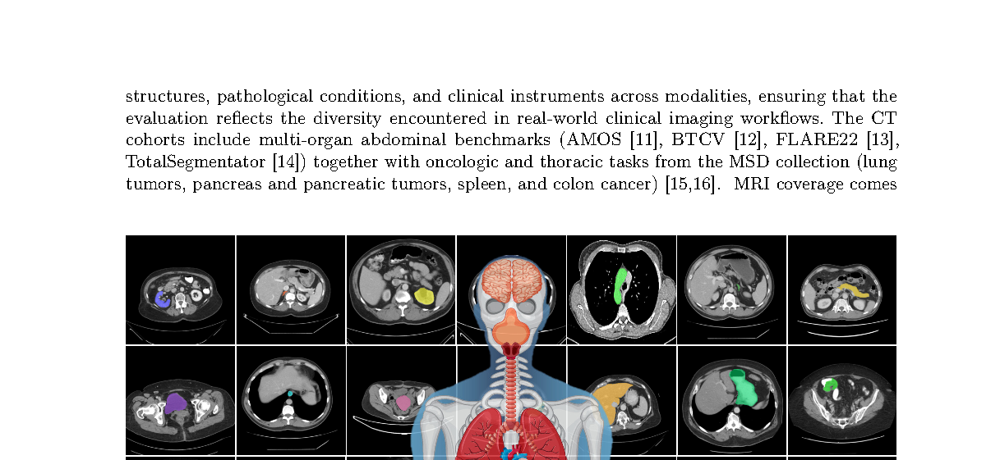

**Abstract**  
Foundation models, such as the Segment Anything Model (SAM), have heightened interest in promptable zero-shot segmentation. Although these models perform strongly on natural images, their behavior on medical data remains insufficiently characterized. While SAM 2 has been widely adopted for annotation in 3D medical workflows, the recently released SAM 3 introduces a new architecture that may change how visual prompts are interpreted and propagated. Therefore, to assess whether SAM 3 can serve as an out-of-the-box replacement for SAM 2 for zero-shot segmentation of 3D medical data, we present the first controlled comparison of both models by evaluating SAM 3 in its Promptable Visual Segmentation (PVS) mode using a variety of prompting strategies. We benchmark on 16 public datasets (CT, MRI, Ultrasound, endoscopy) covering 54 anatomical structures, pathologies, and surgical instruments. We further quantify three failure modes: prompt-frame over-segmentation, over-propagation after object disappearance, and temporal retention of well-initialized predictions. Our results show that SAM 3 is consistently stronger under click prompting across modalities, with fewer prompt-frame over-segmentation failures and slower prediction retention decay compared to SAM 2. Under bounding-box and mask prompts, performance gaps narrow in few structures of CT/MR and the models trade off termination behavior, while SAM 3 remains stronger on ultrasound and endoscopy sequences. The overall results position SAM 3 as the superior default choice for most medical segmentation tasks, while clarifying when SAM 2 remains a preferable propagator.

**Summary**  
TBD

[⬆ Back to Literature Table](#sam234zsmis)

---

### <a id="medsam3-delving-into-segment-anything-with-medic-54988e2e">MedSAM3: Delving into Segment Anything with Medical Concepts</a>
> **Venue:** arXiv.org 2025  
> **Authors:** A. Liu et al.  
> **Keywords:** OtherMIS, SAM2/3
**Links**  
[Viewable Link](https://arxiv.org/abs/2511.19046) [Original Link](https://arxiv.org/pdf/2511.19046) [Code](https://github.com/Joey-S-Liu/MedSAM3)

  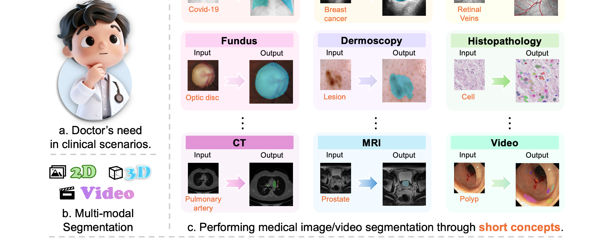

**Abstract**  
Medical image segmentation is fundamental for biomedical discovery. Existing methods lack generalizability and demand extensive, time-consuming manual annotation for new clinical application. Here, we propose MedSAM-3, a text promptable medical segmentation model for medical image and video segmentation. By fine-tuning the Segment Anything Model (SAM) 3 architecture on medical images paired with semantic conceptual labels, our MedSAM-3 enables medical Promptable Concept Segmentation (PCS), allowing precise targeting of anatomical structures via open-vocabulary text descriptions rather than solely geometric prompts. We further introduce the MedSAM-3 Agent, a framework that integrates Multimodal Large Language Models (MLLMs) to perform complex reasoning and iterative refinement in an agent-in-the-loop workflow. Comprehensive experiments across diverse medical imaging modalities, including X-ray, MRI, Ultrasound, CT, and video, demonstrate that our approach significantly outperforms existing specialist and foundation models. We will release our code and model at https://github.com/Joey-S-Liu/MedSAM3.

**Summary**  
TBD

[⬆ Back to Literature Table](#sam234others)

---

### <a id="zero-shot-stroke-lesion-segmentation-via-cam-gui-43ac53a2">Zero-shot Stroke Lesion Segmentation via CAM-guided Prompting of MedSAM2</a>
> **Venue:** 34th ACM International Conference on Information and Knowledge Management 2025  (CIKM, CCF B)
> **Authors:** M. Shokri et al.  
> **Keywords:** Zero-ShotMIS, SAM2/3
**Links**  
[Viewable Link](https://dl.acm.org/doi/10.1145/3746252.3760872) [Original Link](https://dl.acm.org/doi/abs/10.1145/3746252.3760872)

  <!-- Add image to imgs/ and uncomment the img tag below. -->
  <!--  -->

**Abstract**  
Accurate segmentation of stroke lesions in diffusion-weighted imaging (DWI) is crucial for clinical decision-making. However, automated infarct segmentation remains challenging due to variable infarct sizes and locations, and it is labor-intensive, requiring expert manual annotations for training. We propose a zero-shot framework to eliminate the need for manual segmentation labels by leveraging weak supervision from class activation maps (CAMs) to guide segmentation using MedSAM2, a foundation model for 3D medical image segmentation. By extracting attention maps from a fine-tuned ResNet on DWI scans labeled with stroke etiology (cause) and combining them with intensity information, we identify key regions and generate bounding-box prompts for MedSAM2. Our method achieves a Dice score of 54.2 ± 5.3% without any manual segmentation labels or tuning of the MedSAM2 model, demonstrating its potential as a scalable solution for reliable pseudo-label generation.

**Summary**  
TBD

[⬆ Back to Literature Table](#sam234zsmis)

---

### <a id="towards-better-ultrasound-video-segmentation-fou-27091b1b">Towards Better Ultrasound Video Segmentation Foundation Model: An Empirical study on SAM2 Finetuning from Data Perspective</a>
> **Venue:** arXiv.org 2025  
> **Authors:** X. Yao et al.  
> **Keywords:** Zero-ShotMIS, SAM2/3
**Links**  
[Viewable Link](https://arxiv.org/abs/2511.05731) [Original Link](https://arxiv.org/pdf/2511.05731)

  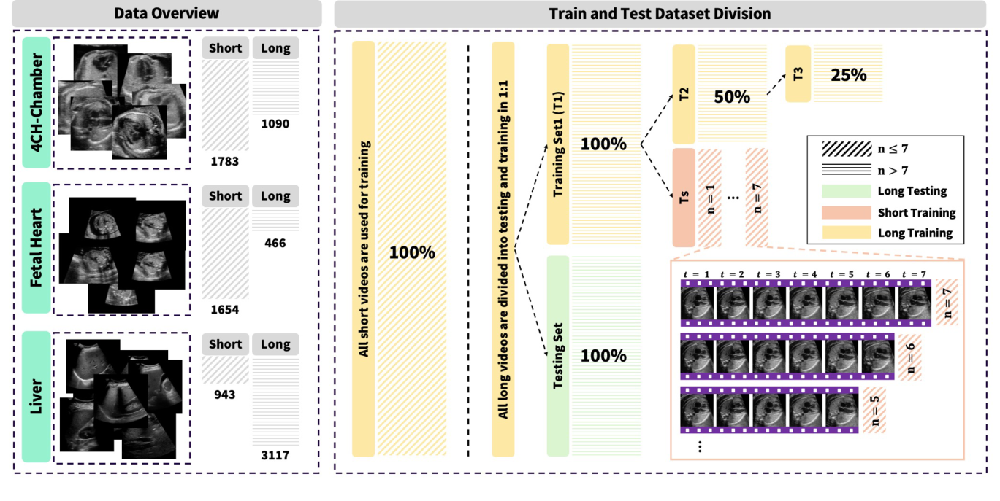

**Abstract**  
Ultrasound (US) video segmentation remains a challenging problem due to strong inter- and intra-dataset variability, motion artifacts, and limited annotated data. Although foundation models such as Segment Anything Model 2 (SAM2) demonstrate strong zero-shot and prompt-guided segmentation capabilities, their performance deteriorates substantially when transferred to medical imaging domains. Current adaptation studies mainly emphasize architectural modifications, while the influence of data characteristics and training regimes has not been systematically examined. In this study, we present a comprehensive, data-centric investigation of SAM2 adaptation for ultrasound video segmentation. We analyze how training-set size, video duration, and augmentation schemes affect adaptation performance under three paradigms: task-specific fine-tuning, intermediate adaptation, and multi-task joint training, across five SAM2 variants and multiple prompting modes. We further design six ultrasound-specific augmentations, assessing their effect relative to generic strategies. Experiments on three representative ultrasound datasets reveal that data scale and temporal context play a more decisive role than model architecture or initialization. Moreover, joint training offers an efficient compromise between modality alignment and task specialization. This work aims to provide empirical insights for developing efficient, data-aware adaptation pipelines for SAM2 in ultrasound video analysis.

**Summary**  
TBD

[⬆ Back to Literature Table](#sam234zsmis)

---

### <a id="esam2-bls-enhanced-segment-anything-model-2-for-ec0d5a28">ESAM2-BLS: Enhanced segment anything model 2 for efficient breast lesion segmentation in ultrasound imaging</a>
> **Venue:** Computerized Medical Imaging and Graphics 2025  
> **Authors:** L. Guo et al.  
> **Keywords:** OtherMIS, SAM2/3
**Links**  
[Viewable Link](https://linkinghub.elsevier.com/retrieve/pii/S0895611125001636) [Original Link](https://www.sciencedirect.com/science/article/abs/pii/S0895611125001636)

  <!-- Add image to imgs/ and uncomment the img tag below. -->
  <!--  -->

**Abstract**  
TBD

**Summary**  
TBD

[⬆ Back to Literature Table](#sam234others)

---

### <a id="sam-2-driven-self-training-for-mammogram-segment-a7b605d7">SAM 2-Driven Self-Training for Mammogram Segmentation: Zero-Shot Mask Generation Via Pseudo-Video</a>
> **Venue:** 2025 IEEE International Conference on Image Processing (ICIP, CCF C)   
> **Authors:** M. Fernandez et al.  
> **Keywords:** Zero-ShotMIS, SAM2/3
**Links**  
[Viewable Link](https://ieeexplore.ieee.org/document/11084376/) [Original Link](https://ieeexplore.ieee.org/abstract/document/11084376) [Code](https://github.com/MauricioFernandezM/Self-TrainingSAM)

  <!-- Add image to imgs/ and uncomment the img tag below. -->
  <!--  -->

**Abstract**  
Accurate mammogram segmentation is crucial for breast cancer diagnosis. However, existing Deep Learning methods often require large, annotated datasets, which are time-consuming and expensive to obtain. We introduce SAM 2-driven self-training, a novel approach that leverages SAM 2 for efficient and accurate mammogram segmentation. By constructing a pseudo-video sequence from static mammograms, we use SAM 2 video inference to generate initial masks, subsequently applying them for parameter-efficient adaptation of SAM, focusing on the mask decoder, and an automatic point prompt generator for enhanced usability. Our method significantly reduces the need for manual annotation while maintaining high accuracy. Evaluations on the mini-MIAS and CBIS-DDSM datasets demonstrate significant improvements in accuracy and efficiency compared to established techniques and the original SAM. This robust solution facilitates rapid mammogram segmentation and aids creating annotated datasets with minimal user intervention. The code is available at: https://github.com/MauricioFernandezM/Self-TrainingSAM.

**Summary**  
TBD

[⬆ Back to Literature Table](#sam234zsmis)

---

### <a id="sam2med3d-leveraging-video-foundation-models-for-ed8ec478">SAM2Med3D: Leveraging video foundation models for 3D breast MRI segmentation</a>
> **Venue:** Computers &amp; Graphics 2025  
> **Authors:** Y. Chen et al.  
> **Keywords:** OtherMIS, SAM2/3
**Links**  
[Viewable Link](https://linkinghub.elsevier.com/retrieve/pii/S0097849325001827) [Original Link](https://www.sciencedirect.com/science/article/abs/pii/S0097849325001827)

  <!-- Add image to imgs/ and uncomment the img tag below. -->
  <!--  -->

**Abstract**  
TBD

**Summary**  
TBD

[⬆ Back to Literature Table](#sam234others)

---

### <a id="vessel-sam2-adapting-segment-anything-2-for-patc-f33b6dd1">Vessel-SAM2: Adapting Segment Anything 2 for Patch-Free Retinal Vessel Segmentation in Ultra-High Resolution Fundus Images</a>
> **Venue:** IEEE Sensors Letters 2025  
> **Authors:** Z. Wu et al.  
> **Keywords:** OtherMIS, SAM2/3
**Links**  
[Viewable Link](https://ieeexplore.ieee.org/document/11107345/) [Original Link](https://ieeexplore.ieee.org/abstract/document/11107345)

  <!-- Add image to imgs/ and uncomment the img tag below. -->
  <!--  -->

**Abstract**  
Accurate automatic segmentation of blood vessels in ophthalmic images is crucial for the early diagnosis of many diseases. These images are typically high-resolution and contain intricate details of fine terminal vessels. However, most existing deep learning methods operate on lower resolutions, which limits their segmentation accuracy. Learning directly from high-resolution images faces significant challenges, as the computational overhead required by existing complex segmentation decoders can be impractical. To address these challenges, we propose Vessel-SAM2, a retinal vessel segmentation network based on Segment Anything 2 (SAM2), capable of performing end-to-end segmentation at an ultra-high resolution of 2048×2048 without the need for cumbersome patching. Vessel-SAM2 fine-tunes the pre-trained Hiera of SAM2 using adapters in a parameter-efficient manner, while its decoder incorporates an efficient attention aggregation mechanism. Extensive experiments demonstrate the superior performance of Vessel-SAM2.

**Summary**  
TBD

[⬆ Back to Literature Table](#sam234others)

---

### <a id="training-free-breast-ultrasound-image-segmentati-816e6d33">Training-Free Breast Ultrasound Image Segmentation With Retrieval-Based SAM2</a>
> **Venue:** IEEE Transactions on Biomedical Engineering 2026  
> **Authors:** J. He et al.  
> **Keywords:** Zero-ShotMIS, SAM2/3
**Links**  
[Viewable Link](https://ieeexplore.ieee.org/document/11113315/) [Original Link](https://ieeexplore.ieee.org/abstract/document/11113315)

  <!-- Add image to imgs/ and uncomment the img tag below. -->
  <!--  -->

**Abstract**  
The Training-Free automatic image Segmentation framework addresses challenges associated with supervised models, making it a promising method for improving breast cancer diagnosis.

**Summary**  
TBD

[⬆ Back to Literature Table](#sam234zsmis)

---

### <a id="freqsam2-unet-adapter-fine-tuning-frequency-awar-57e962a5">FreqSAM2-UNet: Adapter Fine-Tuning Frequency-Aware Network of SAM2 for Universal Medical Segmentation</a>
> **Venue:** Lecture Notes in Computer Science 2025  
> **Authors:** C. Wang et al.  
> **Keywords:** OtherMIS, SAM2/3
**Links**  
[Viewable Link](https://link.springer.com/10.1007/978-981-95-0036-9_26) [Original Link](https://link.springer.com/chapter/10.1007/978-981-95-0036-9_26)

  <!-- Add image to imgs/ and uncomment the img tag below. -->
  <!--  -->

**Abstract**  
Medical image segmentation plays a crucial role in accurate clinical diagnosis, requiring models to capture precise spatial boundary details in high-resolution images. However, during feature fusion, blurred boundaries often lead to boundary shifts and segmentation...

**Summary**  
TBD

[⬆ Back to Literature Table](#sam234others)

---

### <a id="depthwise-dilated-convolutional-adapters-for-med-3bd27bdf">Depthwise-Dilated Convolutional Adapters for Medical Object Tracking and Segmentation Using the Segment Anything Model 2</a>
> **Venue:** Machine Learning: Science and Technology 2025  
> **Authors:** G. Xu et al.  
> **Keywords:** OtherMIS, SAM2/3
**Links**  
[Viewable Link](https://iopscience.iop.org/article/10.1088/2632-2153/ae13d1) [Original Link](https://arxiv.org/pdf/2507.14613) [Code](https://github.com/apple1986/DD-SAM2)

  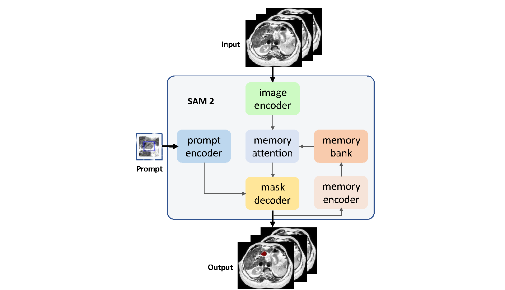

**Abstract**  
Recent advances in medical image segmentation have been driven by deep learning; however, most existing methods remain limited by modality-specific designs and exhibit poor adaptability to dynamic medical imaging scenarios. The Segment Anything Model 2 (SAM2) and its related variants, which introduce a streaming memory mechanism for real-time video segmentation, present new opportunities for prompt-based, generalizable solutions. Nevertheless, adapting these models to medical video scenarios typically requires large-scale datasets for retraining or transfer learning, leading to high computational costs and the risk of catastrophic forgetting. To address these challenges, we propose DD-SAM2, an efficient adaptation framework for SAM2 that incorporates a Depthwise-Dilated Adapter (DD-Adapter) to enhance multi-scale feature extraction with minimal parameter overhead. This design enables effective fine-tuning of SAM2 on medical videos with limited training data. Unlike existing adapter-based methods focused solely on static images, DD-SAM2 fully exploits SAM2's streaming memory for medical video object tracking and segmentation. Comprehensive evaluations on TrackRad2025 (tumor segmentation) and EchoNet-Dynamic (left ventricle tracking) datasets demonstrate superior performance, achieving Dice scores of 0.93 and 0.97, respectively. To the best of our knowledge, this work provides an initial attempt at systematically exploring adapter-based SAM2 fine-tuning for medical video segmentation and tracking. Code, datasets, and models will be publicly available at https://github.com/apple1986/DD-SAM2.

**Summary**  
TBD

[⬆ Back to Literature Table](#sam234others)

---

### <a id="improving-medical-image-segmentation-with-sam2-a-be4a6927">Improving Medical Image Segmentation with SAM2: Analyzing the Impact of Object Characteristics and Finetuning on Multi-Planar Datasets</a>
> **Venue:** European Journal of Radiology Artificial Intelligence 2025  
> **Authors:** E. Chukwujindu et al.  
> **Keywords:** OtherMIS, SAM2/3
**Links**  
[Viewable Link](https://linkinghub.elsevier.com/retrieve/pii/S3050577125000325) [Original Link](https://www.sciencedirect.com/science/article/pii/S3050577125000325) [Code](https://github.com/RadSam2/rad_sam2)

  <!-- Add image to imgs/ and uncomment the img tag below. -->
  <!--  -->

**Abstract**  
TBD

**Summary**  
TBD

[⬆ Back to Literature Table](#sam234others)

---

### <a id="samusa-segment-anything-model-2-for-ultrasound-a-4e4c55ae">SAMUSA: Segment Anything Model 2 for UltraSound Annotation</a>
> **Venue:** Lecture Notes in Computer Science 2026  
> **Authors:** B. Podvin et al.  
> **Keywords:** OtherMIS, SAM2/3
**Links**  
[Viewable Link](https://link.springer.com/10.1007/978-3-032-05141-7_49) [Original Link](https://www.researchgate.net/profile/Daniel-George-3/publication/393160079_SAMUSA_Segment_Anything_Model_2_for_UltraSound_Annotation/links/6862713d92697d42903be602/SAMUSA-Segment-Anything-Model-2-for-UltraSound-Annotation.pdf)

  <!-- Add image to imgs/ and uncomment the img tag below. -->
  <!--  -->

**Abstract**  
TBD

**Summary**  
TBD

[⬆ Back to Literature Table](#sam234others)

---

### <a id="crisp-sam2-sam2-with-cross-modal-interaction-and-aed849b6">CRISP-SAM2: SAM2 with Cross-Modal Interaction and Semantic Prompting for Multi-Organ Segmentation</a>
> **Venue:** 33rd ACM International Conference on Multimedia 2025  
> **Authors:** X. Yu et al.  
> **Keywords:** OtherMIS, SAM2/3
**Links**  
[Viewable Link](https://dl.acm.org/doi/10.1145/3746027.3755108) [Original Link](https://arxiv.org/pdf/2506.23121) [Code](https://github.com/YU-deep/CRISP_SAM2.git)

  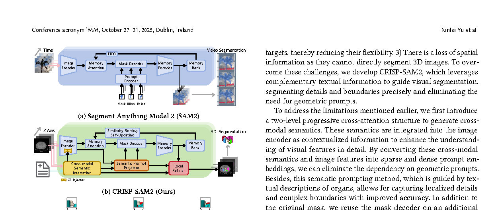

**Abstract**  
Multi-organ medical segmentation is a crucial component of medical image processing, essential for doctors to make accurate diagnoses and develop effective treatment plans. Despite significant progress in this field, current multi-organ segmentation models often suffer from inaccurate details, dependence on geometric prompts and loss of spatial information. Addressing these challenges, we introduce a novel model named CRISP-SAM2 with CRoss-modal Interaction and Semantic Prompting based on SAM2. This model represents a promising approach to multi-organ medical segmentation guided by textual descriptions of organs. Our method begins by converting visual and textual inputs into cross-modal contextualized semantics using a progressive cross-attention interaction mechanism. These semantics are then injected into the image encoder to enhance the detailed understanding of visual information. To eliminate reliance on geometric prompts, we use a semantic prompting strategy, replacing the original prompt encoder to sharpen the perception of challenging targets. In addition, a similarity-sorting self-updating strategy for memory and a mask-refining process is applied to further adapt to medical imaging and enhance localized details. Comparative experiments conducted on seven public datasets indicate that CRISP-SAM2 outperforms existing models. Extensive analysis also demonstrates the effectiveness of our method, thereby confirming its superior performance, especially in addressing the limitations mentioned earlier. Our code is available at: https://github.com/YU-deep/CRISP_SAM2.git.

**Summary**  
TBD

[⬆ Back to Literature Table](#sam234others)

---

### <a id="advancements-in-medical-image-classification-thr-7f9403ed">Advancements in Medical Image Classification through Fine-Tuning Natural Domain Foundation Models</a>
> **Venue:** 2025 IEEE International Conference on Image Processing (ICIP)  
> **Authors:** M. Mansoori et al.  
> **Keywords:** OtherMIS, SAM2/3
**Links**  
[Viewable Link](https://ieeexplore.ieee.org/document/11084641/) [Original Link](https://arxiv.org/pdf/2505.19779) [Code](https://github.com/sajjad-sh33/Medical-Transfer-Learning)

  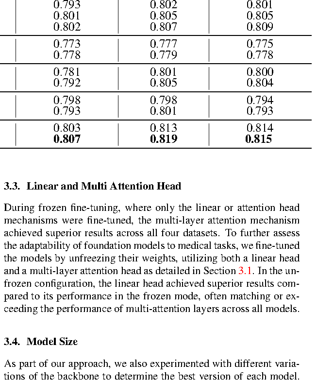

**Abstract**  
Using massive datasets, foundation models are large-scale, pre-trained models that perform a wide range of tasks. These models have shown consistently improved results with the introduction of new methods. It is crucial to analyze how these trends impact the medical field and determine whether these advancements can drive meaningful change. This study investigates the application of recent state-of-the-art foundation models, DINOv2, MAE, VMamba, CoCa, SAM2, and AIMv2, for medical image classification. We explore their effectiveness on datasets including CBIS-DDSM for mammography, ISIC2019 for skin lesions, APTOS2019 for diabetic retinopathy, and CHEXPERT for chest radiographs. By fine-tuning these models and evaluating their configurations, we aim to understand the potential of these advancements in medical image classification. The results indicate that these advanced models significantly enhance classification outcomes, demonstrating robust performance despite limited labeled data. Based on our results, AIMv2, DINOv2, and SAM2 models outperformed others, demonstrating that progress in natural domain training has positively impacted the medical domain and improved classification outcomes. Our code is publicly available at: https://github.com/sajjad-sh33/Medical-Transfer-Learning.

**Summary**  
TBD

[⬆ Back to Literature Table](#sam234others)

---

### <a id="samba-unet-synergizing-sam2-and-mamba-in-unet-wi-2606ca7d">SAMba-UNet: Synergizing SAM2 and Mamba in UNet with Heterogeneous Aggregation for Cardiac MRI Segmentation</a>
> **Venue:** 2025  
> **Authors:** G. Huo et al.  
> **Keywords:** OtherMIS, SAM2/3
**Links**  
[Viewable Link](https://arxiv.org/pdf/2505.16304)

  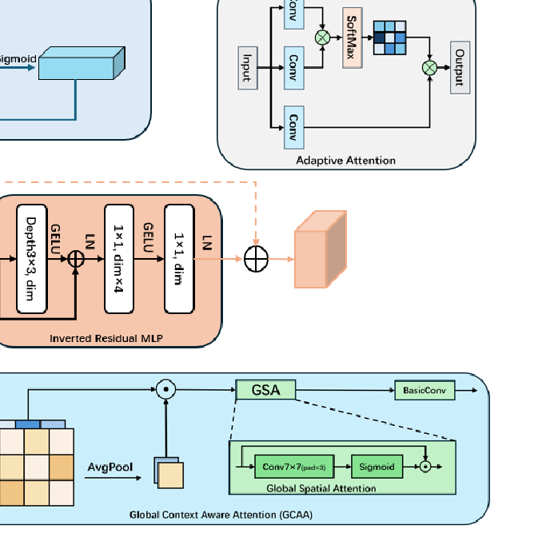

**Abstract**  
TBD

**Summary**  
TBD

[⬆ Back to Literature Table](#sam234others)

---

### <a id="accelerating-volumetric-medical-image-annotation-c4ec9531">Accelerating Volumetric Medical Image Annotation via Short-Long Memory SAM 2</a>
> **Venue:** IEEE Transactions on Medical Imaging 2026  
> **Authors:** Y. Chen et al.  
> **Keywords:** OtherMIS, SAM2/3
**Links**  
[Viewable Link](https://ieeexplore.ieee.org/document/11224387/) [Original Link](https://arxiv.org/pdf/2505.01854)

  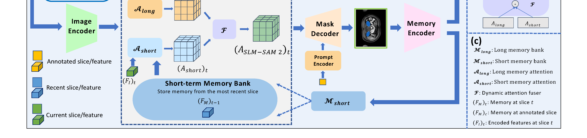

**Abstract**  
Manual annotation of volumetric medical images, such as magnetic resonance imaging (MRI) and computed tomography (CT), is a labor-intensive and time-consuming process. Recent advancements in foundation models for video object segmentation, such as Segment Anything Model 2 (SAM 2), offer a potential opportunity to significantly speed up the annotation process by manually annotating one or a few slices and then propagating target masks across the entire volume. However, the performance of SAM 2 in this context varies. Our experiments show that relying on a single memory bank and attention module is prone to error propagation, particularly at boundary regions where the target is present in the previous slice but absent in the current one. To address this problem, we propose Short-Long Memory SAM 2 (SLM-SAM 2), a novel architecture that integrates distinct short-term and long-term memory banks with separate attention modules to improve segmentation accuracy. We evaluate SLM-SAM 2 on four public datasets covering organs, bones, and muscles across MRI, CT, and ultrasound videos. We show that the proposed method markedly outperforms the default SAM 2, achieving an average Dice Similarity Coefficient improvement of 0.14 and 0.10 in the scenarios when 5 volumes and 1 volume are available for the initial adaptation, respectively. SLM-SAM 2 also exhibits stronger resistance to over-propagation, reducing the time required to correct propagated masks by 60.575% per volume compared to SAM 2, making a notable step toward more accurate automated annotation of medical images for segmentation model development.

**Summary**  
TBD

[⬆ Back to Literature Table](#sam234others)

---

### <a id="using-segment-anything-model-2-for-zero-shot-3d-406bff6d">Using Segment Anything Model 2 for Zero-Shot 3D Segmentation of Abdominal Organs in Computed Tomography Scans to Adapt Video Tracking Capabilities for 3D Medical Imaging: Algorithm Development and Validation</a>
> **Venue:** JMIR AI 2025  
> **Authors:** Y. Yamagishi et al.  
> **Keywords:** Zero-ShotMIS, SAM2/3
**Links**  
[Viewable Link](https://ai.jmir.org/2025/1/e72109)

  <!-- Add image to imgs/ and uncomment the img tag below. -->
  <!--  -->

**Abstract**  
SAM 2 demonstrated promising zero-shot performance in segmenting certain abdominal organs in CT scans, particularly larger organs. Performance was significantly influenced by input negative prompts and initial slice selection, highlighting the importance of optimizing these factors.

**Summary**  
TBD

[⬆ Back to Literature Table](#sam234zsmis)

---

### <a id="medsam2-segment-anything-in-3d-medical-images-an-9bde8144">MedSAM2: Segment Anything in 3D Medical Images and Videos</a>
> **Venue:** arXiv.org 2025  
> **Authors:** J. Ma et al.  
> **Keywords:** InteractiveMIS, SAM2/3
**Links**  
[Viewable Link](https://arxiv.org/abs/2504.03600) [Original Link](https://arxiv.org/pdf/2504.03600) [Code](https://github.com/bowang-lab/MedSAM2)

  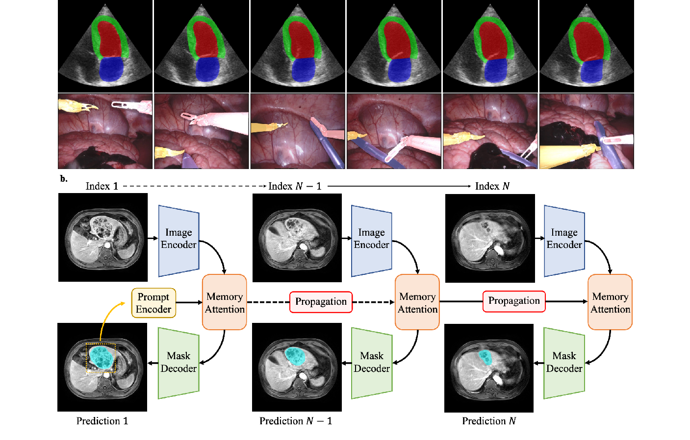

**Abstract**  
Medical image and video segmentation is a critical task for precision medicine, which has witnessed considerable progress in developing task or modality-specific and generalist models for 2D images. However, there have been limited studies on building general-purpose models for 3D images and videos with comprehensive user studies. Here, we present MedSAM2, a promptable segmentation foundation model for 3D image and video segmentation. The model is developed by fine-tuning the Segment Anything Model 2 on a large medical dataset with over 455,000 3D image-mask pairs and 76,000 frames, outperforming previous models across a wide range of organs, lesions, and imaging modalities. Furthermore, we implement a human-in-the-loop pipeline to facilitate the creation of large-scale datasets resulting in, to the best of our knowledge, the most extensive user study to date, involving the annotation of 5,000 CT lesions, 3,984 liver MRI lesions, and 251,550 echocardiogram video frames, demonstrating that MedSAM2 can reduce manual costs by more than 85%. MedSAM2 is also integrated into widely used platforms with user-friendly interfaces for local and cloud deployment, making it a practical tool for supporting efficient, scalable, and high-quality segmentation in both research and healthcare environments.

**Summary**  
这相工作还是很好的，提供了基于记忆的方案，并能够适配 3d 数据。不过 3d 分割能力还是需要加强。未能充分考虑多器官的情况。代码可以用。

[⬆ Back to Literature Table](#sam234iwmis)

---

### <a id="prompt-once-segment-everything-leveraging-sam-2-fc574ae1">Prompt Once, Segment Everything: Leveraging Sam 2 Potential for Infinite Medical Image Segmentation with a Single Prompt</a>
> **Venue:** Algorithms 2025  
> **Authors:** JD. Gutiérrez et al.  
> **Keywords:** OtherMIS, SAM2/3
**Links**  
[Viewable Link](https://www.mdpi.com/1999-4893/18/4/227)

  <!-- Add image to imgs/ and uncomment the img tag below. -->
  <!--  -->

**Abstract**  
TBD

**Summary**  
TBD

[⬆ Back to Literature Table](#sam234others)

---

### <a id="semi-automated-segmentation-of-magnitude-images-cac696be">Semi-automated segmentation of magnitude images in 4D flow MR scans using segment anything model 2 (SAM 2)</a>
> **Venue:** Medical Imaging 2025: Clinical and Biomedical Imaging  
> **Authors:** A. Kazemi et al.  
> **Keywords:** OtherMIS, SAM2/3
**Links**  
[Viewable Link](https://www.spiedigitallibrary.org/conference-proceedings-of-spie/13410/3051724/Semi-automated-segmentation-of-magnitude-images-in-4D-flow-MR/10.1117/12.3051724.full) [Original Link](https://www.spiedigitallibrary.org/conference-proceedings-of-spie/13410/1341026/Semi-automated-segmentation-of-magnitude-images-in-4D-flow-MR/10.1117/12.3051724.short)

  <!-- Add image to imgs/ and uncomment the img tag below. -->
  <!--  -->

**Abstract**  
Accurate segmentation of 4D flow MRI is essential for assessing hemodynamic biomarkers such as flow patterns and pressure gradients. We analyzed magnitude images in 5,440 4D flow MR images from 34 patients diagnosed with aortic stenosis using the Segment Anything Model 2 (SAM 2) with point and rectangle box prompting. SAM 2 consistently delivered strong performance. Compared to manual segmentations, SAM 2 achieved a Dice Similarity Coefficient (DSC) of 0.85 and an Intersection over Union (IoU) of 0.82, indicating the model’s robustness in segmenting magnitude images of 4D flow MR scans. SAM 2’s segmentation performance was particularly enhanced in regions with clearer vessel background contrast, highlighting the importance of contrast in accurate segmentation. The model’s ability to handle various cardiac phases reinforces its adaptability to different clinical conditions, demonstrating the potential utility of SAM 2 in 4D flow MRI segmentation within clinical settings.

**Summary**  
TBD

[⬆ Back to Literature Table](#sam234others)

---

### <a id="self-prompting-driven-sam2-for-3d-medical-image-cd20683a">Self-Prompting Driven SAM2 for 3D Medical Image Segmentation</a>
> **Venue:** ICASSP 2025 - 2025 IEEE International Conference on Acoustics, Speech and Signal Processing (ICASSP)  
> **Authors:** S. Wei et al.  
> **Keywords:** OtherMIS, SAM2/3
**Links**  
[Viewable Link](https://ieeexplore.ieee.org/document/10889344/) [Original Link](https://ieeexplore.ieee.org/document/10889344)

  <!-- Add image to imgs/ and uncomment the img tag below. -->
  <!--  -->

**Abstract**  
The latest advancement in large foundational model, SAM2, has demonstrated significant potential in 3D medical image segmentation due to their capability to effectively segment video streams. However, its application in medical image segmentation presents challenges, requiring extensive training on medical images or high-quality prompts provided by experts to achieve optimal performance. To address the aforementioned limitations, we propose SAM2-SP, which adopts Low-Rank Adaption for parameter-efficient fine-tuning and introduces a novel dynamic self-prompting strategy that generates most confident prompt templates from voxel features, enabling SAM2 to achieve domain adaptation in medical image segmentation without reliance on expert-level prompts. Extensive experiments show that SAM2-SP achieves state-of-the-art performance on the public Synapse dataset and the private EDC dataset, and even outperforms the compared task-specific segmentation approaches, the vanilla SAM and other SAM-based approaches.

**Summary**  
TBD

[⬆ Back to Literature Table](#sam234others)

---

### <a id="rethinking-few-shot-medical-image-segmentation-b-e1f08ac9">Rethinking Few-Shot Medical Image Segmentation by SAM2: A Training-Free Framework with Augmentative Prompting and Dynamic Matching</a>
> **Venue:** arXiv.org 2025  
> **Authors:** H. Zu et al.  
> **Keywords:** Zero-ShotMIS, SAM2/3
**Links**  
[Viewable Link](https://arxiv.org/abs/2503.04826) [Original Link](https://arxiv.org/pdf/2503.04826)

  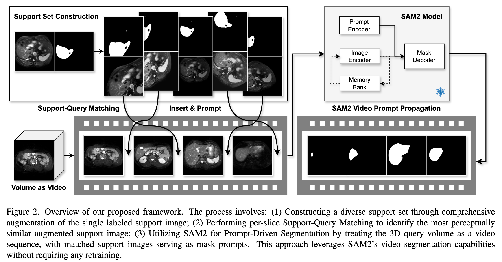

**Abstract**  
The reliance on large labeled datasets presents a significant challenge in medical image segmentation. Few-shot learning offers a potential solution, but existing methods often still require substantial training data. This paper proposes a novel approach that leverages the Segment Anything Model 2 (SAM2), a vision foundation model with strong video segmentation capabilities. We conceptualize 3D medical image volumes as video sequences, departing from the traditional slice-by-slice paradigm. Our core innovation is a support-query matching strategy: we perform extensive data augmentation on a single labeled support image and, for each frame in the query volume, algorithmically select the most analogous augmented support image. This selected image, along with its corresponding mask, is used as a mask prompt, driving SAM2's video segmentation. This approach entirely avoids model retraining or parameter updates. We demonstrate state-of-the-art performance on benchmark few-shot medical image segmentation datasets, achieving significant improvements in accuracy and annotation efficiency. This plug-and-play method offers a powerful and generalizable solution for 3D medical image segmentation.

**Summary**  
TBD

[⬆ Back to Literature Table](#sam234zsmis)

---

### <a id="proxy-prompt-endowing-sam-sam2with-auto-interact-8f0cff77">Proxy Prompt: Endowing SAM & SAM2with Auto-Interactive-Prompt for Medical Segmentation</a>
> **Venue:** 2025  
> **Authors:** X. Wang et al.  
> **Keywords:** InteractiveMIS, SAM2/3
**Links**  
[Viewable Link](https://arxiv.org/pdf/2502.03501)

  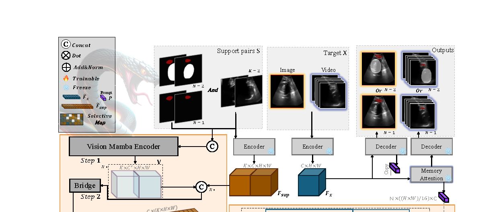

**Abstract**  
TBD

**Summary**  
TBD

[⬆ Back to Literature Table](#sam234iwmis)

---

### <a id="rfmedsam-2-automatic-prompt-refinement-for-enhan-8b6b56ca">RFMedSAM 2: Automatic Prompt Refinement for Enhanced Volumetric Medical Image Segmentation with SAM 2</a>
> **Venue:** arXiv.org 2025  
> **Authors:** B. Xie et al.  
> **Keywords:** Zero-ShotMIS, SAM2/3
**Links**  
[Viewable Link](https://arxiv.org/abs/2502.02741) [Original Link](https://arxiv.org/pdf/2502.02741)

  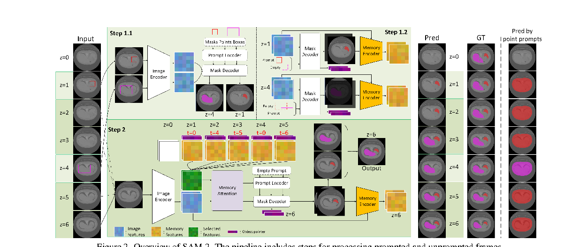

**Abstract**  
Segment Anything Model 2 (SAM 2), a prompt-driven foundation model extending SAM to both image and video domains, has shown superior zero-shot performance compared to its predecessor. Building on SAM's success in medical image segmentation, SAM 2 presents significant potential for further advancement. However, similar to SAM, SAM 2 is limited by its output of binary masks, inability to infer semantic labels, and dependence on precise prompts for the target object area. Additionally, direct application of SAM and SAM 2 to medical image segmentation tasks yields suboptimal results. In this paper, we explore the upper performance limit of SAM 2 using custom fine-tuning adapters, achieving a Dice Similarity Coefficient (DSC) of 92.30% on the BTCV dataset, surpassing the state-of-the-art nnUNet by 12%. Following this, we address the prompt dependency by investigating various prompt generators. We introduce a UNet to autonomously generate predicted masks and bounding boxes, which serve as input to SAM 2. Subsequent dual-stage refinements by SAM 2 further enhance performance. Extensive experiments show that our method achieves state-of-the-art results on the AMOS2022 dataset, with a Dice improvement of 2.9% compared to nnUNet, and outperforms nnUNet by 6.4% on the BTCV dataset.

**Summary**  
TBD

[⬆ Back to Literature Table](#sam234zsmis)

---

### <a id="scalable-evaluation-framework-for-foundation-mod-39a30423">Scalable Evaluation Framework for Foundation Models in Musculoskeletal MRI Bridging Computational Innovation with Clinical Utility</a>
> **Venue:** 2025  
> **Authors:** G. Hoyer et al.  
> **Keywords:** OtherMIS, SAM2/3
**Links**  
[Viewable Link](https://arxiv.org/pdf/2501.13376)

  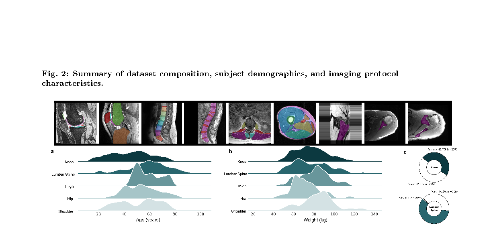

**Abstract**  
TBD

**Summary**  
TBD

[⬆ Back to Literature Table](#sam234others)

---

### <a id="few-shot-adaptation-of-training-free-foundation-8b31dd67">Few-Shot Adaptation of Training-Free Foundation Model for 3D Medical Image Segmentation</a>
> **Venue:** arXiv.org 2025  
> **Authors:** X. He et al.  
> **Keywords:** Zero-ShotMIS, SAM2/3
**Links**  
[Viewable Link](https://arxiv.org/abs/2501.09138) [Original Link](https://arxiv.org/pdf/2501.09138)

  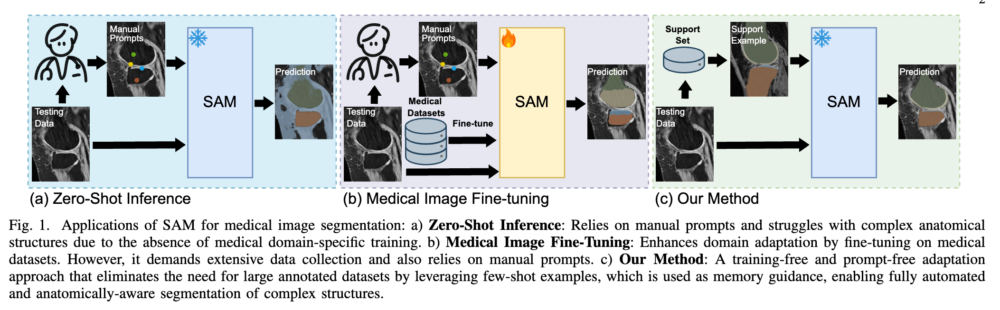

  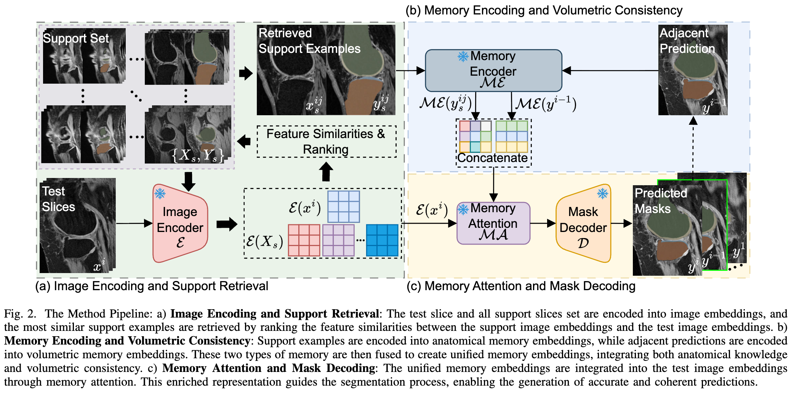

**Abstract**  
Vision foundation models have achieved remarkable progress across various image analysis tasks. In the image segmentation task, foundation models like the Segment Anything Model (SAM) enable generalizable zero-shot segmentation through user-provided prompts. However, SAM primarily trained on natural images, lacks the domain-specific expertise of medical imaging. This limitation poses challenges when applying SAM to medical image segmentation, including the need for extensive fine-tuning on specialized medical datasets and a dependency on manual prompts, which are both labor-intensive and require intervention from medical experts. This work introduces the Few-shot Adaptation of Training-frEe SAM (FATE-SAM), a novel method designed to adapt the advanced Segment Anything Model 2 (SAM2) for 3D medical image segmentation. FATE-SAM reassembles pre-trained modules of SAM2 to enable few-shot adaptation, leveraging a small number of support examples to capture anatomical knowledge and perform prompt-free segmentation, without requiring model fine-tuning. To handle the volumetric nature of medical images, we incorporate a Volumetric Consistency mechanism that enhances spatial coherence across 3D slices. We evaluate FATE-SAM on multiple medical imaging datasets and compare it with supervised learning methods, zero-shot SAM approaches, and fine-tuned medical SAM methods. Results show that FATE-SAM delivers robust and accurate segmentation while eliminating the need for large annotated datasets and expert intervention. FATE-SAM provides a practical, efficient solution for medical image segmentation, making it more accessible for clinical applications.

**Summary**  
和 TNNLS 的那篇文章很像，Training free 的方法，都是检索出已标注的数据，来形成记忆，让 SAM2 记住，然后再去对新数据进行分割。

[⬆ Back to Literature Table](#sam234zsmis)

---

### <a id="adapting-sam2-model-from-natural-images-for-toot-dd60d7fc">Adapting SAM2 Model from Natural Images for Tooth Segmentation in Dental Panoramic X-Ray Images</a>
> **Venue:** Entropy 2024  
> **Authors:** Z. Li et al.  
> **Keywords:** OtherMIS, SAM2/3
**Links**  
[Viewable Link](https://www.mdpi.com/1099-4300/26/12/1059)

  <!-- Add image to imgs/ and uncomment the img tag below. -->
  <!--  -->

**Abstract**  
Dental panoramic X-ray imaging, due to its high cost-effectiveness and low radiation dose, has become a widely used diagnostic tool in dentistry. Accurate tooth segmentation is crucial for lesion analysis and treatment planning, helping dentists to quickly and precisely assess the condition of teeth. However, dental X-ray images often suffer from noise, low contrast, and overlapping anatomical structures, coupled with limited available datasets, leading traditional deep learning models to experience overfitting, which affects generalization ability. In addition, high-precision deep models typically require significant computational resources for inference, making deployment in real-world applications challenging. To address these challenges, this paper proposes a tooth segmentation method based on the pre-trained SAM2 model. We employ adapter modules to fine-tune the SAM2 model and introduce ScConv modules and gated attention mechanisms to enhance the model's semantic understanding and multi-scale feature extraction capabilities for medical images. In terms of efficiency, we utilize knowledge distillation, using the fine-tuned SAM2 model as the teacher model for distilling knowledge to a smaller model named LightUNet. Experimental results on the UFBA-UESC dataset show that, in terms of performance, our model significantly outperforms the traditional UNet model in multiple metrics such as IoU, effectively improving segmentation accuracy and model robustness, particularly with limited sample datasets. In terms of efficiency, LightUNet achieves comparable performance to UNet, but with only 1.6% of its parameters and 24.0% of the inference time, demonstrating its feasibility for deployment on edge devices.

**Summary**  
TBD

[⬆ Back to Literature Table](#sam234others)

---

### <a id="self-prompting-polyp-segmentation-in-colonoscopy-15431981">Self-Prompting Polyp Segmentation in Colonoscopy using Hybrid Yolo-SAM 2 Model</a>
> **Venue:** ICASSP 2025 - 2025 IEEE International Conference on Acoustics, Speech and Signal Processing (ICASSP)  
> **Authors:** M. Mansoori et al.  
> **Keywords:** OtherMIS, SAM2/3
**Links**  
[Viewable Link](https://ieeexplore.ieee.org/document/10887638/) [Original Link](https://arxiv.org/pdf/2409.09484) [Code](https://github.com/sajjad-sh33/YOLO_SAM2)

  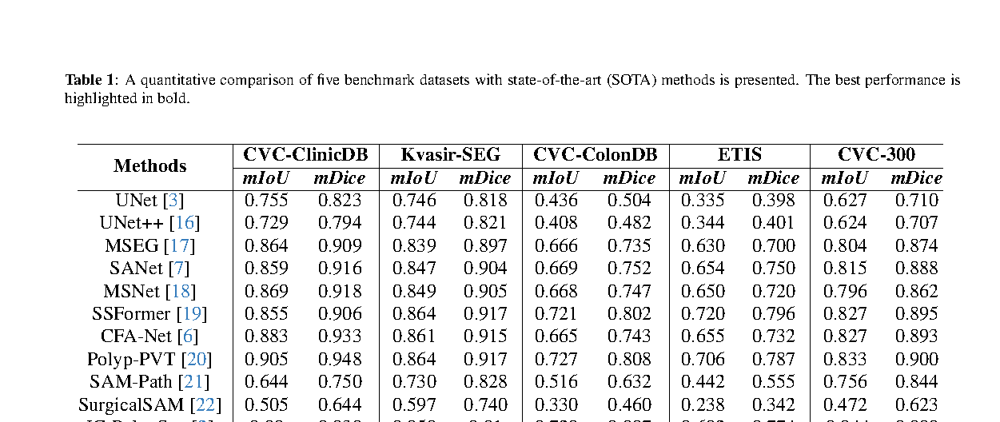

**Abstract**  
Early diagnosis and treatment of polyps during colonoscopy are essential for reducing the incidence and mortality of Colorectal Cancer (CRC). However, the variability in polyp characteristics and the presence of artifacts in colonoscopy images and videos pose significant challenges for accurate and efficient polyp detection and segmentation. This paper presents a novel approach to polyp segmentation by integrating the Segment Anything Model (SAM 2) with the YOLOv8 model. Our method leverages YOLOv8's bounding box predictions to autonomously generate input prompts for SAM 2, thereby reducing the need for manual annotations. We conducted exhaustive tests on five benchmark colonoscopy image datasets and two colonoscopy video datasets, demonstrating that our method exceeds state-of-the-art models in both image and video segmentation tasks. Notably, our approach achieves high segmentation accuracy using only bounding box annotations, significantly reducing annotation time and effort. This advancement holds promise for enhancing the efficiency and scalability of polyp detection in clinical settings https://github.com/sajjad-sh33/YOLO_SAM2.

**Summary**  
TBD

[⬆ Back to Literature Table](#sam234others)

---

### <a id="sam-octa2-layer-sequence-octa-segmentation-with-8df9f75d">SAM-OCTA2: Layer Sequence OCTA Segmentation with Fine-tuned Segment Anything Model 2</a>
> **Venue:** ICASSP 2025 - 2025 IEEE International Conference on Acoustics, Speech and Signal Processing (ICASSP)  
> **Authors:** X. Chen et al.  
> **Keywords:** OtherMIS, SAM2/3
**Links**  
[Viewable Link](https://ieeexplore.ieee.org/document/10888853/) [Original Link](https://arxiv.org/pdf/2409.09286) [Code](https://github.com/ShellRedia/SAM-OCTA2)

  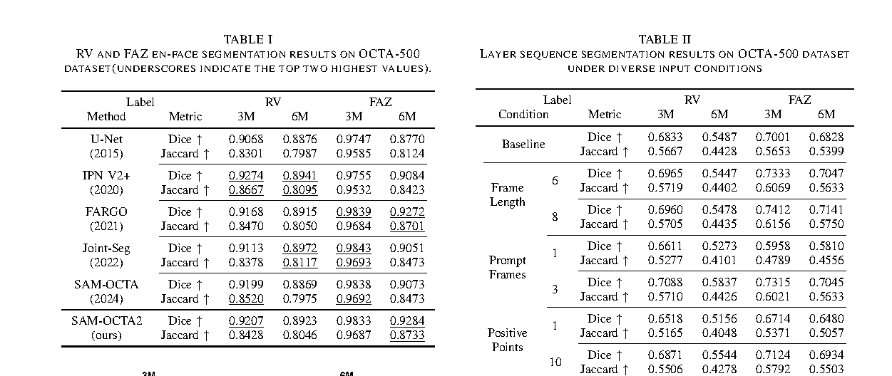

**Abstract**  
Segmentation of indicated targets aids in the precise analysis of optical coherence tomography angiography (OCTA) samples. Existing segmentation methods typically perform on 2D projection targets, making it challenging to capture the variance of segmented objects through the 3D volume. To address this limitation, the low-rank adaptation technique is adopted to fine-tune the Segment Anything Model (SAM) version 2, enabling the tracking and segmentation of specified objects across the OCTA scanning layer sequence. To further this work, a prompt point generation strategy in frame sequence and a sparse annotation method to acquire retinal vessel (RV) layer masks are proposed. This method is named SAM-OCTA2 and has been experimented on the OCTA-500 dataset. It achieves state-of-the-art performance in segmenting the foveal avascular zone (FAZ) on regular 2D en-face and effectively tracks local vessels across scanning layer sequences. The code is available at: https://github.com/ShellRedia/SAM-OCTA2.

**Summary**  
TBD

[⬆ Back to Literature Table](#sam234others)

---

### <a id="retrieval-augmented-few-shot-medical-image-segme-ec75cd75">Retrieval-augmented Few-shot Medical Image Segmentation with Foundation Models</a>
> **Venue:** IEEE Transactions on Neural Networks and Learning Systems 2025  
> **Authors:** L. Zhao et al.  
> **Keywords:** Few-ShotMIS, SAM2/3
**Links**  
[Viewable Link](https://ieeexplore.ieee.org/document/11021654/) [Original Link](https://arxiv.org/pdf/2408.08813)

  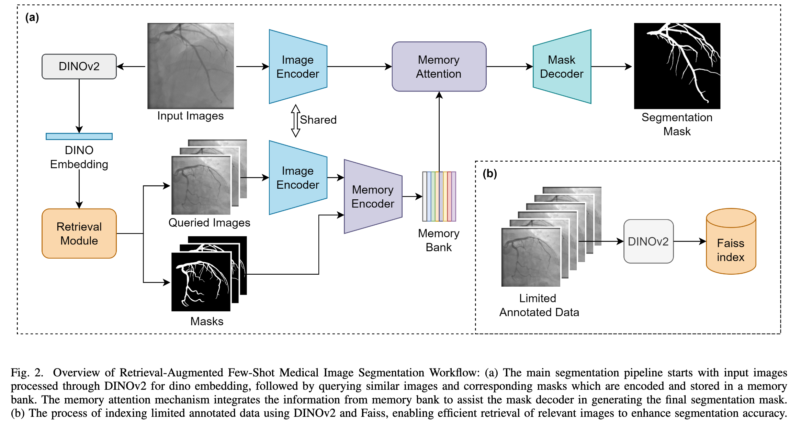

**Abstract**  
Medical image segmentation is crucial for clinical decision-making, but the scarcity of annotated data presents significant challenges. Few-shot segmentation (FSS) methods show promise but often require training on the target domain and struggle to generalize across different modalities. Similarly, adapting foundation models like the Segment Anything Model (SAM) for medical imaging has limitations, including the need for finetuning and domain-specific adaptation. To address these issues, we propose a novel method that adapts DINOv2 and Segment Anything Model 2 (SAM 2) for retrieval-augmented few-shot medical image segmentation. Our approach uses DINOv2's feature as query to retrieve similar samples from limited annotated data, which are then encoded as memories and stored in memory bank. With the memory attention mechanism of SAM 2, the model leverages these memories as conditions to generate accurate segmentation of the target image. We evaluated our framework on three medical image segmentation tasks, demonstrating superior performance and generalizability across various modalities without the need for any retraining or finetuning. Overall, this method offers a practical and effective solution for few-shot medical image segmentation and holds significant potential as a valuable annotation tool in clinical applications.

**Summary**  
这篇工作提供了一种 Training free 的方式，来解决受限标注条件下MIS的问题，核心买点就是利用了 SAM2 的记忆。我愿称之为“过目不忘“。原本 SAM2 的记忆是基于视频训练出来的，具备前后帧相似性的记忆，也就是“过目不忘“的能力，而这篇文章就考虑，在少量已标注数据上，让 SAM2 过目不忘对应的标注，然后再利用检索的方式，利用 DINOv2 把这些数据都进行编码，得到对应的 embedding，这样一旦有新数据进来，就先从已标注库中检索相似编码的样本，然后拿着这些样本的记忆去推理新样本，这样新样本就得到了分割结果。

[⬆ Back to Literature Table](#sam234fsmis)

---

### <a id="sam-sam-2-in-3d-slicer-segmentwithsam-extension-80154364">SAM & SAM 2 in 3D Slicer: SegmentWithSAM Extension for Annotating Medical Images</a>
> **Venue:** 2024  
> **Authors:** Z. Yildiz et al.  
> **Keywords:** OtherMIS, SAM2/3
**Links**  
[Viewable Link](https://arxiv.org/pdf/2408.15224) [Code](https://github.com/mazurowski-lab/SlicerSegmentWithSAM)

  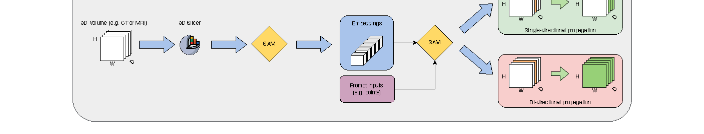

**Abstract**  
TBD

**Summary**  
TBD

[⬆ Back to Literature Table](#sam234others)

---

### <a id="a-short-review-and-evaluation-of-sam2-s-performa-d5027d82">A Short Review and Evaluation of SAM2's Performance in 3D CT Image Segmentation</a>
> **Venue:** arXiv.org 2024  
> **Authors:** Y. He et al.  
> **Keywords:** Zero-ShotMIS, SAM2/3
**Links**  
[Viewable Link](https://arxiv.org/abs/2408.11210) [Original Link](https://arxiv.org/pdf/2408.11210) [Code](https://github.com/Project-MONAI/VISTA)

**Abstract**  
Since the release of Segment Anything 2 (SAM2), the medical imaging community has been actively evaluating its performance for 3D medical image segmentation. However, different studies have employed varying evaluation pipelines, resulting in conflicting outcomes that obscure a clear understanding of SAM2's capabilities and potential applications. We shortly review existing benchmarks and point out that the SAM2 paper clearly outlines a zero-shot evaluation pipeline, which simulates user clicks iteratively for up to eight iterations. We reproduced this interactive annotation simulation on 3D CT datasets and provided the results and code~\url{https://github.com/Project-MONAI/VISTA}. Our findings reveal that directly applying SAM2 on 3D medical imaging in a zero-shot manner is far from satisfactory. It is prone to generating false positives when foreground objects disappear, and annotating more slices cannot fully offset this tendency. For smaller single-connected objects like kidney and aorta, SAM2 performs reasonably well but for most organs it is still far behind state-of-the-art 3D annotation methods. More research and innovation are needed for 3D medical imaging community to use SAM2 correctly.

**Summary**  
文章验证了 SAM2 还有很大的研究空间。然后顺带宣传了一下 VISTA3D。很强。

[⬆ Back to Literature Table](#sam234zsmis)

---

### <a id="sam2-unet-segment-anything-2-makes-strong-encode-8acf7e84">SAM2-UNet: segment anything 2 makes strong encoder for natural and medical image segmentation</a>
> **Venue:** Visual Intelligence 2026  
> **Authors:** X. Xiong et al.  
> **Keywords:** OtherMIS, SAM2/3
**Links**  
[Viewable Link](https://link.springer.com/10.1007/s44267-025-00106-w) [Original Link](https://arxiv.org/pdf/2408.08870) [Code](https://github.com/WZH0120/SAM2-UNet)

  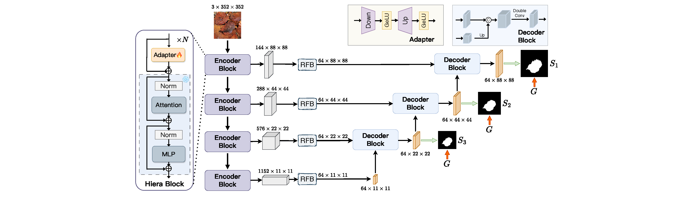

**Abstract**  
Abstract Image segmentation plays an important role in vision understanding. Recently, the emerging vision foundation models continuously achieved superior performance on various tasks. Following such success, in this paper, we prove that the Segment Anything Model 2 (SAM2) can be a strong encoder for U-shaped segmentation models. We propose a simple but effective framework, termed SAM2-UNet, for versatile image segmentation. Specifically, SAM2-UNet adopts the Hiera backbone of SAM2 as the encoder, while the decoder uses the classic U-shaped design. Additionally, adapters are inserted into the encoder to enable parameter-efficient fine-tuning. Preliminary experiments on various downstream tasks, such as camouflaged object detection, salient object detection, marine animal segmentation, mirror detection, and polyp segmentation, demonstrate that our SAM2-UNet can outperform existing specialized state-of-the-art methods with minimal additional complexity.

**Summary**  
TBD

[⬆ Back to Literature Table](#sam234others)

---

### <a id="surgical-sam-2-real-time-segment-anything-in-sur-c37ec715">Surgical SAM 2: Real-time Segment Anything in Surgical Video by Efficient Frame Pruning</a>
> **Venue:** arXiv.org 2024  
> **Authors:** H. Liu et al.  
> **Keywords:** OtherMIS, SAM2/3
**Links**  
[Viewable Link](https://arxiv.org/abs/2408.07931) [Original Link](https://arxiv.org/pdf/2408.07931) [Code](https://github.com/jinlab-imvr/Surgical-SAM-2)

  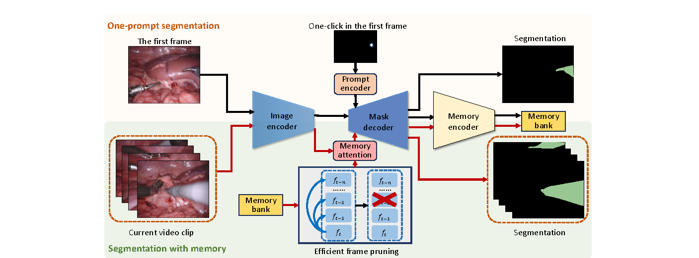

**Abstract**  
Surgical video segmentation is a critical task in computer-assisted surgery and is vital for enhancing surgical quality and patient outcomes. Recently, the Segment Anything Model 2 (SAM2) framework has shown superior advancements in image and video segmentation. However, SAM2 struggles with efficiency due to the high computational demands of processing high-resolution images and complex and long-range temporal dynamics in surgical videos. To address these challenges, we introduce Surgical SAM 2 (SurgSAM2), an advanced model to utilize SAM2 with an Efficient Frame Pruning (EFP) mechanism, to facilitate real-time surgical video segmentation. The EFP mechanism dynamically manages the memory bank by selectively retaining only the most informative frames, reducing memory usage and computational cost while maintaining high segmentation accuracy. Our extensive experiments demonstrate that SurgSAM2 significantly improves both efficiency and segmentation accuracy compared to the vanilla SAM2. Remarkably, SurgSAM2 achieves a 3$\times$ FPS compared with SAM2, while also delivering state-of-the-art performance after fine-tuning with lower-resolution data. These advancements establish SurgSAM2 as a leading model for surgical video analysis, making real-time surgical video segmentation in resource-constrained environments a reality. Our source code is available at https://github.com/jinlab-imvr/Surgical-SAM-2.

**Summary**  
TBD

[⬆ Back to Literature Table](#sam234others)

---

### <a id="zero-shot-3d-segmentation-of-abdominal-organs-in-3ba96501">Zero-shot 3D Segmentation of Abdominal Organs in CT Scans Using Segment Anything Model 2: Adapting Video Tracking Capabilities for 3D Medical Imaging</a>
> **Venue:** arXiv.org 2024  
> **Authors:** Y. Yamagishi et al.  
> **Keywords:** Zero-ShotMIS, SAM2/3
**Links**  
[Viewable Link](https://arxiv.org/abs/2408.06170) [Original Link](https://arxiv.org/pdf/2408.06170)

**Abstract**  
Objectives: To evaluate the zero-shot performance of Segment Anything Model 2 (SAM 2) in 3D segmentation of abdominal organs in CT scans, and to investigate the effects of prompt settings on segmentation results. Materials and Methods: In this retrospective study, we used a subset of the TotalSegmentator CT dataset from eight institutions to assess SAM 2's ability to segment eight abdominal organs. Segmentation was initiated from three different z-coordinate levels (caudal, mid, and cranial levels) of each organ. Performance was measured using the Dice similarity coefficient (DSC). We also analyzed the impact of "negative prompts," which explicitly exclude certain regions from the segmentation process, on accuracy. Results: 123 patients (mean age, 60.7 \pm 15.5 years; 63 men, 60 women) were evaluated. As a zero-shot approach, larger organs with clear boundaries demonstrated high segmentation performance, with mean DSCs as follows: liver 0.821 \pm 0.192, right kidney 0.862 \pm 0.212, left kidney 0.870 \pm 0.154, and spleen 0.891 \pm 0.131. Smaller organs showed lower performance: gallbladder 0.531 \pm 0.291, pancreas 0.361 \pm 0.197, and adrenal glands, right 0.203 \pm 0.222, left 0.308 \pm 0.234. The initial slice for segmentation and the use of negative prompts significantly influenced the results. By removing negative prompts from the input, the DSCs significantly decreased for six organs. Conclusion: SAM 2 demonstrated promising zero-shot performance in segmenting certain abdominal organs in CT scans, particularly larger organs. Performance was significantly influenced by input negative prompts and initial slice selection, highlighting the importance of optimizing these factors.

**Summary**  
TBD

[⬆ Back to Literature Table](#sam234zsmis)

---

### <a id="polyp-sam-2-advancing-zero-shot-polyp-segmentati-cb1cf69c">Polyp SAM 2: Advancing Zero shot Polyp Segmentation in Colorectal Cancer Detection</a>
> **Venue:** 2025 IEEE 5th International Conference on Human-Machine Systems (ICHMS)  
> **Authors:** M. Mansoori et al.  
> **Keywords:** Zero-ShotMIS, SAM2/3
**Links**  
[Viewable Link](https://ieeexplore.ieee.org/document/11154309/) [Original Link](https://arxiv.org/pdf/2408.05892) [Code](https://github.com/sajjad-sh33/Polyp-SAM-2)

  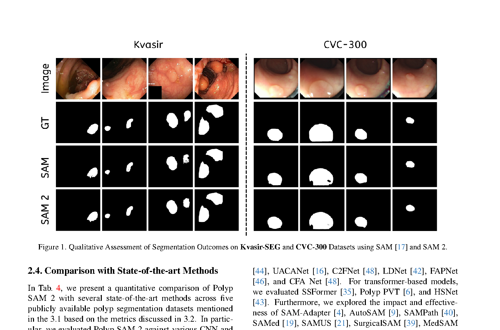

**Abstract**  
Polyp segmentation plays a crucial role in the early detection and diagnosis of colorectal cancer. However, obtaining accurate segmentations often requires labor-intensive annotations and specialized models. Recently, Meta AI Research released a general Segment Anything Model 2 (SAM 2), which has demonstrated promising performance in several segmentation tasks. In this manuscript, we evaluate the performance of SAM 2 in segmenting polyps under various prompted settings. We hope this report will provide insights to advance the field of polyp segmentation and promote more interesting work in the future. This project is publicly available at https://github.com/sajjad-sh33/Polyp-SAM-2.

**Summary**  
TBD

[⬆ Back to Literature Table](#sam234zsmis)

---

### <a id="novel-adaptation-of-video-segmentation-to-3d-mri-24039159">Novel adaptation of video segmentation to 3D MRI: efficient zero-shot knee segmentation with SAM2</a>
> **Venue:** Medical Imaging 2025: Imaging Informatics  
> **Authors:** AS. Yu et al.  
> **Keywords:** Zero-ShotMIS, SAM2/3
**Links**  
[Viewable Link](https://www.spiedigitallibrary.org/conference-proceedings-of-spie/13411/3047346/Novel-adaptation-of-video-segmentation-to-3D-MRI--efficient/10.1117/12.3047346.full) [Original Link](https://arxiv.org/pdf/2408.04762)

  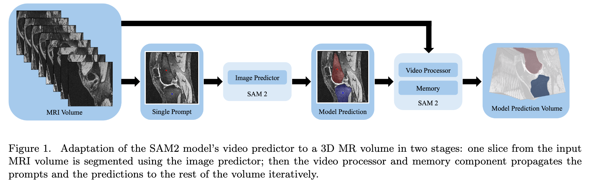

**Abstract**  
Intelligent medical image segmentation methods are rapidly evolving and being increasingly applied, yet they face the challenge of domain transfer, where algorithm performance degrades due to different data distributions between source and target domains. To address this, we introduce a method for zero-shot, single-prompt segmentation of 3D knee MRI by adapting Segment Anything Model 2 (SAM2), a general-purpose segmentation model designed to accept prompts and retain memory across frames of a video. By treating slices from 3D medical volumes as individual video frames, we leverage SAM2's advanced capabilities to generate motion- and spatially-aware predictions. We demonstrate that SAM2 can efficiently perform segmentation tasks in a zero-shot manner with no additional training or fine-tuning, accurately delineating structures in knee MRI scans using only a single prompt. Our experiments on the Osteoarthritis Initiative Zuse Institute Berlin (OAI-ZIB) dataset reveal that SAM2 achieves high accuracy on 3D knee bone segmentation, with a testing Dice similarity coefficient of 0.9643 on tibia. We also present results generated using different SAM2 model sizes, different prompt schemes, as well as comparative results from the SAM1 model deployed on the same dataset. This breakthrough has the potential to revolutionize medical image analysis by providing a scalable, cost-effective solution for automated segmentation, paving the way for broader clinical applications and streamlined workflows.

**Summary**  
TBD

[⬆ Back to Literature Table](#sam234zsmis)

---

### <a id="sam-2-in-robotic-surgery-an-empirical-evaluation-cb73ba9b">SAM 2 in Robotic Surgery: An Empirical Evaluation for Robustness and Generalization in Surgical Video Segmentation</a>
> **Venue:** Lecture Notes in Computer Science 2026  
> **Authors:** J. Yu et al.  
> **Keywords:** Zero-ShotMIS, SAM2/3
**Links**  
[Viewable Link](https://link.springer.com/10.1007/978-3-032-13961-0_18) [Original Link](https://arxiv.org/pdf/2408.04593)

  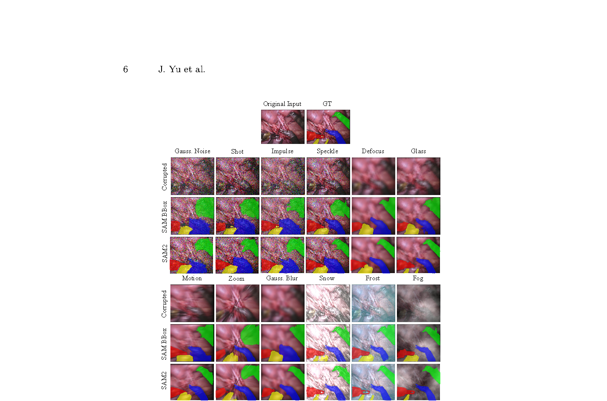

**Abstract**  
The recent Segment Anything Model (SAM) 2 has demonstrated remarkable foundational competence in semantic segmentation, with its memory mechanism and mask decoder further addressing challenges in video tracking and object occlusion, thereby achieving superior results in interactive segmentation for both images and videos. Building upon our previous empirical studies, we further explore the zero-shot segmentation performance of SAM 2 in robot-assisted surgery based on prompts, alongside its robustness against real-world corruption. For static images, we employ two forms of prompts: 1-point and bounding box, while for video sequences, the 1-point prompt is applied to the initial frame. Through extensive experimentation on the MICCAI EndoVis 2017 and EndoVis 2018 benchmarks, SAM 2, when utilizing bounding box prompts, outperforms state-of-the-art (SOTA) methods in comparative evaluations. The results with point prompts also exhibit a substantial enhancement over SAM's capabilities, nearing or even surpassing existing unprompted SOTA methodologies. Besides, SAM 2 demonstrates improved inference speed and less performance degradation against various image corruption. Although slightly unsatisfactory results remain in specific edges or regions, SAM 2's robust adaptability to 1-point prompts underscores its potential for downstream surgical tasks with limited prompt requirements.

**Summary**  
机器人辅助手术视频分割。

[⬆ Back to Literature Table](#sam234zsmis)

---

### <a id="sam2-adapter-evaluating-adapting-segment-anythin-098b6d29">SAM2-Adapter: Evaluating & Adapting Segment Anything 2 in Downstream Tasks: Camouflage, Shadow, Medical Image Segmentation, and More</a>
> **Venue:** 2024  
> **Authors:** T. Chen et al.  
> **Keywords:** OtherMIS, SAM2/3
**Links**  
[Viewable Link](https://arxiv.org/pdf/2408.04579)

  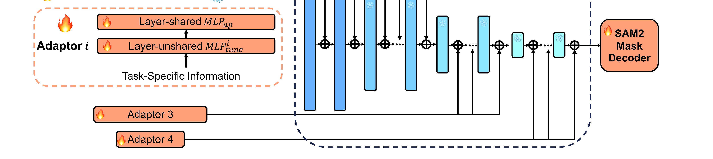

**Abstract**  
TBD

**Summary**  
TBD

[⬆ Back to Literature Table](#sam234others)

---

### <a id="is-sam-2-better-than-sam-in-medical-image-segmen-7cc5ed0e">Is SAM 2 Better than SAM in Medical Image Segmentation?</a>
> **Venue:** Medical Imaging 2025: Image Processing  
> **Authors:** S. Sengupta et al.  
> **Keywords:** Zero-ShotMIS, SAM2/3
**Links**  
[Viewable Link](https://www.spiedigitallibrary.org/conference-proceedings-of-spie/13406/3047370/Is-SAM-2-better-than-SAM-in-medical-image-segmentation/10.1117/12.3047370.full) [Original Link](https://arxiv.org/pdf/2408.04212)

  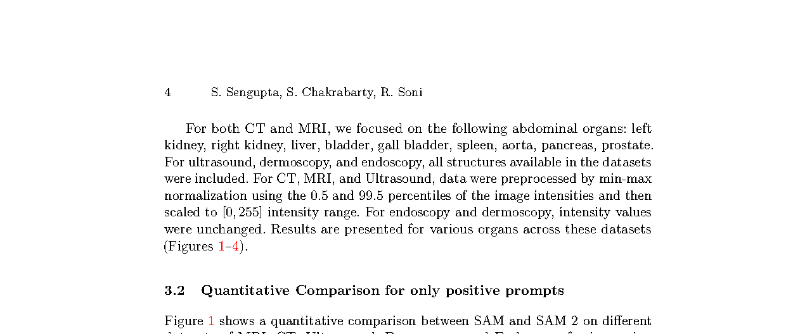

**Abstract**  
The Segment Anything Model (SAM) has demonstrated impressive performance in zero-shot promptable segmentation on natural images. The recently released Segment Anything Model 2 (SAM 2) claims to outperform SAM on images and extends the model's capabilities to video segmentation. Evaluating the performance of this new model in medical image segmentation, specifically in a zero-shot promptable manner, is crucial. In this work, we conducted extensive studies using multiple datasets from various imaging modalities to compare the performance of SAM and SAM 2. We employed two point-prompt strategies: (i) multiple positive prompts where one prompt is placed near the centroid of the target structure, while the remaining prompts are randomly placed within the structure, and (ii) combined positive and negative prompts where one positive prompt is placed near the centroid of the target structure, and two negative prompts are positioned outside the structure, maximizing the distance from the positive prompt and from each other. The evaluation encompassed 24 unique organ-modality combinations, including abdominal structures, cardiac structures, fetal head images, skin lesions and polyp images across 11 publicly available MRI, CT, ultrasound, dermoscopy, and endoscopy datasets. Preliminary results based on 2D images indicate that while SAM 2 may perform slightly better in a few cases, it does not generally surpass SAM for medical image segmentation. Notably, SAM 2 performs worse than SAM in lower contrast imaging modalities, such as CT and ultrasound. However, for MRI images, SAM 2 performs on par with or better than SAM. Like SAM, SAM 2 also suffers from over-segmentation issues, particularly when the boundaries of the target organ are fuzzy.

**Summary**  
在这项工作中，进行了一项系统性的评估研究，以比较SAM和SAM 2的性能。在未来的研究中，将使用3D医学图像和生物成像的时间间隔视频进行更深入的分析。主要观察结果是:
- SAM 2在CT、超声成像方面的表现较差，但在MRI成像方面表现略好。它在皮肤镜检查、内窥镜检查方面的表现与SAM相似。这表明SAM 2对于低对比度医学成像方式来说是一个相对较差的选择。
- 借助负面提示，在大多数情况下，SAM 2的表现要么与SAM非常相似，要么优于SAM。

[⬆ Back to Literature Table](#sam234zsmis)

---

### <a id="performance-and-nonadversarial-robustness-of-the-cfdbb3ed">Performance and nonadversarial robustness of the segment anything model 2 in surgical video segmentation</a>
> **Venue:** Medical Imaging 2025: Image-Guided Procedures, Robotic Interventions, and Modeling  
> **Authors:** Y. Shen et al.  
> **Keywords:** Zero-ShotMIS, SAM2/3
**Links**  
[Viewable Link](https://www.spiedigitallibrary.org/conference-proceedings-of-spie/13408/3047383/Performance-and-nonadversarial-robustness-of-the-segment-anything-model-2/10.1117/12.3047383.full) [Original Link](https://arxiv.org/pdf/2408.04098)

  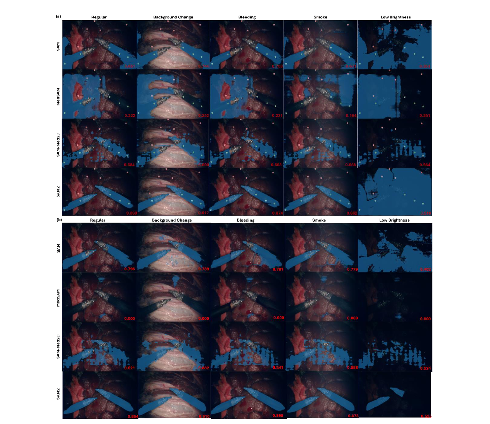

**Abstract**  
Fully supervised deep learning (DL) models for surgical video segmentation have been shown to struggle with non-adversarial, real-world corruptions of image quality including smoke, bleeding, and low illumination. Foundation models for image segmentation, such as the segment anything model (SAM) that focuses on interactive prompt-based segmentation, move away from semantic classes and thus can be trained on larger and more diverse data, which offers outstanding zero-shot generalization with appropriate user prompts. Recently, building upon this success, SAM-2 has been proposed to further extend the zero-shot interactive segmentation capabilities from independent frame-by-frame to video segmentation. In this paper, we present a first experimental study evaluating SAM-2’s performance on surgical video data. Leveraging the SegSTRONG-C MICCAI EndoVIS 2024 sub-challenge dataset, we assess SAM-2’s effectiveness on uncorrupted endoscopic sequences and evaluate its non-adversarial robustness on videos with corrupted image quality simulating smoke, bleeding, and low brightness conditions under various prompt strategies. Our experiments demonstrate that SAM-2, in zeroshot manner, can achieve competitive or even superior performance compared to fully-supervised deep learning models on surgical video data, including under non-adversarial corruptions of image quality. Additionally, SAM- 2 consistently outperforms the original SAM and its medical variants across all conditions. Finally, frame-sparse prompting can consistently outperform frame-wise prompting for SAM-2, suggesting that allowing SAM-2 to leverage its temporal modeling capabilities leads to more coherent and accurate segmentation compared to frequent prompting.

**Summary**  
研究 SAM2 在手术视频上鲁棒性，关注在内窥镜。

[⬆ Back to Literature Table](#sam234zsmis)

---

### <a id="sam2-path-a-better-segment-anything-model-for-se-5cf08e5c">SAM2-PATH: A better segment anything model for semantic segmentation in digital pathology</a>
> **Venue:** 2024  
> **Authors:** M. Zhang et al.  
> **Keywords:** OtherMIS, SAM2/3
**Links**  
[Viewable Link](https://arxiv.org/pdf/2408.03651) [Code](https://github.com/simzhangbest/SAM2PATH)

  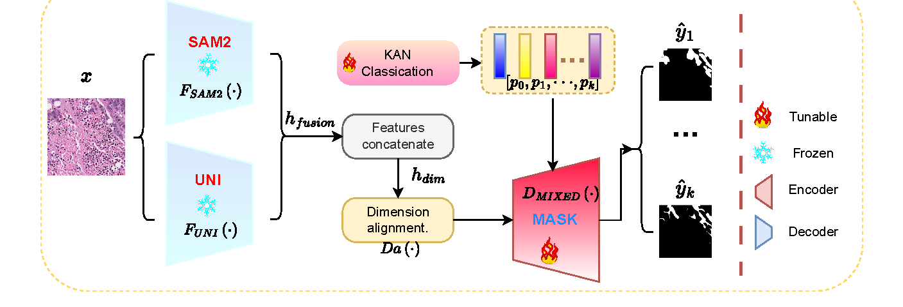

**Abstract**  
TBD

**Summary**  
TBD

[⬆ Back to Literature Table](#sam234others)

---

### <a id="segment-anything-in-medical-images-and-videos-be-c913c54f">Segment Anything in Medical Images and Videos: Benchmark and Deployment</a>
> **Venue:** arXiv.org 2024  
> **Authors:** J. Ma et al.  
> **Keywords:** OtherMIS, SAM2/3
**Links**  
[Viewable Link](https://arxiv.org/abs/2408.03322) [Original Link](https://arxiv.org/pdf/2408.03322) [Code](https://github.com/bowang-lab/MedSAM)

  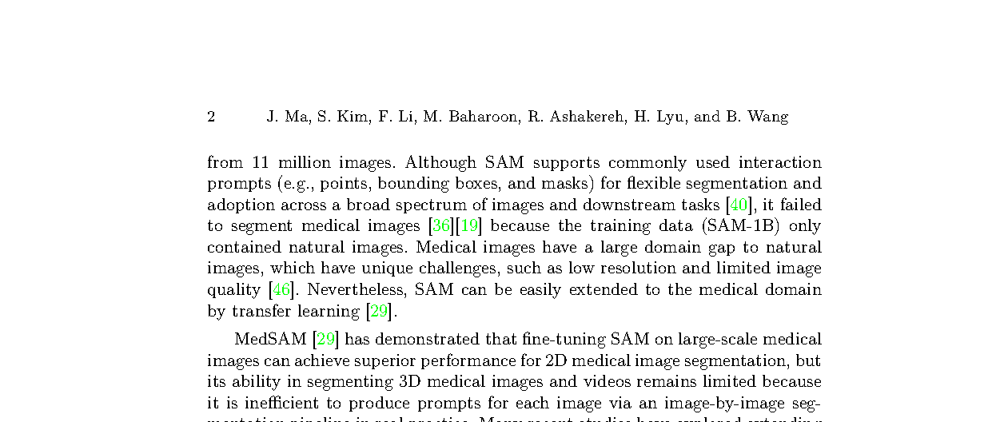

**Abstract**  
Recent advances in segmentation foundation models have enabled accurate and efficient segmentation across a wide range of natural images and videos, but their utility to medical data remains unclear. In this work, we first present a comprehensive benchmarking of the Segment Anything Model 2 (SAM2) across 11 medical image modalities and videos and point out its strengths and weaknesses by comparing it to SAM1 and MedSAM. Then, we develop a transfer learning pipeline and demonstrate SAM2 can be quickly adapted to medical domain by fine-tuning. Furthermore, we implement SAM2 as a 3D slicer plugin and Gradio API for efficient 3D image and video segmentation. The code has been made publicly available at \url{https://github.com/bowang-lab/MedSAM}.

**Summary**  
TBD

[⬆ Back to Literature Table](#sam234others)

---

### <a id="biomedical-sam-2-segment-anything-in-biomedical-5fda9d03">Biomedical SAM 2: Segment Anything in Biomedical Images and Videos</a>
> **Venue:** arXiv.org 2024  
> **Authors:** Z. Yan et al.  
> **Keywords:** OtherMIS, SAM2/3
**Links**  
[Viewable Link](https://arxiv.org/abs/2408.03286) [Original Link](https://arxiv.org/pdf/2408.03286) [Code](https://github.com/ZhilingYan/Biomedical-SAM-2)

  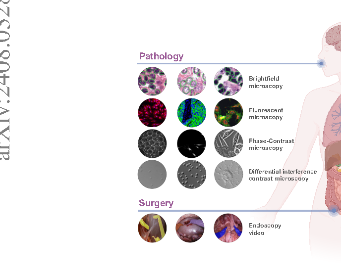

**Abstract**  
Medical image segmentation and video object segmentation are essential for diagnosing and analyzing diseases by identifying and measuring biological structures. Recent advances in natural domain have been driven by foundation models like the Segment Anything Model 2 (SAM-2). To explore the performance of SAM-2 in biomedical applications, we designed three evaluation pipelines for single-frame 2D image segmentation, multi-frame 3D image segmentation and multi-frame video segmentation with varied prompt designs, revealing SAM-2's limitations in medical contexts. Consequently, we developed BioSAM-2, an enhanced foundation model optimized for biomedical data based on SAM-2. Our experiments show that BioSAM-2 not only surpasses the performance of existing state-of-the-art foundation models but also matches or even exceeds specialist models, demonstrating its efficacy and potential in the medical domain.

**Summary**  
TBD

[⬆ Back to Literature Table](#sam234others)

---

### <a id="interactive-3d-medical-image-segmentation-with-s-bfc855bf">Interactive 3D Medical Image Segmentation with SAM 2</a>
> **Venue:** arXiv.org 2024  
> **Authors:** C. Shen et al.  
> **Keywords:** Zero-ShotMIS, SAM2/3
**Links**  
[Viewable Link](https://arxiv.org/abs/2408.02635) [Original Link](https://arxiv.org/pdf/2408.02635) [Code](https://github.com/Chuyun-Shen/SAM_2_Medical_3D)

  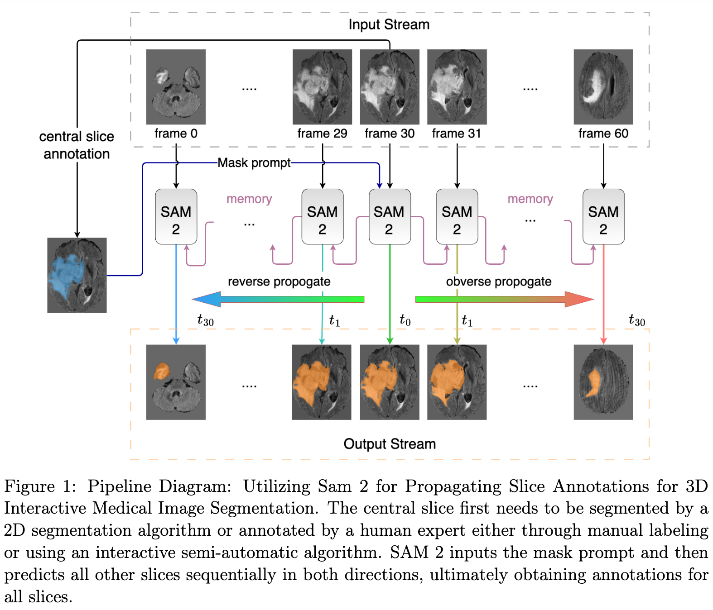

**Abstract**  
Interactive medical image segmentation (IMIS) has shown significant potential in enhancing segmentation accuracy by integrating iterative feedback from medical professionals. However, the limited availability of enough 3D medical data restricts the generalization and robustness of most IMIS methods. The Segment Anything Model (SAM), though effective for 2D images, requires expensive semi-auto slice-by-slice annotations for 3D medical images. In this paper, we explore the zero-shot capabilities of SAM 2, the next-generation Meta SAM model trained on videos, for 3D medical image segmentation. By treating sequential 2D slices of 3D images as video frames, SAM 2 can fully automatically propagate annotations from a single frame to the entire 3D volume. We propose a practical pipeline for using SAM 2 in 3D medical image segmentation and present key findings highlighting its efficiency and potential for further optimization. Concretely, numerical experiments on the BraTS2020 and the medical segmentation decathlon datasets demonstrate that SAM 2 still has a gap with supervised methods but can narrow the gap in specific settings and organ types, significantly reducing the annotation burden on medical professionals. Our code will be open-sourced and available at https://github.com/Chuyun-Shen/SAM_2_Medical_3D.

**Summary**  
验证 SAM2 在 3d 医学图像中的分割能力，还有进步的空间。

[⬆ Back to Literature Table](#sam234iwmis)

---

### <a id="zero-shot-surgical-tool-segmentation-in-monocula-3a1aef32">Zero-Shot Surgical Tool Segmentation in Monocular Video Using Segment Anything Model 2</a>
> **Venue:** Medical Imaging 2025: Image Processing  
> **Authors:** A. Lou et al.  
> **Keywords:** Zero-ShotMIS, SAM2/3
**Links**  
[Viewable Link](https://www.spiedigitallibrary.org/conference-proceedings-of-spie/13406/3047479/Zero-shot-surgical-tool-segmentation-in-monocular-video-using-Segment/10.1117/12.3047479.full) [Original Link](https://arxiv.org/pdf/2408.01648) [Code](https://github.com/AngeLouCN/SAM-2_Surgical_Video)

  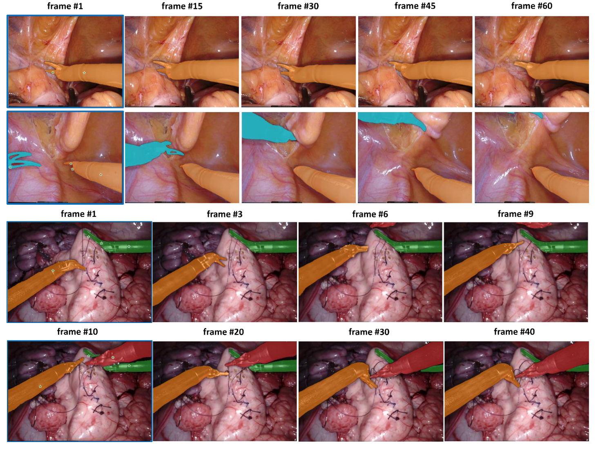

**Abstract**  
The Segment Anything Model 2 (SAM 2) is the latest generation foundation model for image and video segmentation. Trained on the expansive Segment Anything Video (SA-V) dataset, which comprises 35.5 million masks across 50.9K videos, SAM 2 advances its predecessor's capabilities by supporting zero-shot segmentation through various prompts (e.g., points, boxes, and masks). Its robust zero-shot performance and efficient memory usage make SAM 2 particularly appealing for surgical tool segmentation in videos, especially given the scarcity of labeled data and the diversity of surgical procedures. In this study, we evaluate the zero-shot video segmentation performance of the SAM 2 model across different types of surgeries, including endoscopy and microscopy. We also assess its performance on videos featuring single and multiple tools of varying lengths to demonstrate SAM 2's applicability and effectiveness in the surgical domain. We found that: 1) SAM 2 demonstrates a strong capability for segmenting various surgical videos; 2) When new tools enter the scene, additional prompts are necessary to maintain segmentation accuracy; and 3) Specific challenges inherent to surgical videos can impact the robustness of SAM 2.

**Summary**  
手术视频

[⬆ Back to Literature Table](#sam234zsmis)

---

### <a id="medical-sam-2-segment-medical-images-as-video-vi-c5d7ee91">Medical SAM 2: Segment medical images as video via Segment Anything Model 2</a>
> **Venue:** arXiv.org 2024  
> **Authors:** J. Zhu et al.  
> **Keywords:** InteractiveMIS, SAM2/3
**Links**  
[Viewable Link](https://arxiv.org/abs/2408.00874) [Original Link](https://arxiv.org/pdf/2408.00874) [Code](https://github.com/MedicineToken/Medical-SAM2)

  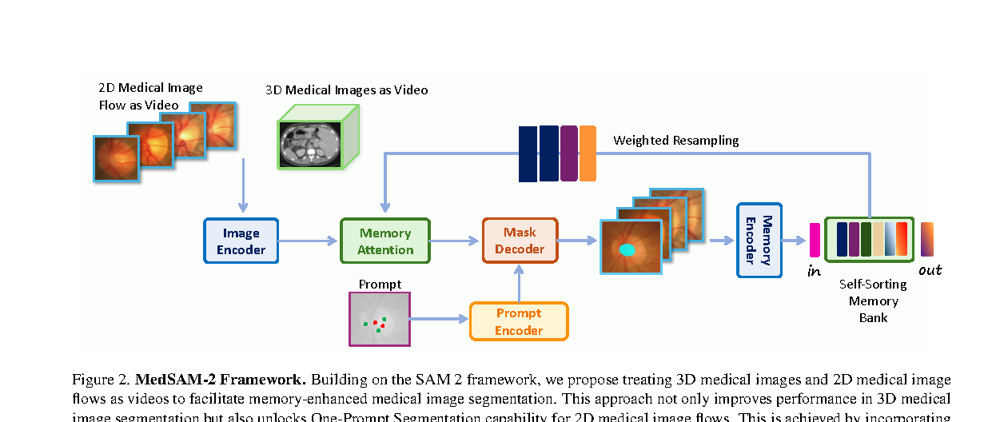

**Abstract**  
Medical image segmentation plays a pivotal role in clinical diagnostics and treatment planning, yet existing models often face challenges in generalization and in handling both 2D and 3D data uniformly. In this paper, we introduce Medical SAM 2 (MedSAM-2), a generalized auto-tracking model for universal 2D and 3D medical image segmentation. The core concept is to leverage the Segment Anything Model 2 (SAM2) pipeline to treat all 2D and 3D medical segmentation tasks as a video object tracking problem. To put it into practice, we propose a novel \emph{self-sorting memory bank} mechanism that dynamically selects informative embeddings based on confidence and dissimilarity, regardless of temporal order. This mechanism not only significantly improves performance in 3D medical image segmentation but also unlocks a \emph{One-Prompt Segmentation} capability for 2D images, allowing segmentation across multiple images from a single prompt without temporal relationships. We evaluated MedSAM-2 on five 2D tasks and nine 3D tasks, including white blood cells, optic cups, retinal vessels, mandibles, coronary arteries, kidney tumors, liver tumors, breast cancer, nasopharynx cancer, vestibular schwannoma, mediastinal lymph nodules, cerebral artery, inferior alveolar nerve, and abdominal organs, comparing it against state-of-the-art (SOTA) models in task-tailored, general and interactive segmentation settings. Our findings demonstrate that MedSAM-2 surpasses a wide range of existing models and updates new SOTA on several benchmarks. The code is released on the project page: https://supermedintel.github.io/Medical-SAM2/.

**Summary**  
TBD

[⬆ Back to Literature Table](#sam234iwmis)

---

### <a id="segment-anything-model-2-an-application-to-2d-an-91bc686c">Segment Anything Model 2: An Application to 2D and 3D Medical Images</a>
> **Venue:** IEEE Transactions on Biomedical Engineering 2026  
> **Authors:** H. Dong et al.  
> **Keywords:** InteractiveMIS, SAM2/3
**Links**  
[Viewable Link](https://ieeexplore.ieee.org/document/11347005/) [Original Link](https://arxiv.org/pdf/2408.00756)

  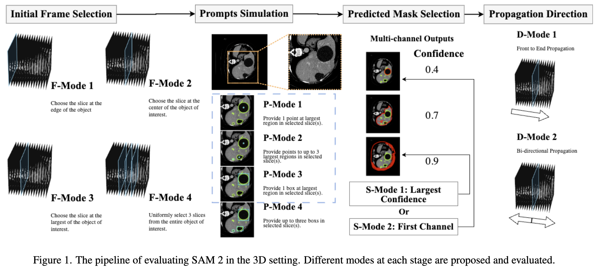

**Abstract**  
Segment Anything Model (SAM) has gained significant attention because of its ability to segment a variety of objects in images upon providing a prompt. Recently developed SAM 2 has extended this ability to video segmentation, and by substituting the third spatial dimension in 3D images for the time dimension in videos, it opens an opportunity to apply SAM 2 to 3D medical images. In this paper, we extensively evaluate SAM 2's ability to segment both 2D and 3D medical images using 80 prompt strategies across 21 medical imaging datasets, including 2D modalities (X-ray and ultrasound), 3D modalities (magnetic resonance imaging, computed tomography, and positron emission tomography), and surgical videos. We find that in the 2D setting, SAM 2 performs similarly to SAM, while in the 3D setting we observe that: (1) selecting the first mask is more effective than choosing the one with the highest confidence, (2) prompting the slice with the largest object appears is the most cost-effective strategy when only one slice is prompted, (3) box prompts result in higher performance than point prompts at a slightly higher annotation cost, (4) bidirectional propagation outperforms front-to-end propagation, (5) interactive annotation is rarely effective, (6) SAM 2, without fine-tuning, achieves 3D IoU from 0.32 with a single point prompt to 0.51 with a ground truth mask on one slice, and exceeds 0.8 on certain datasets when using box or ground-truth prompts, a level that begins to approach clinical usefulness. These findings demonstrate that SAM 2's ability to segment 3D medical images can be improved with our proposed strategies over the default ones, providing practical guidance for using SAM 2 for prompt-based 3D medical image segmentation.

**Summary**  
这是一项很有意义的工作，作者们对 SAM2 在 3d 医学图像上进行了尝试，并得到了很有价值的参考。结论是：
- 在选择哪一帧的提示上，选择类别中心切片作为提示时，效果最好；当可以选择多帧作为提示时，效果要比单帧要好。
- 提示方面，box 形式的提示，要比 point 形式要好。
- 与从头到尾的传播方式相比，从中间有注释的切片开始双向传播，是一种更有效的方式。
- 交互式分割，只有在人工标注新切片时（就是能提供 mask 级别提示），才会有效果。
- SAM 2 在 3d 上最佳性能，是对于整个 volume，同时提供 point、box 和 mask。

[⬆ Back to Literature Table](#sam234iwmis)

---

### <a id="fm-adapt-foundation-model-adaptation-with-photoa-f5300d4a">FM-Adapt: Foundation model adaptation with photoacoustic-supervised learning for interventional ultrasound</a>
> **Venue:** Photoacoustics 2026  
> **Authors:** J. Hasan et al.  
> **Keywords:** OtherMIS, SAM
**Links**  
[Viewable Link](https://linkinghub.elsevier.com/retrieve/pii/S2213597926000285) [Original Link](https://www.sciencedirect.com/science/article/pii/S2213597926000285) [Code](https://github.com/DeeplearningBILAB/FM-Adapt-foundation-model-PA-US-segmentation)

  <!-- Add image to imgs/ and uncomment the img tag below. -->
  <!--  -->

**Abstract**  
Foundation models (FMs), such as the Segment Anything Model (SAM), have remarkable capabilities for general-purpose segmentation tasks through large-scale pre-training. However, a substantial domain shift limits their effectiveness in complex medical imaging. Here we introduce FM-Adapt, the first parameter-efficient adaptation of a FM (SAM-based vision transformer) into a resolution-agnostic architecture with photoacoustic (PA)-supervised learning for dual-target interventional ultrasound (US) segmentation. We demonstrate FM-Adapt in the context of PA-supervised interventions, specifically for US-guided needle tracking and simultaneous target identification (breast tumor segmentation). We train once with this unified adaptation framework to produce two specialized model weights: USPA-SAM for real-time tracking of needles and BT-SAM for segmenting breast tumors. This framework utilizes frozen pre-trained encoder components and fine-tunes only the mask decoder, allowing the model to process native (256 × 256) clinical images without spatial degradation while achieving state-of-the-art performance with high computational efficiency. USPA-SAM achieves a mean modified Hausdorff Distance (MHD) of 0.34 mm, a targeting error (TE) of 0.83 mm, and a 100% needle localization success rate (NLSR), outperforming baselines by a factor of 3- <mml:math xmlns:mml="http://www.w3.org/1998/Math/MathML"><mml:mrow><mml:mn>17</mml:mn> <mml:mo>×</mml:mo></mml:mrow> </mml:math> in spatial precision. Notably, on tumor segmentation, BT-SAM achieves Dice scores of 93.6% and 96.3%, along with IoU scores of 89.2% and 94.0%, demonstrating strong generalization to unseen data. This work demonstrates that our models achieve a <mml:math xmlns:mml="http://www.w3.org/1998/Math/MathML"><mml:mrow><mml:mn>27</mml:mn> <mml:mo>×</mml:mo></mml:mrow> </mml:math> improvement in computational efficiency to process native clinical images at 34 FPS on a single GPU to enable real-time clinical adaptation.

**Summary**  
TBD

[⬆ Back to Literature Table](#samothers)

---

### <a id="are-general-purpose-vision-models-all-we-need-fo-d6ba4ae7">Are General-Purpose Vision Models All We Need for 2D Medical Image Segmentation? A Cross-Dataset Empirical Study</a>
> **Venue:** arXiv.org 2026  
> **Authors:** K. Borst et al.  
> **Keywords:** OtherMIS, SAM
**Links**  
[Viewable Link](https://arxiv.org/abs/2603.13044) [Original Link](https://arxiv.org/pdf/2603.13044) [Code](https://github.com/VanessaBorst/GPVision4MIS)

  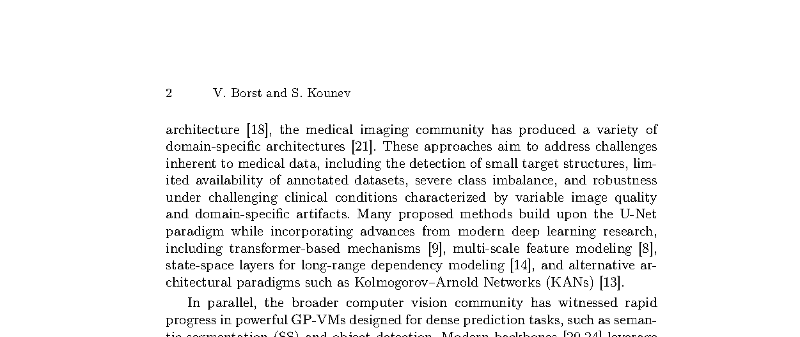

**Abstract**  
Medical image segmentation (MIS) is a fundamental component of computer-assisted diagnosis and clinical decision support systems. Over the past decade, numerous architectures specifically tailored to medical imaging have emerged to address domain-specific challenges such as low contrast, small anatomical structures, and limited annotated data. In parallel, rapid progress in computer vision has produced highly capable general-purpose vision models (GP-VMs) originally designed for natural images. Despite their strong performance on standard vision benchmarks, their effectiveness for MIS remains insufficiently understood. In this work, we conduct a controlled empirical study to examine whether specialized medical segmentation architectures (SMAs) provide systematic advantages over modern GP-VMs for 2D MIS. We compare eleven SMAs and GP-VMs using a unified training and evaluation protocol. Experiments are performed across three heterogeneous datasets covering different imaging modalities, class structures, and data characteristics. Beyond segmentation accuracy, we analyze qualitative Grad-CAM visualizations to investigate explainability (XAI) behavior. Our results demonstrate that, for the analyzed datasets, GP-VMs out-perform the majority of specialized MIS models. Moreover, XAI analyses indicate that GP-VMs can capture clinically relevant structures without explicit domain-specific architectural design. These findings suggest that GP-VMs can represent a viable alternative to domain-specific methods, highlighting the importance of informed model selection for end-to-end MIS systems. All code and resources are available at GitHub.

**Summary**  
TBD

[⬆ Back to Literature Table](#samothers)

---

### <a id="toward-clinically-ready-foundation-models-in-med-8f3b99f1">Toward Clinically Ready Foundation Models in Medical Image Analysis: Adaptation Mechanisms and Deployment Trade-offs</a>
> **Venue:** arXiv.org 2026  
> **Authors:** K. Phuntsho et al.  
> **Keywords:** OtherMIS, SAM
**Links**  
[Viewable Link](https://arxiv.org/abs/2603.14271) [Original Link](https://arxiv.org/pdf/2603.14271)

  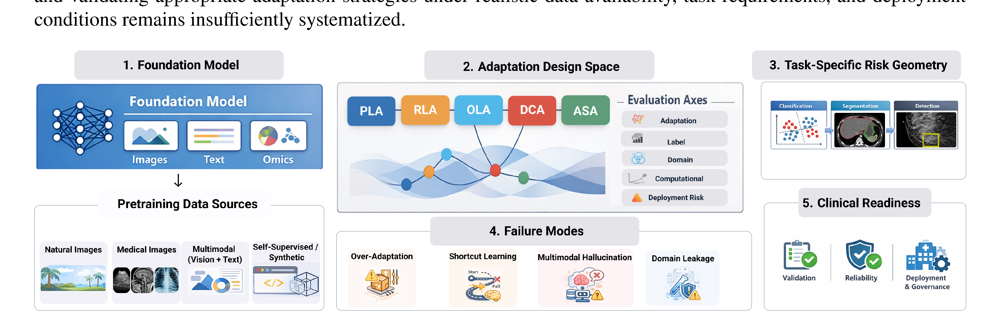

**Abstract**  
Foundation models (FMs) have demonstrated strong transferability across medical imaging tasks, yet their clinical utility depends critically on how pretrained representations are adapted to domain-specific data, supervision regimes, and deployment constraints. Prior surveys primarily emphasize architectural advances and application coverage, while the mechanisms of adaptation and their implications for robustness, calibration, and regulatory feasibility remain insufficiently structured. This review introduces a strategy-centric framework for FM adaptation in medical image analysis (MIA). We conceptualize adaptation as a post-pretraining intervention and organize existing approaches into five mechanisms: parameter-, representation-, objective-, data-centric, and architectural/sequence-level adaptation. For each mechanism, we analyze trade-offs in adaptation depth, label efficiency, domain robustness, computational cost, auditability, and regulatory burden. We synthesize evidence across classification, segmentation, and detection tasks, highlighting how adaptation strategies influence clinically relevant failure modes rather than only aggregate benchmark performance. Finally, we examine how adaptation choices interact with validation protocols, calibration stability, multi-institutional deployment, and regulatory oversight. By reframing adaptation as a process of controlled representational change under clinical constraints, this review provides practical guidance for designing FM-based systems that are robust, auditable, and compatible with clinical deployment.

**Summary**  
TBD

[⬆ Back to Literature Table](#samothers)

---

### <a id="distillation-sam-knowledge-distillation-based-au-0e44c067">Distillation-SAM: Knowledge Distillation Based Auto-prompt Embedding Learning for Surgical Image Segmentation</a>
> **Venue:** IEEE Transactions on Medical Imaging 2026  
> **Authors:** J. Tang et al.  
> **Keywords:** OtherMIS, SAM
**Links**  
[Viewable Link](https://ieeexplore.ieee.org/document/11436118/) [Original Link](https://ieeexplore.ieee.org/abstract/document/11436118)

  <!-- Add image to imgs/ and uncomment the img tag below. -->
  <!--  -->

**Abstract**  
Surgical image segmentation is vital for various stages of surgical procedures, from preoperative planning to real-time navigation and postoperative assessment. Despite advances in deep learning, current surgical image segmentation methods remain limited. They primarily target instrument segmentation and show poor generalizability across different surgical settings. While the Segment Anything Model (SAM) shows robust generalization capabilities in the segmentation of natural images, adapting SAM to surgical and medical images faces challenges because of its reliance on high-quality user-provided prompts and inherent lack of design for multi-class semantic segmentation. To address these limitations, we propose Distillation-SAM, an effective method that adapts SAM for accurate surgical image segmentation without user-provided prompts while freezing its encoder and decoder. Distillation-SAM introduces a trainable adapter branch that learns both sparse auto-prompt embeddings and enriched image features with dense auto-prompt embeddings, enabling the segmentation of surgical objects such as vessels, instruments, and tissues. We propose a direct knowledge distillation constraint for these auto-prompt embedding learnings by using embeddings derived from ground-truth masks as guidance. To enable multi-class semantic segmentation using SAM, we revise the mask score regression branch in SAM's decoder by incorporating a trainable Multilayer Perceptron to predict mask categories while keeping other parameters frozen. Our experiments in multiple surgical datasets, including IVIS, EndoVis2017, and Cholecseg8k, demonstrate that distillation-SAM outperforms existing methods in vessel, tissue, and instrument segmentation.

**Summary**  
TBD

[⬆ Back to Literature Table](#samothers)

---

### <a id="prompting-with-the-human-touch-evaluating-model-6600f1ab">Prompting with the human-touch: evaluating model-sensitivity of foundation models for musculoskeletal CT segmentation</a>
> **Venue:** arXiv.org 2026  
> **Authors:** C. Magg et al.  
> **Keywords:** InteractiveMIS, SAM
**Links**  
[Viewable Link](https://arxiv.org/abs/2603.10541) [Original Link](https://arxiv.org/pdf/2603.10541)

  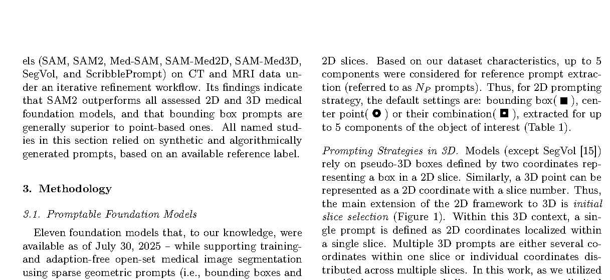

**Abstract**  
Promptable Foundation Models (FMs), initially introduced for natural image segmentation, have also revolutionized medical image segmentation. The increasing number of models, along with evaluations varying in datasets, metrics, and compared models, makes direct performance comparison between models difficult and complicates the selection of the most suitable model for specific clinical tasks. In our study, 11 promptable FMs are tested using non-iterative 2D and 3D prompting strategies on a private and public dataset focusing on bone and implant segmentation in four anatomical regions (wrist, shoulder, hip and lower leg). The Pareto-optimal models are identified and further analyzed using human prompts collected through a dedicated observer study. Our findings are: 1) The segmentation performance varies a lot between FMs and prompting strategies; 2) The Pareto-optimal models in 2D are SAM and SAM2.1, in 3D nnInteractive and Med-SAM2; 3) Localization accuracy and rater consistency vary with anatomical structures, with higher consistency for simple structures (wrist bones) and lower consistency for complex structures (pelvis, tibia, implants); 4) The segmentation performance drops using human prompts, suggesting that performance reported on "ideal" prompts extracted from reference labels might overestimate the performance in a human-driven setting; 5) All models were sensitive to prompt variations. While two models demonstrated intra-rater robustness, it did not scale to inter-rater settings. We conclude that the selection of the most optimal FM for a human-driven setting remains challenging, with even high-performing FMs being sensitive to variations in human input prompts. Our code base for prompt extraction and model inference is available: https://github.com/CarolineMagg/segmentation-FM-benchmark/

**Summary**  
TBD

[⬆ Back to Literature Table](#samiwmis)

---

### <a id="synsam-a-hybrid-synchronous-learning-framework-w-28886886">SynSAM: a hybrid synchronous learning framework with knowledge retention for prostate zonal segmentation leveraging the segment anything model</a>
> **Venue:** Medical &amp; Biological Engineering &amp; Computing 2026  
> **Authors:** C. Krishnan et al.  
> **Keywords:** OtherMIS, SAM
**Links**  
[Viewable Link](https://link.springer.com/10.1007/s11517-026-03522-2) [Original Link](https://link.springer.com/content/pdf/10.1007/s11517-026-03522-2.pdf)

  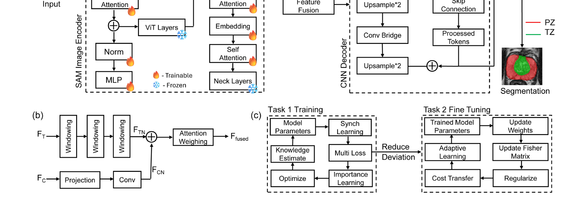

**Abstract**  
Accurate prostate zonal segmentation remains challenging due to domain shifts across institutions and the need for precise anatomical delineation. While transformer-based models like the Segment Anything Model (SAM) show promise, they struggle in medical domains, particularly with continual learning due to catastrophic forgetting. This study introduces SynESAM, a hybrid transformer-CNN segmentation framework that combines SAM’s image encoder with a CNN-based decoder. SynESAM employs synchronous learning strategies, specifically Elastic Weight Consolidation (EWC) and variational EWC (vEWC), to preserve prior knowledge during continual learning. The model was trained and evaluated on two datasets, UAB (in-house) and ProstateX (public), using Dice Similarity Coefficient (DSC) and Mean Surface Distance (MSD) as metrics. SynESAM significantly outperformed 16 benchmark models on both datasets. On UAB, it improved average DSC by 9.84% (TZ) and 18.54% (PZ), with worst-case DSC gains of 18.96% (TZ) and 31.53% (PZ). MSD improved by 40.93% (TZ) and 30.02% (PZ). In cross-dataset testing, SynESAM-EWC achieved up to 19.73% DSC improvement and 25.84% MSD reduction for PZ. SynESAM-vEWC showed slightly lower yet consistent gains. Overall, SynESAM provides robust, anatomically accurate segmentation across datasets by integrating transformer generalization, CNN efficiency, and continual learning strategies that mitigate catastrophic forgetting.

**Summary**  
TBD

[⬆ Back to Literature Table](#samothers)

---

### <a id="generative-data-engine-foundation-model-for-univ-57676204">Generative data-engine foundation model for universal few-shot 2D vascular image segmentation</a>
> **Venue:** Medical Image Analysis 2026  
> **Authors:** R. Ge et al.  
> **Keywords:** Few-ShotMIS, SAM
**Links**  
[Viewable Link](https://linkinghub.elsevier.com/retrieve/pii/S1361841526000654) [Original Link](https://www.sciencedirect.com/science/article/pii/S1361841526000654) [Code](https://github.com/XinAloha/UniVG)

  <!-- Add image to imgs/ and uncomment the img tag below. -->
  <!--  -->

**Abstract**  
TBD

**Summary**  
TBD

[⬆ Back to Literature Table](#samfsmis)

---

### <a id="structsam-structure-aware-prompt-adaptation-for-cde384cd">StructSAM: structure-aware prompt adaptation for robust lung cancer lesion segmentation in CT</a>
> **Venue:** npj Digital Medicine 2026  
> **Authors:** M. Liu et al.  
> **Keywords:** OtherMIS, SAM
**Links**  
[Viewable Link](https://www.nature.com/articles/s41746-025-02306-6)

  <!-- Add image to imgs/ and uncomment the img tag below. -->
  <!--  -->

**Abstract**  
Accurate delineation of lung lesions in computed tomography (CT) scans is critical for diagnosis, staging, and treatment planning, yet remains a challenging task. While foundation models like the Segment Anything Model (SAM) excel in natural images, they often falter in medical imaging due to low contrast, ambiguous boundaries, and a lack of 3D context. To address these limitations, we propose StructSAM, a structure-aware prompt adaptation framework designed for robust volumetric segmentation, with a primary focus on lung cancer. StructSAM injects anatomical priors into the prompt pathway, employs a 3D inter-slice aggregator for volumetric consistency, and leverages PEFT for scalability. Experiments on the LIDC-IDRI dataset demonstrate that StructSAM achieves state-of-the-art accuracy on lung nodule segmentation, outperforming both classical architectures and SAM-based adaptations. Crucially, extended cross-organ evaluations on KiTS19 and MSD Pancreas datasets reveal that StructSAM effectively generalizes to other anatomical structures, highlighting its robustness to domain shifts. These findings suggest that embedding structural priors into foundation models is a promising strategy toward generic, clinically reliable, and efficient medical image segmentation.

**Summary**  
TBD

[⬆ Back to Literature Table](#samothers)

---

### <a id="sam-driven-cross-prompting-with-adaptive-samplin-8a7e38d3">SAM-driven cross prompting with adaptive sampling consistency for semi-supervised medical image segmentation</a>
> **Venue:** Medical Image Analysis 2026  
> **Authors:** J. Miao et al.  
> **Keywords:** SSLMIS, SAM
**Links**  
[Viewable Link](https://linkinghub.elsevier.com/retrieve/pii/S1361841526000423) [Original Link](https://www.sciencedirect.com/science/article/pii/S1361841526000423) [Code](https://github.com/JuzhengMiao/CPAC-SAM)

  <!-- Add image to imgs/ and uncomment the img tag below. -->
  <!--  -->

**Abstract**  
Semi-supervised learning (SSL) has achieved notable progress in medical image segmentation. To achieve effective SSL, a model needs to be able to efficiently learn from limited labeled data and effectively exploit knowledge from abundant unlabeled data. Recent developments in visual foundation models, such as the Segment Anything Model (SAM), have demonstrated remarkable adaptability with improved sample efficiency. To seamlessly harness foundation models in SSL, we propose a SAM-driven cross prompting framework with adaptive sampling and prompt consistency for semi-supervised medical image segmentation, named CPAC-SAM. Our method employs SAM's unique prompt design and innovates a cross prompting strategy within a dual-branch framework to automatically generate prompts and supervision across two decoder branches, enabling effective learning from both scarce labeled and valuable unlabeled data. To ensure the quality of prompts for unlabeled data and provide meaningful supervision in the cross prompting scheme, we propose an innovative prototype-guided grid sampling strategy with adaptive intervals to simultaneously improve the reliability of the prompt selection area and ensure both adequate prompt density and complete target coverage. We further design a novel prompt consistency regularization to reduce SAM's prompt sensitivity and to enhance the output invariance under different prompts. We validate our method on five medical image segmentation tasks, encompassing both 2D and 3D scenarios. The extensive experiments with different labeled-data ratios and modalities demonstrate the superiority of our proposed method over the state-of-the-art SSL methods, with more than 4.1% and 3.8% Dice improvement on the breast cancer segmentation task and left atrium segmentation task, respectively. Our code is available at: https://github.com/JuzhengMiao/CPAC-SAM.

**Summary**  
TBD

[⬆ Back to Literature Table](#samsslmis)

---

### <a id="semi-medsam-adapting-sam-assisted-semi-supervise-8d5eb04c">Semi-MedSAM: Adapting SAM-assisted semi-supervised multi-modality learning for medical endoscopic image segmentation</a>
> **Venue:** Pattern Recognition 2026  
> **Authors:** J. Li et al.  
> **Keywords:** SSLMIS, SAM
**Links**  
[Viewable Link](https://linkinghub.elsevier.com/retrieve/pii/S0031320326001718) [Original Link](https://www.sciencedirect.com/science/article/abs/pii/S0031320326001718)

  <!-- Add image to imgs/ and uncomment the img tag below. -->
  <!--  -->

**Abstract**  
TBD

**Summary**  
TBD

[⬆ Back to Literature Table](#samsslmis)

---

### <a id="on-the-robustness-of-foundational-3d-medical-ima-d79b0a59">On The Robustness of Foundational 3D Medical Image Segmentation Models Against Imprecise Visual Prompts</a>
> **Venue:** arXiv.org 2026  
> **Authors:** S. Chattopadhyay et al.  
> **Keywords:** OtherMIS, SAM
**Links**  
[Viewable Link](https://arxiv.org/abs/2601.16383) [Original Link](https://arxiv.org/pdf/2601.16383) [Code](https://github.com/ucsdbiag/Prompt-Robustness-MedSegFMs)

  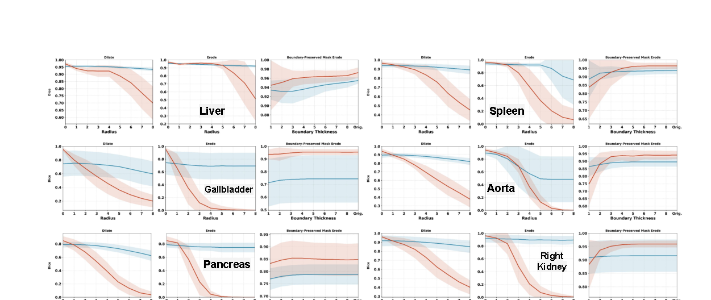

**Abstract**  
While 3D foundational models have shown promise for promptable segmentation of medical volumes, their robustness to imprecise prompts remains under-explored. In this work, we aim to address this gap by systematically studying the effect of various controlled perturbations of dense visual prompts, that closely mimic real-world imprecision. By conducting experiments with two recent foundational models on a multi-organ abdominal segmentation task, we reveal several facets of promptable medical segmentation, especially pertaining to reliance on visual shape and spatial cues, and the extent of resilience of models towards certain perturbations. Codes are available at: https://github.com/ucsdbiag/Prompt-Robustness-MedSegFMs

**Summary**  
TBD

[⬆ Back to Literature Table](#samothers)

---

### <a id="ta-medsam-text-augmented-improved-medsam-for-pul-06779358">TA-MedSAM: Text-augmented improved MedSAM for pulmonary lesion segmentation</a>
> **Venue:** Computerized Medical Imaging and Graphics 2026  
> **Authors:** S. Tang et al.  
> **Keywords:** OtherMIS, SAM
**Links**  
[Viewable Link](https://linkinghub.elsevier.com/retrieve/pii/S0895611126000017) [Original Link](https://www.sciencedirect.com/science/article/abs/pii/S0895611126000017)

  <!-- Add image to imgs/ and uncomment the img tag below. -->
  <!--  -->

**Abstract**  
TBD

**Summary**  
TBD

[⬆ Back to Literature Table](#samothers)

---

### <a id="autopromptseg-automated-decoupling-of-uncertaint-6671dd23">AutoPromptSeg: Automated Decoupling of Uncertainty Prompts with SAM for semi-supervised medical image segmentation</a>
> **Venue:** Computerized Medical Imaging and Graphics 2026  
> **Authors:** J. Zhu et al.  
> **Keywords:** SSLMIS, SAM
**Links**  
[Viewable Link](https://linkinghub.elsevier.com/retrieve/pii/S089561112600011X) [Original Link](https://www.sciencedirect.com/science/article/abs/pii/S089561112600011X)

  <!-- Add image to imgs/ and uncomment the img tag below. -->
  <!--  -->

**Abstract**  
TBD

**Summary**  
TBD

[⬆ Back to Literature Table](#samsslmis)

---

### <a id="adaptability-of-vision-foundation-models-for-3d-b929776b">Adaptability of Vision Foundation Models for 3D Medical Image Segmentation</a>
> **Venue:** IEEE Open Journal of Signal Processing 2026  
> **Authors:** S. Ahn et al.  
> **Keywords:** OtherMIS, SAM
**Links**  
[Viewable Link](https://ieeexplore.ieee.org/document/11321196/) [Original Link](https://ieeexplore.ieee.org/stamp/stamp.jsp?arnumber=11321196)

  <!-- Add image to imgs/ and uncomment the img tag below. -->
  <!--  -->

**Abstract**  
Vision Foundation Models (VFMs), such as DINOv2 and SAM, have demonstrated unprecedented generalizability in natural imaging and show strong promise in medical imaging due to their semantically rich representations. However, their effective application to 3D volumetric segmentation remains largely underexplored, especially concerning optimal adaptation strategies for transferring 2D pretrained knowledge to the structurally disparate 3D domain. To address this, we present a comprehensive investigation into the transferability and task-specific adaptability of six diverse 2D VFMs (including Self- Supervised, Vision-Language, and Segmentation Generalists) for 3D medical image segmentation. We systematically evaluate four distinct transfer learning paradigms, including advanced Fine-Tuning methods, across four heterogeneous 3D medical datasets. Our results establish VFMs as a powerful and cost-effective generalist baseline, consistently outperforming non-pretrained and standard 3D ViT architectures despite the substantial domain shift. Crucially, our systematic exploration reveals that parameter-efficient finetuning achieves the highest segmentation accuracy across all datasets. Feature-level analyses using PCA and CKA provide key insights, confirming that optimal performance stems from successfully balancing the preservation of generalizable low-level visual features with the adaptation of high-level, task-specific semantics.

**Summary**  
TBD

[⬆ Back to Literature Table](#samothers)

---

### <a id="atlas-is-your-perfect-context-one-shot-customiza-85662d42">Atlas is Your Perfect Context: One-Shot Customization for Generalizable Foundational Medical Image Segmentation</a>
> **Venue:** arXiv.org 2025  
> **Authors:** Z. Zhang et al.  
> **Keywords:** Few-ShotMIS, SAM
**Links**  
[Viewable Link](https://arxiv.org/abs/2512.18176) [Original Link](https://arxiv.org/pdf/2512.18176)

  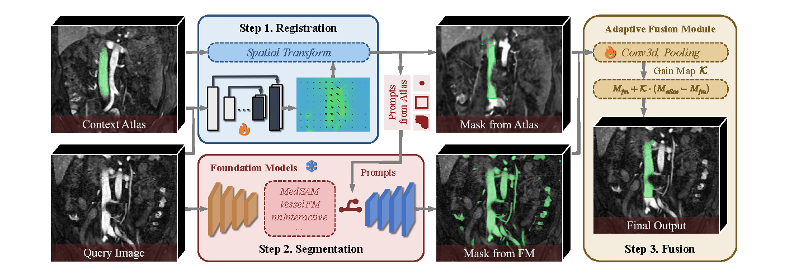

**Abstract**  
Accurate medical image segmentation is essential for clinical diagnosis and treatment planning. While recent interactive foundation models (e.g., nnInteractive) enhance generalization through large-scale multimodal pretraining, they still depend on precise prompts and often perform below expectations in contexts that are underrepresented in their training data. We present AtlasSegFM, an atlas-guided framework that customizes available foundation models to clinical contexts with a single annotated example. The core innovations are: 1) a pipeline that provides context-aware prompts for foundation models via registration between a context atlas and query images, and 2) a test-time adapter to fuse predictions from both atlas registration and the foundation model. Extensive experiments across public and in-house datasets spanning multiple modalities and organs demonstrate that AtlasSegFM consistently improves segmentation, particularly for small, delicate structures. AtlasSegFM provides a lightweight, deployable solution one-shot customization of foundation models in real-world clinical workflows. The code will be made publicly available.

**Summary**  
TBD

[⬆ Back to Literature Table](#samfsmis)

---

### <a id="cellsam-a-foundation-model-for-cell-segmentation-4cb639e7">CellSAM: a foundation model for cell segmentation</a>
> **Venue:** Nature Methods 2025  
> **Authors:** M. Marks et al.  
> **Keywords:** Zero-ShotMIS, SAM
**Links**  
[Viewable Link](https://www.nature.com/articles/s41592-025-02879-w) [Code](https://cellsam.deepcell.org)

  <!-- Add image to imgs/ and uncomment the img tag below. -->
  <!--  -->

**Abstract**  
Cells are a fundamental unit of biological organization, and identifying them in imaging data-cell segmentation-is a critical task for various cellular imaging experiments. Although deep learning methods have led to substantial progress on this problem, most models are specialist models that work well for specific domains but cannot be applied across domains or scale well with large amounts of data. Here we present CellSAM, a universal model for cell segmentation that generalizes across diverse cellular imaging data. CellSAM builds on top of the Segment Anything Model (SAM) by developing a prompt engineering approach for mask generation. We train an object detector, CellFinder, to automatically detect cells and prompt SAM to generate segmentations. We show that this approach allows a single model to achieve human-level performance for segmenting images of mammalian cells, yeast and bacteria collected across various imaging modalities. We show that CellSAM has strong zero-shot performance and can be improved with a few examples via few-shot learning. Additionally, we demonstrate how CellSAM can be applied across diverse bioimage analysis workflows. A deployed version of CellSAM is available at https://cellsam.deepcell.org/ .

**Summary**  
TBD

[⬆ Back to Literature Table](#samzsmis)

---

### <a id="voxtell-free-text-promptable-universal-3d-medica-ab791e43">VoxTell: Free-Text Promptable Universal 3D Medical Image Segmentation</a>
> **Venue:** arXiv.org 2025  
> **Authors:** M. Rokuss et al.  
> **Keywords:** Zero-ShotMIS, SAM
**Links**  
[Viewable Link](https://arxiv.org/abs/2511.11450) [Original Link](https://arxiv.org/pdf/2511.11450) [Code](www.github.com/MIC-DKFZ/VoxTell)

  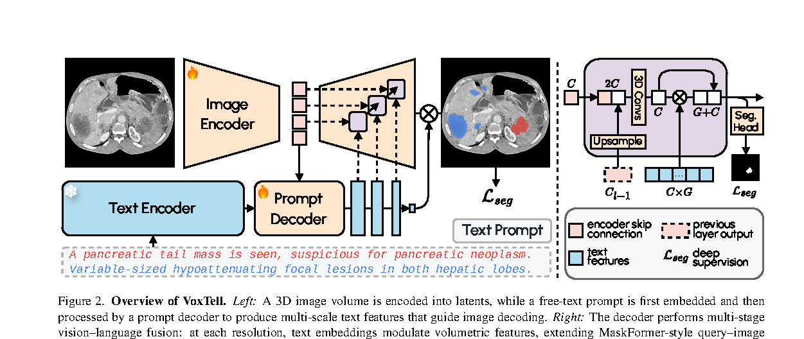

**Abstract**  
We introduce VoxTell, a vision-language model for text-prompted volumetric medical image segmentation. It maps free-form descriptions, from single words to full clinical sentences, to 3D masks. Trained on 62K+ CT, MRI, and PET volumes spanning over 1K anatomical and pathological classes, VoxTell uses multi-stage vision-language fusion across decoder layers to align textual and visual features at multiple scales. It achieves state-of-the-art zero-shot performance across modalities on unseen datasets, excelling on familiar concepts while generalizing to related unseen classes. Extensive experiments further demonstrate strong cross-modality transfer, robustness to linguistic variations and clinical language, as well as accurate instance-specific segmentation from real-world text. Code is available at: https://www.github.com/MIC-DKFZ/VoxTell

**Summary**  
TBD

[⬆ Back to Literature Table](#samzsmis)

---

### <a id="mediround-multi-round-entity-level-reasoning-seg-fd48fab0">MediRound: Multi-Round Entity-Level Reasoning Segmentation in Medical Images</a>
> **Venue:** arXiv.org 2025  
> **Authors:** Q. Tong et al.  
> **Keywords:** OtherMIS, SAM
**Links**  
[Viewable Link](https://arxiv.org/abs/2511.12110) [Original Link](https://arxiv.org/pdf/2511.12110) [Code](https://github.com/Edisonhimself/MediRound)

  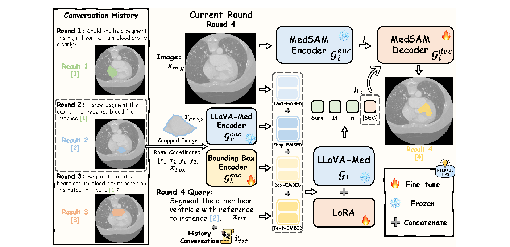

**Abstract**  
Despite recent progress in text-prompt-based medical image segmentation, these methods are limited to single-round dialogues and fail to support multi-round reasoning, which is important for medical education scenarios. In this work, we introduce Multi-Round Entity-Level Medical Reasoning Segmentation (MEMR-Seg), a new task that requires generating segmentation masks through multi-round queries with entity-level reasoning, helping learners progressively develop their understanding of medical knowledge. To support this task, we construct MR-MedSeg, a large-scale dataset of 177K multi-round medical segmentation dialogues, featuring entity-based reasoning across rounds. Furthermore, we propose MediRound, an effective baseline model designed for multi-round medical reasoning segmentation. To mitigate the inherent error propagation within the chain-like pipeline of multi-round segmentation, we introduce a lightweight yet effective Judgment &amp; Correction Mechanism during model inference. Experimental results demonstrate that our method effectively addresses the MEMR-Seg task and outperforms conventional medical referring segmentation methods. The project is available at https://github.com/Edisonhimself/MediRound.

**Summary**  
TBD

[⬆ Back to Literature Table](#samothers)

---

### <a id="ws-sam-segment-anything-with-sparse-prompts-for-f8cb59c8">WS-SAM: Segment Anything with Sparse Prompts for Weakly-Supervised Medical Segmentation</a>
> **Venue:** 2025 21st International Symposium on Biomedical Image Processing and Analysis (SIPAIM)  
> **Authors:** T. Shaharabany et al.  
> **Keywords:** Weakly-SupervisedMIS, SAM
**Links**  
[Viewable Link](https://ieeexplore.ieee.org/document/11283292/) [Original Link](https://ieeexplore.ieee.org/abstract/document/11283292)

  <!-- Add image to imgs/ and uncomment the img tag below. -->
  <!--  -->

**Abstract**  
Foundation models such as the Segment Anything Model (SAM) demonstrate strong generalization in natural image segmentation but underperform in medical imaging domains, where labeled data are limited and expensive to obtain. In this work, we propose a weakly supervised training framework that adapts SAM to medical images using only sparse point annotations. Our approach constructs foreground and background token banks from training images and generates pseudo-labels for new samples via similarity in SAM’s encoder space. We fine-tune the mask decoder while keeping the image and prompt encoders frozen. To guide training and checkpoint selection, we introduce a novel score that correlates with segmentation quality without requiring ground truth. Our method eliminates the need for dense annotations or prompts at inference time, enabling fast and automated segmentation. Experiments on microscopy datasets demonstrate that our approach significantly outperforms baselines and achieves competitive performance relative to fully supervised methods.

**Summary**  
TBD

[⬆ Back to Literature Table](#samwsmis)

---

### <a id="sam-guided-prompt-learning-for-multiple-sclerosi-959e8d70">SAM-guided prompt learning for Multiple Sclerosis lesion segmentation</a>
> **Venue:** Pattern Recognition Letters 2026  
> **Authors:** FP. Salanitri et al.  
> **Keywords:** OtherMIS, SAM
**Links**  
[Viewable Link](https://linkinghub.elsevier.com/retrieve/pii/S0167865525003708) [Original Link](https://www.sciencedirect.com/science/article/pii/S0167865525003708)

  <!-- Add image to imgs/ and uncomment the img tag below. -->
  <!--  -->

**Abstract**  
Accurate segmentation of Multiple Sclerosis (MS) lesions remains a critical challenge in medical image analysis due to their small size, irregular shape, and sparse distribution. Despite recent progress in vision foundation models — such as SAM and its medical variant MedSAM — these models have not yet been explored in the context of MS lesion segmentation. Moreover, their reliance on manually crafted prompts and high inference-time computational cost limits their applicability in clinical workflows, especially in resource-constrained environments. In this work, we introduce a novel training-time framework for effective and efficient MS lesion segmentation. Our method leverages SAM solely during training to guide a prompt learner that automatically discovers task-specific embeddings. At inference, SAM is replaced by a lightweight convolutional aggregator that maps the learned embeddings directly into segmentation masks—enabling fully automated, low-cost deployment. We show that our approach significantly outperforms existing specialized methods on the public MSLesSeg dataset, establishing new performance benchmarks in a domain where foundation models had not previously been applied. To assess generalizability, we also evaluate our method on pancreas and prostate segmentation tasks, where it achieves competitive accuracy while requiring an order of magnitude fewer parameters and computational resources compared to SAM-based pipelines. By eliminating the need for foundation models at inference time, our framework enables efficient segmentation without sacrificing accuracy. This design bridges the gap between large-scale pretraining and real-world clinical deployment, offering a scalable and practical solution for MS lesion segmentation and beyond. Code is available at https://github.com/perceivelab/MS-SAM-LESS . • Overcomes SAM’s manual prompting and high inference cost limitations. • Learns automatic prompts for MS lesion segmentation via SAM during training. • Replaces SAM with a lightweight CNN aggregator for efficient deployment. • Outperforms state-of-the-art on the MSLesSeg benchmark. • Demonstrates strong generalization to pancreas and prostate segmentation tasks.

**Summary**  
TBD

[⬆ Back to Literature Table](#samothers)

---

### <a id="ultrasam-a-foundational-medical-ultrasound-segme-7e0f4836">UltraSAM: A foundational medical ultrasound segmentation model with limited training data</a>
> **Venue:** Expert Systems with Applications 2026  
> **Authors:** T. Jiang et al.  
> **Keywords:** OtherMIS, SAM
**Links**  
[Viewable Link](https://linkinghub.elsevier.com/retrieve/pii/S0957417425038382) [Original Link](https://www.sciencedirect.com/science/article/abs/pii/S0957417425038382)

  <!-- Add image to imgs/ and uncomment the img tag below. -->
  <!--  -->

**Abstract**  
TBD

**Summary**  
TBD

[⬆ Back to Literature Table](#samothers)

---

### <a id="boundary-aware-test-time-adaptation-for-zero-sho-09c44473">Boundary-Aware Test-Time Adaptation for Zero-Shot Medical Image Segmentation</a>
> **Venue:** arXiv.org 2025  
> **Authors:** C. Xu et al.  
> **Keywords:** Zero-ShotMIS, SAM
**Links**  
[Viewable Link](https://arxiv.org/abs/2512.04520) [Original Link](https://arxiv.org/pdf/2512.04520) [Code](https://github.com/Emilychenlin/BA-TTA-SAM)

  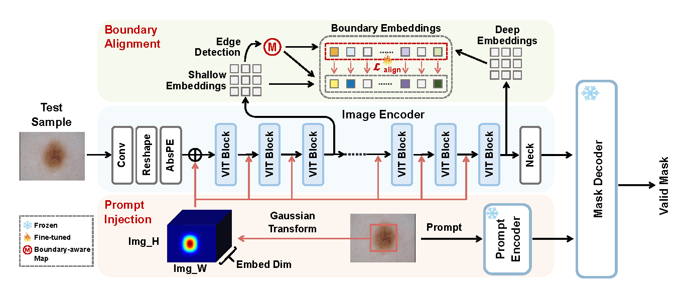

**Abstract**  
Due to the scarcity of annotated data and the substantial computational costs of model, conventional tuning methods in medical image segmentation face critical challenges. Current approaches to adapting pretrained models, including full-parameter and parameter-efficient fine-tuning, still rely heavily on task-specific training on downstream tasks. Therefore, zero-shot segmentation has gained increasing attention, especially with foundation models such as SAM demonstrating promising generalization capabilities. However, SAM still faces notable limitations on medical datasets due to domain shifts, making efficient zero-shot enhancement an urgent research goal. To address these challenges, we propose BA-TTA-SAM, a task-agnostic test-time adaptation framework that significantly enhances the zero-shot segmentation performance of SAM via test-time adaptation. This framework integrates two key mechanisms: (1) The encoder-level Gaussian prompt injection embeds Gaussian-based prompts directly into the image encoder, providing explicit guidance for initial representation learning. (2) The cross-layer boundary-aware attention alignment exploits the hierarchical feature interactions within the ViT backbone, aligning deep semantic responses with shallow boundary cues. Experiments on four datasets, including ISIC, Kvasir, BUSI, and REFUGE, show an average improvement of 12.4\% in the DICE score compared with SAM's zero-shot segmentation performance. The results demonstrate that our method consistently outperforms state-of-the-art models in medical image segmentation. Our framework significantly enhances the generalization ability of SAM, without requiring any source-domain training data. Extensive experiments on publicly available medical datasets strongly demonstrate the superiority of our framework. Our code is available at https://github.com/Emilychenlin/BA-TTA-SAM.

**Summary**  
TBD

[⬆ Back to Literature Table](#samzsmis)

---

### <a id="not-quite-anything-overcoming-sams-limitations-f-27319768">Not Quite Anything: Overcoming SAMs Limitations for 3D Medical Imaging</a>
> **Venue:** arXiv.org 2025  
> **Authors:** K. Moore et al.  
> **Keywords:** OtherMIS, SAM
**Links**  
[Viewable Link](https://arxiv.org/abs/2511.19471) [Original Link](https://arxiv.org/pdf/2511.19471)

  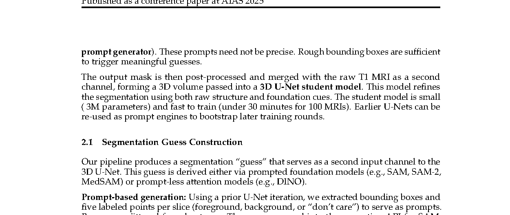

**Abstract**  
Foundation segmentation models such as SAM and SAM-2 perform well on natural images but struggle with brain MRIs where structures like the caudate and thalamus lack sharp boundaries and have low contrast. Rather than fine tune these models (for example MedSAM), we propose a compositional alternative where the foundation model output is treated as an additional input channel and passed alongside the MRI to highlight regions of interest. We generate SAM-2 prompts by using a lightweight 3D U-Net that was previously trained on MRI segmentation. The U-Net may have been trained on a different dataset, so its guesses are often imprecise but usually in the correct region. The edges of the resulting foundation model guesses are smoothed to improve alignment with the MRI. We also test prompt free segmentation using DINO attention maps in the same framework. This has-a architecture avoids modifying foundation weights and adapts to domain shift without retraining the foundation model. It reaches about 96 percent volume accuracy on basal ganglia segmentation, which is sufficient for our study of longitudinal volume change. The approach is fast, label efficient, and robust to out of distribution scans. We apply it to study inflammation linked changes in sudden onset pediatric OCD.

**Summary**  
TBD

[⬆ Back to Literature Table](#samothers)

---

### <a id="continual-alignment-for-sam-rethinking-foundatio-af6091bd">Continual Alignment for SAM: Rethinking Foundation Models for Medical Image Segmentation in Continual Learning</a>
> **Venue:** arXiv.org 2025  
> **Authors:** Y. Zhang et al.  
> **Keywords:** Zero-ShotMIS, SAM
**Links**  
[Viewable Link](https://arxiv.org/abs/2511.17201) [Original Link](https://arxiv.org/pdf/2511.17201) [Code](https://github.com/azzzzyo/Continual-Alignment-for-SAM)

  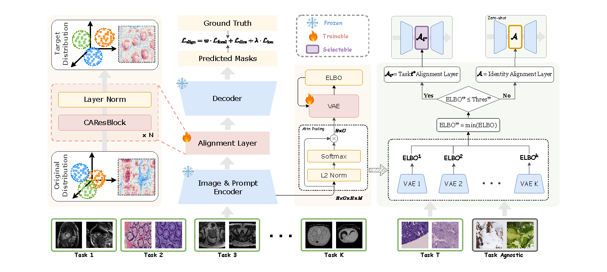

**Abstract**  
In medical image segmentation, heterogeneous privacy policies across institutions often make joint training on pooled datasets infeasible, motivating continual image segmentation-learning from data streams without catastrophic forgetting. While the Segment Anything Model (SAM) offers strong zero-shot priors and has been widely fine-tuned across downstream tasks, its large parameter count and computational overhead challenge practical deployment. This paper demonstrates that the SAM paradigm is highly promising once its computational efficiency and performance can be balanced. To this end, we introduce the Alignment Layer, a lightweight, plug-and-play module which aligns encoder-decoder feature distributions to efficiently adapt SAM to specific medical images, improving accuracy while reducing computation. Building on SAM and the Alignment Layer, we then propose Continual Alignment for SAM (CA-SAM), a continual learning strategy that automatically adapts the appropriate Alignment Layer to mitigate catastrophic forgetting, while leveraging SAM's zero-shot priors to preserve strong performance on unseen medical datasets. Experimented across nine medical segmentation datasets under continual-learning scenario, CA-SAM achieves state-of-the-art performance. Our code, models and datasets will be released on \mbox{https://github.com/azzzzyo/Continual-Alignment-for-SAM.}

**Summary**  
TBD

[⬆ Back to Literature Table](#samzsmis)

---

### <a id="seganypet-universal-promptable-segmentation-from-d9a8e251">SegAnyPET: Universal Promptable Segmentation from Positron Emission Tomography Images</a>
> **Venue:** arXiv.org 2025  
> **Authors:** Y. Zhang et al.  
> **Keywords:** OtherMIS, SAM
**Links**  
[Viewable Link](https://arxiv.org/abs/2502.14351) [Original Link](https://openaccess.thecvf.com/content/ICCV2025/papers/Zhang_SegAnyPET_Universal_Promptable_Segmentation_from_Positron_Emission_Tomography_Images_ICCV_2025_paper.pdf) [Code](https://github.com/YichiZhang98/SegAnyPET)

  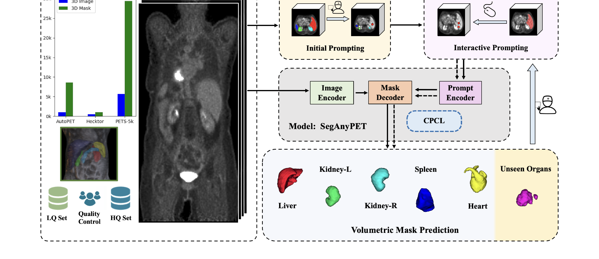

**Abstract**  
Positron Emission Tomography (PET) is a powerful molecular imaging tool that plays a crucial role in modern medical diagnostics by visualizing radio-tracer distribution to reveal physiological processes. Accurate organ segmentation from PET images is essential for comprehensive multi-systemic analysis of interactions between different organs and pathologies. Existing segmentation methods are limited by insufficient annotation data and varying levels of annotation, resulting in weak generalization ability and difficulty in clinical application. Recent developments in segmentation foundation models have shown superior versatility across diverse segmentation tasks. Despite the efforts of medical adaptations, these works primarily focus on structural medical images with detailed physiological structural information and exhibit limited generalization performance on molecular PET imaging. In this paper, we collect and construct PETS-5k, the largest PET segmentation dataset to date, comprising 5,731 three-dimensional whole-body PET images and encompassing over 1.3M 2D images. Based on the established dataset, we develop SegAnyPET, a modality-specific 3D foundation model for universal promptable segmentation from PET images. To issue the challenge of discrepant annotation quality, we adopt a cross prompting confident learning (CPCL) strategy with an uncertainty-guided self-rectification process to robustly learn segmentation from high-quality labeled data and low-quality noisy labeled data for promptable segmentation. Experimental results demonstrate that SegAnyPET can segment seen and unseen target organs using only one or a few prompt points, outperforming state-of-the-art foundation models and task-specific fully supervised models with higher accuracy and strong generalization ability for universal segmentation.

**Summary**  
TBD

[⬆ Back to Literature Table](#samothers)

---

### <a id="neuroverse3d-developing-in-context-learning-univ-e86c9f2e">Neuroverse3D: Developing In-Context Learning Universal Model for Neuroimaging in 3D</a>
> **Venue:** ArXiv.org 2025  
> **Authors:** J. Hu et al.  
> **Keywords:** OtherMIS, SAM
**Links**  
[Viewable Link](http://arxiv.org/abs/2503.02410) [Original Link](https://openaccess.thecvf.com/content/ICCV2025/papers/Hu_Neuroverse3D_Developing_In-Context_Learning_Universal_Model_for_Neuroimaging_in_3D_ICCV_2025_paper.pdf) [Code](https://github.com/jiesihu/Neuroverse3D)

  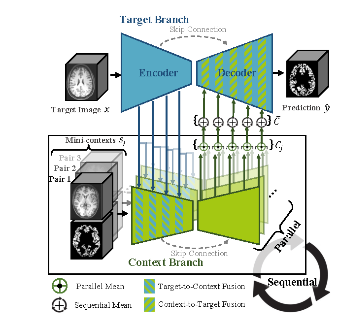

**Abstract**  
In-context learning (ICL), a type of universal model, demonstrates exceptional generalization across a wide range of tasks without retraining by leveraging task-specific guidance from context, making it particularly effective for the intricate demands of neuroimaging. However, current ICL models, limited to 2D inputs and thus exhibiting suboptimal performance, struggle to extend to 3D inputs due to the high memory demands of ICL. In this regard, we introduce Neuroverse3D, an ICL model capable of performing multiple neuroimaging tasks in 3D (e.g., segmentation, denoising, inpainting). Neuroverse3D overcomes the large memory consumption associated with 3D inputs through adaptive parallel-sequential context processing and a U-shaped fusion strategy, allowing it to handle an unlimited number of context images. Additionally, we propose an optimized loss function to balance multi-task training and enhance focus on anatomical boundaries. Our study incorporates 43,674 3D multi-modal scans from 19 neuroimaging datasets and evaluates Neuroverse3D on 14 diverse tasks using held-out test sets. The results demonstrate that Neuroverse3D significantly outperforms existing ICL models and closely matches task-specific models, enabling flexible adaptation to medical center variations without retraining. The code and model weights are publicly available at https://github.com/jiesihu/Neuroverse3D.

**Summary**  
TBD

[⬆ Back to Literature Table](#samothers)

---

### <a id="samora-enhancing-sam-through-hierarchical-self-s-1ebdfa52">SAMora: Enhancing SAM through Hierarchical Self-Supervised Pre-Training for Medical Images</a>
> **Venue:** ArXiv.org 2025  
> **Authors:** S. Chen et al.  
> **Keywords:** Few-ShotMIS, SAM
**Links**  
[Viewable Link](http://arxiv.org/abs/2511.08626) [Original Link](https://openaccess.thecvf.com/content/ICCV2025/papers/Chen_SAMora_Enhancing_SAM_through_Hierarchical_Self-Supervised_Pre-Training_for_Medical_Images_ICCV_2025_paper.pdf) [Code](https://github.com/ShChen233/SAMora)

  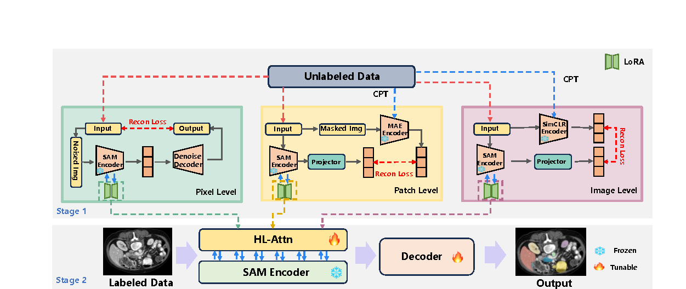

**Abstract**  
The Segment Anything Model (SAM) has demonstrated significant potential in medical image segmentation. Yet, its performance is limited when only a small amount of labeled data is available, while there is abundant valuable yet often overlooked hierarchical information in medical data. To address this limitation, we draw inspiration from self-supervised learning and propose SAMora, an innovative framework that captures hierarchical medical knowledge by applying complementary self-supervised learning objectives at the image, patch, and pixel levels. To fully exploit the complementarity of hierarchical knowledge within LoRAs, we introduce HL-Attn, a hierarchical fusion module that integrates multi-scale features while maintaining their distinct characteristics. SAMora is compatible with various SAM variants, including SAM2, SAMed, and H-SAM. Experimental results on the Synapse, LA, and PROMISE12 datasets demonstrate that SAMora outperforms existing SAM variants. It achieves state-of-the-art performance in both few-shot and fully supervised settings while reducing fine-tuning epochs by 90%. The code is available at https://github.com/ShChen233/SAMora.

**Summary**  
TBD

[⬆ Back to Literature Table](#samfsmis)

---

### <a id="enhancing-the-reliability-of-auto-prompting-sam-d01ccbbf">Enhancing the Reliability of Auto-Prompting SAM for Medical Image Segmentation with Uncertainty Estimation and Rectification</a>
> **Venue:** 2025 IEEE/CVF International Conference on Computer Vision Workshops (ICCVW)  
> **Authors:** Y. Zhang et al.  
> **Keywords:** OtherMIS, SAM
**Links**  
[Viewable Link](https://ieeexplore.ieee.org/document/11374295/) [Original Link](https://openaccess.thecvf.com/content/ICCV2025W/CVAMD/papers/Zhang_Enhancing_the_Reliability_of_Auto-Prompting_SAM_for_Medical_Image_Segmentation_ICCVW_2025_paper.pdf)

  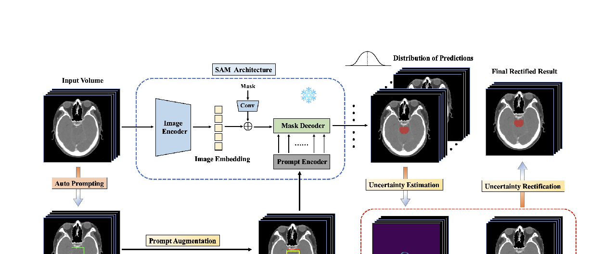

**Abstract**  
Automatic segmentation of medical images has widespread applications in modern clinical workflows. Recent advancements in prompt-driven foundation models have shown remarkable potential for universal medical image segmentation without the need for specific domain training. However, their reliance on prompts necessitates human-computer interaction during the inference process, which directly increases the burden for applications. Auto-prompting methods have been introduced to enable automatic segmentation but often lack reliability, as low-quality prompts may significantly compromise the accuracy of segmentation. To enhance the reliability of auto-prompting for medical image segmentation based on foundation models, we introduce a prompts-triggered uncertainty estimation strategy to evaluate voxel-level reliability of model-generated segmentation. Based on the estimated uncertainty, we design a simple yet efficient rectification strategy to automatically refine possible mistakes with high uncertainty and improve the segmentation accuracy. We conducted quantitative and qualitative assessments on the performance of our proposed method on two representative medical datasets covering the segmentation task of 22 head-and-neck organs and 13 abdominal organs. Experimental results demonstrate uncertainty rectification obtains significant improvements in dice similarity coefficient with up to 10.7 % and 13.8 %, surpassing other comparative methods. The uncertainty map not only improves the final segmentation result with the rectification strategy but also enables the identification of potential segmentation errors and supports further analysis, offering valuable guidance in areas where manual focus and refinement are required for clinicians.

**Summary**  
TBD

[⬆ Back to Literature Table](#samothers)

---

### <a id="medsam-guided-curriculum-learning-for-white-matt-6ca94da7">MedSAM-Guided Curriculum Learning for White Matter Tract Segmentation in Block Face Imaging of Fetal Brain</a>
> **Venue:** 2025 IEEE/CVF International Conference on Computer Vision Workshops (ICCVW)  
> **Authors:** AK. Shibu et al.  
> **Keywords:** OtherMIS, SAM
**Links**  
[Viewable Link](https://ieeexplore.ieee.org/document/11375167/) [Original Link](https://openaccess.thecvf.com/content/ICCV2025W/CVAMD/papers/Shibu_MedSAM-Guided_Curriculum_Learning_for_White_Matter_Tract_Segmentation_in_Block_ICCVW_2025_paper.pdf)

  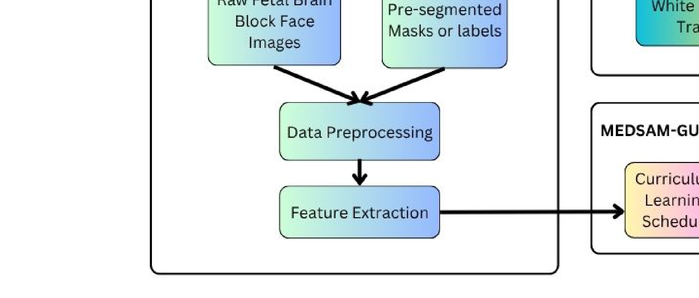

**Abstract**  
Block Face Imaging (BFI) is a high-resolution snapshot acquired during histological sectioning that captures the exposed tissue surface using tissue autofluorescence of lipids and NADPH. BFI offers up to five times greater white-gray matter contrast than traditional imaging, allowing clear visualization of white matter(WM) tracts. To enable accurate segmentation of WM tracts, we introduce a MedSAM-guided curriculum learning that progressively improves performance by training on increasingly complex samples. This approach takes advantage of both the anatomical precision of BFI and the generalizability of the medical foundation models. The resulting segmentations are manually validated by expert neuroscientists to ensure anatomical accuracy. Our method achieves an average Dice score of 0.9297, evaluated across 230 BFI slices with a spatial resolution of approximately 60μm, offering significantly enhanced structural clarity over conventional MRI-based approaches (500μm resolution) and outperforming state-of-the-art segmentation techniques. These findings demonstrate the effectiveness of our approach in leveraging high-resolution BFI data for accurate WM tract segmentation, highlighting its potential as a complementary tool along-side conventional neuroimaging techniques.

**Summary**  
TBD

[⬆ Back to Literature Table](#samothers)

---

### <a id="sam-spjunc-self-prompting-for-junction-detection-916aeb2f">SAM-SPJunc: Self-Prompting for Junction Detection in Retinal Images via Radius-Based Representations</a>
> **Venue:** 2025 IEEE/CVF International Conference on Computer Vision Workshops (ICCVW)  
> **Authors:** M. Attari et al.  
> **Keywords:** OtherMIS, SAM
**Links**  
[Viewable Link](https://ieeexplore.ieee.org/document/11375361/) [Original Link](https://openaccess.thecvf.com/content/ICCV2025W/BISCUIT/papers/Attari_SAM-SPJunc_Self-Prompting_for_Junction_Detection_in_Retinal_Images_via_Radius-Based_ICCVW_2025_paper.pdf)

  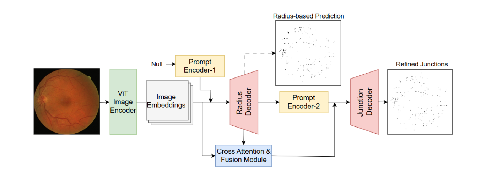

**Abstract**  
Detecting junctions in the retinal vasculature is vital to analyze topological structures relevant to disease diagnosis and progression. Although deep learning models have achieved high accuracy in medical image segmentation, their decision making remains opaque, limiting their adoption in sensitive clinical applications. In this work, we propose SAM-SPJunc, a SAM-based Self-Prompted Junction Detection architecture where a dedicated decoder first predicts a radius-aware soft mask that encodes potential junction regions. This coarse prediction is then used as a dense prompt to guide a second decoder that acts as a learnable refinement module generating the final junction predictions through regression to a distance transform. By embedding structural prior knowledge in the form of self-generated radius-based prompts, our model improves spatial focus, reduces false positives, and promotes interpretability. This modular design demonstrates that prompting can serve not only as a means of task control, but also as a foundation for more interpretable and structured medical AI systems.

**Summary**  
TBD

[⬆ Back to Literature Table](#samothers)

---

### <a id="cross-hierarchical-decoding-with-sam-for-semi-su-41bb2918">Cross-Hierarchical Decoding With SAM for Semi-Supervised Medical Image Segmentation</a>
> **Venue:** IEEE Transactions on Circuits and Systems for Video Technology 2026  
> **Authors:** H. Chi et al.  
> **Keywords:** SSLMIS, SAM
**Links**  
[Viewable Link](https://ieeexplore.ieee.org/document/11217143/) [Original Link](https://ieeexplore.ieee.org/abstract/document/11217143)

  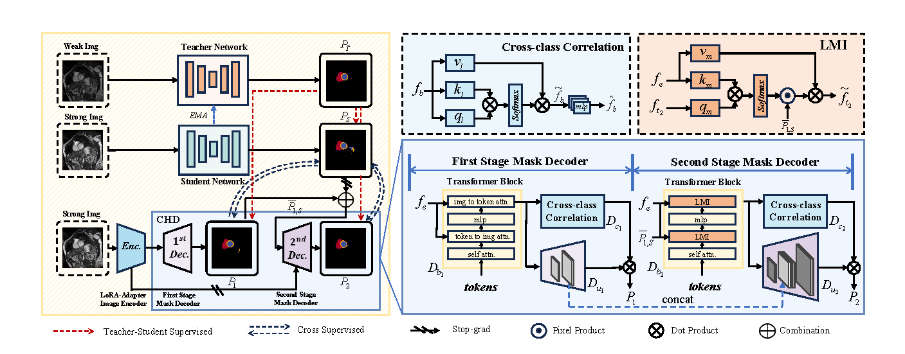

**Abstract**  
Semi-supervised medical image segmentation (SSMIS) mainly leverages valuable information from unlabeled data to complement the limited labeled guidance. Incorporating SAM, with its excellent generalization capabilities, enhances the learning process from unlabeled data, as demonstrated by existing methods. However, most current SAM-based methods in SSMIS focus on unique prompt design, while the prompts generated for unlabeled data through pseudo-labels unavoidably introduce noise, limiting the following decoding process. In this paper, we propose a Cross-Hierarchical Decoding (CHD) process for SAM, which removes explicit prompts (<italic xmlns:mml="http://www.w3.org/1998/Math/MathML" xmlns:xlink="http://www.w3.org/1999/xlink">e.g.</i>, point or box) and thus mitigates the influence of inaccurate pseudo labels. Specifically, our CHD is a two-stage decoder. The first stage uses the original decoder in SAM to generate probability masks, which are combined with a learnable mask interaction module in the second stage to achieve more fine-grained segmentation. Meanwhile, to remove the restriction that the original SAM can only segment foreground-background categories, we design a cross-class correlation module in CHD to capture class-wise interrelationships between different classes, thus achieving multi-class segmentation. Extensive experiments show that CHD achieves new state-of-the-art performance for SSMIS, significantly improving different baselines.

**Summary**  
TBD

[⬆ Back to Literature Table](#samsslmis)

---

### <a id="fm2-fusing-multiple-foundation-models-for-pathol-077cda3a">FM2: Fusing multiple foundation models for pathology image analysis via disentangled consensus-divergence representation</a>
> **Venue:** Information Fusion 2026  
> **Authors:** Y. Yang et al.  
> **Keywords:** OtherMIS, SAM
**Links**  
[Viewable Link](https://linkinghub.elsevier.com/retrieve/pii/S1566253525009029) [Original Link](https://www.sciencedirect.com/science/article/abs/pii/S1566253525009029)

  <!-- Add image to imgs/ and uncomment the img tag below. -->
  <!--  -->

**Abstract**  
TBD

**Summary**  
TBD

[⬆ Back to Literature Table](#samothers)

---

### <a id="de-lightsam-modality-decoupled-lightweight-sam-f-f94275f8">De-LightSAM: Modality-Decoupled Lightweight SAM for Generalizable Medical Segmentation</a>
> **Venue:** arXiv.org 2024  
> **Authors:** Q. Xu et al.  
> **Keywords:** OtherMIS, SAM
**Links**  
[Viewable Link](https://arxiv.org/abs/2407.14153) [Original Link](https://ieeexplore.ieee.org/abstract/document/11203003) [Code](https://github.com/xq141839/De-LightSAM)

  

**Abstract**  
The universality of deep neural networks across different modalities and their generalization capabilities to unseen domains play an essential role in medical image segmentation. The recent segment anything model (SAM) has demonstrated strong adaptability across diverse natural scenarios. However, the huge computational costs, demand for manual annotations as prompts and conflict-prone decoding process of SAM degrade its generalization capabilities in medical scenarios. To address these limitations, we propose a modality-decoupled lightweight SAM for domain-generalized medical image segmentation, named De-LightSAM. Specifically, we first devise a lightweight domain-controllable image encoder (DC-Encoder) that produces discriminative visual features for diverse modalities. Further, we introduce the self-patch prompt generator (SP-Generator) to automatically generate high-quality dense prompt embeddings for guiding segmentation decoding. Finally, we design the query-decoupled modality decoder (QM-Decoder) that leverages a one-to-one strategy to provide an independent decoding channel for every modality, preventing mutual knowledge interference of different modalities. Moreover, we design a multi-modal decoupled knowledge distillation (MDKD) strategy to leverage robust common knowledge to complement domain-specific medical feature representations. Extensive experiments indicate that De-LightSAM outperforms state-of-the-arts in diverse medical imaging segmentation tasks, displaying superior modality universality and generalization capabilities. Especially, De-LightSAM uses only 2.0% parameters compared to SAM-H. The source code is available at https://github.com/xq141839/De-LightSAM.

**Summary**  
TBD

[⬆ Back to Literature Table](#samothers)

---

### <a id="sam2-3dmed-empowering-sam2-for-3d-medical-image-f661aa9e">SAM2-3dMed: Empowering SAM2 for 3D Medical Image Segmentation</a>
> **Venue:** arXiv.org 2025  
> **Authors:** Y. Yang et al.  
> **Keywords:** OtherMIS, SAM
**Links**  
[Viewable Link](https://arxiv.org/abs/2510.08967) [Original Link](https://arxiv.org/pdf/2510.08967)

  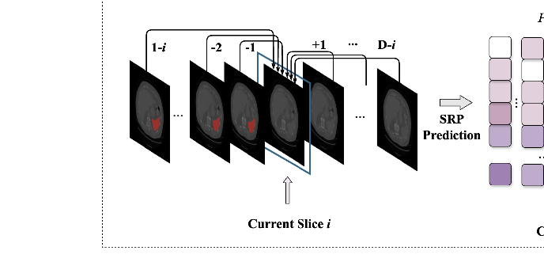

**Abstract**  
Accurate segmentation of 3D medical images is critical for clinical applications like disease assessment and treatment planning. While the Segment Anything Model 2 (SAM2) has shown remarkable success in video object segmentation by leveraging temporal cues, its direct application to 3D medical images faces two fundamental domain gaps: 1) the bidirectional anatomical continuity between slices contrasts sharply with the unidirectional temporal flow in videos, and 2) precise boundary delineation, crucial for morphological analysis, is often underexplored in video tasks. To bridge these gaps, we propose SAM2-3dMed, an adaptation of SAM2 for 3D medical imaging. Our framework introduces two key innovations: 1) a Slice Relative Position Prediction (SRPP) module explicitly models bidirectional inter-slice dependencies by guiding SAM2 to predict the relative positions of different slices in a self-supervised manner; 2) a Boundary Detection (BD) module enhances segmentation accuracy along critical organ and tissue boundaries. Extensive experiments on three diverse medical datasets (the Lung, Spleen, and Pancreas in the Medical Segmentation Decathlon (MSD) dataset) demonstrate that SAM2-3dMed significantly outperforms state-of-the-art methods, achieving superior performance in segmentation overlap and boundary precision. Our approach not only advances 3D medical image segmentation performance but also offers a general paradigm for adapting video-centric foundation models to spatial volumetric data.

**Summary**  
TBD

[⬆ Back to Literature Table](#samothers)

---

### <a id="dynamic-prompt-generation-for-interactive-3d-med-5059610d">Dynamic Prompt Generation for Interactive 3D Medical Image Segmentation Training</a>
> **Venue:** arXiv.org 2025  
> **Authors:** TC. Ndir et al.  
> **Keywords:** InteractiveMIS, SAM
**Links**  
[Viewable Link](https://arxiv.org/abs/2510.03189) [Original Link](https://arxiv.org/pdf/2510.03189)

  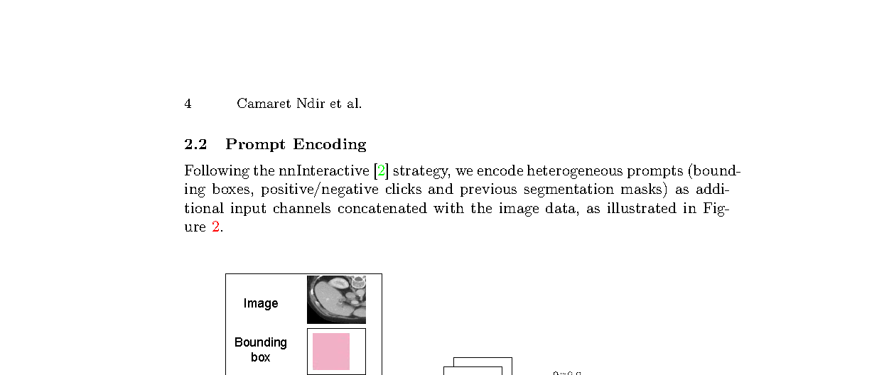

**Abstract**  
Interactive 3D biomedical image segmentation requires efficient models that can iteratively refine predictions based on user prompts. Current foundation models either lack volumetric awareness or suffer from limited interactive capabilities. We propose a training strategy that combines dynamic volumetric prompt generation with content-aware adaptive cropping to optimize the use of the image encoder. Our method simulates realistic user interaction patterns during training while addressing the computational challenges of learning from sequential refinement feedback on a single GPU. For efficient training, we initialize our network using the publicly available weights from the nnInteractive segmentation model. Evaluation on the \textbf{Foundation Models for Interactive 3D Biomedical Image Segmentation} competition demonstrates strong performance with an average final Dice score of 0.6385, normalized surface distance of 0.6614, and area-under-the-curve metrics of 2.4799 (Dice) and 2.5671 (NSD).

**Summary**  
TBD

[⬆ Back to Literature Table](#samiwmis)

---

### <a id="iplc-sam-guided-iterative-pseudo-label-correctio-08e09c28">IPLC+: SAM-Guided Iterative Pseudo Label Correction for Source-Free Domain Adaptation in Medical Image Segmentation</a>
> **Venue:** IEEE Journal of Biomedical and Health Informatics 2025  
> **Authors:** G. Zhang et al.  
> **Keywords:** OtherMIS, SAM
**Links**  
[Viewable Link](https://ieeexplore.ieee.org/document/11177220/) [Original Link](https://ieeexplore.ieee.org/abstract/document/11177220) [Code](https://github.com/HiLab-git/IPLC)

  <!-- Add image to imgs/ and uncomment the img tag below. -->
  <!--  -->

**Abstract**  
Domain Adaptation (DA) is important for a segmentation model to deal with domain shift in a new target domain. Due to the privacy concern of medical data and the expensive annotation process, Source-Free Domain Adaptation (SFDA) is appealing without access to source data and labels of target domain images for the adaptation. However, existing SFDA methods have limited performance due to insufficient supervision and unreliable pseudo labels. In this paper, we propose an enhanced Iterative Pseudo Label Correction (IPLC+) SFDA framework guided by Segment Anything Model (SAM) for medical image segmentation. Specifically, with a pre-trained source model and SAM, we propose a Reliable SAM Pseudo-label Generator (RSPG) to obtain high-quality and reliable pseudo labels in the target domain based on multiple prompts randomly sampled from the model's prediction. To provide more efficient constraints during adaptation, we introduce self-training pseudo labels weighted by the uncertainty, and propose regularization using mean curvature minimization based on shape-prior knowledge for smoother segmentation. We also propose an Iterative Correction Learning (ICL) strategy to iteratively refine pseudo labels using SAM with updated prompts and combine supervisions to optimize the model sufficiently. Experiments on two public multi-site datasets for prostate and heart segmentation show that our method effectively outperformed ten state-of-the-art SFDA methods, improved the quality of pseudo labels, and even achieved better results than fully supervised learning in the target domain in some cases.

**Summary**  
TBD

[⬆ Back to Literature Table](#samothers)

---

### <a id="balr-sam-boundary-aware-low-rank-adaptation-of-s-b7576818">BALR-SAM: Boundary-Aware Low-Rank Adaptation of SAM for Resource-Efficient Medical Image Segmentation</a>
> **Venue:** arXiv.org 2025  
> **Authors:** Z. Liu et al.  
> **Keywords:** OtherMIS, SAM
**Links**  
[Viewable Link](https://arxiv.org/abs/2509.24204?) [Original Link](https://arxiv.org/pdf/2509.24204?)

  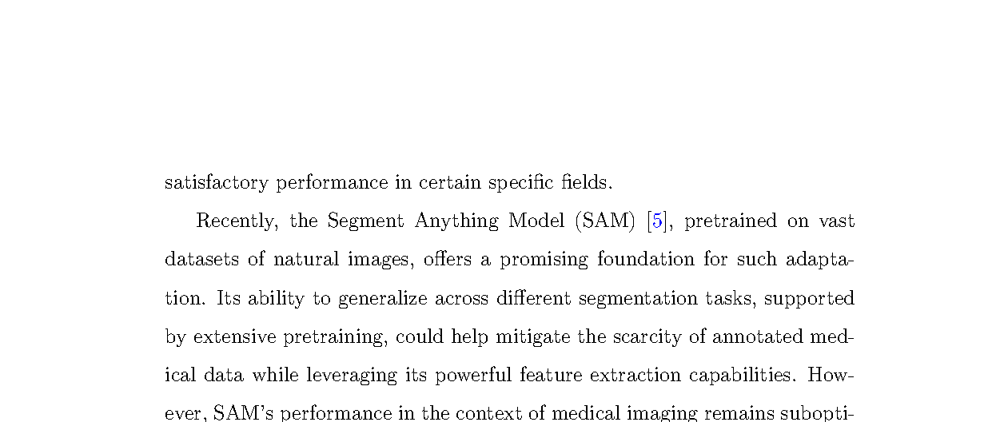

**Abstract**  
Vision foundation models like the Segment Anything Model (SAM), pretrained on large-scale natural image datasets, often struggle in medical image segmentation due to a lack of domain-specific adaptation. In clinical practice, fine-tuning such models efficiently for medical downstream tasks with minimal resource demands, while maintaining strong performance, is challenging. To address these issues, we propose BALR-SAM, a boundary-aware low-rank adaptation framework that enhances SAM for medical imaging. It combines three tailored components: (1) a Complementary Detail Enhancement Network (CDEN) using depthwise separable convolutions and multi-scale fusion to capture boundary-sensitive features essential for accurate segmentation; (2) low-rank adapters integrated into SAM's Vision Transformer blocks to optimize feature representation and attention for medical contexts, while simultaneously significantly reducing the parameter space; and (3) a low-rank tensor attention mechanism in the mask decoder, cutting memory usage by 75% and boosting inference speed. Experiments on standard medical segmentation datasets show that BALR-SAM, without requiring prompts, outperforms several state-of-the-art (SOTA) methods, including fully fine-tuned MedSAM, while updating just 1.8% (11.7M) of its parameters.

**Summary**  
TBD

[⬆ Back to Literature Table](#samothers)

---

### <a id="bio2vol-adapting-2d-biomedical-foundation-models-8d1e0f68">Bio2Vol: Adapting 2D Biomedical Foundation Models for Volumetric Medical Image Segmentation</a>
> **Venue:** Lecture Notes in Computer Science 2026  
> **Authors:** J. Zhuang et al.  
> **Keywords:** OtherMIS, SAM
**Links**  
[Viewable Link](https://link.springer.com/10.1007/978-3-032-04978-0_3) [Original Link](https://papers.miccai.org/miccai-2025/paper/1852_paper.pdf) [Code](https://github.com/JiaxinZhuang/Bio2Vol)

  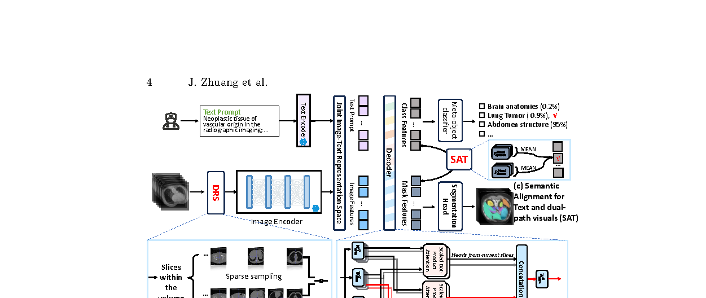

**Abstract**  
TBD

**Summary**  
TBD

[⬆ Back to Literature Table](#samothers)

---

### <a id="ha-sam-hierarchically-adapting-sam-for-nerve-seg-1b6df244">HA-SAM: Hierarchically Adapting SAM for Nerve Segmentation in Ultrasound Images</a>
> **Venue:** Lecture Notes in Computer Science 2026  
> **Authors:** Z. Peng et al.  
> **Keywords:** OtherMIS, SAM
**Links**  
[Viewable Link](https://link.springer.com/10.1007/978-3-032-04978-0_31) [Original Link](https://papers.miccai.org/miccai-2025/paper/3104_paper.pdf)

  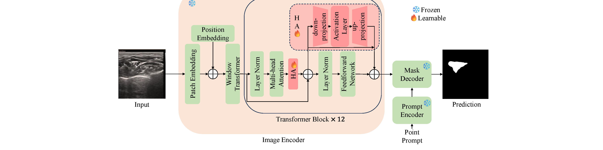

**Abstract**  
TBD

**Summary**  
TBD

[⬆ Back to Literature Table](#samothers)

---

### <a id="collect-vascular-specimens-in-one-cabinet-a-hier-c982a512">Collect vascular specimens in one cabinet: A hierarchical prompt-guided universal model for 3D vascular segmentation</a>
> **Venue:** Computerized Medical Imaging and Graphics 2025  
> **Authors:** Y. Wang et al.  
> **Keywords:** OtherMIS, SAM
**Links**  
[Viewable Link](https://linkinghub.elsevier.com/retrieve/pii/S0895611125001594) [Original Link](https://www.sciencedirect.com/science/article/abs/pii/S0895611125001594) [Code](https://github.com/mileswyn/VasCab)

  <!-- Add image to imgs/ and uncomment the img tag below. -->
  <!--  -->

**Abstract**  
TBD

**Summary**  
TBD

[⬆ Back to Literature Table](#samothers)

---

### <a id="embedded-framework-for-clinical-medical-image-se-f5b99baf">Embedded framework for clinical medical image segment anything in resource limited healthcare regions</a>
> **Venue:** npj Digital Medicine 2025  
> **Authors:** Y. Zhang et al.  
> **Keywords:** OtherMIS, SAM
**Links**  
[Viewable Link](https://www.nature.com/articles/s41746-025-01881-y) [Original Link](https://www.nature.com/articles/s41746-025-01881-y.pdf) [Code](https://github.com/yuhoo0302/Segment-Anything-Model-for-Medical-Images)

  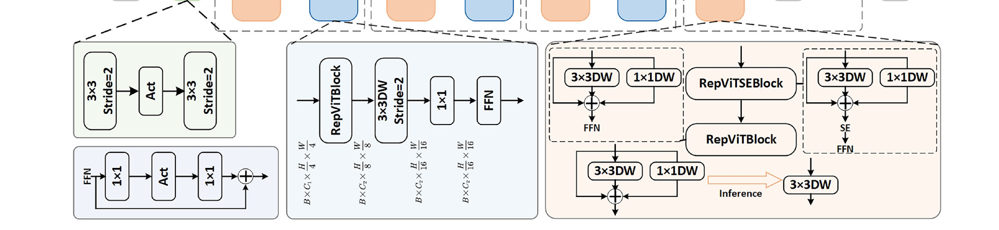

**Abstract**  
The emergence of portable imaging devices improves medical image acquisition efficiency in resource-limited regions, but a shortage of medical personnel still limits timely diagnosis. We propose Embed-MedSAM, a fully automatic segmentation model with low deployment cost. Built on MedSAM, it integrates a lightweight RepViT encoder to reduce computation and applies two-stage distillation on over one million multimodal medical images to preserve the original model's visual representation. A self-prompting mechanism is also introduced, where the model generates pseudo labels to guide fine-grained segmentation. The training jointly optimizes KL divergence and segmentation losses to improve accuracy under prompt-free conditions. Embed-MedSAM shows excellent performance on 17 benchmark datasets covering 7 imaging modalities. Without external prompts, it improves average Dice score by nearly 16% over the second-best model. It also runs at nearly 30 FPS on iPhone 14, showing strong potential for real-world deployment.

**Summary**  
TBD

[⬆ Back to Literature Table](#samothers)

---

### <a id="segment-anything-model-for-gastric-cancer-5ee84a79">Segment Anything Model for Gastric Cancer</a>
> **Venue:** Cancer Medicine 2025  
> **Authors:** L. Li et al.  
> **Keywords:** OtherMIS, SAM
**Links**  
[Viewable Link](https://onlinelibrary.wiley.com/doi/10.1002/cam4.71246) [Original Link](https://link.springer.com/chapter/10.1007/978-3-032-04937-7_19)

  <!-- Add image to imgs/ and uncomment the img tag below. -->
  <!--  -->

**Abstract**  
The proposed GC-SAM model shows strong capability in segmenting gastric cancer tissue, while also demonstrating practical potential for deployment in embedded medical imaging devices.

**Summary**  
TBD

[⬆ Back to Literature Table](#samothers)

---

### <a id="spatial-temporal-memory-filtering-sam-for-lesion-b834589c">Spatial-Temporal Memory Filtering SAM for Lesion Segmentation in Breast Ultrasound Videos</a>
> **Venue:** Lecture Notes in Computer Science 2026  
> **Authors:** Z. Tu et al.  
> **Keywords:** OtherMIS, SAM
**Links**  
[Viewable Link](https://link.springer.com/10.1007/978-3-032-04937-7_52) [Original Link](https://link.springer.com/chapter/10.1007/978-3-032-04937-7_52) [Code](https://github.com/tzz-ahu/STMFSAM)

  <!-- Add image to imgs/ and uncomment the img tag below. -->
  <!--  -->

**Abstract**  
Lesion segmentation in breast ultrasound videos plays a crucial role in the early detection and intervention of breast cancer. However, it remains a challenging task due to blurred lesion boundaries, substantial background noise, and significant scale variations of...

**Summary**  
TBD

[⬆ Back to Literature Table](#samothers)

---

### <a id="moe-sam-enhancing-sam-for-medical-image-segmenta-85cf6d0f">MoE-SAM: Enhancing SAM for Medical Image Segmentation with Mixture-of-Experts</a>
> **Venue:** Lecture Notes in Computer Science 2026  
> **Authors:** R. Li et al.  
> **Keywords:** OtherMIS, SAM
**Links**  
[Viewable Link](https://link.springer.com/10.1007/978-3-032-04937-7_35) [Original Link](https://link.springer.com/chapter/10.1007/978-3-032-04937-7_35) [Code](https://github.com/Asphyxiate-Rye/E-SAM)

  <!-- Add image to imgs/ and uncomment the img tag below. -->
  <!--  -->

**Abstract**  
Recent adaptations of the powerful and promptable Segment Anything Model (SAM), pretrained on a large-scale dataset, have shown promising results in medical image segmentation. However, existing methods fail to fully leverage the intermediate features from...

**Summary**  
TBD

[⬆ Back to Literature Table](#samothers)

---

### <a id="from-generalist-to-specialist-distilling-a-mixtu-0c769308">From Generalist to Specialist: Distilling a Mixture of Foundation Models for Domain-Specific Medical Image Segmentation</a>
> **Venue:** Lecture Notes in Computer Science 2026  
> **Authors:** Q. Li et al.  
> **Keywords:** OtherMIS, SAM
**Links**  
[Viewable Link](https://link.springer.com/10.1007/978-3-032-04937-7_19) [Original Link](https://link.springer.com/chapter/10.1007/978-3-032-04937-7_19)

  <!-- Add image to imgs/ and uncomment the img tag below. -->
  <!--  -->

**Abstract**  
Segmentation foundation models (SFMs) hold promise for medical image analysis, but their direct clinical application is limited by computational cost, potentially suboptimal accuracy, and fairness concerns. In this paper, we propose a novel framework to address these...

**Summary**  
TBD

[⬆ Back to Literature Table](#samothers)

---

### <a id="towards-robust-retinal-vessel-segmentation-via-r-53ad2453">Towards Robust Retinal Vessel Segmentation via Reducing Open-Set Label Noises from SAM-Generated Masks</a>
> **Venue:** Lecture Notes in Computer Science 2026  
> **Authors:** M. Zhang et al.  
> **Keywords:** OtherMIS, SAM
**Links**  
[Viewable Link](https://link.springer.com/10.1007/978-3-032-04937-7_60) [Original Link](https://link.springer.com/chapter/10.1007/978-3-032-04937-7_60)

  <!-- Add image to imgs/ and uncomment the img tag below. -->
  <!--  -->

**Abstract**  
Retinal vessel segmentation from fundus images is an important task in intelligent ophthalmology. Because vessel annotation is particularly challenging, the scarcity of training labels hinders the model robustness for real-world scenarios. Recent research has shown...

**Summary**  
TBD

[⬆ Back to Literature Table](#samothers)

---

### <a id="sparsely-annotated-medical-image-segmentation-vi-55970c6a">Sparsely Annotated Medical Image Segmentation via Cross-SAM of 3D and 2D Networks</a>
> **Venue:** Lecture Notes in Computer Science 2026  
> **Authors:** H. Su et al.  
> **Keywords:** OtherMIS, SAM
**Links**  
[Viewable Link](https://link.springer.com/10.1007/978-3-032-05141-7_51) [Original Link](https://link.springer.com/chapter/10.1007/978-3-032-05141-7_51) [Code](https://github.com/CTSegPilot/SA-Net.git)

  <!-- Add image to imgs/ and uncomment the img tag below. -->
  <!--  -->

**Abstract**  
Medical image segmentation typically relies on large, accurately annotated datasets. However, acquiring pixel-level annotations is a labor-intensive process that demands substantial effort from domain experts, posing significant challenges in obtaining such...

**Summary**  
TBD

[⬆ Back to Literature Table](#samothers)

---

### <a id="pfedsam-personalized-federated-learning-of-segme-9fef3358">pFedSAM: Personalized Federated Learning of Segment Anything Model for Medical Image Segmentation</a>
> **Venue:** arXiv.org 2025  
> **Authors:** T. Wang et al.  
> **Keywords:** OtherMIS, SAM
**Links**  
[Viewable Link](https://arxiv.org/abs/2509.15638) [Original Link](https://arxiv.org/pdf/2509.15638)

  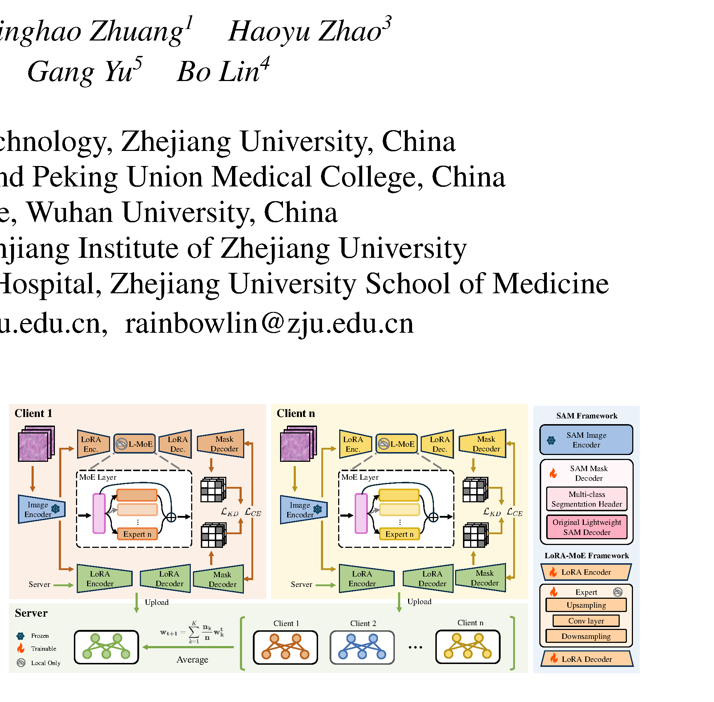

**Abstract**  
Medical image segmentation is crucial for computer-aided diagnosis, yet privacy constraints hinder data sharing across institutions. Federated learning addresses this limitation, but existing approaches often rely on lightweight architectures that struggle with complex, heterogeneous data. Recently, the Segment Anything Model (SAM) has shown outstanding segmentation capabilities; however, its massive encoder poses significant challenges in federated settings. In this work, we present the first personalized federated SAM framework tailored for heterogeneous data scenarios in medical image segmentation. Our framework integrates two key innovations: (1) a personalized strategy that aggregates only the global parameters to capture cross-client commonalities while retaining the designed L-MoE (Localized Mixture-of-Experts) component to preserve domain-specific features; and (2) a decoupled global-local fine-tuning mechanism that leverages a teacher-student paradigm via knowledge distillation to bridge the gap between the global shared model and the personalized local models, thereby mitigating overgeneralization. Extensive experiments on two public datasets validate that our approach significantly improves segmentation performance, achieves robust cross-domain adaptation, and reduces communication overhead.

**Summary**  
TBD

[⬆ Back to Literature Table](#samothers)

---

### <a id="dur-net-semi-supervised-abdominal-ct-pheochromoc-678a0928">DUR-Net+: Semi-Supervised Abdominal CT Pheochromocytoma Segmentation Via Dynamic Uncertainty Rectified and Prior Knowledge From SAM-Med3D</a>
> **Venue:** IEEE Journal of Biomedical and Health Informatics 2026  
> **Authors:** C. Qin et al.  
> **Keywords:** SSLMIS, SAM
**Links**  
[Viewable Link](https://ieeexplore.ieee.org/document/11162509/) [Original Link](https://ieeexplore.ieee.org/abstract/document/11162509)

  <!-- Add image to imgs/ and uncomment the img tag below. -->
  <!--  -->

**Abstract**  
Pheochromocytoma is a rare urological adrenal tumor disease. Automated segmentation of pheochromocytomas from computed tomography (CT) is essential for diagnosis and treatment. However, this task is a challenging one due to issues such as blurred boundaries, irregular shapes, variations in location and size, and the lack of annotated images for training. To address these issues, we propose a semi-supervised framework for pheochromocytoma segmentation that primarily consists of a dynamic uncertainty rectification mechanism and a supervised strategy based on SAM-Med3D prior knowledge. First, we design a semi-supervised segmentation model comprising a shared encoder and multiple independent decoders that dynamically select pseudo labels from the different decoder outputs. To mitigate the risk of unreliable predictions caused by sparse annotations during training, we introduce uncertainty estimation to prioritize reliable outputs. Additionally, an Attentional Convolution Block (ACB) is designed in the encoding stage to fully utilize both global and local features, improving tumor recognition in segmentation. Furthermore, SAM-Med3D prior knowledge is incorporated into the framework as supplementary supervisory information, aiding the model in learning from limited labeled data. To eliminate the labor-intensive requirement for manual prompts in SAM-Med3D, we leverage pseudo labels to generate high-quality mask prompts, thus transforming the clinical workflow. Experiments on two pheochromocytoma datasets from different centers demonstrate that our proposed method achieves competitive performance.

**Summary**  
TBD

[⬆ Back to Literature Table](#samsslmis)

---

### <a id="samtnu-adaptive-segment-anything-model-for-thyro-a848035d">SAMTNU: Adaptive Segment Anything Model for Thyroid and Nodule Ultrasound Image Segmentation</a>
> **Venue:** Lecture Notes in Computer Science 2026  
> **Authors:** D. Chen et al.  
> **Keywords:** OtherMIS, SAM
**Links**  
[Viewable Link](https://link.springer.com/10.1007/978-3-032-04546-1_29) [Original Link](https://link.springer.com/chapter/10.1007/978-3-032-04546-1_29)

  <!-- Add image to imgs/ and uncomment the img tag below. -->
  <!--  -->

**Abstract**  
Segment Anything Model (SAM) has achieved significant success in natural image segmentation. However, it struggles with ultrasound images, especially when dealing with individual organs with small samples. To address these challenges, we propose SAMTNU, an adaptive...

**Summary**  
TBD

[⬆ Back to Literature Table](#samothers)

---

### <a id="leveraging-multi-text-joint-prompts-in-sam-for-r-01d9134a">Leveraging Multi-Text Joint Prompts in SAM for Robust Medical Image Segmentation</a>
> **Venue:** IEEE Journal of Biomedical and Health Informatics 2026  
> **Authors:** X. Zhang et al.  
> **Keywords:** OtherMIS, SAM
**Links**  
[Viewable Link](https://ieeexplore.ieee.org/document/11153032/) [Original Link](https://ieeexplore.ieee.org/abstract/document/11153032)

  <!-- Add image to imgs/ and uncomment the img tag below. -->
  <!--  -->

**Abstract**  
The Segment Anything Model (SAM) has attracted considerable attention due to its impressive performance and demonstrates potential in medical image segmentation. Compared to SAM's native point andbounding box prompts, text prompts offer a simpler and more efficient alternative in the medical field, yet this approach remains relatively underexplored. In this paper, we propose a SAM-based framework that integrates a pre-trained vision-language model to generate referring prompts, with SAM handling the segmentation task. The outputs from multimodal models such as CLIP serve as input to SAM's prompt encoder. A critical challenge stems from the inherent complexity of medical text descriptions: they typically encompass anatomical characteristics, imaging modalities, and diagnostic priorities, resulting in information redundancy and semantic ambiguity. To address this, we propose a text decomposition-recomposition strategy. First, clinical narratives are parsed into atomic semantic units (appearance, location, pathology, and so on). These elements are then recombined into optimized text expressions. We employ a cross-attention module among multiple texts to interact with the joint features, ensuring that the model focuses on features corresponding to effective descriptions. To validate the effectiveness of our method, we conducted experiments on several datasets. Compared to the native SAM based on geometric prompts, our model shows improved performance and usability.

**Summary**  
TBD

[⬆ Back to Literature Table](#samothers)

---

### <a id="a-probabilistic-segment-anything-model-for-ambig-5c3f73e2">A probabilistic segment anything model for ambiguity‑aware medical image segmentation</a>
> **Venue:** Medical Imaging 2026: Imaging Informatics  
> **Authors:** T. Ward et al.  
> **Keywords:** OtherMIS, SAM
**Links**  
[Viewable Link](https://www.spiedigitallibrary.org/conference-proceedings-of-spie/13930/3086125/A-probabilistic-segment-anything-model-for-ambiguityaware-medical-image-segmentation/10.1117/12.3086125.full) [Original Link](https://arxiv.org/pdf/2509.05809) [Code](https://github.com/tbwa233/Probabilistic-SAM)

  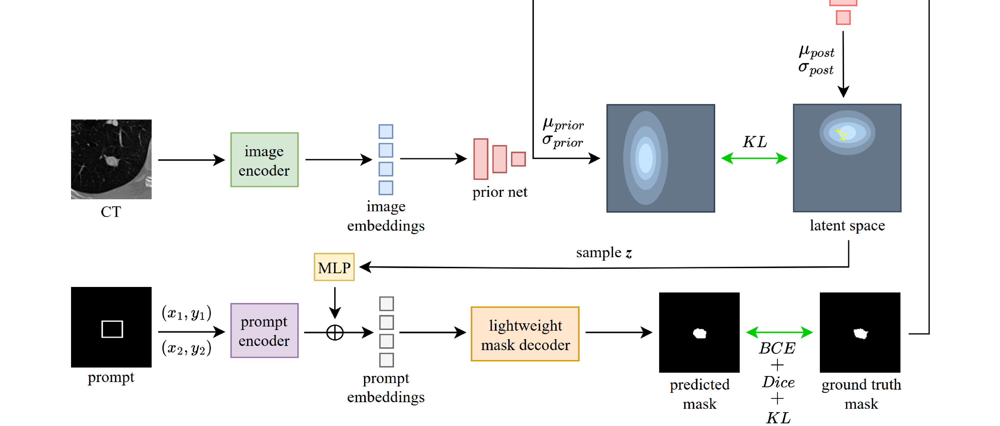

**Abstract**  
Recent advances in promptable segmentation, such as the Segment Anything Model (SAM), have enabled flexible, high-quality mask generation across a wide range of visual domains. However, SAM and similar models remain fundamentally deterministic, producing a single segmentation per object per prompt, and fail to capture the inherent ambiguity present in many real-world tasks. This limitation is particularly troublesome in medical imaging, where multiple plausible segmentations may exist due to annotation uncertainty or inter-expert variability. In this paper, we introduce <i>Probabilistic SAM</i>, a probabilistic extension of SAM that models a distribution over segmentations conditioned on both the input image and prompt. By incorporating a latent variable space and training with a variational objective, our model learns to generate diverse and plausible segmentation masks reflecting the variability in human annotations. The architecture integrates a prior and posterior network into the SAM framework, allowing latent codes to modulate the prompt embeddings during inference. The latent space allows for efficient sampling during inference, enabling uncertainty-aware outputs with minimal overhead. We evaluate Probabilistic SAM on the public LIDC-IDRI lung nodule dataset and demonstrate its ability to produce diverse outputs that align with expert disagreement, outperforming existing probabilistic baselines on uncertainty-aware metrics. Our code is available at: https://github.com/tbwa233/Probabilistic-SAM/.

**Summary**  
TBD

[⬆ Back to Literature Table](#samothers)

---

### <a id="medical-sam-clip-grafting-for-brain-tumor-segmen-0c4d4351">Medical SAM-Clip Grafting for brain tumor segmentation</a>
> **Venue:** Computers in Biology and Medicine 2025  
> **Authors:** X. Yu et al.  
> **Keywords:** OtherMIS, SAM
**Links**  
[Viewable Link](https://linkinghub.elsevier.com/retrieve/pii/S0010482525012806) [Original Link](https://www.sciencedirect.com/science/article/abs/pii/S0010482525012806)

  <!-- Add image to imgs/ and uncomment the img tag below. -->
  <!--  -->

**Abstract**  
TBD

**Summary**  
TBD

[⬆ Back to Literature Table](#samothers)

---

### <a id="a-generalist-foundation-model-and-database-for-o-73320fd5">A generalist foundation model and database for open-world medical image segmentation</a>
> **Venue:** Nature Biomedical Engineering 2025  
> **Authors:** S. Zhang et al.  
> **Keywords:** Zero-ShotMIS, SAM
**Links**  
[Viewable Link](https://www.nature.com/articles/s41551-025-01497-3) [Code](https://github.com/MedSegX/MedSegX-code)

  <!-- Add image to imgs/ and uncomment the img tag below. -->
  <!--  -->

**Abstract**  
Vision foundation models have demonstrated vast potential in achieving generalist medical segmentation capability, providing a versatile, task-agnostic solution through a single model. However, current generalist models involve simple pre-training on various medical data containing irrelevant information, often resulting in the negative transfer phenomenon and degenerated performance. Furthermore, the practical applicability of foundation models across diverse open-world scenarios, especially in out-of-distribution (OOD) settings, has not been extensively evaluated. Here we construct a publicly accessible database, MedSegDB, based on a tree-structured hierarchy and annotated from 129 public medical segmentation repositories and 5 in-house datasets. We further propose a Generalist Medical Segmentation model (MedSegX), a vision foundation model trained with a model-agnostic Contextual Mixture of Adapter Experts (ConMoAE) for open-world segmentation. We conduct a comprehensive evaluation of MedSegX across a range of medical segmentation tasks. Experimental results indicate that MedSegX achieves state-of-the-art performance across various modalities and organ systems in in-distribution (ID) settings. In OOD and real-world clinical settings, MedSegX consistently maintains its performance in both zero-shot and data-efficient generalization, outperforming other foundation models. MedSegX is a vision foundation model for open-world medical image segmentation, and its accompanying dataset covers a large number of segmentation tasks across 39 organs and tissues.

**Summary**  
TBD

[⬆ Back to Literature Table](#samzsmis)

---

### <a id="large-vocabulary-segmentation-for-medical-images-5ebf18ad">Large-Vocabulary Segmentation for Medical Images with Text Prompts</a>
> **Venue:** arXiv.org 2023  
> **Authors:** Z. Zhao et al.  
> **Keywords:** InteractiveMIS, SAM
**Links**  
[Viewable Link](https://arxiv.org/abs/2312.17183) [Original Link](https://www.nature.com/articles/s41746-025-01964-w) [Code](https://github.com/zhaoziheng/SAT)

  

**Abstract**  
This paper aims to build a model that can Segment Anything in 3D medical images, driven by medical terminologies as Text prompts, termed as SAT. Our main contributions are three-fold: (i) We construct the first multimodal knowledge tree on human anatomy, including 6502 anatomical terminologies; Then, we build the largest and most comprehensive segmentation dataset for training, collecting over 22K 3D scans from 72 datasets, across 497 classes, with careful standardization on both image and label space; (ii) We propose to inject medical knowledge into a text encoder via contrastive learning and formulate a large-vocabulary segmentation model that can be prompted by medical terminologies in text form; (iii) We train SAT-Nano (110M parameters) and SAT-Pro (447M parameters). SAT-Pro achieves comparable performance to 72 nnU-Nets -- the strongest specialist models trained on each dataset (over 2.2B parameters combined) -- over 497 categories. Compared with the interactive approach MedSAM, SAT-Pro consistently outperforms across all 7 human body regions with +7.1% average Dice Similarity Coefficient (DSC) improvement, while showing enhanced scalability and robustness. On 2 external (cross-center) datasets, SAT-Pro achieves higher performance than all baselines (+3.7% average DSC), demonstrating superior generalization ability.

**Summary**  
TBD

[⬆ Back to Literature Table](#samiwmis)

---

### <a id="persistent-homology-and-segment-anything-model-f-b2cfe487">Persistent Homology and Segment Anything Model for Automated Zero-Shot Localized Medical X-ray Images Segmentation (PH-SAM)</a>
> **Venue:** Lecture Notes in Networks and Systems 2025  
> **Authors:** AA. Shami et al.  
> **Keywords:** Zero-ShotMIS, SAM
**Links**  
[Viewable Link](https://link.springer.com/10.1007/978-3-031-99965-9_37) [Original Link](https://link.springer.com/chapter/10.1007/978-3-031-99965-9_37)

  <!-- Add image to imgs/ and uncomment the img tag below. -->
  <!--  -->

**Abstract**  
Persistent Homology (PH) has gained popularity in topological data analysis. Building on this trend, we introduce PH-SAM, a novel hybrid approach for segmenting X-ray images with targeted implants in medical imaging. Our method leverages PH and the Segment Anything...

**Summary**  
TBD

[⬆ Back to Literature Table](#samzsmis)

---

### <a id="e-bayessam-efficient-bayesian-adaptation-of-sam-a45bc870">E-BayesSAM: Efficient Bayesian Adaptation of SAM with Self-optimizing KAN-Based Interpretation for Uncertainty-Aware Ultrasonic Segmentation</a>
> **Venue:** Lecture Notes in Computer Science 2026  
> **Authors:** B. Huang et al.  
> **Keywords:** Zero-ShotMIS, SAM
**Links**  
[Viewable Link](https://link.springer.com/10.1007/978-3-032-05185-1_13) [Original Link](https://arxiv.org/pdf/2508.17408) [Code](https://github.com/mp31192/E-BayesSAM)

  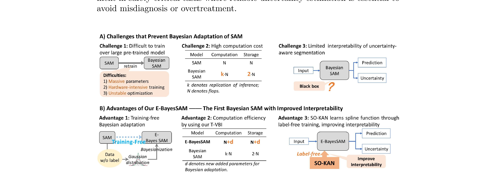

**Abstract**  
Although the Segment Anything Model (SAM) has advanced medical image segmentation, its Bayesian adaptation for uncertainty-aware segmentation remains hindered by three key issues: (1) instability in Bayesian fine-tuning of large pre-trained SAMs; (2) high computation cost due to SAM's massive parameters; (3) SAM's black-box design limits interpretability. To overcome these, we propose E-BayesSAM, an efficient framework combining Token-wise Variational Bayesian Inference (T-VBI) for efficienty Bayesian adaptation and Self-Optimizing Kolmogorov-Arnold Network (SO-KAN) for improving interpretability. T-VBI innovatively reinterprets SAM's output tokens as dynamic probabilistic weights and reparameterizes them as latent variables without auxiliary training, enabling training-free VBI for uncertainty estimation. SO-KAN improves token prediction with learnable spline activations via self-supervised learning, providing insight to prune redundant tokens to boost efficiency and accuracy. Experiments on five ultrasound datasets demonstrated that E-BayesSAM achieves: (i) real-time inference (0.03s/image), (ii) superior segmentation accuracy (average DSC: Pruned E-BayesSAM's 89.0\% vs. E-BayesSAM's 88.0% vs. MedSAM's 88.3%), and (iii) identification of four critical tokens governing SAM's decisions. By unifying efficiency, reliability, and interpretability, E-BayesSAM bridges SAM's versatility with clinical needs, advancing deployment in safety-critical medical applications. The source code is available at https://github.com/mp31192/E-BayesSAM.

**Summary**  
TBD

[⬆ Back to Literature Table](#samzsmis)

---

### <a id="mfb-sac-a-multi-scale-frequency-and-boundary-enh-790e1d91">MFB-SAC: A Multi-Scale Frequency and Boundary-Enhanced SAM for Cell Segmentation</a>
> **Venue:** 2025 IEEE International Conference on Image Processing (ICIP)  
> **Authors:** X. Sun et al.  
> **Keywords:** OtherMIS, SAM
**Links**  
[Viewable Link](https://ieeexplore.ieee.org/document/11084537/) [Original Link](https://ieeexplore.ieee.org/abstract/document/11084537) [Code](https://github.com/Mrliujunwen/SAC)

  <!-- Add image to imgs/ and uncomment the img tag below. -->
  <!--  -->

**Abstract**  
In medical image analysis, precise cell segmentation is crucial for understanding cell morphology and diagnosing diseases. Nevertheless, traditional models typically trained for specific modalities or cell types often fail to generalize to unknown categories. The Segment Anything Model (SAM) was introduced to address this but relies heavily on precise prompts and lacks integration of frequency domain features alongside multi-scale and multi-level information. To overcome these limitations, we propose Multi-scale Frequency and Boundary-enhanced Segment Any Cells (MFB-SAC), which includes a Multi-scale Frequency Convolution (MFC) module for providing multi-scale information and texture detail and a Multi-level Boundary Awareness (MBA) module to enhance boundary retention. Additionally, a Dual-representation Collaborative Attention (DCA) module optimizes feature integration. We tested MFB-SAC on 8 public datasets with various microscopy techniques and cell types. The results reveal that MFB-SAC outperforms the current general and benchmark cell segmentation models. The code is available at https://github.com/Mrliujunwen/SAC.

**Summary**  
TBD

[⬆ Back to Literature Table](#samothers)

---

### <a id="enhancing-feature-discrimination-with-pseudo-lab-b40b4f94">Enhancing feature discrimination with pseudo-labels for foundation model in segmentation of 3D medical images</a>
> **Venue:** Neural Networks 2026  
> **Authors:** G. Jin et al.  
> **Keywords:** OtherMIS, SAM
**Links**  
[Viewable Link](https://linkinghub.elsevier.com/retrieve/pii/S0893608025008603) [Original Link](https://www.sciencedirect.com/science/article/pii/S0893608025008603) [Code](https://github.com/lonezhizi/PESF)

  <!-- Add image to imgs/ and uncomment the img tag below. -->
  <!--  -->

**Abstract**  
Development of medical image segmentation foundation models relies on large-scale samples. However, it is more time-consuming to annotate 3D medical images than 2D natural images, making it challenging to collect sufficient annotated samples. While pseudo-labeling offers a potential solution to expand the annotated dataset, it may introduce noisy labels that can create systematic biases, particularly affecting the segmentation performance of smaller anatomical structures. To this end, we propose a pseudo-label enriched segmentation framework (PESF), which integrates confidence filtering and perturbation-based curriculum learning. To begin with, our pseudo-labeling approach applies a well-pretrained foundation model to generate pseudo-labels for previously unannotated organ categories, effectively expanding the number of classes in the original dataset. Subsequently, we develop a confidence-based filtering mechanism, leveraging a feature extraction module combined with a confidence prediction module to quantitatively assess and filter out low-quality pseudo-labels, thereby minimizing the detrimental effects of noisy pseudo-labels on the model's optimization. Furthermore, a progressive sampling strategy that integrates curriculum learning with Gaussian random perturbations is proposed, systematically introducing training samples from simpler to more complex cases, thereby enhancing the model's generalization capability across organs of varying shapes and sizes. Additionally, our theoretical analysis reveals that incorporating these extra pseudo-labeled classes strengthens feature discrimination by increasing the angular margins between class decision boundaries in the embedding space. Experimental results demonstrate that PESF achieves a 6.8% improvement in the overall average Dice Similarity Coefficient (DSC) compared to the baseline SAM-Med3D on (Amos, FLARE22, WORD, BTCV), with particularly gains in challenging anatomical structures such as the pancreas and esophagus. The code is available at https://github.com/lonezhizi/PESF.

**Summary**  
TBD

[⬆ Back to Literature Table](#samothers)

---

### <a id="medsamix-a-training-free-model-merging-approach-e015befc">MedSAMix: A Training-Free Model Merging Approach for Medical Image Segmentation</a>
> **Venue:** AAAI Conference on Artificial Intelligence 2026  
> **Authors:** Y. Yang et al.  
> **Keywords:** Zero-ShotMIS, SAM
**Links**  
[Viewable Link](https://ojs.aaai.org/index.php/AAAI/article/view/38161) [Original Link](https://arxiv.org/pdf/2508.11032)

  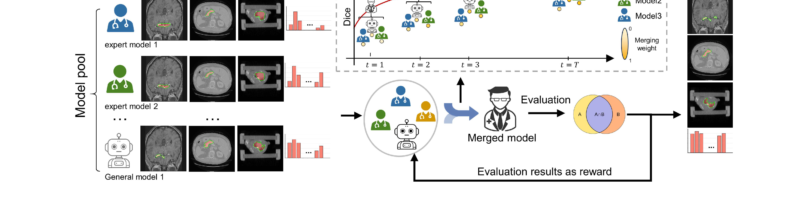

**Abstract**  
Universal medical image segmentation models have emerged as a promising paradigm due to their strong generalizability across diverse tasks, showing great potential for a wide range of clinical applications. This potential has been partly driven by the success of general-purpose vision models such as the Segment Anything Model (SAM), which has inspired the development of various fine-tuned variants for medical segmentation tasks. However, fine-tuned variants like MedSAM are trained on comparatively limited medical imaging data that often suffers from heterogeneity, scarce annotations, and distributional shifts. These challenges limit their ability to generalize across a wide range of medical segmentation tasks. In this regard, we propose MedSAMix, a training-free model merging method that integrates the strengths of both generalist models (e.g., SAM) and specialist models (e.g., MedSAM) for medical image segmentation. In contrast to traditional model merging approaches that rely on manual configuration and often result in suboptimal outcomes, we propose a zero-order optimization method to automatically discover optimal layer-wise merging solutions. Furthermore, for clinical applications, we develop two regimes to meet the demand of domain-specificity and generalizability in different scenarios by single-task optimization and multi-objective optimization respectively. Extensive evaluations on 25 medical segmentation tasks demonstrate that MedSAMix effectively mitigates model bias and consistently improves performance in both domain-specific accuracy and generalization, achieving improvements of 6.67% on specialized tasks and 4.37% on multi-task evaluations.

**Summary**  
TBD

[⬆ Back to Literature Table](#samzsmis)

---

### <a id="enhancing-segment-anything-model-with-spatial-co-5ff547ec">Enhancing Segment Anything Model with spatial context and textural detail for cardiac MRI segmentation</a>
> **Venue:** Biomedical Signal Processing and Control 2026  
> **Authors:** G. Zheng et al.  
> **Keywords:** OtherMIS, SAM
**Links**  
[Viewable Link](https://linkinghub.elsevier.com/retrieve/pii/S1746809425009486) [Original Link](https://www.sciencedirect.com/science/article/abs/pii/S1746809425009486) [Code](https://github.com/LZUzgw/CD-SAM)

  <!-- Add image to imgs/ and uncomment the img tag below. -->
  <!--  -->

**Abstract**  
TBD

**Summary**  
TBD

[⬆ Back to Literature Table](#samothers)

---

### <a id="multi-sequence-parotid-gland-lesion-segmentation-3b5092d8">Multi-Sequence Parotid Gland Lesion Segmentation via Expert Text-Guided Segment Anything Model</a>
> **Venue:** Expert Systems with Applications 2026  
> **Authors:** Z. Wu et al.  
> **Keywords:** OtherMIS, SAM
**Links**  
[Viewable Link](https://linkinghub.elsevier.com/retrieve/pii/S0957417426012819) [Original Link](https://arxiv.org/pdf/2508.09645)

  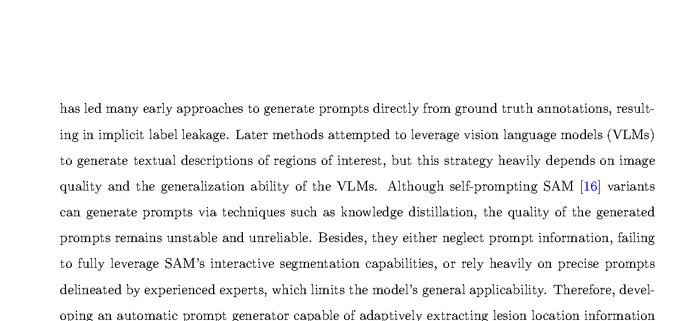

**Abstract**  
Parotid gland lesion segmentation is essential for the treatment of parotid gland diseases. However, due to the variable size and complex lesion boundaries, accurate parotid gland lesion segmentation remains challenging. Recently, the Segment Anything Model (SAM) fine-tuning has shown remarkable performance in the field of medical image segmentation. Nevertheless, SAM's interaction segmentation model relies heavily on precise lesion prompts (points, boxes, masks, etc.), which are very difficult to obtain in real-world applications. Besides, current medical image segmentation methods are automatically generated, ignoring the domain knowledge of medical experts when performing segmentation. To address these limitations, we propose the parotid gland segment anything model (PG-SAM), an expert diagnosis text-guided SAM incorporating expert domain knowledge for cross-sequence parotid gland lesion segmentation. Specifically, we first propose an expert diagnosis report guided prompt generation module that can automatically generate prompt information containing the prior domain knowledge to guide the subsequent lesion segmentation process. Then, we introduce a cross-sequence attention module, which integrates the complementary information of different modalities to enhance the segmentation effect. Finally, the multi-sequence image features and generated prompts are feed into the decoder to get segmentation result. Experimental results demonstrate that PG-SAM achieves state-of-the-art performance in parotid gland lesion segmentation across three independent clinical centers, validating its clinical applicability and the effectiveness of diagnostic text for enhancing image segmentation in real-world clinical settings.

**Summary**  
TBD

[⬆ Back to Literature Table](#samothers)

---

### <a id="segment-anything-in-the-ovary-toward-scalable-ai-d36d0717">Segment Anything in the Ovary: Toward Scalable AI-assisted Lesion Classification</a>
> **Venue:** Radiology 2025  
> **Authors:** R. Bhayana et al.  
> **Keywords:** OtherMIS, SAM
**Links**  
[Viewable Link](http://pubs.rsna.org/doi/10.1148/radiol.252185) [Original Link](https://pubs.rsna.org/doi/abs/10.1148/radiol.252185?journalCode=radiology)

  <!-- Add image to imgs/ and uncomment the img tag below. -->
  <!--  -->

**Abstract**  
TBD

**Summary**  
TBD

[⬆ Back to Literature Table](#samothers)

---

### <a id="sampo-visual-preference-optimization-for-intent-7385e93a">SAMPO: Visual Preference Optimization for Intent-Aware Segmentation with Vision Foundation Models</a>
> **Venue:** 2025  
> **Authors:** Y. Wu et al.  
> **Keywords:** OtherMIS, SAM
**Links**  
[Viewable Link](https://arxiv.org/pdf/2508.02464)

  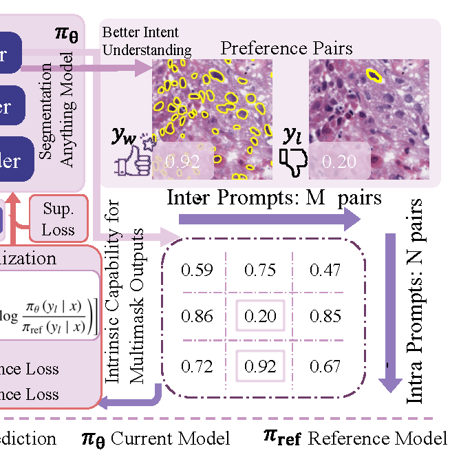

**Abstract**  
TBD

**Summary**  
TBD

[⬆ Back to Literature Table](#samothers)

---

### <a id="samsa-2-0-prompting-segment-anything-with-spectr-f1621e27">SAMSA 2.0: Prompting Segment Anything with Spectral Angles for Hyperspectral Interactive Medical Image Segmentation</a>
> **Venue:** Lecture Notes in Computer Science 2026  
> **Authors:** A. Roddan et al.  
> **Keywords:** Zero-ShotMIS, SAM
**Links**  
[Viewable Link](https://link.springer.com/10.1007/978-3-032-05114-1_46) [Original Link](https://arxiv.org/pdf/2508.00493)

  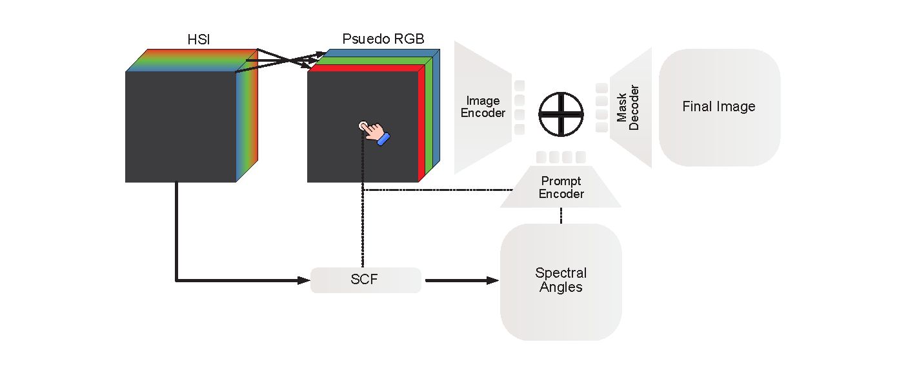

**Abstract**  
We present SAMSA 2.0, an interactive segmentation framework for hyperspectral medical imaging that introduces spectral angle prompting to guide the Segment Anything Model (SAM) using spectral similarity alongside spatial cues. This early fusion of spectral information enables more accurate and robust segmentation across diverse spectral datasets. Without retraining, SAMSA 2.0 achieves up to +3.8% higher Dice scores compared to RGB-only models and up to +3.1% over prior spectral fusion methods. Our approach enhances few-shot and zero-shot performance, demonstrating strong generalization in challenging low-data and noisy scenarios common in clinical imaging.

**Summary**  
TBD

[⬆ Back to Literature Table](#samzsmis)

---

### <a id="is-exchangeability-better-than-i-i-d-to-handle-d-1a2c57e5">Is Exchangeability better than I.I.D to handle Data Distribution Shifts while Pooling Data for Data-scarce Medical image segmentation?</a>
> **Venue:** arXiv.org 2025  
> **Authors:** A. Roy et al.  
> **Keywords:** OtherMIS, SAM
**Links**  
[Viewable Link](https://arxiv.org/abs/2507.19575) [Original Link](https://arxiv.org/pdf/2507.19575) [Code](https://github.com/AyushRoy2001/Exchangeable-feature-disentanglement)

  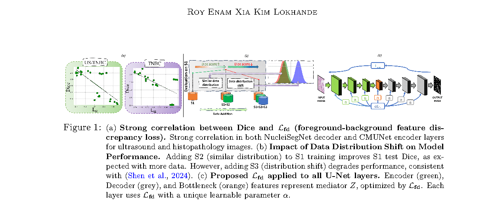

**Abstract**  
Data scarcity is a major challenge in medical imaging, particularly for deep learning models. While data pooling (combining datasets from multiple sources) and data addition (adding more data from a new dataset) have been shown to enhance model performance, they are not without complications. Specifically, increasing the size of the training dataset through pooling or addition can induce distributional shifts, negatively affecting downstream model performance, a phenomenon known as the "Data Addition Dilemma". While the traditional i.i.d. assumption may not hold in multi-source contexts, assuming exchangeability across datasets provides a more practical framework for data pooling. In this work, we investigate medical image segmentation under these conditions, drawing insights from causal frameworks to propose a method for controlling foreground-background feature discrepancies across all layers of deep networks. This approach improves feature representations, which are crucial in data-addition scenarios. Our method achieves state-of-the-art segmentation performance on histopathology and ultrasound images across five datasets, including a novel ultrasound dataset that we have curated and contributed. Qualitative results demonstrate more refined and accurate segmentation maps compared to prominent baselines across three model architectures.

**Summary**  
TBD

[⬆ Back to Literature Table](#samothers)

---

### <a id="sam-med3d-a-vision-foundation-model-for-general-9ee815cb">SAM-Med3D: A Vision Foundation Model for General-Purpose Segmentation on Volumetric Medical Images</a>
> **Venue:** IEEE Transactions on Neural Networks and Learning Systems 2025  
> **Authors:** H. Wang et al.  
> **Keywords:** Zero-ShotMIS, SAM
**Links**  
[Viewable Link](https://ieeexplore.ieee.org/document/11105528/) [Original Link](https://ieeexplore.ieee.org/abstract/document/11105528) [Code](https://github.com/uni-medical/SAM-Med3D)

  <!-- Add image to imgs/ and uncomment the img tag below. -->
  <!--  -->

**Abstract**  
Existing volumetric medical image segmentation models are typically task-specific, excelling at specific targets but struggling to generalize across anatomical structures or modalities. This limitation restricts their broader clinical use. In this article, we introduce segment anything model (SAM)-Med3D, a vision foundation model (VFM) for general-purpose segmentation on volumetric medical images. Given only a few 3-D prompt points, SAM-Med3D can accurately segment diverse anatomical structures and lesions across various modalities. To achieve this, we gather and preprocess a large-scale 3-D medical image segmentation dataset, SA-Med3D-140K, from 70 public datasets and 8K licensed private cases from hospitals. This dataset includes 22K 3-D images and 143K corresponding masks. SAM-Med3D, a promptable segmentation model characterized by its fully learnable 3-D structure, is trained on this dataset using a two-stage procedure and exhibits impressive performance on both seen and unseen segmentation targets. We comprehensively evaluate SAM-Med3D on 16 datasets covering diverse medical scenarios, including different anatomical structures, modalities, targets, and zero-shot transferability to new/unseen tasks. The evaluation demonstrates the efficiency and efficacy of SAM-Med3D, as well as its promising application to diverse downstream tasks as a pretrained model. Our approach illustrates that substantial medical resources can be harnessed to develop a general-purpose medical AI for various potential applications. Our dataset, code, and models are available at: https://github.com/uni-medical/SAM-Med3D.

**Summary**  
TBD

[⬆ Back to Literature Table](#samzsmis)

---

### <a id="fully-automated-sam-for-single-source-domain-gen-b0bff5d1">Fully Automated SAM for Single-source Domain Generalization in Medical Image Segmentation</a>
> **Venue:** 2025 IEEE International Conference on Systems, Man, and Cybernetics (SMC)  
> **Authors:** H. Zhuo et al.  
> **Keywords:** OtherMIS, SAM
**Links**  
[Viewable Link](https://ieeexplore.ieee.org/document/11343166/) [Original Link](https://arxiv.org/pdf/2507.17281)

  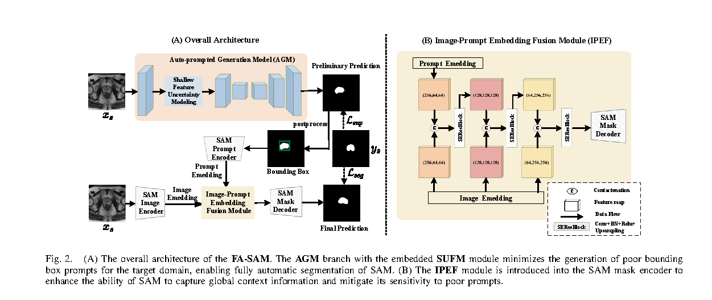

**Abstract**  
Although SAM-based single-source domain generalization models for medical image segmentation can mitigate the impact of domain shift on the model in cross-domain scenarios, these models still face two major challenges. First, the segmentation of SAM is highly dependent on domain-specific expert-annotated prompts, which prevents SAM from achieving fully automated medical image segmentation and therefore limits its application in clinical settings. Second, providing poor prompts (such as bounding boxes that are too small or too large) to the SAM prompt encoder can mislead SAM into generating incorrect mask results. Therefore, we propose the FA-SAM, a single-source domain generalization framework for medical image segmentation that achieves fully automated SAM. FA-SAM introduces two key innovations: an Auto-prompted Generation Model (AGM) branch equipped with a Shallow Feature Uncertainty Modeling (SUFM) module, and an Image-Prompt Embedding Fusion (IPEF) module integrated into the SAM mask decoder. Specifically, AGM models the uncertainty distribution of shallow features through the SUFM module to generate bounding box prompts for the target domain, enabling fully automated segmentation with SAM. The IPEF module integrates multiscale information from SAM image embeddings and prompt embeddings to capture global and local details of the target object, enabling SAM to mitigate the impact of poor prompts. Extensive experiments on publicly available prostate and fundus vessel datasets validate the effectiveness of FA-SAM and highlight its potential to address the above challenges.

**Summary**  
TBD

[⬆ Back to Literature Table](#samothers)

---

### <a id="kd-medsam-lightweight-knowledge-distillation-of-7e8a54c6">KD-MedSAM: Lightweight Knowledge Distillation of Segment Anything Model for Multi-modality Medical Image Segmentation</a>
> **Venue:** Lecture Notes in Computer Science 2025  
> **Authors:** W. Zhou et al.  
> **Keywords:** OtherMIS, SAM
**Links**  
[Viewable Link](https://link.springer.com/10.1007/978-981-95-0036-9_31) [Original Link](https://link.springer.com/chapter/10.1007/978-981-95-0036-9_31)

  <!-- Add image to imgs/ and uncomment the img tag below. -->
  <!--  -->

**Abstract**  
The effectiveness of the Segment Anything Model (SAM) in image segmentation has been widely recognized. Although SAM performs excellently in natural image segmentation scenario, fine-tuning is often needed for medical image segmentation due to data and task...

**Summary**  
TBD

[⬆ Back to Literature Table](#samothers)

---

### <a id="zap-2-5dsam-zero-additional-parameters-advancing-dddb917c">ZAP-2.5DSAM: Zero Additional Parameters Advancing 2.5D SAM Adaptation to 3D Tumor Segmentation</a>
> **Venue:** The Visual Computer 2025  
> **Authors:** C. Guo et al.  
> **Keywords:** OtherMIS, SAM
**Links**  
[Viewable Link](https://link.springer.com/10.1007/s00371-025-04092-4) [Original Link](https://link.springer.com/article/10.1007/s00371-025-04092-4) [Code](https://github.com/CaiGuoHS/ZAP-2.5DSAM.git)

  <!-- Add image to imgs/ and uncomment the img tag below. -->
  <!--  -->

**Abstract**  
The segment anything model (SAM) demonstrated outstanding performance in 2D segmentation tasks, exhibiting robust generalization to natural images through its prompt-driven design. However, due to the lack of volumetric spatial information modeling and the domain gap between nature and medical images, its direct application to 3D medical image segmentation is suboptimal. Existing approaches to adapting SAM for 3D segmentation typically involve architectural adjustments by integrating additional components, thereby increasing trainable parameters and requiring higher GPU memory during fine-tuning. Moreover, retraining the prompt encoder may result in degraded spatial localization, especially when annotated data is scarce. To address these limitations, we propose ZAP-2.5DSAM, a parameter-efficient fine-tuning framework, which effectively extends the segmentation capacity of SAM to 3D medical images through a 2.5D decomposition scheme without introducing any additional adapter modules. Our method fine-tunes only 3.51M parameters from the original SAM, significantly reducing GPU memory requirements during training. Extensive experiments on multiple 3D tumor segmentation benchmarks demonstrate that ZAP-2.5DSAM achieves superior segmentation accuracy compared to conventional fine-tuning methods. Our code and models are available at:&nbsp; https://github.com/CaiGuoHS/ZAP-2.5DSAM.git .

**Summary**  
TBD

[⬆ Back to Literature Table](#samothers)

---

### <a id="samed-2-selective-memory-enhanced-medical-segmen-2e0b83a2">SAMed-2: Selective Memory Enhanced Medical Segment Anything Model</a>
> **Venue:** Lecture Notes in Computer Science 2026  
> **Authors:** Z. Yan et al.  
> **Keywords:** OtherMIS, SAM
**Links**  
[Viewable Link](https://link.springer.com/10.1007/978-3-032-05169-1_52) [Original Link](https://arxiv.org/pdf/2507.03698) [Code](https://github.com/ZhilingYan/Medical-SAM-Bench)

  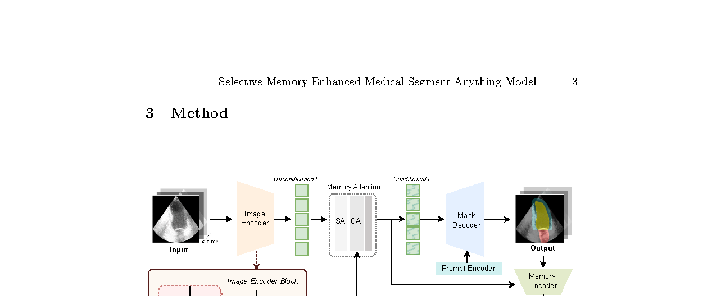

**Abstract**  
Recent "segment anything" efforts show promise by learning from large-scale data, but adapting such models directly to medical images remains challenging due to the complexity of medical data, noisy annotations, and continual learning requirements across diverse modalities and anatomical structures. In this work, we propose SAMed-2, a new foundation model for medical image segmentation built upon the SAM-2 architecture. Specifically, we introduce a temporal adapter into the image encoder to capture image correlations and a confidence-driven memory mechanism to store high-certainty features for later retrieval. This memory-based strategy counters the pervasive noise in large-scale medical datasets and mitigates catastrophic forgetting when encountering new tasks or modalities. To train and evaluate SAMed-2, we curate MedBank-100k, a comprehensive dataset spanning seven imaging modalities and 21 medical segmentation tasks. Our experiments on both internal benchmarks and 10 external datasets demonstrate superior performance over state-of-the-art baselines in multi-task scenarios. The code is available at: https://github.com/ZhilingYan/Medical-SAM-Bench.

**Summary**  
TBD

[⬆ Back to Literature Table](#samothers)

---

### <a id="causal-sam-llm-large-language-models-as-causal-r-34c7c7c5">Causal-SAM-LLM: Large Language Models as Causal Reasoners for Robust Medical Segmentation</a>
> **Venue:** arXiv.org 2025  
> **Authors:** T. Tang et al.  
> **Keywords:** InteractiveMIS, SAM
**Links**  
[Viewable Link](https://arxiv.org/abs/2507.03585) [Original Link](https://arxiv.org/pdf/2507.03585)

  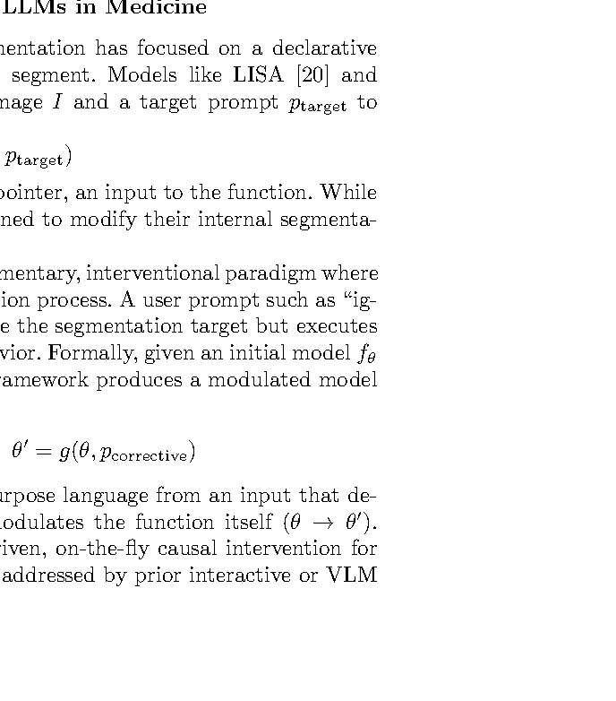

**Abstract**  
The clinical utility of deep learning models for medical image segmentation is severely constrained by their inability to generalize to unseen domains. This failure is often rooted in the models learning spurious correlations between anatomical content and domain-specific imaging styles. To overcome this fundamental challenge, we introduce Causal-SAM-LLM, a novel framework that elevates Large Language Models (LLMs) to the role of causal reasoners. Our framework, built upon a frozen Segment Anything Model (SAM) encoder, incorporates two synergistic innovations. First, Linguistic Adversarial Disentanglement (LAD) employs a Vision-Language Model to generate rich, textual descriptions of confounding image styles. By training the segmentation model's features to be contrastively dissimilar to these style descriptions, it learns a representation robustly purged of non-causal information. Second, Test-Time Causal Intervention (TCI) provides an interactive mechanism where an LLM interprets a clinician's natural language command to modulate the segmentation decoder's features in real-time, enabling targeted error correction. We conduct an extensive empirical evaluation on a composite benchmark from four public datasets (BTCV, CHAOS, AMOS, BraTS), assessing generalization under cross-scanner, cross-modality, and cross-anatomy settings. Causal-SAM-LLM establishes a new state of the art in out-of-distribution (OOD) robustness, improving the average Dice score by up to 6.2 points and reducing the Hausdorff Distance by 15.8 mm over the strongest baseline, all while using less than 9% of the full model's trainable parameters. Our work charts a new course for building robust, efficient, and interactively controllable medical AI systems.

**Summary**  
TBD

[⬆ Back to Literature Table](#samiwmis)

---

### <a id="visual-prompt-driven-universal-model-for-medical-8d3b9d6f">Visual prompt-driven universal model for medical image segmentation in radiotherapy</a>
> **Venue:** Knowledge-Based Systems 2025  
> **Authors:** S. Zhu et al.  
> **Keywords:** OtherMIS, SAM
**Links**  
[Viewable Link](https://linkinghub.elsevier.com/retrieve/pii/S0950705125010512) [Original Link](https://www.sciencedirect.com/science/article/pii/S0950705125010512)

  <!-- Add image to imgs/ and uncomment the img tag below. -->
  <!--  -->

**Abstract**  
TBD

**Summary**  
TBD

[⬆ Back to Literature Table](#samothers)

---

### <a id="prompt2segcxr-prompt-to-segment-all-organs-and-d-dfdfb307">Prompt2SegCXR:Prompt to Segment All Organs and Diseases in Chest X-rays</a>
> **Venue:** arXiv.org 2025  
> **Authors:** A. Zami et al.  
> **Keywords:** InteractiveMIS, SAM
**Links**  
[Viewable Link](https://arxiv.org/abs/2507.00673) [Original Link](https://arxiv.org/pdf/2507.00673)

  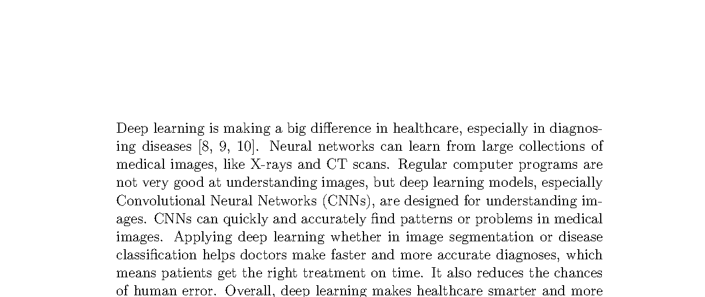

**Abstract**  
Image segmentation plays a vital role in the medical field by isolating organs or regions of interest from surrounding areas. Traditionally, segmentation models are trained on a specific organ or a disease, limiting their ability to handle other organs and diseases. At present, few advanced models can perform multi-organ or multi-disease segmentation, offering greater flexibility. Also, recently, prompt-based image segmentation has gained attention as a more flexible approach. It allows models to segment areas based on user-provided prompts. Despite these advances, there has been no dedicated work on prompt-based interactive multi-organ and multi-disease segmentation, especially for Chest X-rays. This work presents two main contributions: first, generating doodle prompts by medical experts of a collection of datasets from multiple sources with 23 classes, including 6 organs and 17 diseases, specifically designed for prompt-based Chest X-ray segmentation. Second, we introduce Prompt2SegCXR, a lightweight model for accurately segmenting multiple organs and diseases from Chest X-rays. The model incorporates multi-stage feature fusion, enabling it to combine features from various network layers for better spatial and semantic understanding, enhancing segmentation accuracy. Compared to existing pre-trained models for prompt-based image segmentation, our model scores well, providing a reliable solution for segmenting Chest X-rays based on user prompts.

**Summary**  
TBD

[⬆ Back to Literature Table](#samiwmis)

---

### <a id="cross-domain-subcortical-brain-structure-segment-42c903d4">Cross-domain subcortical brain structure segmentation algorithm based on low-rank adaptation fine-tuning SAM</a>
> **Venue:** BMC Medical Imaging 2025  
> **Authors:** Y. Sui et al.  
> **Keywords:** InteractiveMIS, SAM
**Links**  
[Viewable Link](https://bmcmedimaging.biomedcentral.com/articles/10.1186/s12880-025-01779-x) [Original Link](https://link.springer.com/content/pdf/10.1186/s12880-025-01779-x.pdf)

  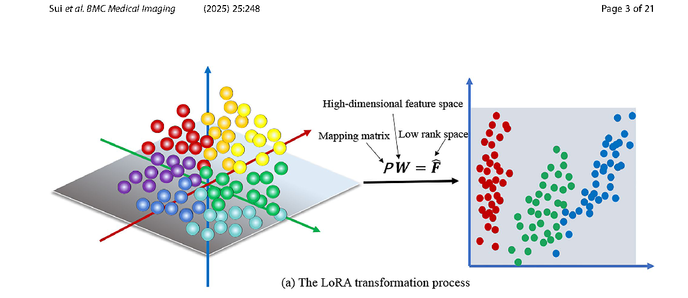

**Abstract**  
This interactive prompt learning approach provides clinicians with a means of intelligent segmentation for deep brain structures, effectively addressing the challenges of limited data labels and high manual annotation costs in medical image segmentation. We use five MRI datasets of IBSR, MALC, LONI, LPBA, Hammers and CANDI for experiments across various segmentation scenarios, including cross-domain settings with inference samples from diverse MRI datasets and supervised fine-tuning settings, demonstrate the proposed segmentation algorithm's generalization and effectiveness when compared to current mainstream and supervised segmentation algorithms.

**Summary**  
TBD

[⬆ Back to Literature Table](#samiwmis)

---

### <a id="pedsemiseg-pedagogy-inspired-semi-supervised-pol-504fc8d8">PedSemiSeg: Pedagogy-inspired semi-supervised polyp segmentation</a>
> **Venue:** Computerized Medical Imaging and Graphics 2025  
> **Authors:** A. Wang et al.  
> **Keywords:** SSLMIS, SAM
**Links**  
[Viewable Link](https://linkinghub.elsevier.com/retrieve/pii/S0895611125001004) [Original Link](https://www.sciencedirect.com/science/article/pii/S0895611125001004)

  <!-- Add image to imgs/ and uncomment the img tag below. -->
  <!--  -->

**Abstract**  
Recent advancements in deep learning techniques have contributed to developing improved polyp segmentation methods, thereby aiding in the diagnosis of colorectal cancer and facilitating automated surgery like endoscopic submucosal dissection (ESD). However, the scarcity of well-annotated data poses challenges by increasing the annotation burden and diminishing the performance of fully-supervised learning approaches. Additionally, distribution shifts due to variations among patients and medical centers require the model to generalize well during testing. To address these concerns, we present PedSemiSeg, a pedagogy-inspired semi-supervised learning framework designed to enhance polyp segmentation performance with limited labeled training data. In particular, we take inspiration from the pedagogy used in real-world educational settings, where teacher feedback and peer tutoring are both crucial in influencing the overall learning outcome. Expanding upon this concept, our approach involves supervising the outputs of the strongly augmented input (the students) using the pseudo and complementary labels crafted from the output of the weakly augmented input (the teacher) in both positive and negative learning manners. Additionally, we introduce reciprocal peer tutoring among the students, guided by respective prediction entropy. With these holistic learning processes, we aim to achieve consistent predictions for various versions of the same input and maximize the utilization of the abundant unlabeled data. Experimental results on two public datasets demonstrate the superiority of our method in polyp segmentation across various labeled data ratios. Furthermore, our approach exhibits excellent generalization capabilities on external unseen multi-center datasets, highlighting its broader clinical significance in practical applications during deployment.

**Summary**  
TBD

[⬆ Back to Literature Table](#samsslmis)

---

### <a id="medsam-ca-a-cnn-augmented-vit-with-attention-enh-fea93cb8">MedSAM-CA: A CNN-Augmented ViT with Attention-Enhanced Multi-Scale Fusion for Medical Image Segmentation</a>
> **Venue:** arXiv.org 2025  
> **Authors:** P. Tian et al.  
> **Keywords:** OtherMIS, SAM
**Links**  
[Viewable Link](https://arxiv.org/abs/2506.23700) [Original Link](https://arxiv.org/pdf/2506.23700)

  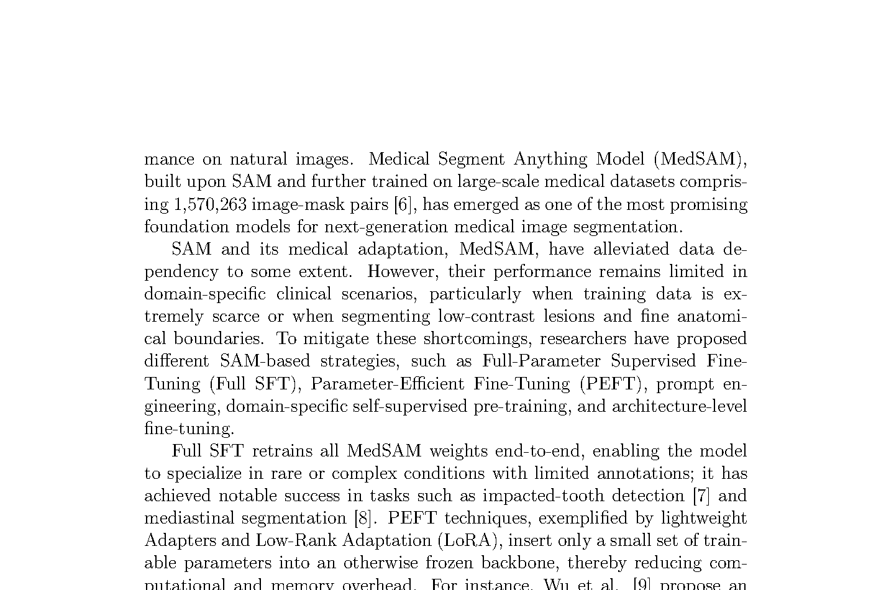

**Abstract**  
Medical image segmentation plays a crucial role in clinical diagnosis and treatment planning, where accurate boundary delineation is essential for precise lesion localization, organ identification, and quantitative assessment. In recent years, deep learning-based methods have significantly advanced segmentation accuracy. However, two major challenges remain. First, the performance of these methods heavily relies on large-scale annotated datasets, which are often difficult to obtain in medical scenarios due to privacy concerns and high annotation costs. Second, clinically challenging scenarios, such as low contrast in certain imaging modalities and blurry lesion boundaries caused by malignancy, still pose obstacles to precise segmentation. To address these challenges, we propose MedSAM-CA, an architecture-level fine-tuning approach that mitigates reliance on extensive manual annotations by adapting the pretrained foundation model, Medical Segment Anything (MedSAM). MedSAM-CA introduces two key components: the Convolutional Attention-Enhanced Boundary Refinement Network (CBR-Net) and the Attention-Enhanced Feature Fusion Block (Atte-FFB). CBR-Net operates in parallel with the MedSAM encoder to recover boundary information potentially overlooked by long-range attention mechanisms, leveraging hierarchical convolutional processing. Atte-FFB, embedded in the MedSAM decoder, fuses multi-level fine-grained features from skip connections in CBR-Net with global representations upsampled within the decoder to enhance boundary delineation accuracy. Experiments on publicly available datasets covering dermoscopy, CT, and MRI imaging modalities validate the effectiveness of MedSAM-CA. On dermoscopy dataset, MedSAM-CA achieves 94.43% Dice with only 2% of full training data, reaching 97.25% of full-data training performance, demonstrating strong effectiveness in low-resource clinical settings.

**Summary**  
TBD

[⬆ Back to Literature Table](#samothers)

---

### <a id="medprompt-llm-cnn-fusion-with-weight-routing-for-4fff7242">MedPrompt: LLM–CNN Fusion with Weight Routing for Medical Image Segmentation and Classification</a>
> **Venue:** Biomedical Signal Processing and Control 2026  
> **Authors:** S. Sobhan et al.  
> **Keywords:** Few-ShotMIS, SAM
**Links**  
[Viewable Link](https://linkinghub.elsevier.com/retrieve/pii/S1746809425017628) [Original Link](https://arxiv.org/pdf/2506.21199)

  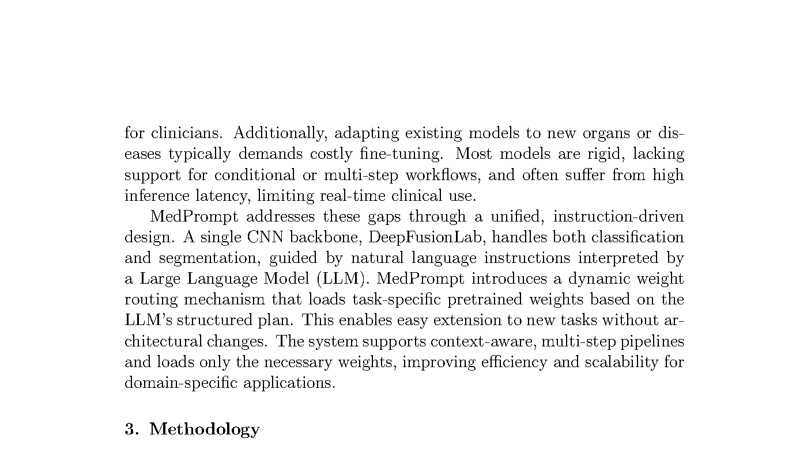

**Abstract**  
Most existing medical image analysis systems are task-specific, requiring separate models for classification and segmentation, and lack the flexibility to support user-defined workflows expressed in natural language. Developing a prompt-driven medical assistant introduces significant challenges, including the need for large annotated datasets, integration of multimodal data (text and images), high computational demands, and the difficulty of adapting to diverse tasks without retraining. To address these challenges, we present MedPrompt, a unified and extensible framework that combines a few-shot prompted Large Language Model (LlaMA-4-17B) for task planning with a modular CNN architecture (DeepFusionLab) for image analysis. The LLM parses user instructions and generates structured JSON workflows, dynamically selecting and routing task-specific pretrained weights to DeepFusionLab—a strategy we term dynamic weight routing . This eliminates the need for retraining when adding new tasks and supports multi-stage and conditional task execution. We evaluate MedPrompt on 19 public datasets across 12 tasks and 5 imaging modalities. The system achieves 97% end-to-end correctness in interpreting and executing natural language prompts, with an average inference latency of 2.5 s on CPU—suitable for near real-time clinical applications. DeepFusionLab demonstrates strong segmentation accuracy (e.g., Dice ∼ 0.9856 for lungs) and classification performance (F1 ∼ 0.9744 for tuberculosis). Overall, MedPrompt offers a scalable, interpretable, and deployment-ready solution for prompt-driven medical image analysis across a wide range of clinical scenarios. • We propose MedPrompt that integrates a few-shot Large Language Model (LLaMA-4-17B) with a modular CNN to perform medical image classification and segmentation from natural language prompts. • We introduce a novel mechanism for routing task-specific pretrained weights on the fly, enabling scalable, multi-stage, and conditional task execution without retraining. • MedPrompt presents DeepFusionLab that supports both segmentation and classification using a shared encoder, achieving high accuracy across 19 public datasets spanning 12 tasks and 5 modalities. • MedPrompt achieves 97% task execution accuracy with 2.5 s average latency on CPU, making it suitable for near real-time deployment in clinical settings.

**Summary**  
TBD

[⬆ Back to Literature Table](#samfsmis)

---

### <a id="improving-a-segment-anything-model-for-segmentin-1d0cfc4e">Improving a segment anything model for segmenting low-quality medical images via an adapter</a>
> **Venue:** Computer Vision and Image Understanding 2025  
> **Authors:** X. Han et al.  
> **Keywords:** OtherMIS, SAM
**Links**  
[Viewable Link](https://linkinghub.elsevier.com/retrieve/pii/S1077314225001481) [Original Link](https://www.sciencedirect.com/science/article/abs/pii/S1077314225001481)

  <!-- Add image to imgs/ and uncomment the img tag below. -->
  <!--  -->

**Abstract**  
TBD

**Summary**  
TBD

[⬆ Back to Literature Table](#samothers)

---

### <a id="generalist-medical-foundation-model-improves-pro-c033b073">Generalist medical foundation model improves prostate cancer segmentation from multimodal MRI images</a>
> **Venue:** npj Digital Medicine 2025  
> **Authors:** Y. Zhang et al.  
> **Keywords:** OtherMIS, SAM
**Links**  
[Viewable Link](https://www.nature.com/articles/s41746-025-01756-2) [Code](https://github.com/ZhangYH0502/PCaSAM)

  <!-- Add image to imgs/ and uncomment the img tag below. -->
  <!--  -->

**Abstract**  
Prostate cancer (PCa) is one of the most common types of cancer, seriously affecting adult male health. Accurate and automated PCa segmentation is essential for radiologists to confirm the location of cancer, evaluate its severity, and design appropriate treatments. This paper presents PCaSAM, a fully automated PCa segmentation model that allows us to input multi-modal MRI images into the foundation model to improve performance significantly. We collected multi-center datasets to conduct a comprehensive evaluation. The results showed that PCaSAM outperforms the generalist medical foundation model and the other representative segmentation models, with the average DSC of 0.721 and 0.706 in the internal and external datasets, respectively. Furthermore, with the assistance of segmentation, the PI-RADS scoring of PCa lesions was improved significantly, leading to a substantial increase in average AUC by 8.3-8.9% on two external datasets. Besides, PCaSAM achieved superior efficiency, making it highly suitable for real-world deployment scenarios.

**Summary**  
TBD

[⬆ Back to Literature Table](#samothers)

---

### <a id="star-empowering-semi-supervised-medical-image-se-2edd8963">STAR: Empowering semi-supervised medical image segmentation with SAM-based teacher-student architecture and contrastive consistency regularization</a>
> **Venue:** Expert Systems with Applications 2025  
> **Authors:** Q. Liang et al.  
> **Keywords:** SSLMIS, SAM
**Links**  
[Viewable Link](https://linkinghub.elsevier.com/retrieve/pii/S0957417425022699) [Original Link](https://www.sciencedirect.com/science/article/abs/pii/S0957417425022699)

  <!-- Add image to imgs/ and uncomment the img tag below. -->
  <!--  -->

**Abstract**  
TBD

**Summary**  
TBD

[⬆ Back to Literature Table](#samsslmis)

---

### <a id="medseg-r-reasoning-segmentation-in-medical-image-41d835eb">MedSeg-R: Reasoning Segmentation in Medical Images with Multimodal Large Language Models</a>
> **Venue:** arXiv.org 2025  
> **Authors:** Y. Huang et al.  
> **Keywords:** OtherMIS, SAM
**Links**  
[Viewable Link](https://arxiv.org/abs/2506.10465) [Original Link](https://arxiv.org/pdf/2506.10465)

  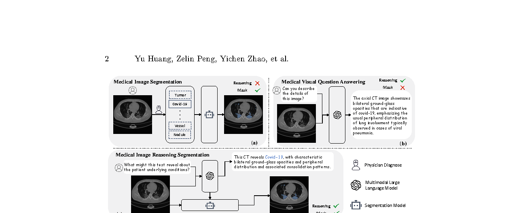

**Abstract**  
Medical image segmentation is crucial for clinical diagnosis, yet existing models are limited by their reliance on explicit human instructions and lack the active reasoning capabilities to understand complex clinical questions. While recent advancements in multimodal large language models (MLLMs) have improved medical question-answering (QA) tasks, most methods struggle to generate precise segmentation masks, limiting their application in automatic medical diagnosis. In this paper, we introduce medical image reasoning segmentation, a novel task that aims to generate segmentation masks based on complex and implicit medical instructions. To address this, we propose MedSeg-R, an end-to-end framework that leverages the reasoning abilities of MLLMs to interpret clinical questions while also capable of producing corresponding precise segmentation masks for medical images. It is built on two core components: 1) a global context understanding module that interprets images and comprehends complex medical instructions to generate multi-modal intermediate tokens, and 2) a pixel-level grounding module that decodes these tokens to produce precise segmentation masks and textual responses. Furthermore, we introduce MedSeg-QA, a large-scale dataset tailored for the medical image reasoning segmentation task. It includes over 10,000 image-mask pairs and multi-turn conversations, automatically annotated using large language models and refined through physician reviews. Experiments show MedSeg-R's superior performance across several benchmarks, achieving high segmentation accuracy and enabling interpretable textual analysis of medical images.

**Summary**  
TBD

[⬆ Back to Literature Table](#samothers)

---

### <a id="sit-sam-a-semantic-integration-transformer-that-c9044162">SIT-SAM: A semantic-integration transformer that adapts the Segment Anything Model to zero-shot medical image semantic segmentation</a>
> **Venue:** Biomedical Signal Processing and Control 2025  
> **Authors:** W. Shi et al.  
> **Keywords:** Zero-ShotMIS, SAM
**Links**  
[Viewable Link](https://linkinghub.elsevier.com/retrieve/pii/S174680942500597X) [Original Link](https://www.sciencedirect.com/science/article/abs/pii/S174680942500597X) [Code](https://github.com/wentao0429/SIT-SAM)

  <!-- Add image to imgs/ and uncomment the img tag below. -->
  <!--  -->

**Abstract**  
TBD

**Summary**  
TBD

[⬆ Back to Literature Table](#samzsmis)

---

### <a id="vista3d-a-unified-segmentation-foundation-model-2fb7a04b">VISTA3D: A Unified Segmentation Foundation Model For 3D Medical Imaging</a>
> **Venue:** 2025 IEEE/CVF Conference on Computer Vision and Pattern Recognition (CVPR)  
> **Authors:** Y. He et al.  
> **Keywords:** Zero-ShotMIS, SAM
**Links**  
[Viewable Link](https://ieeexplore.ieee.org/document/11094751/) [Original Link](https://openaccess.thecvf.com/content/CVPR2025/papers/He_VISTA3D_A_Unified_Segmentation_Foundation_Model_For_3D_Medical_Imaging_CVPR_2025_paper.pdf) [Code](https://github.com/Project-MONAI/VISTA)

  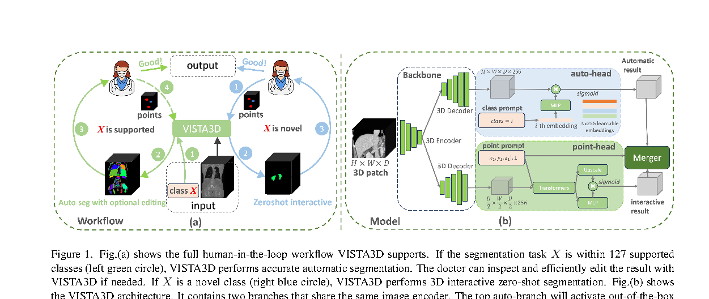

**Abstract**  
Foundation models for interactive segmentation in 2D natural images and videos have sparked significant interest in building 3D foundation models for medical imaging. However, the domain gaps and clinical use cases for 3D medical imaging require a dedicated model that diverges from existing 2D solutions. Specifically, such foundation models should support a full workflow that can actually reduce human effort. Treating 3D medical images as sequences of 2D slices and reusing interactive 2D foundation models seems straightforward, but 2D annotation is too time-consuming for 3D tasks. Moreover, for large cohort analysis, it's the highly accurate automatic segmentation models that reduce the most human effort. However, these models lack support for interactive corrections and lack zero-shot ability for novel structures, which is a key feature of "foundation". While reusing pre-trained 2D backbones in 3D enhances zero-shot potential, their performance on complex 3D structures still lags behind leading 3D models. To address these issues, we present VISTA3D, Versatile Imaging SegmenTation and Annotation model, that targets to solve all these challenges and requirements with one unified foundation model. VISTA3D is built on top of the well-established 3D segmentation pipeline, and it is the first model to achieve state-of-the-art performance in both 3D automatic (supporting 127 classes) and 3D interactive segmentation, even when compared with top 3D expert models on large and diverse benchmarks. Additionally, VISTA3D's 3D interactive design allows efficient human correction, and a novel 3D supervoxel method that distills 2D pretrained backbones grants VISTA3D top 3D zero-shot performance. We believe the model, recipe, and insights represent a promising step towards a clinically useful 3D foundation model. Code and weights are publicly available at https://github.com/Project-MONAI/VISTA.

**Summary**  
TBD

[⬆ Back to Literature Table](#samzsmis)

---

### <a id="unified-medical-lesion-segmentation-via-self-ref-b2480d24">Unified Medical Lesion Segmentation via Self-referring Indicator</a>
> **Venue:** 2025 IEEE/CVF Conference on Computer Vision and Pattern Recognition (CVPR)  
> **Authors:** S. Chang et al.  
> **Keywords:** OtherMIS, SAM
**Links**  
[Viewable Link](https://ieeexplore.ieee.org/document/11094651/) [Original Link](https://openaccess.thecvf.com/content/CVPR2025/papers/Chang_Unified_Medical_Lesion_Segmentation_via_Self-referring_Indicator_CVPR_2025_paper.pdf)

  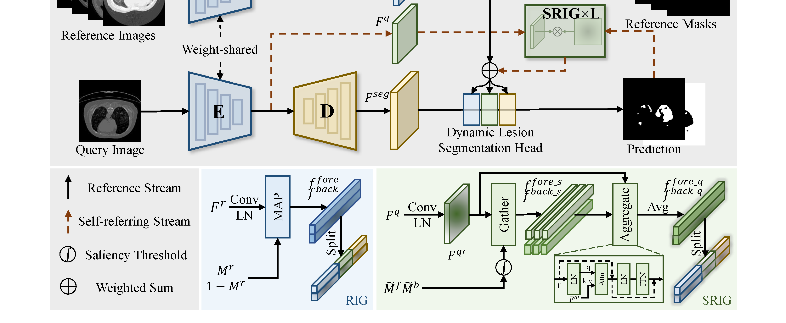

**Abstract**  
The recently emerged in-context-learning-based (ICL-based) models have the potential towards the unification of medical lesion segmentation. However, due to their cross-fusion designs, existing ICL-based unified segmentation models fail to accurately localize lesions with low-matched reference sets. Considering that the query itself can be regarded as a high-matched reference, which better indicates the target, we design a self-referencing mechanism that adaptively extracts self-referring indicator vectors from the query based on coarse predictions, thus effectively overcoming the negative impact caused by low-match reference sets. To further facilitate the self-referring mechanism, we introduce reference indicator generation to efficiently extract reference information for coarse predictions instead of using cross-fusion modules, which heavily rely on reference sets. Our designs successfully address the challenges of applying ICL to unified medical lesion segmentation, forming a novel framework named SR-ICL. Our method achieves state-of-the-art results on 8 medical lesion segmentation tasks with only 4 image-mask pairs as reference. Notably, SR-ICL still accomplishes remarkable performance even when using weak reference annotations such as boxes and points, and maintains fixed and low memory consumption even if more tasks are combined. We hope that SR-ICL can provide new insights for the clinical application of medical lesion segmentation.

**Summary**  
TBD

[⬆ Back to Literature Table](#samothers)

---

### <a id="sam-aware-test-time-adaptation-for-universal-med-2935270e">SAM-aware Test-time Adaptation for Universal Medical Image Segmentation</a>
> **Venue:** arXiv.org 2025  
> **Authors:** J. Wu et al.  
> **Keywords:** OtherMIS, SAM
**Links**  
[Viewable Link](https://arxiv.org/abs/2506.05221) [Original Link](https://arxiv.org/pdf/2506.05221)

  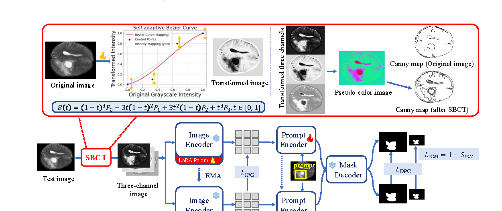

**Abstract**  
Leveraging the Segment Anything Model (SAM) for medical image segmentation remains challenging due to its limited adaptability across diverse medical domains. Although fine-tuned variants, such as MedSAM, improve performance in scenarios similar to the training modalities or organs, they may lack generalizability to unseen data. To overcome this limitation, we propose SAM-aware Test-time Adaptation (SAM-TTA), a lightweight and flexible framework that preserves SAM's inherent generalization ability while enhancing segmentation accuracy for medical images. SAM-TTA tackles two major challenges: (1) input-level discrepancy caused by channel mismatches between natural and medical images, and (2) semantic-level discrepancy due to different object characteristics in natural versus medical images (e.g., with clear boundaries vs. ambiguous structures). To this end, we introduce two complementary components: a self-adaptive Bezier Curve-based Transformation (SBCT), which maps single-channel medical images into SAM-compatible three-channel images via a few learnable parameters to be optimized at test time; and IoU-guided Multi-scale Adaptation (IMA), which leverages SAM's intrinsic IoU scores to enforce high output confidence, dual-scale prediction consistency, and intermediate feature consistency, to improve semantic-level alignments. Extensive experiments on eight public medical image segmentation tasks, covering six grayscale and two color (endoscopic) tasks, demonstrate that SAM-TTA consistently outperforms state-of-the-art test-time adaptation methods. Notably, on six grayscale datasets, SAM-TTA even surpasses fully fine-tuned models, achieving significant Dice improvements (i.e., average 4.8% and 7.4% gains over MedSAM and SAM-Med2D) and establishing a new paradigm for universal medical image segmentation. Code is available at https://github.com/JianghaoWu/SAM-TTA.

**Summary**  
TBD

[⬆ Back to Literature Table](#samothers)

---

### <a id="zero-shot-pseudo-labels-generation-using-sam-and-3d49e5f3">Zero-Shot Pseudo Labels Generation Using Sam and Clip for Semi-Supervised Semantic Segmentation</a>
> **Venue:** 2025 IEEE International Conference on Image Processing (ICIP)  
> **Authors:** N. Saito et al.  
> **Keywords:** SSLMIS, SAM
**Links**  
[Viewable Link](https://ieeexplore.ieee.org/document/11084652/) [Original Link](https://arxiv.org/pdf/2505.19846)

  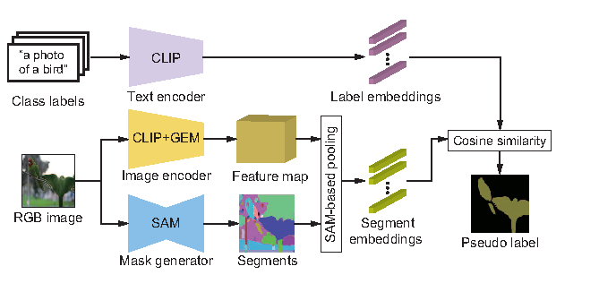

**Abstract**  
Semantic segmentation is a fundamental task in medical image analysis and autonomous driving and has a problem with the high cost of annotating the labels required in training. To address this problem, semantic segmentation methods based on semi-supervised learning with a small number of labeled data have been proposed. For example, one approach is to train a semantic segmentation model using images with annotated labels and pseudo labels. In this approach, the accuracy of the semantic segmentation model depends on the quality of the pseudo labels, and the quality of the pseudo labels depends on the performance of the model to be trained and the amount of data with annotated labels. In this paper, we generate pseudo labels using zero-shot annotation with the Segment Anything Model (SAM) and Contrastive Language-Image Pretraining (CLIP), improve the accuracy of the pseudo labels using the Unified Dual-Stream Perturbations Approach (UniMatch), and use them as enhanced labels to train a semantic segmentation model. The effectiveness of the proposed method is demonstrated through the experiments using the public datasets: PASCAL and MS COCO.

**Summary**  
TBD

[⬆ Back to Literature Table](#samsslmis)

---

### <a id="mias-sam-medical-image-anomaly-segmentation-with-bf786cc6">MIAS-SAM: Medical Image Anomaly Segmentation without thresholding</a>
> **Venue:** arXiv.org 2025  
> **Authors:** M. Colussi et al.  
> **Keywords:** OtherMIS, SAM
**Links**  
[Viewable Link](https://arxiv.org/abs/2505.22762) [Original Link](https://arxiv.org/pdf/2505.22762) [Code](https://github.com/warpcut/MIAS-SAM)

  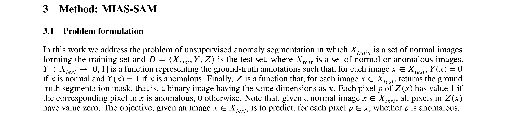

**Abstract**  
This paper presents MIAS-SAM, a novel approach for the segmentation of anomalous regions in medical images. MIAS-SAM uses a patch-based memory bank to store relevant image features, which are extracted from normal data using the SAM encoder. At inference time, the embedding patches extracted from the SAM encoder are compared with those in the memory bank to obtain the anomaly map. Finally, MIAS-SAM computes the center of gravity of the anomaly map to prompt the SAM decoder, obtaining an accurate segmentation from the previously extracted features. Differently from prior works, MIAS-SAM does not require to define a threshold value to obtain the segmentation from the anomaly map. Experimental results conducted on three publicly available datasets, each with a different imaging modality (Brain MRI, Liver CT, and Retina OCT) show accurate anomaly segmentation capabilities measured using DICE score. The code is available at: https://github.com/warpcut/MIAS-SAM

**Summary**  
TBD

[⬆ Back to Literature Table](#samothers)

---

### <a id="prs-med-position-reasoning-segmentation-with-vis-36ef2373">PRS-Med: Position Reasoning Segmentation with Vision-Language Model in Medical Imaging</a>
> **Venue:** 2025  
> **Authors:** QH. Trinh et al.  
> **Keywords:** OtherMIS, SAM
**Links**  
[Viewable Link](https://arxiv.org/pdf/2505.11872)

  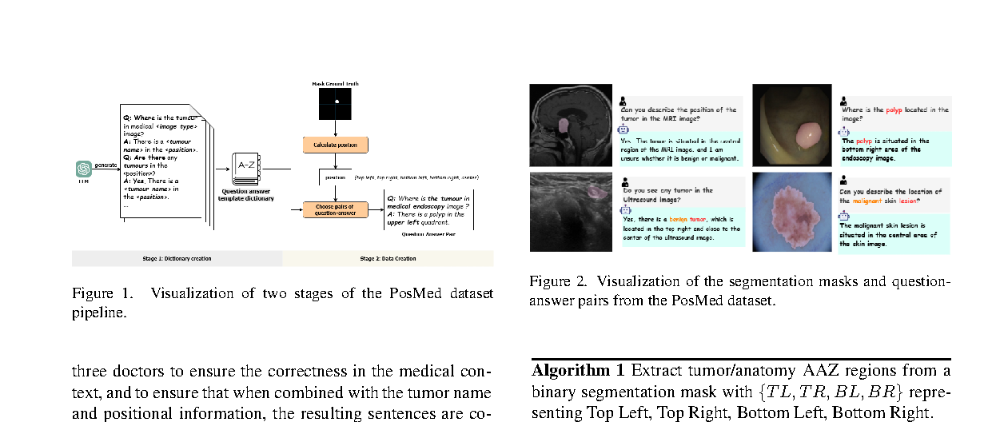

**Abstract**  
TBD

**Summary**  
TBD

[⬆ Back to Literature Table](#samothers)

---

### <a id="amvlm-alignment-multiplicity-aware-vision-langua-93ce7956">AMVLM: Alignment-Multiplicity Aware Vision-Language Model for Semi-Supervised Medical Image Segmentation</a>
> **Venue:** IEEE Transactions on Medical Imaging 2025  
> **Authors:** Q. Pan et al.  
> **Keywords:** SSLMIS, SAM
**Links**  
[Viewable Link](https://ieeexplore.ieee.org/document/11014494/) [Original Link](https://ieeexplore.ieee.org/abstract/document/11014494) [Code](https://github.com/QingtaoPan/AMVLM)

  <!-- Add image to imgs/ and uncomment the img tag below. -->
  <!--  -->

**Abstract**  
Low-quality pseudo labels pose a significant obstacle in semi-supervised medical image segmentation (SSMIS), impeding consistency learning on unlabeled data. Leveraging vision-language model (VLM) holds promise in ameliorating pseudo label quality by employing textual prompts to delineate segmentation regions, but it faces the challenge of cross-modal alignment uncertainty due to multiple correspondences (multiple images/texts tend to correspond to one text/image). Existing VLMs address this challenge by modeling semantics as distributions but such distributions lead to semantic degradation. To address these problems, we propose Alignment-Multiplicity Aware Vision-Language Model (AMVLM), a new VLM pretraining paradigm with two novel similarity metric strategies. (i) Cross-modal Similarity Supervision (CSS) proposes a probability distribution transformer to supervise similarity scores across fine-granularity semantics through measuring cross-modal distribution disparities, thus learning cross-modal multiple alignments. (ii) Intra-modal Contrastive Learning (ICL) takes into account the similarity metric of coarse-fine granularity information within each modality to encourage cross-modal semantic consistency. Furthermore, using the pretrained AMVLM, we propose a pioneering text-guided SSMIS network to compensate for the quality deficiencies of pseudo-labels. This network incorporates a text mask generator to produce multimodal supervision information, enhancing pseudo label quality and the model's consistency learning. Extensive experimentation validates the efficacy of our AMVLM-driven SSMIS, showcasing superior performance across four publicly available datasets. The code will be available at: https://github.com/QingtaoPan/AMVLM.

**Summary**  
TBD

[⬆ Back to Literature Table](#samsslmis)

---

### <a id="masg-sam-enhancing-few-shot-medical-image-segmen-ebd7e144">MASG-SAM: Enhancing Few-Shot Medical Image Segmentation with Multi-Scale Attention and Semantic Guidance</a>
> **Venue:** IEEE Journal of Biomedical and Health Informatics 2025  
> **Authors:** W. Zhou et al.  
> **Keywords:** Few-ShotMIS, SAM
**Links**  
[Viewable Link](https://ieeexplore.ieee.org/document/11006907/) [Original Link](https://ieeexplore.ieee.org/abstract/document/11006907) [Code](https://github.com/ggllllll/MASG-SAM.git)

  <!-- Add image to imgs/ and uncomment the img tag below. -->
  <!--  -->

**Abstract**  
Foundation models, such as the Segment Anything Model (SAM), have demonstrated impressive generalization across various image segmentation tasks. However, they encounter challenges when applied to medical imaging, primarily due to the lack of domain-specific expertise and the limited availability of annotated data. Existing methods for adapting SAM typically rely on expert-driven prompt design and extensive fine-tuning, which hinder their effectiveness in medical imaging, particularly for rare and complex anatomical structures. To overcome these challenges, we propose MASG-SAM, an innovative framework designed for efficient few-shot medical image segmentation. MASG-SAM integrates three key innovations: the Hierarchical Attention Enhancement (HAE), Boundary Feature Enhancement (BFE), and Dynamic Semantic Fusion (DSF) modules. The HAE module optimizes attention distribution across hierarchical feature maps, enhancing feature diversity and reducing feature drift, thereby improving segmentation of both global and local features in complex medical images. The BFE module introduces a boundary-sensitive mechanism that enhances edge detection, enabling precise segmentation of overlapping or difficult-to-delineate anatomical structures. Finally, the DSF module leverages Contrastive Language-Image Pretraining (CLIP) to inject domain-specific medical semantic knowledge. By adaptively refining feature fusion during training, DSF combines semantic guidance with spatial adjustments, progressively improving segmentation accuracy, particularly in data-scarce scenarios. Experiments conducted on four publicly available medical datasets show that MASG-SAM outperforms state-of-the-art methods, achieving high segmentation accuracy with minimal labeled data. Our framework significantly enhances the adaptability and accuracy of SAM in complex medical imaging tasks. The code for MASG-SAM will be made publicly available at https://github.com/ggllllll/MASG-SAM.git.

**Summary**  
TBD

[⬆ Back to Literature Table](#samfsmis)

---

### <a id="spinefm-leveraging-foundation-models-for-automat-038a349a">SpineFM: Leveraging Foundation Models for Automatic Spine X-ray Segmentation</a>
> **Venue:** 2025 IEEE 22nd International Symposium on Biomedical Imaging (ISBI)  
> **Authors:** SJ. Simons et al.  
> **Keywords:** OtherMIS, SAM
**Links**  
[Viewable Link](https://ieeexplore.ieee.org/document/10980854/) [Original Link](https://ieeexplore.ieee.org/abstract/document/10980854)

  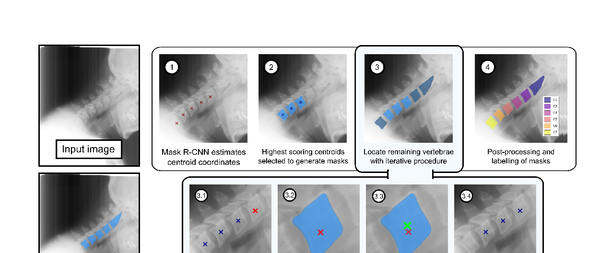

**Abstract**  
This paper introduces SpineFM, a novel pipeline that achieves state-of-the-art performance in the automatic segmentation and identification of vertebral bodies in cervical and lumbar spine radiographs. SpineFM leverages the regular geometry of the spine, employing a novel inductive process to sequentially infer the location of each vertebra along the spinal column. Vertebrae are segmented using Medical-SAM-Adaptor, a robust foundation model that diverges from commonly used CNN-based models. We achieved outstanding results on two publicly available spine X-Ray datasets, with successful identification of 97.8\% and 99.6\% of annotated vertebrae, respectively. Of which, our segmentation reached an average Dice of 0.942 and 0.921, surpassing previous state-of-the-art methods.

**Summary**  
TBD

[⬆ Back to Literature Table](#samothers)

---

### <a id="synthfm-training-modality-agnostic-foundation-mo-2804d9de">SynthFM: Training Modality-Agnostic Foundation Models for Medical Image Segmentation Without Real Medical Data</a>
> **Venue:** 2025 IEEE 22nd International Symposium on Biomedical Imaging (ISBI)  
> **Authors:** S. Sengupta et al.  
> **Keywords:** Zero-ShotMIS, SAM
**Links**  
[Viewable Link](https://ieeexplore.ieee.org/document/10980740/) [Original Link](https://ieeexplore.ieee.org/abstract/document/10980740)

  <!-- Add image to imgs/ and uncomment the img tag below. -->
  <!--  -->

**Abstract**  
Foundation models like the Segment Anything Model (SAM) excel in zero-shot segmentation for natural images but struggle with medical image segmentation due to differences in texture, contrast, and noise. Annotating medical images is costly and requires domain expertise, limiting large-scale annotated data availability. To address this, we propose SynthFM, a synthetic data generation framework that mimics the complexities of medical images, enabling foundation models to adapt without real medical data. Using SAM's pretrained encoder and training the decoder from scratch on SynthFM's dataset, we evaluated our method on 11 anatomical structures across 9 datasets (CT, MRI, and Ultrasound). SynthFM outperformed zero-shot baselines like SAM and MedSAM, achieving superior results under different prompt settings and on out-of-distribution datasets.

**Summary**  
TBD

[⬆ Back to Literature Table](#samzsmis)

---

### <a id="annotation-efficient-task-guidance-for-medical-s-4fb4f47d">Annotation-Efficient Task Guidance for Medical Segment Anything</a>
> **Venue:** arXiv.org 2024  
> **Authors:** T. Ward et al.  
> **Keywords:** SSLMIS, SAM
**Links**  
[Viewable Link](https://arxiv.org/abs/2412.08575) [Original Link](https://ieeexplore.ieee.org/abstract/document/10981303) [Code](https://github.com/tbwa233/SAM-Mix)

  

**Abstract**  
Medical image segmentation is a key task in the imaging workflow, influencing many image-based decisions. Traditional, fully-supervised segmentation models rely on large amounts of labeled training data, typically obtained through manual annotation, which can be an expensive, time-consuming, and error-prone process. This signals a need for accurate, automatic, and annotation-efficient methods of training these models. We propose SAM-Mix, a novel multitask learning framework for medical image segmentation that uses class activation maps produced by an auxiliary classifier to guide the predictions of the semi-supervised segmentation branch, which is based on the SAM framework. Experimental evaluations on the public LiTS dataset confirm the effectiveness of SAM-Mix for simultaneous classification and segmentation of the liver from abdominal computed tomography (CT) scans. When trained for 90% fewer epochs on only 50 labeled 2D slices, representing just 0.04% of the available labeled training data, SAM-Mix achieves a Dice improvement of 5.1% over the best baseline model. The generalization results for SAM-Mix are even more impressive, with the same model configuration yielding a 25.4% Dice improvement on a cross-domain segmentation task. Our code is available at https://github.com/tbwa233/SAM-Mix.

**Summary**  
TBD

[⬆ Back to Literature Table](#samsslmis)

---

### <a id="efficient-fine-tuning-of-sam-for-interactive-med-5f57cc76">Efficient Fine-Tuning of SAM for Interactive Medical Image Multi-Organ Segmentation</a>
> **Venue:** 2025 IEEE 22nd International Symposium on Biomedical Imaging (ISBI)  
> **Authors:** M. Wang et al.  
> **Keywords:** InteractiveMIS, SAM
**Links**  
[Viewable Link](https://ieeexplore.ieee.org/document/10981084/) [Original Link](https://ieeexplore.ieee.org/abstract/document/10981084)

  <!-- Add image to imgs/ and uncomment the img tag below. -->
  <!--  -->

**Abstract**  
Recently, Segment Anything Model (SAM) has significantly advanced interactive segmentation techniques, particularly its fine-tuned variants in medical imaging. Although previous approaches can adapt SAM to diverse downstream tasks with additional data, two challenges persist. On the one hand, organ ambiguities render SAM susceptible to human factor prompts, leading to unsatisfactory segmentation results. On the other hand, fine-tuning with massive data and the segment-single-region paradigm incur considerable computational and time costs. To this end, we propose to efficiently fine-tune SAM for interactive multi-organ medical segmentation by parallel heuristic prompt generation (PHPG) and class-balanced data pruning (CBDP). Specifically, PHPG generates prompts for diverse human behaviors guided by error prediction, effectively enhancing the consistency of prompts between training and testing. At the same time, it also offers a segment-multi-region paradigm to accelerate fine-tuning of SAM. Furthermore, considering that the contributions of training samples are dynamically variable and organ-related, CBDP is designed to reduce fine-tuning iterations. Experimental results on the FLARE and Synapse datasets indicate that the proposed method outperforms existing strategies. With only approximately 56.25% of the iterations, the segmentation performance is comparable to that of full fine-tuning, possessing better generalization ability and insensitivity to human factors.

**Summary**  
TBD

[⬆ Back to Literature Table](#samiwmis)

---

### <a id="dasam-medical-domain-adaptation-of-segment-anyth-8eb588ce">DASAM: Medical Domain Adaptation of Segment Anything Model Without Further Pre-Training</a>
> **Venue:** 2025 IEEE 22nd International Symposium on Biomedical Imaging (ISBI)  
> **Authors:** Y. Yao et al.  
> **Keywords:** OtherMIS, SAM
**Links**  
[Viewable Link](https://ieeexplore.ieee.org/document/10980758/) [Original Link](https://ieeexplore.ieee.org/abstract/document/10980758)

  <!-- Add image to imgs/ and uncomment the img tag below. -->
  <!--  -->

**Abstract**  
Deep learning has revolutionized medical image segmentation, significantly enhancing accuracy and automation in identifying anatomical structures and pathologies crucial for diagnosis and treatment planning. While powerful vision foundation models pretrained on extensive natural image collections have transformed computer vision, adapting these models to medical image segmentation presents unique challenges due to limited data availability, diverse imaging protocols, ethical concerns, and task complexity. To this end, we introduce DASAM, a novel medical image segmentation framework that addresses these challenges through innovative lightweight domain adaptation mechanisms. DASAM employs a medical adapter and simplified prompt-tuning protocol to effectively adapt vision foundation models to medical imaging tasks without requiring extensive domain-specific pretraining. Our comprehensive evaluation demonstrates DASAM's superior performance, adaptability, and generalizability across 8 datasets and 5 imaging modalities, outperforming 7 baselines while reducing reliance on large-scale medical datasets and costly medical pretraining.

**Summary**  
TBD

[⬆ Back to Literature Table](#samothers)

---

### <a id="evaluating-segmentation-accuracy-with-diverse-pr-cc39ecae">Evaluating Segmentation Accuracy with Diverse Prompt Strategies in Medsam</a>
> **Venue:** 2025 IEEE 22nd International Symposium on Biomedical Imaging (ISBI)  
> **Authors:** M. Nouman et al.  
> **Keywords:** Zero-ShotMIS, SAM
**Links**  
[Viewable Link](https://ieeexplore.ieee.org/document/10980865/) [Original Link](https://ieeexplore.ieee.org/abstract/document/10980865)

  <!-- Add image to imgs/ and uncomment the img tag below. -->
  <!--  -->

**Abstract**  
Segment Anything Model (SAM) shows robustness in prompt-based segmentation of natural images. However, adapting SAM to the medical domain as a foundation model, MedSAM, presents unique challenges arising from clinical settings. This study evaluates MedSAM's performance across five medical imaging modalities (MRI, CT, ultrasound, endoscopy, and fundus IR) using four different prompting strategies: standard bounding boxes (SBB), rotated bounding boxes (RBB), contour points (CP), and simulated human annotations (SHA). MedSAM's performance is assessed under precise and perturbed conditions for each prompt type to evaluate its segmentation capabilities comprehensively. We empirically evaluate MedSAM's abilities and adaptability by experimenting with zero-shot learning and fine-tuning approaches. The results indicate that performance varies markedly with prompt type, accuracy, and imaging modality. The study concludes that MedSAM is sensitive to prompt precision and anatomical complexity. Fine-tuning improves performance, but further refinements are necessary to make it robust in various clinical settings. This work highlights the need for prompt engineering and provides practical insights to enhance segmentation accuracy in SAM-like foundation models.

**Summary**  
TBD

[⬆ Back to Literature Table](#samzsmis)

---

### <a id="asam-anatomy-encoded-segment-anything-model-for-b4844539">ASAM: Anatomy-Encoded Segment Anything Model for Medical Images</a>
> **Venue:** 2025 IEEE 22nd International Symposium on Biomedical Imaging (ISBI)  
> **Authors:** J. Zhang et al.  
> **Keywords:** OtherMIS, SAM
**Links**  
[Viewable Link](https://ieeexplore.ieee.org/document/10981134/) [Original Link](https://ieeexplore.ieee.org/abstract/document/10981134)

  <!-- Add image to imgs/ and uncomment the img tag below. -->
  <!--  -->

**Abstract**  
SAM is a foundation model for image segmentation, aiming to segment any target in any scene. MedSAM is its pretrained version on medical images and can be generalized to different imaging modalities. However, current studies have overlooked the biggest difference between natural and medical images: anatomical features pertaining to biological tissues. Real-world medical imaging can be conceptualized as a convolution of the system impulse response with its interrogated medium. We herein propose an Anatomy-encoded SAM (ASAM), featuring an unsupervised cross-attention to emulate the imaging process, where the values of full-image, anatomy, and modality characteristics constrain each other in every attention operation via convolution and deconvolution in Fourier domain. Specifically, anatomy values are extracted from full-image values by deconvolution with modality values. ASAM focuses on CT, MR, US, X-ray, and PET modalities, and is trained on 37 large-scale public datasets. ASAM achieves a high average Dice of 91.46%, thereby being an advanced foundation model for medical image segmentation.

**Summary**  
TBD

[⬆ Back to Literature Table](#samothers)

---

### <a id="vss-sam-visual-state-space-enhanced-sam-for-3d-m-724e652b">VSS-SAM: Visual State Space-Enhanced SAM for 3D Medical Image Segmentation</a>
> **Venue:** 2025 IEEE 22nd International Symposium on Biomedical Imaging (ISBI)  
> **Authors:** J. Lyu et al.  
> **Keywords:** OtherMIS, SAM
**Links**  
[Viewable Link](https://ieeexplore.ieee.org/document/10981185/) [Original Link](https://ieeexplore.ieee.org/abstract/document/10981185)

  <!-- Add image to imgs/ and uncomment the img tag below. -->
  <!--  -->

**Abstract**  
The Segment Anything Model (SAM) is a large general segmentation model proposed by Meta, which has shown amazing performance in many natural image segmentation tasks. Recently, MA-SAM has been proposed to transplant SAM model to medical applications. However, such models still has shortcomings in utilizing the three-dimensional information of medical images. In this paper, we proposed a new structure to fully utilizing 3D information on medical images to enhance the performance of SAM, called VSS-SAM. Particularly, the proposed method applied two branches: 1) SAM as an encoder to learn the basic topology relations among slices, and 2) parallel Mamba as second branch to effectively capture long-range spatial dependencies. Finally, a new decoder was proposed to integrate the multi-view feature representations extracted from the two branches and output the final prediction, aiming to achieve optimal segmentation performance. We validated our method on three publicly available datasets. Experimental results show that the segmentation performance of VSS-SAM is significantly better than that of existing methods in multiple data sets.

**Summary**  
TBD

[⬆ Back to Literature Table](#samothers)

---

### <a id="sam3x-efficient-3d-aware-network-for-medical-ima-59371829">SAM3X: Efficient 3D-Aware Network for Medical Image Segmentation Using SAM</a>
> **Venue:** 2025 IEEE 22nd International Symposium on Biomedical Imaging (ISBI)  
> **Authors:** D. Lee et al.  
> **Keywords:** OtherMIS, SAM
**Links**  
[Viewable Link](https://ieeexplore.ieee.org/document/10981074/) [Original Link](https://ieeexplore.ieee.org/abstract/document/10981074) [Code](https://github.com/SSTDV-Project/SAM3X)

  <!-- Add image to imgs/ and uncomment the img tag below. -->
  <!--  -->

**Abstract**  
Recent studies have adopted the Segment Anything Model (SAM), a vision foundation model, for medical image analysis, demonstrating its generalizability and supe

**Summary**  
TBD

[⬆ Back to Literature Table](#samothers)

---

### <a id="using-foundation-models-as-pseudo-label-generato-41bfbb62">Using Foundation Models as Pseudo-label Generators for Pre-clinical 4D Cardiac CT Segmentation</a>
> **Venue:** Lecture Notes in Computer Science 2025  
> **Authors:** AM. Rickmann et al.  
> **Keywords:** OtherMIS, SAM
**Links**  
[Viewable Link](https://link.springer.com/10.1007/978-3-031-94562-5_23) [Original Link](https://arxiv.org/pdf/2505.09564)

  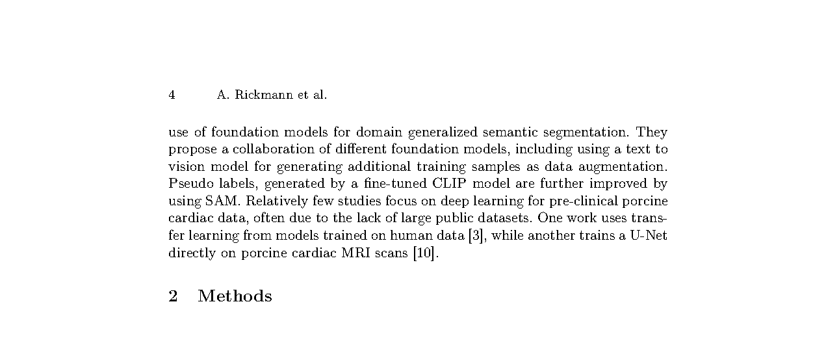

**Abstract**  
Cardiac image segmentation is an important step in many cardiac image analysis and modeling tasks such as motion tracking or simulations of cardiac mechanics. While deep learning has greatly advanced segmentation in clinical settings, there is limited work on pre-clinical imaging, notably in porcine models, which are often used due to their anatomical and physiological similarity to humans. However, differences between species create a domain shift that complicates direct model transfer from human to pig data. Recently, foundation models trained on large human datasets have shown promise for robust medical image segmentation; yet their applicability to porcine data remains largely unexplored. In this work, we investigate whether foundation models can generate sufficiently accurate pseudo-labels for pig cardiac CT and propose a simple self-training approach to iteratively refine these labels. Our method requires no manually annotated pig data, relying instead on iterative updates to improve segmentation quality. We demonstrate that this self-training process not only enhances segmentation accuracy but also smooths out temporal inconsistencies across consecutive frames. Although our results are encouraging, there remains room for improvement, for example by incorporating more sophisticated self-training strategies and by exploring additional foundation models and other cardiac imaging technologies.

**Summary**  
TBD

[⬆ Back to Literature Table](#samothers)

---

### <a id="multi-scale-feature-fusion-based-sam-for-high-qu-69ba7711">Multi-scale feature fusion based SAM for high-quality few-shot medical image segmentation</a>
> **Venue:** Computer Vision and Image Understanding 2025  
> **Authors:** S. Liu et al.  
> **Keywords:** Few-ShotMIS, SAM
**Links**  
[Viewable Link](https://linkinghub.elsevier.com/retrieve/pii/S1077314225001122) [Original Link](https://www.sciencedirect.com/science/article/abs/pii/S1077314225001122) [Code](https://github.com/1683194873xrn/HF-SAM)

  <!-- Add image to imgs/ and uncomment the img tag below. -->
  <!--  -->

**Abstract**  
TBD

**Summary**  
TBD

[⬆ Back to Literature Table](#samfsmis)

---

### <a id="brainsegdmlf-a-dynamic-fusion-enhanced-sam-for-b-e845d388">BrainSegDMlF: A Dynamic Fusion-enhanced SAM for Brain Lesion Segmentation</a>
> **Venue:** 33rd ACM International Conference on Multimedia 2025  
> **Authors:** H. Wang et al.  
> **Keywords:** InteractiveMIS, SAM
**Links**  
[Viewable Link](https://dl.acm.org/doi/10.1145/3746027.3755230) [Original Link](https://arxiv.org/pdf/2505.06133)

  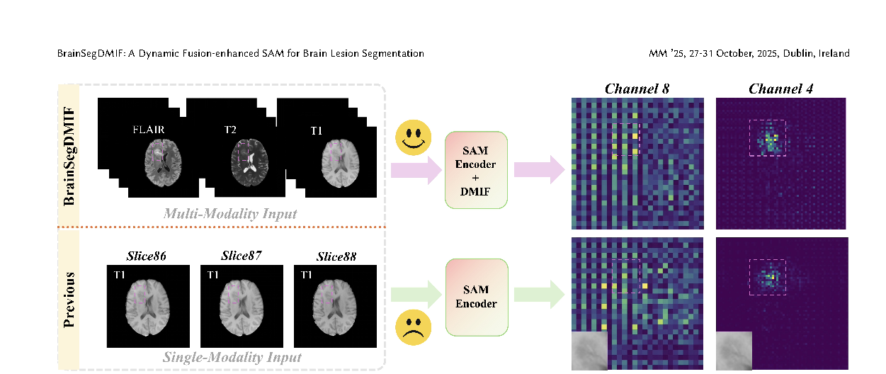

**Abstract**  
The segmentation of substantial brain lesions is a significant and challenging task in the field of medical image segmentation. Substantial brain lesions in brain imaging exhibit high heterogeneity, with indistinct boundaries between lesion regions and normal brain tissue. Small lesions in single slices are difficult to identify, making the accurate and reproducible segmentation of abnormal regions, as well as their feature description, highly complex. Existing methods have the following limitations: 1) They rely solely on single-modal information for learning, neglecting the multi-modal information commonly used in diagnosis. This hampers the ability to comprehensively acquire brain lesion information from multiple perspectives and prevents the effective integration and utilization of multi-modal data inputs, thereby limiting a holistic understanding of lesions. 2) They are constrained by the amount of data available, leading to low sensitivity to small lesions and difficulty in detecting subtle pathological changes. 3) Current SAM-based models rely on external prompts, which cannot achieve automatic segmentation and, to some extent, affect diagnostic efficiency.To address these issues, we have developed a large-scale fully automated segmentation model specifically designed for brain lesion segmentation, named BrainSegDMLF. This model has the following features: 1) Dynamic Modal Interactive Fusion (DMIF) module that processes and integrates multi-modal data during the encoding process, providing the SAM encoder with more comprehensive modal information. 2) Layer-by-Layer Upsampling Decoder, enabling the model to extract rich low-level and high-level features even with limited data, thereby detecting the presence of small lesions. 3) Automatic segmentation masks, allowing the model to generate lesion masks automatically without requiring manual prompts.

**Summary**  
TBD

[⬆ Back to Literature Table](#samiwmis)

---

### <a id="advancing-generalizable-tumor-segmentation-with-43d99d2b">Advancing Generalizable Tumor Segmentation with Anomaly-Aware Open-Vocabulary Attention Maps and Frozen Foundation Diffusion Models</a>
> **Venue:** 2025 IEEE/CVF Conference on Computer Vision and Pattern Recognition (CVPR)  
> **Authors:** Y. Jiang et al.  
> **Keywords:** Zero-ShotMIS, SAM
**Links**  
[Viewable Link](https://ieeexplore.ieee.org/document/11094149/) [Original Link](https://arxiv.org/pdf/2505.02753) [Code](https://github.com/Yankai96/DiffuGTS)

  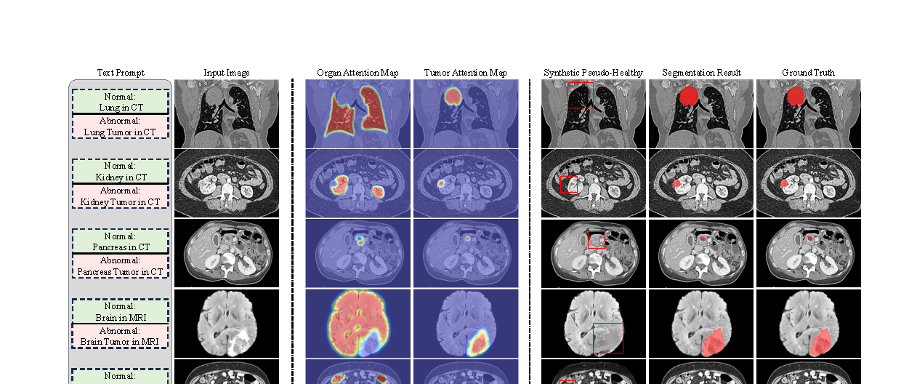

**Abstract**  
We explore Generalizable Tumor Segmentation, aiming to train a single model for zero-shot tumor segmentation across diverse anatomical regions. Existing methods face limitations related to segmentation quality, scalability, and the range of applicable imaging modalities. In this paper, we uncover the potential of the internal representations within frozen medical foundation diffusion models as highly efficient zero-shot learners for tumor segmentation by introducing a novel framework named DiffuGTS. DiffuGTS creates anomaly-aware open-vocabulary attention maps based on text prompts to enable generalizable anomaly segmentation without being restricted by a predefined training category list. To further improve and refine anomaly segmentation masks, DiffuGTS leverages the diffusion model, transforming pathological regions into high-quality pseudo-healthy counterparts through latent space inpainting, and applies a novel pixel-level and feature-level residual learning approach, resulting in segmentation masks with significantly enhanced quality and generalization. Comprehensive experiments on four datasets and seven tumor categories demonstrate the superior performance of our method, surpassing current state-of-the-art models across multiple zero-shot settings. Codes are available at https://github.com/Yankai96/DiffuGTS.

**Summary**  
TBD

[⬆ Back to Literature Table](#samzsmis)

---

### <a id="integrating-sam-priors-with-u-net-for-enhanced-m-20b0cf44">Integrating SAM priors with U-Net for enhanced multiclass cell detection in digital pathology</a>
> **Venue:** Scientific Reports 2025  
> **Authors:** Z. Wu et al.  
> **Keywords:** OtherMIS, SAM
**Links**  
[Viewable Link](https://www.nature.com/articles/s41598-025-99278-0) [Original Link](https://www.nature.com/articles/s41598-025-99278-0.pdf)

  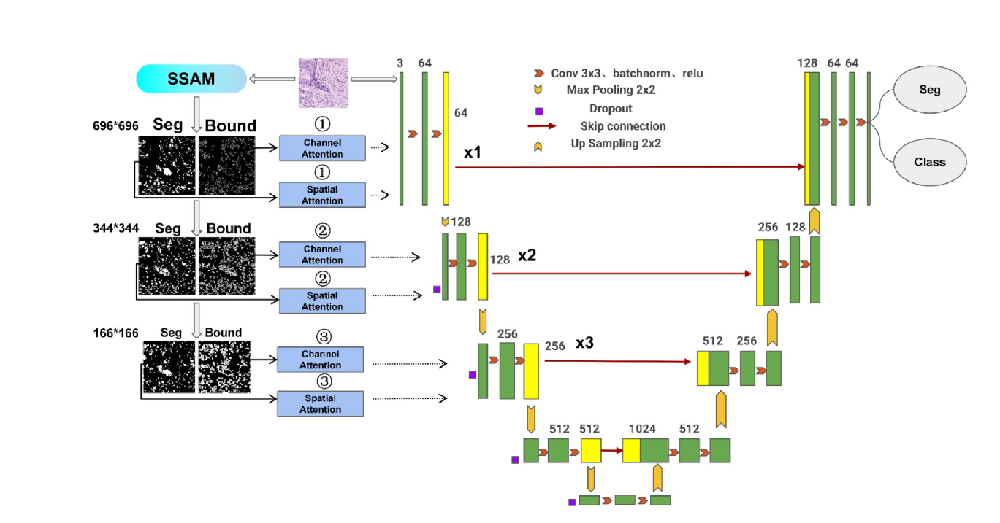

**Abstract**  
In digital pathology, the accurate detection, segmentation, and classification of cells are pivotal for precise pathological diagnosis. Traditionally, pathologists manually segment cells from pathological images to facilitate diagnosis based on these results and other critical indicators. However, this manual approach is not only time-consuming but also prone to subjective biases, which significantly hampers its efficiency and consistency in large-scale applications. While classic segmentation networks like U-Net have gained widespread adoption in medical imaging, their integration with external prior features remains limited, thereby restricting the potential enhancement of segmentation accuracy. Although the large model SAM, renowned for its capability to "segment anything", has shown promise, its application in the specialized field of medical image processing presents considerable challenges. Direct application of SAM to medical scenarios often fails to yield optimal results. To overcome these limitations, this paper proposes a novel prior-guided joint attention mechanism. This method effectively integrates the prior features generated by SAM with the foundational features extracted by U-Net, achieving superior cell segmentation and classification. Extensive experiments on public datasets reveal that the proposed method significantly surpasses both standalone U-Net and approaches that merely augment inputs by overlaying prior features onto color channels. This advancement not only enhances the utility of large models in medical applications but also lays the groundwork for the evolution of intelligent pathological diagnostic technologies.

**Summary**  
TBD

[⬆ Back to Literature Table](#samothers)

---

### <a id="tp-sa3m-text-prompts-assisted-sam-for-myopic-mac-13283592">TP-SA3M: text prompts-assisted SAM for myopic maculopathy segmentation</a>
> **Venue:** The Visual Computer 2025  
> **Authors:** T. Li et al.  
> **Keywords:** OtherMIS, SAM
**Links**  
[Viewable Link](https://link.springer.com/10.1007/s00371-025-03892-y) [Original Link](https://link.springer.com/article/10.1007/s00371-025-03892-y)

  <!-- Add image to imgs/ and uncomment the img tag below. -->
  <!--  -->

**Abstract**  
Applying promptable segmentation foundation models, such as the segment anything model (SAM), to medical image segmentation poses challenges, particularly in addressing irregular morphologies, indistinct boundaries, and sparsely distributed lesions, such as those associated with myopic maculopathy (MM). In this paper, we propose TP-SA3M, a novel two-step framework that customizes SAM for text-prompted MM lesion segmentation. Our approach incorporates explainable medical prior knowledge to guide and enhance the segmentation process. Specifically, we leverage the text–image alignment capabilities of vision-language models to generate these priors. The multi-scale visual–text alignment module learns both local and global semantics of lesions by aligning visual and textual features at different levels. A parameter-efficient prior-injected adapter is incorporated into the SAM encoder, facilitating cross-modal knowledge sharing. These priors also guide the generation of prior-guided prompts (bounding box and points), further refining the segmentation. Additionally, a decoupled mask decoder is employed to mitigate cross-domain degradation caused by domain shifts. Experiments on two public MM datasets demonstrate that our framework achieves state-of-the-art performance.

**Summary**  
TBD

[⬆ Back to Literature Table](#samothers)

---

### <a id="un-sam-domain-adaptive-self-prompt-segmentation-7f8ac935">UN-SAM: Domain-adaptive self-prompt segmentation for universal nuclei images</a>
> **Venue:** Medical Image Analysis 2025  
> **Authors:** Z. Chen et al.  
> **Keywords:** OtherMIS, SAM
**Links**  
[Viewable Link](https://linkinghub.elsevier.com/retrieve/pii/S1361841525001549) [Original Link](https://www.sciencedirect.com/science/article/abs/pii/S1361841525001549) [Code](https://github.com/CUHK-AIM-Group/UN-SAM)

  <!-- Add image to imgs/ and uncomment the img tag below. -->
  <!--  -->

**Abstract**  
TBD

**Summary**  
TBD

[⬆ Back to Literature Table](#samothers)

---

### <a id="sam4em-efficient-memory-based-two-stage-prompt-f-35353866">SAM4EM: Efficient memory-based two stage prompt-free segment anything model adapter for complex 3D neuroscience electron microscopy stacks</a>
> **Venue:** 2025 IEEE/CVF Conference on Computer Vision and Pattern Recognition Workshops (CVPRW)  
> **Authors:** U. Shah et al.  
> **Keywords:** OtherMIS, SAM
**Links**  
[Viewable Link](https://ieeexplore.ieee.org/document/11147546/) [Original Link](https://arxiv.org/pdf/2504.21544) [Code](https://github.com/Uzshah/SAM4EM)

  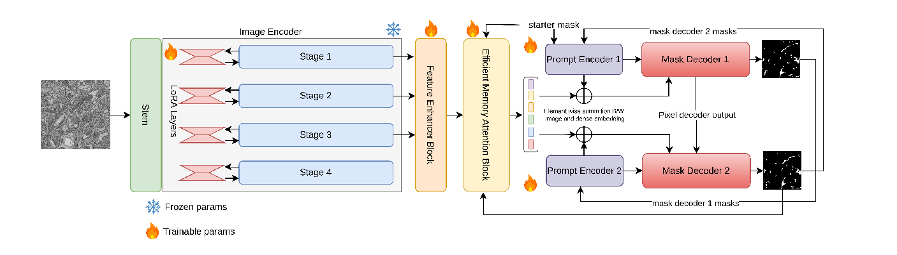

**Abstract**  
We present SAM4EM, a novel approach for 3D segmentation of complex neural structures in electron microscopy (EM) data by leveraging the Segment Anything Model (SAM) alongside advanced fine-tuning strategies. Our contributions include the development of a prompt-free adapter for SAM using two stage mask decoding to automatically generate prompt embeddings, a dual-stage fine-tuning method based on Low-Rank Adaptation (LoRA) for enhancing segmentation with limited annotated data, and a 3D memory attention mechanism to ensure segmentation consistency across 3D stacks. We further release a unique benchmark dataset for the segmentation of astrocytic processes and synapses. We evaluated our method on challenging neuroscience segmentation benchmarks, specifically targeting mitochondria, glia, and synapses, with significant accuracy improvements over state-of-the-art (SOTA) methods, including recent SAM-based adapters developed for the medical domain and other vision transformer-based approaches. Experimental results indicate that our approach outperforms existing solutions in the segmentation of complex processes like glia and post-synaptic densities. Our code and models are available at https://github.com/Uzshah/SAM4EM.

**Summary**  
TBD

[⬆ Back to Literature Table](#samothers)

---

### <a id="radsam-segmenting-3d-radiological-images-with-a-ed1f6d22">RadSAM: Segmenting 3D Radiological Images with a 2D Promptable Model</a>
> **Venue:** Lecture Notes in Computer Science 2026  
> **Authors:** J. Khlaut et al.  
> **Keywords:** InteractiveMIS, SAM
**Links**  
[Viewable Link](https://link.springer.com/10.1007/978-3-032-04965-0_41) [Original Link](https://arxiv.org/pdf/2504.20837)

  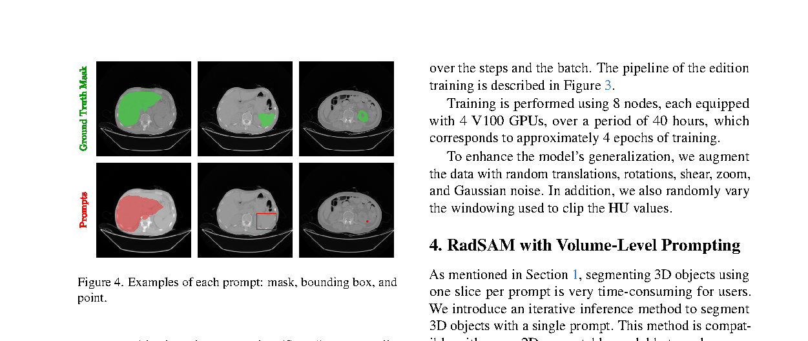

**Abstract**  
Medical image segmentation is a crucial and time-consuming task in clinical care, where mask precision is extremely important. The Segment Anything Model (SAM) offers a promising approach, as it provides an interactive interface based on visual prompting and edition to refine an initial segmentation. This model has strong generalization capabilities, does not rely on predefined classes, and adapts to diverse objects; however, it is pre-trained on natural images and lacks the ability to process medical data effectively. In addition, this model is built for 2D images, whereas a whole medical domain is based on 3D images, such as CT and MRI. Recent adaptations of SAM for medical imaging are based on 2D models, thus requiring one prompt per slice to segment 3D objects, making the segmentation process tedious. They also lack important features such as editing. To bridge this gap, we propose RadSAM, a novel method for segmenting 3D objects with a 2D model from a single prompt. In practice, we train a 2D model using noisy masks as initial prompts, in addition to bounding boxes and points. We then use this novel prompt type with an iterative inference pipeline to reconstruct the 3D mask slice-by-slice. We introduce a benchmark to evaluate the model's ability to segment 3D objects in CT images from a single prompt and evaluate the models' out-of-domain transfer and edition capabilities. We demonstrate the effectiveness of our approach against state-of-the-art models on this benchmark using the AMOS abdominal organ segmentation dataset.

**Summary**  
TBD

[⬆ Back to Literature Table](#samiwmis)

---

### <a id="sam-guided-robust-representation-learning-for-on-f52e8a78">SAM-Guided Robust Representation Learning for One-Shot 3D Medical Image Segmentation</a>
> **Venue:** arXiv.org 2025  
> **Authors:** J. Wang et al.  
> **Keywords:** Few-ShotMIS, SAM
**Links**  
[Viewable Link](https://arxiv.org/abs/2504.20501) [Original Link](https://arxiv.org/pdf/2504.20501)

  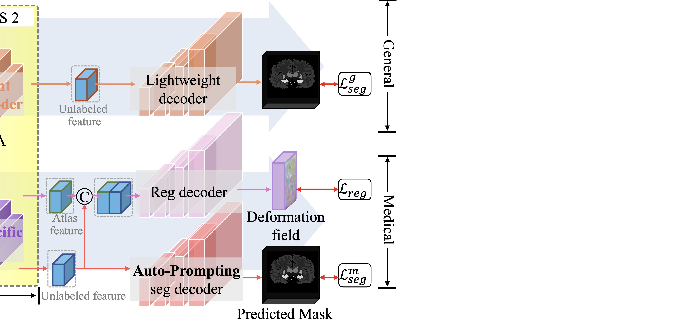

**Abstract**  
One-shot medical image segmentation (MIS) is crucial for medical analysis due to the burden of medical experts on manual annotation. The recent emergence of the segment anything model (SAM) has demonstrated remarkable adaptation in MIS but cannot be directly applied to one-shot medical image segmentation (MIS) due to its reliance on labor-intensive user interactions and the high computational cost. To cope with these limitations, we propose a novel SAM-guided robust representation learning framework, named RRL-MedSAM, to adapt SAM to one-shot 3D MIS, which exploits the strong generalization capabilities of the SAM encoder to learn better feature representation. We devise a dual-stage knowledge distillation (DSKD) strategy to distill general knowledge between natural and medical images from the foundation model to train a lightweight encoder, and then adopt a mutual exponential moving average (mutual-EMA) to update the weights of the general lightweight encoder and medical-specific encoder. Specifically, pseudo labels from the registration network are used to perform mutual supervision for such two encoders. Moreover, we introduce an auto-prompting (AP) segmentation decoder which adopts the mask generated from the general lightweight model as a prompt to assist the medical-specific model in boosting the final segmentation performance. Extensive experiments conducted on three public datasets, i.e., OASIS, CT-lung demonstrate that the proposed RRL-MedSAM outperforms state-of-the-art one-shot MIS methods for both segmentation and registration tasks. Especially, our lightweight encoder uses only 3\% of the parameters compared to the encoder of SAM-Base.

**Summary**  
TBD

[⬆ Back to Literature Table](#samfsmis)

---

### <a id="prompt-tuning-sam-from-generalist-to-specialist-c0d1b0a3">Prompt-Tuning SAM: From Generalist to Specialist with only 2048 Parameters and 16 Training Images</a>
> **Venue:** 2025 IEEE/CVF Conference on Computer Vision and Pattern Recognition Workshops (CVPRW)  
> **Authors:** T. Piater et al.  
> **Keywords:** InteractiveMIS, SAM
**Links**  
[Viewable Link](https://ieeexplore.ieee.org/document/11147247/) [Original Link](https://arxiv.org/pdf/2504.16739)

  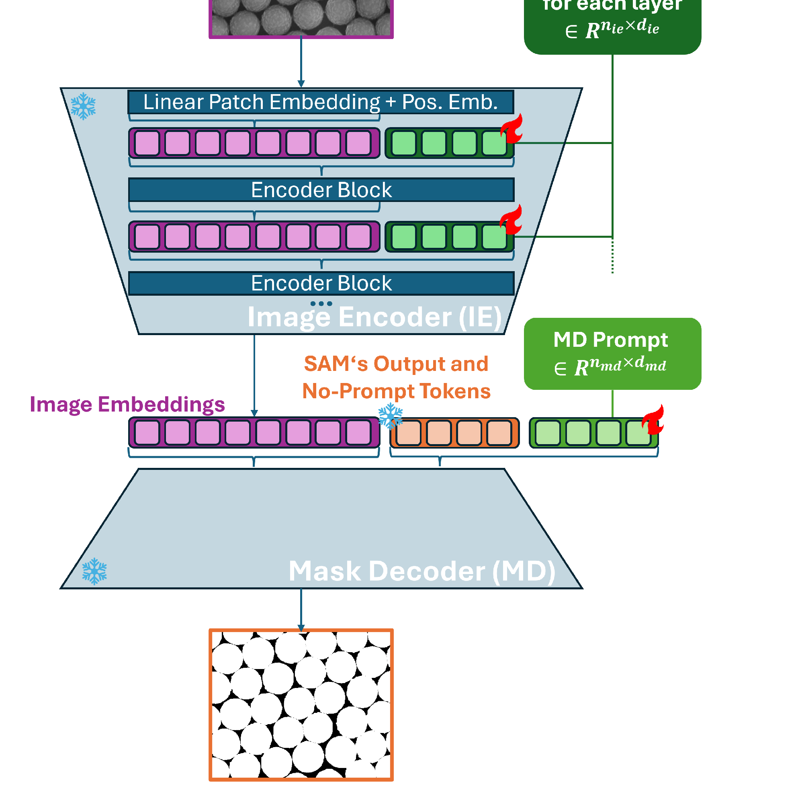

**Abstract**  
The Segment Anything Model (SAM) is widely used for segmenting a diverse range of objects in natural images from simple user prompts like points or bounding boxes. However, SAM's performance decreases substantially when applied to non-natural domains like microscopic imaging. Furthermore, due to SAM's interactive design, it requires a precise prompt for each image and object, which is unfeasible in many automated biomedical applications. Previous solutions adapt SAM by training millions of parameters via fine-tuning large parts of the model or of adapter layers. In contrast, we show that as little as 2,048 additional parameters are sufficient for turning SAM into a use-case specialist for a certain downstream task. Our novel PTSAM (prompt-tuned SAM) method uses prompt-tuning, a parameter-efficient fine-tuning technique, to adapt SAM for a specific task. We validate the performance of our approach on multiple microscopic and one medical dataset. Our results show that prompt-tuning only SAM's mask decoder already leads to a performance on-par with state-of-the-art techniques while requiring roughly 2,000x less trainable parameters. For addressing domain gaps, we find that additionally prompt-tuning SAM's image encoder is beneficial, further improving segmentation accuracy by up to 18% over state-of-the-art results. Since PTSAM can be reliably trained with as little as 16 annotated images, we find it particularly helpful for applications with limited training data and domain shifts.

**Summary**  
TBD

[⬆ Back to Literature Table](#samiwmis)

---

### <a id="mit-sam-medical-image-text-sam-with-mutually-enh-49972513">MIT-SAM: Medical Image-Text SAM With Mutually Enhanced Heterogeneous Features Fusion for Medical Image Segmentation</a>
> **Venue:** IEEE Journal of Biomedical and Health Informatics 2025  
> **Authors:** X. Zhou et al.  
> **Keywords:** InteractiveMIS, SAM
**Links**  
[Viewable Link](https://ieeexplore.ieee.org/document/10966035/) [Original Link](https://ieeexplore.ieee.org/abstract/document/10966035) [Code](https://github.com/jojodan514/MIT-SAM)

  <!-- Add image to imgs/ and uncomment the img tag below. -->
  <!--  -->

**Abstract**  
In recent times, leveraging lesion text as supplementary data to enhance the performance of medical image segmentation models has garnered attention. Previous approaches only used attention mechanisms to integrate image and text features, while not effectively utilizing the highly condensed textual semantic information in improving the fused features, resulting in inaccurate lesion segmentation. This paper introduces a novel approach, the Medical Image-Text Segment Anything Model (MIT-SAM), for text-assisted medical image segmentation. Specifically, we introduce the SAM-enhanced image encoder and a Bert-based text encoder to extract heterogeneous features. To better leverage the highly condensed textual semantic information for heterogeneous feature fusion, such as crucial details like position and quantity, we propose the image-text interactive fusion (ITIF) block and self-supervised text reconstruction (SSTR) method. The ITIF block facilitates the mutual enhancement of homogeneous information among heterogeneous features and the SSTR method empowers the model to capture crucial details concerning lesion text, including location, quantity, and other key aspects. Experimental results demonstrate that our proposed model achieves state-of-the-art performance on the QaTa-COV19 and MosMedData+ datasets.

**Summary**  
TBD

[⬆ Back to Literature Table](#samiwmis)

---

### <a id="ica-samv7-internal-carotid-artery-segmentation-w-7dcb6a62">ICA-SAMv7: Internal carotid artery segmentation with coarse to fine network</a>
> **Venue:** Computerized Medical Imaging and Graphics 2025  
> **Authors:** X. Yan et al.  
> **Keywords:** OtherMIS, SAM
**Links**  
[Viewable Link](https://linkinghub.elsevier.com/retrieve/pii/S0895611125000643) [Original Link](https://www.sciencedirect.com/science/article/pii/S0895611125000643) [Code](https://github.com/BessiePei/ICA-SAMv7)

  <!-- Add image to imgs/ and uncomment the img tag below. -->
  <!--  -->

**Abstract**  
Internal carotid artery (ICA) stenosis is a life-threatening occult disease. Using Computed Tomography Angiography (CTA) to examine vascular lesions such as calcified and non-calcified plaques in cases of carotid artery stenosis is a necessary clinical step in formulating the correct treatment plan. Segment Anything Model (SAM) has shown promising performance in image segmentation tasks, but it performs poorly for carotid artery segmentation. Due to the small size of the calcification and the overlapping between the lumen and calcification, these challenges lead to issues such as mislabeling and boundary fragmentation, as well as high training costs. To address these problems, we propose a two-stage Carotid Artery lesion segmentation method called ICA-SAMv7, which performs coarse and fine segmentation based on the YOLOv7 and SAM model. Specifically, in the first stage (ICA-YOLOv7), we utilize YOLOv7 for coarse vessel recognition, introducing connectivity enhancement to improve accuracy and achieve precise localization of small target carotid artery. In the second stage (ICA-SAM), we enhance SAM through data augmentation and an efficient parameter fine-tuning strategy. This improves the segmentation accuracy of fine-grained lesions in blood vessels while saving training costs. Ultimately, the accuracy of lesion segmentation under the SAM model was increased from the original 48.62% to 83.69%. Extensive comparative experiments have demonstrated the outstanding performance of our algorithm. Our codes can be found at https://github.com/BessiePei/ICA-SAMv7.

**Summary**  
TBD

[⬆ Back to Literature Table](#samothers)

---

### <a id="bus-m2ae-multi-scale-masked-autoencoder-for-brea-6da6c05e">BUS-M2AE: Multi-scale Masked Autoencoder for Breast Ultrasound Image Analysis</a>
> **Venue:** Computers in Biology and Medicine 2025  
> **Authors:** L. Yu et al.  
> **Keywords:** OtherMIS, SAM
**Links**  
[Viewable Link](https://linkinghub.elsevier.com/retrieve/pii/S0010482525005104) [Original Link](https://www.sciencedirect.com/science/article/pii/S0010482525005104)

  <!-- Add image to imgs/ and uncomment the img tag below. -->
  <!--  -->

**Abstract**  
TBD

**Summary**  
TBD

[⬆ Back to Literature Table](#samothers)

---

### <a id="a-prediction-method-for-radiation-proctitis-base-950580d7">A prediction method for radiation proctitis based on SAM-Med2D model</a>
> **Venue:** Scientific Reports 2025  
> **Authors:** N. Zhang et al.  
> **Keywords:** OtherMIS, SAM
**Links**  
[Viewable Link](https://www.nature.com/articles/s41598-025-87409-6) [Original Link](https://www.nature.com/articles/s41598-025-87409-6.pdf)

  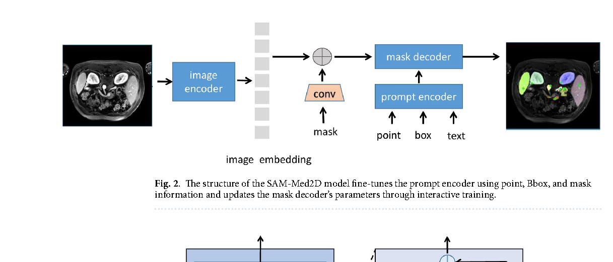

**Abstract**  
Cervical cancer, a prevalent gynecological malignancy, poses significant threats to women's health. Despite advances in treatment modalities, radiotherapy remains a cornerstone in managing cervical cancer. However, radiotherapy-induced complications, such as radiation proctitis, present substantial diagnostic and prognostic challenges. Accurate diagnosis are crucial for optimizing treatment strategies and improving patient outcomes. Deep learning has shown remarkable success in medical image segmentation, aiding clinicians in assessing patient conditions. In the other hand, radiomics excels in extracting diagnostically valuable features from medical images but requires extensive manual annotation and often lacks generalizability. Therefore, combining the strengths of deep learning and radiomics is pivotal in addressing these challenges. In this study, we propose a novel paradigm that leverages deep learning models for initial segmentation, followed by detailed radiomics analysis. Specifically, we utilize the Transformer-based SAM-Med2D model to extract visual features from CT images of cervical cancer patients. We apply T-tests and Lasso regression to identify features most correlated with radiation proctitis and build predictive models using logistic regression, random forest, and naive Gaussian Bayesian algorithms. Experimental results demonstrate that our method effectively extracts CT imaging features and exhibits excellent performance in diagnosis radiation proctitis. This approach not only enhances predictive accuracy but also provides a valuable tool for personalizing treatment plans and improving patient outcomes in cervical cancer radiotherapy.

**Summary**  
TBD

[⬆ Back to Literature Table](#samothers)

---

### <a id="sambv-a-fine-tuned-sam-with-interpolation-consis-40e84296">SAMBV: A fine-tuned SAM with interpolation consistency regularization for semi-supervised bi-ventricle segmentation from cardiac MRI</a>
> **Venue:** Medical Engineering &amp; Physics 2025  
> **Authors:** Y. Wang et al.  
> **Keywords:** SSLMIS, SAM
**Links**  
[Viewable Link](https://iopscience.iop.org/article/10.1016/j.medengphy.2025.104341) [Original Link](https://www.sciencedirect.com/science/article/abs/pii/S1350453325000608)

  <!-- Add image to imgs/ and uncomment the img tag below. -->
  <!--  -->

**Abstract**  
The SAM (segment anything model) is a foundation model for general purpose image segmentation, however, when it comes to a specific medical application, such as segmentation of both ventricles from the 2D cardiac MRI, the results are not satisfactory. The scarcity of labeled medical image data further increases the difficulty to apply the SAM to medical image processing. To address these challenges, we propose the SAMBV by fine-tuning the SAM for semi-supervised segmentation of bi-ventricle from the 2D cardiac MRI. The SAM is tuned in three aspects, (i) the position and feature adapters are introduced so that the SAM can adapt to bi-ventricle segmentation. (ii) a dual-branch encoder is incorporated to collect missing local feature information in SAM so as to improve bi-ventricle segmentation. (iii) the interpolation consistency regularization (ICR) semi-supervised manner is utilized, allowing the SAMBV to achieve competitive performance with only 40% of the labeled data in the ACDC dataset. Experimental results demonstrate that the proposed SAMBV achieves an average Dice score improvement of 17.6% over the original SAM, raising its performance from 74.49% to 92.09%. Furthermore, the SAMBV outperforms other supervised SAM fine-tuning methods, showing its effectiveness in semi-supervised medical image segmentation tasks. Notably, the proposed method is specifically designed for 2D MRI data.

**Summary**  
TBD

[⬆ Back to Literature Table](#samsslmis)

---

### <a id="mixture-of-shape-experts-mose-end-to-end-shape-d-cf02bf93">Mixture-of-Shape-Experts (MoSE): End-to-End Shape Dictionary Framework to Prompt SAM for Generalizable Medical Segmentation</a>
> **Venue:** 2025 IEEE/CVF Conference on Computer Vision and Pattern Recognition Workshops (CVPRW)  
> **Authors:** J. Wei et al.  
> **Keywords:** SSLMIS, SAM
**Links**  
[Viewable Link](https://ieeexplore.ieee.org/document/11147816/) [Original Link](https://arxiv.org/pdf/2504.09601)

  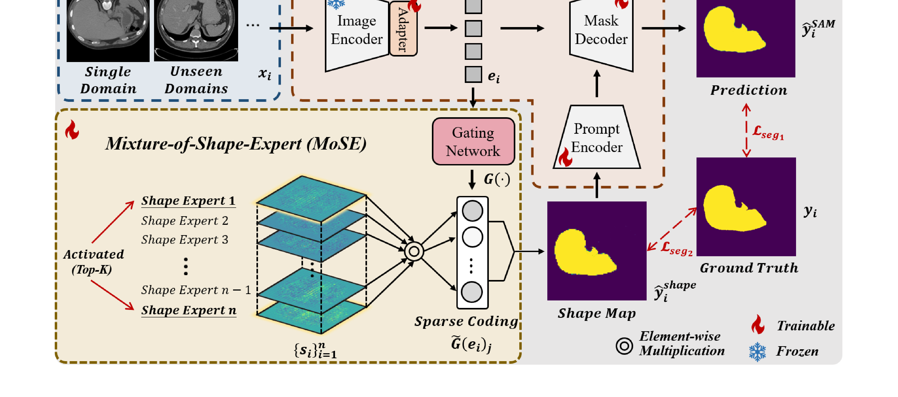

**Abstract**  
Single domain generalization (SDG) has recently attracted growing attention in medical image segmentation. One promising strategy for SDG is to leverage consistent semantic shape priors across different imaging protocols, scanner vendors, and clinical sites. However, existing dictionary learning methods that encode shape priors often suffer from limited representational power with a small set of offline computed shape elements, or overfitting when the dictionary size grows. Moreover, they are not readily compatible with large foundation models such as the Segment Anything Model (SAM). In this paper, we propose a novel Mixture-of-Shape-Experts (MoSE) framework that seamlessly integrates the idea of mixture-of-experts (MoE) training into dictionary learning to efficiently capture diverse and robust shape priors. Our method conceptualizes each dictionary atom as a shape expert, which specializes in encoding distinct semantic shape information. A gating network dynamically fuses these shape experts into a robust shape map, with sparse activation guided by SAM encoding to prevent overfitting. We further provide this shape map as a prompt to SAM, utilizing the powerful generalization capability of SAM through bidirectional integration. All modules, including the shape dictionary, are trained in an end-to-end manner. Extensive experiments on multiple public datasets demonstrate its effectiveness.

**Summary**  
TBD

[⬆ Back to Literature Table](#samsslmis)

---

### <a id="balancing-multi-target-semi-supervised-medical-i-a157dd57">Balancing Multi-Target Semi-Supervised Medical Image Segmentation with Collaborative Generalist and Specialists</a>
> **Venue:** IEEE Transactions on Medical Imaging 2025  
> **Authors:** Y. Wang et al.  
> **Keywords:** SSLMIS, SAM
**Links**  
[Viewable Link](https://ieeexplore.ieee.org/document/10948494/) [Original Link](https://arxiv.org/pdf/2504.00862) [Code](https://github.com/wangyou0804/CGS)

  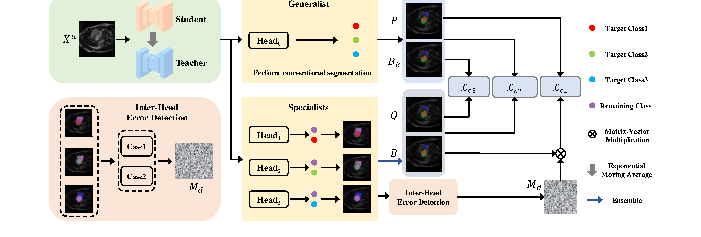

**Abstract**  
Despite the promising performance achieved by current semi-supervised models in segmenting individual medical targets, many of these models suffer a notable decrease in performance when tasked with the simultaneous segmentation of multiple targets. A vital factor could be attributed to the imbalanced scales among different targets: during simultaneously segmenting multiple targets, large targets dominate the loss, leading to small targets being misclassified as larger ones. To this end, we propose a novel method, which consists of a Collaborative Generalist and several Specialists, termed CGS. It is centered around the idea of employing a specialist for each target class, thus avoiding the dominance of larger targets. The generalist performs conventional multi-target segmentation, while each specialist is dedicated to distinguishing a specific target class from the remaining target classes and the background. Based on a theoretical insight, we demonstrate that CGS can achieve a more balanced training. Moreover, we develop cross-consistency losses to foster collaborative learning between the generalist and the specialists. Lastly, regarding their intrinsic relation that the target class of any specialized head should belong to the remaining classes of the other heads, we introduce an inter-head error detection module to further enhance the quality of pseudo-labels. Experimental results on three popular benchmarks showcase its superior performance compared to state-of-the-art methods.

**Summary**  
TBD

[⬆ Back to Literature Table](#samsslmis)

---

### <a id="zero-shot-domain-generalization-of-foundational-9ee989a0">Zero-shot Domain Generalization of Foundational Models for 3D Medical Image Segmentation: An Experimental Study</a>
> **Venue:** arXiv.org 2025  
> **Authors:** S. Chattopadhyay et al.  
> **Keywords:** Zero-ShotMIS, SAM
**Links**  
[Viewable Link](https://arxiv.org/abs/2503.22862) [Original Link](https://arxiv.org/pdf/2503.22862)

  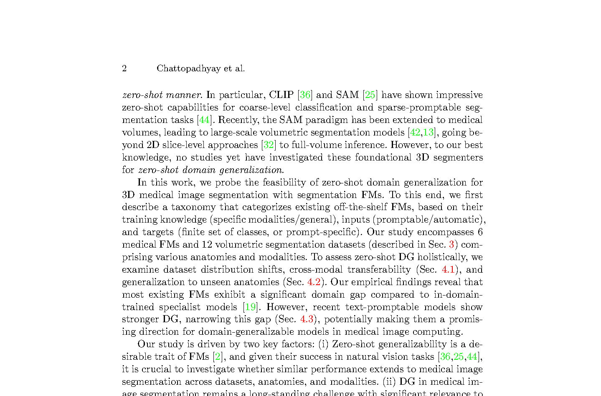

**Abstract**  
Domain shift, caused by variations in imaging modalities and acquisition protocols, limits model generalization in medical image segmentation. While foundation models (FMs) trained on diverse large-scale data hold promise for zero-shot generalization, their application to volumetric medical data remains underexplored. In this study, we examine their ability towards domain generalization (DG), by conducting a comprehensive experimental study encompassing 6 medical segmentation FMs and 12 public datasets spanning multiple modalities and anatomies. Our findings reveal the potential of promptable FMs in bridging the domain gap via smart prompting techniques. Additionally, by probing into multiple facets of zero-shot DG, we offer valuable insights into the viability of FMs for DG and identify promising avenues for future research.

**Summary**  
TBD

[⬆ Back to Literature Table](#samzsmis)

---

### <a id="biprompt-sam-enhancing-image-segmentation-via-ex-5ea94fa7">BiPrompt-SAM: Enhancing Image Segmentation via Explicit Selection between Point and Text Prompts</a>
> **Venue:** arXiv.org 2025  
> **Authors:** S. Xu et al.  
> **Keywords:** Zero-ShotMIS, SAM
**Links**  
[Viewable Link](https://arxiv.org/abs/2503.19769) [Original Link](https://arxiv.org/pdf/2503.19769)

  <!-- Add image to imgs/ and uncomment the img tag below. -->
  <!--  -->

**Abstract**  
Segmentation is a fundamental task in computer vision, with prompt-driven methods gaining prominence due to their flexibility. The Segment Anything Model (SAM) excels at point-prompted segmentation, while text-based models, often leveraging powerful multimodal encoders like BEIT-3, provide rich semantic understanding. However, effectively combining these complementary modalities remains a challenge. This paper introduces BiPrompt-SAM, a novel dual-modal prompt segmentation framework employing an explicit selection mechanism. We leverage SAM's ability to generate multiple mask candidates from a single point prompt and use a text-guided mask (generated via EVF-SAM with BEIT-3) to select the point-generated mask that best aligns spatially, measured by Intersection over Union (IoU). This approach, interpretable as a simplified Mixture of Experts (MoE), effectively fuses spatial precision and semantic context without complex model modifications. Notably, our method achieves strong zero-shot performance on the Endovis17 medical dataset (89.55% mDice, 81.46% mIoU) using only a single point prompt per instance. This significantly reduces annotation burden compared to bounding boxes and aligns better with practical clinical workflows, demonstrating the method's effectiveness without domain-specific training. On the RefCOCO series, BiPrompt-SAM attained 87.1%, 86.5%, and 85.8% IoU, significantly outperforming existing approaches. Experiments show BiPrompt-SAM excels in scenarios requiring both spatial accuracy and semantic disambiguation, offering a simple, effective, and interpretable perspective on multi-modal prompt fusion.

**Summary**  
TBD

[⬆ Back to Literature Table](#samzsmis)

---

### <a id="show-and-segment-universal-medical-image-segment-f44aae05">Show and Segment: Universal Medical Image Segmentation via In-Context Learning</a>
> **Venue:** 2025 IEEE/CVF Conference on Computer Vision and Pattern Recognition (CVPR)  
> **Authors:** Y. Gao et al.  
> **Keywords:** Few-ShotMIS, SAM
**Links**  
[Viewable Link](https://ieeexplore.ieee.org/document/11094913/) [Original Link](https://arxiv.org/pdf/2503.19359)

  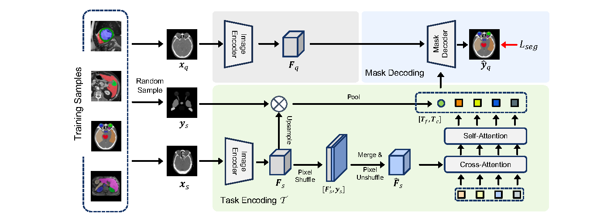

**Abstract**  
Medical image segmentation remains challenging due to the vast diversity of anatomical structures, imaging modalities, and segmentation tasks. While deep learning has made significant advances, current approaches struggle to generalize as they require task-specific training or fine-tuning on unseen classes. We present Iris, a novel In-context Reference Image guided Segmentation framework that enables flexible adaptation to novel tasks through the use of reference examples without fine-tuning. At its core, Iris features a lightweight context task encoding module that distills task-specific information from reference context image-label pairs. This rich context embedding information is used to guide the segmentation of target objects. By decoupling task encoding from inference, Iris supports diverse strategies from one-shot inference and context example ensemble to object-level context example retrieval and in-context tuning. Through comprehensive evaluation across twelve datasets, we demonstrate that Iris performs strongly compared to task-specific models on in-distribution tasks. On seven held-out datasets, Iris shows superior generalization to out-of-distribution data and unseen classes. Further, Iris’s task encoding module can automatically discover anatomical relationships across datasets and modalities, offering insights into medical objects without explicit anatomical supervision.

**Summary**  
TBD

[⬆ Back to Literature Table](#samfsmis)

---

### <a id="optimization-of-medsam-model-based-on-bounding-b-84601017">Optimization of MedSAM Model Based on Bounding Box Adaptive Perturbation Algorithm</a>
> **Venue:** Communications in Computer and Information Science 2025  
> **Authors:** B. Li et al.  
> **Keywords:** Zero-ShotMIS, SAM
**Links**  
[Viewable Link](https://link.springer.com/10.1007/978-981-96-9952-0_2) [Original Link](https://arxiv.org/pdf/2503.18227)

  

**Abstract**  
Segment Anything Model (SAM) demonstrates powerful zero-shot capabilities; however, its accuracy and robustness significantly decrease when applied to medical image segmentation. Existing methods address this issue through modality fusion, integrating textual and image information to provide more detailed priors. In this study, we argue that the granularity of text and the domain gap affect the accuracy of the priors. Furthermore, the discrepancy between high-level abstract semantics and pixel-level boundary details in images can introduce noise into the fusion process. To address this, we propose Prior-Guided SAM (PG-SAM), which employs a fine-grained modality prior aligner to leverage specialized medical knowledge for better modality alignment. The core of our method lies in efficiently addressing the domain gap with fine-grained text from a medical LLM. Meanwhile, it also enhances the priors' quality after modality alignment, ensuring more accurate segmentation. In addition, our decoder enhances the model's expressive capabilities through multi-level feature fusion and iterative mask optimizer operations, supporting unprompted learning. We also propose a unified pipeline that effectively supplies high-quality semantic information to SAM. Extensive experiments on the Synapse dataset demonstrate that the proposed PG-SAM achieves state-of-the-art performance. Our code is released at https://github.com/logan-0623/PG-SAM.

**Summary**  
TBD

[⬆ Back to Literature Table](#samzsmis)

---

### <a id="steady-progress-beats-stagnation-mutual-aid-of-f-3db652cb">Steady Progress Beats Stagnation: Mutual Aid of Foundation and Conventional Models in Mixed Domain Semi-Supervised Medical Image Segmentation</a>
> **Venue:** 2025 IEEE/CVF Conference on Computer Vision and Pattern Recognition (CVPR)  
> **Authors:** Q. Ma et al.  
> **Keywords:** SSLMIS, SAM
**Links**  
[Viewable Link](https://ieeexplore.ieee.org/document/11094453/) [Original Link](https://arxiv.org/pdf/2503.16997) [Code](https://github.com/MQinghe/SynFoC)

  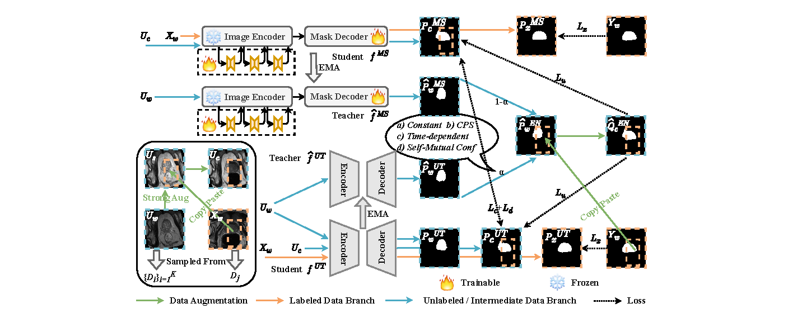

**Abstract**  
Large pretrained visual foundation models exhibit impressive general capabilities. However, the extensive prior knowledge inherent in these models can sometimes be a double-edged sword when adapting them to downstream tasks in specific domains. In the context of semi-supervised medical image segmentation with domain shift, foundation models like MedSAM tend to make overconfident predictions, some of which are incorrect. The error accumulation hinders the effective utilization of unlabeled data and limits further improvements. In this paper, we introduce a Synergistic training framework for Foundation and Conventional models (SynFoC) to address the issue. We observe that a conventional model trained from scratch has the ability to correct the high-confidence mispredictions of the foundation model, while the foundation model can supervise it with high-quality pseudo-labels in the early training stages. Furthermore, to enhance the collaborative training effectiveness of both models and promote reliable convergence towards optimization, the consensus-divergence consistency regularization is proposed. We demonstrate the superiority of our method across four public multi-domain datasets. In particular, our method improves the Dice score by 10.31\% on the Prostate dataset. Our code is available at https://github.com/MQinghe/SynFoC .

**Summary**  
TBD

[⬆ Back to Literature Table](#samsslmis)

---

### <a id="learning-to-efficiently-adapt-foundation-models-72774640">Learning to Efficiently Adapt Foundation Models for Self-Supervised Endoscopic 3D Scene Reconstruction from Any Cameras</a>
> **Venue:** arXiv.org 2025  
> **Authors:** B. Cui et al.  
> **Keywords:** SSLMIS, SAM
**Links**  
[Viewable Link](https://arxiv.org/abs/2503.15917) [Original Link](https://arxiv.org/pdf/2503.15917)

  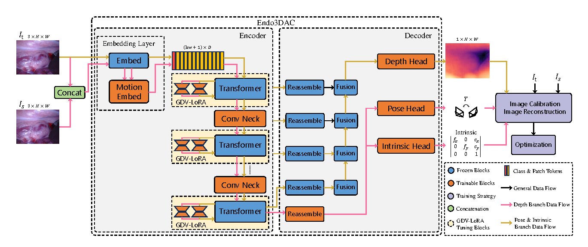

**Abstract**  
Accurate 3D scene reconstruction is essential for numerous medical tasks. Given the challenges in obtaining ground truth data, there has been an increasing focus on self-supervised learning (SSL) for endoscopic depth estimation as a basis for scene reconstruction. While foundation models have shown remarkable progress in visual tasks, their direct application to the medical domain often leads to suboptimal results. However, the visual features from these models can still enhance endoscopic tasks, emphasizing the need for efficient adaptation strategies, which still lack exploration currently. In this paper, we introduce Endo3DAC, a unified framework for endoscopic scene reconstruction that efficiently adapts foundation models. We design an integrated network capable of simultaneously estimating depth maps, relative poses, and camera intrinsic parameters. By freezing the backbone foundation model and training only the specially designed Gated Dynamic Vector-Based Low-Rank Adaptation (GDV-LoRA) with separate decoder heads, Endo3DAC achieves superior depth and pose estimation while maintaining training efficiency. Additionally, we propose a 3D scene reconstruction pipeline that optimizes depth maps' scales, shifts, and a few parameters based on our integrated network. Extensive experiments across four endoscopic datasets demonstrate that Endo3DAC significantly outperforms other state-of-the-art methods while requiring fewer trainable parameters. To our knowledge, we are the first to utilize a single network that only requires surgical videos to perform both SSL depth estimation and scene reconstruction tasks. The code will be released upon acceptance.

**Summary**  
TBD

[⬆ Back to Literature Table](#samsslmis)

---

### <a id="nninteractive-redefining-3d-promptable-segmentat-dfc02114">nnInteractive: Redefining 3D Promptable Segmentation</a>
> **Venue:** arXiv.org 2025  
> **Authors:** F. Isensee et al.  
> **Keywords:** InteractiveMIS, SAM
**Links**  
[Viewable Link](https://arxiv.org/abs/2503.08373) [Original Link](https://arxiv.org/pdf/2503.08373) [Code](https://github.com/MIC-DKFZ/nnInteractive)

  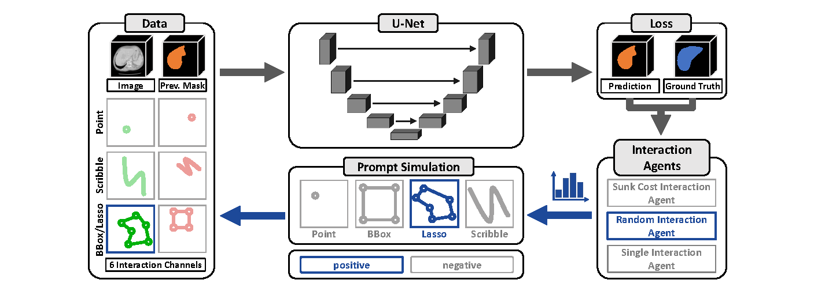

**Abstract**  
Accurate and efficient 3D segmentation is essential for both clinical and research applications. While foundation models like SAM have revolutionized interactive segmentation, their 2D design and domain shift limitations make them ill-suited for 3D medical images. Current adaptations address some of these challenges but remain limited, either lacking volumetric awareness, offering restricted interactivity, or supporting only a small set of structures and modalities. Usability also remains a challenge, as current tools are rarely integrated into established imaging platforms and often rely on cumbersome web-based interfaces with restricted functionality. We introduce nnInteractive, the first comprehensive 3D interactive open-set segmentation method. It supports diverse prompts-including points, scribbles, boxes, and a novel lasso prompt-while leveraging intuitive 2D interactions to generate full 3D segmentations. Trained on 120+ diverse volumetric 3D datasets (CT, MRI, PET, 3D Microscopy, etc.), nnInteractive sets a new state-of-the-art in accuracy, adaptability, and usability. Crucially, it is the first method integrated into widely used image viewers (e.g., Napari, MITK), ensuring broad accessibility for real-world clinical and research applications. Extensive benchmarking demonstrates that nnInteractive far surpasses existing methods, setting a new standard for AI-driven interactive 3D segmentation. nnInteractive is publicly available: https://github.com/MIC-DKFZ/napari-nninteractive (Napari plugin), https://www.mitk.org/MITK-nnInteractive (MITK integration), https://github.com/MIC-DKFZ/nnInteractive (Python backend).

**Summary**  
TBD

[⬆ Back to Literature Table](#samiwmis)

---

### <a id="segment-any-tissue-one-shot-reference-guided-tra-b2379d58">Segment Any Tissue: One-shot reference guided training-free automatic point prompting for medical image segmentation</a>
> **Venue:** Medical Image Analysis 2025  
> **Authors:** X. Liu et al.  
> **Keywords:** Zero-ShotMIS, SAM
**Links**  
[Viewable Link](https://linkinghub.elsevier.com/retrieve/pii/S1361841525000970) [Original Link](https://www.sciencedirect.com/science/article/pii/S1361841525000970) [Code](https://github.com/SnowRain510/Segment-Any-Tissue)

  <!-- Add image to imgs/ and uncomment the img tag below. -->
  <!--  -->

**Abstract**  
TBD

**Summary**  
TBD

[⬆ Back to Literature Table](#samzsmis)

---

### <a id="on-the-fly-improving-segment-anything-for-medica-80e5227f">On-the-Fly Improving Segment Anything for Medical Image Segmentation Using Auxiliary Online Learning</a>
> **Venue:** IEEE Transactions on Medical Imaging 2025  
> **Authors:** T. Huang et al.  
> **Keywords:** OtherMIS, SAM
**Links**  
[Viewable Link](https://ieeexplore.ieee.org/document/10916782/) [Original Link](https://ieeexplore.ieee.org/abstract/document/10916782?casa_token=kvCZt-j2cmwAAAAA:z87WPzwpnZWZdb2Q-T_QpuOHBXIXmg2dNIIKipR53JL3xSXPGne6DK-KVxtNuTyrgzdWFbbM) [Code](https://sam-auxol.github.io/AuxOL)

  <!-- Add image to imgs/ and uncomment the img tag below. -->
  <!--  -->

**Abstract**  
The current variants of the Segment Anything Model (SAM), which include the original SAM and Medical SAM, still lack the capability to produce sufficiently accurate segmentation for medical images. In medical imaging contexts, it is not uncommon for human experts to rectify segmentations of specific test samples after SAM generates its segmentation predictions. These rectifications typically entail manual or semi-manual corrections employing state-of-the-art annotation tools. Motivated by this process, we introduce a novel approach that leverages the advantages of online machine learning to enhance Segment Anything (SA) during test time. We employ rectified annotations to perform online learning, with the aim of improving the segmentation quality of SA on medical images. To ensure the effectiveness and efficiency of online learning when integrated with large-scale vision models like SAM, we propose a new method called Auxiliary Online Learning (AuxOL), which entails adaptive online-batch and adaptive segmentation fusion. Experiments conducted on eight datasets covering four medical imaging modalities validate the effectiveness of the proposed method. Our work proposes and validates a new, practical, and effective approach for enhancing SA on downstream segmentation tasks (e.g., medical image segmentation). The code is publicly available at https://sam-auxol.github.io/AuxOL/.

**Summary**  
TBD

[⬆ Back to Literature Table](#samothers)

---

### <a id="semisam-rethinking-semi-supervised-medical-image-d74217a0">SemiSAM+: Rethinking Semi-Supervised Medical Image Segmentation in the Era of Foundation Models</a>
> **Venue:** Medical Image Analysis 2025  
> **Authors:** Y. Zhang et al.  
> **Keywords:** SSLMIS, SAM
**Links**  
[Viewable Link](https://linkinghub.elsevier.com/retrieve/pii/S1361841525002804) [Original Link](https://arxiv.org/pdf/2502.20749) [Code](https://github.com/YichiZhang98/SemiSAM)

  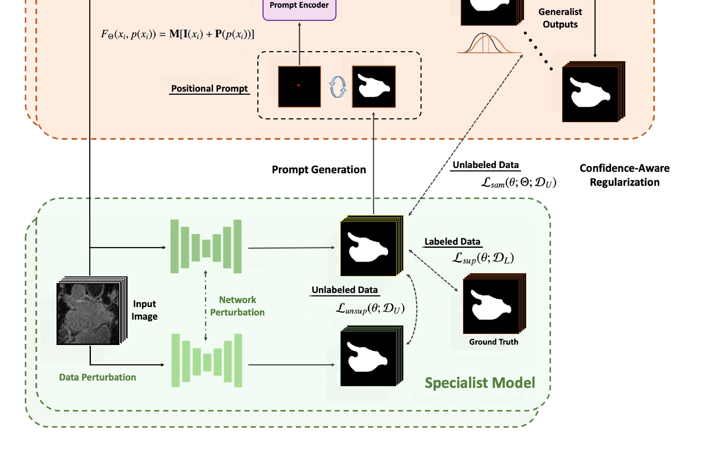

**Abstract**  
Deep learning-based medical image segmentation typically requires large amount of labeled data for training, making it less applicable in clinical settings due to high annotation cost. Semi-supervised learning (SSL) has emerged as an appealing strategy due to its less dependence on acquiring abundant annotations from experts compared to fully supervised methods. Beyond existing model-centric advancements of SSL by designing novel regularization strategies, we anticipate a paradigmatic shift due to the emergence of promptable segmentation foundation models with universal segmentation capabilities using positional prompts represented by Segment Anything Model (SAM). In this paper, we present SemiSAM+, a foundation model-driven SSL framework to efficiently learn from limited labeled data for medical image segmentation. SemiSAM+ consists of one or multiple promptable foundation models as generalist models, and a trainable task-specific segmentation model as specialist model. For a given new segmentation task, the training is based on the specialist-generalist collaborative learning procedure, where the trainable specialist model delivers positional prompts to interact with the frozen generalist models to acquire pseudo-labels, and then the generalist model output provides the specialist model with informative and efficient supervision which benefits the automatic segmentation and prompt generation in turn. Extensive experiments on two public datasets and one in-house clinical dataset demonstrate that SemiSAM+ achieves significant performance improvement, especially under extremely limited annotation scenarios, and shows strong efficiency as a plug-and-play strategy that can be easily adapted to different specialist and generalist models.

**Summary**  
TBD

[⬆ Back to Literature Table](#samsslmis)

---

### <a id="sam-medus-a-foundational-model-for-universal-ult-ca729db9">SAM-MedUS: a foundational model for universal ultrasound image segmentation</a>
> **Venue:** Journal of Medical Imaging 2025  
> **Authors:** F. Tian et al.  
> **Keywords:** OtherMIS, SAM
**Links**  
[Viewable Link](https://www.spiedigitallibrary.org/journals/journal-of-medical-imaging/volume-12/issue-02/027001/SAM-MedUS--a-foundational-model-for-universal-ultrasound-image/10.1117/1.JMI.12.2.027001.full) [Original Link](https://www.spiedigitallibrary.org/journals/journal-of-medical-imaging/volume-12/issue-2/027001/SAM-MedUS--a-foundational-model-for-universal-ultrasound-image/10.1117/1.JMI.12.2.027001.short)

  <!-- Add image to imgs/ and uncomment the img tag below. -->
  <!--  -->

**Abstract**  
We collected and collated an ultrasound dataset of multiple different site types to achieve uniform segmentation of ultrasound images. In addition, the use of additional auxiliary branches ConvNext V2 and CM block enhances the ability of the model to extract global information and the use of boundary loss allows the model to exhibit robust performance and excellent generalization ability.

**Summary**  
TBD

[⬆ Back to Literature Table](#samothers)

---

### <a id="vesselsam-leveraging-sam-for-aortic-vessel-segme-61efefd8">VesselSAM: Leveraging SAM for Aortic Vessel Segmentation with LoRA and Atrous Attention</a>
> **Venue:** arXiv.org 2025  
> **Authors:** A. Iltaf et al.  
> **Keywords:** OtherMIS, SAM
**Links**  
[Viewable Link](https://www.semanticscholar.org/paper/38315e5a5cb7bcc1c9dd09d5134e91c4055a4119) [Original Link](https://arxiv.org/pdf/2502.18185) [Code](https://github.com/Adnan-CAS/AtrousLora)

  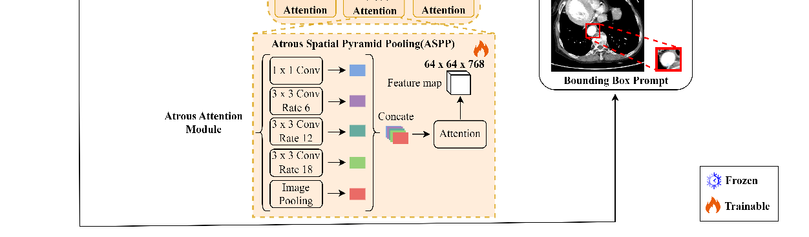

**Abstract**  
Medical image segmentation is crucial for clinical diagnosis and treatment planning, especially when dealing with complex anatomical structures such as vessels. However, accurately segmenting vessels remains challenging due to their small size, intricate edge structures, and susceptibility to artifacts and imaging noise. In this work, we propose VesselSAM, an enhanced version of the Segment Anything Model (SAM), specifically tailored for aortic vessel segmentation. VesselSAM incorporates AtrousLoRA, a novel module integrating Atrous Attention and Low-Rank Adaptation (LoRA), to enhance segmentation performance. Atrous Attention enables the model to capture multi-scale contextual information, preserving both fine-grained local details and broader global context. Additionally, LoRA facilitates efficient fine-tuning of the frozen SAM image encoder, reducing the number of trainable parameters and thereby enhancing computational efficiency. We evaluate VesselSAM using two challenging datasets: the Aortic Vessel Tree (AVT) dataset and the Type-B Aortic Dissection (TBAD) dataset. VesselSAM achieves state-of-the-art performance, attaining DSC scores of 93.50%, 93.25%, 93.02%, and 93.26% across multi-center datasets. Our results demonstrate that VesselSAM delivers high segmentation accuracy while significantly reducing computational overhead compared to existing large-scale models. This development paves the way for enhanced AI-based aortic vessel segmentation in clinical environments. The code and models will be released at https://github.com/Adnan-CAS/AtrousLora.

**Summary**  
TBD

[⬆ Back to Literature Table](#samothers)

---

### <a id="seganypet-universal-promptable-segmentation-from-d9a8e251">SegAnyPET: Universal Promptable Segmentation from Positron Emission Tomography Images</a>
> **Venue:** arXiv.org 2025  
> **Authors:** Y. Zhang et al.  
> **Keywords:** OtherMIS, SAM
**Links**  
[Viewable Link](https://arxiv.org/abs/2502.14351) [Original Link](https://arxiv.org/pdf/2502.14351) [Code](https://github.com/YichiZhang98/SegAnyPET)

  

**Abstract**  
Positron Emission Tomography (PET) is a powerful molecular imaging tool that plays a crucial role in modern medical diagnostics by visualizing radio-tracer distribution to reveal physiological processes. Accurate organ segmentation from PET images is essential for comprehensive multi-systemic analysis of interactions between different organs and pathologies. Existing segmentation methods are limited by insufficient annotation data and varying levels of annotation, resulting in weak generalization ability and difficulty in clinical application. Recent developments in segmentation foundation models have shown superior versatility across diverse segmentation tasks. Despite the efforts of medical adaptations, these works primarily focus on structural medical images with detailed physiological structural information and exhibit limited generalization performance on molecular PET imaging. In this paper, we collect and construct PETS-5k, the largest PET segmentation dataset to date, comprising 5,731 three-dimensional whole-body PET images and encompassing over 1.3M 2D images. Based on the established dataset, we develop SegAnyPET, a modality-specific 3D foundation model for universal promptable segmentation from PET images. To issue the challenge of discrepant annotation quality, we adopt a cross prompting confident learning (CPCL) strategy with an uncertainty-guided self-rectification process to robustly learn segmentation from high-quality labeled data and low-quality noisy labeled data for promptable segmentation. Experimental results demonstrate that SegAnyPET can segment seen and unseen target organs using only one or a few prompt points, outperforming state-of-the-art foundation models and task-specific fully supervised models with higher accuracy and strong generalization ability for universal segmentation.

**Summary**  
TBD

[⬆ Back to Literature Table](#samothers)

---

### <a id="diffusion-empowered-autoprompt-medsam-4b7c91c8">Diffusion-empowered AutoPrompt MedSAM</a>
> **Venue:** arXiv.org 2025  
> **Authors:** P. Huang et al.  
> **Keywords:** OtherMIS, SAM
**Links**  
[Viewable Link](https://arxiv.org/abs/2502.06817) [Original Link](https://arxiv.org/pdf/2502.06817) [Code](https://github.com/HP-ML/AutoPromptMedSAM)

  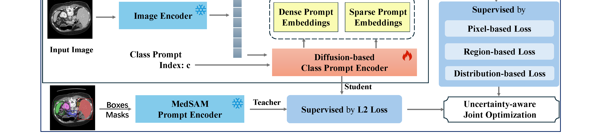

**Abstract**  
MedSAM, a medical foundation model derived from the SAM architecture, has demonstrated notable success across diverse medical domains. However, its clinical application faces two major challenges: the dependency on labor-intensive manual prompt generation, which imposes a significant burden on clinicians, and the absence of semantic labeling in the generated segmentation masks for organs or lesions, limiting its practicality for non-expert users. To address these limitations, we propose AutoMedSAM, an end-to-end framework derived from SAM, designed to enhance usability and segmentation performance. AutoMedSAM retains MedSAM's image encoder and mask decoder structure while introducing a novel diffusion-based class prompt encoder. The diffusion-based encoder employs a dual-decoder structure to collaboratively generate prompt embeddings guided by sparse and dense prompt definitions. These embeddings enhance the model's ability to understand and process clinical imagery autonomously. With this encoder, AutoMedSAM leverages class prompts to embed semantic information into the model's predictions, transforming MedSAM's semi-automated pipeline into a fully automated workflow. Furthermore, AutoMedSAM employs an uncertainty-aware joint optimization strategy during training to effectively inherit MedSAM's pre-trained knowledge while improving generalization by integrating multiple loss functions. Experimental results across diverse datasets demonstrate that AutoMedSAM achieves superior performance while broadening its applicability to both clinical settings and non-expert users. Code is available at https://github.com/HP-ML/AutoPromptMedSAM.git.

**Summary**  
TBD

[⬆ Back to Literature Table](#samothers)

---

### <a id="self-prompt-sam-medical-image-segmentation-via-a-5111f86e">Self-Prompt SAM: Medical Image Segmentation via Automatic Prompt SAM Adaptation</a>
> **Venue:** arXiv.org 2025  
> **Authors:** B. Xie et al.  
> **Keywords:** Zero-ShotMIS, SAM
**Links**  
[Viewable Link](https://arxiv.org/abs/2502.00630) [Original Link](https://arxiv.org/pdf/2502.00630)

  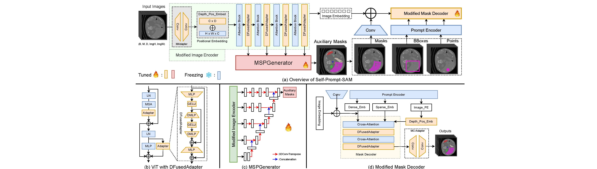

**Abstract**  
Segment Anything Model (SAM) has demonstrated impressive zero-shot performance and brought a range of unexplored capabilities to natural image segmentation tasks. However, as a very important branch of image segmentation, the performance of SAM remains uncertain when applied to medical image segmentation due to the significant differences between natural images and medical images. Meanwhile, it is harsh to meet the SAM's requirements of extra prompts provided, such as points or boxes to specify medical regions. In this paper, we propose a novel self-prompt SAM adaptation framework for medical image segmentation, named Self-Prompt-SAM. We design a multi-scale prompt generator combined with the image encoder in SAM to generate auxiliary masks. Then, we use the auxiliary masks to generate bounding boxes as box prompts and use Distance Transform to select the most central points as point prompts. Meanwhile, we design a 3D depth-fused adapter (DfusedAdapter) and inject the DFusedAdapter into each transformer in the image encoder and mask decoder to enable pre-trained 2D SAM models to extract 3D information and adapt to 3D medical images. Extensive experiments demonstrate that our method achieves state-of-the-art performance and outperforms nnUNet by 2.3% on AMOS2022, 1.6% on ACDCand 0.5% on Synapse datasets.

**Summary**  
TBD

[⬆ Back to Literature Table](#samzsmis)

---

### <a id="protosam-3d-interactive-semantic-segmentation-in-dcf7fbf9">ProtoSAM-3D: Interactive semantic segmentation in volumetric medical imaging via a Segment Anything Model and mask-level prototypes</a>
> **Venue:** Computerized Medical Imaging and Graphics 2025  
> **Authors:** Y. Shen et al.  
> **Keywords:** InteractiveMIS, SAM
**Links**  
[Viewable Link](https://linkinghub.elsevier.com/retrieve/pii/S0895611125000102) [Original Link](https://www.sciencedirect.com/science/article/pii/S0895611125000102)

  <!-- Add image to imgs/ and uncomment the img tag below. -->
  <!--  -->

**Abstract**  
TBD

**Summary**  
TBD

[⬆ Back to Literature Table](#samiwmis)

---

### <a id="self-prompt-sam-medical-image-segmentation-via-a-5111f86e">Self-Prompt SAM: Medical Image Segmentation via Automatic Prompt SAM Adaptation</a>
> **Venue:** arXiv.org 2025  
> **Authors:** B. Xie et al.  
> **Keywords:** Zero-ShotMIS, SAM
**Links**  
[Viewable Link](https://arxiv.org/abs/2502.00630) [Original Link](https://arxiv.org/pdf/2502.00630)

  

**Abstract**  
Segment Anything Model (SAM) has demonstrated impressive zero-shot performance and brought a range of unexplored capabilities to natural image segmentation tasks. However, as a very important branch of image segmentation, the performance of SAM remains uncertain when applied to medical image segmentation due to the significant differences between natural images and medical images. Meanwhile, it is harsh to meet the SAM's requirements of extra prompts provided, such as points or boxes to specify medical regions. In this paper, we propose a novel self-prompt SAM adaptation framework for medical image segmentation, named Self-Prompt-SAM. We design a multi-scale prompt generator combined with the image encoder in SAM to generate auxiliary masks. Then, we use the auxiliary masks to generate bounding boxes as box prompts and use Distance Transform to select the most central points as point prompts. Meanwhile, we design a 3D depth-fused adapter (DfusedAdapter) and inject the DFusedAdapter into each transformer in the image encoder and mask decoder to enable pre-trained 2D SAM models to extract 3D information and adapt to 3D medical images. Extensive experiments demonstrate that our method achieves state-of-the-art performance and outperforms nnUNet by 2.3% on AMOS2022, 1.6% on ACDCand 0.5% on Synapse datasets.

**Summary**  
TBD

[⬆ Back to Literature Table](#samzsmis)

---

### <a id="few-shot-adaptation-of-training-free-foundation-8b31dd67">Few-Shot Adaptation of Training-Free Foundation Model for 3D Medical Image Segmentation</a>
> **Venue:** arXiv.org 2025  
> **Authors:** X. He et al.  
> **Keywords:** Zero-ShotMIS, SAM
**Links**  
[Viewable Link](https://arxiv.org/abs/2501.09138) [Original Link](https://arxiv.org/pdf/2501.09138)

  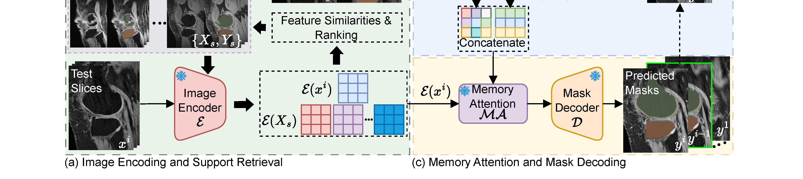

**Abstract**  
Vision foundation models have achieved remarkable progress across various image analysis tasks. In the image segmentation task, foundation models like the Segment Anything Model (SAM) enable generalizable zero-shot segmentation through user-provided prompts. However, SAM primarily trained on natural images, lacks the domain-specific expertise of medical imaging. This limitation poses challenges when applying SAM to medical image segmentation, including the need for extensive fine-tuning on specialized medical datasets and a dependency on manual prompts, which are both labor-intensive and require intervention from medical experts. This work introduces the Few-shot Adaptation of Training-frEe SAM (FATE-SAM), a novel method designed to adapt the advanced Segment Anything Model 2 (SAM2) for 3D medical image segmentation. FATE-SAM reassembles pre-trained modules of SAM2 to enable few-shot adaptation, leveraging a small number of support examples to capture anatomical knowledge and perform prompt-free segmentation, without requiring model fine-tuning. To handle the volumetric nature of medical images, we incorporate a Volumetric Consistency mechanism that enhances spatial coherence across 3D slices. We evaluate FATE-SAM on multiple medical imaging datasets and compare it with supervised learning methods, zero-shot SAM approaches, and fine-tuned medical SAM methods. Results show that FATE-SAM delivers robust and accurate segmentation while eliminating the need for large annotated datasets and expert intervention. FATE-SAM provides a practical, efficient solution for medical image segmentation, making it more accessible for clinical applications.

**Summary**  
TBD

[⬆ Back to Literature Table](#samzsmis)

---

### <a id="tongue-litesam-a-lightweight-model-for-tongue-im-fd220758">Tongue-LiteSAM: A Lightweight Model for Tongue Image Segmentation With Zero-Shot</a>
> **Venue:** IEEE Access 2025  
> **Authors:** D. Tan et al.  
> **Keywords:** Zero-ShotMIS, SAM
**Links**  
[Viewable Link](https://ieeexplore.ieee.org/document/10838509/) [Original Link](https://ieeexplore.ieee.org/stamp/stamp.jsp?arnumber=10838509)

  <!-- Add image to imgs/ and uncomment the img tag below. -->
  <!--  -->

**Abstract**  
Objective: Tongue image segmentation is a crucial step in the intelligent recognition of tongue diagnosis in Traditional Chinese Medicine (TCM). Existing deep learning-based tongue image segmentation models face issues such as poor versatility and insufficient expressiveness in zero-shot tasks. This study aims to construct an efficient model with zero-shot suitable for tongue image segmentation in TCM. Methods: We developed the Tongue-LiteSAM model by improving the SAM (Segment Anything Model) framework to suit tongue segmentation. Based on the basic SAM model, the improvement involved modifying the image encoder by integrating two lightweight ViT-Tiny image encoders, effectively reducing the model’s parameter count. Additionally, data perturbation techniques were employed to enhance the zero-shot segmentation capability of the model and ensure robust performance across different data sources. Results: Experiments conducted on six distinct tongue image datasets demonstrated that the Tongue-LiteSAM model outperformed traditional convolutional neural network-based models and transformers, the original SAM model, and other related improved models in tongue image segmentation tasks. Conclusion: The Tongue-LiteSAM model provides a more objective and consistent solution for tongue diagnosis, and has better zero-shot segmentation capabilities. By optimizing the model structure and data processing strategies, the accuracy and practicality of tongue diagnosis models are effectively improved, offering new technical support for the modernization and precision of TCM tongue diagnosis.

**Summary**  
TBD

[⬆ Back to Literature Table](#samzsmis)

---

### <a id="pgp-sam-prototype-guided-prompt-learning-for-eff-984ec24c">PGP-SAM: Prototype-Guided Prompt Learning for Efficient Few-Shot Medical Image Segmentation</a>
> **Venue:** 2025 IEEE 22nd International Symposium on Biomedical Imaging (ISBI)  
> **Authors:** Z. Yan et al.  
> **Keywords:** Few-ShotMIS, SAM
**Links**  
[Viewable Link](https://ieeexplore.ieee.org/document/10980911/) [Original Link](https://arxiv.org/pdf/2501.06692)

  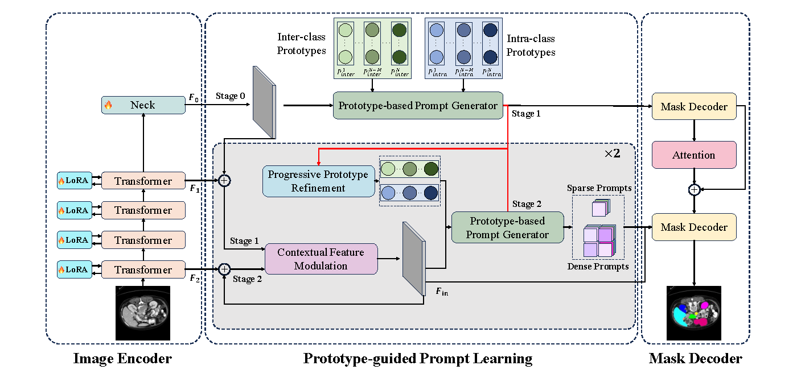

**Abstract**  
The Segment Anything Model (SAM) has demonstrated strong and versatile segmentation capabilities, along with intuitive prompt-based interactions. However, customizing SAM for medical image segmentation requires massive amounts of pixel-level annotations and precise point- or box-based prompt designs. To address these challenges, we introduce PGP-SAM, a novel prototype-based few-shot tuning approach that uses limited samples to replace tedious manual prompts. Our key idea is to leverage inter- and intra-class prototypes to capture class-specific knowledge and relationships. We propose two main components: (1) a plug-and-play contextual modulation module that integrates multi-scale information, and (2) a class-guided cross-attention mechanism that fuses prototypes and features for automatic prompt generation. Experiments on a public multi-organ dataset and a private ventricle dataset demonstrate that PGP-SAM achieves superior mean Dice scores compared with existing prompt-free SAM variants, while using only 10% of the 2D slices.

**Summary**  
TBD

[⬆ Back to Literature Table](#samfsmis)

---

### <a id="spa-leveraging-the-sam-with-spatial-priors-adapt-6013f4a0">SPA: Leveraging the SAM With Spatial Priors Adapter for Enhanced Medical Image Segmentation</a>
> **Venue:** IEEE Journal of Biomedical and Health Informatics 2026  
> **Authors:** J. Hu et al.  
> **Keywords:** InteractiveMIS, SAM
**Links**  
[Viewable Link](https://ieeexplore.ieee.org/document/10829779/) [Original Link](https://ieeexplore.ieee.org/document/10829779)

  <!-- Add image to imgs/ and uncomment the img tag below. -->
  <!--  -->

**Abstract**  
The Segment Anything Model (SAM) has gained renown for its success in image segmentation, benefiting significantly from its pretraining on extensive datasets and its interactive prompt-based segmentation approach. Although highly effective in natural (real-world) image segmentation tasks, the SAM model encounters significant challenges in medical imaging due to the inherent differences between these two domains. To address these challenges, we propose the Spatial Prior Adapter (SPA) scheme, a parameter-efficient fine-tuning strategy that enhances SAM's adaptability to medical imaging tasks. SPA introduces two novel modules: the Spatial Prior Module (SPM), which captures localized spatial features through convolutional layers, and the Feature Communication Module (FCM), which integrates these features into SAM's image encoder via cross-attention mechanisms. Furthermore, we develop a Multiscale Feature Fusion Module (MSFFM) to enhance SAM's end-to-end segmentation capabilities by effectively aggregating multiscale contextual information. These lightweight modules require minimal computational resources while significantly boosting segmentation performance. Our approach demonstrates superior performance in both prompt-based and end-to-end segmentation scenarios through extensive experiments on publicly available medical imaging datasets. Performance highlights the potential of the proposed method to bridge the gap between foundation models and domain-specific medical imaging tasks. This advancement paves the way for more effective AI-assisted medical diagnostic systems.

**Summary**  
TBD

[⬆ Back to Literature Table](#samiwmis)

---

### <a id="semisam-enhancing-semi-supervised-medical-image-7f39521f">SemiSAM: Enhancing Semi-Supervised Medical Image Segmentation via SAM-Assisted Consistency Regularization</a>
> **Venue:** arXiv.org 2023  
> **Authors:** Y. Zhang et al.  
> **Keywords:** SSLMIS, SAM
**Links**  
[Viewable Link](https://arxiv.org/abs/2312.06316) [Original Link](https://ieeexplore.ieee.org/abstract/document/10821951) [Code](https://github.com/YichiZhang98/SemiSAM)

  

**Abstract**  
Semi-supervised learning has attracted much attention due to its less dependence on acquiring abundant annotations from experts compared to fully supervised methods, which is especially important for medical image segmentation which typically requires intensive pixel/voxel-wise labeling by domain experts. Although semi-supervised methods can improve the performance by utilizing unlabeled data, there are still gaps between fully supervised methods under extremely limited annotation scenarios. In this paper, we propose a simple yet efficient strategy to explore the usage of the Segment Anything Model (SAM) for enhancing semi-supervised medical image segmentation. Concretely, the segmentation model trained with domain knowledge provides information for localization and generating input prompts to the SAM. Then the generated pseudo-labels of SAM are utilized as additional supervision to assist in the learning procedure of the semi-supervised framework. Extensive experiments demonstrate that SemiSAM significantly improves the performance of existing semi-supervised frameworks when only one or a few labeled images are available and shows strong efficiency as a plug-and-play strategy for semi-supervised medical image segmentation.

**Summary**  
TBD

[⬆ Back to Literature Table](#samsslmis)

---

### <a id="ma-sam-a-multi-atlas-guided-sam-using-pseudo-mas-04ced7b1">MA-SAM: A Multi-Atlas Guided SAM Using Pseudo Mask Prompts Without Manual Annotation for Spine Image Segmentation</a>
> **Venue:** IEEE Transactions on Medical Imaging 2025  
> **Authors:** D. Fan et al.  
> **Keywords:** OtherMIS, SAM
**Links**  
[Viewable Link](https://ieeexplore.ieee.org/document/10819446/) [Original Link](https://ieeexplore.ieee.org/document/10819446) [Code](https://github.com/findingway221/ma-sam)

  <!-- Add image to imgs/ and uncomment the img tag below. -->
  <!--  -->

**Abstract**  
Accurate spine segmentation is crucial in clinical diagnosis and treatment of spine diseases. However, due to the complexity of spine anatomical structure, it has remained a challenging task to accurately segment spine images. Recently, the segment anything model (SAM) has achieved superior performance for image segmentation. However, generating high-quality points and boxes is still laborious for high-dimensional medical images. Meanwhile, an accurate mask is difficult to obtain. To address these issues, in this paper, we propose a multi-atlas guided SAM using multiple pseudo mask prompts for spine image segmentation, called MA-SAM. Specifically, we first design a multi-atlas prompt generation sub-network to obtain the anatomical structure prompts. More specifically, we use a network to obtain coarse mask of the input image. Then atlas label maps are registered to the coarse mask. Subsequently, a SAM-based segmentation sub-network is used to segment images. Specifically, we first utilize adapters to fine-tune the image encoder. Meanwhile, we use a prompt encoder to learn the anatomical structure prior knowledge from the multi-atlas prompts. Finally, a mask decoder is used to fuse the image and prompt features to obtain the segmentation results. Moreover, to boost the segmentation performance, different scale features from the prompt encoder are concatenated to the Upsample Block in the mask decoder. We validate our MA-SAM on the two spine segmentation tasks, including spine anatomical structure segmentation with CT images and lumbosacral plexus segmentation with MR images. Experiment results suggest that our method achieves better segmentation performance than SAM with points, boxes, and mask prompts.

**Summary**  
TBD

[⬆ Back to Literature Table](#samothers)

---

### <a id="trans-sam-transfer-segment-anything-model-to-med-8e23b0cc">Trans-SAM: Transfer Segment Anything Model to medical image segmentation with Parameter-Efficient Fine-Tuning</a>
> **Venue:** Knowledge-Based Systems 2025  
> **Authors:** Y. Wu et al.  
> **Keywords:** OtherMIS, SAM
**Links**  
[Viewable Link](https://linkinghub.elsevier.com/retrieve/pii/S0950705124015430) [Original Link](https://www.sciencedirect.com/science/article/pii/S0950705124015430) [Code](https://github.com/wuyanlin-wyl/Trans-SAM)

  <!-- Add image to imgs/ and uncomment the img tag below. -->
  <!--  -->

**Abstract**  
TBD

**Summary**  
TBD

[⬆ Back to Literature Table](#samothers)

---

### <a id="meat-sam-more-efficient-automated-tongue-segment-7735959a">MEAT-SAM: More Efficient Automated Tongue Segmentation Model</a>
> **Venue:** IEEE Access 2025  
> **Authors:** F. Zhong et al.  
> **Keywords:** OtherMIS, SAM
**Links**  
[Viewable Link](https://ieeexplore.ieee.org/document/10816397/) [Original Link](https://ieeexplore.ieee.org/abstract/document/10816397)

  <!-- Add image to imgs/ and uncomment the img tag below. -->
  <!--  -->

**Abstract**  
In Traditional Chinese Medicine (TCM) diagnostics, the appearance of the tongue is a crucial indicator of health. TCM practitioners traditionally assess the tongue’s shape, color, texture, and other features to aid diagnosis. With advancements in technology, digitizing and analyzing tongue images using computer has become possible, making tongue image segmentation an important step in realizing automated tongue diagnosis. While existing network models have shown good results, they often struggle with tongue images against complex backgrounds, particularly on resource-limited edge devices. To tackle this challenge, this paper introduces a novel, more efficient automated tongue image segmentation model (MEAT-SAM). MEAT-SAM leverages a lightweight large model, a first in the field of tongue image segmentation. Compared to previous models, MEAT-SAM reduces the overall model parameters, improves segmentation speed, and enables operation on more resource-constrained edge devices. Despite its efficiency, MEAT-SAM maintains performance close to the state-of-the-art (SOTA) even with complex tongue image backgrounds. Tested on three different datasets (TongueDataset01, TongueDataset02, TongueDataset03), MEAT-SAM achieved IoU of 96.63%, 95.58%, and 95.07%, demonstrating excellent generalization and robustness against various complex background conditions in tongue images. Furthermore, MEAT-SAM can run effectively on the computationally limited Jetson Nano single-board computer, achieving similar segmentation effects as in experimental testing.

**Summary**  
TBD

[⬆ Back to Literature Table](#samothers)

---

### <a id="multiverseg-scalable-interactive-segmentation-of-ea468651">MultiverSeg: Scalable Interactive Segmentation of Biomedical Imaging Datasets with In-Context Guidance</a>
> **Venue:** arXiv.org 2024  
> **Authors:** HE. Wong et al.  
> **Keywords:** InteractiveMIS, SAM
**Links**  
[Viewable Link](https://arxiv.org/abs/2412.15058) [Original Link](https://arxiv.org/pdf/2412.15058) [Code](https://multiverseg.csail.mit.edu/)

  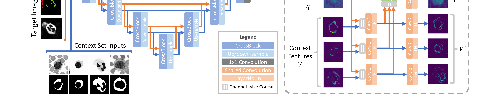

**Abstract**  
Medical researchers and clinicians often need to perform novel segmentation tasks on a set of related images. Existing methods for segmenting a new dataset are either interactive, requiring substantial human effort for each image, or require an existing set of previously labeled images. We introduce a system, MultiverSeg, that enables practitioners to rapidly segment an entire new dataset without requiring access to any existing labeled data from that task or domain. Along with the image to segment, the model takes user interactions such as clicks, bounding boxes or scribbles as input, and predicts a segmentation. As the user segments more images, those images and segmentations become additional inputs to the model, providing context. As the context set of labeled images grows, the number of interactions required to segment each new image decreases. We demonstrate that MultiverSeg enables users to interactively segment new datasets efficiently, by amortizing the number of interactions per image to achieve an accurate segmentation. Compared to using a state-of-the-art interactive segmentation method, MultiverSeg reduced the total number of clicks by 36% and scribble steps by 25% to achieve 90% Dice on sets of images from unseen tasks. We release code and model weights at https://multiverseg.csail.mit.edu

**Summary**  
TBD

[⬆ Back to Literature Table](#samiwmis)

---

### <a id="memorizing-sam-3d-medical-segment-anything-model-7bc64c5e">Memorizing SAM: 3D Medical Segment Anything Model with Memorizing Transformer</a>
> **Venue:** Medical Imaging 2025: Image Processing  
> **Authors:** X. Shao et al.  
> **Keywords:** Zero-ShotMIS, SAM
**Links**  
[Viewable Link](https://www.spiedigitallibrary.org/conference-proceedings-of-spie/13406/3047046/Memorizing-SAM--3D-medical-Segment-Anything-Model-with-memorizing/10.1117/12.3047046.full) [Original Link](https://arxiv.org/pdf/2412.13908) [Code](https://github.com/swedfr/memorizingSAM)

  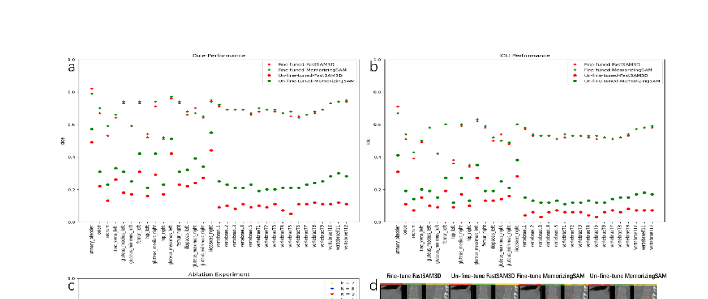

**Abstract**  
Segment Anything Models (SAMs) have gained increasing attention in medical image analysis due to their zero-shot generalization capability in segmenting objects of unseen classes and domains when provided with appropriate user prompts. Addressing this performance gap is important to fully leverage the pre-trained weights of SAMs, particularly in the domain of volumetric medical image segmentation, where accuracy is important but well-annotated 3D medical data for fine-tuning is limited. In this work, we investigate whether introducing the memory mechanism as a plug-in, specifically the ability to memorize and recall internal representations of past inputs, can improve the performance of SAM with limited computation cost. To this end, we propose Memorizing SAM, a novel 3D SAM architecture incorporating a memory Transformer as a plug-in. Unlike conventional memorizing Transformers that save the internal representation during training or inference, our Memorizing SAM utilizes existing highly accurate internal representation as the memory source to ensure the quality of memory. We evaluate the performance of Memorizing SAM in 33 categories from the TotalSegmentator dataset, which indicates that Memorizing SAM can outperform state-of-the-art 3D SAM variant i.e., FastSAM3D with an average Dice increase of 11.36% at the cost of only 4.38 millisecond increase in inference time. The source code is publicly available at https://github.com/swedfr/memorizingSAM

**Summary**  
TBD

[⬆ Back to Literature Table](#samzsmis)

---

### <a id="seg-sam-semantic-guided-sam-for-unified-medical-3976b888">SEG-SAM: Semantic-Guided SAM for Unified Medical Image Segmentation</a>
> **Venue:** arXiv.org 2024  
> **Authors:** S. Huang et al.  
> **Keywords:** OtherMIS, SAM
**Links**  
[Viewable Link](https://arxiv.org/abs/2412.12660) [Original Link](https://arxiv.org/pdf/2412.12660)

  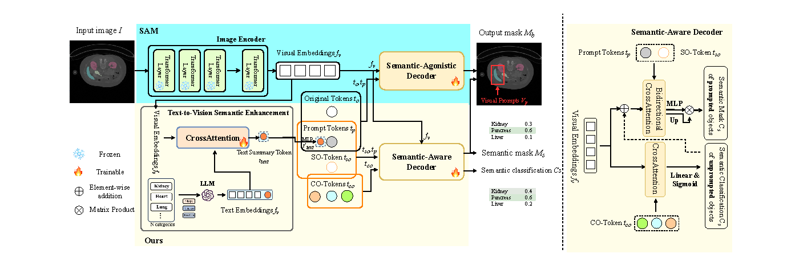

**Abstract**  
Recently, developing unified medical image segmentation models gains increasing attention, especially with the advent of the Segment Anything Model (SAM). SAM has shown promising binary segmentation performance in natural domains, however, transferring it to the medical domain remains challenging, as medical images often possess substantial inter-category overlaps. To address this, we propose the SEmantic-Guided SAM (SEG-SAM), a unified medical segmentation model that incorporates semantic medical knowledge to enhance medical segmentation performance. First, to avoid the potential conflict between binary and semantic predictions, we introduce a semantic-aware decoder independent of SAM's original decoder, specialized for both semantic segmentation on the prompted object and classification on unprompted objects in images. To further enhance the model's semantic understanding, we solicit key characteristics of medical categories from large language models and incorporate them into SEG-SAM through a text-to-vision semantic module, adaptively transferring the language information into the visual segmentation task. In the end, we introduce the cross-mask spatial alignment strategy to encourage greater overlap between the predicted masks from SEG-SAM's two decoders, thereby benefiting both predictions. Extensive experiments demonstrate that SEG-SAM outperforms state-of-the-art SAM-based methods in unified binary medical segmentation and task-specific methods in semantic medical segmentation, showcasing promising results and potential for broader medical applications.

**Summary**  
TBD

[⬆ Back to Literature Table](#samothers)

---

### <a id="annotation-efficient-task-guidance-for-medical-s-4fb4f47d">Annotation-Efficient Task Guidance for Medical Segment Anything</a>
> **Venue:** arXiv.org 2024  
> **Authors:** T. Ward et al.  
> **Keywords:** SSLMIS, SAM
**Links**  
[Viewable Link](https://arxiv.org/abs/2412.08575) [Original Link](https://arxiv.org/pdf/2412.08575) [Code](https://github.com/tbwa233/SAM-Mix)

  

**Abstract**  
Medical image segmentation is a key task in the imaging workflow, influencing many image-based decisions. Traditional, fully-supervised segmentation models rely on large amounts of labeled training data, typically obtained through manual annotation, which can be an expensive, time-consuming, and error-prone process. This signals a need for accurate, automatic, and annotation-efficient methods of training these models. We propose SAM-Mix, a novel multitask learning framework for medical image segmentation that uses class activation maps produced by an auxiliary classifier to guide the predictions of the semi-supervised segmentation branch, which is based on the SAM framework. Experimental evaluations on the public LiTS dataset confirm the effectiveness of SAM-Mix for simultaneous classification and segmentation of the liver from abdominal computed tomography (CT) scans. When trained for 90% fewer epochs on only 50 labeled 2D slices, representing just 0.04% of the available labeled training data, SAM-Mix achieves a Dice improvement of 5.1% over the best baseline model. The generalization results for SAM-Mix are even more impressive, with the same model configuration yielding a 25.4% Dice improvement on a cross-domain segmentation task. Our code is available at https://github.com/tbwa233/SAM-Mix.

**Summary**  
TBD

[⬆ Back to Literature Table](#samsslmis)

---

### <a id="med-fastsam-improving-transfer-efficiency-of-sam-55b255cc">Med-FastSAM: Improving Transfer Efficiency of SAM to Domain-Generalised Medical Image Segmentation</a>
> **Venue:** 2024  
> **Authors:** Y. Luo et al.  
> **Keywords:** OtherMIS, SAM
**Links**  
[Viewable Link](https://arxiv.org/pdf/2412.08575) [Code](https://github.com/GalacticHogrider/Med-FastSAM)

  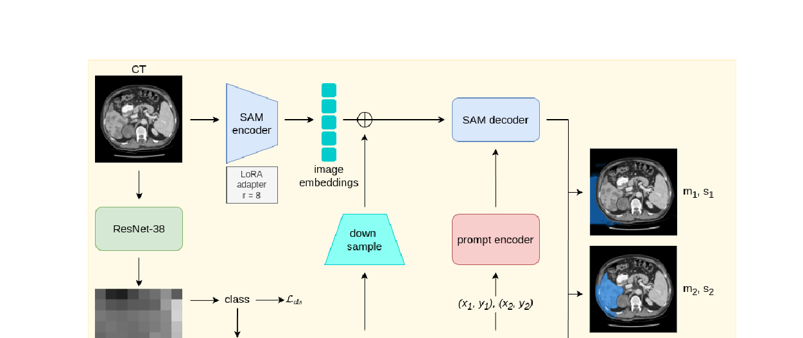

**Abstract**  
TBD

**Summary**  
TBD

[⬆ Back to Literature Table](#samothers)

---

### <a id="refsam3d-adapting-sam-with-cross-modal-reference-76cfbf8f">RefSAM3D: Adapting SAM with Cross-modal Reference for 3D Medical Image Segmentation</a>
> **Venue:** arXiv.org 2024  
> **Authors:** X. Gao et al.  
> **Keywords:** OtherMIS, SAM
**Links**  
[Viewable Link](https://arxiv.org/abs/2412.05605) [Original Link](https://arxiv.org/pdf/2412.05605)

  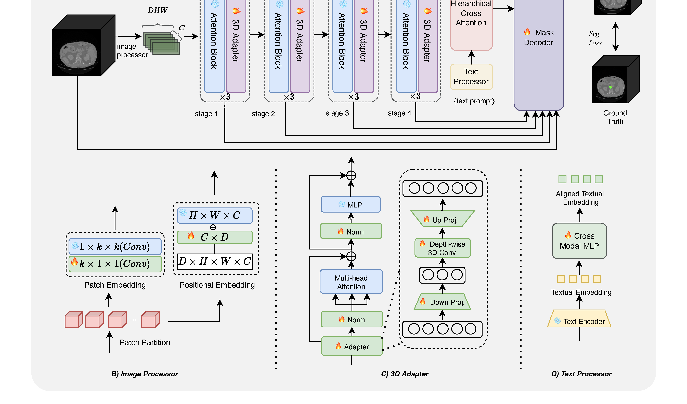

**Abstract**  
The Segment Anything Model (SAM), originally built on a 2D Vision Transformer (ViT), excels at capturing global patterns in 2D natural images but struggles with 3D medical imaging modalities like CT and MRI. These modalities require capturing spatial information in volumetric space for tasks such as organ segmentation and tumor quantification. To address this challenge, we introduce RefSAM3D, which adapts SAM for 3D medical imaging by incorporating a 3D image adapter and cross-modal reference prompt generation. Our approach modifies the visual encoder to handle 3D inputs and enhances the mask decoder for direct 3D mask generation. We also integrate textual prompts to improve segmentation accuracy and consistency in complex anatomical scenarios. By employing a hierarchical attention mechanism, our model effectively captures and integrates information across different scales. Extensive evaluations on multiple medical imaging datasets demonstrate the superior performance of RefSAM3D over state-of-the-art methods. Our contributions advance the application of SAM in accurately segmenting complex anatomical structures in medical imaging.

**Summary**  
TBD

[⬆ Back to Literature Table](#samothers)

---

### <a id="biasam-bidirectional-attention-guided-segment-an-3d361a06">BiASAM: Bidirectional-Attention Guided Segment Anything Model for Very Few-Shot Medical Image Segmentation</a>
> **Venue:** IEEE Signal Processing Letters 2025  
> **Authors:** Y. Luo et al.  
> **Keywords:** Few-ShotMIS, SAM
**Links**  
[Viewable Link](https://ieeexplore.ieee.org/document/10787063/) [Original Link](https://ieeexplore.ieee.org/abstract/document/10787063) [Code](https://github.com/ggllllll/BiASAM-.git)

  <!-- Add image to imgs/ and uncomment the img tag below. -->
  <!--  -->

**Abstract**  
The Segment Anything Model (SAM) excels in general segmentation but encounters difficulties in medical imaging due to few-shot learning challenges, particularly with extremely limited annotated data. Existing approaches often suffer from insufficient feature extraction and inadequate loss function balancing, resulting in decreased accuracy and poor generalization. To address these issues, we propose BiASAM, which uniquely incorporates two bidirectional attention mechanisms into SAM for medical image segmentation. Firstly, BiASAM integrates a spatial-frequency attention module to improve feature extraction, enhancing the model's ability to capture both fine and coarse details. Secondly, we employ an attention-based gradient update mechanism that dynamically adjusts loss weights, boosting the model's learning efficiency and adaptability in data-scarce scenarios. Additionally, BiASAM utilizes the point and box fusion prompt to enhance segmentation precision at both global and local levels. Experiments across various medical datasets show BiASAM achieves performance comparable to fully supervised methods with just two labeled samples.

**Summary**  
TBD

[⬆ Back to Literature Table](#samfsmis)

---

### <a id="echoone-segmenting-multiple-echocardiography-pla-1e7de2bd">EchoONE: Segmenting Multiple echocardiography Planes in One Model</a>
> **Venue:** 2025 IEEE/CVF Conference on Computer Vision and Pattern Recognition (CVPR)  
> **Authors:** J. Hu et al.  
> **Keywords:** OtherMIS, SAM
**Links**  
[Viewable Link](https://ieeexplore.ieee.org/document/11092827/) [Original Link](https://arxiv.org/pdf/2412.02993) [Code](https://github.com/a2502503/EchoONE)

  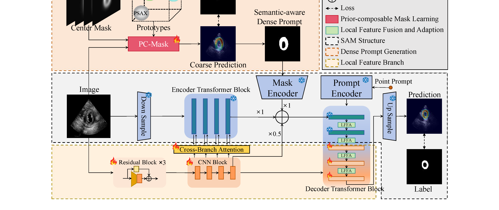

**Abstract**  
In clinical practice of echocardiography examinations, multiple planes containing the heart structures of different view are usually required in screening, diagnosis and treatment of cardiac disease. AI models for echocardiography have to be tailored for each specific plane due to the dramatic structure differences, thus resulting in repetition development and extra complexity. Effective solution for such a multi-plane segmentation (MPS) problem is highly demanded for medical images, yet has not been well investigated. In this paper, we propose a novel solution, EchoONE, for this problem with a SAM-based segmentation architecture, a prior-composable mask learning (PC-Mask) module for semantic-aware dense prompt generation, and a learnable CNN-branch with a simple yet effective local feature fusion and adaption (LFFA) module for SAM adapting. We extensively evaluated our method on multiple internal and external echocardiography datasets, and achieved consistently state-of-the-art performance for multi-source datasets with different heart planes. This is the first time that the MPS problem is solved in one model for echocardiography data. The code will be available at https://github.com/a2502503/EchoONE.

**Summary**  
TBD

[⬆ Back to Literature Table](#samothers)

---

### <a id="vesselfm-a-foundation-model-for-universal-3d-blo-212b1244">vesselFM: A Foundation Model for Universal 3D Blood Vessel Segmentation</a>
> **Venue:** 2025 IEEE/CVF Conference on Computer Vision and Pattern Recognition (CVPR)  
> **Authors:** B. Wittmann et al.  
> **Keywords:** SSLMIS, SAM
**Links**  
[Viewable Link](https://ieeexplore.ieee.org/document/11092528/) [Original Link](https://arxiv.org/pdf/2411.17386) [Code](https://github.com/bwittmann/vesselFM)

  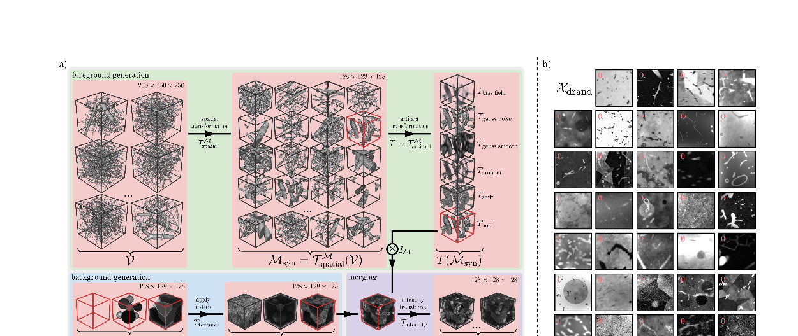

**Abstract**  
Segmenting 3D blood vessels is a critical yet challenging task in medical image analysis. This is due to significant imaging modality-specific variations in artifacts, vascular patterns and scales, signal-to-noise ratios, and background tissues. These variations, along with domain gaps arising from varying imaging protocols, limit the generalization of existing supervised learning-based methods, requiring tedious voxel-level annotations for each dataset separately. While foundation models promise to alleviate this limitation, they typically fail to generalize to the task of blood vessel segmentation, posing a unique, complex problem. In this work, we present vesselFM, a foundation model designed specifically for the broad task of 3D blood vessel segmentation. Unlike previous models, vesselFM can effortlessly generalize to unseen domains. To achieve zero-shot generalization, we train vesselFM on three heterogeneous data sources: a large, curated annotated dataset, data generated by a domain randomization scheme, and data sampled from a flow matching-based generative model. Extensive evaluations show that vesselFM outperforms state-of-the-art medical image segmentation foundation models across four (pre-)clinically relevant imaging modalities in zero-, one-, and few-shot scenarios, therefore providing a universal solution for 3D blood vessel segmentation.

**Summary**  
TBD

[⬆ Back to Literature Table](#samsslmis)

---

### <a id="sam-mpa-applying-sam-to-few-shot-medical-image-s-0449c357">SAM-MPA: Applying SAM to Few-shot Medical Image Segmentation using Mask Propagation and Auto-prompting</a>
> **Venue:** arXiv.org 2024  
> **Authors:** J. Xu et al.  
> **Keywords:** Few-ShotMIS, SAM
**Links**  
[Viewable Link](https://arxiv.org/abs/2411.17363) [Original Link](https://arxiv.org/pdf/2411.17363)

  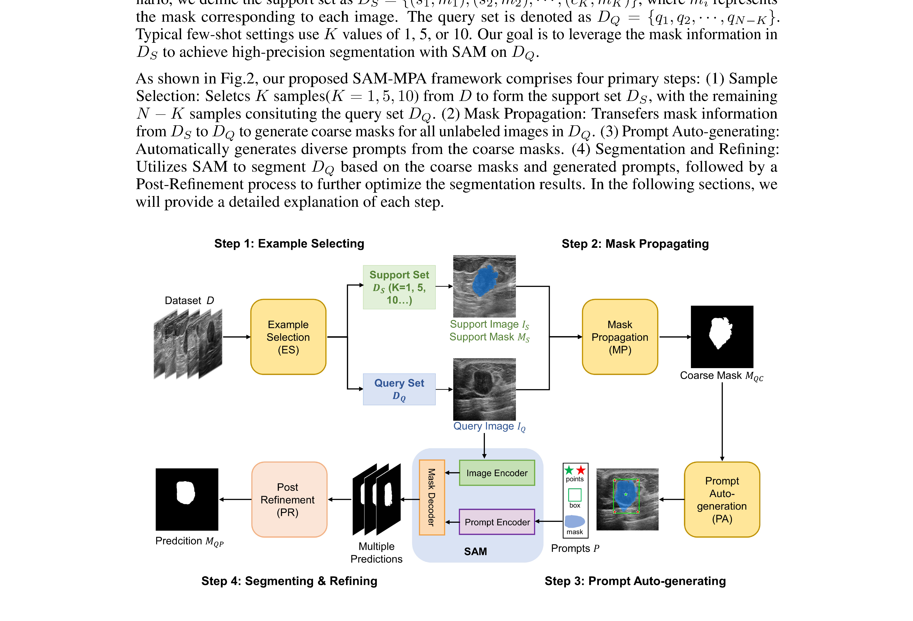

**Abstract**  
Medical image segmentation often faces the challenge of prohibitively expensive annotation costs. While few-shot learning offers a promising solution to alleviate this burden, conventional approaches still rely heavily on pre-training with large volumes of labeled data from known categories. To address this issue, we propose leveraging the Segment Anything Model (SAM), pre-trained on over 1 billion masks, thus circumventing the need for extensive domain-specific annotated data. In light of this, we developed SAM-MPA, an innovative SAM-based framework for few-shot medical image segmentation using Mask Propagation-based Auto-prompting. Initially, we employ k-centroid clustering to select the most representative examples for labelling to construct the support set. These annotated examples are registered to other images yielding deformation fields that facilitate the propagation of the mask knowledge to obtain coarse masks across the dataset. Subsequently, we automatically generate visual prompts based on the region and boundary expansion of the coarse mask, including points, box and a coarse mask. Finally, we can obtain the segmentation predictions by inputting these prompts into SAM and refine the results by post refinement module. We validate the performance of the proposed framework through extensive experiments conducted on two medical image datasets with different modalities. Our method achieves Dices of 74.53%, 94.36% on Breast US, Chest X-ray, respectively. Experimental results substantiate that SAM-MPA yields high-accuracy segmentations within 10 labeled examples, outperforming other state-of-the-art few-shot auto-segmentation methods. Our method enables the customization of SAM for any medical image dataset with a small number of labeled examples.

**Summary**  
TBD

[⬆ Back to Literature Table](#samfsmis)

---

### <a id="med-persam-one-shot-visual-prompt-tuning-for-per-13b4c30c">Med-PerSAM: One-Shot Visual Prompt Tuning for Personalized Segment Anything Model in Medical Domain</a>
> **Venue:** arXiv.org 2024  
> **Authors:** H. Yoon et al.  
> **Keywords:** Few-ShotMIS, SAM
**Links**  
[Viewable Link](https://arxiv.org/abs/2411.16123) [Original Link](https://arxiv.org/pdf/2411.16123)

  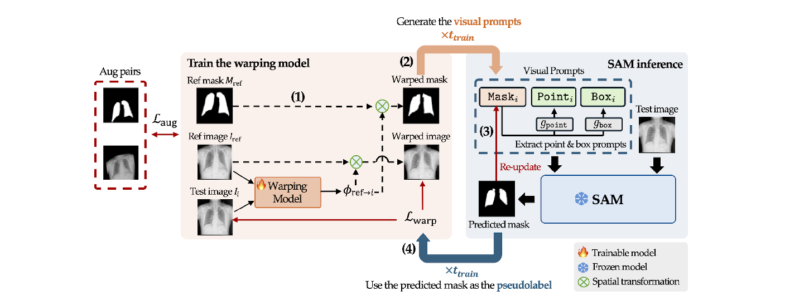

**Abstract**  
Leveraging pre-trained models with tailored prompts for in-context learning has proven highly effective in NLP tasks. Building on this success, recent studies have applied a similar approach to the Segment Anything Model (SAM) within a ``one-shot" framework, where only a single reference image and its label are employed. However, these methods face limitations in the medical domain, primarily due to SAM's essential requirement for visual prompts and the over-reliance on pixel similarity for generating them. This dependency may lead to (1) inaccurate prompt generation and (2) clustering of point prompts, resulting in suboptimal outcomes. To address these challenges, we introduce \textbf{Med-PerSAM}, a novel and straightforward one-shot framework designed for the medical domain. Med-PerSAM uses only visual prompt engineering and eliminates the need for additional training of the pretrained SAM or human intervention, owing to our novel automated prompt generation process. By integrating our lightweight warping-based prompt tuning model with SAM, we enable the extraction and iterative refinement of visual prompts, enhancing the performance of the pre-trained SAM. This advancement is particularly meaningful in the medical domain, where creating visual prompts poses notable challenges for individuals lacking medical expertise. Our model outperforms various foundational models and previous SAM-based approaches across diverse 2D medical imaging datasets.

**Summary**  
TBD

[⬆ Back to Literature Table](#samfsmis)

---

### <a id="a-sam-guided-and-match-based-semi-supervised-seg-e5ff8a3a">A SAM-guided and Match-based Semi-Supervised Segmentation Framework for Medical Imaging</a>
> **Venue:** Medical Physics 2025  
> **Authors:** G. Xu et al.  
> **Keywords:** SSLMIS, SAM
**Links**  
[Viewable Link](https://aapm.onlinelibrary.wiley.com/doi/10.1002/mp.17785) [Original Link](https://arxiv.org/pdf/2411.16949) [Code](https://github.com/apple1986/SAMatch)

  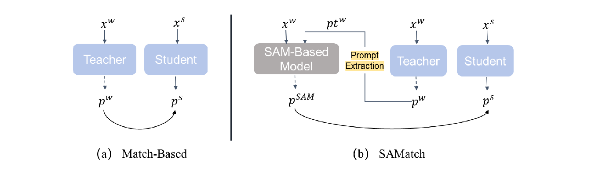

**Abstract**  
This study introduces SAMatch, a SAM-guided Match-based framework for semi-supervised medical image segmentation, aimed at improving pseudo label quality in data-scarce scenarios. While Match-based frameworks are effective, they struggle with low-quality pseudo labels due to the absence of ground truth. SAM, pre-trained on a large dataset, generalizes well across diverse tasks and assists in generating high-confidence prompts, which are then used to refine pseudo labels via fine-tuned SAM. SAMatch is trained end-to-end, allowing for dynamic interaction between the models. Experiments on the ACDC cardiac MRI, BUSI breast ultrasound, and MRLiver datasets show SAMatch achieving state-of-the-art results, with Dice scores of 89.36%, 77.76%, and 80.04%, respectively, using minimal labeled data. SAMatch effectively addresses challenges in semi-supervised segmentation, offering a powerful tool for segmentation in data-limited environments. Code and data are available at https://github.com/apple1986/SAMatch.

**Summary**  
TBD

[⬆ Back to Literature Table](#samsslmis)

---

### <a id="cosam-self-correcting-sam-for-domain-generalizat-f04b0bf4">CoSAM: Self-Correcting SAM for Domain Generalization in 2D Medical Image Segmentation</a>
> **Venue:** arXiv.org 2024  
> **Authors:** Y. Fu et al.  
> **Keywords:** OtherMIS, SAM
**Links**  
[Viewable Link](https://arxiv.org/abs/2411.10136) [Original Link](https://arxiv.org/pdf/2411.10136)

  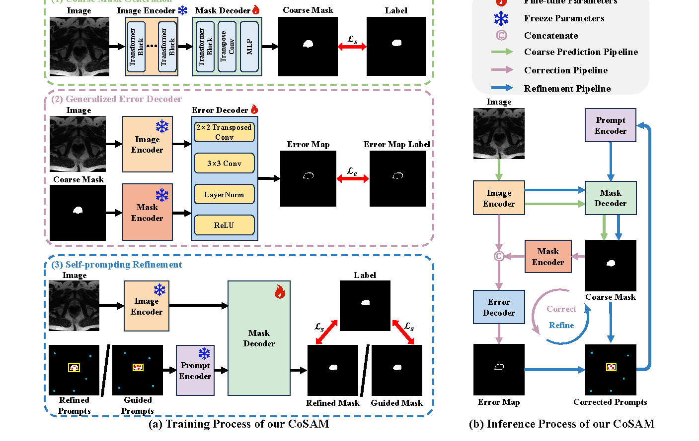

**Abstract**  
Medical images often exhibit distribution shifts due to variations in imaging protocols and scanners across different medical centers. Domain Generalization (DG) methods aim to train models on source domains that can generalize to unseen target domains. Recently, the segment anything model (SAM) has demonstrated strong generalization capabilities due to its prompt-based design, and has gained significant attention in image segmentation tasks. Existing SAM-based approaches attempt to address the need for manual prompts by introducing prompt generators that automatically generate these prompts. However, we argue that auto-generated prompts may not be sufficiently accurate under distribution shifts, potentially leading to incorrect predictions that still require manual verification and correction by clinicians. To address this challenge, we propose a method for 2D medical image segmentation called Self-Correcting SAM (CoSAM). Our approach begins by generating coarse masks using SAM in a prompt-free manner, providing prior prompts for the subsequent stages, and eliminating the need for prompt generators. To automatically refine these coarse masks, we introduce a generalized error decoder that simulates the correction process typically performed by clinicians. Furthermore, we generate diverse prompts as feedback based on the corrected masks, which are used to iteratively refine the predictions within a self-correcting loop, enhancing the generalization performance of our model. Extensive experiments on two medical image segmentation benchmarks across multiple scenarios demonstrate the superiority of CoSAM over state-of-the-art SAM-based methods.

**Summary**  
TBD

[⬆ Back to Literature Table](#samothers)

---

### <a id="sam-i2i-unleash-the-power-of-segment-anything-mo-c6105521">SAM-I2I: Unleash The Power of Segment Anything Model for Medical Image Trnslation</a>
> **Venue:** 2024  
> **Authors:** J. Huo et al.  
> **Keywords:** OtherMIS, SAM
**Links**  
[Viewable Link](https://arxiv.org/pdf/2411.12755)

  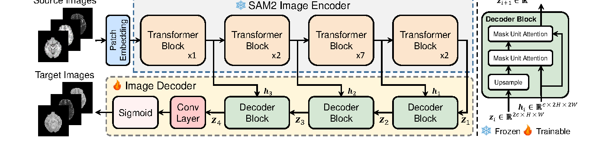

**Abstract**  
TBD

**Summary**  
TBD

[⬆ Back to Literature Table](#samothers)

---

### <a id="sam-carries-the-burden-a-semi-supervised-approac-6ab7c53e">SAM Carries the Burden: A Semi-Supervised Approach Refining Pseudo Labels for Medical Segmentation</a>
> **Venue:** arXiv.org 2024  
> **Authors:** R. Keuth et al.  
> **Keywords:** SSLMIS, SAM
**Links**  
[Viewable Link](https://arxiv.org/abs/2411.12602) [Original Link](https://arxiv.org/pdf/2411.12602) [Code](https://github.com/multimodallearning/SamCarriesTheBurden)

  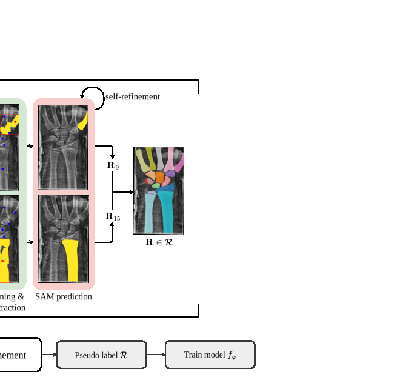

**Abstract**  
Semantic segmentation is a crucial task in medical imaging. Although supervised learning techniques have proven to be effective in performing this task, they heavily depend on large amounts of annotated training data. The recently introduced Segment Anything Model (SAM) enables prompt-based segmentation and offers zero-shot generalization to unfamiliar objects. In our work, we leverage SAM's abstract object understanding for medical image segmentation to provide pseudo labels for semi-supervised learning, thereby mitigating the need for extensive annotated training data. Our approach refines initial segmentations that are derived from a limited amount of annotated data (comprising up to 43 cases) by extracting bounding boxes and seed points as prompts forwarded to SAM. Thus, it enables the generation of dense segmentation masks as pseudo labels for unlabelled data. The results show that training with our pseudo labels yields an improvement in Dice score from $74.29\,\%$ to $84.17\,\%$ and from $66.63\,\%$ to $74.87\,\%$ for the segmentation of bones of the paediatric wrist and teeth in dental radiographs, respectively. As a result, our method outperforms intensity-based post-processing methods, state-of-the-art supervised learning for segmentation (nnU-Net), and the semi-supervised mean teacher approach. Our Code is available on GitHub.

**Summary**  
TBD

[⬆ Back to Literature Table](#samsslmis)

---

### <a id="segment-anything-model-for-few-shot-medical-imag-460aff7f">Segment anything model for few-shot medical image segmentation with domain tuning</a>
> **Venue:** Complex &amp; Intelligent Systems 2025  
> **Authors:** W. Shi et al.  
> **Keywords:** Few-ShotMIS, SAM
**Links**  
[Viewable Link](https://link.springer.com/10.1007/s40747-024-01625-7) [Original Link](https://link.springer.com/article/10.1007/s40747-024-01625-7)

  <!-- Add image to imgs/ and uncomment the img tag below. -->
  <!--  -->

**Abstract**  
Medical image segmentation constitutes a crucial step in the analysis of medical images, possessing extensive applications and research significance within the realm of medical research and practice. Convolutional neural network achieved great success in medical image segmentation. However, acquiring large labeled datasets remains unattainable due to the substantial expertise and time required for image labeling, as well as heightened patient privacy concerns. To solve scarce medical image data, we propose a powerful network Domain Tuning SAM for Medical images (DT-SAM). We construct an encoder utilizing a parameter-effective fine-tuning strategy and SAM. This strategy selectively updates a small fraction of the weight increments while preserving the majority of the pre-training weights in the SAM encoder, consequently reducing the required number of training samples. Meanwhile, our approach leverages only SAM encoder structure while incorporating a decoder similar to U-Net decoder structure and redesigning skip connections to concatenate encoder-extracted features, which effectively decode the features extracted by the encoder and preserve edge information. We have conducted comprehensive experiments on three publicly available medical image segmentation datasets. The combined experimental results show that our method can effectively perform few shot medical image segmentation. With just one labeled data, achieving a Dice score of 63.51%, a HD of 17.94 and an IoU score of 73.55% on Heart Task, on Prostate Task, an average Dice score of 46.01%, a HD of 10.25 and an IoU score of 65.92% were achieved, and the Dice, HD, and IoU score reaching 88.67%, 10.63, and 90.19% on BUSI. Remarkably, with few training samples, our method consistently outperforms various based on SAM and CNN.

**Summary**  
TBD

[⬆ Back to Literature Table](#samfsmis)

---

### <a id="towards-a-general-computed-tomography-image-segm-356e99f9">Towards a general computed tomography image segmentation model for anatomical structures and lesions</a>
> **Venue:** Communications Engineering 2024  
> **Authors:** X. Ouyang et al.  
> **Keywords:** OtherMIS, SAM
**Links**  
[Viewable Link](https://www.nature.com/articles/s44172-024-00287-0)

  <!-- Add image to imgs/ and uncomment the img tag below. -->
  <!--  -->

**Abstract**  
Numerous deep-learning models have been developed using task-specific data, but they ignore the inherent connections among different tasks. By jointly learning a wide range of segmentation tasks, we prove that a general medical image segmentation model can improve segmentation performance for computerized tomography (CT) volumes. The proposed general CT image segmentation (gCIS) model utilizes a common transformer-based encoder for all tasks and incorporates automatic pathway modules for task prompt-based decoding. It is trained on one of the largest datasets, comprising 36,419 CT scans and 83 tasks. gCIS can automatically perform various segmentation tasks using automatic pathway modules of decoding networks through text prompt inputs, achieving an average Dice coefficient of 82.84%. Furthermore, the proposed automatic pathway routing mechanism allows for parameter pruning of the network during deployment, and gCIS can also be quickly adapted to unseen tasks with minimal training samples while maintaining great performance.

**Summary**  
TBD

[⬆ Back to Literature Table](#samothers)

---

### <a id="plug-and-play-segment-anything-model-improves-nn-96725226">Plug‐and‐play segment anything model improves nnUNet performance</a>
> **Venue:** Medical Physics 2025  
> **Authors:** Y. Li et al.  
> **Keywords:** OtherMIS, SAM
**Links**  
[Viewable Link](https://aapm.onlinelibrary.wiley.com/doi/10.1002/mp.17481) [Original Link](https://aapm.onlinelibrary.wiley.com/doi/full/10.1002/mp.17481) [Code](https://github.com/Kent0n-Li/nnSAM)

  <!-- Add image to imgs/ and uncomment the img tag below. -->
  <!--  -->

**Abstract**  
A comprehensive evaluation of multiple small-sample segmentation tasks demonstrates significant improvements in segmentation performance by nnSAM, highlighting the vast potential of small-sample learning.

**Summary**  
TBD

[⬆ Back to Literature Table](#samothers)

---

### <a id="sam-swin-sam-driven-dual-swin-transformers-with-2335ca25">SAM-Swin: SAM-driven dual-swin transformers with adaptive lesion enhancement for Laryngo-Pharyngeal tumor detection</a>
> **Venue:** Medical Image Analysis 2026  
> **Authors:** J. Wei et al.  
> **Keywords:** OtherMIS, SAM
**Links**  
[Viewable Link](https://linkinghub.elsevier.com/retrieve/pii/S1361841525004529) [Original Link](https://arxiv.org/pdf/2410.21813) [Code](https://github.com/VVJia/SAM-Swin)

  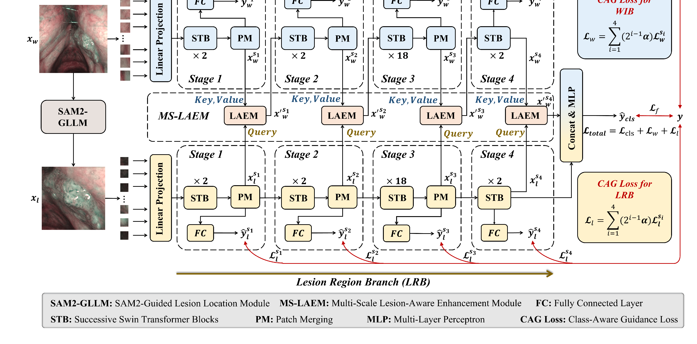

**Abstract**  
Laryngo-pharyngeal cancer (LPC) is a highly lethal malignancy in the head and neck region. Recent advancements in tumor detection, particularly through dual-branch network architectures, have significantly improved diagnostic accuracy by integrating global and local feature extraction. However, challenges remain in accurately localizing lesions and fully capitalizing on the complementary nature of features within these branches. To address these issues, we propose SAM-Swin, an innovative SAM-driven Dual-Swin Transformer for laryngo-pharyngeal tumor detection. This model leverages the robust segmentation capabilities of the Segment Anything Model 2 (SAM2) to achieve precise lesion segmentation. Meanwhile, we present a multi-scale lesion-aware enhancement module (MS-LAEM) designed to adaptively enhance the learning of nuanced complementary features across various scales, improving the quality of feature extraction and representation. Furthermore, we implement a multi-scale class-aware guidance (CAG) loss that delivers multi-scale targeted supervision, thereby enhancing the model's capacity to extract class-specific features. To validate our approach, we compiled three LPC datasets from the First Affiliated Hospital (FAHSYSU), the Sixth Affiliated Hospital (SAHSYSU) of Sun Yat-sen University, and Nanfang Hospital of Southern Medical University (NHSMU). The FAHSYSU dataset is utilized for internal training, while the SAHSYSU and NHSMU datasets serve for external evaluation. Extensive experiments demonstrate that SAM-Swin outperforms state-of-the-art methods, showcasing its potential for advancing LPC detection and improving patient outcomes. The source code of SAM-Swin is available at the URL of \href{https://github.com/VVJia/SAM-Swin}{https://github.com/VVJia/SAM-Swin}.

**Summary**  
TBD

[⬆ Back to Literature Table](#samothers)

---

### <a id="generalizing-segmentation-foundation-model-under-0d31ba16">Generalizing Segmentation Foundation Model Under Sim-to-real Domain-shift for Guidewire Segmentation in X-ray Fluoroscopy</a>
> **Venue:** arXiv.org 2024  
> **Authors:** Y. Wen et al.  
> **Keywords:** Few-ShotMIS, SAM
**Links**  
[Viewable Link](https://arxiv.org/abs/2410.07460) [Original Link](https://arxiv.org/pdf/2410.07460)

  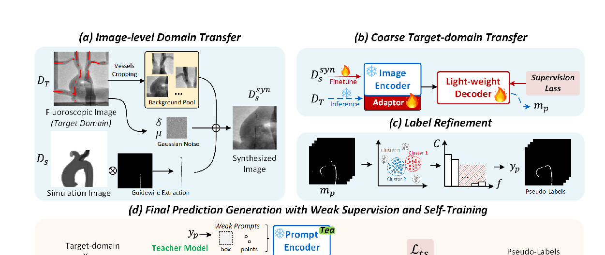

**Abstract**  
Guidewire segmentation during endovascular interventions holds the potential to significantly enhance procedural accuracy, improving visualization and providing critical feedback that can support both physicians and robotic systems in navigating complex vascular pathways. Unlike supervised segmentation networks, which need many expensive expert-annotated labels, sim-to-real domain adaptation approaches utilize synthetic data from simulations, offering a cost-effective solution. The success of models like Segment-Anything (SAM) has driven advancements in image segmentation foundation models with strong zero/few-shot generalization through prompt engineering. However, they struggle with medical images like X-ray fluoroscopy and the domain-shifts of the data. Given the challenges of acquiring annotation and the accessibility of labeled simulation data, we propose a sim-to-real domain adaption framework with a coarse-to-fine strategy to adapt SAM to X-ray fluoroscopy guidewire segmentation without any annotation on the target domain. We first generate the pseudo-labels by utilizing a simple source image style transfer technique that preserves the guidewire structure. Then, we develop a weakly supervised self-training architecture to fine-tune an end-to-end student SAM with the coarse labels by imposing consistency regularization and supervision from the teacher SAM network. We validate the effectiveness of the proposed method on a publicly available Cardiac dataset and an in-house Neurovascular dataset, where our method surpasses both pre-trained SAM and many state-of-the-art domain adaptation techniques by a large margin. Our code will be made public on GitHub soon.

**Summary**  
TBD

[⬆ Back to Literature Table](#samfsmis)

---

### <a id="db-sam-delving-into-high-quality-universal-medic-ee292d4a">DB-SAM: Delving into High Quality Universal Medical Image Segmentation</a>
> **Venue:** Lecture Notes in Computer Science 2024  
> **Authors:** C. Qin et al.  
> **Keywords:** OtherMIS, SAM
**Links**  
[Viewable Link](https://link.springer.com/10.1007/978-3-031-72390-2_47) [Original Link](https://arxiv.org/pdf/2410.04172) [Code](https://github.com/AlfredQin/DB-SAM)

  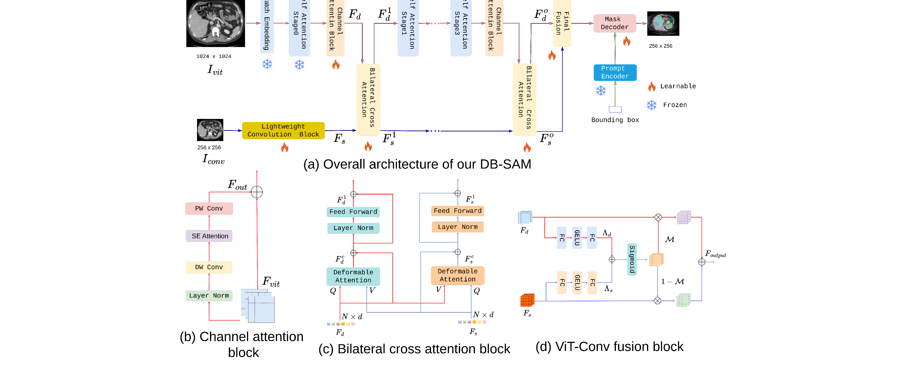

**Abstract**  
Recently, the Segment Anything Model (SAM) has demonstrated promising segmentation capabilities in a variety of downstream segmentation tasks. However in the context of universal medical image segmentation there exists a notable performance discrepancy when directly applying SAM due to the domain gap between natural and 2D/3D medical data. In this work, we propose a dual-branch adapted SAM framework, named DB-SAM, that strives to effectively bridge this domain gap. Our dual-branch adapted SAM contains two branches in parallel: a ViT branch and a convolution branch. The ViT branch incorporates a learnable channel attention block after each frozen attention block, which captures domain-specific local features. On the other hand, the convolution branch employs a light-weight convolutional block to extract domain-specific shallow features from the input medical image. To perform cross-branch feature fusion, we design a bilateral cross-attention block and a ViT convolution fusion block, which dynamically combine diverse information of two branches for mask decoder. Extensive experiments on large-scale medical image dataset with various 3D and 2D medical segmentation tasks reveal the merits of our proposed contributions. On 21 3D medical image segmentation tasks, our proposed DB-SAM achieves an absolute gain of 8.8%, compared to a recent medical SAM adapter in the literature. The code and model are available at https://github.com/AlfredQin/DB-SAM.

**Summary**  
TBD

[⬆ Back to Literature Table](#samothers)

---

### <a id="prompting-segment-anything-model-with-domain-ada-d02bae02">Prompting Segment Anything Model with Domain-Adaptive Prototype for Generalizable Medical Image Segmentation</a>
> **Venue:** Lecture Notes in Computer Science 2024  
> **Authors:** Z. Wei et al.  
> **Keywords:** OtherMIS, SAM
**Links**  
[Viewable Link](https://link.springer.com/10.1007/978-3-031-72111-3_50) [Original Link](https://link.springer.com/chapter/10.1007/978-3-031-72111-3_50) [Code](https://github.com/wkklavis/DAPSAM)

  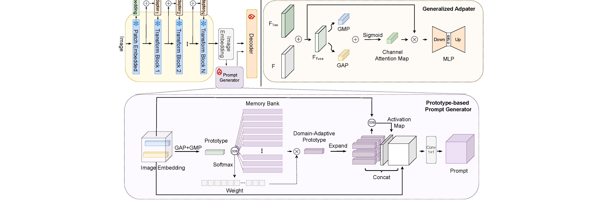

**Abstract**  
Deep learning based methods often suffer from performance degradation caused by domain shift. In recent years, many sophisticated network structures have been designed to tackle this problem. However, the advent of large model trained on massive data, with its exceptional segmentation capability, introduces a new perspective for solving medical segmentation problems. In this paper, we propose a novel Domain-Adaptive Prompt framework for fine-tuning the Segment Anything Model (termed as DAPSAM) to address single-source domain generalization (SDG) in segmenting medical images. DAPSAM not only utilizes a more generalization-friendly adapter to fine-tune the large model, but also introduces a self-learning prototype-based prompt generator to enhance model's generalization ability. Specifically, we first merge the important low-level features into intermediate features before feeding to each adapter, followed by an attention filter to remove redundant information. This yields more robust image embeddings. Then, we propose using a learnable memory bank to construct domain-adaptive prototypes for prompt generation, helping to achieve generalizable medical image segmentation. Extensive experimental results demonstrate that our DAPSAM achieves state-of-the-art performance on two SDG medical image segmentation tasks with different modalities. The code is available at https://github.com/wkklavis/DAPSAM.

**Summary**  
TBD

[⬆ Back to Literature Table](#samothers)

---

### <a id="fm-abs-promptable-foundation-model-drives-active-edabc19b">FM-ABS: Promptable Foundation Model Drives Active Barely Supervised Learning for 3D Medical Image Segmentation</a>
> **Venue:** Lecture Notes in Computer Science 2024  
> **Authors:** Z. Xu et al.  
> **Keywords:** SSLMIS, SAM
**Links**  
[Viewable Link](https://link.springer.com/10.1007/978-3-031-72111-3_28) [Original Link](https://link.springer.com/chapter/10.1007/978-3-031-72111-3_28)

  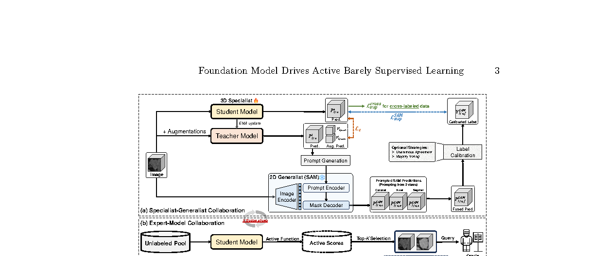

**Abstract**  
Semi-supervised learning (SSL) has significantly advanced 3D medical image segmentation by effectively reducing the need for laborious dense labeling from radiologists. Traditionally focused on model-centric advancements, we anticipate that the SSL landscape will...

**Summary**  
TBD

[⬆ Back to Literature Table](#samsslmis)

---

### <a id="fedfms-exploring-federated-foundation-models-for-c31a08c8">FedFMS: Exploring Federated Foundation Models for Medical Image Segmentation</a>
> **Venue:** Lecture Notes in Computer Science 2024  
> **Authors:** Y. Liu et al.  
> **Keywords:** OtherMIS, SAM
**Links**  
[Viewable Link](https://link.springer.com/10.1007/978-3-031-72111-3_27) [Original Link](https://link.springer.com/chapter/10.1007/978-3-031-72111-3_27) [Code](https://github.com/LIU-YUXI/FedFMS)

  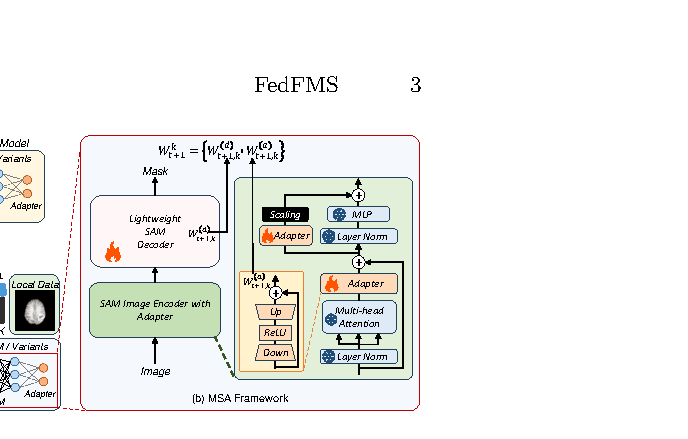

**Abstract**  
Medical image segmentation is crucial for clinical diagnosis. The Segmentation Anything Model (SAM) serves as a powerful foundation model for visual segmentation and can be adapted for medical image segmentation. However, medical imaging data typically contain privacy-sensitive information, making it challenging to train foundation models with centralized storage and sharing. To date, there are few foundation models tailored for medical image deployment within the federated learning framework, and the segmentation performance, as well as the efficiency of communication and training, remain unexplored. In response to these issues, we developed Federated Foundation models for Medical image Segmentation (FedFMS), which includes the Federated SAM (FedSAM) and a communication and training-efficient Federated SAM with Medical SAM Adapter (FedMSA). Comprehensive experiments on diverse datasets are conducted to investigate the performance disparities between centralized training and federated learning across various configurations of FedFMS. The experiments revealed that FedFMS could achieve performance comparable to models trained via centralized training methods while maintaining privacy. Furthermore, FedMSA demonstrated the potential to enhance communication and training efficiency. Our model implementation codes are available at https://github.com/LIU-YUXI/FedFMS.

**Summary**  
TBD

[⬆ Back to Literature Table](#samothers)

---

### <a id="superpixel-guided-segment-anything-model-for-liv-9d8d0aba">Superpixel-Guided Segment Anything Model for Liver Tumor Segmentation with Couinaud Segment Prompt</a>
> **Venue:** Lecture Notes in Computer Science 2024  
> **Authors:** F. Lyu et al.  
> **Keywords:** OtherMIS, SAM
**Links**  
[Viewable Link](https://link.springer.com/10.1007/978-3-031-72111-3_64) [Original Link](https://link.springer.com/chapter/10.1007/978-3-031-72111-3_64)

  <!-- Add image to imgs/ and uncomment the img tag below. -->
  <!--  -->

**Abstract**  
The Segment Anything Model (SAM) is a powerful foundation model which has shown impressive performance for generic image segmentation. However, directly applying SAM to liver tumor segmentation presents challenges due to the domain gap between nature images and...

**Summary**  
TBD

[⬆ Back to Literature Table](#samothers)

---

### <a id="mask-enhanced-segment-anything-model-for-tumor-l-ba252d79">Mask-Enhanced Segment Anything Model for Tumor Lesion Semantic Segmentation</a>
> **Venue:** Lecture Notes in Computer Science 2024  
> **Authors:** H. Shi et al.  
> **Keywords:** OtherMIS, SAM
**Links**  
[Viewable Link](https://link.springer.com/10.1007/978-3-031-72111-3_38) [Original Link](https://link.springer.com/chapter/10.1007/978-3-031-72111-3_38) [Code](https://github.com/nanase1025/M-SAM)

  

**Abstract**  
Tumor lesion segmentation on CT or MRI images plays a critical role in cancer diagnosis and treatment planning. Considering the inherent differences in tumor lesion segmentation data across various medical imaging modalities and equipment, integrating medical knowledge into the Segment Anything Model (SAM) presents promising capability due to its versatility and generalization potential. Recent studies have attempted to enhance SAM with medical expertise by pre-training on large-scale medical segmentation datasets. However, challenges still exist in 3D tumor lesion segmentation owing to tumor complexity and the imbalance in foreground and background regions. Therefore, we introduce Mask-Enhanced SAM (M-SAM), an innovative architecture tailored for 3D tumor lesion segmentation. We propose a novel Mask-Enhanced Adapter (MEA) within M-SAM that enriches the semantic information of medical images with positional data from coarse segmentation masks, facilitating the generation of more precise segmentation masks. Furthermore, an iterative refinement scheme is implemented in M-SAM to refine the segmentation masks progressively, leading to improved performance. Extensive experiments on seven tumor lesion segmentation datasets indicate that our M-SAM not only achieves high segmentation accuracy but also exhibits robust generalization. The code is available at https://github.com/nanase1025/M-SAM.

**Summary**  
TBD

[⬆ Back to Literature Table](#samothers)

---

### <a id="optimizing-efficiency-and-effectiveness-in-seque-1ed564bb">Optimizing Efficiency and Effectiveness in Sequential Prompt Strategy for SAM Using Reinforcement Learning</a>
> **Venue:** Lecture Notes in Computer Science 2024  
> **Authors:** Y. Huang et al.  
> **Keywords:** InteractiveMIS, SAM
**Links**  
[Viewable Link](https://link.springer.com/10.1007/978-3-031-72111-3_45) [Original Link](https://link.springer.com/chapter/10.1007/978-3-031-72111-3_45)

  <!-- Add image to imgs/ and uncomment the img tag below. -->
  <!--  -->

**Abstract**  
In the rapidly advancing field of medical image analysis, Interactive Medical Image Segmentation (IMIS) plays a crucial role in augmenting diagnostic precision. Within the realm of IMIS, the Segment Anything Model (SAM), trained on natural images, demonstrates...

**Summary**  
TBD

[⬆ Back to Literature Table](#samiwmis)

---

### <a id="tp-drseg-improving-diabetic-retinopathy-lesion-s-0fcc9bee">TP-DRSeg: Improving Diabetic Retinopathy Lesion Segmentation with Explicit Text-Prompts Assisted SAM</a>
> **Venue:** Lecture Notes in Computer Science 2024  
> **Authors:** W. Li et al.  
> **Keywords:** OtherMIS, SAM
**Links**  
[Viewable Link](https://link.springer.com/10.1007/978-3-031-72111-3_70) [Original Link](https://link.springer.com/chapter/10.1007/978-3-031-72111-3_70) [Code](https://github.com/wxliii/TP-DRSeg)

  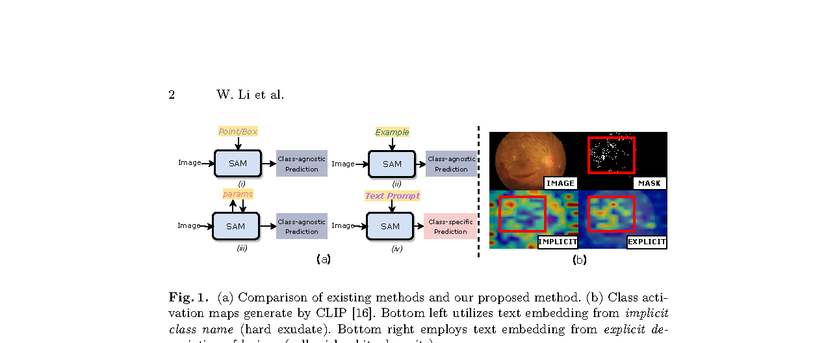

**Abstract**  
Recent advances in large foundation models, such as the Segment Anything Model (SAM), have demonstrated considerable promise across various tasks. Despite their progress, these models still encounter challenges in specialized medical image analysis, especially in recognizing subtle inter-class differences in Diabetic Retinopathy (DR) lesion segmentation. In this paper, we propose a novel framework that customizes SAM for text-prompted DR lesion segmentation, termed TP-DRSeg. Our core idea involves exploiting language cues to inject medical prior knowledge into the vision-only segmentation network, thereby combining the advantages of different foundation models and enhancing the credibility of segmentation. Specifically, to unleash the potential of vision-language models in the recognition of medical concepts, we propose an explicit prior encoder that transfers implicit medical concepts into explicit prior knowledge, providing explainable clues to excavate low-level features associated with lesions. Furthermore, we design a prior-aligned injector to inject explicit priors into the segmentation process, which can facilitate knowledge sharing across multi-modality features and allow our framework to be trained in a parameter-efficient fashion. Experimental results demonstrate the superiority of our framework over other traditional models and foundation model variants.

**Summary**  
TBD

[⬆ Back to Literature Table](#samothers)

---

### <a id="beyond-adapting-sam-towards-end-to-end-ultrasoun-ddcedf03">Beyond Adapting SAM: Towards End-to-End Ultrasound Image Segmentation via Auto Prompting</a>
> **Venue:** arXiv.org 2023  
> **Authors:** X. Lin et al.  
> **Keywords:** OtherMIS, SAM
**Links**  
[Viewable Link](https://arxiv.org/abs/2309.06824) [Original Link](https://link.springer.com/chapter/10.1007/978-3-031-72111-3_3) [Code](https://github.com/xianlin7/SAMUS)

  

**Abstract**  
End-to-end medical image segmentation is of great value for computer-aided diagnosis dominated by task-specific models, usually suffering from poor generalization. With recent breakthroughs brought by the segment anything model (SAM) for universal image segmentation, extensive efforts have been made to adapt SAM for medical imaging but still encounter two major issues: 1) severe performance degradation and limited generalization without proper adaptation, and 2) semi-automatic segmentation relying on accurate manual prompts for interaction. In this work, we propose SAMUS as a universal model tailored for ultrasound image segmentation and further enable it to work in an end-to-end manner denoted as AutoSAMUS. Specifically, in SAMUS, a parallel CNN branch is introduced to supplement local information through cross-branch attention, and a feature adapter and a position adapter are jointly used to adapt SAM from natural to ultrasound domains while reducing training complexity. AutoSAMUS is realized by introducing an auto prompt generator (APG) to replace the manual prompt encoder of SAMUS to automatically generate prompt embeddings. A comprehensive ultrasound dataset, comprising about 30k images and 69k masks and covering six object categories, is collected for verification. Extensive comparison experiments demonstrate the superiority of SAMUS and AutoSAMUS against the state-of-the-art task-specific and SAM-based foundation models. We believe the auto-prompted SAM-based model has the potential to become a new paradigm for end-to-end medical image segmentation and deserves more exploration. Code and data are available at https://github.com/xianlin7/SAMUS.

**Summary**  
TBD

[⬆ Back to Literature Table](#samothers)

---

### <a id="cryosam-training-free-cryoet-tomogram-segmentati-24a564eb">CryoSAM: Training-Free CryoET Tomogram Segmentation with Foundation Models</a>
> **Venue:** Lecture Notes in Computer Science 2024  
> **Authors:** Y. Zhao et al.  
> **Keywords:** Zero-ShotMIS, SAM
**Links**  
[Viewable Link](https://link.springer.com/10.1007/978-3-031-72111-3_12) [Original Link](https://link.springer.com/chapter/10.1007/978-3-031-72111-3_12) [Code](https://github.com/xulabs/aitom)

  <!-- Add image to imgs/ and uncomment the img tag below. -->
  <!--  -->

**Abstract**  
Cryogenic Electron Tomography (CryoET) is a useful imaging technology in structural biology that is hindered by its need for manual annotations, especially in particle picking. Recent works have endeavored to remedy this issue with few-shot learning or contrastive...

**Summary**  
TBD

[⬆ Back to Literature Table](#samzsmis)

---

### <a id="adapting-segment-anything-model-to-melanoma-segm-8abdd2c1">Adapting Segment Anything Model to Melanoma Segmentation in Microscopy Slide Images</a>
> **Venue:** Lecture Notes in Computer Science 2025  
> **Authors:** Q. Liu et al.  
> **Keywords:** OtherMIS, SAM
**Links**  
[Viewable Link](https://link.springer.com/10.1007/978-3-031-91721-9_10) [Original Link](https://arxiv.org/pdf/2410.02207)

  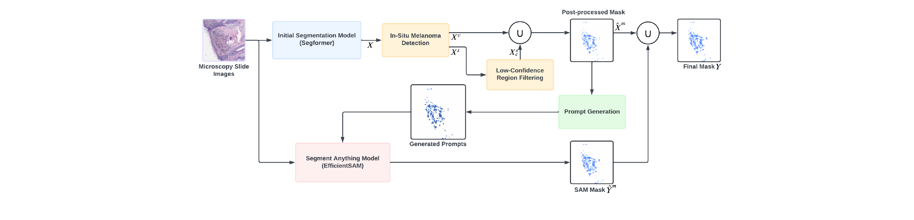

**Abstract**  
Melanoma segmentation in Whole Slide Images (WSIs) is useful for prognosis and the measurement of crucial prognostic factors such as Breslow depth and primary invasive tumor size. In this paper, we present a novel approach that uses the Segment Anything Model (SAM) for automatic melanoma segmentation in microscopy slide images. Our method employs an initial semantic segmentation model to generate preliminary segmentation masks that are then used to prompt SAM. We design a dynamic prompting strategy that uses a combination of centroid and grid prompts to achieve optimal coverage of the super high-resolution slide images while maintaining the quality of generated prompts. To optimize for invasive melanoma segmentation, we further refine the prompt generation process by implementing in-situ melanoma detection and low-confidence region filtering. We select Segformer as the initial segmentation model and EfficientSAM as the segment anything model for parameter-efficient fine-tuning. Our experimental results demonstrate that this approach not only surpasses other state-of-the-art melanoma segmentation methods but also significantly outperforms the baseline Segformer by 9.1% in terms of IoU.

**Summary**  
TBD

[⬆ Back to Literature Table](#samothers)

---

### <a id="medical-image-segmentation-with-sam-generated-an-798e017d">Medical Image Segmentation with SAM-generated Annotations</a>
> **Venue:** Lecture Notes in Computer Science 2025  
> **Authors:** I. Häkkinen et al.  
> **Keywords:** OtherMIS, SAM
**Links**  
[Viewable Link](https://link.springer.com/10.1007/978-3-031-92089-9_4) [Original Link](https://arxiv.org/pdf/2409.20253)

  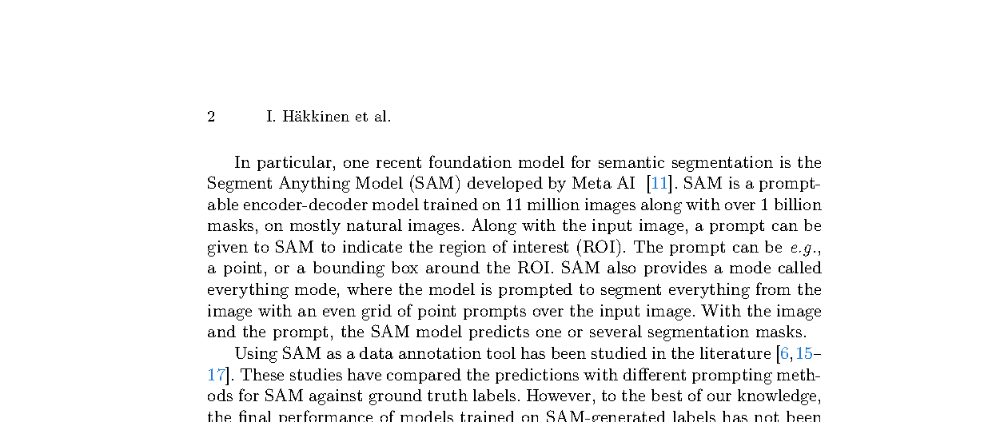

**Abstract**  
The field of medical image segmentation is hindered by the scarcity of large, publicly available annotated datasets. Not all datasets are made public for privacy reasons, and creating annotations for a large dataset is time-consuming and expensive, as it requires specialized expertise to accurately identify regions of interest (ROIs) within the images. To address these challenges, we evaluate the performance of the Segment Anything Model (SAM) as an annotation tool for medical data by using it to produce so-called "pseudo labels" on the Medical Segmentation Decathlon (MSD) computed tomography (CT) tasks. The pseudo labels are then used in place of ground truth labels to train a UNet model in a weakly-supervised manner. We experiment with different prompt types on SAM and find that the bounding box prompt is a simple yet effective method for generating pseudo labels. This method allows us to develop a weakly-supervised model that performs comparably to a fully supervised model.

**Summary**  
TBD

[⬆ Back to Literature Table](#samothers)

---

### <a id="automating-medsam-by-learning-prompts-with-weak-19273e69">Automating MedSAM by Learning Prompts with Weak Few-Shot Supervision</a>
> **Venue:** Lecture Notes in Computer Science 2025  
> **Authors:** M. Gaillochet et al.  
> **Keywords:** Few-ShotMIS, SAM
**Links**  
[Viewable Link](https://link.springer.com/10.1007/978-3-031-73471-7_7) [Original Link](https://arxiv.org/pdf/2409.20293) [Code](https://github.com/Minimel/MedSAMWeakFewShotPromptAutomation)

  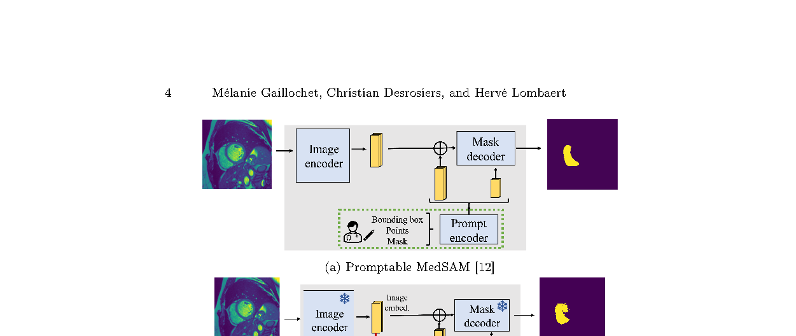

**Abstract**  
Foundation models such as the recently introduced Segment Anything Model (SAM) have achieved remarkable results in image segmentation tasks. However, these models typically require user interaction through handcrafted prompts such as bounding boxes, which limits their deployment to downstream tasks. Adapting these models to a specific task with fully labeled data also demands expensive prior user interaction to obtain ground-truth annotations. This work proposes to replace conditioning on input prompts with a lightweight module that directly learns a prompt embedding from the image embedding, both of which are subsequently used by the foundation model to output a segmentation mask. Our foundation models with learnable prompts can automatically segment any specific region by 1) modifying the input through a prompt embedding predicted by a simple module, and 2) using weak labels (tight bounding boxes) and few-shot supervision (10 samples). Our approach is validated on MedSAM, a version of SAM fine-tuned for medical images, with results on three medical datasets in MR and ultrasound imaging. Our code is available on https://github.com/Minimel/MedSAMWeakFewShotPromptAutomation.

**Summary**  
TBD

[⬆ Back to Literature Table](#samfsmis)

---

### <a id="medclip-samv2-towards-universal-text-driven-medi-ae6fc3f5">MedCLIP-SAMv2: Towards Universal Text-Driven Medical Image Segmentation</a>
> **Venue:** Medical Image Analysis 2025  
> **Authors:** T. Koleilat et al.  
> **Keywords:** Zero-ShotMIS, SAM
**Links**  
[Viewable Link](https://linkinghub.elsevier.com/retrieve/pii/S1361841525002968) [Original Link](https://arxiv.org/pdf/2409.19483) [Code](https://github.com/HealthX-Lab/MedCLIP-SAMv2)

  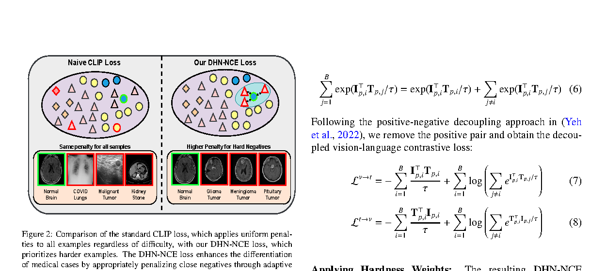

**Abstract**  
Segmentation of anatomical structures and pathological regions in medical images is essential for modern clinical diagnosis, disease research, and treatment planning. While significant advancements have been made in deep learning-based segmentation techniques, many of these methods still suffer from limitations in data efficiency, generalizability, and interactivity. As a result, developing precise segmentation methods that require fewer labeled datasets remains a critical challenge in medical image analysis. Recently, the introduction of foundation models like CLIP and Segment-Anything-Model (SAM), with robust cross-domain representations, has paved the way for interactive and universal image segmentation. However, further exploration of these models for data-efficient segmentation in medical imaging is still needed and highly relevant. In this paper, we introduce MedCLIP-SAMv2, a novel framework that integrates the CLIP and SAM models to perform segmentation on clinical scans using text prompts, in both zero-shot and weakly supervised settings. Our approach includes fine-tuning the BiomedCLIP model with a new Decoupled Hard Negative Noise Contrastive Estimation (DHN-NCE) loss, and leveraging the Multi-modal Information Bottleneck (M2IB) to create visual prompts for generating segmentation masks from SAM in the zero-shot setting. We also investigate using zero-shot segmentation labels within a weakly supervised paradigm to enhance segmentation quality further. Extensive testing across four diverse segmentation tasks and medical imaging modalities (breast tumor ultrasound, brain tumor MRI, lung X-ray, and lung CT) demonstrates the high accuracy of our proposed framework. Our code is available at https://github.com/HealthX-Lab/MedCLIP-SAMv2.

**Summary**  
TBD

[⬆ Back to Literature Table](#samzsmis)

---

### <a id="towards-ground-truth-free-evaluation-of-any-segm-46165576">Towards Ground-truth-free Evaluation of Any Segmentation in Medical Images</a>
> **Venue:** arXiv.org 2024  
> **Authors:** A. Senbi et al.  
> **Keywords:** OtherMIS, SAM
**Links**  
[Viewable Link](https://arxiv.org/abs/2409.14874) [Original Link](https://arxiv.org/pdf/2409.14874) [Code](https://github.com/ahjolsenbics/EvanySeg)

  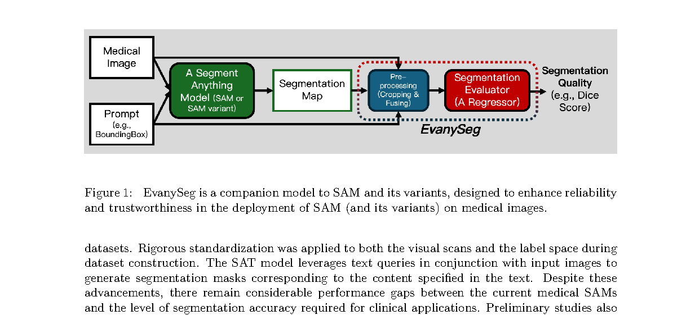

**Abstract**  
We explore the feasibility and potential of building a ground-truth-free evaluation model to assess the quality of segmentations generated by the Segment Anything Model (SAM) and its variants in medical imaging. This evaluation model estimates segmentation quality scores by analyzing the coherence and consistency between the input images and their corresponding segmentation predictions. Based on prior research, we frame the task of training this model as a regression problem within a supervised learning framework, using Dice scores (and optionally other metrics) along with mean squared error to compute the training loss. The model is trained utilizing a large collection of public datasets of medical images with segmentation predictions from SAM and its variants. We name this model EvanySeg (Evaluation of Any Segmentation in Medical Images). Our exploration of convolution-based models (e.g., ResNet) and transformer-based models (e.g., ViT) suggested that ViT yields better performance for this task. EvanySeg can be employed for various tasks, including: (1) identifying poorly segmented samples by detecting low-percentile segmentation quality scores; (2) benchmarking segmentation models without ground truth by averaging quality scores across test samples; (3) alerting human experts to poor-quality segmentation predictions during human-AI collaboration by applying a threshold within the score space; and (4) selecting the best segmentation prediction for each test sample at test time when multiple segmentation models are available, by choosing the prediction with the highest quality score. Models and code will be made available at https://github.com/ahjolsenbics/EvanySeg.

**Summary**  
TBD

[⬆ Back to Literature Table](#samothers)

---

### <a id="mcicsam-monte-carlo-guided-interpolation-consist-cb70abf3">MCICSAM: Monte Carlo-guided Interpolation Consistency Segment Anything Model for Semi-Supervised Prostate Zone Segmentation</a>
> **Venue:** arXiv.org 2024  
> **Authors:** G. Huang et al.  
> **Keywords:** SSLMIS, SAM
**Links**  
[Viewable Link](https://arxiv.org/abs/2409.13371) [Original Link](https://arxiv.org/pdf/2409.13371)

  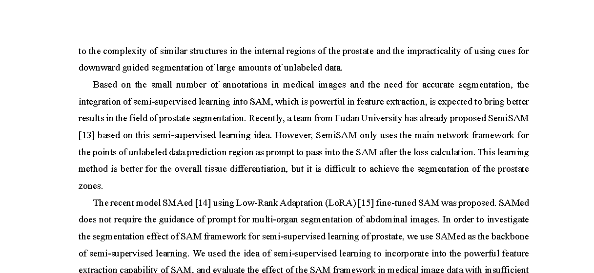

**Abstract**  
Accurate segmentation of various regions within the prostate is pivotal for diagnosing and treating prostate-related diseases. However, the scarcity of labeled data, particularly in specialized medical fields like prostate imaging, poses a significant challenge. Segment Anything Model (SAM) is a new large model for natural image segmentation, but there are some challenges in medical imaging. In order to better utilize the powerful feature extraction capability of SAM as well as to address the problem of low data volume for medical image annotation, we use Low-Rank Adaptation (LoRA) and semi-supervised learning methods of Monte Carlo guided interpolation consistency (MCIC) to enhance the fine-tuned SAM. We propose Monte Carlo-guided Interpolation Consistency Segment Anything Model (MCICSAM) for application to semi-supervised learning based prostate region segmentation. In the unlabeled data section, MCIC performs two different interpolation transformations on the input data and incorporates Monte Carlo uncertainty analysis in the output, forcing the model to be consistent in its predictions. The consistency constraints imposed on these interpolated samples allow the model to fit the distribution of unlabeled data better, ultimately improving its performance in semi-supervised scenarios. We use Dice and Hausdorff Distance at 95th percentile (HD95) to validate model performance. MCICSAM yieldes Dice with 79.38% and 89.95%, along with improves HD95 values of 3.12 and 2.27 for transition zone and transition zone. At the same time MCICSAM demonstrates strong generalizability. This method is expected to bring new possibilities in the field of prostate image segmentation.

**Summary**  
TBD

[⬆ Back to Literature Table](#samsslmis)

---

### <a id="tri-plane-mamba-efficiently-adapting-segment-any-f441c105">Tri-Plane Mamba: Efficiently Adapting Segment Anything Model for 3D Medical Images</a>
> **Venue:** Lecture Notes in Computer Science 2024  
> **Authors:** H. Wang et al.  
> **Keywords:** OtherMIS, SAM
**Links**  
[Viewable Link](https://link.springer.com/10.1007/978-3-031-72114-4_61) [Original Link](https://arxiv.org/pdf/2409.08492) [Code](https://github.com/xmed-lab/TP-Mamba)

  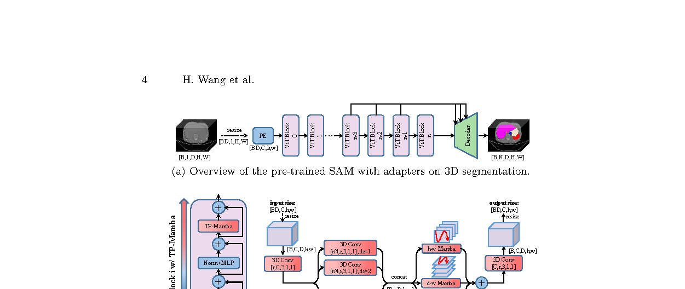

**Abstract**  
General networks for 3D medical image segmentation have recently undergone extensive exploration. Behind the exceptional performance of these networks lies a significant demand for a large volume of pixel-level annotated data, which is time-consuming and labor-intensive. The emergence of the Segment Anything Model (SAM) has enabled this model to achieve superior performance in 2D medical image segmentation tasks via parameter- and data-efficient feature adaptation. However, the introduction of additional depth channels in 3D medical images not only prevents the sharing of 2D pre-trained features but also results in a quadratic increase in the computational cost for adapting SAM. To overcome these challenges, we present the Tri-Plane Mamba (TP-Mamba) adapters tailored for the SAM, featuring two major innovations: 1) multi-scale 3D convolutional adapters, optimized for efficiently processing local depth-level information, 2) a tri-plane mamba module, engineered to capture long-range depth-level representation without significantly increasing computational costs. This approach achieves state-of-the-art performance in 3D CT organ segmentation tasks. Remarkably, this superior performance is maintained even with scarce training data. Specifically using only three CT training samples from the BTCV dataset, it surpasses conventional 3D segmentation networks, attaining a Dice score that is up to 12% higher.

**Summary**  
TBD

[⬆ Back to Literature Table](#samothers)

---

### <a id="sam2rad-a-segmentation-model-for-medical-images-18c21f70">Sam2Rad: A Segmentation Model for Medical Images with Learnable Prompts</a>
> **Venue:** Computers in Biology and Medicine 2025  
> **Authors:** AS. Wahd et al.  
> **Keywords:** OtherMIS, SAM
**Links**  
[Viewable Link](https://linkinghub.elsevier.com/retrieve/pii/S0010482525000757) [Original Link](https://arxiv.org/pdf/2409.06821) [Code](https://github.com/aswahd/SamRadiology)

  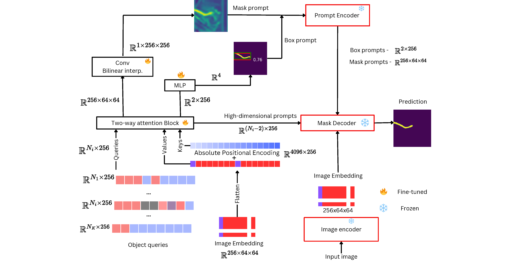

**Abstract**  
Foundation models like the segment anything model require high-quality manual prompts for medical image segmentation, which is time-consuming and requires expertise. SAM and its variants often fail to segment structures in ultrasound (US) images due to domain shift. We propose Sam2Rad, a prompt learning approach to adapt SAM and its variants for US bone segmentation without human prompts. It introduces a prompt predictor network (PPN) with a cross-attention module to predict prompt embeddings from image encoder features. PPN outputs bounding box and mask prompts, and 256-dimensional embeddings for regions of interest. The framework allows optional manual prompting and can be trained end-to-end using parameter-efficient fine-tuning (PEFT). Sam2Rad was tested on 3 musculoskeletal US datasets: wrist (3822 images), rotator cuff (1605 images), and hip (4849 images). It improved performance across all datasets without manual prompts, increasing Dice scores by 2-7% for hip/wrist and up to 33% for shoulder data. Sam2Rad can be trained with as few as 10 labeled images and is compatible with any SAM architecture for automatic segmentation.

**Summary**  
TBD

[⬆ Back to Literature Table](#samothers)

---

### <a id="when-3d-partial-points-meets-sam-tooth-point-clo-b603cd6c">When 3D Partial Points Meets SAM: Tooth Point Cloud Segmentation with Sparse Labels</a>
> **Venue:** Lecture Notes in Computer Science 2024  
> **Authors:** Y. Liu et al.  
> **Keywords:** Weakly-SupervisedMIS, SAM
**Links**  
[Viewable Link](https://link.springer.com/10.1007/978-3-031-72120-5_72) [Original Link](https://arxiv.org/pdf/2409.01691) [Code](https://github.com/CUHK-AIM-Group/SAMTooth)

  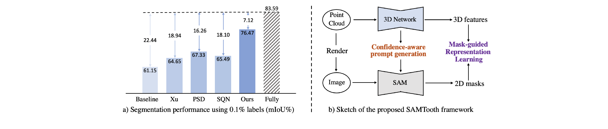

**Abstract**  
Tooth point cloud segmentation is a fundamental task in many orthodontic applications. Current research mainly focuses on fully supervised learning which demands expensive and tedious manual point-wise annotation. Although recent weakly-supervised alternatives are proposed to use weak labels for 3D segmentation and achieve promising results, they tend to fail when the labels are extremely sparse. Inspired by the powerful promptable segmentation capability of the Segment Anything Model (SAM), we propose a framework named SAMTooth that leverages such capacity to complement the extremely sparse supervision. To automatically generate appropriate point prompts for SAM, we propose a novel Confidence-aware Prompt Generation strategy, where coarse category predictions are aggregated with confidence-aware filtering. Furthermore, to fully exploit the structural and shape clues in SAM's outputs for assisting the 3D feature learning, we advance a Mask-guided Representation Learning that re-projects the generated tooth masks of SAM into 3D space and constrains these points of different teeth to possess distinguished representations. To demonstrate the effectiveness of the framework, we conduct experiments on the public dataset and surprisingly find with only 0.1\% annotations (one point per tooth), our method can surpass recent weakly supervised methods by a large margin, and the performance is even comparable to the recent fully-supervised methods, showcasing the significant potential of applying SAM to 3D perception tasks with sparse labels. Code is available at https://github.com/CUHK-AIM-Group/SAMTooth.

**Summary**  
TBD

[⬆ Back to Literature Table](#samwsmis)

---

### <a id="curriculum-prompting-foundation-models-for-medic-9b2fb910">Curriculum Prompting Foundation Models for Medical Image Segmentation</a>
> **Venue:** Lecture Notes in Computer Science 2024  
> **Authors:** X. Zheng et al.  
> **Keywords:** OtherMIS, SAM
**Links**  
[Viewable Link](https://link.springer.com/10.1007/978-3-031-72390-2_46) [Original Link](https://arxiv.org/pdf/2409.00695) [Code](https://github.com/AnnaZzz-zxq/Curriculum-Prompting)

  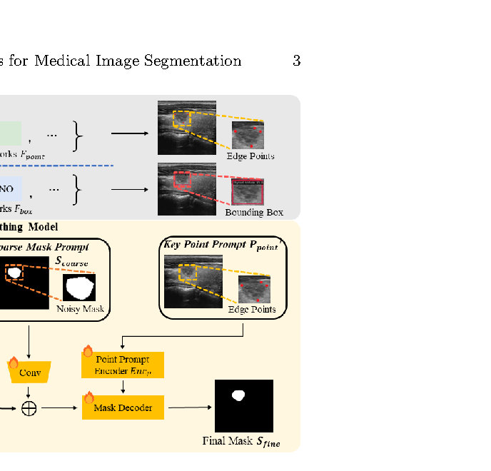

**Abstract**  
Adapting large pre-trained foundation models, e.g., SAM, for medical image segmentation remains a significant challenge. A crucial step involves the formulation of a series of specialized prompts that incorporate specific clinical instructions. Past works have been heavily reliant on a singular type of prompt for each instance, necessitating manual input of an ideally correct prompt, which is less efficient. To tackle this issue, we propose to utilize prompts of different granularity, which are sourced from original images to provide a broader scope of clinical insights. However, combining prompts of varying types can pose a challenge due to potential conflicts. In response, we have designed a coarse-to-fine mechanism, referred to as curriculum prompting, that progressively integrates prompts of different types. Through extensive experiments on three public medical datasets across various modalities, we demonstrate the effectiveness of our proposed approach, which not only automates the prompt generation process but also yields superior performance compared to other SAM-based medical image segmentation methods. Code is available at: https://github.com/AnnaZzz-zxq/Curriculum-Prompting.

**Summary**  
TBD

[⬆ Back to Literature Table](#samothers)

---

### <a id="generalized-sam-efficient-fine-tuning-of-sam-for-127ab9cf">Generalized SAM: Efficient Fine-Tuning of SAM for Variable Input Image Sizes</a>
> **Venue:** Lecture Notes in Computer Science 2025  
> **Authors:** S. Kato et al.  
> **Keywords:** OtherMIS, SAM
**Links**  
[Viewable Link](https://link.springer.com/10.1007/978-3-031-91979-4_14) [Original Link](https://arxiv.org/pdf/2408.12406) [Code](https://github.com/usagisukisuki/G-SAM)

  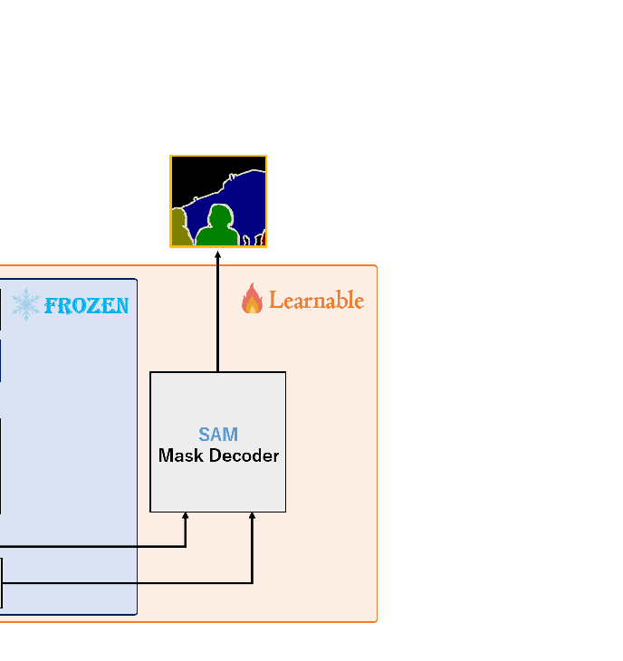

**Abstract**  
There has been a lot of recent research on improving the efficiency of fine-tuning foundation models. In this paper, we propose a novel efficient fine-tuning method that allows the input image size of Segment Anything Model (SAM) to be variable. SAM is a powerful foundational model for image segmentation trained on huge datasets, but it requires fine-tuning to recognize arbitrary classes. The input image size of SAM is fixed at 1024 x 1024, resulting in substantial computational demands during training. Furthermore, the fixed input image size may result in the loss of image information, e.g. due to fixed aspect ratios. To address this problem, we propose Generalized SAM (GSAM). Different from the previous methods, GSAM is the first to apply random cropping during training with SAM, thereby significantly reducing the computational cost of training. Experiments on datasets of various types and various pixel counts have shown that GSAM can train more efficiently than SAM and other fine-tuning methods for SAM, achieving comparable or higher accuracy.

**Summary**  
TBD

[⬆ Back to Literature Table](#samothers)

---

### <a id="sam-sp-self-prompting-makes-sam-great-again-54d124e8">SAM-SP: Self-Prompting Makes SAM Great Again</a>
> **Venue:** arXiv.org 2024  
> **Authors:** C. Zhou et al.  
> **Keywords:** Zero-ShotMIS, SAM
**Links**  
[Viewable Link](https://arxiv.org/abs/2408.12364) [Original Link](https://arxiv.org/pdf/2408.12364)

  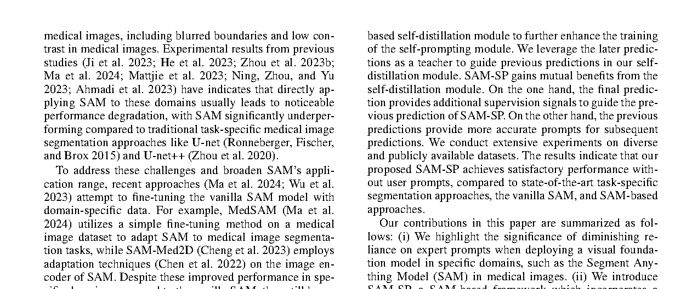

**Abstract**  
The recently introduced Segment Anything Model (SAM), a Visual Foundation Model (VFM), has demonstrated impressive capabilities in zero-shot segmentation tasks across diverse natural image datasets. Despite its success, SAM encounters noticeably performance degradation when applied to specific domains, such as medical images. Current efforts to address this issue have involved fine-tuning strategies, intended to bolster the generalizability of the vanilla SAM. However, these approaches still predominantly necessitate the utilization of domain specific expert-level prompts during the evaluation phase, which severely constrains the model's practicality. To overcome this limitation, we introduce a novel self-prompting based fine-tuning approach, called SAM-SP, tailored for extending the vanilla SAM model. Specifically, SAM-SP leverages the output from the previous iteration of the model itself as prompts to guide subsequent iteration of the model. This self-prompting module endeavors to learn how to generate useful prompts autonomously and alleviates the dependence on expert prompts during the evaluation phase, significantly broadening SAM's applicability. Additionally, we integrate a self-distillation module to enhance the self-prompting process further. Extensive experiments across various domain specific datasets validate the effectiveness of the proposed SAM-SP. Our SAM-SP not only alleviates the reliance on expert prompts but also exhibits superior segmentation performance comparing to the state-of-the-art task-specific segmentation approaches, the vanilla SAM, and SAM-based approaches.

**Summary**  
TBD

[⬆ Back to Literature Table](#samzsmis)

---

### <a id="sam-unet-enhancing-zero-shot-segmentation-of-sam-96f5ba9c">SAM-UNet: Enhancing Zero-Shot Segmentation of SAM for Universal Medical Images</a>
> **Venue:** 2024  
> **Authors:** S. Yang et al.  
> **Keywords:** Zero-ShotMIS, SAM
**Links**  
[Viewable Link](https://arxiv.org/pdf/2408.09886) [Code](https://github.com/Hhankyangg/sam-unet)

  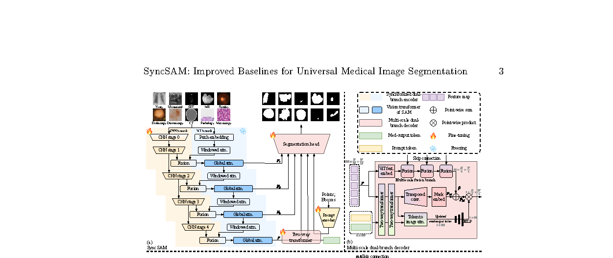

**Abstract**  
TBD

**Summary**  
TBD

[⬆ Back to Literature Table](#samzsmis)

---

### <a id="sam-fnet-sam-guided-fusion-network-for-laryngo-p-8fbefa66">SAM-FNet: SAM-Guided Fusion Network for Laryngo-Pharyngeal Tumor Detection</a>
> **Venue:** 2024 IEEE International Conference on Bioinformatics and Biomedicine (BIBM)  
> **Authors:** J. Wei et al.  
> **Keywords:** OtherMIS, SAM
**Links**  
[Viewable Link](https://ieeexplore.ieee.org/document/10822832/) [Original Link](https://arxiv.org/pdf/2408.05426) [Code](https://github.com/VVJia/SAM-FNet)

  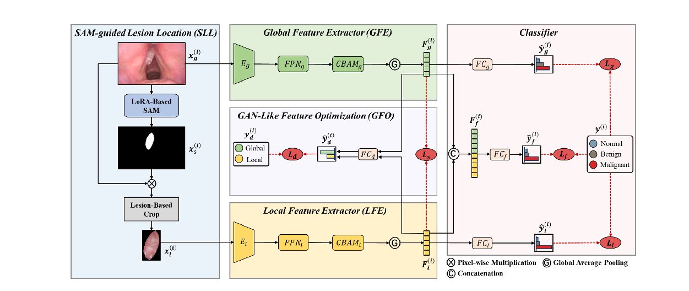

**Abstract**  
Laryngo-pharyngeal cancer (LPC) is a highly fatal malignant disease affecting the head and neck region. Previous studies on endoscopic tumor detection, particularly those leveraging dual-branch network architectures, have shown significant advancements in tumor detection. These studies highlight the potential of dual-branch networks in improving diagnostic accuracy by effectively integrating global and local (lesion) feature extraction. However, they are still limited in their capabilities to accurately locate the lesion region and capture the discriminative feature information between the global and local branches. To address these issues, we propose a novel SAM-guided fusion network (SAM-FNet), a dual-branch network for laryngo-pharyngeal tumor detection. By leveraging the powerful object segmentation capabilities of the Segment Anything Model (SAM), we introduce the SAM into the SAM-FNet to accurately segment the lesion region. Furthermore, we propose a GAN-like feature optimization (GFO) module to capture the discriminative features between the global and local branches, enhancing the fusion feature complementarity. Additionally, we collect two LPC datasets from the First Affiliated Hospital (FAHSYSU) and the Sixth Affiliated Hospital (SAHSYSU) of Sun Yat-sen University. The FAHSYSU dataset is used as the internal dataset for training the model, while the SAHSYSU dataset is used as the external dataset for evaluating the model's performance. Extensive experiments on both datasets of FAHSYSU and SAHSYSU demonstrate that the SAM-FNet can achieve competitive results, outperforming the state-of-the-art counterparts. The source code of SAM-FNet is available at the URL of https://github.com/VVJia/SAM-FNet.

**Summary**  
TBD

[⬆ Back to Literature Table](#samothers)

---

### <a id="promptsam-malware-detection-based-on-prompt-segm-0a0171c3">PromptSAM+: Malware Detection based on Prompt Segment Anything Model</a>
> **Venue:** arXiv.org 2024  
> **Authors:** X. Wei et al.  
> **Keywords:** OtherMIS, SAM
**Links**  
[Viewable Link](https://arxiv.org/abs/2408.02066) [Original Link](https://arxiv.org/pdf/2408.02066) [Code](https://github.com/XingYuanWei/PromptSAM)

  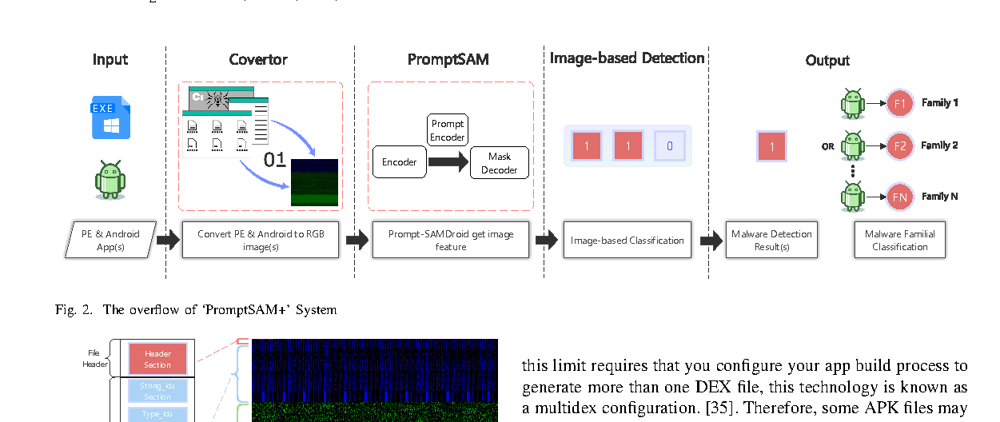

**Abstract**  
Machine learning and deep learning (ML/DL) have been extensively applied in malware detection, and some existing methods demonstrate robust performance. However, several issues persist in the field of malware detection: (1) Existing work often overemphasizes accuracy at the expense of practicality, rarely considering false positive and false negative rates as important metrics. (2) Considering the evolution of malware, the performance of classifiers significantly declines over time, greatly reducing the practicality of malware detectors. (3) Prior ML/DL-based efforts heavily rely on ample labeled data for model training, largely dependent on feature engineering or domain knowledge to build feature databases, making them vulnerable if correct labels are scarce. With the development of computer vision, vision-based malware detection technology has also rapidly evolved. In this paper, we propose a visual malware general enhancement classification framework, `PromptSAM+', based on a large visual network segmentation model, the Prompt Segment Anything Model(named PromptSAM+). Our experimental results indicate that 'PromptSAM+' is effective and efficient in malware detection and classification, achieving high accuracy and low rates of false positives and negatives. The proposed method outperforms the most advanced image-based malware detection technologies on several datasets. 'PromptSAM+' can mitigate aging in existing image-based malware classifiers, reducing the considerable manpower needed for labeling new malware samples through active learning. We conducted experiments on datasets for both Windows and Android platforms, achieving favorable outcomes. Additionally, our ablation experiments on several datasets demonstrate that our model identifies effective modules within the large visual network.

**Summary**  
TBD

[⬆ Back to Literature Table](#samothers)

---

### <a id="pesam-privacy-enhanced-segment-anything-model-fo-e8631809">PESAM: Privacy-Enhanced Segment Anything Model for Medical Image Segmentation</a>
> **Venue:** Lecture Notes in Computer Science 2024  
> **Authors:** J. Cai et al.  
> **Keywords:** Zero-ShotMIS, SAM
**Links**  
[Viewable Link](https://link.springer.com/10.1007/978-981-97-5581-3_8) [Original Link](https://link.springer.com/chapter/10.1007/978-981-97-5581-3_8)

  <!-- Add image to imgs/ and uncomment the img tag below. -->
  <!--  -->

**Abstract**  
The Segment Anything Model (SAM) has garnered significant attention due to its superior zero-shot generalization ability. However, the development of SAM in medical image segmentation continues to confront challenges related to data sharing restrictions imposed by...

**Summary**  
TBD

[⬆ Back to Literature Table](#samzsmis)

---

### <a id="a-federated-learning-friendly-approach-for-param-f09b695f">A Federated Learning-Friendly Approach for Parameter-Efficient Fine-Tuning of SAM in 3D Segmentation</a>
> **Venue:** Lecture Notes in Computer Science 2025  
> **Authors:** M. Asokan et al.  
> **Keywords:** OtherMIS, SAM
**Links**  
[Viewable Link](https://link.springer.com/10.1007/978-3-031-77610-6_21) [Original Link](https://arxiv.org/pdf/2407.21739) [Code](https://github.com/BioMedIA-MBZUAI/FLAP-SAM)

  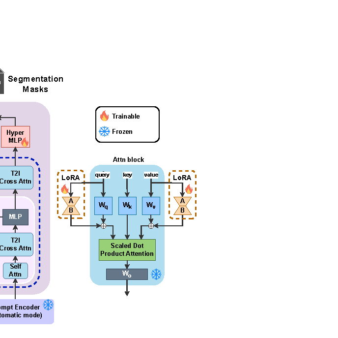

**Abstract**  
Adapting foundation models for medical image analysis requires finetuning them on a considerable amount of data because of extreme distribution shifts between natural (source) data used for pretraining and medical (target) data. However, collecting task-specific medical data for such finetuning at a central location raises many privacy concerns. Although Federated learning (FL) provides an effective means for training on private decentralized data, communication costs in federating large foundation models can quickly become a significant bottleneck, impacting the solution's scalability. In this work, we address this problem of efficient communication while ensuring effective learning in FL by combining the strengths of Parameter-Efficient Fine-tuning (PEFT) with FL. Specifically, we study plug-and-play Low-Rank Adapters (LoRA) in a federated manner to adapt the Segment Anything Model (SAM) for 3D medical image segmentation. Unlike prior works that utilize LoRA and finetune the entire decoder, we critically analyze the contribution of each granular component of SAM on finetuning performance. Thus, we identify specific layers to be federated that are very efficient in terms of communication cost while producing on-par accuracy. Our experiments show that retaining the parameters of the SAM model (including most of the decoder) in their original state during adaptation is beneficial because fine-tuning on small datasets tends to distort the inherent capabilities of the underlying foundation model. On Fed-KiTS, our approach decreases communication cost (~48x) compared to full fine-tuning while increasing performance (~6% Dice score) in 3D segmentation tasks. Our approach performs similar to SAMed while achieving ~2.8x reduction in communication and parameters to be finetuned. We further validate our approach with experiments on Fed-IXI and Prostate MRI datasets.

**Summary**  
TBD

[⬆ Back to Literature Table](#samothers)

---

### <a id="cc-sam-sam-with-cross-feature-attention-and-cont-de622525">CC-SAM: SAM with Cross-feature Attention and Context for Ultrasound Image Segmentation</a>
> **Venue:** Lecture Notes in Computer Science 2025  
> **Authors:** SN. Gowda et al.  
> **Keywords:** OtherMIS, SAM
**Links**  
[Viewable Link](https://link.springer.com/10.1007/978-3-031-72995-9_7) [Original Link](https://arxiv.org/pdf/2408.00181)

  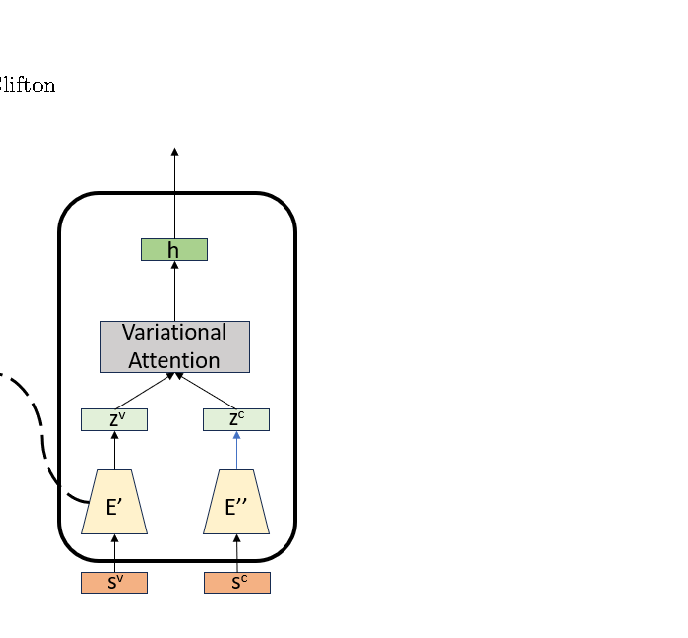

**Abstract**  
The Segment Anything Model (SAM) has achieved remarkable successes in the realm of natural image segmentation, but its deployment in the medical imaging sphere has encountered challenges. Specifically, the model struggles with medical images that feature low contrast, faint boundaries, intricate morphologies, and small-sized objects. To address these challenges and enhance SAM's performance in the medical domain, we introduce a comprehensive modification. Firstly, we incorporate a frozen Convolutional Neural Network (CNN) branch as an image encoder, which synergizes with SAM's original Vision Transformer (ViT) encoder through a novel variational attention fusion module. This integration bolsters the model's capability to capture local spatial information, which is often paramount in medical imagery. Moreover, to further optimize SAM for medical imaging, we introduce feature and position adapters within the ViT branch, refining the encoder's representations. We see that compared to current prompting strategies to fine-tune SAM for ultrasound medical segmentation, the use of text descriptions that serve as text prompts for SAM helps significantly improve the performance. Leveraging ChatGPT's natural language understanding capabilities, we generate prompts that offer contextual information and guidance to SAM, enabling it to better understand the nuances of ultrasound medical images and improve its segmentation accuracy. Our method, in its entirety, represents a significant stride towards making universal image segmentation models more adaptable and efficient in the medical domain.

**Summary**  
TBD

[⬆ Back to Literature Table](#samothers)

---

### <a id="dr-sam-u-shape-structure-segment-anything-model-f0dfbb60">Dr-SAM: U-Shape Structure Segment Anything Model for Generalizable Medical Image Segmentation</a>
> **Venue:** Lecture Notes in Computer Science 2024  
> **Authors:** X. Huo et al.  
> **Keywords:** OtherMIS, SAM
**Links**  
[Viewable Link](https://link.springer.com/10.1007/978-981-97-5600-1_17) [Original Link](https://link.springer.com/chapter/10.1007/978-981-97-5600-1_17)

  <!-- Add image to imgs/ and uncomment the img tag below. -->
  <!--  -->

**Abstract**  
Medical image segmentation plays a pivotal role in computer-assisted medical diagnosis, contributing to precise diagnostics, treatment strategizing, and disease tracking. However, the availability of annotated data for medical image segmentation remains restricted,...

**Summary**  
TBD

[⬆ Back to Literature Table](#samothers)

---

### <a id="sam-mil-a-spatial-contextual-aware-multiple-inst-a29711d6">SAM-MIL: A Spatial Contextual Aware Multiple Instance Learning Approach for Whole Slide Image Classification</a>
> **Venue:** 32nd ACM International Conference on Multimedia 2024  
> **Authors:** H. Fang et al.  
> **Keywords:** OtherMIS, SAM
**Links**  
[Viewable Link](https://dl.acm.org/doi/10.1145/3664647.3681534) [Original Link](https://arxiv.org/pdf/2407.17689)

  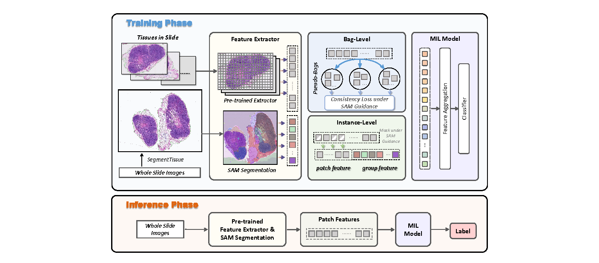

**Abstract**  
Multiple Instance Learning (MIL) represents the predominant framework in Whole Slide Image (WSI) classification, covering aspects such as sub-typing, diagnosis, and beyond. Current MIL models predominantly rely on instance-level features derived from pretrained models such as ResNet. These models segment each WSI into independent patches and extract features from these local patches, leading to a significant loss of global spatial context and restricting the model's focus to merely local features. To address this issue, we propose a novel MIL framework, named SAM-MIL, that emphasizes spatial contextual awareness and explicitly incorporates spatial context by extracting comprehensive, image-level information. The Segment Anything Model (SAM) represents a pioneering visual segmentation foundational model that can capture segmentation features without the need for additional fine-tuning, rendering it an outstanding tool for extracting spatial context directly from raw WSIs. Our approach includes the design of group feature extraction based on spatial context and a SAM-Guided Group Masking strategy to mitigate class imbalance issues. We implement a dynamic mask ratio for different segmentation categories and supplement these with representative group features of categories. Moreover, SAM-MIL divides instances to generate additional pseudo-bags, thereby augmenting the training set, and introduces consistency of spatial context across pseudo-bags to further enhance the model's performance. Experimental results on the CAMELYON-16 and TCGA Lung Cancer datasets demonstrate that our proposed SAM-MIL model outperforms existing mainstream methods in WSIs classification. Our open-source implementation code is is available at https://github.com/FangHeng/SAM-MIL.

**Summary**  
TBD

[⬆ Back to Literature Table](#samothers)

---

### <a id="esp-medsam-efficient-self-prompting-sam-for-univ-abc5e3e1">ESP-MedSAM: Efficient Self-Prompting SAM for Universal Domain-Generalized Medical Image Segmentation</a>
> **Venue:** 2024  
> **Authors:** Q. Xu et al.  
> **Keywords:** OtherMIS, SAM
**Links**  
[Viewable Link](https://arxiv.org/pdf/2407.14153) [Code](https://github.com/xq141839/ESP-MedSAM)

  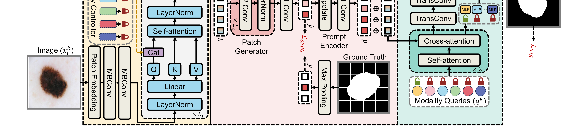

**Abstract**  
TBD

**Summary**  
TBD

[⬆ Back to Literature Table](#samothers)

---

### <a id="sam-driven-weakly-supervised-nodule-segmentation-e2675158">SAM-Driven Weakly Supervised Nodule Segmentation with Uncertainty-Aware Cross Teaching</a>
> **Venue:** 2024 IEEE International Symposium on Biomedical Imaging (ISBI)  
> **Authors:** X. Zhao et al.  
> **Keywords:** Weakly-SupervisedMIS, SAM
**Links**  
[Viewable Link](https://ieeexplore.ieee.org/document/10635682/) [Original Link](https://arxiv.org/pdf/2407.13553)

  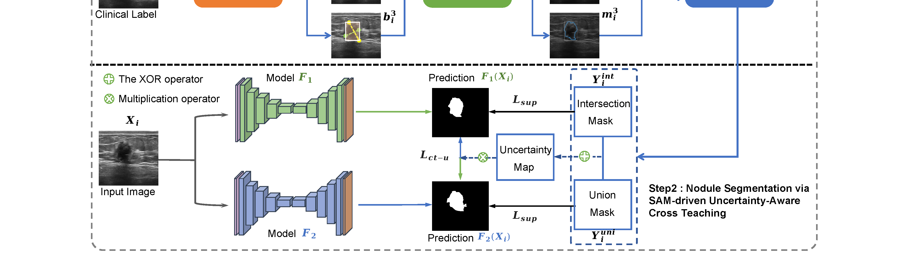

**Abstract**  
Automated nodule segmentation is essential for computer-assisted diagnosis in ultrasound images. Nevertheless, most existing methods depend on precise pixel-level annotations by medical professionals, a process that is both costly and labor-intensive. Recently, segmentation foundation models like SAM have shown impressive generalizability on natural images, suggesting their potential as pseudo-labelers. However, accurate prompts remain crucial for their success in medical images. In this work, we devise a novel weakly supervised framework that effectively utilizes the segmentation foundation model to generate pseudo-labels from aspect ration annotations for automatic nodule segmentation. Specifically, we develop three types of bounding box prompts based on scalable shape priors, followed by an adaptive pseudo-label selection module to fully exploit the prediction capabilities of the foundation model for nodules. We also present a SAM-driven uncertainty-aware cross-teaching strategy. This approach integrates SAM-based uncertainty estimation and label-space perturbations into cross-teaching to mitigate the impact of pseudo-label inaccuracies on model training. Extensive experiments on two clinically collected ultrasound datasets demonstrate the superior performance of our proposed method.

**Summary**  
TBD

[⬆ Back to Literature Table](#samwsmis)

---

### <a id="protosam-one-shot-medical-image-segmentation-wit-033cc5d9">ProtoSAM: One-Shot Medical Image Segmentation With Foundational Models</a>
> **Venue:** Scientific Reports 2025  
> **Authors:** Q. Xu et al.  
> **Keywords:** Few-ShotMIS, SAM
**Links**  
[Viewable Link](https://www.nature.com/articles/s41598-025-06643-0) [Original Link](https://arxiv.org/pdf/2407.07042) [Code](https://github.com/levayz/ProtoSAM)

  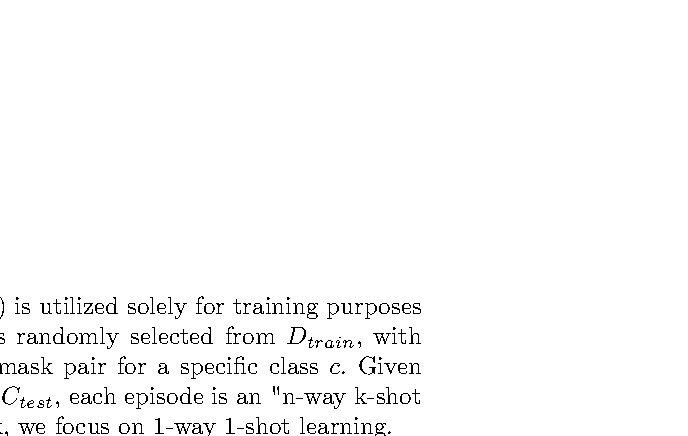

**Abstract**  
This work introduces a new framework, ProtoSAM, for one-shot medical image segmentation. It combines the use of prototypical networks, known for few-shot segmentation, with SAM - a natural image foundation model. The method proposed creates an initial coarse segmentation mask using the ALPnet prototypical network, augmented with a DINOv2 encoder. Following the extraction of an initial mask, prompts are extracted, such as points and bounding boxes, which are then input into the Segment Anything Model (SAM). State-of-the-art results are shown on several medical image datasets and demonstrate automated segmentation capabilities using a single image example (one shot) with no need for fine-tuning of the foundation model. Our code is available at: https://github.com/levayz/ProtoSAM

**Summary**  
TBD

[⬆ Back to Literature Table](#samfsmis)

---

### <a id="cyclesam-one-shot-surgical-scene-segmentation-us-0fbd9e98">CycleSAM: One-Shot Surgical Scene Segmentation using Cycle-Consistent Feature Matching to Prompt SAM</a>
> **Venue:** 2024  
> **Authors:** A. Murali et al.  
> **Keywords:** Few-ShotMIS, SAM
**Links**  
[Viewable Link](https://arxiv.org/pdf/2407.06795)

  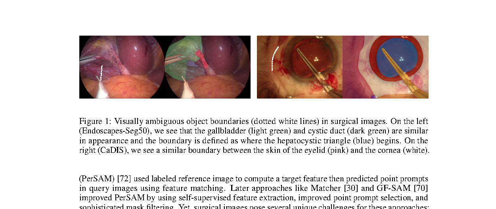

**Abstract**  
TBD

**Summary**  
TBD

[⬆ Back to Literature Table](#samfsmis)

---

### <a id="tinysam-med3d-a-lightweight-segment-anything-mod-55d33a8d">TinySAM-Med3D: A Lightweight Segment Anything Model for Volumetric Medical Imaging with Mixture of Experts</a>
> **Venue:** Lecture Notes in Computer Science 2024  
> **Authors:** T. Song et al.  
> **Keywords:** OtherMIS, SAM
**Links**  
[Viewable Link](https://link.springer.com/10.1007/978-3-031-66535-6_15) [Original Link](https://link.springer.com/chapter/10.1007/978-3-031-66535-6_15)

  <!-- Add image to imgs/ and uncomment the img tag below. -->
  <!--  -->

**Abstract**  
TBD

**Summary**  
TBD

[⬆ Back to Literature Table](#samothers)

---

### <a id="mba-net-sam-driven-bidirectional-aggregation-net-1e3eb007">MBA-Net: SAM-driven Bidirectional Aggregation Network for Ovarian Tumor Segmentation</a>
> **Venue:** Lecture Notes in Computer Science 2024  
> **Authors:** Y. Gao et al.  
> **Keywords:** OtherMIS, SAM
**Links**  
[Viewable Link](https://link.springer.com/10.1007/978-3-031-72120-5_41) [Original Link](https://arxiv.org/pdf/2407.05984)

  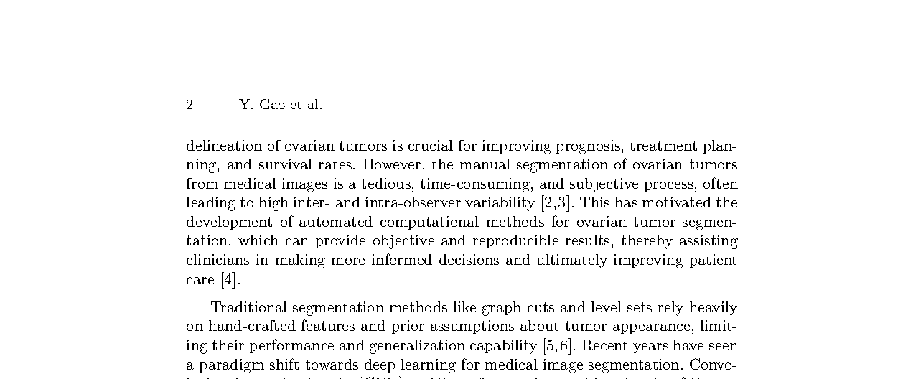

**Abstract**  
Accurate segmentation of ovarian tumors from medical images is crucial for early diagnosis, treatment planning, and patient management. However, the diverse morphological characteristics and heterogeneous appearances of ovarian tumors pose significant challenges to automated segmentation methods. In this paper, we propose MBA-Net, a novel architecture that integrates the powerful segmentation capabilities of the Segment Anything Model (SAM) with domain-specific knowledge for accurate and robust ovarian tumor segmentation. MBA-Net employs a hybrid encoder architecture, where the encoder consists of a prior branch, which inherits the SAM encoder to capture robust segmentation priors, and a domain branch, specifically designed to extract domain-specific features. The bidirectional flow of information between the two branches is facilitated by the robust feature injection network (RFIN) and the domain knowledge integration network (DKIN), enabling MBA-Net to leverage the complementary strengths of both branches. We extensively evaluate MBA-Net on the public multi-modality ovarian tumor ultrasound dataset and the in-house multi-site ovarian tumor MRI dataset. Our proposed method consistently outperforms state-of-the-art segmentation approaches. Moreover, MBA-Net demonstrates superior generalization capability across different imaging modalities and clinical sites.

**Summary**  
TBD

[⬆ Back to Literature Table](#samothers)

---

### <a id="cross-prompting-consistency-with-segment-anythin-224fb66c">Cross Prompting Consistency with Segment Anything Model for Semi-supervised Medical Image Segmentation</a>
> **Venue:** Lecture Notes in Computer Science 2024  
> **Authors:** J. Miao et al.  
> **Keywords:** SSLMIS, SAM
**Links**  
[Viewable Link](https://link.springer.com/10.1007/978-3-031-72120-5_16) [Original Link](https://arxiv.org/pdf/2407.05416) [Code](https://github.com/JuzhengMiao/CPC-SAM)

  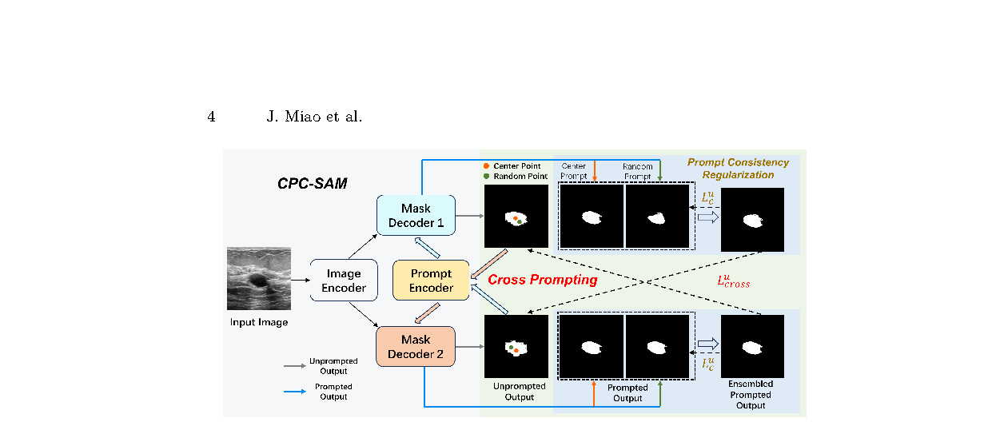

**Abstract**  
Semi-supervised learning (SSL) has achieved notable progress in medical image segmentation. To achieve effective SSL, a model needs to be able to efficiently learn from limited labeled data and effectively exploiting knowledge from abundant unlabeled data. Recent developments in visual foundation models, such as the Segment Anything Model (SAM), have demonstrated remarkable adaptability with improved sample efficiency. To harness the power of foundation models for application in SSL, we propose a cross prompting consistency method with segment anything model (CPC-SAM) for semi-supervised medical image segmentation. Our method employs SAM's unique prompt design and innovates a cross-prompting strategy within a dual-branch framework to automatically generate prompts and supervisions across two decoder branches, enabling effectively learning from both scarce labeled and valuable unlabeled data. We further design a novel prompt consistency regularization, to reduce the prompt position sensitivity and to enhance the output invariance under different prompts. We validate our method on two medical image segmentation tasks. The extensive experiments with different labeled-data ratios and modalities demonstrate the superiority of our proposed method over the state-of-the-art SSL methods, with more than 9% Dice improvement on the breast cancer segmentation task.

**Summary**  
TBD

[⬆ Back to Literature Table](#samsslmis)

---

### <a id="sam-med3d-moe-towards-a-non-forgetting-segment-a-cfefd28d">SAM-Med3D-MoE: Towards a Non-Forgetting Segment Anything Model via Mixture of Experts for 3D Medical Image Segmentation</a>
> **Venue:** Lecture Notes in Computer Science 2024  
> **Authors:** G. Wang et al.  
> **Keywords:** SSLMIS, SAM
**Links**  
[Viewable Link](https://link.springer.com/10.1007/978-3-031-72114-4_53) [Original Link](https://arxiv.org/pdf/2407.04938)

  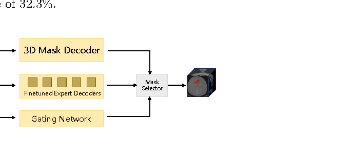

**Abstract**  
Volumetric medical image segmentation is pivotal in enhancing disease diagnosis, treatment planning, and advancing medical research. While existing volumetric foundation models for medical image segmentation, such as SAM-Med3D and SegVol, have shown remarkable performance on general organs and tumors, their ability to segment certain categories in clinical downstream tasks remains limited. Supervised Finetuning (SFT) serves as an effective way to adapt such foundation models for task-specific downstream tasks but at the cost of degrading the general knowledge previously stored in the original foundation model.To address this, we propose SAM-Med3D-MoE, a novel framework that seamlessly integrates task-specific finetuned models with the foundational model, creating a unified model at minimal additional training expense for an extra gating network. This gating network, in conjunction with a selection strategy, allows the unified model to achieve comparable performance of the original models in their respective tasks both general and specialized without updating any parameters of them.Our comprehensive experiments demonstrate the efficacy of SAM-Med3D-MoE, with an average Dice performance increase from 53 to 56.4 on 15 specific classes. It especially gets remarkable gains of 29.6, 8.5, 11.2 on the spinal cord, esophagus, and right hip, respectively. Additionally, it achieves 48.9 Dice on the challenging SPPIN2023 Challenge, significantly surpassing the general expert's performance of 32.3. We anticipate that SAM-Med3D-MoE can serve as a new framework for adapting the foundation model to specific areas in medical image analysis. Codes and datasets will be publicly available.

**Summary**  
TBD

[⬆ Back to Literature Table](#samsslmis)

---

### <a id="quantification-of-cardiac-capillarization-in-bas-f0973e37">Quantification of cardiac capillarization in basement-membrane-immunostained myocardial slices using Segment Anything Model</a>
> **Venue:** Scientific Reports 2024  
> **Authors:** Z. Zhang et al.  
> **Keywords:** Weakly-SupervisedMIS, SAM
**Links**  
[Viewable Link](https://www.nature.com/articles/s41598-024-65567-3)

  <!-- Add image to imgs/ and uncomment the img tag below. -->
  <!--  -->

**Abstract**  
Abstract Decreased myocardial capillary density has been reported as an important histopathological feature associated with various heart disorders. Quantitative assessment of cardiac capillarization typically involves double immunostaining of cardiomyocytes (CMs) and capillaries in myocardial slices. In contrast, single immunostaining of basement membrane protein is a straightforward approach to simultaneously label CMs and capillaries, presenting fewer challenges in background staining. However, subsequent image analysis always requires expertise and laborious manual work to identify and segment CMs/capillaries. Here, we developed an image analysis tool, AutoQC, for automatic identification and segmentation of CMs and capillaries in immunofluorescence images of basement membrane. Commonly used capillarization-related measurements can be derived from segmentation results. By leveraging the power of a pre-trained segmentation model (Segment Anything Model, SAM) via prompt engineering, the training of AutoQC required only a small dataset with bounding box annotations instead of pixel-wise annotations. AutoQC outperformed SAM (without prompt engineering) and YOLOv8-Seg, a state-of-the-art instance segmentation model, in both instance segmentation and capillarization assessment. Thus, AutoQC, featuring a weakly supervised algorithm, enables automatic segmentation and high-throughput, high-accuracy capillarization assessment in basement-membrane-immunostained myocardial slices. This approach reduces the training workload and eliminates the need for manual image analysis once AutoQC is trained.

**Summary**  
TBD

[⬆ Back to Literature Table](#samwsmis)

---

### <a id="asps-augmented-segment-anything-model-for-polyp-2556af92">ASPS: Augmented Segment Anything Model for Polyp Segmentation</a>
> **Venue:** Lecture Notes in Computer Science 2024  
> **Authors:** H. Li et al.  
> **Keywords:** OtherMIS, SAM
**Links**  
[Viewable Link](https://link.springer.com/10.1007/978-3-031-72114-4_12) [Original Link](https://arxiv.org/pdf/2407.00718) [Code](https://github.com/HuiqianLi/ASPS)

  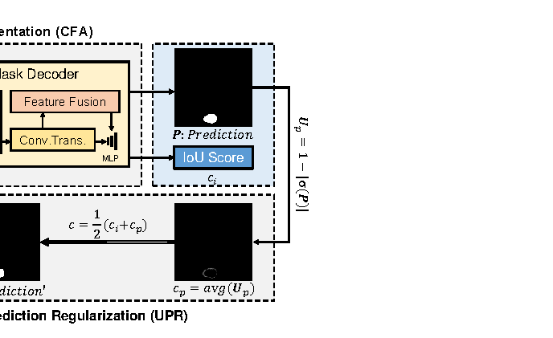

**Abstract**  
Polyp segmentation plays a pivotal role in colorectal cancer diagnosis. Recently, the emergence of the Segment Anything Model (SAM) has introduced unprecedented potential for polyp segmentation, leveraging its powerful pre-training capability on large-scale datasets. However, due to the domain gap between natural and endoscopy images, SAM encounters two limitations in achieving effective performance in polyp segmentation. Firstly, its Transformer-based structure prioritizes global and low-frequency information, potentially overlooking local details, and introducing bias into the learned features. Secondly, when applied to endoscopy images, its poor out-of-distribution (OOD) performance results in substandard predictions and biased confidence output. To tackle these challenges, we introduce a novel approach named Augmented SAM for Polyp Segmentation (ASPS), equipped with two modules: Cross-branch Feature Augmentation (CFA) and Uncertainty-guided Prediction Regularization (UPR). CFA integrates a trainable CNN encoder branch with a frozen ViT encoder, enabling the integration of domain-specific knowledge while enhancing local features and high-frequency details. Moreover, UPR ingeniously leverages SAM's IoU score to mitigate uncertainty during the training procedure, thereby improving OOD performance and domain generalization. Extensive experimental results demonstrate the effectiveness and utility of the proposed method in improving SAM's performance in polyp segmentation. Our code is available at https://github.com/HuiqianLi/ASPS.

**Summary**  
TBD

[⬆ Back to Literature Table](#samothers)

---

### <a id="simtxtseg-weakly-supervised-medical-image-segmen-366d0db5">SimTxtSeg: Weakly-Supervised Medical Image Segmentation with Simple Text Cues</a>
> **Venue:** Lecture Notes in Computer Science 2024  
> **Authors:** Y. Xie et al.  
> **Keywords:** OtherMIS, SAM
**Links**  
[Viewable Link](https://link.springer.com/10.1007/978-3-031-72111-3_60) [Original Link](https://arxiv.org/pdf/2406.19364)

  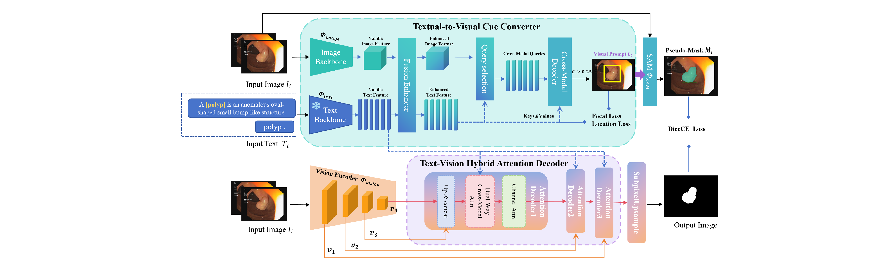

**Abstract**  
Weakly-supervised medical image segmentation is a challenging task that aims to reduce the annotation cost while keep the segmentation performance. In this paper, we present a novel framework, SimTxtSeg, that leverages simple text cues to generate high-quality pseudo-labels and study the cross-modal fusion in training segmentation models, simultaneously. Our contribution consists of two key components: an effective Textual-to-Visual Cue Converter that produces visual prompts from text prompts on medical images, and a text-guided segmentation model with Text-Vision Hybrid Attention that fuses text and image features. We evaluate our framework on two medical image segmentation tasks: colonic polyp segmentation and MRI brain tumor segmentation, and achieve consistent state-of-the-art performance. Source code is available at: https://github.com/xyx1024/SimTxtSeg.

**Summary**  
TBD

[⬆ Back to Literature Table](#samothers)

---

### <a id="memsam-taming-segment-anything-model-for-echocar-c686f516">MemSAM: Taming Segment Anything Model for Echocardiography Video Segmentation</a>
> **Venue:** 2024 IEEE/CVF Conference on Computer Vision and Pattern Recognition (CVPR)  
> **Authors:** X. Deng et al.  
> **Keywords:** OtherMIS, SAM
**Links**  
[Viewable Link](https://ieeexplore.ieee.org/document/10656025/) [Original Link](https://openaccess.thecvf.com/content/CVPR2024/papers/Deng_MemSAM_Taming_Segment_Anything_Model_for_Echocardiography_Video_Segmentation_CVPR_2024_paper.pdf) [Code](https://github.com/dengxl0520/MemSAM)

  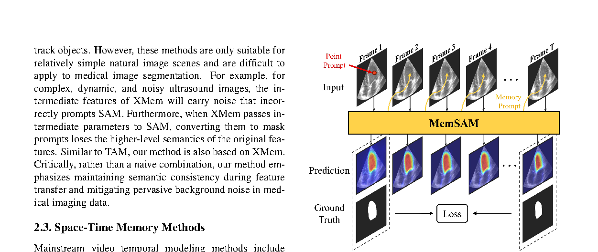

**Abstract**  
TBD

**Summary**  
TBD

[⬆ Back to Literature Table](#samothers)

---

### <a id="training-like-a-medical-resident-context-prior-l-2cf1d418">Training Like a Medical Resident: Context-Prior Learning Toward Universal Medical Image Segmentation</a>
> **Venue:** 2024 IEEE/CVF Conference on Computer Vision and Pattern Recognition (CVPR)  
> **Authors:** Y. Gao  
> **Keywords:** OtherMIS, SAM
**Links**  
[Viewable Link](https://ieeexplore.ieee.org/document/10658004/) [Original Link](https://openaccess.thecvf.com/content/CVPR2024/papers/Gao_Training_Like_a_Medical_Resident_Context-Prior_Learning_Toward_Universal_Medical_CVPR_2024_paper.pdf) [Code](https://github.com/yhygao/universal-medical-image-segmentation)

  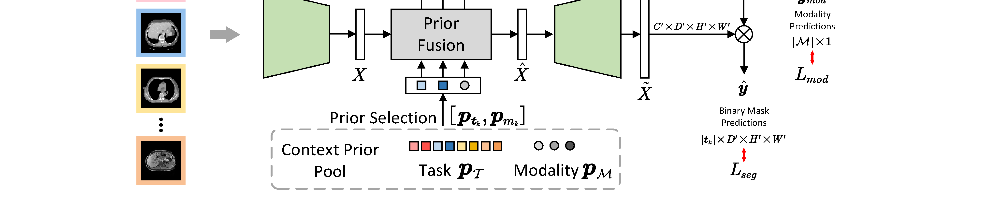

**Abstract**  
A major focus of clinical imaging workflow is disease diagnosis and management, leading to medical imaging datasets strongly tied to specific clinical objectives. This scenario has led to the prevailing practice of developing task-specific segmentation models, without gaining insights from widespread imaging cohorts. Inspired by the training program of medical radiology residents, we propose a shift towards universal medical image segmentation, a paradigm aiming to build medical image understanding foundation models by leveraging the diversity and commonality across clinical targets, body regions, and imaging modalities. Towards this goal, we develop Hermes, a novel context-prior learning approach to address the challenges of data heterogeneity and annotation differences in medical image segmentation. In a large collection of eleven diverse datasets (2,438 3D images) across five modalities (CT, PET, T1, T2 and cine MRI) and multiple body regions, we demonstrate the merit of the universal paradigm over the traditional paradigm on addressing multiple tasks within a single model. By exploiting the synergy across tasks, Hermes achieves state-of-the-art performance on all testing datasets and shows superior model scalability. Results on two additional datasets reveals Hermes' strong performance for transfer learning, incremental learning, and generalization to downstream tasks. Hermes's learned priors demonstrate an appealing trait to reflect the intricate relations among tasks and modalities, which aligns with the established anatomical and imaging principles in radiology. The code is available: https://github.com/yhygao/universal-medical-image-segmentation.

**Summary**  
TBD

[⬆ Back to Literature Table](#samothers)

---

### <a id="how-sam-perceives-different-mp-mri-brain-tumor-d-cab11a15">How SAM Perceives Different mp-MRI Brain Tumor Domains?</a>
> **Venue:** 2024 IEEE/CVF Conference on Computer Vision and Pattern Recognition Workshops (CVPRW)  
> **Authors:** CD. Albelda et al.  
> **Keywords:** OtherMIS, SAM
**Links**  
[Viewable Link](https://ieeexplore.ieee.org/document/10678163/) [Original Link](https://openaccess.thecvf.com/content/CVPR2024W/DEF-AI-MIA/papers/Diana-Albelda_How_SAM_Perceives_Different_mp-MRI_Brain_Tumor_Domains_CVPRW_2024_paper.pdf) [Code](github.com/vpulab/med-sam-brain)

  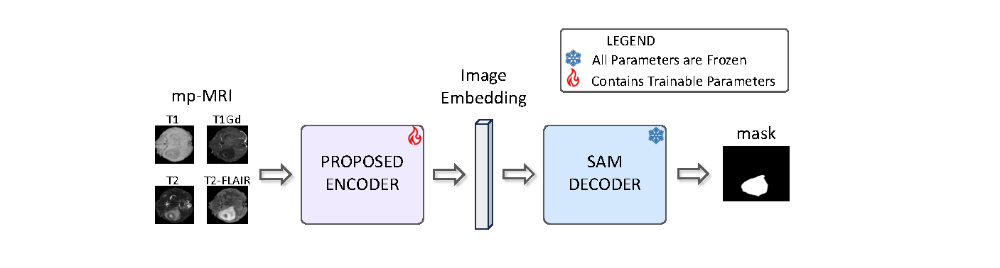

**Abstract**  
Gliomas, among the deadliest forms of cancer, are brain tumors that present a significant challenge due to their rapid progression and resistance to treatment. Effective and early diagnosis is critical for improving patient prognosis. Deep learning, particularly through large-scale vision models like Segment Anything Model (SAM), offers a new pathway for tumor segmentation. This study seeks to address the primary challenge of adapting SAM for mp-MRI brain scans, which typically encompass multiple imaging modalities not fully utilized by standard three-channel vision models. We demonstrate that leveraging all available MRI modalities achieves superior performance compared to the standard mechanism of repeating a MRI scan to fit the input embedding. Our research also focuses on parameter-efficient tuning of SAM to effectively train the model while minimizing resource usage, showcasing significant improvements when evaluated across multiple datasets. Finally, we expose how SAM perceives differences across varied brain tumor domains by visually analyzing the features extracted on each of them. Our code and models are available at github.com/vpulab/med-sam-brain.

**Summary**  
TBD

[⬆ Back to Literature Table](#samothers)

---

### <a id="improving-segment-anything-on-the-fly-auxiliary-2672bda8">Improving Segment Anything on the Fly: Auxiliary Online Learning and Adaptive Fusion for Medical Image Segmentation</a>
> **Venue:** arXiv.org 2024  
> **Authors:** T. Huang et al.  
> **Keywords:** OtherMIS, SAM
**Links**  
[Viewable Link](https://arxiv.org/abs/2406.00956) [Original Link](https://arxiv.org/pdf/2406.00956) [Code](https://sam-auxol.github.io/AuxOL/)

  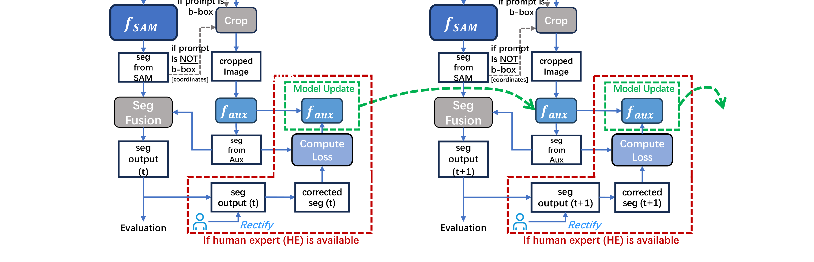

**Abstract**  
The current variants of the Segment Anything Model (SAM), which include the original SAM and Medical SAM, still lack the capability to produce sufficiently accurate segmentation for medical images. In medical imaging contexts, it is not uncommon for human experts to rectify segmentations of specific test samples after SAM generates its segmentation predictions. These rectifications typically entail manual or semi-manual corrections employing state-of-the-art annotation tools. Motivated by this process, we introduce a novel approach that leverages the advantages of online machine learning to enhance Segment Anything (SA) during test time. We employ rectified annotations to perform online learning, with the aim of improving the segmentation quality of SA on medical images. To improve the effectiveness and efficiency of online learning when integrated with large-scale vision models like SAM, we propose a new method called Auxiliary Online Learning (AuxOL). AuxOL creates and applies a small auxiliary model (specialist) in conjunction with SAM (generalist), entails adaptive online-batch and adaptive segmentation fusion. Experiments conducted on eight datasets covering four medical imaging modalities validate the effectiveness of the proposed method. Our work proposes and validates a new, practical, and effective approach for enhancing SA on downstream segmentation tasks (e.g., medical image segmentation).

**Summary**  
TBD

[⬆ Back to Literature Table](#samothers)

---

### <a id="simsam-zero-shot-medical-image-segmentation-via-61a15d39">SimSAM: Zero-shot Medical Image Segmentation via Simulated Interaction</a>
> **Venue:** 2024 IEEE International Symposium on Biomedical Imaging (ISBI)  
> **Authors:** B. Towle et al.  
> **Keywords:** Zero-ShotMIS, SAM
**Links**  
[Viewable Link](https://ieeexplore.ieee.org/document/10635227/) [Original Link](https://arxiv.org/pdf/2406.00663) [Code](https://github.com/BenjaminTowle/SimSAM)

  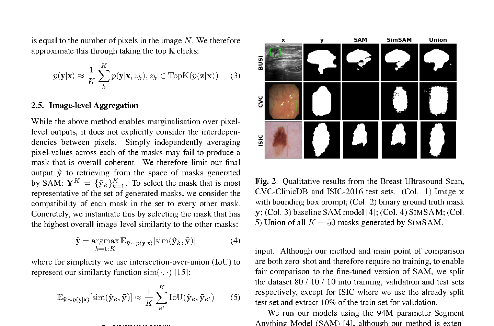

**Abstract**  
The recently released Segment Anything Model (SAM) has shown powerful zero-shot segmentation capabilities through a semi-automatic annotation setup in which the user can provide a prompt in the form of clicks or bounding boxes. There is growing interest around applying this to medical imaging, where the cost of obtaining expert annotations is high, privacy restrictions may limit sharing of patient data, and model generalisation is often poor. However, there are large amounts of inherent uncertainty in medical images, due to unclear object boundaries, low-contrast media, and differences in expert labelling style. Currently, SAM is known to struggle in a zero-shot setting to adequately annotate the contours of the structure of interest in medical images, where the uncertainty is often greatest, thus requiring significant manual correction. To mitigate this, we introduce \textbf{Sim}ulated Interaction for \textbf{S}egment \textbf{A}nything \textbf{M}odel (\textsc{\textbf{SimSAM}}), an approach that leverages simulated user interaction to generate an arbitrary number of candidate masks, and uses a novel aggregation approach to output the most compatible mask. Crucially, our method can be used during inference directly on top of SAM, without any additional training requirement. Quantitatively, we evaluate our method across three publicly available medical imaging datasets, and find that our approach leads to up to a 15.5\% improvement in contour segmentation accuracy compared to zero-shot SAM. Our code is available at \url{https://github.com/BenjaminTowle/SimSAM}.

**Summary**  
TBD

[⬆ Back to Literature Table](#samzsmis)

---

### <a id="lesam-adapt-segment-anything-model-for-medical-l-f1f11947">LeSAM: Adapt Segment Anything Model for Medical Lesion Segmentation</a>
> **Venue:** IEEE Journal of Biomedical and Health Informatics 2024  
> **Authors:** Y. Gu et al.  
> **Keywords:** OtherMIS, SAM
**Links**  
[Viewable Link](https://ieeexplore.ieee.org/document/10540651/) [Original Link](https://ieeexplore.ieee.org/abstract/document/10540651)

  <!-- Add image to imgs/ and uncomment the img tag below. -->
  <!--  -->

**Abstract**  
The Segment Anything Model (SAM) is a foundational model that has demonstrated impressive results in the field of natural image segmentation. However, its performance remains suboptimal for medical image segmentation, particularly when delineating lesions with irregular shapes and low contrast. This can be attributed to the significant domain gap between medical images and natural images on which SAM was originally trained. In this paper, we propose an adaptation of SAM specifically tailored for lesion segmentation termed LeSAM. LeSAM first learns medical-specific domain knowledge through an efficient adaptation module and integrates it with the general knowledge obtained from the pre-trained SAM. Subsequently, we leverage this merged knowledge to generate lesion masks using a modified mask decoder implemented as a lightweight U-shaped network design. This modification enables better delineation of lesion boundaries while facilitating ease of training. We conduct comprehensive experiments on various lesion segmentation tasks involving different image modalities such as CT scans, MRI scans, ultrasound images, dermoscopic images, and endoscopic images. Our proposed method achieves superior performance compared to previous state-of-the-art methods in 8 out of 12 lesion segmentation tasks while achieving competitive performance in the remaining 4 datasets. Additionally, ablation studies are conducted to validate the effectiveness of our proposed adaptation modules and modified decoder.

**Summary**  
TBD

[⬆ Back to Literature Table](#samothers)

---

### <a id="development-of-urosam-a-machine-learning-model-t-c6f93648">Development of UroSAM: A Machine Learning Model to Automatically Identify Kidney Stone Composition from Endoscopic Video</a>
> **Venue:** Journal of Endourology 2024  
> **Authors:** J. Leng et al.  
> **Keywords:** OtherMIS, SAM
**Links**  
[Viewable Link](https://journals.sagepub.com/doi/10.1089/end.2023.0740) [Original Link](https://www.liebertpub.com/doi/abs/10.1089/end.2023.0740)

  <!-- Add image to imgs/ and uncomment the img tag below. -->
  <!--  -->

**Abstract**  
<b><i>Introduction:</i></b> Chemical composition analysis is important in prevention counseling for kidney stone disease. Advances in laser technology have made dusting techniques more prevalent, but this offers no consistent way to collect enough material to send for chemical analysis, leading many to forgo this test. We developed a novel machine learning (ML) model to effectively assess stone composition based on intraoperative endoscopic video data. <b><i>Methods:</i></b> Two endourologists performed ureteroscopy for kidney stones ≥ 10 mm. Representative videos were recorded intraoperatively. Individual frames were extracted from the videos, and the stone was outlined by human tracing. An ML model, UroSAM, was built and trained to automatically identify kidney stones in the images and predict the majority stone composition as follows: calcium oxalate monohydrate (COM), dihydrate (COD), calcium phosphate (CAP), or uric acid (UA). UroSAM was built on top of the publicly available Segment Anything Model (SAM) and incorporated a U-Net convolutional neural network (CNN). <b><i>Discussion:</i></b> A total of 78 ureteroscopy videos were collected; 50 were used for the model after exclusions (32 COM, 8 COD, 8 CAP, 2 UA). The ML model segmented the images with 94.77% precision. Dice coefficient (0.9135) and Intersection over Union (0.8496) confirmed good segmentation performance of the ML model. A video-wise evaluation demonstrated 60% correct classification of stone composition. Subgroup analysis showed correct classification in 84.4% of COM videos. A <i>post hoc</i> adaptive threshold technique was used to mitigate biasing of the model toward COM because of data imbalance; this improved the overall correct classification to 62% while improving the classification of COD, CAP, and UA videos. <b><i>Conclusions:</i></b> This study demonstrates the effective development of UroSAM, an ML model that precisely identifies kidney stones from natural endoscopic video data. More high-quality video data will improve the performance of the model in classifying the majority stone composition.

**Summary**  
TBD

[⬆ Back to Literature Table](#samothers)

---

### <a id="pp-sam-perturbed-prompts-for-robust-adaptation-o-ab432046">PP-SAM: Perturbed Prompts for Robust Adaptation of Segment Anything Model for Polyp Segmentation</a>
> **Venue:** 2024 IEEE/CVF Conference on Computer Vision and Pattern Recognition Workshops (CVPRW)  
> **Authors:** MM. Rahman et al.  
> **Keywords:** OtherMIS, SAM
**Links**  
[Viewable Link](https://ieeexplore.ieee.org/document/10678514/) [Original Link](https://arxiv.org/pdf/2405.16740) [Code](https://github.com/SLDGroup/PP-SAM)

  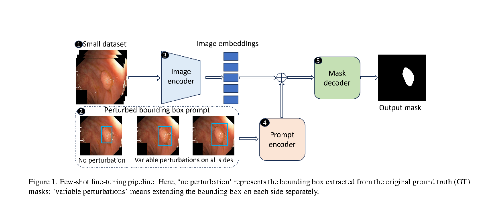

**Abstract**  
The Segment Anything Model (SAM), originally designed for general-purpose segmentation tasks, has been used recently for polyp segmentation. Nonetheless, fine-tuning SAM with data from new imaging centers or clinics poses significant challenges. This is because this necessitates the creation of an expensive and time-intensive annotated dataset, along with the potential for variability in user prompts during inference. To address these issues, we propose a robust fine-tuning technique, PP-SAM, that allows SAM to adapt to the polyp segmentation task with limited images. To this end, we utilize variable perturbed bounding box prompts (BBP) to enrich the learning context and enhance the model's robustness to BBP perturbations during inference. Rigorous experiments on polyp segmentation benchmarks reveal that our variable BBP perturbation significantly improves model resilience. Notably, on Kvasir, 1-shot fine-tuning boosts the DICE score by 20% and 37% with 50 and 100-pixel BBP perturbations during inference, respectively. Moreover, our experiments show that 1-shot, 5-shot, and 10-shot PP-SAM with 50-pixel perturbations during inference outperform a recent state-of-the-art (SOTA) polyp segmentation method by 26%, 7%, and 5% DICE scores, respectively. Our results motivate the broader applicability of our PP-SAM for other medical imaging tasks with limited samples. Our implementation is available at https://github.com/SLDGroup/PP-SAM.

**Summary**  
TBD

[⬆ Back to Literature Table](#samothers)

---

### <a id="a-foundation-model-for-brain-lesion-segmentation-7a1c3590">A Foundation Model for Brain Lesion Segmentation with Mixture of Modality Experts</a>
> **Venue:** IEEE Transactions on Medical Imaging 2025  
> **Authors:** X. Zhang et al.  
> **Keywords:** OtherMIS, SAM
**Links**  
[Viewable Link](https://ieeexplore.ieee.org/document/10879789/) [Original Link](https://arxiv.org/pdf/2405.10246) [Code](https://github.com/ZhangxinruBIT/MoME)

  

**Abstract**  
Brain lesion segmentation plays an essential role in neurological research and diagnosis. As brain lesions can be caused by various pathological alterations, different types of brain lesions tend to manifest with different characteristics on different imaging modalities. Due to this complexity, brain lesion segmentation methods are often developed in a task-specific manner. A specific segmentation model is developed for a particular lesion type and imaging modality. However, the use of task-specific models requires predetermination of the lesion type and imaging modality, which complicates their deployment in real-world scenarios. In this work, we propose a universal foundation model for 3D brain lesion segmentation, which can automatically segment different types of brain lesions for input data of various imaging modalities. We formulate a novel Mixture of Modality Experts (MoME) framework with multiple expert networks attending to different imaging modalities. A hierarchical gating network combines the expert predictions and fosters expertise collaboration. Furthermore, we introduce a curriculum learning strategy during training to avoid the degeneration of each expert network and preserve their specialization. We evaluated the proposed method on nine brain lesion datasets, encompassing five imaging modalities and eight lesion types. The results show that our model outperforms state-of-the-art universal models and provides promising generalization to unseen datasets.

**Summary**  
TBD

[⬆ Back to Literature Table](#samothers)

---

### <a id="sam3d-zero-shot-semi-automatic-segmentation-in-3-88de5a37">SAM3D: Zero-Shot Semi-Automatic Segmentation in 3D Medical Images with the Segment Anything Model</a>
> **Venue:** Medical Imaging 2025: Image Processing  
> **Authors:** TJ. Chan et al.  
> **Keywords:** Zero-ShotMIS, SAM
**Links**  
[Viewable Link](https://www.spiedigitallibrary.org/conference-proceedings-of-spie/13406/3047242/SAM3D--zero-shot-semi-automatic-segmentation-in-3D-medical/10.1117/12.3047242.full) [Original Link](https://arxiv.org/pdf/2405.06786)

  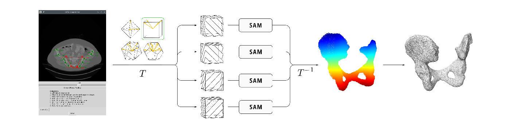

**Abstract**  
We introduce SAM3D, a new approach to semi-automatic zero-shot segmentation of 3D images building on the existing Segment Anything Model. We achieve fast and accurate segmentations in 3D images with a four-step strategy involving: user prompting with 3D polylines, volume slicing along multiple axes, slice-wide inference with a pretrained model, and recomposition and refinement in 3D. We evaluated SAM3D performance qualitatively on an array of imaging modalities and anatomical structures and quantify performance for specific structures in abdominal pelvic CT and brain MRI. Notably, our method achieves good performance with zero model training or finetuning, making it particularly useful for tasks with a scarcity of preexisting labeled data. By enabling users to create 3D segmentations of unseen data quickly and with dramatically reduced manual input, these methods have the potential to aid surgical planning and education, diagnostic imaging, and scientific research.

**Summary**  
TBD

[⬆ Back to Literature Table](#samzsmis)

---

### <a id="sammi-segment-anything-model-for-malaria-identif-8553dd51">SAMMI: Segment Anything Model for Malaria Identification</a>
> **Venue:** 19th International Joint Conference on Computer Vision, Imaging and Computer Graphics Theory and Applications 2024  
> **Authors:** HL. Zedda et al.  
> **Keywords:** OtherMIS, SAM
**Links**  
[Viewable Link](https://www.scitepress.org/DigitalLibrary/Link.aspx?doi=10.5220/0012325500003660) [Original Link](https://iris.unica.it/bitstream/11584/397665/1/2024_VISAPP_SAM.pdf)

  <!-- Add image to imgs/ and uncomment the img tag below. -->
  <!--  -->

**Abstract**  
Malaria, a life-threatening disease caused by the Plasmodium parasite, is a pressing global health challenge. Timely detection is critical for effective treatment. This paper introduces a novel computer-aided diagnosis system for detecting Plasmodium parasites in blood smear images, aiming to enhance automation and accessibility in comprehensive screening scenarios. Our approach integrates the Segment Anything Model for precise unsupervised parasite detection. It then employs a deep learning framework, combining Convolutional Neural Networks and Vision Transformer to accurately classify malaria-infected cells. We rigorously evaluate our system using the IML public dataset and compare its performance against various off-the-shelf object detectors. The results underscore the efficacy of our method, demonstrating superior accuracy in detecting and classifying malaria-infected cells. This innovative Computer-aided diagnosis system presents a reliable and near real-time solution for malaria diagnosis, offering significant potential for widespread implementation in healthcare settings. By automating the diagnosis process and ensuring high accuracy, our system can contribute to timely interventions, thereby advancing the fight against malaria globally.

**Summary**  
TBD

[⬆ Back to Literature Table](#samothers)

---

### <a id="agsam-agent-guided-segment-anything-model-for-au-d6e3e191">AGSAM: Agent-Guided Segment Anything Model for Automatic Segmentation in Few-Shot Scenarios</a>
> **Venue:** Bioengineering 2024  
> **Authors:** H. Zhou et al.  
> **Keywords:** Few-ShotMIS, SAM
**Links**  
[Viewable Link](https://www.mdpi.com/2306-5354/11/5/447)

  <!-- Add image to imgs/ and uncomment the img tag below. -->
  <!--  -->

**Abstract**  
Precise medical image segmentation of regions of interest (ROIs) is crucial for accurate disease diagnosis and progression assessment. However, acquiring high-quality annotated data at the pixel level poses a significant challenge due to the resource-intensive nature of this process. This scarcity of high-quality annotated data results in few-shot scenarios, which are highly prevalent in clinical applications. To address this obstacle, this paper introduces Agent-Guided SAM (AGSAM), an innovative approach that transforms the Segment Anything Model (SAM) into a fully automated segmentation method by automating prompt generation. Capitalizing on the pre-trained feature extraction and decoding capabilities of SAM-Med2D, AGSAM circumvents the need for manual prompt engineering, ensuring adaptability across diverse segmentation methods. Furthermore, the proposed feature augmentation convolution module (FACM) enhances model accuracy by promoting stable feature representations. Experimental evaluations demonstrate AGSAM's consistent superiority over other methods across various metrics. These findings highlight AGSAM's efficacy in tackling the challenges associated with limited annotated data while achieving high-quality medical image segmentation.

**Summary**  
TBD

[⬆ Back to Literature Table](#samfsmis)

---

### <a id="dr-sam-an-end-to-end-framework-for-vascular-segm-c6c3296e">Dr-SAM: An End-to-End Framework for Vascular Segmentation, Diameter Estimation, and Anomaly Detection on Angiography Images</a>
> **Venue:** 2024 IEEE/CVF Conference on Computer Vision and Pattern Recognition Workshops (CVPRW)  
> **Authors:** V. Zohranyan et al.  
> **Keywords:** OtherMIS, SAM
**Links**  
[Viewable Link](https://ieeexplore.ieee.org/document/10678211/) [Original Link](https://arxiv.org/pdf/2404.17029.pdf) [Code](https://github.com/vazgenzohranyan/Dr.SAM)

  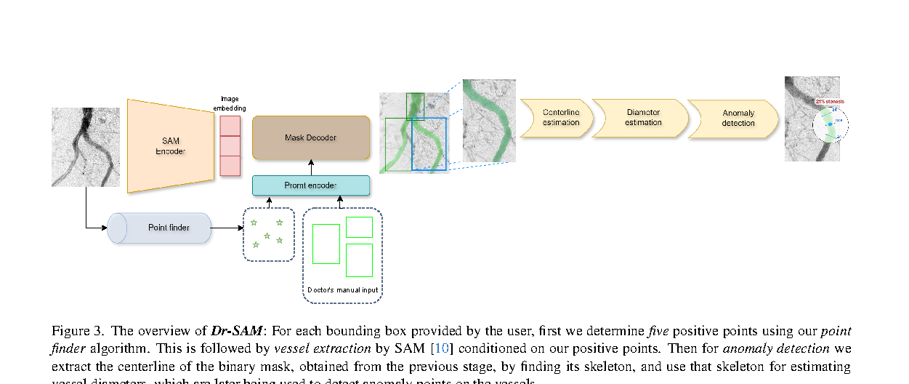

**Abstract**  
Recent advancements in AI have significantly transformed medical imaging, particularly in angiography, by enhancing diagnostic precision and patient care. However existing works are limited in analyzing the aorta and iliac arteries, above all for vascular anomaly detection and characterization. To close this gap, we propose Dr-SAM, a comprehensive multi-stage framework for vessel segmentation, diameter estimation, and anomaly analysis aiming to examine the peripheral vessels through angiography images. For segmentation we introduce a customized positive/negative point selection mechanism applied on top of the Segment Anything Model (SAM), specifically for medical (Angiography) images. Then we propose a morphological approach to determine the vessel diameters followed by our histogram-driven anomaly detection approach. Moreover, we introduce a new benchmark dataset for the comprehensive analysis of peripheral vessel angiography images which we hope can boost the upcoming research in this direction leading to enhanced diagnostic precision and ultimately better health outcomes for individuals facing vascular issues.

**Summary**  
TBD

[⬆ Back to Literature Table](#samothers)

---

### <a id="ultrasound-sam-adapter-adapting-sam-for-breast-l-21c14929">Ultrasound SAM Adapter: Adapting SAM for Breast Lesion Segmentation in Ultrasound Images</a>
> **Venue:** arXiv.org 2024  
> **Authors:** Z. Tu et al.  
> **Keywords:** OtherMIS, SAM
**Links**  
[Viewable Link](https://arxiv.org/abs/2404.14837) [Original Link](https://arxiv.org/pdf/2404.14837.pdf) [Code](https://github.com/bscs12/BUSSAM)

  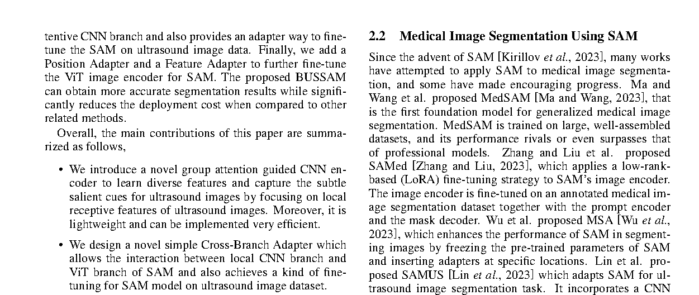

**Abstract**  
Segment Anything Model (SAM) has recently achieved amazing results in the field of natural image segmentation. However, it is not effective for medical image segmentation, owing to the large domain gap between natural and medical images. In this paper, we mainly focus on ultrasound image segmentation. As we know that it is very difficult to train a foundation model for ultrasound image data due to the lack of large-scale annotated ultrasound image data. To address these issues, in this paper, we develop a novel Breast Ultrasound SAM Adapter, termed Breast Ultrasound Segment Anything Model (BUSSAM), which migrates the SAM to the field of breast ultrasound image segmentation by using the adapter technique. To be specific, we first design a novel CNN image encoder, which is fully trained on the BUS dataset. Our CNN image encoder is more lightweight, and focuses more on features of local receptive field, which provides the complementary information to the ViT branch in SAM. Then, we design a novel Cross-Branch Adapter to allow the CNN image encoder to fully interact with the ViT image encoder in SAM module. Finally, we add both of the Position Adapter and the Feature Adapter to the ViT branch to fine-tune the original SAM. The experimental results on AMUBUS and BUSI datasets demonstrate that our proposed model outperforms other medical image segmentation models significantly. Our code will be available at: https://github.com/bscs12/BUSSAM.

**Summary**  
TBD

[⬆ Back to Literature Table](#samothers)

---

### <a id="surgical-desam-decoupling-sam-for-instrument-seg-09b2d802">Surgical-DeSAM: Decoupling SAM for Instrument Segmentation in Robotic Surgery</a>
> **Venue:** International Journal of Computer Assisted Radiology and Surgery 2024  
> **Authors:** Y. Sheng et al.  
> **Keywords:** OtherMIS, SAM
**Links**  
[Viewable Link](https://link.springer.com/10.1007/s11548-024-03163-6) [Original Link](https://arxiv.org/pdf/2404.14040.pdf)

  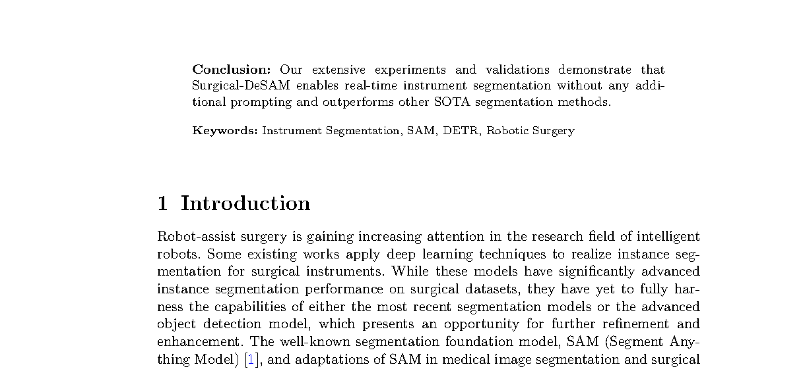

**Abstract**  
Purpose: The recent Segment Anything Model (SAM) has demonstrated impressive performance with point, text or bounding box prompts, in various applications. However, in safety-critical surgical tasks, prompting is not possible due to (i) the lack of per-frame prompts for supervised learning, (ii) it is unrealistic to prompt frame-by-frame in a real-time tracking application, and (iii) it is expensive to annotate prompts for offline applications. Methods: We develop Surgical-DeSAM to generate automatic bounding box prompts for decoupling SAM to obtain instrument segmentation in real-time robotic surgery. We utilise a commonly used detection architecture, DETR, and fine-tuned it to obtain bounding box prompt for the instruments. We then empolyed decoupling SAM (DeSAM) by replacing the image encoder with DETR encoder and fine-tune prompt encoder and mask decoder to obtain instance segmentation for the surgical instruments. To improve detection performance, we adopted the Swin-transformer to better feature representation. Results: The proposed method has been validated on two publicly available datasets from the MICCAI surgical instruments segmentation challenge EndoVis 2017 and 2018. The performance of our method is also compared with SOTA instrument segmentation methods and demonstrated significant improvements with dice metrics of 89.62 and 90.70 for the EndoVis 2017 and 2018. Conclusion: Our extensive experiments and validations demonstrate that Surgical-DeSAM enables real-time instrument segmentation without any additional prompting and outperforms other SOTA segmentation methods.

**Summary**  
TBD

[⬆ Back to Literature Table](#samothers)

---

### <a id="adapting-sam-for-surgical-instrument-tracking-an-c0fbaccd">Adapting SAM for Surgical Instrument Tracking and Segmentation in Endoscopic Submucosal Dissection Videos</a>
> **Venue:** arXiv.org 2024  
> **Authors:** J. Yu et al.  
> **Keywords:** OtherMIS, SAM
**Links**  
[Viewable Link](https://arxiv.org/abs/2404.10640) [Original Link](https://arxiv.org/pdf/2404.10640.pdf)

  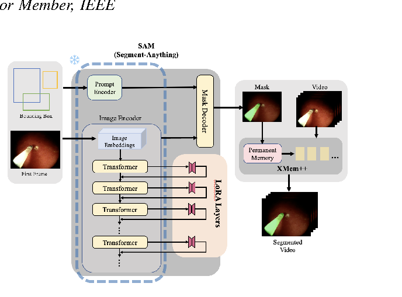

**Abstract**  
The precise tracking and segmentation of surgical instruments have led to a remarkable enhancement in the efficiency of surgical procedures. However, the challenge lies in achieving accurate segmentation of surgical instruments while minimizing the need for manual annotation and reducing the time required for the segmentation process. To tackle this, we propose a novel framework for surgical instrument segmentation and tracking. Specifically, with a tiny subset of frames for segmentation, we ensure accurate segmentation across the entire surgical video. Our method adopts a two-stage approach to efficiently segment videos. Initially, we utilize the Segment-Anything (SAM) model, which has been fine-tuned using the Low-Rank Adaptation (LoRA) on the EndoVis17 Dataset. The fine-tuned SAM model is applied to segment the initial frames of the video accurately. Subsequently, we deploy the XMem++ tracking algorithm to follow the annotated frames, thereby facilitating the segmentation of the entire video sequence. This workflow enables us to precisely segment and track objects within the video. Through extensive evaluation of the in-distribution dataset (EndoVis17) and the out-of-distribution datasets (EndoVis18 &amp; the endoscopic submucosal dissection surgery (ESD) dataset), our framework demonstrates exceptional accuracy and robustness, thus showcasing its potential to advance the automated robotic-assisted surgery.

**Summary**  
TBD

[⬆ Back to Literature Table](#samothers)

---

### <a id="how-to-build-the-best-medical-image-segmentation-933a52cf">How to build the best medical image segmentation algorithm using foundation models: a comprehensive empirical study with Segment Anything Model</a>
> **Venue:** Machine Learning for Biomedical Imaging 2025  
> **Authors:** H. Gu et al.  
> **Keywords:** Few-ShotMIS, SAM
**Links**  
[Viewable Link](https://melba-journal.org/2025:006) [Original Link](https://arxiv.org/pdf/2404.09957.pdf) [Code](https://github.com/mazurowski-lab/finetune-SAM)

  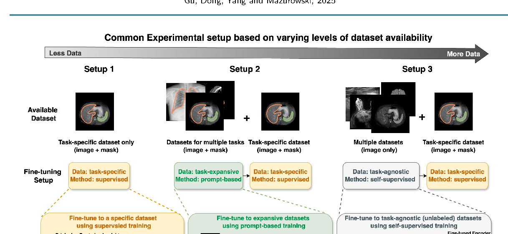

**Abstract**  
Automated segmentation is a fundamental medical image analysis task, which enjoys significant advances due to the advent of deep learning. While foundation models have been useful in natural language processing and some vision tasks for some time, the foundation model developed with image segmentation in mind - Segment Anything Model (SAM) - has been developed only recently and has shown similar promise. However, there are still no systematic analyses or "best-practice" guidelines for optimal fine-tuning of SAM for medical image segmentation. This work summarizes existing fine-tuning strategies with various backbone architectures, model components, and fine-tuning algorithms across 18 combinations, and evaluates them on 17 datasets covering all common radiology modalities. Our study reveals that (1) fine-tuning SAM leads to slightly better performance than previous segmentation methods, (2) fine-tuning strategies that use parameter-efficient learning in both the encoder and decoder are superior to other strategies, (3) network architecture has a small impact on final performance, (4) further training SAM with self-supervised learning can improve final model performance. We also demonstrate the ineffectiveness of some methods popular in the literature and further expand our experiments into few-shot and prompt-based settings. Lastly, we released our code and MRI-specific fine-tuned weights, which consistently obtained superior performance over the original SAM, at https://github.com/mazurowski-lab/finetune-SAM.

**Summary**  
TBD

[⬆ Back to Literature Table](#samfsmis)

---

### <a id="sam-i-am-semantic-boosting-for-zero-shot-atomic-f193da58">SAM-I-Am: Semantic Boosting for Zero-shot Atomic-Scale Electron Micrograph Segmentation</a>
> **Venue:** Computational Materials Science 2025  
> **Authors:** W. Abebe et al.  
> **Keywords:** Zero-ShotMIS, SAM
**Links**  
[Viewable Link](https://linkinghub.elsevier.com/retrieve/pii/S0927025624006219) [Original Link](https://arxiv.org/pdf/2404.06638.pdf)

  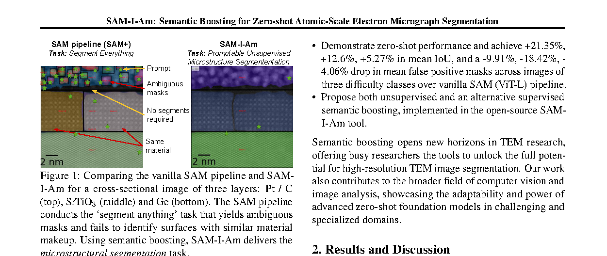

**Abstract**  
Image segmentation is a critical enabler for tasks ranging from medical diagnostics to autonomous driving. However, the correct segmentation semantics - where are boundaries located? what segments are logically similar? - change depending on the domain, such that state-of-the-art foundation models can generate meaningless and incorrect results. Moreover, in certain domains, fine-tuning and retraining techniques are infeasible: obtaining labels is costly and time-consuming; domain images (micrographs) can be exponentially diverse; and data sharing (for third-party retraining) is restricted. To enable rapid adaptation of the best segmentation technology, we propose the concept of semantic boosting: given a zero-shot foundation model, guide its segmentation and adjust results to match domain expectations. We apply semantic boosting to the Segment Anything Model (SAM) to obtain microstructure segmentation for transmission electron microscopy. Our booster, SAM-I-Am, extracts geometric and textural features of various intermediate masks to perform mask removal and mask merging operations. We demonstrate a zero-shot performance increase of (absolute) +21.35%, +12.6%, +5.27% in mean IoU, and a -9.91%, -18.42%, -4.06% drop in mean false positive masks across images of three difficulty classes over vanilla SAM (ViT-L).

**Summary**  
TBD

[⬆ Back to Literature Table](#samzsmis)

---

### <a id="test-time-adaptation-with-salip-a-cascade-of-sam-a9e284b3">Test-Time Adaptation with SaLIP: A Cascade of SAM and CLIP for Zero shot Medical Image Segmentation</a>
> **Venue:** 2024 IEEE/CVF Conference on Computer Vision and Pattern Recognition Workshops (CVPRW)  
> **Authors:** S. Aleem et al.  
> **Keywords:** Zero-ShotMIS, SAM
**Links**  
[Viewable Link](https://ieeexplore.ieee.org/document/10678616/) [Original Link](https://arxiv.org/pdf/2404.06362.pdf) [Code](https://github.com/aleemsidra/SaLIP)

  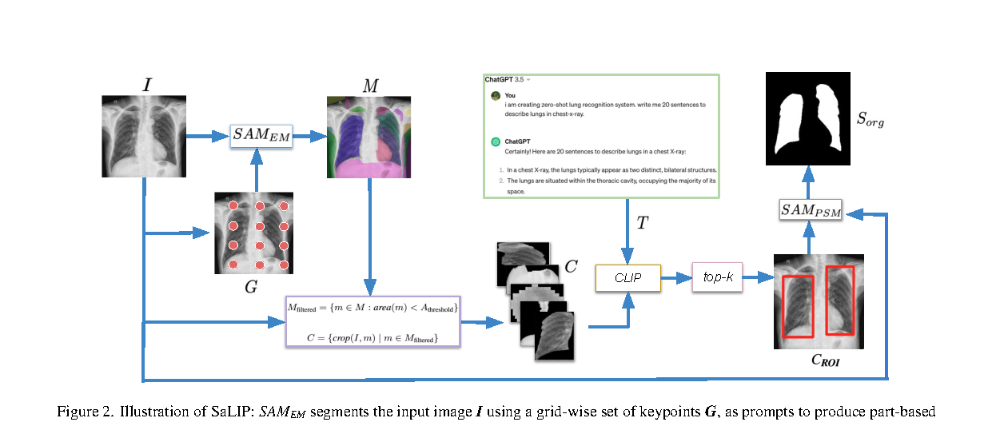

**Abstract**  
The Segment Anything Model (SAM) and CLIP are remarkable vision foundation models (VFMs). SAM, a prompt driven segmentation model, excels in segmentation tasks across diverse domains, while CLIP is renowned for its zero shot recognition capabilities. However, their unified potential has not yet been explored in medical image segmentation. To adapt SAM to medical imaging, existing methods primarily rely on tuning strategies that require extensive data or prior prompts tailored to the specific task, making it particularly challenging when only a limited number of data samples are available. This work presents an in depth exploration of integrating SAM and CLIP into a unified framework for medical image segmentation. Specifically, we propose a simple unified framework, SaLIP, for organ segmentation. Initially, SAM is used for part based segmentation within the image, followed by CLIP to retrieve the mask corresponding to the region of interest (ROI) from the pool of SAM generated masks. Finally, SAM is prompted by the retrieved ROI to segment a specific organ. Thus, SaLIP is training and fine tuning free and does not rely on domain expertise or labeled data for prompt engineering. Our method shows substantial enhancements in zero shot segmentation, showcasing notable improvements in DICE scores across diverse segmentation tasks like brain (63.46%), lung (50.11%), and fetal head (30.82%), when compared to un prompted SAM. Code and text prompts are available at: https://github.com/aleemsidra/SaLIP.

**Summary**  
TBD

[⬆ Back to Literature Table](#samzsmis)

---

### <a id="adapting-sam-to-histopathology-images-for-tumor-1620cb20">Adapting SAM to histopathology images for tumor bud segmentation in colorectal cancer</a>
> **Venue:** Medical Imaging 2024: Digital and Computational Pathology  
> **Authors:** Z. Su et al.  
> **Keywords:** OtherMIS, SAM
**Links**  
[Viewable Link](https://www.spiedigitallibrary.org/conference-proceedings-of-spie/12933/3006517/Adapting-SAM-to-histopathology-images-for-tumor-bud-segmentation-in/10.1117/12.3006517.full) [Original Link](https://www.spiedigitallibrary.org/conference-proceedings-of-spie/12933/129330C/Adapting-SAM-to-histopathology-images-for-tumor-bud-segmentation-in/10.1117/12.3006517.short#_=_)

  <!-- Add image to imgs/ and uncomment the img tag below. -->
  <!--  -->

**Abstract**  
Colorectal cancer (CRC) is the third most common cancer in the United States. Tumor Budding (TB) detection and quantification are crucial yet labor-intensive steps in determining the CRC stage through the analysis of histopathology images. To help with this process, we adapt the Segment Anything Model (SAM) on the CRC histopathology images to segment TBs using SAM-Adapter. In this approach, we automatically take task-specific prompts from CRC images and train the SAM model in a parameter-efficient way. We compare the predictions of our model with the predictions from a trained-from-scratch model using the annotations from a pathologist. As a result, our model achieves an intersection over union (IoU) of 0.65 and an instance-level Dice score of 0.75, which are promising in matching the pathologist's TB annotation. We believe our study offers a novel solution to identify TBs on H&E-stained histopathology images. Our study also demonstrates the value of adapting the foundation model for pathology image segmentation tasks.

**Summary**  
TBD

[⬆ Back to Literature Table](#samothers)

---

### <a id="barely-supervised-brain-tumor-segmentation-via-e-c7109dc6">Barely-Supervised Brain Tumor Segmentation via Employing Segment Anything Model</a>
> **Venue:** IEEE Transactions on Circuits and Systems for Video Technology 2025  
> **Authors:** Y. Ding et al.  
> **Keywords:** OtherMIS, SAM
**Links**  
[Viewable Link](https://ieeexplore.ieee.org/document/10491099/) [Original Link](https://ieeexplore.ieee.org/abstract/document/10491099)

  <!-- Add image to imgs/ and uncomment the img tag below. -->
  <!--  -->

**Abstract**  
This work explores barely-supervised brain tumor segmentation where minimal supervision, <italic xmlns:mml="http://www.w3.org/1998/Math/MathML" xmlns:xlink="http://www.w3.org/1999/xlink">i.e</i> ., fewer than ten labeled samples, is available. Current methods often neglect two key problems in barely-supervised segmentation: i) the insufficient labeled data may be not able to offer enough information to networks for accurately segmenting tumor areas across various cases; ii) networks might overfit to the relation of multiple modalities of the limited labeled data, thus overly depending on certain modalities while overlooking other valuable modalities during segmentation. To tackle these two problems, we propose a barely-supervised training framework, called BarelySAM. BarelySAM first employs Segment Anything Model (SAM) during training by generating pseudo labels for unlabeled data. In this manner, pre-trained knowledge exhibited in SAM can be exploited to compensate for limited knowledge in labeled data, boosting network training and thus improving performance. For the overfitting problem, Multi-modality Dependency Minimization (MDM) is designed in BarelySAM to construct various partial combinations for full-modal samples, thus enforcing networks to exploit each modality effectively. Experimental results on two benchmark datasets validate the effectiveness of the integrated SAM and the designed MDM module. In particular, our method attains a 89.92% Dice score for whole tumor segmentation on BRATS2020 with just 6 (2%) labeled samples, just 1.09% lower than the performance of a fully supervised approach. Besides, experiments on barely-supervised multi-modal brain tumor segmentation also validate that our method is inherently robust against missing modalities.

**Summary**  
TBD

[⬆ Back to Literature Table](#samothers)

---

### <a id="sam-att-a-prompt-free-sam-related-model-with-an-e2505893">SAM-Att: A Prompt-Free SAM-Related Model With an Attention Module for Automatic Segmentation of the Left Ventricle in Echocardiography</a>
> **Venue:** IEEE Access 2024  
> **Authors:** Y. Zhu et al.  
> **Keywords:** Zero-ShotMIS, SAM
**Links**  
[Viewable Link](https://ieeexplore.ieee.org/document/10488364/) [Original Link](https://ieeexplore.ieee.org/stamp/stamp.jsp?tp=&arnumber=10488364)

  <!-- Add image to imgs/ and uncomment the img tag below. -->
  <!--  -->

**Abstract**  
Studying the structure and function of the heart through the left ventricle is one of the most common methods for diagnosing heart diseases. The automatic segmentation of the left ventricle can be achieved through deep learning techniques, and researchers have conducted a series of explorations in this field. Recently, the segment anything model (SAM) has achieved significant success in the field of natural images, sparking considerable interest among researchers. This has led them to investigate whether SAM can also be successfully applied in the medical imaging domain. The SAM model’s interactive interface enables zero-shot and few-shot learning in the natural image domain, achieving accurate segmentation tasks. However, there are certain limitations in the automatic segmentation of medical images, specifically in the context of natural image cues such as points, boxes, and text prompts. To address this issue, this paper explores the performance of a prompt-free SAM-related model with an attention module for automatic segmentation of the left ventricle in echocardiography, named as SAM-Att. The model employs a low-rank fine-tuning strategy in the upstream, introduces an attention mechanism in the downstream, and successfully accomplishes the automatic segmentation task of the left ventricle with the support of weight files pretrained on the SAM large model. The SAM-Att model achieves dice similarity coefficient (DSC) of 94.49% and hausdorff distance (HD) of 3.505 mm on the test set. The accuracy reaches 98.83%, with precision of 93.65% and recall of 94.77%. A performance comparison of SAM-Att with other SAM-related models (SAM-b, MSA, Sam-CNN, AutoSAM, SAMed) is conducted on the same echocardiography dataset. The results indicate that the left ventricle automatic segmentation achieved the best performance when using SAM-Att.

**Summary**  
TBD

[⬆ Back to Literature Table](#samzsmis)

---

### <a id="universal-3d-ct-lesion-segmentation-using-sam-wi-cc44f814">Universal 3D CT lesion segmentation using SAM with RECIST annotation</a>
> **Venue:** Medical Imaging 2024: Image Processing  
> **Authors:** Y. Liu et al.  
> **Keywords:** OtherMIS, SAM
**Links**  
[Viewable Link](https://www.spiedigitallibrary.org/conference-proceedings-of-spie/12926/3006527/Universal-3D-CT-lesion-segmentation-using-SAM-with-RECIST-annotation/10.1117/12.3006527.full) [Original Link](https://www.spiedigitallibrary.org/conference-proceedings-of-spie/12926/1292605/Universal-3D-CT-lesion-segmentation-using-SAM-with-RECIST-annotation/10.1117/12.3006527.short#_=_)

  <!-- Add image to imgs/ and uncomment the img tag below. -->
  <!--  -->

**Abstract**  
Three-dimensional lesion segmentation is required for analysis of radiomic features and lesion growth kinetics. In clinical trials, radiologists apply the Response Evaluation Criteria in Solid Tumors (RECIST), by manually annotating the long and short diameters of a lesion on a single 2D axial slice (RECIST slice), where the lesion looks largest. We developed a novel approach that leverages the RECIST annotations to segment lesions in 3D on CT scans. We start with bounding box and center point prompts derived from RECIST long and short diameters on RECIST slice. Iteratively, we perform prompted segmentation using Segment Anything Model (SAM) on off-RECIST slices towards the superior and inferior direction until all slices are segmented. To optimize the performance of SAM, we fine-tuned the mask decoder. In addition, it is crucial to detect where the lesions disappear at the superior and inferior direction to prevent over segmentation. We developed a multi-task framework for lesion existence classification and segmentation and further compared the parallel framework and cascaded framework. We used an internal dataset consisting of 2053 and 200 3D lesions for fine-tuning of SAM decoder and testing, respectively. Baseline SAM, SAM with fine tuning, SAM with parallel multi-task fine tuning, and SAM with cascaded multitask fine tuning have Dice scores of 0.4745&plusmn;0.2138, 0.7136&plusmn;0.1277, 0.6985&plusmn;0.1312, and 0.7239&plusmn;0.1321, respectively. Our experiments proves that multi-task learning is an effective way for 3D segmentation with SAM, and cascaded framework performs better than parallel framework.

**Summary**  
TBD

[⬆ Back to Literature Table](#samothers)

---

### <a id="unleashing-the-potential-of-sam-for-medical-adap-c484b446">Unleashing the Potential of SAM for Medical Adaptation via Hierarchical Decoding</a>
> **Venue:** 2024 IEEE/CVF Conference on Computer Vision and Pattern Recognition (CVPR)  
> **Authors:** Z. Cheng et al.  
> **Keywords:** SSLMIS, SAM
**Links**  
[Viewable Link](https://ieeexplore.ieee.org/document/10656144/) [Original Link](https://arxiv.org/pdf/2403.18271.pdf) [Code](https://github.com/Cccccczh404/H-SAM)

  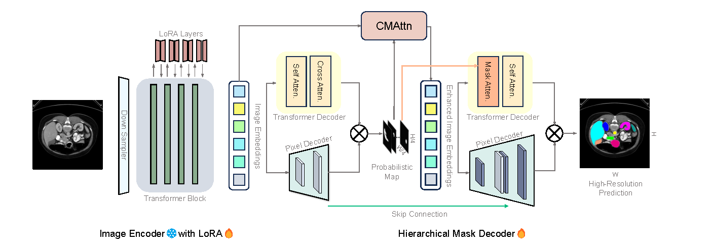

**Abstract**  
The Segment Anything Model (SAM) has garnered significant attention for its versatile segmentation abilities and intuitive prompt-based interface. However, its application in medical imaging presents challenges, requiring either substantial training costs and extensive medical datasets for full model fine-tuning or high-quality prompts for optimal performance. This paper introduces H-SAM: a prompt-free adaptation of SAM tailored for efficient fine-tuning of medical images via a two-stage hierarchical decoding procedure. In the initial stage, H-SAM employs SAM's original decoder to generate a prior probabilistic mask, guiding a more intricate decoding process in the second stage. Specifically, we propose two key designs: 1) A class-balanced, mask-guided self-attention mechanism addressing the unbalanced label distribution, enhancing image embedding; 2) A learnable mask cross-attention mechanism spatially modulating the interplay among different image regions based on the prior mask. Moreover, the inclusion of a hierarchical pixel decoder in H-SAM enhances its proficiency in capturing fine-grained and localized details. This approach enables SAM to effectively integrate learned medical priors, facilitating enhanced adaptation for medical image segmentation with limited samples. Our H-SAM demonstrates a 4.78% improvement in average Dice compared to existing prompt-free SAM variants for multi-organ segmentation using only 10% of 2D slices. Notably, without using any unlabeled data, H-SAM even outperforms state-of-the-art semi-supervised models relying on extensive unlabeled training data across various medical datasets. Our code is available at https://github.com/Cccccczh404/H-SAM.

**Summary**  
TBD

[⬆ Back to Literature Table](#samsslmis)

---

### <a id="segment-any-medical-model-extended-730407eb">Segment Any Medical Model Extended</a>
> **Venue:** Medical Imaging 2024: Image Processing  
> **Authors:** Y. Liu et al.  
> **Keywords:** InteractiveMIS, SAM
**Links**  
[Viewable Link](https://www.spiedigitallibrary.org/conference-proceedings-of-spie/12926/3001069/Segment-any-medical-model-extended/10.1117/12.3001069.full) [Original Link](https://arxiv.org/pdf/2403.18114.pdf)

  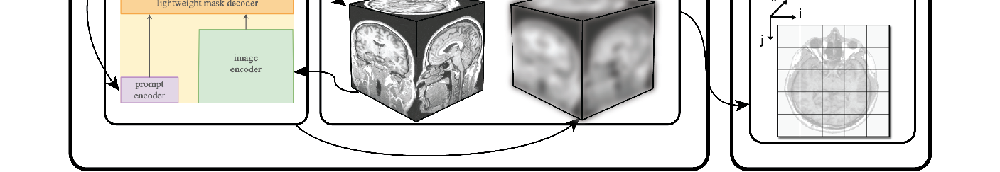

**Abstract**  
The Segment Anything Model (SAM) has drawn significant attention from researchers who work on medical image segmentation because of its generalizability. However, researchers have found that SAM may have limited performance on medical images compared to state-of-the-art non-foundation models. Regardless, the community sees potential in extending, fine-tuning, modifying, and evaluating SAM for analysis of medical imaging. An increasing number of works have been published focusing on the mentioned four directions, where variants of SAM are proposed. To this end, a unified platform helps push the boundary of the foundation model for medical images, facilitating the use, modification, and validation of SAM and its variants in medical image segmentation. In this work, we introduce SAMM Extended (SAMME), a platform that integrates new SAM variant models, adopts faster communication protocols, accommodates new interactive modes, and allows for fine-tuning of subcomponents of the models. These features can expand the potential of foundation models like SAM, and the results can be translated to applications such as image-guided therapy, mixed reality interaction, robotic navigation, and data augmentation.

**Summary**  
TBD

[⬆ Back to Literature Table](#samiwmis)

---

### <a id="anytime-anywhere-anyone-investigating-the-feasib-93111d66">Anytime, Anywhere, Anyone: Investigating the Feasibility of Segment Anything Model for Crowd-Sourcing Medical Image Annotations</a>
> **Venue:** arXiv.org 2024  
> **Authors:** P. Kulkarni et al.  
> **Keywords:** Zero-ShotMIS, SAM
**Links**  
[Viewable Link](https://arxiv.org/abs/2403.15218) [Original Link](https://arxiv.org/pdf/2403.15218.pdf)

  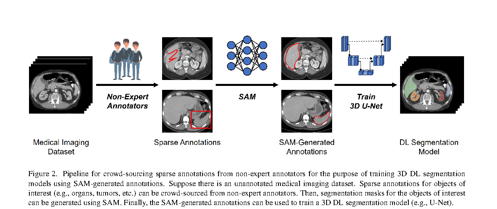

**Abstract**  
Curating annotations for medical image segmentation is a labor-intensive and time-consuming task that requires domain expertise, resulting in "narrowly" focused deep learning (DL) models with limited translational utility. Recently, foundation models like the Segment Anything Model (SAM) have revolutionized semantic segmentation with exceptional zero-shot generalizability across various domains, including medical imaging, and hold a lot of promise for streamlining the annotation process. However, SAM has yet to be evaluated in a crowd-sourced setting to curate annotations for training 3D DL segmentation models. In this work, we explore the potential of SAM for crowd-sourcing "sparse" annotations from non-experts to generate "dense" segmentation masks for training 3D nnU-Net models, a state-of-the-art DL segmentation model. Our results indicate that while SAM-generated annotations exhibit high mean Dice scores compared to ground-truth annotations, nnU-Net models trained on SAM-generated annotations perform significantly worse than nnU-Net models trained on ground-truth annotations ($p&lt;0.001$, all).

**Summary**  
TBD

[⬆ Back to Literature Table](#samzsmis)

---

### <a id="towards-a-comprehensive-efficient-and-promptable-f5b7a56f">Towards a Comprehensive, Efficient and Promptable Anatomic Structure Segmentation Model Using 3D Whole-Body CT Scans</a>
> **Venue:** AAAI Conference on Artificial Intelligence 2025  
> **Authors:** H. Guo et al.  
> **Keywords:** InteractiveMIS, SAM
**Links**  
[Viewable Link](https://ojs.aaai.org/index.php/AAAI/article/view/32335) [Original Link](https://arxiv.org/pdf/2403.15063.pdf)

  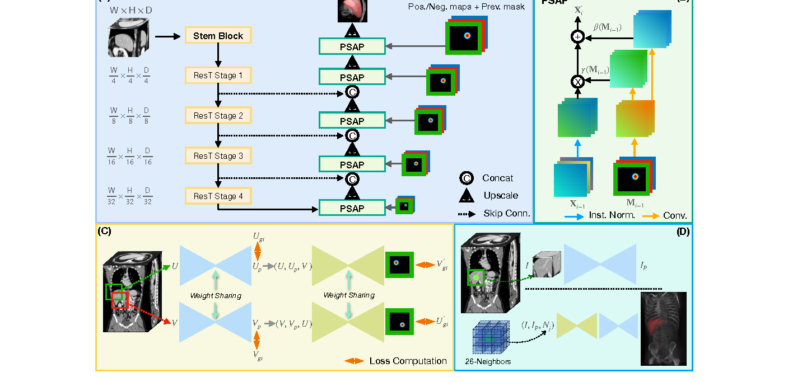

**Abstract**  
Segment anything model (SAM) demonstrates strong generalization ability on natural image segmentation. However, its direct adaptation in medical image segmentation tasks shows significant performance drops. It also requires an excessive number of prompt points to obtain a reasonable accuracy. Although quite a few studies explore adapting SAM into medical image volumes, the efficiency of 2D adaptation methods is unsatisfactory and 3D adaptation methods are only capable of segmenting specific organs/tumors. In this work, we propose a comprehensive and scalable 3D SAM model for whole-body CT segmentation, named CT-SAM3D. Instead of adapting SAM, we propose a 3D promptable segmentation model using a (nearly) fully labeled CT dataset. To train CT-SAM3D effectively, ensuring the model's accurate responses to higher-dimensional spatial prompts is crucial, and 3D patch-wise training is required due to GPU memory constraints. Therefore, we propose two key technical developments: 1) a progressively and spatially aligned prompt encoding method to effectively encode click prompts in local 3D space; and 2) a cross-patch prompt scheme to capture more 3D spatial context, which is beneficial for reducing the editing workloads when interactively prompting on large organs. CT-SAM3D is trained using a curated dataset of 1204 CT scans containing 107 whole-body anatomies and extensively validated using five datasets, achieving significantly better results against all previous SAM-derived models.

**Summary**  
TBD

[⬆ Back to Literature Table](#samiwmis)

---

### <a id="concatenate-fine-tuning-re-training-a-sam-enable-2ff23cb9">Concatenate, Fine-tuning, Re-training: A SAM-enabled Framework for Semi-supervised 3D Medical Image Segmentation</a>
> **Venue:** 2024  
> **Authors:** S. Li et al.  
> **Keywords:** SSLMIS, SAM
**Links**  
[Viewable Link](https://arxiv.org/pdf/2403.11229.pdf) [Code](https://github.com/ShumengLI/CFR)

  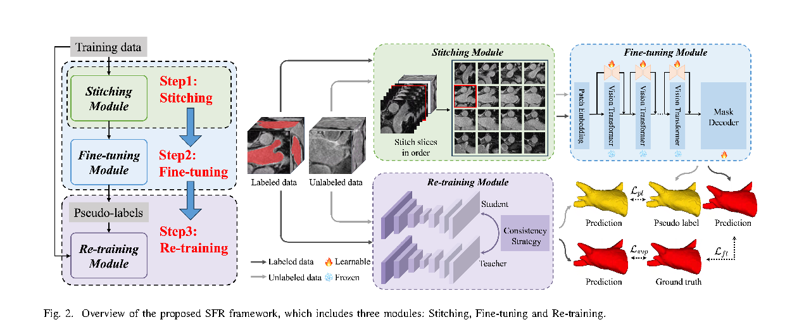

**Abstract**  
TBD

**Summary**  
TBD

[⬆ Back to Literature Table](#samsslmis)

---

### <a id="uncertainty-aware-adapter-adapting-segment-anyth-4719c570">Uncertainty-Aware Adapter: Adapting Segment Anything Model (SAM) for Ambiguous Medical Image Segmentation</a>
> **Venue:** 2024  
> **Authors:** M. Jiang et al.  
> **Keywords:** OtherMIS, SAM
**Links**  
[Viewable Link](https://arxiv.org/pdf/2403.10931.pdf)

  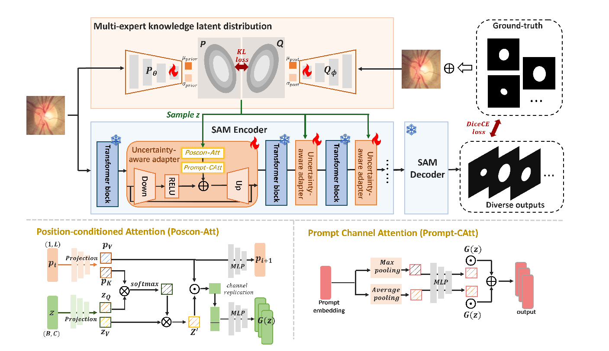

**Abstract**  
TBD

**Summary**  
TBD

[⬆ Back to Literature Table](#samothers)

---

### <a id="cardiac-magnetic-resonance-2d-t-short-and-long-a-49b4945a">Cardiac Magnetic Resonance 2D+T Short- and Long-axis Segmentation via Spatio-temporal SAM Adaptation</a>
> **Venue:** 2024  
> **Authors:** Z. Chen et al.  
> **Keywords:** OtherMIS, SAM
**Links**  
[Viewable Link](https://arxiv.org/pdf/2403.10009.pdf)

  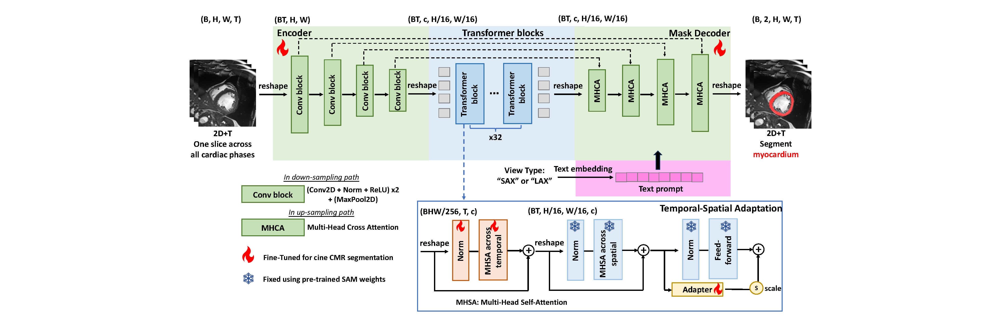

**Abstract**  
TBD

**Summary**  
TBD

[⬆ Back to Literature Table](#samothers)

---

### <a id="fastsam3d-an-efficient-segment-anything-model-fo-61183fb7">FastSAM3D: An Efficient Segment Anything Model for 3D Volumetric Medical Images</a>
> **Venue:** Lecture Notes in Computer Science 2024  
> **Authors:** Y. Shen et al.  
> **Keywords:** Zero-ShotMIS, SAM
**Links**  
[Viewable Link](https://link.springer.com/10.1007/978-3-031-72390-2_51) [Original Link](https://arxiv.org/pdf/2403.09827.pdf) [Code](https://github.com/arcadelab/FastSAM3D)

  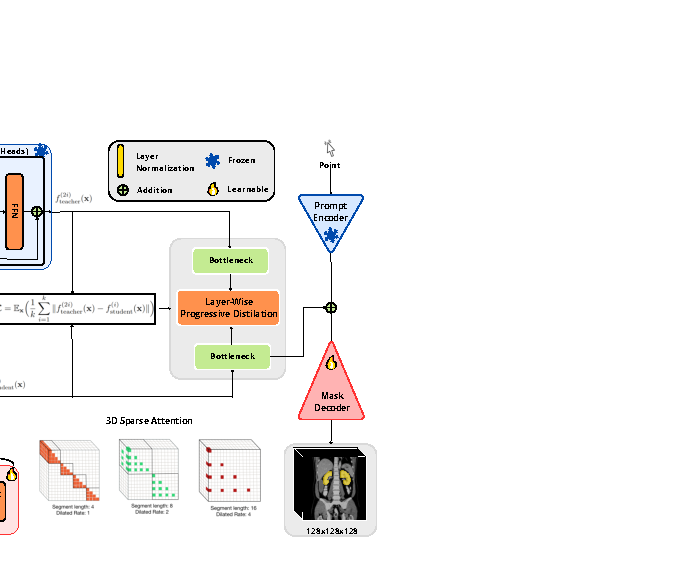

**Abstract**  
Segment anything models (SAMs) are gaining attention for their zero-shot generalization capability in segmenting objects of unseen classes and in unseen domains when properly prompted. Interactivity is a key strength of SAMs, allowing users to iteratively provide prompts that specify objects of interest to refine outputs. However, to realize the interactive use of SAMs for 3D medical imaging tasks, rapid inference times are necessary. High memory requirements and long processing delays remain constraints that hinder the adoption of SAMs for this purpose. Specifically, while 2D SAMs applied to 3D volumes contend with repetitive computation to process all slices independently, 3D SAMs suffer from an exponential increase in model parameters and FLOPS. To address these challenges, we present FastSAM3D which accelerates SAM inference to 8 milliseconds per 128*128*128 3D volumetric image on an NVIDIA A100 GPU. This speedup is accomplished through 1) a novel layer-wise progressive distillation scheme that enables knowledge transfer from a complex 12-layer ViT-B to a lightweight 6-layer ViT-Tiny variant encoder without training from scratch; and 2) a novel 3D sparse flash attention to replace vanilla attention operators, substantially reducing memory needs and improving parallelization. Experiments on three diverse datasets reveal that FastSAM3D achieves a remarkable speedup of 527.38x compared to 2D SAMs and 8.75x compared to 3D SAMs on the same volumes without significant performance decline. Thus, FastSAM3D opens the door for low-cost truly interactive SAM-based 3D medical imaging segmentation with commonly used GPU hardware. Code is available at https://github.com/arcadelab/FastSAM3D.

**Summary**  
TBD

[⬆ Back to Literature Table](#samzsmis)

---

### <a id="wsi-sam-multi-resolution-segment-anything-model-cb419997">WSI-SAM: Multi-resolution Segment Anything Model (SAM) for histopathology whole-slide images</a>
> **Venue:** arXiv.org 2024  
> **Authors:** H. Liu et al.  
> **Keywords:** Zero-ShotMIS, SAM
**Links**  
[Viewable Link](https://arxiv.org/abs/2403.09257) [Original Link](https://arxiv.org/pdf/2403.09257.pdf) [Code](https://github.com/HongLiuuuuu/WSI-SAM)

  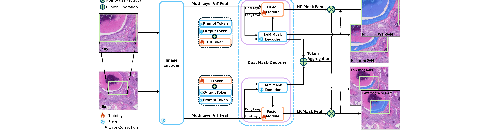

**Abstract**  
The Segment Anything Model (SAM) marks a significant advancement in segmentation models, offering robust zero-shot abilities and dynamic prompting. However, existing medical SAMs are not suitable for the multi-scale nature of whole-slide images (WSIs), restricting their effectiveness. To resolve this drawback, we present WSI-SAM, enhancing SAM with precise object segmentation capabilities for histopathology images using multi-resolution patches, while preserving its efficient, prompt-driven design, and zero-shot abilities. To fully exploit pretrained knowledge while minimizing training overhead, we keep SAM frozen, introducing only minimal extra parameters and computational overhead. In particular, we introduce High-Resolution (HR) token, Low-Resolution (LR) token and dual mask decoder. This decoder integrates the original SAM mask decoder with a lightweight fusion module that integrates features at multiple scales. Instead of predicting a mask independently, we integrate HR and LR token at intermediate layer to jointly learn features of the same object across multiple resolutions. Experiments show that our WSI-SAM outperforms state-of-the-art SAM and its variants. In particular, our model outperforms SAM by 4.1 and 2.5 percent points on a ductal carcinoma in situ (DCIS) segmentation tasks and breast cancer metastasis segmentation task (CAMELYON16 dataset). The code will be available at https://github.com/HongLiuuuuu/WSI-SAM.

**Summary**  
TBD

[⬆ Back to Literature Table](#samzsmis)

---

### <a id="segmentation-of-knee-bones-for-osteoarthritis-as-0dd3a52e">Segmentation of Knee Bones for Osteoarthritis Assessment: A Comparative Analysis of Supervised, Few-Shot, and Zero-Shot Learning Approaches</a>
> **Venue:** IFMBE Proceedings 2024  
> **Authors:** YX. Teoh et al.  
> **Keywords:** Zero-ShotMIS, SAM
**Links**  
[Viewable Link](https://link.springer.com/10.1007/978-3-031-62523-7_37) [Original Link](https://arxiv.org/pdf/2403.08761.pdf)

  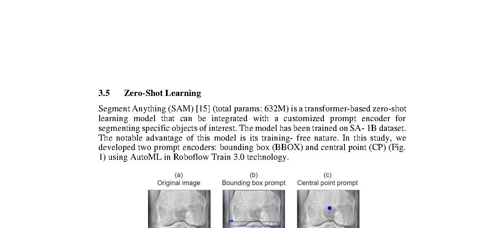

**Abstract**  
Knee osteoarthritis is a degenerative joint disease that induces chronic pain and disability. Bone morphological analysis is a promising tool to understand the mechanical aspect of this disorder. This study proposes a 2D bone morphological analysis using manually segmented bones to explore morphological features related to distinct pain conditions. Furthermore, six semantic segmentation algorithms are assessed for extracting femur and tibia bones from X-ray images. Our analysis reveals that the morphology of the femur undergoes significant changes in instances where pain worsens. Conversely, improvements in pain may not manifest pronounced alterations in bone shape. The few-shot-learning-based algorithm, UniverSeg, demonstrated superior segmentation results with Dice scores of 99.69% for femur and 99.60% for tibia. Regarding pain condition classification, the zero-shot-learning-based algorithm, CP-SAM, achieved the highest accuracy at 66% among all models. UniverSeg is recommended for automatic knee bone segmentation, while SAM models show potential with prompt encoder modifications for optimized outcomes. These findings highlight the effectiveness of few-shot learning for semantic segmentation and the potential of zero-shot learning in enhancing classification models for knee osteoarthritis diagnosis.

**Summary**  
TBD

[⬆ Back to Literature Table](#samzsmis)

---

### <a id="samda-leveraging-sam-on-few-shot-domain-adaptati-0656632f">SAMDA: Leveraging SAM on Few-Shot Domain Adaptation for Electronic Microscopy Segmentation</a>
> **Venue:** 2025 IEEE 22nd International Symposium on Biomedical Imaging (ISBI)  
> **Authors:** Y. Wang et al.  
> **Keywords:** Few-ShotMIS, SAM
**Links**  
[Viewable Link](https://ieeexplore.ieee.org/document/10980811/) [Original Link](https://arxiv.org/pdf/2403.07951.pdf)

  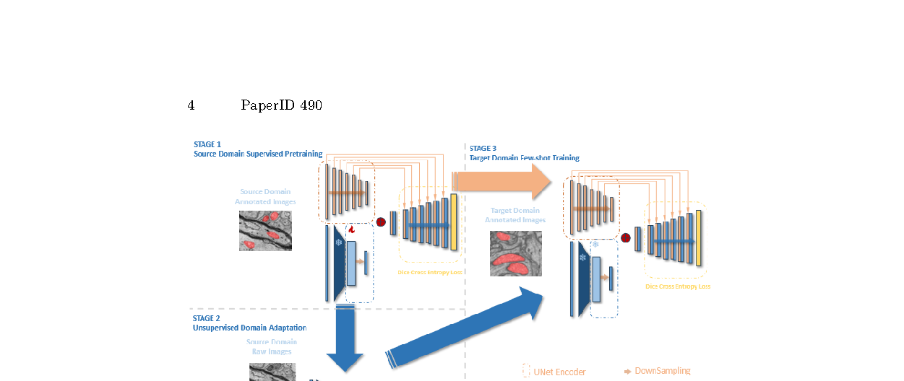

**Abstract**  
It has been shown that traditional deep learning methods for electronic microscopy segmentation usually suffer from low transferability when samples and annotations are limited, while large-scale vision foundation models are more robust when transferring between different domains but facing sub-optimal improvement under fine-tuning. In this work, we present a new few-shot domain adaptation framework SAMDA, which combines the Segment Anything Model(SAM) with nnUNet in the embedding space to achieve high transferability and accuracy. Specifically, we choose the Unet-based network as the "expert" component to learn segmentation features efficiently and design a SAM-based adaptation module as the "generic" component for domain transfer. By amalgamating the "generic" and "expert" components, we mitigate the modality imbalance in the complex pre-training knowledge inherent to large-scale Vision Foundation models and the challenge of transferability inherent to traditional neural networks. The effectiveness of our model is evaluated on two electron microscopic image datasets with different modalities for mitochondria segmentation, which improves the dice coefficient on the target domain by 6.7%. Also, the SAM-based adaptor performs significantly better with only a single annotated image than the 10-shot domain adaptation on nnUNet. We further verify our model on four MRI datasets from different sources to prove its generalization ability.

**Summary**  
TBD

[⬆ Back to Literature Table](#samfsmis)

---

### <a id="fedfms-exploring-federated-foundation-models-for-c31a08c8">FedFMS: Exploring Federated Foundation Models for Medical Image Segmentation</a>
> **Venue:** Lecture Notes in Computer Science 2024  
> **Authors:** Y. Liu et al.  
> **Keywords:** OtherMIS, SAM
**Links**  
[Viewable Link](https://link.springer.com/10.1007/978-3-031-72111-3_27) [Original Link](https://arxiv.org/pdf/2403.05408.pdf) [Code](https://github.com/LIU-YUXI/FedFMS)

  

**Abstract**  
Medical image segmentation is crucial for clinical diagnosis. The Segmentation Anything Model (SAM) serves as a powerful foundation model for visual segmentation and can be adapted for medical image segmentation. However, medical imaging data typically contain privacy-sensitive information, making it challenging to train foundation models with centralized storage and sharing. To date, there are few foundation models tailored for medical image deployment within the federated learning framework, and the segmentation performance, as well as the efficiency of communication and training, remain unexplored. In response to these issues, we developed Federated Foundation models for Medical image Segmentation (FedFMS), which includes the Federated SAM (FedSAM) and a communication and training-efficient Federated SAM with Medical SAM Adapter (FedMSA). Comprehensive experiments on diverse datasets are conducted to investigate the performance disparities between centralized training and federated learning across various configurations of FedFMS. The experiments revealed that FedFMS could achieve performance comparable to models trained via centralized training methods while maintaining privacy. Furthermore, FedMSA demonstrated the potential to enhance communication and training efficiency. Our model implementation codes are available at https://github.com/LIU-YUXI/FedFMS.

**Summary**  
TBD

[⬆ Back to Literature Table](#samothers)

---

### <a id="part-aware-personalized-segment-anything-model-f-f2d75d45">Part-aware Personalized Segment Anything Model for Patient-Specific Segmentation</a>
> **Venue:** 2024  
> **Authors:** C. Zhao et al.  
> **Keywords:** OtherMIS, SAM
**Links**  
[Viewable Link](https://arxiv.org/pdf/2403.05433.pdf)

  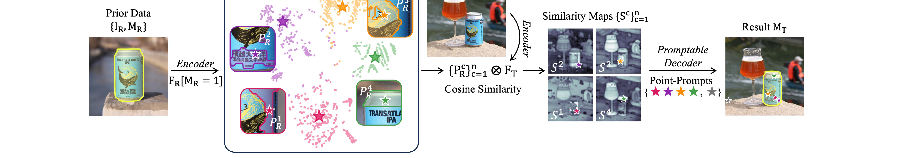

**Abstract**  
TBD

**Summary**  
TBD

[⬆ Back to Literature Table](#samothers)

---

### <a id="promise-promptable-medical-image-segmentation-us-bea5a709">ProMISe: Promptable Medical Image Segmentation using SAM</a>
> **Venue:** arXiv.org 2024  
> **Authors:** J. Wang et al.  
> **Keywords:** OtherMIS, SAM
**Links**  
[Viewable Link](https://arxiv.org/abs/2403.04164) [Original Link](https://arxiv.org/pdf/2403.04164.pdf)

  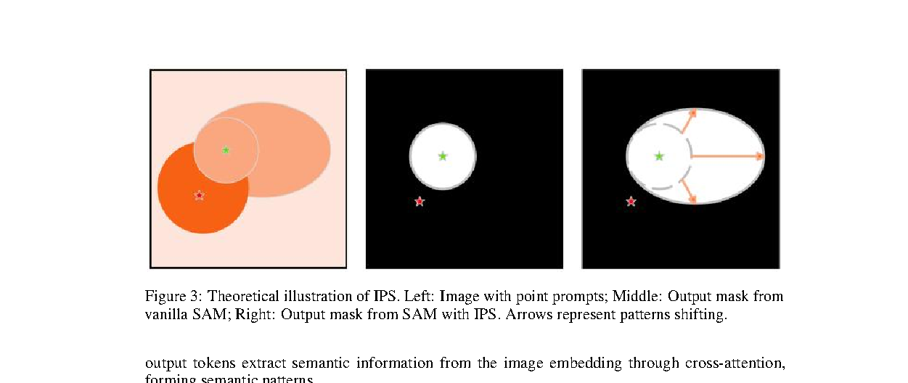

**Abstract**  
With the proposal of the Segment Anything Model (SAM), fine-tuning SAM for medical image segmentation (MIS) has become popular. However, due to the large size of the SAM model and the significant domain gap between natural and medical images, fine-tuning-based strategies are costly with potential risk of instability, feature damage and catastrophic forgetting. Furthermore, some methods of transferring SAM to a domain-specific MIS through fine-tuning strategies disable the model's prompting capability, severely limiting its utilization scenarios. In this paper, we propose an Auto-Prompting Module (APM), which provides SAM-based foundation model with Euclidean adaptive prompts in the target domain. Our experiments demonstrate that such adaptive prompts significantly improve SAM's non-fine-tuned performance in MIS. In addition, we propose a novel non-invasive method called Incremental Pattern Shifting (IPS) to adapt SAM to specific medical domains. Experimental results show that the IPS enables SAM to achieve state-of-the-art or competitive performance in MIS without the need for fine-tuning. By coupling these two methods, we propose ProMISe, an end-to-end non-fine-tuned framework for Promptable Medical Image Segmentation. Our experiments demonstrate that both using our methods individually or in combination achieves satisfactory performance in low-cost pattern shifting, with all of SAM's parameters frozen.

**Summary**  
TBD

[⬆ Back to Literature Table](#samothers)

---

### <a id="blo-sam-bi-level-optimization-based-finetuning-o-44a9cef1">BLO-SAM: Bi-Level Optimization Based Finetuning of the Segment Anything Model for Overfitting-Preventing Semantic Segmentation</a>
> **Venue:** 2024  
> **Authors:** L. Zhang et al.  
> **Keywords:** OtherMIS, SAM
**Links**  
[Viewable Link](https://arxiv.org/pdf/2402.16338.pdf) [Code](https://github.com/importZL/BLO-SAM)

  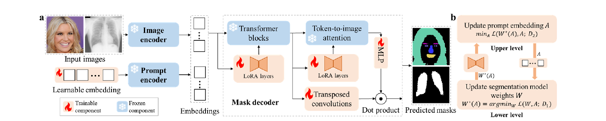

**Abstract**  
TBD

**Summary**  
TBD

[⬆ Back to Literature Table](#samothers)

---

### <a id="from-generalization-to-precision-exploring-sam-f-ac3beadb">From generalization to precision: exploring SAM for tool segmentation in surgical environments</a>
> **Venue:** Medical Imaging 2024: Image Processing  
> **Authors:** KJ. Oguine et al.  
> **Keywords:** Zero-ShotMIS, SAM
**Links**  
[Viewable Link](https://www.spiedigitallibrary.org/conference-proceedings-of-spie/12926/3006981/From-generalization-to-precision--exploring-SAM-for-tool-segmentation/10.1117/12.3006981.full) [Original Link](https://arxiv.org/pdf/2402.17972.pdf)

  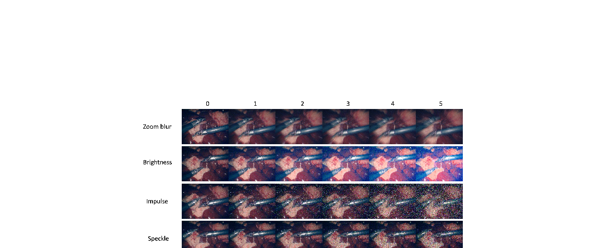

**Abstract**  
<strong>Purpose:</strong> Accurate tool segmentation is essential in computer-aided procedures. However, this task conveys challenges due to artifacts’ presence and the limited training data in medical scenarios. Methods that generalize to unseen data represent an interesting venue, where zero-shot segmentation presents an option to account for data limitation. Initial exploratory works with the Segment Anything Model (SAM) show that bounding-box-based prompting presents notable zero-short generalization. However, point-based prompting leads to a degraded performance that further deteriorates under image corruption. We argue that SAM drastically over-segment images with high corruption levels, resulting in degraded performance when only a single segmentation mask is considered, while the combination of the masks overlapping the object of interest generates an accurate prediction. <strong>Method:</strong> We use SAM to generate the over-segmented prediction of endoscopic frames. Then, we employ the ground-truth tool mask to analyze the results of SAM when the best single mask is selected as prediction and when all the individual masks overlapping the object of interest are combined to obtain the final predicted mask. We analyze the Endovis18 and Endovis17 instrument segmentation datasets using synthetic corruptions of various strengths and an In-House dataset featuring counterfactually created real-world corruptions. <strong>Results:</strong> Combining the over-segmented masks contributes to improvements in the IoU. Furthermore, selecting the best single segmentation presents a competitive IoU score for clean images. <strong>Conclusions:</strong> Combined SAM predictions present improved results and robustness up to a certain corruption level. However, appropriate prompting strategies are fundamental for implementing these models in the medical domain.

**Summary**  
TBD

[⬆ Back to Literature Table](#samzsmis)

---

### <a id="segment-anything-model-for-head-and-neck-tumor-s-269fa57f">Segment anything model for head and neck tumor segmentation with CT, PET and MRI multi-modality images</a>
> **Venue:** arXiv.org 2024  
> **Authors:** J. Ren et al.  
> **Keywords:** Zero-ShotMIS, SAM
**Links**  
[Viewable Link](https://arxiv.org/abs/2402.17454) [Original Link](https://arxiv.org/pdf/2402.17454.pdf)

  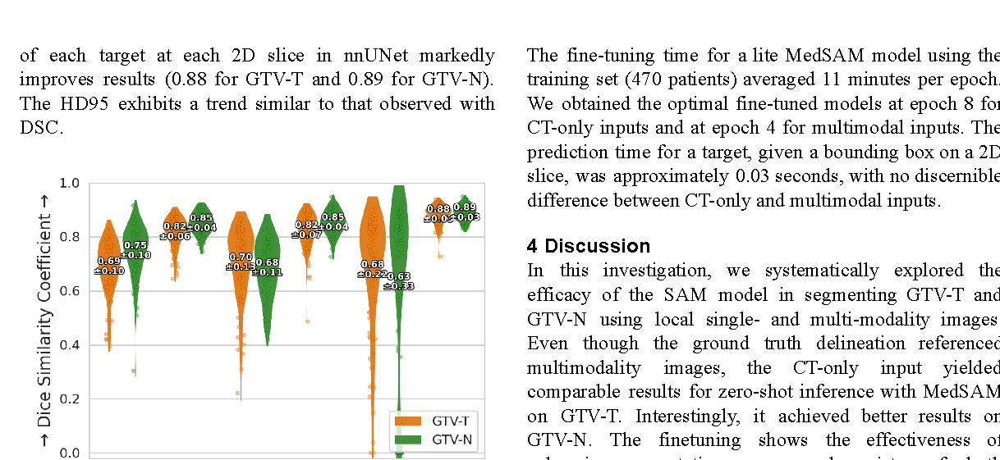

**Abstract**  
Deep learning presents novel opportunities for the auto-segmentation of gross tumor volume (GTV) in head and neck cancer (HNC), yet fully automatic methods usually necessitate significant manual refinement. This study investigates the Segment Anything Model (SAM), recognized for requiring minimal human prompting and its zero-shot generalization ability across natural images. We specifically examine MedSAM, a version of SAM fine-tuned with large-scale public medical images. Despite its progress, the integration of multi-modality images (CT, PET, MRI) for effective GTV delineation remains a challenge. Focusing on SAM's application in HNC GTV segmentation, we assess its performance in both zero-shot and fine-tuned scenarios using single (CT-only) and fused multi-modality images. Our study demonstrates that fine-tuning SAM significantly enhances its segmentation accuracy, building upon the already effective zero-shot results achieved with bounding box prompts. These findings open a promising avenue for semi-automatic HNC GTV segmentation.

**Summary**  
TBD

[⬆ Back to Literature Table](#samzsmis)

---

### <a id="un-sam-universal-prompt-free-segmentation-for-ge-7f1cd137">UN-SAM: Universal Prompt-Free Segmentation for Generalized Nuclei Images</a>
> **Venue:** arXiv.org 2024  
> **Authors:** Z. Chen et al.  
> **Keywords:** SSLMIS, SAM
**Links**  
[Viewable Link](https://arxiv.org/abs/2402.16663) [Original Link](https://arxiv.org/pdf/2402.16663.pdf) [Code](https://github.com/CUHK-AIM-Group/UN-SAM)

  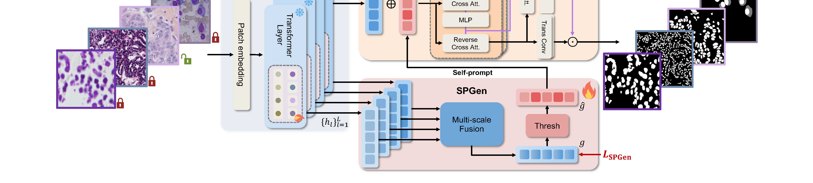

**Abstract**  
In digital pathology, precise nuclei segmentation is pivotal yet challenged by the diversity of tissue types, staining protocols, and imaging conditions. Recently, the segment anything model (SAM) revealed overwhelming performance in natural scenarios and impressive adaptation to medical imaging. Despite these advantages, the reliance of labor-intensive manual annotation as segmentation prompts severely hinders their clinical applicability, especially for nuclei image analysis containing massive cells where dense manual prompts are impractical. To overcome the limitations of current SAM methods while retaining the advantages, we propose the Universal prompt-free SAM framework for Nuclei segmentation (UN-SAM), by providing a fully automated solution with remarkable generalization capabilities. Specifically, to eliminate the labor-intensive requirement of per-nuclei annotations for prompt, we devise a multi-scale Self-Prompt Generation (SPGen) module to revolutionize clinical workflow by automatically generating high-quality mask hints to guide the segmentation tasks. Moreover, to unleash the generalization capability of SAM across a variety of nuclei images, we devise a Domain-adaptive Tuning Encoder (DT-Encoder) to seamlessly harmonize visual features with domain-common and domain-specific knowledge, and further devise a Domain Query-enhanced Decoder (DQ-Decoder) by leveraging learnable domain queries for segmentation decoding in different nuclei domains. Extensive experiments prove that UN-SAM with exceptional performance surpasses state-of-the-arts in nuclei instance and semantic segmentation, especially the generalization capability in zero-shot scenarios. The source code is available at https://github.com/CUHK-AIM-Group/UN-SAM.

**Summary**  
TBD

[⬆ Back to Literature Table](#samsslmis)

---

### <a id="tumor-segmentation-on-whole-slide-images-trainin-4fb71f1a">Tumor segmentation on whole slide images: training or prompting?</a>
> **Venue:** 2024 IEEE International Symposium on Biomedical Imaging (ISBI)  
> **Authors:** H. Wu et al.  
> **Keywords:** OtherMIS, SAM
**Links**  
[Viewable Link](https://ieeexplore.ieee.org/document/10635239/) [Original Link](https://arxiv.org/pdf/2402.13932.pdf)

  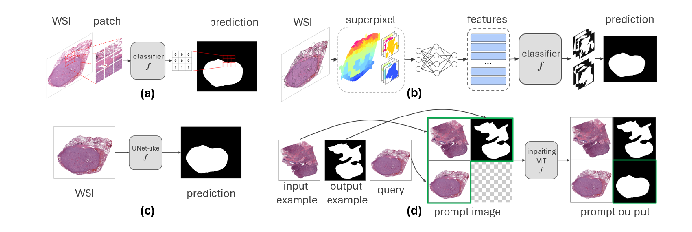

**Abstract**  
Tumor segmentation stands as a pivotal task in cancer diagnosis. Given the immense dimensions of whole slide images (WSI) in histology, deep learning approaches for WSI classification mainly operate at patch-wise or superpixel-wise level. However, these solutions often struggle to capture global WSI information and cannot directly generate the binary mask. Downsampling the WSI and performing semantic segmentation is another possible approach. While this method offers computational efficiency, it necessitates a large amount of annotated data since resolution reduction may lead to information loss. Visual prompting is a novel paradigm that allows the model to perform new tasks by making subtle modifications to the input space, rather than adapting the model itself. Such approach has demonstrated promising results on many computer vision tasks. In this paper, we show the efficacy of visual prompting in the context of tumor segmentation for three distinct organs. In comparison to classical methods trained for this specific task, our findings reveal that, with appropriate prompt examples, visual prompting can achieve comparable or better performance without extensive fine-tuning.

**Summary**  
TBD

[⬆ Back to Literature Table](#samothers)

---

### <a id="iris-sam-iris-segmentation-using-a-foundational-804a399f">Iris-SAM: Iris Segmentation Using a Foundational Model</a>
> **Venue:** 2024  
> **Authors:** P. Farmanifard et al.  
> **Keywords:** OtherMIS, SAM
**Links**  
[Viewable Link](https://arxiv.org/pdf/2402.06497.pdf)

  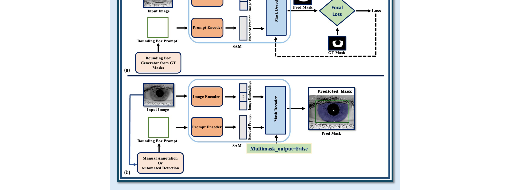

**Abstract**  
TBD

**Summary**  
TBD

[⬆ Back to Literature Table](#samothers)

---

### <a id="clicksam-fine-tuning-segment-anything-model-usin-8cb0d5d0">ClickSAM: Fine-tuning Segment Anything Model using click prompts for ultrasound image segmentation</a>
> **Venue:** Medical Imaging 2024: Ultrasonic Imaging and Tomography  
> **Authors:** A. Guo et al.  
> **Keywords:** OtherMIS, SAM
**Links**  
[Viewable Link](https://www.spiedigitallibrary.org/conference-proceedings-of-spie/12932/3005879/ClickSAM--fine-tuning-Segment-Anything-Model-using-click-prompts/10.1117/12.3005879.full) [Original Link](https://arxiv.org/pdf/2402.05902.pdf)

  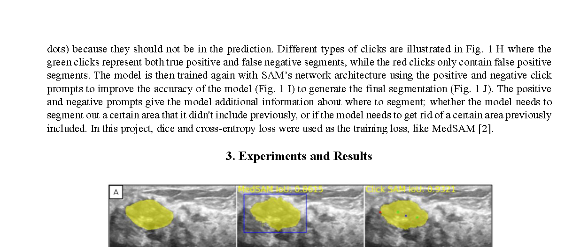

**Abstract**  
The newly released Segment Anything Model (SAM) is a popular tool used in image processing due to its superior segmentation accuracy, variety of input prompts, training capabilities, and efficient model design. However, its current model is trained on a diverse dataset not tailored to medical images, particularly ultrasound images. Ultrasound images tend to have a lot of noise, making it difficult to segment out important structures. In this project, we developed ClickSAM, which fine-tunes the Segment Anything Model using click prompts for ultrasound images. ClickSAM has two stages of training: the first stage is trained on single-click prompts centered in the ground-truth contours, and the second stage focuses on improving the model performance through additional positive and negative click prompts. By comparing the first stage predictions to the ground-truth masks, true positive, false positive, and false negative segments are calculated. Positive clicks are generated using the true positive and false negative segments, and negative clicks are generated using the false positive segments. The Centroidal Voronoi Tessellation algorithm is then employed to collect positive and negative click prompts in each segment that are used to enhance the model performance during the second stage of training. With click-train methods, ClickSAM exhibits superior performance compared to other existing models for ultrasound image segmentation.

**Summary**  
TBD

[⬆ Back to Literature Table](#samothers)

---

### <a id="trisam-tri-plane-sam-for-zero-shot-cortical-bloo-7f61e3a9">TriSAM: Tri-Plane SAM for Zero-Shot Cortical Blood Vessel Segmentation in VEM Images</a>
> **Venue:** IEEE Journal of Biomedical and Health Informatics 2025  
> **Authors:** J. Wan et al.  
> **Keywords:** Zero-ShotMIS, SAM
**Links**  
[Viewable Link](https://ieeexplore.ieee.org/document/11027715/) [Original Link](https://arxiv.org/pdf/2401.13961.pdf)

  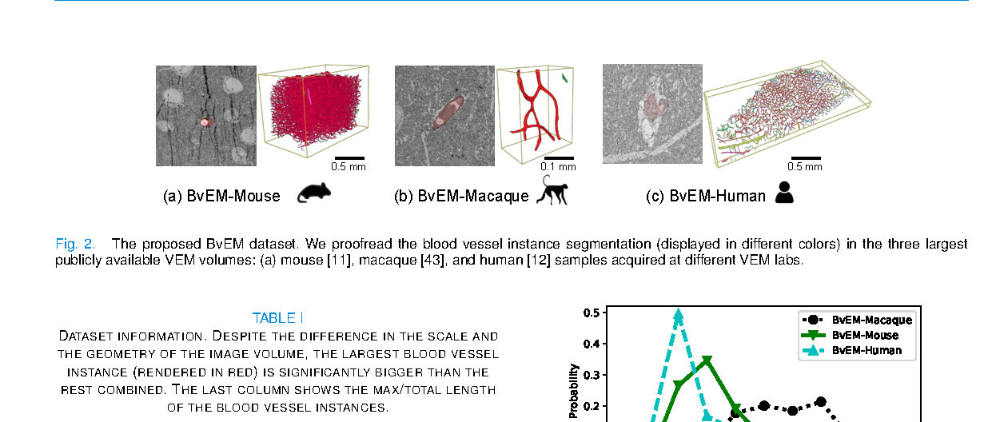

**Abstract**  
While imaging techniques at macro and mesoscales have garnered substantial attention and resources, microscale Volume Electron Microscopy (vEM) imaging, capable of revealing intricate vascular details, has lacked the necessary benchmarking infrastructure. In this paper, we address a significant gap in this field of neuroimaging by introducing the first-in-class public benchmark, BvEM, designed specifically for cortical blood vessel segmentation in vEM images. Our BvEM benchmark is based on vEM image volumes from three mammals: adult mouse, macaque, and human. We standardized the resolution, addressed imaging variations, and meticulously annotated blood vessels through semi-automatic, manual, and quality control processes, ensuring high-quality 3D segmentation. Furthermore, we developed a zero-shot cortical blood vessel segmentation method named TriSAM, which leverages the powerful segmentation model SAM for 3D segmentation. To extend SAM from 2D to 3D volume segmentation, TriSAM employs a multi-seed tracking framework, leveraging the reliability of certain image planes for tracking while using others to identify potential turning points. This approach effectively achieves long-term 3D blood vessel segmentation without model training or fine-tuning. Experimental results show that TriSAM achieved superior performances on the BvEM benchmark across three species.

**Summary**  
TBD

[⬆ Back to Literature Table](#samzsmis)

---

### <a id="segment-any-cell-a-sam-based-auto-prompting-fine-6aa4efaf">Segment Any Cell: A SAM-based Auto-prompting Fine-tuning Framework for Nuclei Segmentation</a>
> **Venue:** IEEE Transactions on Neural Networks and Learning Systems 2025  
> **Authors:** S. Na et al.  
> **Keywords:** OtherMIS, SAM
**Links**  
[Viewable Link](https://ieeexplore.ieee.org/document/11218040/) [Original Link](https://arxiv.org/pdf/2401.13220.pdf)

  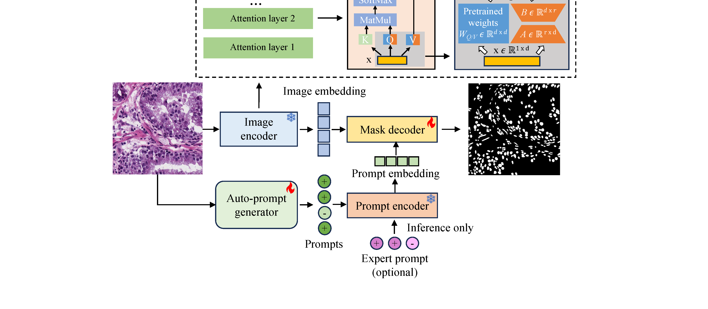

**Abstract**  
In the rapidly evolving field of AI research, foundational models like BERT and GPT have significantly advanced language and vision tasks. The advent of pretrain-prompting models such as ChatGPT and Segmentation Anything Model (SAM) has further revolutionized image segmentation. However, their applications in specialized areas, particularly in nuclei segmentation within medical imaging, reveal a key challenge: the generation of high-quality, informative prompts is as crucial as applying state-of-the-art (SOTA) fine-tuning techniques on foundation models. To address this, we introduce Segment Any Cell (SAC), an innovative framework that enhances SAM specifically for nuclei segmentation. SAC integrates a Low-Rank Adaptation (LoRA) within the attention layer of the Transformer to improve the fine-tuning process, outperforming existing SOTA methods. It also introduces an innovative auto-prompt generator that produces effective prompts to guide segmentation, a critical factor in handling the complexities of nuclei segmentation in biomedical imaging. Our extensive experiments demonstrate the superiority of SAC in nuclei segmentation tasks, proving its effectiveness as a tool for pathologists and researchers. Our contributions include a novel prompt generation strategy, automated adaptability for diverse segmentation tasks, the innovative application of Low-Rank Attention Adaptation in SAM, and a versatile framework for semantic segmentation challenges.

**Summary**  
TBD

[⬆ Back to Literature Table](#samothers)

---

### <a id="segmentanybone-a-universal-model-that-segments-a-a83cb8a8">SegmentAnyBone: A Universal Model that Segments Any Bone at Any Location on MRI</a>
> **Venue:** Medical Image Analysis 2025  
> **Authors:** H. Gu et al.  
> **Keywords:** OtherMIS, SAM
**Links**  
[Viewable Link](https://linkinghub.elsevier.com/retrieve/pii/S1361841525000179) [Original Link](https://arxiv.org/pdf/2401.12974.pdf) [Code](https://github.com/mazurowski-lab/SegmentAnyBone)

  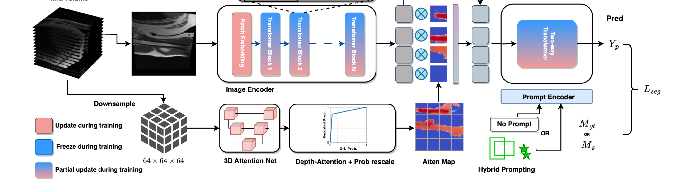

**Abstract**  
Magnetic Resonance Imaging (MRI) is pivotal in radiology, offering non-invasive and high-quality insights into the human body. Precise segmentation of MRIs into different organs and tissues would be highly beneficial since it would allow for a higher level of understanding of the image content and enable important measurements, which are essential for accurate diagnosis and effective treatment planning. Specifically, segmenting bones in MRI would allow for more quantitative assessments of musculoskeletal conditions, while such assessments are largely absent in current radiological practice. The difficulty of bone MRI segmentation is illustrated by the fact that limited algorithms are publicly available for use, and those contained in the literature typically address a specific anatomic area. In our study, we propose a versatile, publicly available deep-learning model for bone segmentation in MRI across multiple standard MRI locations. The proposed model can operate in two modes: fully automated segmentation and prompt-based segmentation. Our contributions include (1) collecting and annotating a new MRI dataset across various MRI protocols, encompassing over 300 annotated volumes and 8485 annotated slices across diverse anatomic regions; (2) investigating several standard network architectures and strategies for automated segmentation; (3) introducing SegmentAnyBone, an innovative foundational model-based approach that extends Segment Anything Model (SAM); (4) comparative analysis of our algorithm and previous approaches; and (5) generalization analysis of our algorithm across different anatomical locations and MRI sequences, as well as an external dataset. We publicly release our model at https://github.com/mazurowski-lab/SegmentAnyBone.

**Summary**  
TBD

[⬆ Back to Literature Table](#samothers)

---

### <a id="clipsam-clip-and-sam-collaboration-for-zero-shot-50ce7eda">ClipSAM: CLIP and SAM Collaboration for Zero-Shot Anomaly Segmentation</a>
> **Venue:** Neurocomputing 2025  
> **Authors:** S. Li et al.  
> **Keywords:** Zero-ShotMIS, SAM
**Links**  
[Viewable Link](https://linkinghub.elsevier.com/retrieve/pii/S0925231224018939) [Original Link](https://arxiv.org/pdf/2401.12665.pdf) [Code](https://github.com/Lszcoding/ClipSAM)

  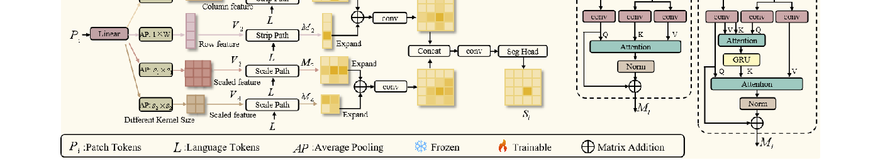

**Abstract**  
Recently, foundational models such as CLIP and SAM have shown promising performance for the task of Zero-Shot Anomaly Segmentation (ZSAS). However, either CLIP-based or SAM-based ZSAS methods still suffer from non-negligible key drawbacks: 1) CLIP primarily focuses on global feature alignment across different inputs, leading to imprecise segmentation of local anomalous parts; 2) SAM tends to generate numerous redundant masks without proper prompt constraints, resulting in complex post-processing requirements. In this work, we innovatively propose a CLIP and SAM collaboration framework called ClipSAM for ZSAS. The insight behind ClipSAM is to employ CLIP's semantic understanding capability for anomaly localization and rough segmentation, which is further used as the prompt constraints for SAM to refine the anomaly segmentation results. In details, we introduce a crucial Unified Multi-scale Cross-modal Interaction (UMCI) module for interacting language with visual features at multiple scales of CLIP to reason anomaly positions. Then, we design a novel Multi-level Mask Refinement (MMR) module, which utilizes the positional information as multi-level prompts for SAM to acquire hierarchical levels of masks and merges them. Extensive experiments validate the effectiveness of our approach, achieving the optimal segmentation performance on the MVTec-AD and VisA datasets.

**Summary**  
TBD

[⬆ Back to Literature Table](#samzsmis)

---

### <a id="no-more-training-sam-s-zero-shot-transfer-capabi-e623af2b">No More Training: SAM's Zero-Shot Transfer Capabilities for Cost-Efficient Medical Image Segmentation</a>
> **Venue:** IEEE Access 2024  
> **Authors:** JD. Gutiérrez et al.  
> **Keywords:** Zero-ShotMIS, SAM
**Links**  
[Viewable Link](https://ieeexplore.ieee.org/document/10388320/) [Original Link](https://ieeexplore.ieee.org/stamp/stamp.jsp?arnumber=10388320)

  <!-- Add image to imgs/ and uncomment the img tag below. -->
  <!--  -->

**Abstract**  
TBD

**Summary**  
TBD

[⬆ Back to Literature Table](#samzsmis)

---

### <a id="leveraging-sam-for-single-source-domain-generali-6db32fe5">Leveraging SAM for Single-Source Domain Generalization in Medical Image Segmentation</a>
> **Venue:** 2025 IEEE International Conference on Systems, Man, and Cybernetics (SMC)  
> **Authors:** H. Wang et al.  
> **Keywords:** OtherMIS, SAM
**Links**  
[Viewable Link](https://ieeexplore.ieee.org/document/11343166/) [Original Link](https://arxiv.org/pdf/2401.02076.pdf) [Code](https://github.com/SARIHUST/SAMMed)

  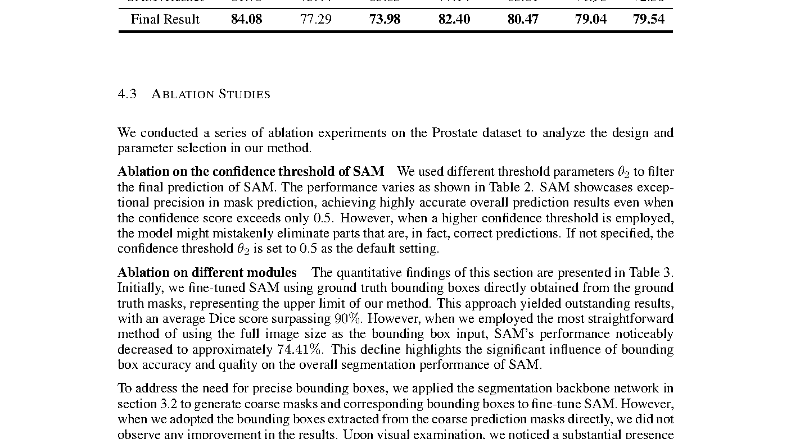

**Abstract**  
Domain Generalization (DG) aims to reduce domain shifts between domains to achieve promising performance on the unseen target domain, which has been widely practiced in medical image segmentation. Single-source domain generalization (SDG) is the most challenging setting that trains on only one source domain. Although existing methods have made considerable progress on SDG of medical image segmentation, the performances are still far from the applicable standards when faced with a relatively large domain shift. In this paper, we leverage the Segment Anything Model (SAM) to SDG to greatly improve the ability of generalization. Specifically, we introduce a parallel framework, the source images are sent into the SAM module and normal segmentation module respectively. To reduce the calculation resources, we apply a merging strategy before sending images to the SAM module. We extract the bounding boxes from the segmentation module and send the refined version as prompts to the SAM module. We evaluate our model on a classic DG dataset and achieve competitive results compared to other state-of-the-art DG methods. Furthermore, We conducted a series of ablation experiments to prove the effectiveness of the proposed method. The code is publicly available at https://github.com/SARIHUST/SAMMed.

**Summary**  
TBD

[⬆ Back to Literature Table](#samothers)

---

### <a id="swinsam-fine-grained-polyp-segmentation-in-colon-19f23f47">Swinsam: Fine-Grained Polyp Segmentation in Colonoscopy Images Via Segment Anything Model Integrated with a Swin Transformer Decoder</a>
> **Venue:** Biomedical Signal Processing and Control 2025  
> **Authors:** Z. Feng et al.  
> **Keywords:** OtherMIS, SAM
**Links**  
[Viewable Link](https://linkinghub.elsevier.com/retrieve/pii/S1746809424011133) [Original Link](https://papers.ssrn.com/sol3/papers.cfm?abstract_id=4673046)

  <!-- Add image to imgs/ and uncomment the img tag below. -->
  <!--  -->

**Abstract**  
TBD

**Summary**  
TBD

[⬆ Back to Literature Table](#samothers)

---

### <a id="one-model-to-rule-them-all-towards-universal-seg-9f81c5ee">One Model to Rule them All: Towards Universal Segmentation for Medical Images with Text Prompts</a>
> **Venue:** 2023  
> **Authors:** Z. Zhao et al.  
> **Keywords:** OtherMIS, SAM
**Links**  
[Viewable Link](https://arxiv.org/pdf/2312.17183.pdf) [Code](https://zhaoziheng.github.io/MedUniSeg)

  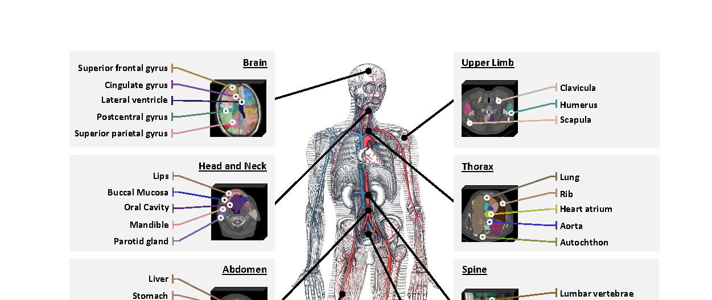

**Abstract**  
TBD

**Summary**  
TBD

[⬆ Back to Literature Table](#samothers)

---

### <a id="part-to-whole-collaborative-prompting-for-surgic-31ca28ca">Part to Whole: Collaborative Prompting for Surgical Instrument Segmentation</a>
> **Venue:** 2023  
> **Authors:** W. Yue et al.  
> **Keywords:** OtherMIS, SAM
**Links**  
[Viewable Link](https://arxiv.org/pdf/2312.14481.pdf) [Code](https://github.com/wenxi-yue/SurgicalPart-SAM)

  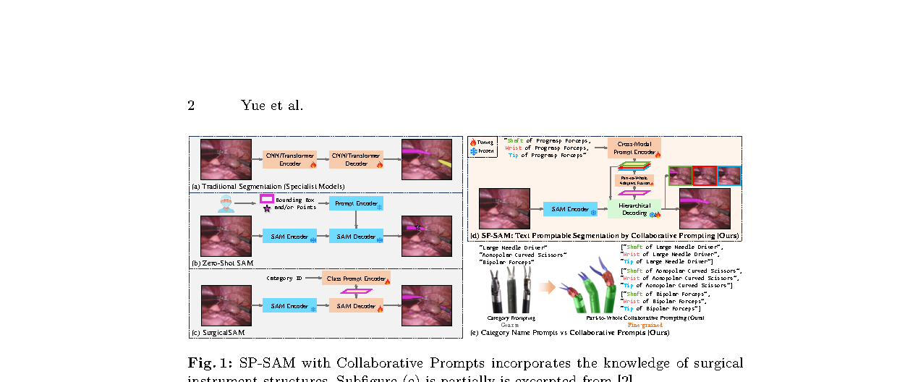

**Abstract**  
TBD

**Summary**  
TBD

[⬆ Back to Literature Table](#samothers)

---

### <a id="repurposing-traditional-u-net-predictions-for-sp-ec8cf23d">Repurposing traditional U-Net predictions for sparse SAM prompting in medical image segmentation</a>
> **Venue:** Biomedical Physics &amp; Engineering Express 2024  
> **Authors:** ZM. Colbert et al.  
> **Keywords:** Zero-ShotMIS, SAM
**Links**  
[Viewable Link](https://iopscience.iop.org/article/10.1088/2057-1976/ad17a7) [Original Link](https://iopscience.iop.org/article/10.1088/2057-1976/ad17a7/meta)

  <!-- Add image to imgs/ and uncomment the img tag below. -->
  <!--  -->

**Abstract**  
<i>Objective:</i>Automated medical image segmentation (MIS) using deep learning has traditionally relied on models built and trained from scratch, or at least fine-tuned on a target dataset. The Segment Anything Model (SAM) by Meta challenges this paradigm by providing zero-shot generalisation capabilities. This study aims to develop and compare methods for refining traditional U-Net segmentations by repurposing them for automated SAM prompting.<i>Approach:</i>A 2D U-Net with EfficientNet-B4 encoder was trained using 4-fold cross-validation on an in-house brain metastases dataset. Segmentation predictions from each validation set were used for automatic sparse prompt generation via a bounding box prompting method (BBPM) and novel implementations of the point prompting method (PPM). The PPMs frequently produced poor slice predictions (PSPs) that required identification and substitution. A slice was identified as a PSP if it (1) contained multiple predicted regions per lesion or (2) possessed outlier foreground pixel counts relative to the patient's other slices. Each PSP was substituted with a corresponding initial U-Net or SAM BBPM prediction. The patients' mean volumetric dice similarity coefficient (DSC) was used to evaluate and compare the methods' performances.<i>Main results:</i>Relative to the initial U-Net segmentations, the BBPM improved mean patient DSC by 3.93 ± 1.48% to 0.847 ± 0.008 DSC. PSPs constituted 20.01-21.63% of PPMs' predictions and without substitution performance dropped by 82.94 ± 3.17% to 0.139 ± 0.023 DSC. Pairing the two PSP identification techniques yielded a sensitivity to PSPs of 92.95 ± 1.20%. By combining this approach with BBPM prediction substitution, the PPMs achieved segmentation accuracies on par with the BBPM, improving mean patient DSC by up to 4.17 ± 1.40% and reaching 0.849 ± 0.007 DSC.<i>Significance:</i>The proposed PSP identification and substitution techniques bridge the gap between PPM and BBPM performance for MIS. Additionally, the uniformity observed in our experiments' results demonstrates the robustness of SAM to variations in prompting style. These findings can assist in the design of both automatically and manually prompted pipelines.

**Summary**  
TBD

[⬆ Back to Literature Table](#samzsmis)

---

### <a id="sam-fewshot-finetuning-for-anatomical-segmentati-63e6e4b8">SAM Fewshot Finetuning for Anatomical Segmentation in Medical Images</a>
> **Venue:** 2024 IEEE/CVF Winter Conference on Applications of Computer Vision (WACV)  
> **Authors:** W. Xie et al.  
> **Keywords:** Few-ShotMIS, SAM
**Links**  
[Viewable Link](https://ieeexplore.ieee.org/document/10484400/) [Original Link](https://openaccess.thecvf.com/content/WACV2024/papers/Xie_SAM_Fewshot_Finetuning_for_Anatomical_Segmentation_in_Medical_Images_WACV_2024_paper.pdf)

  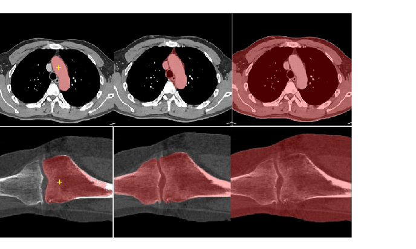

**Abstract**  
We propose a straightforward yet highly effective few-shot fine-tuning strategy for adapting the Segment Anything (SAM) to anatomical segmentation tasks in medical images. Our novel approach revolves around reformulating the mask decoder within SAM, leveraging few-shot embeddings derived from a limited set of labeled images (few-shot collection) as prompts for querying anatomical objects captured in image embeddings. This innovative reformulation greatly reduces the need for time-consuming online user interactions for labeling volumetric images, such as exhaustively marking points and bounding boxes to provide prompts slice by slice. With our method, users can manually segment a few 2D slices offline, and the embeddings of these annotated image regions serve as effective prompts for online segmentation tasks. Our method prioritizes the efficiency of the fine-tuning process by exclusively training the mask decoder through caching mechanisms while keeping the image encoder frozen. Importantly, this approach is not limited to volumetric medical images, but can generically be applied to any 2D/3D segmentation task. To thoroughly evaluate our method, we conducted extensive validation on four datasets, covering six anatomical segmentation tasks across two modalities. Furthermore, we conducted a comparative analysis of different prompting options within SAM and the fully-supervised nnU-Net. The results demonstrate the superior performance of our method compared to SAM employing only point prompts (approximately 50% improvement in IoU) and performs on-par with fully supervised methods whilst reducing the requirement of labeled data by at least an order of magnitude.

**Summary**  
TBD

[⬆ Back to Literature Table](#samfsmis)

---

### <a id="testing-the-segment-anything-model-on-radiology-af05eff1">Testing the Segment Anything Model on radiology data</a>
> **Venue:** arXiv.org 2023  
> **Authors:** JG. Almeida et al.  
> **Keywords:** Zero-ShotMIS, SAM
**Links**  
[Viewable Link](https://arxiv.org/abs/2312.12880) [Original Link](https://arxiv.org/pdf/2312.12880.pdf)

  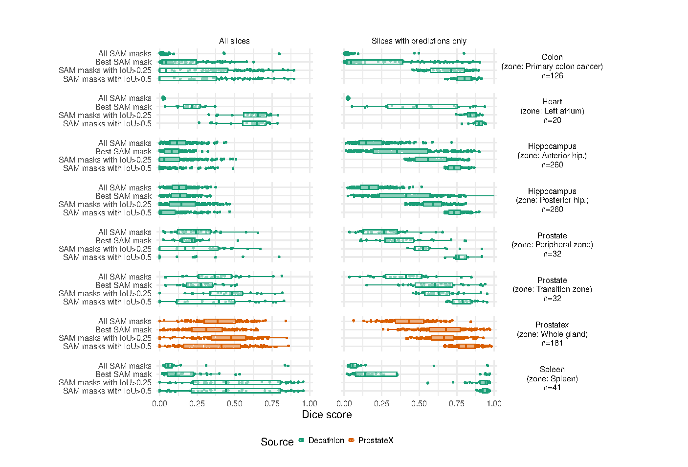

**Abstract**  
Deep learning models trained with large amounts of data have become a recent and effective approach to predictive problem solving -- these have become known as "foundation models" as they can be used as fundamental tools for other applications. While the paramount examples of image classification (earlier) and large language models (more recently) led the way, the Segment Anything Model (SAM) was recently proposed and stands as the first foundation model for image segmentation, trained on over 10 million images and with recourse to over 1 billion masks. However, the question remains -- what are the limits of this foundation? Given that magnetic resonance imaging (MRI) stands as an important method of diagnosis, we sought to understand whether SAM could be used for a few tasks of zero-shot segmentation using MRI data. Particularly, we wanted to know if selecting masks from the pool of SAM predictions could lead to good segmentations. Here, we provide a critical assessment of the performance of SAM on magnetic resonance imaging data. We show that, while acceptable in a very limited set of cases, the overall trend implies that these models are insufficient for MRI segmentation across the whole volume, but can provide good segmentations in a few, specific slices. More importantly, we note that while foundation models trained on natural images are set to become key aspects of predictive modelling, they may prove ineffective when used on other imaging modalities.

**Summary**  
TBD

[⬆ Back to Literature Table](#samzsmis)

---

### <a id="towards-samba-segment-anything-model-for-brain-t-7662c153">Towards SAMBA: Segment Anything Model for Brain Tumor Segmentation in Sub-Sharan African Populations</a>
> **Venue:** Lecture Notes in Computer Science 2024  
> **Authors:** M. Barakat et al.  
> **Keywords:** OtherMIS, SAM
**Links**  
[Viewable Link](https://link.springer.com/10.1007/978-3-031-76163-8_18) [Original Link](https://arxiv.org/pdf/2312.11775.pdf)

  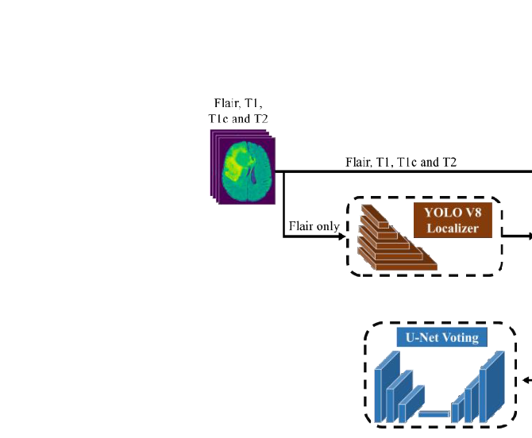

**Abstract**  
Gliomas, the most prevalent primary brain tumors, require precise segmentation for diagnosis and treatment planning. However, this task poses significant challenges, particularly in the African population, were limited access to high-quality imaging data hampers algorithm performance. In this study, we propose an innovative approach combining the Segment Anything Model (SAM) and a voting network for multi-modal glioma segmentation. By fine-tuning SAM with bounding box-guided prompts (SAMBA), we adapt the model to the complexities of African datasets. Our ensemble strategy, utilizing multiple modalities and views, produces a robust consensus segmentation, addressing intra-tumoral heterogeneity. Although the low quality of scans presents difficulties, our methodology has the potential to profoundly impact clinical practice in resource-limited settings such as Africa, improving treatment decisions and advancing neuro-oncology research. Furthermore, successful application to other brain tumor types and lesions in the future holds promise for a broader transformation in neurological imaging, improving healthcare outcomes across all settings. This study was conducted on the Brain Tumor Segmentation (BraTS) Challenge Africa (BraTS-Africa) dataset, which provides a valuable resource for addressing challenges specific to resource-limited settings, particularly the African population, and facilitating the development of effective and more generalizable segmentation algorithms. To illustrate our approach's potential, our experiments on the BraTS-Africa dataset yielded compelling results, with SAM attaining a Dice coefficient of 86.6 for binary segmentation and 60.4 for multi-class segmentation.

**Summary**  
TBD

[⬆ Back to Literature Table](#samothers)

---

### <a id="sqa-sam-segmentation-quality-assessment-for-medi-f90c58ba">SQA-SAM: Segmentation Quality Assessment for Medical Images Utilizing the Segment Anything Model</a>
> **Venue:** arXiv.org 2023  
> **Authors:** Y. Zhang et al.  
> **Keywords:** OtherMIS, SAM
**Links**  
[Viewable Link](https://arxiv.org/abs/2312.09899) [Original Link](https://arxiv.org/pdf/2312.09899.pdf) [Code](https://github.com/yizhezhang2000/SQA-SAM)

  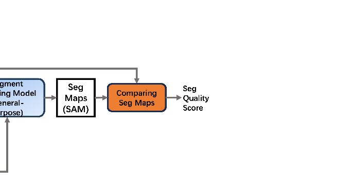

**Abstract**  
Segmentation quality assessment (SQA) plays a critical role in the deployment of a medical image based AI system. Users need to be informed/alerted whenever an AI system generates unreliable/incorrect predictions. With the introduction of the Segment Anything Model (SAM), a general foundation segmentation model, new research opportunities emerged in how one can utilize SAM for medical image segmentation. In this paper, we propose a novel SQA method, called SQA-SAM, which exploits SAM to enhance the accuracy of quality assessment for medical image segmentation. When a medical image segmentation model (MedSeg) produces predictions for a test image, we generate visual prompts based on the predictions, and SAM is utilized to generate segmentation maps corresponding to the visual prompts. How well MedSeg's segmentation aligns with SAM's segmentation indicates how well MedSeg's segmentation aligns with the general perception of objectness and image region partition. We develop a score measure for such alignment. In experiments, we find that the generated scores exhibit moderate to strong positive correlation (in Pearson correlation and Spearman correlation) with Dice coefficient scores reflecting the true segmentation quality.

**Summary**  
TBD

[⬆ Back to Literature Table](#samothers)

---

### <a id="aslseg-adapting-sam-in-the-loop-for-semi-supervi-77350955">ASLseg: Adapting SAM in the Loop for Semi-supervised Liver Tumor Segmentation</a>
> **Venue:** 2024 IEEE International Symposium on Biomedical Imaging (ISBI)  
> **Authors:** S. Chen et al.  
> **Keywords:** SSLMIS, SAM
**Links**  
[Viewable Link](https://ieeexplore.ieee.org/document/10635501/) [Original Link](https://arxiv.org/pdf/2312.07969.pdf)

  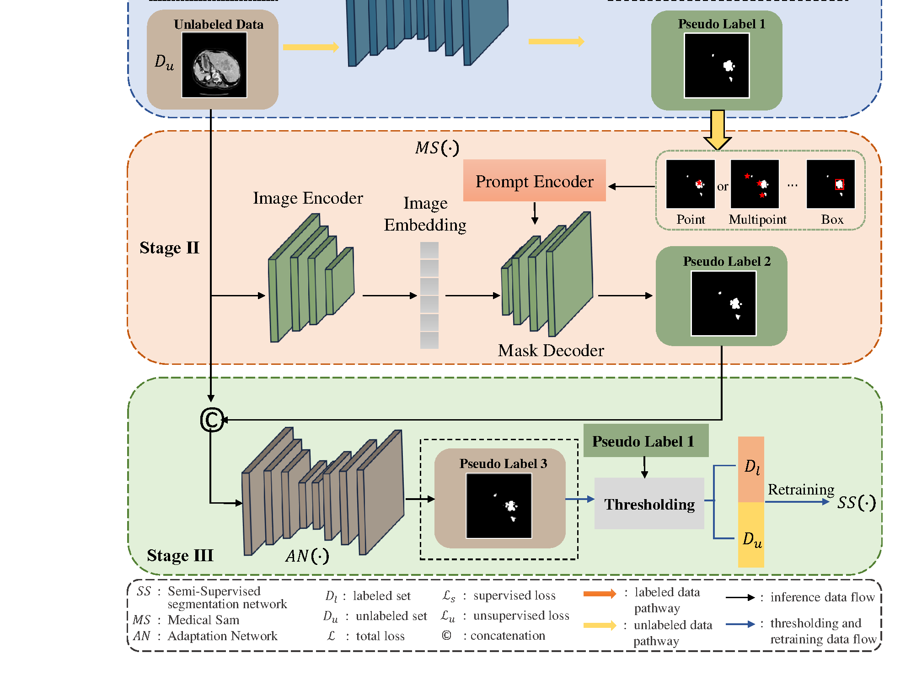

**Abstract**  
Liver tumor segmentation is essential for computer-aided diagnosis, surgical planning, and prognosis evaluation. However, obtaining and maintaining a large-scale dataset with dense annotations is challenging. Semi-Supervised Learning (SSL) is a common technique to address these challenges. Recently, Segment Anything Model (SAM) has shown promising performance in some medical image segmentation tasks, but it performs poorly for liver tumor segmentation. In this paper, we propose a novel semi-supervised framework, named ASLseg, which can effectively adapt the SAM to the SSL setting and combine both domain-specific and general knowledge of liver tumors. Specifically, the segmentation model trained with a specific SSL paradigm provides the generated pseudo-labels as prompts to the fine-tuned SAM. An adaptation network is then used to refine the SAM-predictions and generate higher-quality pseudo-labels. Finally, the reliable pseudo-labels are selected to expand the labeled set for iterative training. Extensive experiments on the LiTS dataset demonstrate overwhelming performance of our ASLseg.

**Summary**  
TBD

[⬆ Back to Literature Table](#samsslmis)

---

### <a id="scribbleprompt-fast-and-flexible-interactive-seg-f554dddf">ScribblePrompt: Fast and Flexible Interactive Segmentation for Any Medical Image</a>
> **Venue:** 2023  
> **Authors:** HE. Wong et al.  
> **Keywords:** InteractiveMIS, SAM
**Links**  
[Viewable Link](https://arxiv.org/pdf/2312.07381.pdf) [Code](https://scribbleprompt.csail.mit.edu)

  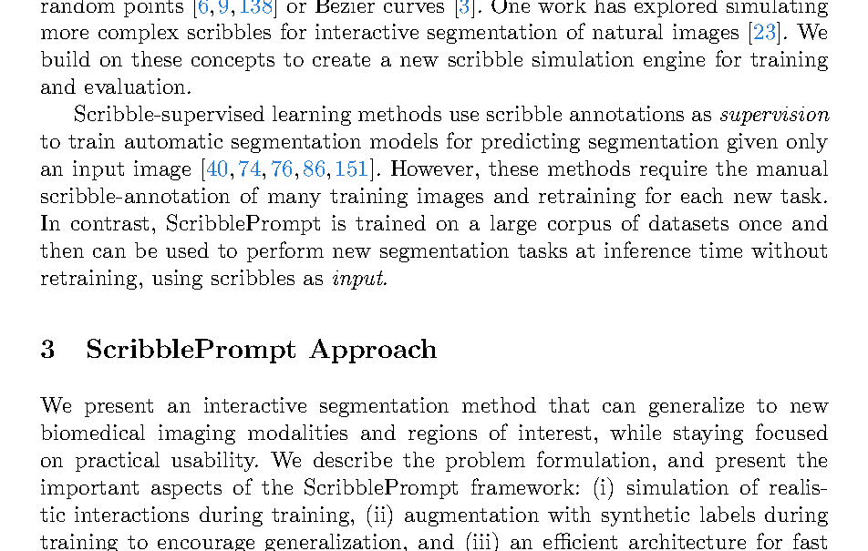

**Abstract**  
TBD

**Summary**  
TBD

[⬆ Back to Literature Table](#samiwmis)

---

### <a id="semisam-exploring-sam-for-enhancing-semi-supervi-2e628ec4">SemiSAM: Exploring SAM for Enhancing Semi-Supervised Medical Image Segmentation with Extremely Limited Annotations</a>
> **Venue:** 2023  
> **Authors:** Y. Zhang et al.  
> **Keywords:** SSLMIS, SAM
**Links**  
[Viewable Link](https://arxiv.org/pdf/2312.06316.pdf)

  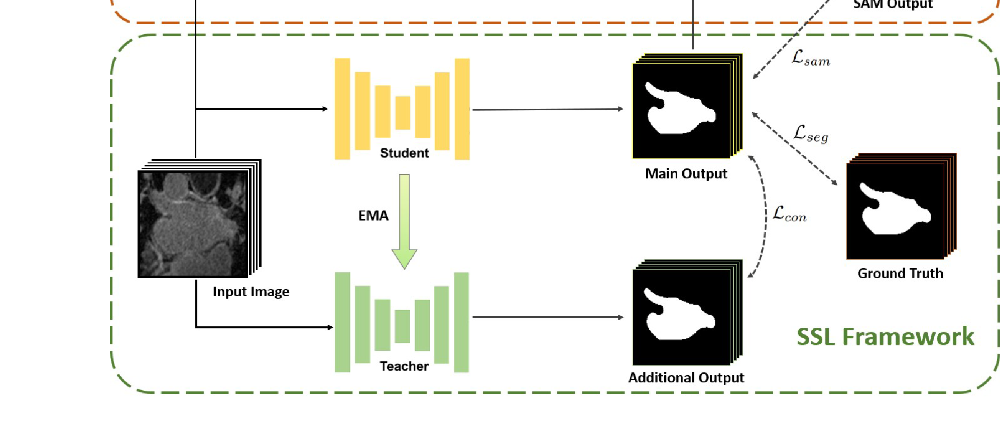

**Abstract**  
TBD

**Summary**  
TBD

[⬆ Back to Literature Table](#samsslmis)

---

### <a id="segment-anything-model-guided-collaborative-lear-77ded422">Segment Anything Model-guided Collaborative Learning Network for Scribble-supervised Polyp Segmentation</a>
> **Venue:** arXiv.org 2023  
> **Authors:** Y. Zhao et al.  
> **Keywords:** OtherMIS, SAM
**Links**  
[Viewable Link](https://arxiv.org/abs/2312.00312) [Original Link](https://arxiv.org/pdf/2312.00312.pdf)

  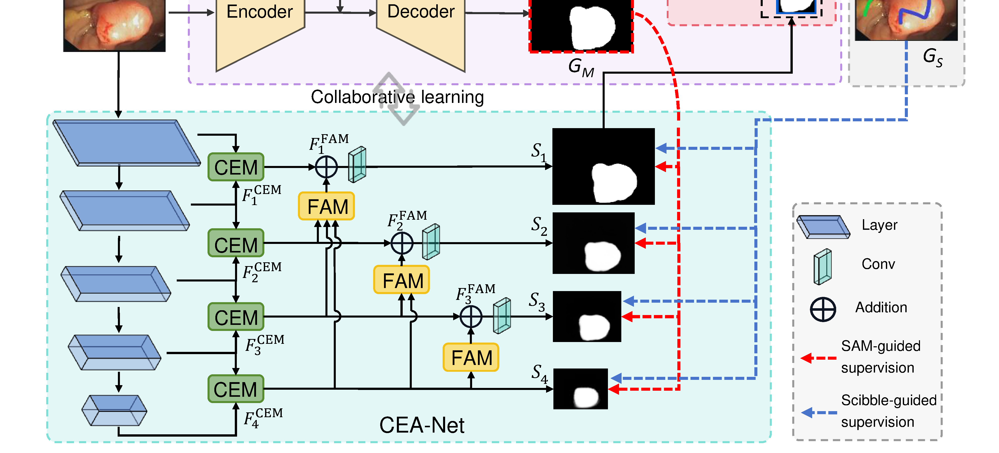

**Abstract**  
Polyp segmentation plays a vital role in accurately locating polyps at an early stage, which holds significant clinical importance for the prevention of colorectal cancer. Various polyp segmentation methods have been developed using fully-supervised deep learning techniques. However, pixel-wise annotation for polyp images by physicians during the diagnosis is both time-consuming and expensive. Moreover, visual foundation models such as the Segment Anything Model (SAM) have shown remarkable performance. Nevertheless, directly applying SAM to medical segmentation may not produce satisfactory results due to the inherent absence of medical knowledge. In this paper, we propose a novel SAM-guided Collaborative Learning Network (SAM-CLNet) for scribble-supervised polyp segmentation, enabling a collaborative learning process between our segmentation network and SAM to boost the model performance. Specifically, we first propose a Cross-level Enhancement and Aggregation Network (CEA-Net) for weakly-supervised polyp segmentation. Within CEA-Net, we propose a Cross-level Enhancement Module (CEM) that integrates the adjacent features to enhance the representation capabilities of different resolution features. Additionally, a Feature Aggregation Module (FAM) is employed to capture richer features across multiple levels. Moreover, we present a box-augmentation strategy that combines the segmentation maps generated by CEA-Net with scribble annotations to create more precise prompts. These prompts are then fed into SAM, generating segmentation SAM-guided masks, which can provide additional supervision to train CEA-Net effectively. Furthermore, we present an Image-level Filtering Mechanism to filter out unreliable SAM-guided masks. Extensive experimental results show that our SAM-CLNet outperforms state-of-the-art weakly-supervised segmentation methods.

**Summary**  
TBD

[⬆ Back to Literature Table](#samothers)

---

### <a id="segment-anything-model-for-semi-supervised-medic-8dc67b2d">Segment Anything Model for Semi-Supervised Medical Image Segmentation via Selecting Reliable Pseudo-Labels</a>
> **Venue:** SSRN Electronic Journal 2023  
> **Authors:** N. Li et al.  
> **Keywords:** SSLMIS, SAM
**Links**  
[Viewable Link](https://www.ssrn.com/abstract=4477443) [Original Link](https://link.springer.com/chapter/10.1007/978-981-99-8141-0_11)

  <!-- Add image to imgs/ and uncomment the img tag below. -->
  <!--  -->

**Abstract**  
Semi-supervised learning (SSL) has become a hot topic due to its less dependence on annotated data compared to fully supervised methods. This advantage becomes more evident in the field of medical imaging, where acquiring labeled data is challenging. Generating...

**Summary**  
TBD

[⬆ Back to Literature Table](#samsslmis)

---

### <a id="i-medsam-implicit-medical-image-segmentation-wit-d6b96e13">I-MedSAM: Implicit Medical Image Segmentation with Segment Anything</a>
> **Venue:** Lecture Notes in Computer Science 2025  
> **Authors:** X. Wei et al.  
> **Keywords:** OtherMIS, SAM
**Links**  
[Viewable Link](https://link.springer.com/10.1007/978-3-031-72684-2_6) [Original Link](https://arxiv.org/pdf/2311.17081.pdf)

  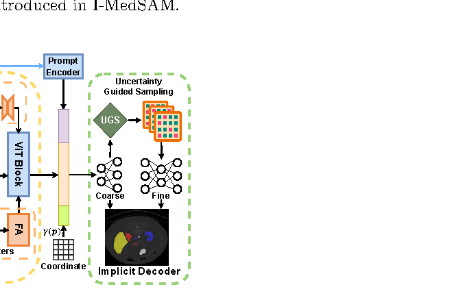

**Abstract**  
With the development of Deep Neural Networks (DNNs), many efforts have been made to handle medical image segmentation. Traditional methods such as nnUNet train specific segmentation models on the individual datasets. Plenty of recent methods have been proposed to adapt the foundational Segment Anything Model (SAM) to medical image segmentation. However, they still focus on discrete representations to generate pixel-wise predictions, which are spatially inflexible and scale poorly to higher resolution. In contrast, implicit methods learn continuous representations for segmentation, which is crucial for medical image segmentation. In this paper, we propose I-MedSAM, which leverages the benefits of both continuous representations and SAM, to obtain better cross-domain ability and accurate boundary delineation. Since medical image segmentation needs to predict detailed segmentation boundaries, we designed a novel adapter to enhance the SAM features with high-frequency information during Parameter-Efficient Fine-Tuning (PEFT). To convert the SAM features and coordinates into continuous segmentation output, we utilize Implicit Neural Representation (INR) to learn an implicit segmentation decoder. We also propose an uncertainty-guided sampling strategy for efficient learning of INR. Extensive evaluations on 2D medical image segmentation tasks have shown that our proposed method with only 1.6M trainable parameters outperforms existing methods including discrete and implicit methods. The code will be available at: https://github.com/ucwxb/I-MedSAM.

**Summary**  
TBD

[⬆ Back to Literature Table](#samothers)

---

### <a id="unleashing-the-power-of-prompt-driven-nucleus-in-654f1c0a">Unleashing the Power of Prompt-driven Nucleus Instance Segmentation</a>
> **Venue:** Lecture Notes in Computer Science 2025  
> **Authors:** Z. Shui et al.  
> **Keywords:** OtherMIS, SAM
**Links**  
[Viewable Link](https://link.springer.com/10.1007/978-3-031-73383-3_17) [Original Link](https://arxiv.org/pdf/2311.15939.pdf) [Code](https://github.com/windygoo/PromptNucSeg)

  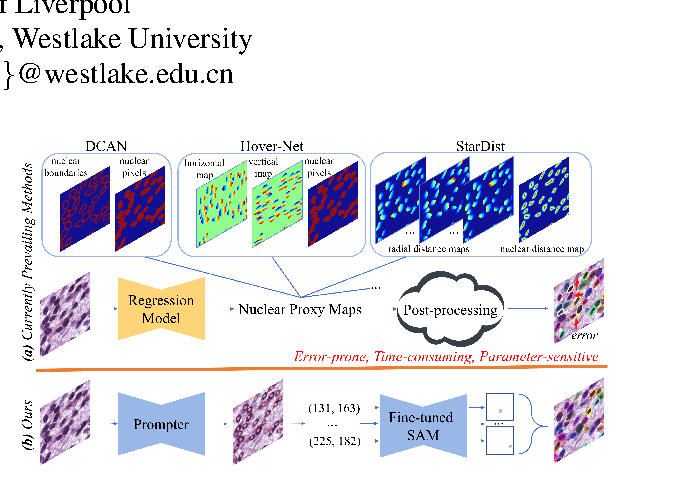

**Abstract**  
Nucleus instance segmentation in histology images is crucial for a broad spectrum of clinical applications. Current dominant algorithms rely on regression of nuclear proxy maps. Distinguishing nucleus instances from the estimated maps requires carefully curated post-processing, which is error-prone and parameter-sensitive. Recently, the Segment Anything Model (SAM) has earned huge attention in medical image segmentation, owing to its impressive generalization ability and promptable property. Nevertheless, its potential on nucleus instance segmentation remains largely underexplored. In this paper, we present a novel prompt-driven framework that consists of a nucleus prompter and SAM for automatic nucleus instance segmentation. Specifically, the prompter learns to generate a unique point prompt for each nucleus while the SAM is fine-tuned to output the corresponding mask for the prompted nucleus. Furthermore, we propose the inclusion of adjacent nuclei as negative prompts to enhance the model's capability to identify overlapping nuclei. Without complicated post-processing, our proposed method sets a new state-of-the-art performance on three challenging benchmarks. Code is available at \url{github.com/windygoo/PromptNucSeg}

**Summary**  
TBD

[⬆ Back to Literature Table](#samothers)

---

### <a id="where-to-begin-from-random-to-foundation-model-i-9191fae9">Where to Begin? From Random to Foundation Model Instructed Initialization in Federated Learning for Medical Image Segmentation</a>
> **Venue:** 2024 IEEE International Symposium on Biomedical Imaging (ISBI)  
> **Authors:** M. Li and G. Yang et al.  
> **Keywords:** OtherMIS, SAM
**Links**  
[Viewable Link](https://ieeexplore.ieee.org/document/10635665/) [Original Link](https://arxiv.org/pdf/2311.15463.pdf)

  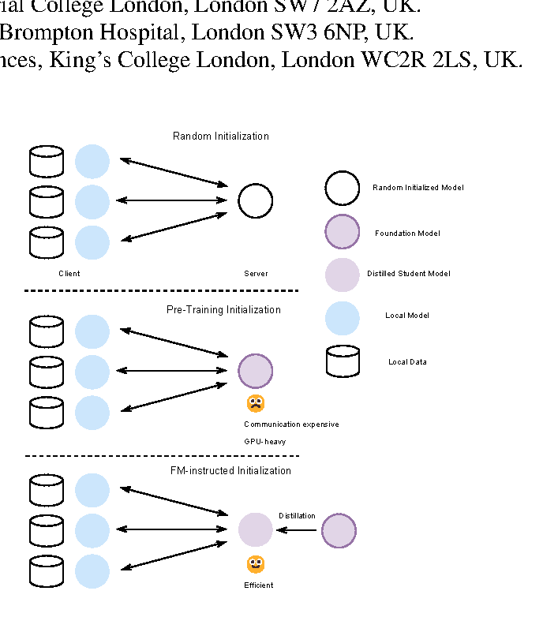

**Abstract**  
In medical image analysis, Federated Learning (FL) stands out as a key technology that enables privacy-preserved, decentralized data processing, crucial for handling sensitive medical data. Currently, most FL models employ random initialization, which has been proven effective in various instances. However, given the unique challenges posed by non-IID (independently and identically distributed) data in FL, we propose a novel perspective: exploring the impact of using the foundation model with enormous pre-trained knowledge, such as the Segment Anything Model (SAM), as an instructive teacher for FL model initialization in medical image segmentation task. This work for the first time attempts to utilize the foundation model as an instructive teacher for initialization in FL, assessing its impact on the performance of FL models, especially in non-IID data scenarios. Our empirical evaluation on chest x-ray lung segmentation showcases that FL with foundation model instructed initialization not only achieves faster convergence but also improves performance in complex data contexts. These findings offer a new perspective for model initialization in FL.

**Summary**  
TBD

[⬆ Back to Literature Table](#samothers)

---

### <a id="guided-prompting-in-sam-for-weakly-supervised-ce-c9841b7d">Guided Prompting in SAM for Weakly Supervised Cell Segmentation in Histopathological Images</a>
> **Venue:** 2023  
> **Authors:** AK. Tyagi et al.  
> **Keywords:** Weakly-SupervisedMIS, SAM
**Links**  
[Viewable Link](https://arxiv.org/pdf/2311.17960.pdf) [Code](https://github.com/dair-iitd/Guided-Prompting-SAM)

  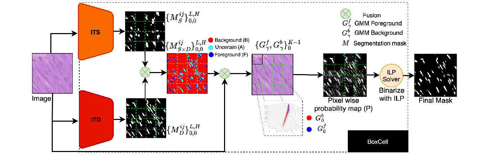

**Abstract**  
TBD

**Summary**  
TBD

[⬆ Back to Literature Table](#samwsmis)

---

### <a id="segvol-universal-and-interactive-volumetric-medi-48019e92">SegVol: Universal and Interactive Volumetric Medical Image Segmentation</a>
> **Venue:** Advances in Neural Information Processing Systems 37 2024  
> **Authors:** Y. Du et al.  
> **Keywords:** InteractiveMIS, SAM
**Links**  
[Viewable Link](http://www.proceedings.com/079017-3516.html) [Original Link](https://arxiv.org/pdf/2311.13385.pdf) [Code](https://github.com/BAAI-DCAI/SegVol)

  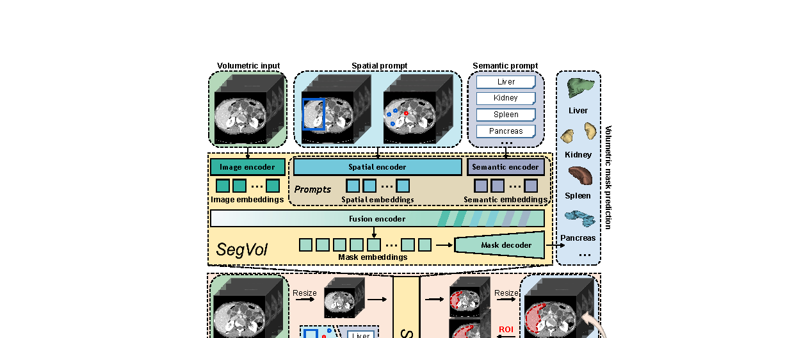

**Abstract**  
Precise image segmentation provides clinical study with instructive information. Despite the remarkable progress achieved in medical image segmentation, there is still an absence of a 3D foundation segmentation model that can segment a wide range of anatomical categories with easy user interaction. In this paper, we propose a 3D foundation segmentation model, named SegVol, supporting universal and interactive volumetric medical image segmentation. By scaling up training data to 90K unlabeled Computed Tomography (CT) volumes and 6K labeled CT volumes, this foundation model supports the segmentation of over 200 anatomical categories using semantic and spatial prompts. To facilitate efficient and precise inference on volumetric images, we design a zoom-out-zoom-in mechanism. Extensive experiments on 22 anatomical segmentation tasks verify that SegVol outperforms the competitors in 19 tasks, with improvements up to 37.24% compared to the runner-up methods. We demonstrate the effectiveness and importance of specific designs by ablation study. We expect this foundation model can promote the development of volumetric medical image analysis. The model and code are publicly available at: https://github.com/BAAI-DCAI/SegVol.

**Summary**  
TBD

[⬆ Back to Literature Table](#samiwmis)

---

### <a id="on-the-out-of-distribution-robustness-of-foundat-c0fff4c7">On the Out of Distribution Robustness of Foundation Models in Medical Image Segmentation</a>
> **Venue:** arXiv.org 2023  
> **Authors:** DM. Nguyen et al.  
> **Keywords:** OtherMIS, SAM
**Links**  
[Viewable Link](https://arxiv.org/abs/2311.11096) [Original Link](https://arxiv.org/pdf/2311.11096.pdf)

  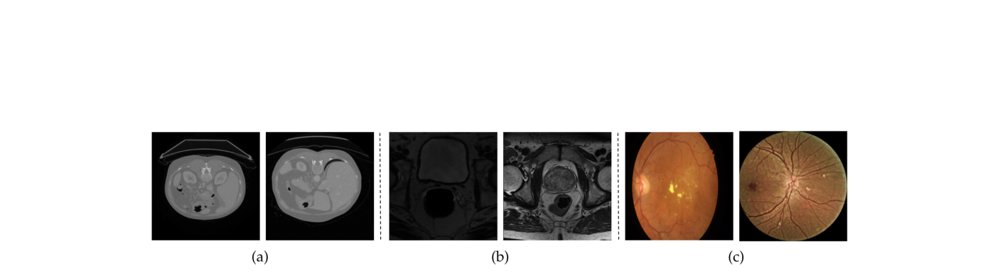

**Abstract**  
Constructing a robust model that can effectively generalize to test samples under distribution shifts remains a significant challenge in the field of medical imaging. The foundational models for vision and language, pre-trained on extensive sets of natural image and text data, have emerged as a promising approach. It showcases impressive learning abilities across different tasks with the need for only a limited amount of annotated samples. While numerous techniques have focused on developing better fine-tuning strategies to adapt these models for specific domains, we instead examine their robustness to domain shifts in the medical image segmentation task. To this end, we compare the generalization performance to unseen domains of various pre-trained models after being fine-tuned on the same in-distribution dataset and show that foundation-based models enjoy better robustness than other architectures. From here, we further developed a new Bayesian uncertainty estimation for frozen models and used them as an indicator to characterize the model's performance on out-of-distribution (OOD) data, proving particularly beneficial for real-world applications. Our experiments not only reveal the limitations of current indicators like accuracy on the line or agreement on the line commonly used in natural image applications but also emphasize the promise of the introduced Bayesian uncertainty. Specifically, lower uncertainty predictions usually tend to higher out-of-distribution (OOD) performance.

**Summary**  
TBD

[⬆ Back to Literature Table](#samothers)

---

### <a id="a-foundation-model-for-cell-segmentation-2ad0446e">A Foundation Model for Cell Segmentation</a>
> **Venue:** Nature Methods 2025  
> **Authors:** U. Israel et al.  
> **Keywords:** InteractiveMIS, SAM
**Links**  
[Viewable Link](https://www.nature.com/articles/s41592-025-02879-w) [Original Link](https://www.biorxiv.org/content/10.1101/2023.11.17.567630v2.abstract) [Code](https://label-dev.deepcell.org)

  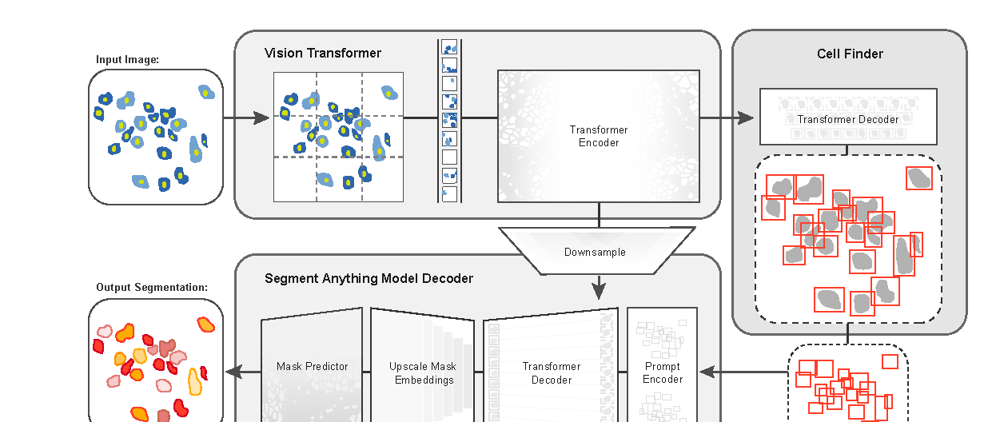

**Abstract**  
Cells are the fundamental unit of biological organization, and identifying them in imaging data - cell segmentation - is a critical task for various cellular imaging experiments. While deep learning methods have led to substantial progress on this problem, models that have seen wide use are specialist models that work well for specific domains. Methods that have learned the general notion of "what is a cell" and can identify them across different domains of cellular imaging data have proven elusive. In this work, we present CellSAM, a foundation model for cell segmentation that generalizes across diverse cellular imaging data. CellSAM builds on top of the Segment Anything Model (SAM) by developing a prompt engineering approach to mask generation. We train an object detector, CellFinder, to automatically detect cells and prompt SAM to generate segmentations. We show that this approach allows a single model to achieve state-of-the-art performance for segmenting images of mammalian cells (in tissues and cell culture), yeast, and bacteria collected with various imaging modalities. To enable accessibility, we integrate CellSAM into DeepCell Label to further accelerate human-in-the-loop labeling strategies for cellular imaging data. A deployed version of CellSAM is available at https://label-dev.deepcell.org/.

**Summary**  
TBD

[⬆ Back to Literature Table](#samiwmis)

---

### <a id="slide-sam-medical-sam-meets-sliding-window-4e19b117">Slide-SAM: Medical SAM Meets Sliding Window</a>
> **Venue:** arXiv.org 2023  
> **Authors:** Q. Quan et al.  
> **Keywords:** OtherMIS, SAM
**Links**  
[Viewable Link](https://arxiv.org/abs/2311.10121) [Original Link](https://arxiv.org/pdf/2311.10121.pdf)

  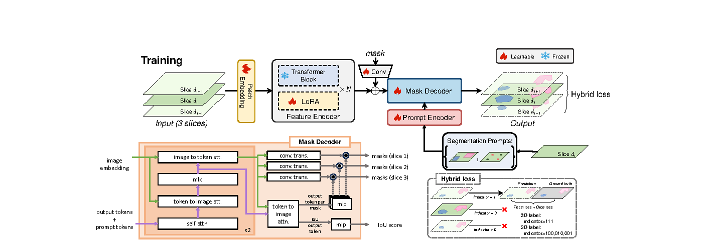

**Abstract**  
The Segment Anything Model (SAM) has achieved a notable success in two-dimensional image segmentation in natural images. However, the substantial gap between medical and natural images hinders its direct application to medical image segmentation tasks. Particularly in 3D medical images, SAM struggles to learn contextual relationships between slices, limiting its practical applicability. Moreover, applying 2D SAM to 3D images requires prompting the entire volume, which is time- and label-consuming. To address these problems, we propose Slide-SAM, which treats a stack of three adjacent slices as a prediction window. It firstly takes three slices from a 3D volume and point- or bounding box prompts on the central slice as inputs to predict segmentation masks for all three slices. Subsequently, the masks of the top and bottom slices are then used to generate new prompts for adjacent slices. Finally, step-wise prediction can be achieved by sliding the prediction window forward or backward through the entire volume. Our model is trained on multiple public and private medical datasets and demonstrates its effectiveness through extensive 3D segmetnation experiments, with the help of minimal prompts. Code is available at \url{https://github.com/Curli-quan/Slide-SAM}.

**Summary**  
TBD

[⬆ Back to Literature Table](#samothers)

---

### <a id="segment-anything-model-with-uncertainty-rectific-68beb41d">Segment Anything Model with Uncertainty Rectification for Auto-Prompting Medical Image Segmentation</a>
> **Venue:** 2023  
> **Authors:** Y. Zhang et al.  
> **Keywords:** OtherMIS, SAM
**Links**  
[Viewable Link](https://arxiv.org/pdf/2311.10529.pdf) [Code](https://github.com/YichiZhang98/UR-SAM)

  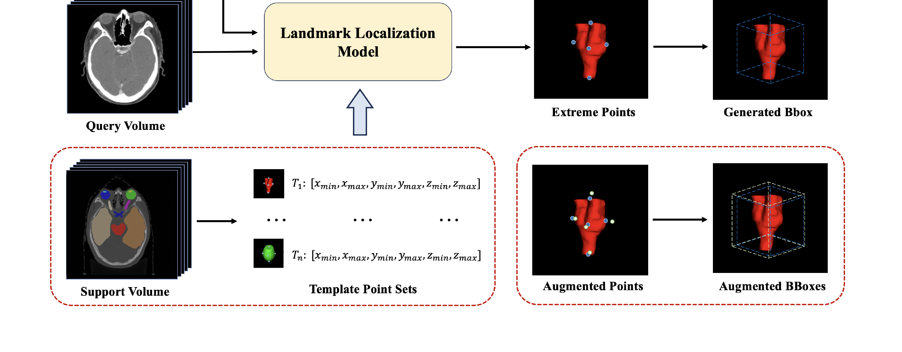

**Abstract**  
TBD

**Summary**  
TBD

[⬆ Back to Literature Table](#samothers)

---

### <a id="samihs-adaptation-of-segment-anything-model-for-b428bfa5">SAMIHS: Adaptation of Segment Anything Model for Intracranial Hemorrhage Segmentation</a>
> **Venue:** 2024 IEEE International Symposium on Biomedical Imaging (ISBI)  
> **Authors:** Y. Wang et al.  
> **Keywords:** OtherMIS, SAM
**Links**  
[Viewable Link](https://ieeexplore.ieee.org/document/10635673/) [Original Link](https://arxiv.org/pdf/2311.08190.pdf) [Code](https://github.com/mileswyn/SAMIHS)

  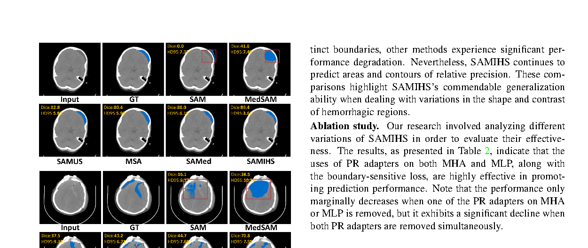

**Abstract**  
Segment Anything Model (SAM), a vision foundation model trained on large-scale annotations, has recently continued raising awareness within medical image segmentation. Despite the impressive capabilities of SAM on natural scenes, it struggles with performance decline when confronted with medical images, especially those involving blurry boundaries and highly irregular regions of low contrast. In this paper, a SAM-based parameter-efficient fine-tuning method, called SAMIHS, is proposed for intracranial hemorrhage segmentation, which is a crucial and challenging step in stroke diagnosis and surgical planning. Distinguished from previous SAM and SAM-based methods, SAMIHS incorporates parameter-refactoring adapters into SAM's image encoder and considers the efficient and flexible utilization of adapters' parameters. Additionally, we employ a combo loss that combines binary cross-entropy loss and boundary-sensitive loss to enhance SAMIHS's ability to recognize the boundary regions. Our experimental results on two public datasets demonstrate the effectiveness of our proposed method. Code is available at https://github.com/mileswyn/SAMIHS .

**Summary**  
TBD

[⬆ Back to Literature Table](#samothers)

---

### <a id="glanceseg-real-time-microangioma-lesion-segmenta-b339d6a9">GlanceSeg: Real-time microangioma lesion segmentation with gaze map-guided foundation model for early detection of diabetic retinopathy</a>
> **Venue:** 2023  
> **Authors:** H. Jiang et al.  
> **Keywords:** OtherMIS, SAM
**Links**  
[Viewable Link](https://arxiv.org/pdf/2311.08075.pdf)

  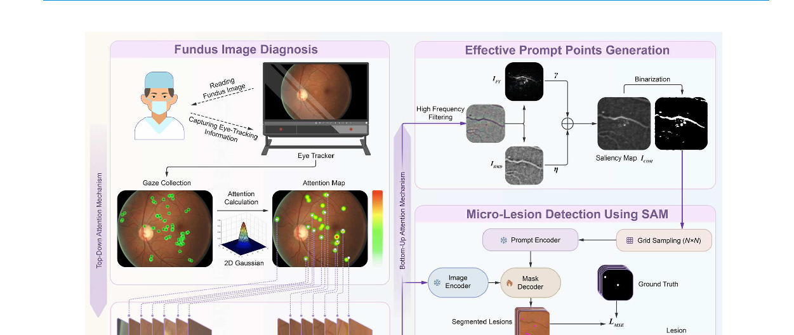

**Abstract**  
TBD

**Summary**  
TBD

[⬆ Back to Literature Table](#samothers)

---

### <a id="eviprompt-a-training-free-evidential-prompt-gene-09940681">EviPrompt: A Training-Free Evidential Prompt Generation Method for Segment Anything Model in Medical Images</a>
> **Venue:** IEEE Transactions on Image Processing 2024  
> **Authors:** Y. Xu et al.  
> **Keywords:** Zero-ShotMIS, SAM
**Links**  
[Viewable Link](https://ieeexplore.ieee.org/document/10729707/) [Original Link](https://arxiv.org/pdf/2311.06400.pdf)

  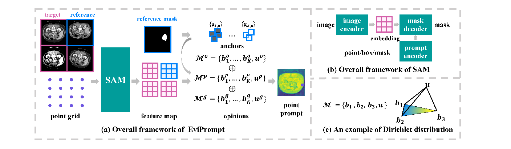

**Abstract**  
Medical image segmentation has immense clinical applicability but remains a challenge despite advancements in deep learning. The Segment Anything Model (SAM) exhibits potential in this field, yet the requirement for expertise intervention and the domain gap between natural and medical images poses significant obstacles. This paper introduces a novel training-free evidential prompt generation method named EviPrompt to overcome these issues. The proposed method, built on the inherent similarities within medical images, requires only a single reference image-annotation pair, making it a training-free solution that significantly reduces the need for extensive labeling and computational resources. First, to automatically generate prompts for SAM in medical images, we introduce an evidential method based on uncertainty estimation without the interaction of clinical experts. Then, we incorporate the human prior into the prompts, which is vital for alleviating the domain gap between natural and medical images and enhancing the applicability and usefulness of SAM in medical scenarios. EviPrompt represents an efficient and robust approach to medical image segmentation, with evaluations across a broad range of tasks and modalities confirming its efficacy.

**Summary**  
TBD

[⬆ Back to Literature Table](#samzsmis)

---

### <a id="are-foundation-models-efficient-for-medical-imag-e81ab192">Are foundation models efficient for medical image segmentation?</a>
> **Venue:** Informatik aktuell 2026  
> **Authors:** DL. Ferreira and R. Arnaout  
> **Keywords:** SSLMIS, SAM
**Links**  
[Viewable Link](https://link.springer.com/10.1007/978-3-658-51100-5_8) [Original Link](https://arxiv.org/pdf/2311.04847.pdf) [Code](https://github.com/ArnaoutLabUCSF/CardioML)

  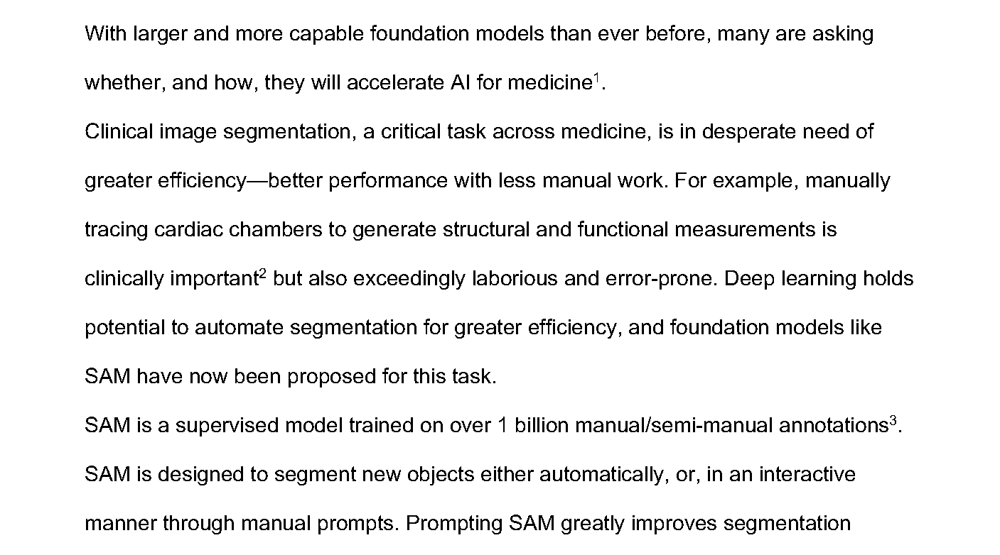

**Abstract**  
Foundation models are experiencing a surge in popularity. The Segment Anything model (SAM) asserts an ability to segment a wide spectrum of objects but required supervised training at unprecedented scale. We compared SAM's performance (against clinical ground truth) and resources (labeling time, compute) to a modality-specific, label-free self-supervised learning (SSL) method on 25 measurements for 100 cardiac ultrasounds. SAM performed poorly and required significantly more labeling and computing resources, demonstrating worse efficiency than SSL.

**Summary**  
TBD

[⬆ Back to Literature Table](#samsslmis)

---

### <a id="promise-prompt-driven-3d-medical-image-segmentat-434e4e25">Promise:Prompt-driven 3D Medical Image Segmentation Using Pretrained Image Foundation Models</a>
> **Venue:** 2024 IEEE International Symposium on Biomedical Imaging (ISBI)  
> **Authors:** H. Li et al.  
> **Keywords:** OtherMIS, SAM
**Links**  
[Viewable Link](https://ieeexplore.ieee.org/document/10635207/) [Original Link](https://arxiv.org/pdf/2310.19721.pdf) [Code](https://github.com/MedICL-VU/ProMISe)

  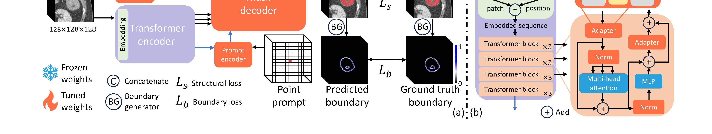

**Abstract**  
To address prevalent issues in medical imaging, such as data acquisition challenges and label availability, transfer learning from natural to medical image domains serves as a viable strategy to produce reliable segmentation results. However, several existing barriers between domains need to be broken down, including addressing contrast discrepancies, managing anatomical variability, and adapting 2D pretrained models for 3D segmentation tasks. In this paper, we propose ProMISe,a prompt-driven 3D medical image segmentation model using only a single point prompt to leverage knowledge from a pretrained 2D image foundation model. In particular, we use the pretrained vision transformer from the Segment Anything Model (SAM) and integrate lightweight adapters to extract depth-related (3D) spatial context without updating the pretrained weights. For robust results, a hybrid network with complementary encoders is designed, and a boundary-aware loss is proposed to achieve precise boundaries. We evaluate our model on two public datasets for colon and pancreas tumor segmentations, respectively. Compared to the state-of-the-art segmentation methods with and without prompt engineering, our proposed method achieves superior performance. The code is publicly available at https://github.com/MedICL-VU/ProMISe.

**Summary**  
TBD

[⬆ Back to Literature Table](#samothers)

---

### <a id="one-shot-localization-and-segmentation-of-medica-8297cfd6">One-shot Localization and Segmentation of Medical Images with Foundation Models</a>
> **Venue:** arXiv.org 2023  
> **Authors:** D. Anand et al.  
> **Keywords:** Few-ShotMIS, SAM
**Links**  
[Viewable Link](https://arxiv.org/abs/2310.18642) [Original Link](https://arxiv.org/pdf/2310.18642.pdf)

  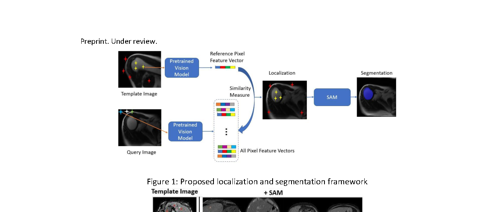

**Abstract**  
Recent advances in Vision Transformers (ViT) and Stable Diffusion (SD) models with their ability to capture rich semantic features of the image have been used for image correspondence tasks on natural images. In this paper, we examine the ability of a variety of pre-trained ViT (DINO, DINOv2, SAM, CLIP) and SD models, trained exclusively on natural images, for solving the correspondence problems on medical images. While many works have made a case for in-domain training, we show that the models trained on natural images can offer good performance on medical images across different modalities (CT,MR,Ultrasound) sourced from various manufacturers, over multiple anatomical regions (brain, thorax, abdomen, extremities), and on wide variety of tasks. Further, we leverage the correspondence with respect to a template image to prompt a Segment Anything (SAM) model to arrive at single shot segmentation, achieving dice range of 62%-90% across tasks, using just one image as reference. We also show that our single-shot method outperforms the recently proposed few-shot segmentation method - UniverSeg (Dice range 47%-80%) on most of the semantic segmentation tasks(six out of seven) across medical imaging modalities.

**Summary**  
TBD

[⬆ Back to Literature Table](#samfsmis)

---

### <a id="sam-med3d-4347ab8b">SAM-Med3D</a>
> **Venue:** 2023  
> **Authors:** H. Wang et al.  
> **Keywords:** OtherMIS, SAM
**Links**  
[Viewable Link](https://arxiv.org/pdf/2310.15161.pdf) [Code](https://github.com/uni-medical/SAM-Med3D)

  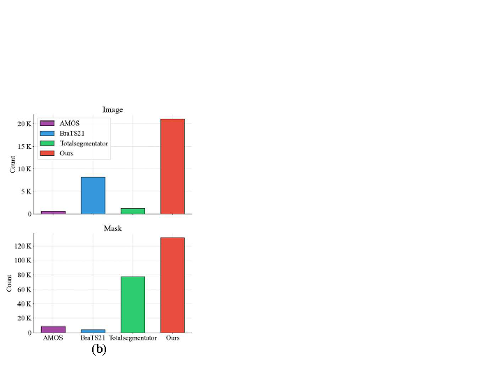

**Abstract**  
TBD

**Summary**  
TBD

[⬆ Back to Literature Table](#samothers)

---

### <a id="evaluation-and-improvement-of-segment-anything-m-35835e3f">Evaluation and improvement of Segment Anything Model for interactive histopathology image segmentation</a>
> **Venue:** Lecture Notes in Computer Science 2023  
> **Authors:** SK. Kim et al.  
> **Keywords:** Zero-ShotMIS, SAM
**Links**  
[Viewable Link](https://link.springer.com/10.1007/978-3-031-47401-9_24) [Original Link](https://arxiv.org/pdf/2310.10493.pdf) [Code](https://github.com/hvcl/SAM_Interactive_Histopathology)

  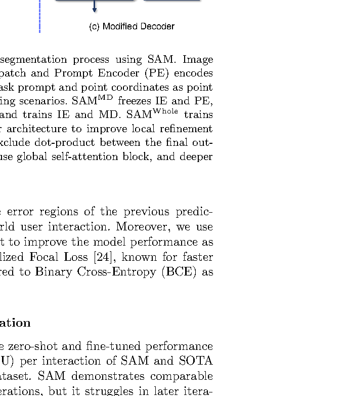

**Abstract**  
With the emergence of the Segment Anything Model (SAM) as a foundational model for image segmentation, its application has been extensively studied across various domains, including the medical field. However, its potential in the context of histopathology data, specifically in region segmentation, has received relatively limited attention. In this paper, we evaluate SAM's performance in zero-shot and fine-tuned scenarios on histopathology data, with a focus on interactive segmentation. Additionally, we compare SAM with other state-of-the-art interactive models to assess its practical potential and evaluate its generalization capability with domain adaptability. In the experimental results, SAM exhibits a weakness in segmentation performance compared to other models while demonstrating relative strengths in terms of inference time and generalization capability. To improve SAM's limited local refinement ability and to enhance prompt stability while preserving its core strengths, we propose a modification of SAM's decoder. The experimental results suggest that the proposed modification is effective to make SAM useful for interactive histology image segmentation. The code is available at \url{https://github.com/hvcl/SAM_Interactive_Histopathology}

**Summary**  
TBD

[⬆ Back to Literature Table](#samzsmis)

---

### <a id="sam-octa-prompting-segment-anything-for-octa-ima-47f2bc6c">SAM-OCTA: Prompting Segment-Anything for OCTA Image Segmentation</a>
> **Venue:** Biomedical Signal Processing and Control 2025  
> **Authors:** X. Chen et al.  
> **Keywords:** OtherMIS, SAM
**Links**  
[Viewable Link](https://linkinghub.elsevier.com/retrieve/pii/S1746809425002095) [Original Link](https://arxiv.org/pdf/2310.07183.pdf) [Code](https://github.com/ShellRedia/SAM-OCTA)

  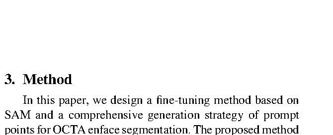

**Abstract**  
Segmenting specific targets or biomarkers is necessary to analyze optical coherence tomography angiography (OCTA) images. Previous methods typically segment all the targets in an OCTA sample, such as retinal vessels (RVs). Although these methods perform well in accuracy and precision, OCTA analyses often focusing local information within the images which has not been fulfilled. In this paper, we propose a method called SAM-OCTA for local segmentation in OCTA images. The method fine-tunes a pre-trained segment anything model (SAM) using low-rank adaptation (LoRA) and utilizes prompt points for local RVs, arteries, and veins segmentation in OCTA. To explore the effect and mechanism of prompt points, we set up global and local segmentation modes with two prompt point generation strategies, namely random selection and special annotation. Considering practical usage, we conducted extended experiments with different model scales and analyzed the model performance before and after fine-tuning besides the general segmentation task. From comprehensive experimental results with the OCTA-500 dataset, our SAM-OCTA method has achieved state-of-the-art performance in common OCTA segmentation tasks related to RV and FAZ, and it also performs accurate segmentation of artery-vein and local vessels. The code is available at https://github.com/ShellRedia/SAM-OCTA-extend.

**Summary**  
TBD

[⬆ Back to Literature Table](#samothers)

---

### <a id="empirical-evaluation-of-the-segment-anything-mod-512eedc1">Empirical Evaluation of the Segment Anything Model (SAM) for Brain Tumor Segmentation</a>
> **Venue:** 2024 IEEE International Symposium on Biomedical Imaging (ISBI)  
> **Authors:** M. Peivandi et al.  
> **Keywords:** OtherMIS, SAM
**Links**  
[Viewable Link](https://ieeexplore.ieee.org/document/10635848/) [Original Link](https://arxiv.org/pdf/2310.06162.pdf)

  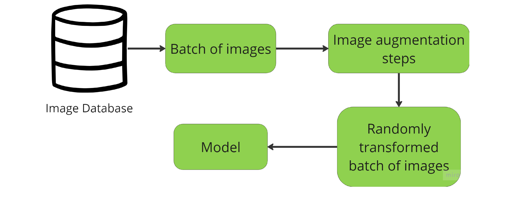

**Abstract**  
Brain tumor segmentation presents a formidable challenge in the field of Medical Image Segmentation. While deep-learning models have been useful, human expert segmentation remains the most accurate method. The recently released Segment Anything Model (SAM) has opened up the opportunity to apply foundation models to this difficult task. However, SAM was primarily trained on diverse natural images. This makes applying SAM to biomedical segmentation, such as brain tumors with less defined boundaries, challenging. In this paper, we enhanced SAM's mask decoder using transfer learning with the Decathlon brain tumor dataset. We developed three methods to encapsulate the four-dimensional data into three dimensions for SAM. An on-the-fly data augmentation approach has been used with a combination of rotations and elastic deformations to increase the size of the training dataset. Two key metrics: the Dice Similarity Coefficient (DSC) and the Hausdorff Distance 95th Percentile (HD95), have been applied to assess the performance of our segmentation models. These metrics provided valuable insights into the quality of the segmentation results. In our evaluation, we compared this improved model to two benchmarks: the pretrained SAM and the widely used model, nnUNetv2. We find that the improved SAM shows considerable improvement over the pretrained SAM, while nnUNetv2 outperformed the improved SAM in terms of overall segmentation accuracy. Nevertheless, the improved SAM demonstrated slightly more consistent results than nnUNetv2, especially on challenging cases that can lead to larger Hausdorff distances. In the future, more advanced techniques can be applied in order to further improve the performance of SAM on brain tumor segmentation.

**Summary**  
TBD

[⬆ Back to Literature Table](#samothers)

---

### <a id="sonosam-segment-anything-on-ultrasound-images-0825b5f5">SonoSAM - Segment Anything on Ultrasound Images</a>
> **Venue:** Lecture Notes in Computer Science 2023  
> **Authors:** H. Ravishankar et al.  
> **Keywords:** OtherMIS, SAM
**Links**  
[Viewable Link](https://link.springer.com/10.1007/978-3-031-44521-7_3) [Original Link](https://link.springer.com/chapter/10.1007/978-3-031-44521-7_3)

  <!-- Add image to imgs/ and uncomment the img tag below. -->
  <!--  -->

**Abstract**  
In this paper, we present SonoSAM - a promptable foundational model for segmenting objects of interest on ultrasound images. Fine-tuned exclusively on a rich, diverse set of objects from $$\approx...

**Summary**  
TBD

[⬆ Back to Literature Table](#samothers)

---

### <a id="exploring-sam-ablations-for-enhancing-medical-se-69c9f13f">Exploring SAM Ablations for Enhancing Medical Segmentation in Radiology and Pathology</a>
> **Venue:** arXiv.org 2023  
> **Authors:** A. Ranem et al.  
> **Keywords:** OtherMIS, SAM
**Links**  
[Viewable Link](https://arxiv.org/abs/2310.00504) [Original Link](https://arxiv.org/pdf/2310.00504.pdf)

  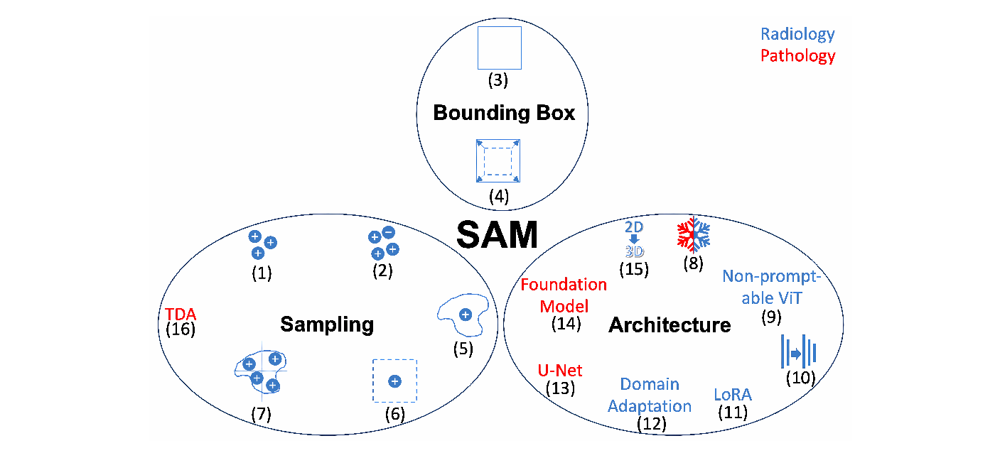

**Abstract**  
Medical imaging plays a critical role in the diagnosis and treatment planning of various medical conditions, with radiology and pathology heavily reliant on precise image segmentation. The Segment Anything Model (SAM) has emerged as a promising framework for addressing segmentation challenges across different domains. In this white paper, we delve into SAM, breaking down its fundamental components and uncovering the intricate interactions between them. We also explore the fine-tuning of SAM and assess its profound impact on the accuracy and reliability of segmentation results, focusing on applications in radiology (specifically, brain tumor segmentation) and pathology (specifically, breast cancer segmentation). Through a series of carefully designed experiments, we analyze SAM's potential application in the field of medical imaging. We aim to bridge the gap between advanced segmentation techniques and the demanding requirements of healthcare, shedding light on SAM's transformative capabilities.

**Summary**  
TBD

[⬆ Back to Literature Table](#samothers)

---

### <a id="comprehensive-multimodal-segmentation-in-medical-8adfbaac">Comprehensive Multimodal Segmentation in Medical Imaging: Combining YOLOv8 with SAM and HQ-SAM Models</a>
> **Venue:** 2023 IEEE/CVF International Conference on Computer Vision Workshops (ICCVW)  
> **Authors:** S. Pandey et al.  
> **Keywords:** OtherMIS, SAM
**Links**  
[Viewable Link](https://ieeexplore.ieee.org/document/10350376/) [Original Link](https://openaccess.thecvf.com/content/ICCV2023W/CVAMD/papers/Pandey_Comprehensive_Multimodal_Segmentation_in_Medical_Imaging_Combining_YOLOv8_with_SAM_ICCVW_2023_paper.pdf)

  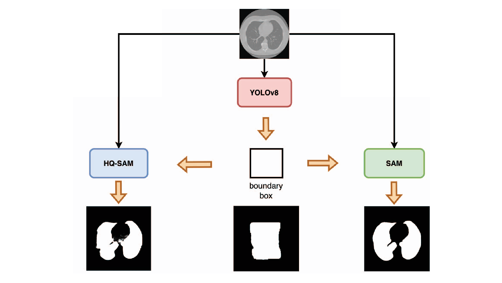

**Abstract**  
This paper introduces a comprehensive approach for segmenting regions of interest (ROI) in diverse medical imaging datasets, encompassing ultrasound, CT scans, and X-ray images. The proposed method harnesses the capabilities of the YOLOv8 model for approximate boundary box detection across modalities, alongside the Segment Anything Model (SAM) and High Quality (HQ) SAM for fully automatic and precise segmentation. To generate boundary boxes, the YOLOv8 model was trained using a limited set of 100 images and masks from each modality. The results obtained from our approach are extensively computed and analyzed, demonstrating its effectiveness and potential in medical image analysis. Various evaluation metrics, including precision, recall, F1 score, and Dice Score, were employed to quantify the accuracy of the segmentation results. A comparative analysis was conducted to assess the individual and combined performance of the YOLOv8, YOLOv8+SAM, and YOLOv8+HQ-SAM models. The results indicate that the SAM model performs better than the other two models, exhibiting higher segmentation accuracy and overall performance. While HQ-SAM offers potential advantages, its incremental gains over the standard SAM model may not justify the additional computational cost. The YOLOv8+SAM model shows promise for enhancing medical image segmentation and its clinical implications.

**Summary**  
TBD

[⬆ Back to Literature Table](#samothers)

---

### <a id="nnsam-plug-and-play-segment-anything-model-impro-e4709b8a">nnSAM: Plug-and-play Segment Anything Model Improves nnUNet Performance</a>
> **Venue:** Medical Physics 2025  
> **Authors:** Y. Li et al.  
> **Keywords:** OtherMIS, SAM
**Links**  
[Viewable Link](https://aapm.onlinelibrary.wiley.com/doi/10.1002/mp.17481) [Original Link](https://arxiv.org/pdf/2309.16967.pdf) [Code](https://github.com/Kent0n-Li/Medical-Image-Segmentation)

  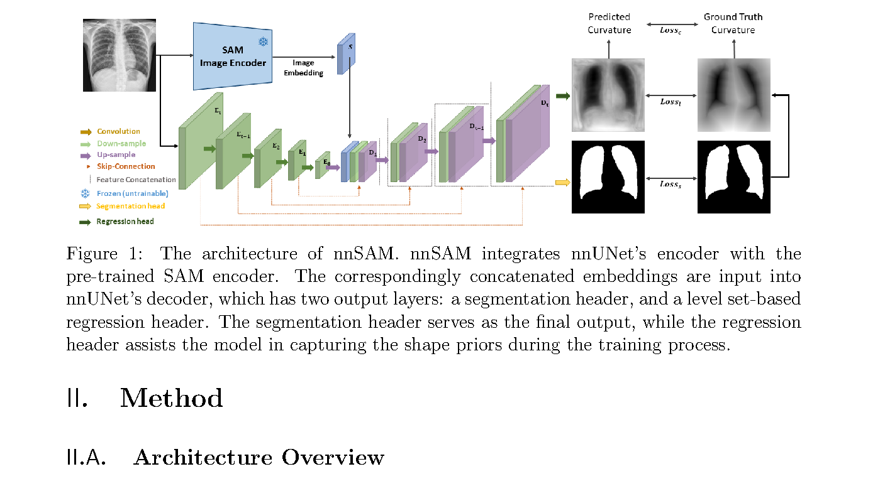

**Abstract**  
Automatic segmentation of medical images is crucial in modern clinical workflows. The Segment Anything Model (SAM) has emerged as a versatile tool for image segmentation without specific domain training, but it requires human prompts and may have limitations in specific domains. Traditional models like nnUNet perform automatic segmentation during inference and are effective in specific domains but need extensive domain-specific training. To combine the strengths of foundational and domain-specific models, we propose nnSAM, integrating SAM's robust feature extraction with nnUNet's automatic configuration to enhance segmentation accuracy on small datasets. Our nnSAM model optimizes two main approaches: leveraging SAM's feature extraction and nnUNet's domain-specific adaptation, and incorporating a boundary shape supervision loss function based on level set functions and curvature calculations to learn anatomical shape priors from limited data. We evaluated nnSAM on four segmentation tasks: brain white matter, liver, lung, and heart segmentation. Our method outperformed others, achieving the highest DICE score of 82.77% and the lowest ASD of 1.14 mm in brain white matter segmentation with 20 training samples, compared to nnUNet's DICE score of 79.25% and ASD of 1.36 mm. A sample size study highlighted nnSAM's advantage with fewer training samples. Our results demonstrate significant improvements in segmentation performance with nnSAM, showcasing its potential for small-sample learning in medical image segmentation.

**Summary**  
TBD

[⬆ Back to Literature Table](#samothers)

---

### <a id="mfs-enhanced-sam-achieving-superior-performance-bd1ce086">MFS enhanced SAM: Achieving superior performance in bimodal few-shot segmentation</a>
> **Venue:** Journal of Visual Communication and Image Representation 2023  
> **Authors:** Y. Zhao et al.  
> **Keywords:** Few-ShotMIS, SAM
**Links**  
[Viewable Link](https://linkinghub.elsevier.com/retrieve/pii/S1047320323001967) [Original Link](https://www.sciencedirect.com/science/article/abs/pii/S1047320323001967) [Code](https://github.com/VDT-2048/Bi-SAM)

  <!-- Add image to imgs/ and uncomment the img tag below. -->
  <!--  -->

**Abstract**  
TBD

**Summary**  
TBD

[⬆ Back to Literature Table](#samfsmis)

---

### <a id="sam-octa-a-fine-tuning-strategy-for-applying-fou-e760a655">SAM-OCTA: A Fine-Tuning Strategy for Applying Foundation Model to OCTA Image Segmentation Tasks</a>
> **Venue:** ICASSP 2024 - 2024 IEEE International Conference on Acoustics, Speech and Signal Processing (ICASSP)  
> **Authors:** C. Wang et al.  
> **Keywords:** OtherMIS, SAM
**Links**  
[Viewable Link](https://ieeexplore.ieee.org/document/10446904/) [Original Link](https://arxiv.org/pdf/2309.11758.pdf) [Code](https://github.com/ShellRedia/SAM-OCTA)

  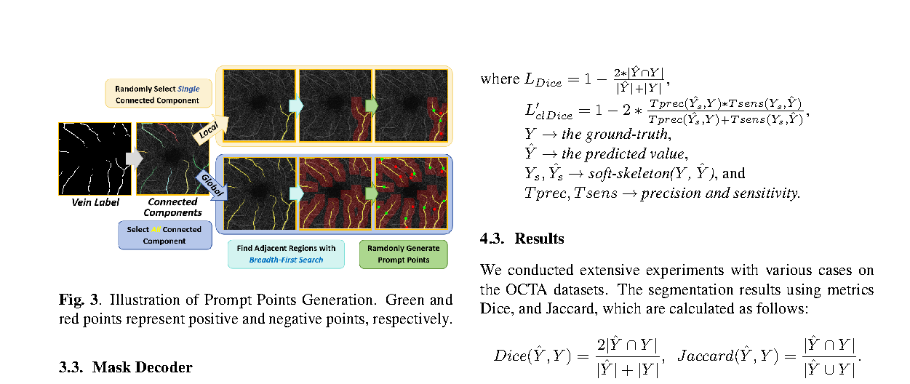

**Abstract**  
In the analysis of optical coherence tomography angiography (OCTA) images, the operation of segmenting specific targets is necessary. Existing methods typically train on supervised datasets with limited samples (approximately a few hundred), which can lead to overfitting. To address this, the low-rank adaptation technique is adopted for foundation model fine-tuning and proposed corresponding prompt point generation strategies to process various segmentation tasks on OCTA datasets. This method is named SAM-OCTA and has been experimented on the publicly available OCTA-500 dataset. While achieving state-of-the-art performance metrics, this method accomplishes local vessel segmentation as well as effective artery-vein segmentation, which was not well-solved in previous works. The code is available at: https://github.com/ShellRedia/SAM-OCTA.

**Summary**  
TBD

[⬆ Back to Literature Table](#samothers)

---

### <a id="3d-u-sam-network-for-few-shot-tooth-segmentation-b81b5364">3D-U-SAM Network For Few-shot Tooth Segmentation in CBCT Images</a>
> **Venue:** arXiv.org 2023  
> **Authors:** Y. Zhang et al.  
> **Keywords:** Few-ShotMIS, SAM
**Links**  
[Viewable Link](https://arxiv.org/abs/2309.11015) [Original Link](https://arxiv.org/pdf/2309.11015.pdf)

  <!-- Add image to imgs/ and uncomment the img tag below. -->
  <!--  -->

**Abstract**  
Accurate representation of tooth position is extremely important in treatment. 3D dental image segmentation is a widely used method, however labelled 3D dental datasets are a scarce resource, leading to the problem of small samples that this task faces in many cases. To this end, we address this problem with a pretrained SAM and propose a novel 3D-U-SAM network for 3D dental image segmentation. Specifically, in order to solve the problem of using 2D pre-trained weights on 3D datasets, we adopted a convolution approximation method; in order to retain more details, we designed skip connections to fuse features at all levels with reference to U-Net. The effectiveness of the proposed method is demonstrated in ablation experiments, comparison experiments, and sample size experiments.

**Summary**  
TBD

[⬆ Back to Literature Table](#samfsmis)

---

### <a id="comparative-eminence-foundation-versus-domain-sp-76ab4bd7">Comparative Eminence: Foundation versus Domain-Specific Model for Cardiac Ultrasound Segmentation</a>
> **Venue:** medRxiv 2023  
> **Authors:** CJ. Chao et al.  
> **Keywords:** OtherMIS, SAM
**Links**  
[Viewable Link](https://www.semanticscholar.org/paper/07e87e4f8625071fb509b532a07e057493e87e1e) [Original Link](https://www.medrxiv.org/content/medrxiv/early/2023/09/19/2023.09.19.23295772.full.pdf)

  <!-- Add image to imgs/ and uncomment the img tag below. -->
  <!--  -->

**Abstract**  
TBD

**Summary**  
TBD

[⬆ Back to Literature Table](#samothers)

---

### <a id="an-accurate-and-efficient-neural-network-for-oct-4ec02809">An Accurate and Efficient Neural Network for OCTA Vessel Segmentation and a New Dataset</a>
> **Venue:** ICASSP 2024 - 2024 IEEE International Conference on Acoustics, Speech and Signal Processing (ICASSP)  
> **Authors:** H. Ning et al.  
> **Keywords:** OtherMIS, SAM
**Links**  
[Viewable Link](https://ieeexplore.ieee.org/document/10447708/) [Original Link](https://arxiv.org/pdf/2309.09483.pdf) [Code](https://github.com/nhjydywd/OCTA-FRNet)

  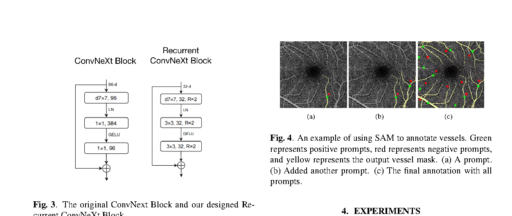

**Abstract**  
Optical coherence tomography angiography (OCTA) is a noninvasive imaging technique that can reveal high-resolution retinal vessels. In this work, we propose an accurate and efficient neural network for retinal vessel segmentation in OCTA images. The proposed network achieves accuracy comparable to other SOTA methods, while having fewer parameters and faster inference speed (e.g. 110x lighter and 1.3x faster than U-Net), which is very friendly for industrial applications. This is achieved by applying the modified Recurrent ConvNeXt Block to a full resolution convolutional network. In addition, we create a new dataset containing 918 OCTA images and their corresponding vessel annotations. The data set is semi-automatically annotated with the help of Segment Anything Model (SAM), which greatly improves the annotation speed. For the benefit of the community, our code and dataset can be obtained from https://github.com/nhjydywd/OCTA-FRNet.

**Summary**  
TBD

[⬆ Back to Literature Table](#samothers)

---

### <a id="ma-sam-modality-agnostic-sam-adaptation-for-3d-m-a5173ed5">MA-SAM: Modality-agnostic SAM Adaptation for 3D Medical Image Segmentation</a>
> **Venue:** Medical Image Analysis 2024  
> **Authors:** C. Chen et al.  
> **Keywords:** Zero-ShotMIS, SAM
**Links**  
[Viewable Link](https://linkinghub.elsevier.com/retrieve/pii/S1361841524002354) [Original Link](https://arxiv.org/pdf/2309.08842.pdf) [Code](https://github.com/cchen-cc/MA-SAM)

  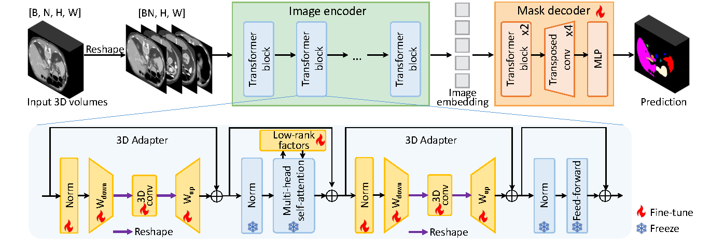

**Abstract**  
The Segment Anything Model (SAM), a foundation model for general image segmentation, has demonstrated impressive zero-shot performance across numerous natural image segmentation tasks. However, SAM's performance significantly declines when applied to medical images, primarily due to the substantial disparity between natural and medical image domains. To effectively adapt SAM to medical images, it is important to incorporate critical third-dimensional information, i.e., volumetric or temporal knowledge, during fine-tuning. Simultaneously, we aim to harness SAM's pre-trained weights within its original 2D backbone to the fullest extent. In this paper, we introduce a modality-agnostic SAM adaptation framework, named as MA-SAM, that is applicable to various volumetric and video medical data. Our method roots in the parameter-efficient fine-tuning strategy to update only a small portion of weight increments while preserving the majority of SAM's pre-trained weights. By injecting a series of 3D adapters into the transformer blocks of the image encoder, our method enables the pre-trained 2D backbone to extract third-dimensional information from input data. The effectiveness of our method has been comprehensively evaluated on four medical image segmentation tasks, by using 10 public datasets across CT, MRI, and surgical video data. Remarkably, without using any prompt, our method consistently outperforms various state-of-the-art 3D approaches, surpassing nnU-Net by 0.9%, 2.6%, and 9.9% in Dice for CT multi-organ segmentation, MRI prostate segmentation, and surgical scene segmentation respectively. Our model also demonstrates strong generalization, and excels in challenging tumor segmentation when prompts are used. Our code is available at: https://github.com/cchen-cc/MA-SAM.

**Summary**  
TBD

[⬆ Back to Literature Table](#samzsmis)

---

### <a id="segment-anything-model-for-brain-tumor-segmentat-66561c0b">Segment Anything Model for Brain Tumor Segmentation</a>
> **Venue:** arXiv.org 2023  
> **Authors:** P. Zhang and Y. Wang  
> **Keywords:** OtherMIS, SAM
**Links**  
[Viewable Link](https://arxiv.org/abs/2309.08434) [Original Link](https://arxiv.org/pdf/2309.08434.pdf)

  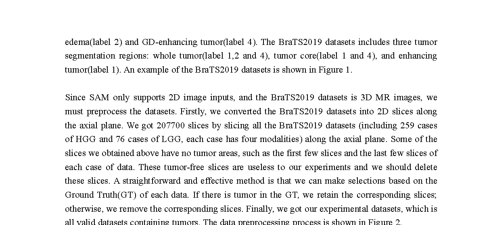

**Abstract**  
Glioma is a prevalent brain tumor that poses a significant health risk to individuals. Accurate segmentation of brain tumor is essential for clinical diagnosis and treatment. The Segment Anything Model(SAM), released by Meta AI, is a fundamental model in image segmentation and has excellent zero-sample generalization capabilities. Thus, it is interesting to apply SAM to the task of brain tumor segmentation. In this study, we evaluated the performance of SAM on brain tumor segmentation and found that without any model fine-tuning, there is still a gap between SAM and the current state-of-the-art(SOTA) model.

**Summary**  
TBD

[⬆ Back to Literature Table](#samothers)

---

### <a id="adapting-segment-anything-model-sam-for-retinal-4513b7ce">Adapting Segment Anything Model (SAM) for Retinal OCT</a>
> **Venue:** Lecture Notes in Computer Science 2023  
> **Authors:** B. Fazekas et al.  
> **Keywords:** OtherMIS, SAM
**Links**  
[Viewable Link](https://link.springer.com/10.1007/978-3-031-44013-7_10) [Original Link](https://link.springer.com/chapter/10.1007/978-3-031-44013-7_10)

  <!-- Add image to imgs/ and uncomment the img tag below. -->
  <!--  -->

**Abstract**  
The Segment Anything Model (SAM) has gained significant attention in the field of image segmentation due to its impressive capabilities and prompt-based interface. While SAM has already been extensively evaluated in various domains, its adaptation to retinal OCT...

**Summary**  
TBD

[⬆ Back to Literature Table](#samothers)

---

### <a id="samus-adapting-segment-anything-model-for-clinic-7e5e22cd">SAMUS: Adapting Segment Anything Model for Clinically-Friendly and Generalizable Ultrasound Image Segmentation</a>
> **Venue:** 2023  
> **Authors:** X. Lin et al.  
> **Keywords:** OtherMIS, SAM
**Links**  
[Viewable Link](https://arxiv.org/pdf/2309.06824.pdf) [Code](https://github.com/xianlin7/SAMUS)

  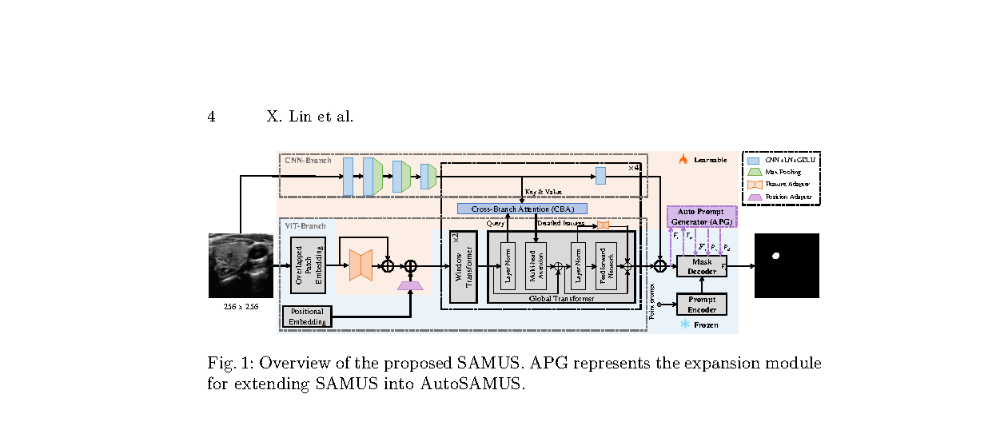

**Abstract**  
TBD

**Summary**  
TBD

[⬆ Back to Literature Table](#samothers)

---

### <a id="segmentanything-helps-microscopy-images-based-au-b251c401">SegmentAnything helps microscopy images based automatic and quantitative organoid detection and analysis</a>
> **Venue:** Medical Imaging 2024: Clinical and Biomedical Imaging  
> **Authors:** X. Xing et al.  
> **Keywords:** OtherMIS, SAM
**Links**  
[Viewable Link](https://www.spiedigitallibrary.org/conference-proceedings-of-spie/12930/3006022/SegmentAnything-helps-microscopy-images-based-on-automatic-and-quantitative-organoid/10.1117/12.3006022.full) [Original Link](https://arxiv.org/pdf/2309.04190.pdf) [Code](https://github.com/XiaodanXing/SAM4organoid)

  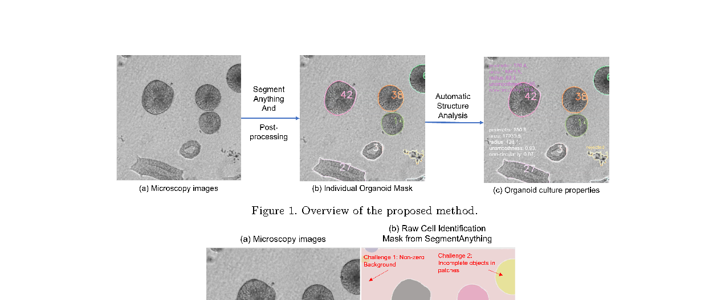

**Abstract**  
Organoids are self-organized 3D cell clusters that closely mimic the architecture and function of in vivo tissues and organs. Quantification of organoid morphology helps in studying organ development, drug discovery, and toxicity assessment. Recent microscopy techniques provide a potent tool to acquire organoid morphology features, but manual image analysis remains a labor and time-intensive process. Thus, this paper proposes a comprehensive pipeline for microscopy analysis that leverages the SegmentAnything to precisely demarcate individual organoids. Additionally, we introduce a set of morphological properties, including perimeter, area, radius, non-smoothness, and non-circularity, allowing researchers to analyze the organoid structures quantitatively and automatically. To validate the effectiveness of our approach, we conducted tests on bright-field images of human induced pluripotent stem cells (iPSCs) derived neural-epithelial (NE) organoids. The results obtained from our automatic pipeline closely align with manual organoid detection and measurement, showcasing the capability of our proposed method in accelerating organoids morphology analysis.

**Summary**  
TBD

[⬆ Back to Literature Table](#samothers)

---

### <a id="sam3d-segment-anything-model-in-volumetric-medic-7f25586a">SAM3D: Segment Anything Model in Volumetric Medical Images</a>
> **Venue:** 2024 IEEE International Symposium on Biomedical Imaging (ISBI)  
> **Authors:** NT. Bui et al.  
> **Keywords:** OtherMIS, SAM
**Links**  
[Viewable Link](https://ieeexplore.ieee.org/document/10635844/) [Original Link](https://arxiv.org/pdf/2309.03493.pdf) [Code](https://github.com/DinhHieuHoang/SAM3D)

  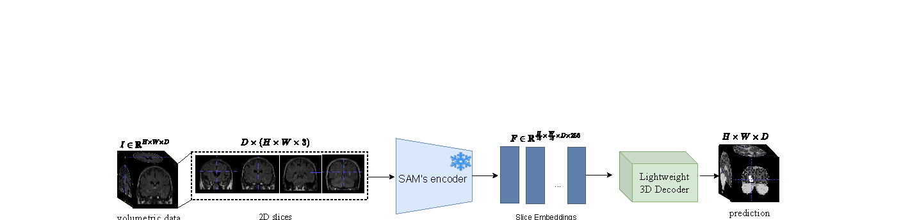

**Abstract**  
Image segmentation remains a pivotal component in medical image analysis, aiding in the extraction of critical information for precise diagnostic practices. With the advent of deep learning, automated image segmentation methods have risen to prominence, showcasing exceptional proficiency in processing medical imagery. Motivated by the Segment Anything Model (SAM)-a foundational model renowned for its remarkable precision and robust generalization capabilities in segmenting 2D natural images-we introduce SAM3D, an innovative adaptation tailored for 3D volumetric medical image analysis. Unlike current SAM-based methods that segment volumetric data by converting the volume into separate 2D slices for individual analysis, our SAM3D model processes the entire 3D volume image in a unified approach. Extensive experiments are conducted on multiple medical image datasets to demonstrate that our network attains competitive results compared with other state-of-the-art methods in 3D medical segmentation tasks while being significantly efficient in terms of parameters. Code and checkpoints are available at https://github.com/UARK-AICV/SAM3D.

**Summary**  
TBD

[⬆ Back to Literature Table](#samothers)

---

### <a id="self-sampling-meta-sam-enhancing-few-shot-medica-50ad66d0">Self-Sampling Meta SAM: Enhancing Few-shot Medical Image Segmentation with Meta-Learning</a>
> **Venue:** 2024 IEEE/CVF Winter Conference on Applications of Computer Vision (WACV)  
> **Authors:** Y. Zhang et al.  
> **Keywords:** Few-ShotMIS, SAM
**Links**  
[Viewable Link](https://ieeexplore.ieee.org/document/10483717/) [Original Link](https://arxiv.org/pdf/2308.16466.pdf)

  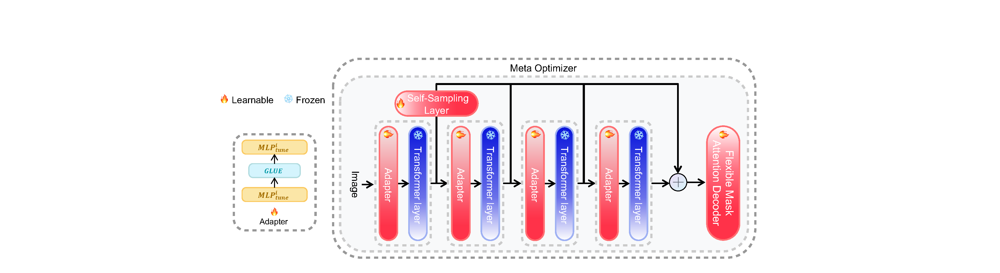

**Abstract**  
While the Segment Anything Model (SAM) excels in semantic segmentation for general-purpose images, its performance significantly deteriorates when applied to medical images, primarily attributable to insufficient representation of medical images in its training dataset. Nonetheless, gathering comprehensive datasets and training models that are universally applicable is particularly challenging due to the long-tail problem common in medical images. To address this gap, here we present a Self-Sampling Meta SAM (SSM-SAM) framework for few-shot medical image segmentation. Our innovation lies in the design of three key modules: 1) An online fast gradient descent optimizer, further optimized by a meta-learner, which ensures swift and robust adaptation to new tasks. 2) A Self-Sampling module designed to provide well-aligned visual prompts for improved attention allocation; and 3) A robust attention-based decoder specifically designed for medical few-shot learning to capture relationship between different slices. Extensive experiments on a popular abdominal CT dataset and an MRI dataset demonstrate that the proposed method achieves significant improvements over state-of-the-art methods in few-shot segmentation, with an average improvements of 10.21% and 1.80% in terms of DSC, respectively. In conclusion, we present a novel approach for rapid online adaptation in interactive image segmentation, adapting to a new organ in just 0.83 minutes. Code is publicly available on GitHub upon acceptance.

**Summary**  
TBD

[⬆ Back to Literature Table](#samfsmis)

---

### <a id="sam-med2d-5905b4d6">SAM-Med2D</a>
> **Venue:** arXiv (Cornell University) 2023  
> **Authors:** J. Cheng et al.  
> **Keywords:** InteractiveMIS, SAM
**Links**  
[Viewable Link](https://www.semanticscholar.org/paper/d7fb24b589f714cb237c05b2f5312c41f88cec68) [Original Link](https://arxiv.org/pdf/2308.16184.pdf) [Code](https://github.com/uni-medical/SAM-Med2D)

  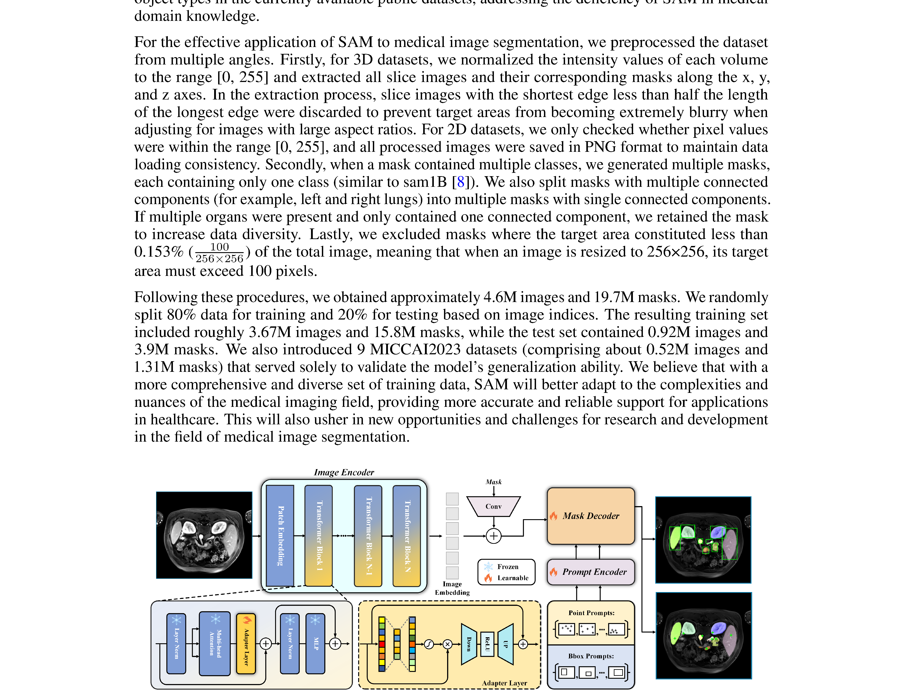

**Abstract**  
The Segment Anything Model (SAM) represents a state-of-the-art research advancement in natural image segmentation, achieving impressive results with input prompts such as points and bounding boxes. However, our evaluation and recent research indicate that directly applying the pretrained SAM to medical image segmentation does not yield satisfactory performance. This limitation primarily arises from significant domain gap between natural images and medical images. To bridge this gap, we introduce SAM-Med2D, the most comprehensive studies on applying SAM to medical 2D images. Specifically, we first collect and curate approximately 4.6M images and 19.7M masks from public and private datasets, constructing a large-scale medical image segmentation dataset encompassing various modalities and objects. Then, we comprehensively fine-tune SAM on this dataset and turn it into SAM-Med2D. Unlike previous methods that only adopt bounding box or point prompts as interactive segmentation approach, we adapt SAM to medical image segmentation through more comprehensive prompts involving bounding boxes, points, and masks. We additionally fine-tune the encoder and decoder of the original SAM to obtain a well-performed SAM-Med2D, leading to the most comprehensive fine-tuning strategies to date. Finally, we conducted a comprehensive evaluation and analysis to investigate the performance of SAM-Med2D in medical image segmentation across various modalities, anatomical structures, and organs. Concurrently, we validated the generalization capability of SAM-Med2D on 9 datasets from MICCAI 2023 challenge. Overall, our approach demonstrated significantly superior performance and generalization capability compared to SAM.

**Summary**  
TBD

[⬆ Back to Literature Table](#samiwmis)

---

### <a id="auto-prompting-sam-for-mobile-friendly-3d-medica-638ea83e">Auto-Prompting SAM for Mobile Friendly 3D Medical Image Segmentation</a>
> **Venue:** 2023  
> **Authors:** C. Li et al.  
> **Keywords:** OtherMIS, SAM
**Links**  
[Viewable Link](https://arxiv.org/pdf/2308.14936.pdf)

  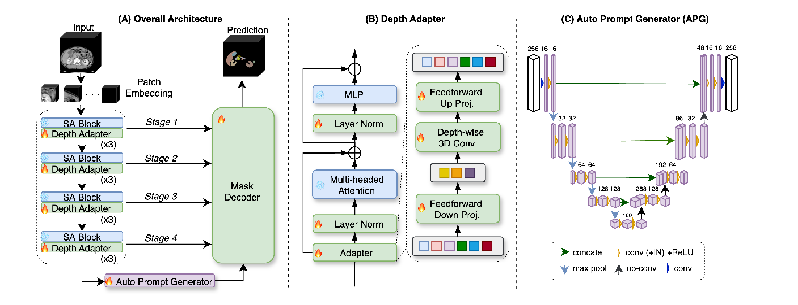

**Abstract**  
TBD

**Summary**  
TBD

[⬆ Back to Literature Table](#samothers)

---

### <a id="cheap-lunch-for-medical-image-segmentation-by-fi-7e2486ba">Cheap Lunch for Medical Image Segmentation by Fine-tuning SAM on Few Exemplars</a>
> **Venue:** Lecture Notes in Computer Science 2024  
> **Authors:** W. Feng et al.  
> **Keywords:** Zero-ShotMIS, SAM
**Links**  
[Viewable Link](https://link.springer.com/10.1007/978-3-031-76160-7_2) [Original Link](https://arxiv.org/pdf/2308.14133.pdf)

  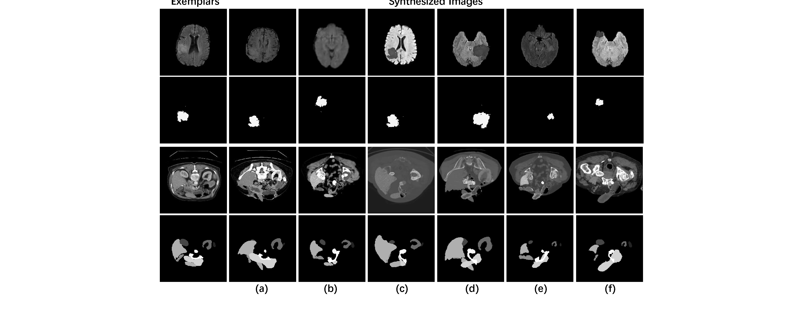

**Abstract**  
The Segment Anything Model (SAM) has demonstrated remarkable capabilities of scaled-up segmentation models, enabling zero-shot generalization across a variety of domains. By leveraging large-scale foundational models as pre-trained models, it is a natural progression to fine-tune SAM for specific domains to further enhance performances. However, the adoption of foundational models in the medical domain presents a challenge due to the difficulty and expense of labeling sufficient data for adaptation within hospital systems. In this paper, we introduce an efficient and practical approach for fine-tuning SAM using a limited number of exemplars, making it suitable for such scenarios. Our approach combines two established techniques from the literature: an exemplar-guided synthesis module and the widely recognized Low-Rank Adaptation (LoRA) fine-tuning strategy, serving as data-level and model-level attempts respectively. Interestingly, our empirical findings suggest that SAM can be effectively aligned within the medical domain even with few labeled data. We validate our approach through experiments on brain tumor segmentation (BraTS) and multi-organ CT segmentation (Synapse). The comprehensive results underscore the feasibility and effectiveness of such an approach, paving the way for the practical application of SAM in the medical domain.

**Summary**  
TBD

[⬆ Back to Literature Table](#samzsmis)

---

### <a id="samdsk-combining-segment-anything-model-with-dom-239cb98b">SamDSK: Combining Segment Anything Model with Domain-Specific Knowledge for Semi-Supervised Learning in Medical Image Segmentation</a>
> **Venue:** Lecture Notes in Computer Science 2025  
> **Authors:** Y. Zhang et al.  
> **Keywords:** SSLMIS, SAM
**Links**  
[Viewable Link](https://link.springer.com/10.1007/978-981-97-8496-7_24) [Original Link](https://arxiv.org/pdf/2308.13759.pdf)

  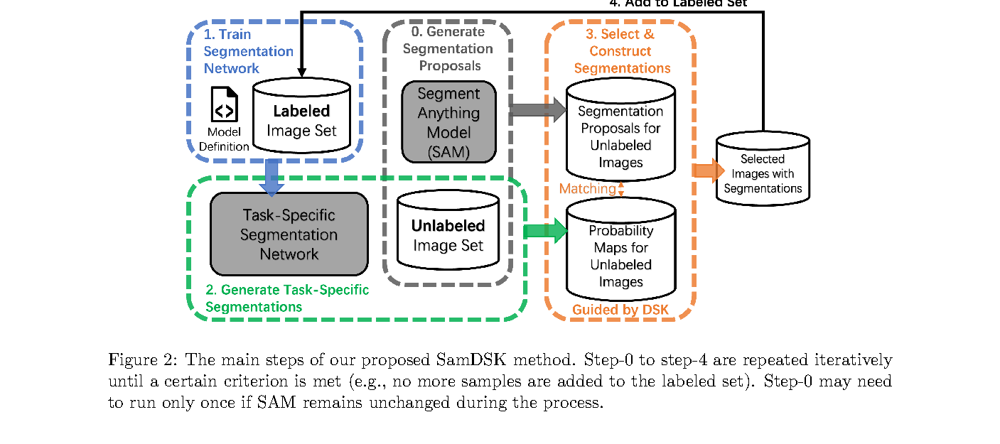

**Abstract**  
The Segment Anything Model (SAM) exhibits a capability to segment a wide array of objects in natural images, serving as a versatile perceptual tool for various downstream image segmentation tasks. In contrast, medical image segmentation tasks often rely on domain-specific knowledge (DSK). In this paper, we propose a novel method that combines the segmentation foundation model (i.e., SAM) with domain-specific knowledge for reliable utilization of unlabeled images in building a medical image segmentation model. Our new method is iterative and consists of two main stages: (1) segmentation model training; (2) expanding the labeled set by using the trained segmentation model, an unlabeled set, SAM, and domain-specific knowledge. These two stages are repeated until no more samples are added to the labeled set. A novel optimal-matching-based method is developed for combining the SAM-generated segmentation proposals and pixel-level and image-level DSK for constructing annotations of unlabeled images in the iterative stage (2). In experiments, we demonstrate the effectiveness of our proposed method for breast cancer segmentation in ultrasound images, polyp segmentation in endoscopic images, and skin lesion segmentation in dermoscopic images. Our work initiates a new direction of semi-supervised learning for medical image segmentation: the segmentation foundation model can be harnessed as a valuable tool for label-efficient segmentation learning in medical image segmentation.

**Summary**  
TBD

[⬆ Back to Literature Table](#samsslmis)

---

### <a id="samsnerf-segment-anything-model-sam-guides-dynam-0c027516">SAMSNeRF: Segment Anything Model (SAM) Guides Dynamic Surgical Scene Reconstruction by Neural Radiance Field (NeRF)</a>
> **Venue:** Medical Imaging 2024: Image-Guided Procedures, Robotic Interventions, and Modeling  
> **Authors:** A. Lou et al.  
> **Keywords:** OtherMIS, SAM
**Links**  
[Viewable Link](https://www.spiedigitallibrary.org/conference-proceedings-of-spie/12928/3008392/SAMSNeRF--segment-anything-model-SAM-guided-dynamic-surgical-scene/10.1117/12.3008392.full) [Original Link](https://arxiv.org/pdf/2308.11774.pdf) [Code](https://github.com/AngeLouCN/SAMSNeRF)

  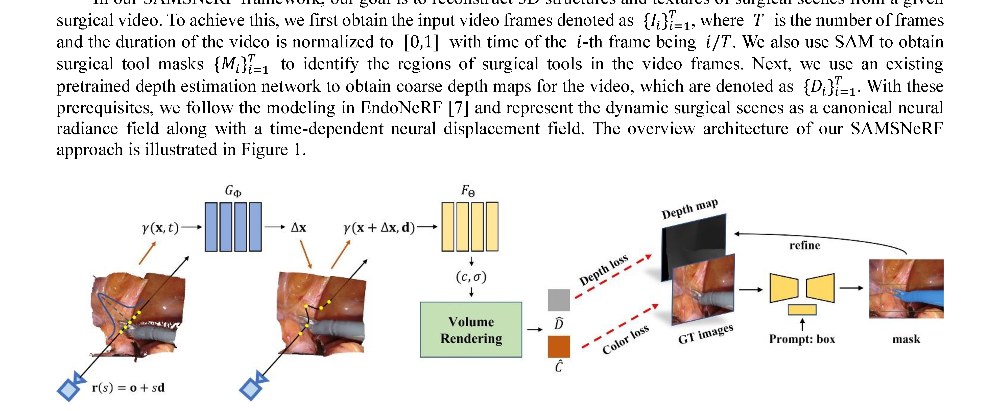

**Abstract**  
The accurate reconstruction of surgical scenes from surgical videos is critical for various applications, including intraoperative navigation and image-guided robotic surgery automation. However, previous approaches, mainly relying on depth estimation, have limited effectiveness in reconstructing surgical scenes with moving surgical tools. To address this limitation and provide accurate 3D position prediction for surgical tools in all frames, we propose a novel approach called SAMSNeRF that combines Segment Anything Model (SAM) and Neural Radiance Field (NeRF) techniques. Our approach generates accurate segmentation masks of surgical tools using SAM, which guides the refinement of the dynamic surgical scene reconstruction by NeRF. Our experimental results on public endoscopy surgical videos demonstrate that our approach successfully reconstructs high-fidelity dynamic surgical scenes and accurately reflects the spatial information of surgical tools. Our proposed approach can significantly enhance surgical navigation and automation by providing surgeons with accurate 3D position information of surgical tools during surgery.The source code will be released soon.

**Summary**  
TBD

[⬆ Back to Literature Table](#samothers)

---

### <a id="segment-anything-for-microscopy-f4a1a431">Segment Anything for Microscopy</a>
> **Venue:** Nature Methods 2025  
> **Authors:** A. Archit et al.  
> **Keywords:** InteractiveMIS, SAM
**Links**  
[Viewable Link](https://www.nature.com/articles/s41592-024-02580-4) [Original Link](https://www.biorxiv.org/content/10.1101/2023.08.21.554208v1.full.pdf) [Code](https://github.com/computational-cell-analytics/micro-sam)

  <!-- Add image to imgs/ and uncomment the img tag below. -->
  <!--  -->

**Abstract**  
Abstract We present Segment Anything for Microscopy, a tool for interactive and automatic segmentation and tracking of objects in multi-dimensional microscopy data. Our method is based on Segment Anything, a vision foundation model for image segmentation. We extend it by training specialized models for microscopy data that significantly improve segmentation quality for a wide range of imaging conditions. We also implement annotation tools for interactive (volumetric) segmentation and tracking, that speed up data annotation significantly compared to established tools. Our work constitutes the first application of vision foundation models to microscopy, laying the groundwork for solving image analysis problems in these domains with a small set of powerful deep learning architectures.

**Summary**  
TBD

[⬆ Back to Literature Table](#samiwmis)

---

### <a id="false-negative-positive-control-for-sam-on-noisy-f13784d0">False Negative/Positive Control for SAM on Noisy Medical Images</a>
> **Venue:** arXiv.org 2023  
> **Authors:** X. Yao et al.  
> **Keywords:** OtherMIS, SAM
**Links**  
[Viewable Link](https://arxiv.org/abs/2308.10382) [Original Link](https://arxiv.org/pdf/2308.10382.pdf) [Code](https://github.com/xyimaging/FNPC)

  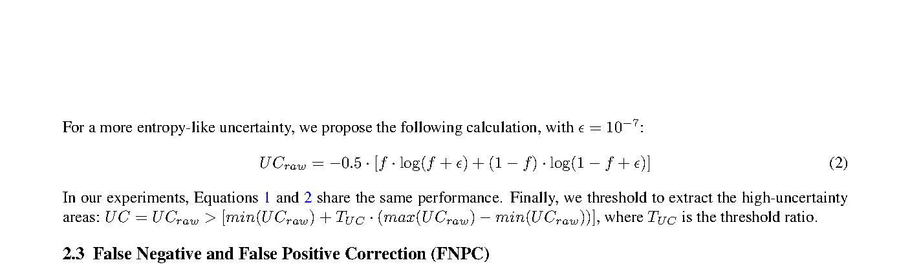

**Abstract**  
The Segment Anything Model (SAM) is a recently developed all-range foundation model for image segmentation. It can use sparse manual prompts such as bounding boxes to generate pixel-level segmentation in natural images but struggles in medical images such as low-contrast, noisy ultrasound images. We propose a refined test-phase prompt augmentation technique designed to improve SAM's performance in medical image segmentation. The method couples multi-box prompt augmentation and an aleatoric uncertainty-based false-negative (FN) and false-positive (FP) correction (FNPC) strategy. We evaluate the method on two ultrasound datasets and show improvement in SAM's performance and robustness to inaccurate prompts, without the necessity for further training or tuning. Moreover, we present the Single-Slice-to-Volume (SS2V) method, enabling 3D pixel-level segmentation using only the bounding box annotation from a single 2D slice. Our results allow efficient use of SAM in even noisy, low-contrast medical images. The source code will be released soon.

**Summary**  
TBD

[⬆ Back to Literature Table](#samothers)

---

### <a id="samedoct-adapting-segment-anything-model-sam-for-71535cab">SAMedOCT: Adapting Segment Anything Model (SAM) for Retinal OCT</a>
> **Venue:** Lecture Notes in Computer Science 2023  
> **Authors:** B. Fazekas et al.  
> **Keywords:** OtherMIS, SAM
**Links**  
[Viewable Link](https://link.springer.com/10.1007/978-3-031-44013-7_10) [Original Link](https://arxiv.org/pdf/2308.09331.pdf)

  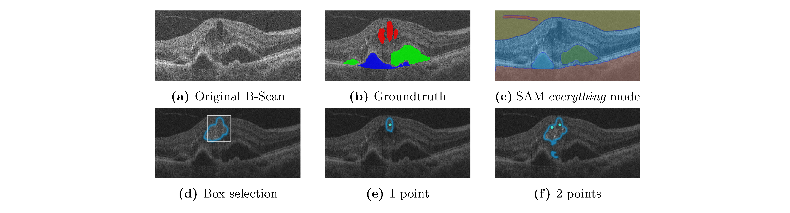

**Abstract**  
The Segment Anything Model (SAM) has gained significant attention in the field of image segmentation due to its impressive capabilities and prompt-based interface. While SAM has already been extensively evaluated in various domains, its adaptation to retinal OCT scans remains unexplored. To bridge this research gap, we conduct a comprehensive evaluation of SAM and its adaptations on a large-scale public dataset of OCTs from RETOUCH challenge. Our evaluation covers diverse retinal diseases, fluid compartments, and device vendors, comparing SAM against state-of-the-art retinal fluid segmentation methods. Through our analysis, we showcase adapted SAM's efficacy as a powerful segmentation model in retinal OCT scans, although still lagging behind established methods in some circumstances. The findings highlight SAM's adaptability and robustness, showcasing its utility as a valuable tool in retinal OCT image analysis and paving the way for further advancements in this domain.

**Summary**  
TBD

[⬆ Back to Literature Table](#samothers)

---

### <a id="surgicalsam-efficient-class-promptable-surgical-ab4451b7">SurgicalSAM: Efficient Class Promptable Surgical Instrument Segmentation</a>
> **Venue:** AAAI Conference on Artificial Intelligence 2024  
> **Authors:** W. Yue et al.  
> **Keywords:** Zero-ShotMIS, SAM
**Links**  
[Viewable Link](https://ojs.aaai.org/index.php/AAAI/article/view/28514) [Original Link](https://arxiv.org/pdf/2308.08746.pdf) [Code](https://github.com/wenxi-yue/SurgicalSAM)

  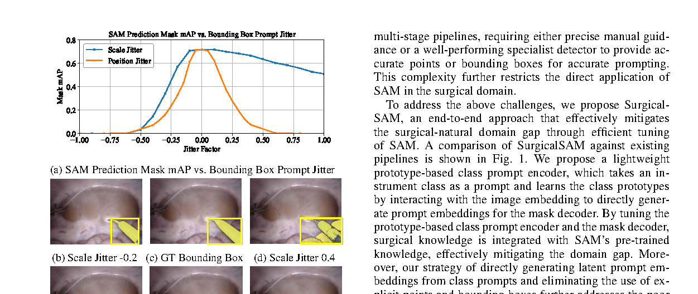

**Abstract**  
The Segment Anything Model (SAM) is a powerful foundation model that has revolutionised image segmentation. To apply SAM to surgical instrument segmentation, a common approach is to locate precise points or boxes of instruments and then use them as prompts for SAM in a zero-shot manner. However, we observe two problems with this naive pipeline: (1) the domain gap between natural objects and surgical instruments leads to inferior generalisation of SAM; and (2) SAM relies on precise point or box locations for accurate segmentation, requiring either extensive manual guidance or a well-performing specialist detector for prompt preparation, which leads to a complex multi-stage pipeline. To address these problems, we introduce SurgicalSAM, a novel end-to-end efficient-tuning approach for SAM to effectively integrate surgical-specific information with SAM's pre-trained knowledge for improved generalisation. Specifically, we propose a lightweight prototype-based class prompt encoder for tuning, which directly generates prompt embeddings from class prototypes and eliminates the use of explicit prompts for improved robustness and a simpler pipeline. In addition, to address the low inter-class variance among surgical instrument categories, we propose contrastive prototype learning, further enhancing the discrimination of the class prototypes for more accurate class prompting. The results of extensive experiments on both EndoVis2018 and EndoVis2017 datasets demonstrate that SurgicalSAM achieves state-of-the-art performance while only requiring a small number of tunable parameters. The source code is available at https://github.com/wenxi-yue/SurgicalSAM.

**Summary**  
TBD

[⬆ Back to Literature Table](#samzsmis)

---

### <a id="care-a-large-scale-ct-image-dataset-and-clinical-19b00751">CARE: A Large Scale CT Image Dataset and Clinical Applicable Benchmark Model for Rectal Cancer Segmentation</a>
> **Venue:** arXiv.org 2023  
> **Authors:** H. Zhang et al.  
> **Keywords:** OtherMIS, SAM
**Links**  
[Viewable Link](https://arxiv.org/abs/2308.08283) [Original Link](https://arxiv.org/pdf/2308.08283.pdf) [Code](https://github.com/kanydao/U-SAM)

  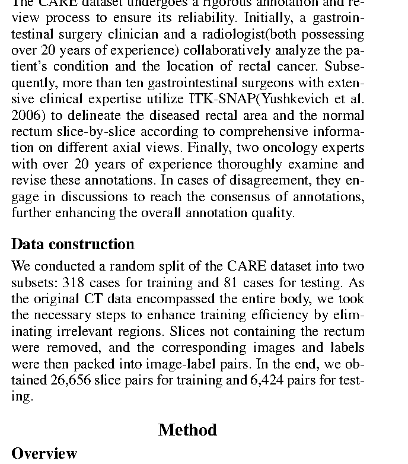

**Abstract**  
Rectal cancer segmentation of CT image plays a crucial role in timely clinical diagnosis, radiotherapy treatment, and follow-up. Although current segmentation methods have shown promise in delineating cancerous tissues, they still encounter challenges in achieving high segmentation precision. These obstacles arise from the intricate anatomical structures of the rectum and the difficulties in performing differential diagnosis of rectal cancer. Additionally, a major obstacle is the lack of a large-scale, finely annotated CT image dataset for rectal cancer segmentation. To address these issues, this work introduces a novel large scale rectal cancer CT image dataset CARE with pixel-level annotations for both normal and cancerous rectum, which serves as a valuable resource for algorithm research and clinical application development. Moreover, we propose a novel medical cancer lesion segmentation benchmark model named U-SAM. The model is specifically designed to tackle the challenges posed by the intricate anatomical structures of abdominal organs by incorporating prompt information. U-SAM contains three key components: promptable information (e.g., points) to aid in target area localization, a convolution module for capturing low-level lesion details, and skip-connections to preserve and recover spatial information during the encoding-decoding process. To evaluate the effectiveness of U-SAM, we systematically compare its performance with several popular segmentation methods on the CARE dataset. The generalization of the model is further verified on the WORD dataset. Extensive experiments demonstrate that the proposed U-SAM outperforms state-of-the-art methods on these two datasets. These experiments can serve as the baseline for future research and clinical application development.

**Summary**  
TBD

[⬆ Back to Literature Table](#samothers)

---

### <a id="self-prompting-large-vision-models-for-few-shot-16e550f9">Self-Prompting Large Vision Models for Few-Shot Medical Image Segmentation</a>
> **Venue:** Lecture Notes in Computer Science 2024  
> **Authors:** Q. Wu et al.  
> **Keywords:** Few-ShotMIS, SAM
**Links**  
[Viewable Link](https://link.springer.com/10.1007/978-3-031-45857-6_16) [Original Link](https://arxiv.org/pdf/2308.07624.pdf) [Code](https://github.com/PeterYYZhang/few-shot-self-prompt-SAM)

  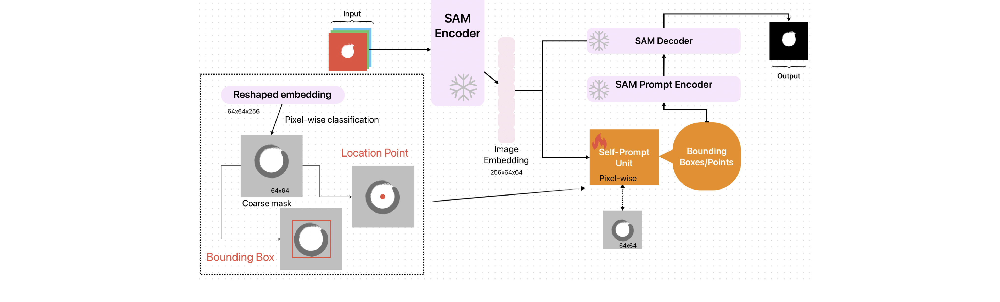

**Abstract**  
Recent advancements in large foundation models have shown promising potential in the medical industry due to their flexible prompting capability. One such model, the Segment Anything Model (SAM), a prompt-driven segmentation model, has shown remarkable performance improvements, surpassing state-of-the-art approaches in medical image segmentation. However, existing methods primarily rely on tuning strategies that require extensive data or prior prompts tailored to the specific task, making it particularly challenging when only a limited number of data samples are available. In this paper, we propose a novel perspective on self-prompting in medical vision applications. Specifically, we harness the embedding space of SAM to prompt itself through a simple yet effective linear pixel-wise classifier. By preserving the encoding capabilities of the large model, the contextual information from its decoder, and leveraging its interactive promptability, we achieve competitive results on multiple datasets (i.e. improvement of more than 15% compared to fine-tuning the mask decoder using a few images).

**Summary**  
TBD

[⬆ Back to Literature Table](#samfsmis)

---

### <a id="sam-meets-robotic-surgery-an-empirical-study-on-7a7cc75e">SAM Meets Robotic Surgery: An Empirical Study on Generalization, Robustness and Adaptation</a>
> **Venue:** Lecture Notes in Computer Science 2023  
> **Authors:** A. Wang et al.  
> **Keywords:** Zero-ShotMIS, SAM
**Links**  
[Viewable Link](https://link.springer.com/10.1007/978-3-031-47401-9_23) [Original Link](https://arxiv.org/pdf/2308.07156.pdf)

  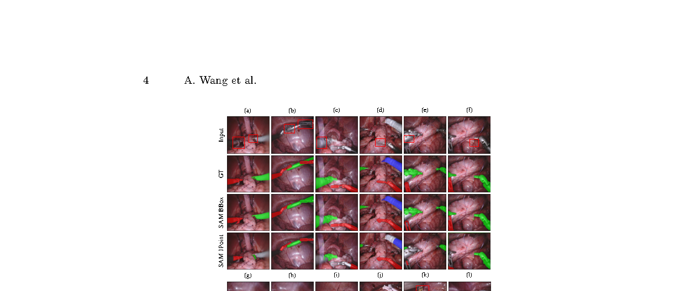

**Abstract**  
The Segment Anything Model (SAM) serves as a fundamental model for semantic segmentation and demonstrates remarkable generalization capabilities across a wide range of downstream scenarios. In this empirical study, we examine SAM's robustness and zero-shot generalizability in the field of robotic surgery. We comprehensively explore different scenarios, including prompted and unprompted situations, bounding box and points-based prompt approaches, as well as the ability to generalize under corruptions and perturbations at five severity levels. Additionally, we compare the performance of SAM with state-of-the-art supervised models. We conduct all the experiments with two well-known robotic instrument segmentation datasets from MICCAI EndoVis 2017 and 2018 challenges. Our extensive evaluation results reveal that although SAM shows remarkable zero-shot generalization ability with bounding box prompts, it struggles to segment the whole instrument with point-based prompts and unprompted settings. Furthermore, our qualitative figures demonstrate that the model either failed to predict certain parts of the instrument mask (e.g., jaws, wrist) or predicted parts of the instrument as wrong classes in the scenario of overlapping instruments within the same bounding box or with the point-based prompt. In fact, SAM struggles to identify instruments in complex surgical scenarios characterized by the presence of blood, reflection, blur, and shade. Additionally, SAM is insufficiently robust to maintain high performance when subjected to various forms of data corruption. We also attempt to fine-tune SAM using Low-rank Adaptation (LoRA) and propose SurgicalSAM, which shows the capability in class-wise mask prediction without prompt. Therefore, we can argue that, without further domain-specific fine-tuning, SAM is not ready for downstream surgical tasks.

**Summary**  
TBD

[⬆ Back to Literature Table](#samzsmis)

---

### <a id="cemb-sam-segment-anything-model-with-condition-e-751e92e5">CEmb-SAM: Segment Anything Model with Condition Embedding for Joint Learning from Heterogeneous Datasets</a>
> **Venue:** Lecture Notes in Computer Science 2023  
> **Authors:** D. Shin et al.  
> **Keywords:** OtherMIS, SAM
**Links**  
[Viewable Link](https://link.springer.com/10.1007/978-3-031-47401-9_27) [Original Link](https://arxiv.org/pdf/2308.06957.pdf)

  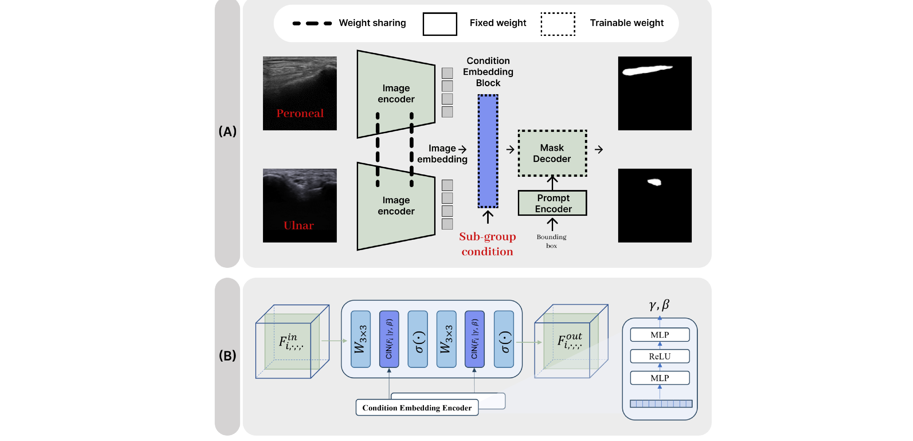

**Abstract**  
Automated segmentation of ultrasound images can assist medical experts with diagnostic and therapeutic procedures. Although using the common modality of ultrasound, one typically needs separate datasets in order to segment, for example, different anatomical structures or lesions with different levels of malignancy. In this paper, we consider the problem of jointly learning from heterogeneous datasets so that the model can improve generalization abilities by leveraging the inherent variability among datasets. We merge the heterogeneous datasets into one dataset and refer to each component dataset as a subgroup. We propose to train a single segmentation model so that the model can adapt to each sub-group. For robust segmentation, we leverage recently proposed Segment Anything model (SAM) in order to incorporate sub-group information into the model. We propose SAM with Condition Embedding block (CEmb-SAM) which encodes sub-group conditions and combines them with image embeddings from SAM. The conditional embedding block effectively adapts SAM to each image sub-group by incorporating dataset properties through learnable parameters for normalization. Experiments show that CEmb-SAM outperforms the baseline methods on ultrasound image segmentation for peripheral nerves and breast cancer. The experiments highlight the effectiveness of Cemb-SAM in learning from heterogeneous datasets in medical image segmentation tasks.

**Summary**  
TBD

[⬆ Back to Literature Table](#samothers)

---

### <a id="polyp-sam-can-a-text-guided-sam-perform-better-f-9dc0febe">Polyp-SAM++: Can A Text Guided SAM Perform Better for Polyp Segmentation?</a>
> **Venue:** arXiv.org 2023  
> **Authors:** R. Biswas  
> **Keywords:** OtherMIS, SAM
**Links**  
[Viewable Link](https://arxiv.org/abs/2308.06623) [Original Link](https://arxiv.org/pdf/2308.06623.pdf) [Code](https://github.com/RisabBiswas/Polyp-SAM++)

  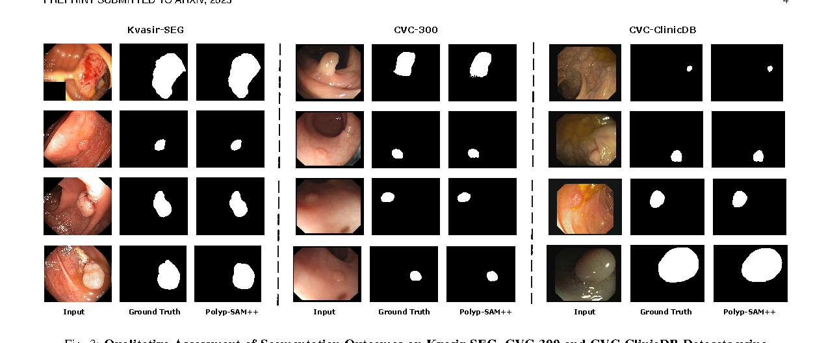

**Abstract**  
Meta recently released SAM (Segment Anything Model) which is a general-purpose segmentation model. SAM has shown promising results in a wide variety of segmentation tasks including medical image segmentation. In the field of medical image segmentation, polyp segmentation holds a position of high importance, thus creating a model which is robust and precise is quite challenging. Polyp segmentation is a fundamental task to ensure better diagnosis and cure of colorectal cancer. As such in this study, we will see how Polyp-SAM++, a text prompt-aided SAM, can better utilize a SAM using text prompting for robust and more precise polyp segmentation. We will evaluate the performance of a text-guided SAM on the polyp segmentation task on benchmark datasets. We will also compare the results of text-guided SAM vs unprompted SAM. With this study, we hope to advance the field of polyp segmentation and inspire more, intriguing research. The code and other details will be made publically available soon at https://github.com/RisabBiswas/Polyp-SAM++.

**Summary**  
TBD

[⬆ Back to Literature Table](#samothers)

---

### <a id="tonguesam-an-universal-tongue-segmentation-model-2fb6c794">TongueSAM: An Universal Tongue Segmentation Model Based on SAM with Zero-Shot</a>
> **Venue:** 2023 IEEE International Conference on Bioinformatics and Biomedicine (BIBM)  
> **Authors:** S. Cao et al.  
> **Keywords:** Zero-ShotMIS, SAM
**Links**  
[Viewable Link](https://ieeexplore.ieee.org/document/10385570/) [Original Link](https://arxiv.org/pdf/2308.06444.pdf) [Code](https://github.com/cshan-github/TongueSAM)

  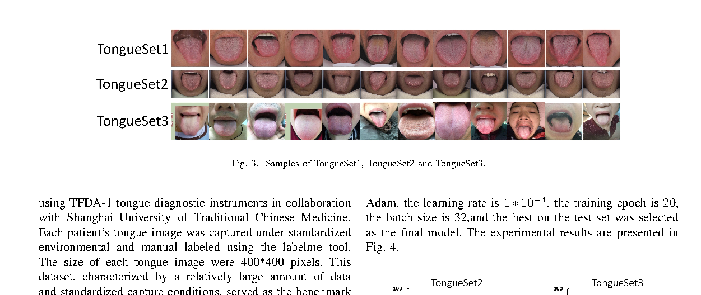

**Abstract**  
Tongue segmentation serves as the primary step in automated TCM tongue diagnosis, which plays a significant role in the diagnostic results. Currently, numerous deep learning based methods have achieved promising results. However, when confronted with tongue images that differ from the training set or possess challenging backgrounds, these methods demonstrate limited performance. To address this issue, this paper proposes a universal tongue segmentation model named TongueSAM based on SAM (Segment Anything Model). SAM is a large-scale pretrained interactive segmentation model known for its powerful zero-shot generalization capability. Applying SAM to tongue segmentation leverages its learned prior knowledge from natural images, enabling the achievement of zero-shot segmentation for various types of tongue images. In this study, a Prompt Generator based on object detection is integrated into SAM to enable an end-to-end automated tongue segmentation method. Experiments demonstrate that TongueSAM achieves exceptional performance across various of tongue segmentation datasets, particularly under zero-shot. Even when dealing with challenging background tongue images, TongueSAM achieves a mIoU of 95.23\% under zero-shot conditions, surpassing other segmentation methods. As far as we know, this is the first application of large-scale pretrained model for tongue segmentation. The project mentioned in this paper is currently publicly available.

**Summary**  
TBD

[⬆ Back to Literature Table](#samzsmis)

---

### <a id="leverage-weakly-annotation-to-pixel-wise-annotat-c8a7ce25">Leverage Weakly Annotation to Pixel-wise Annotation via Zero-shot Segment Anything Model for Molecular-empowered Learning</a>
> **Venue:** Medical Imaging 2024: Digital and Computational Pathology  
> **Authors:** X. Li et al.  
> **Keywords:** Zero-ShotMIS, SAM
**Links**  
[Viewable Link](https://www.spiedigitallibrary.org/conference-proceedings-of-spie/12933/3006577/Leverage-weekly-annotation-to-pixel-wise-annotation-via-zero-shot/10.1117/12.3006577.full) [Original Link](https://arxiv.org/pdf/2308.05785.pdf)

  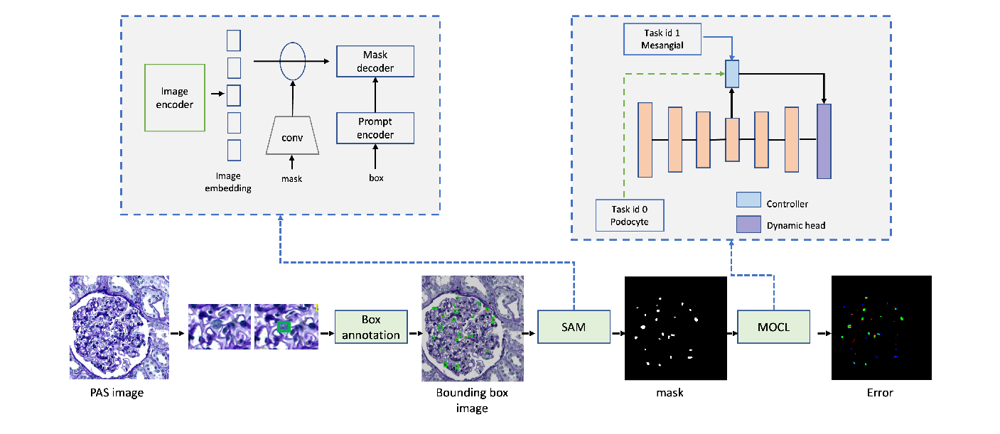

**Abstract**  
Precise identification of multiple cell classes in high-resolution Giga-pixel whole slide imaging (WSI) is critical for various clinical scenarios. Building an AI model for this purpose typically requires pixel-level annotations, which are often unscalable and must be done by skilled domain experts (e.g., pathologists). However, these annotations can be prone to errors, especially when distinguishing between intricate cell types (e.g., podocytes and mesangial cells) using only visual inspection. Interestingly, a recent study showed that lay annotators, when using extra immunofluorescence (IF) images for reference (referred to as molecular-empowered learning), can sometimes outperform domain experts in labeling. Despite this, the resource-intensive task of manual delineation remains a necessity during the annotation process. In this paper, we explore the potential of bypassing pixel-level delineation by employing the recent segment anything model (SAM) on weak box annotation in a zero-shot learning approach. Specifically, we harness SAM's ability to produce pixel-level annotations from box annotations and utilize these SAM-generated labels to train a segmentation model. Our findings show that the proposed SAM-assisted molecular-empowered learning (SAM-L) can diminish the labeling efforts for lay annotators by only requiring weak box annotations. This is achieved without compromising annotation accuracy or the performance of the deep learning-based segmentation. This research represents a significant advancement in democratizing the annotation process for training pathological image segmentation, relying solely on non-expert annotators.

**Summary**  
TBD

[⬆ Back to Literature Table](#samzsmis)

---

### <a id="adaptivesam-towards-efficient-tuning-of-sam-for-c8f66ea9">AdaptiveSAM: Towards Efficient Tuning of SAM for Surgical Scene Segmentation</a>
> **Venue:** Lecture Notes in Computer Science 2024  
> **Authors:** JN. Paranjape et al.  
> **Keywords:** OtherMIS, SAM
**Links**  
[Viewable Link](https://link.springer.com/10.1007/978-3-031-66958-3_14) [Original Link](https://arxiv.org/pdf/2308.03726.pdf) [Code](https://github.com/JayParanjape/biastuning)

  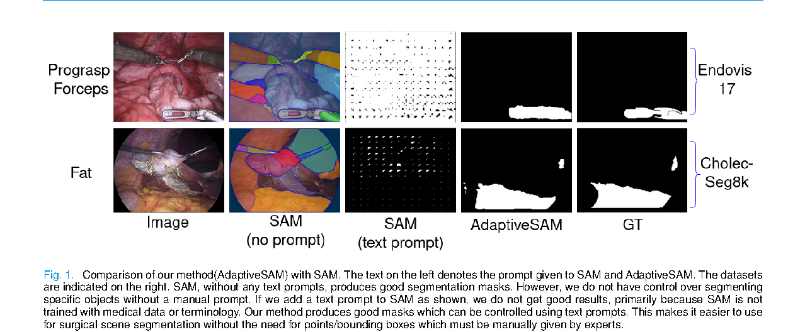

**Abstract**  
Segmentation is a fundamental problem in surgical scene analysis using artificial intelligence. However, the inherent data scarcity in this domain makes it challenging to adapt traditional segmentation techniques for this task. To tackle this issue, current research employs pretrained models and finetunes them on the given data. Even so, these require training deep networks with millions of parameters every time new data becomes available. A recently published foundation model, Segment-Anything (SAM), generalizes well to a large variety of natural images, hence tackling this challenge to a reasonable extent. However, SAM does not generalize well to the medical domain as is without utilizing a large amount of compute resources for fine-tuning and using task-specific prompts. Moreover, these prompts are in the form of bounding-boxes or foreground/background points that need to be annotated explicitly for every image, making this solution increasingly tedious with higher data size. In this work, we propose AdaptiveSAM - an adaptive modification of SAM that can adjust to new datasets quickly and efficiently, while enabling text-prompted segmentation. For finetuning AdaptiveSAM, we propose an approach called bias-tuning that requires a significantly smaller number of trainable parameters than SAM (less than 2\%). At the same time, AdaptiveSAM requires negligible expert intervention since it uses free-form text as prompt and can segment the object of interest with just the label name as prompt. Our experiments show that AdaptiveSAM outperforms current state-of-the-art methods on various medical imaging datasets including surgery, ultrasound and X-ray. Code is available at https://github.com/JayParanjape/biastuning

**Summary**  
TBD

[⬆ Back to Literature Table](#samothers)

---

### <a id="push-the-boundary-of-sam-a-pseudo-label-correcti-62bfb52a">Push the Boundary of SAM: A Pseudo-label Correction Framework for Medical Segmentation</a>
> **Venue:** arXiv.org 2023  
> **Authors:** Z. Huang et al.  
> **Keywords:** Zero-ShotMIS, SAM
**Links**  
[Viewable Link](https://arxiv.org/abs/2308.00883) [Original Link](https://arxiv.org/pdf/2308.00883.pdf)

  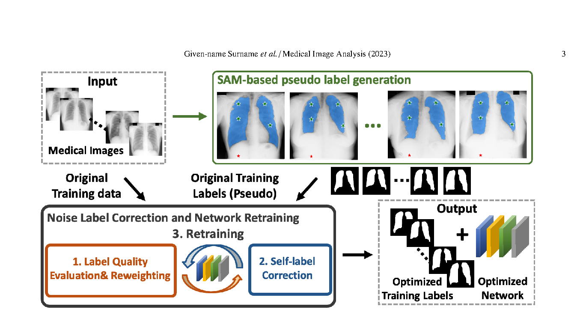

**Abstract**  
Segment anything model (SAM) has emerged as the leading approach for zero-shot learning in segmentation tasks, offering the advantage of avoiding pixel-wise annotations. It is particularly appealing in medical image segmentation, where the annotation process is laborious and expertise-demanding. However, the direct application of SAM often yields inferior results compared to conventional fully supervised segmentation networks. An alternative approach is to use SAM as the initial stage to generate pseudo labels for further network training. However, the performance is limited by the quality of pseudo labels. In this paper, we propose a novel label correction framework to push the boundary of SAM-based segmentation. Our model utilizes a label quality evaluation module to distinguish between noisy labels and clean labels. This enables the correction of the noisy labels using an uncertainty-based self-correction module, thereby enriching the clean training set. Finally, we retrain the segmentation network with updated labels to optimize its weights for future predictions. One key advantage of our model is its ability to train deep networks using SAM-generated pseudo labels without relying on a set of expert-level annotations while attaining good segmentation performance. We demonstrate the effectiveness of our proposed model on three public datasets, indicating its ability to improve segmentation accuracy and outperform baseline methods in label correction.

**Summary**  
TBD

[⬆ Back to Literature Table](#samzsmis)

---

### <a id="sam-path-a-segment-anything-model-for-semantic-s-645458ec">SAM-Path: A Segment Anything Model for Semantic Segmentation in Digital Pathology</a>
> **Venue:** Lecture Notes in Computer Science 2023  
> **Authors:** J. Zhang et al.  
> **Keywords:** OtherMIS, SAM
**Links**  
[Viewable Link](https://link.springer.com/10.1007/978-3-031-47401-9_16) [Original Link](https://arxiv.org/pdf/2307.09570.pdf) [Code](https://github.com/cvlab-stonybrook/SAMPath)

  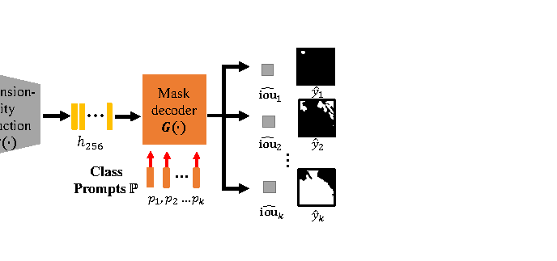

**Abstract**  
Semantic segmentations of pathological entities have crucial clinical value in computational pathology workflows. Foundation models, such as the Segment Anything Model (SAM), have been recently proposed for universal use in segmentation tasks. SAM shows remarkable promise in instance segmentation on natural images. However, the applicability of SAM to computational pathology tasks is limited due to the following factors: (1) lack of comprehensive pathology datasets used in SAM training and (2) the design of SAM is not inherently optimized for semantic segmentation tasks. In this work, we adapt SAM for semantic segmentation by introducing trainable class prompts, followed by further enhancements through the incorporation of a pathology encoder, specifically a pathology foundation model. Our framework, SAM-Path enhances SAM's ability to conduct semantic segmentation in digital pathology without human input prompts. Through experiments on two public pathology datasets, the BCSS and the CRAG datasets, we demonstrate that the fine-tuning with trainable class prompts outperforms vanilla SAM with manual prompts and post-processing by 27.52% in Dice score and 71.63% in IOU. On these two datasets, the proposed additional pathology foundation model further achieves a relative improvement of 5.07% to 5.12% in Dice score and 4.50% to 8.48% in IOU.

**Summary**  
TBD

[⬆ Back to Literature Table](#samothers)

---

### <a id="robust-her2-grading-of-breast-cancer-patients-us-3274e6c9">Robust HER2 Grading of Breast Cancer Patients using Zero-shot Segment Anything Model (SAM)</a>
> **Venue:** 2023  
> **Authors:** MS. Hossain et al.  
> **Keywords:** Zero-ShotMIS, SAM
**Links**  
[Viewable Link](https://www.preprints.org/manuscript/202307.1213/v1)

  <!-- Add image to imgs/ and uncomment the img tag below. -->
  <!--  -->

**Abstract**  
TBD

**Summary**  
TBD

[⬆ Back to Literature Table](#samzsmis)

---

### <a id="sam-med-a-medical-image-annotation-framework-bas-634aac2e">SAM^Med^ : A medical image annotation framework based on large vision model</a>
> **Venue:** 2023  
> **Authors:** C. Wang et al.  
> **Keywords:** OtherMIS, SAM
**Links**  
[Viewable Link](https://arxiv.org/pdf/2307.05617.pdf)

  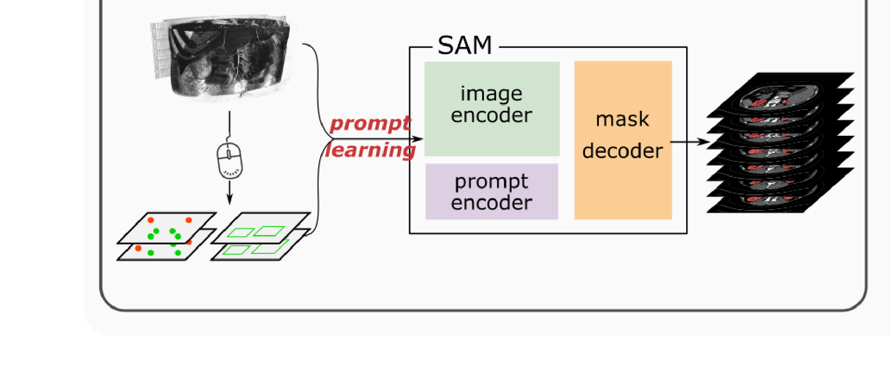

**Abstract**  
TBD

**Summary**  
TBD

[⬆ Back to Literature Table](#samothers)

---

### <a id="sam-u-multi-box-prompts-triggered-uncertainty-es-676f2024">SAM-U: Multi-box prompts triggered uncertainty estimation for reliable SAM in medical image</a>
> **Venue:** Lecture Notes in Computer Science 2023  
> **Authors:** G. Deng et al.  
> **Keywords:** OtherMIS, SAM
**Links**  
[Viewable Link](https://link.springer.com/10.1007/978-3-031-47425-5_33) [Original Link](https://arxiv.org/pdf/2307.04973.pdf)

  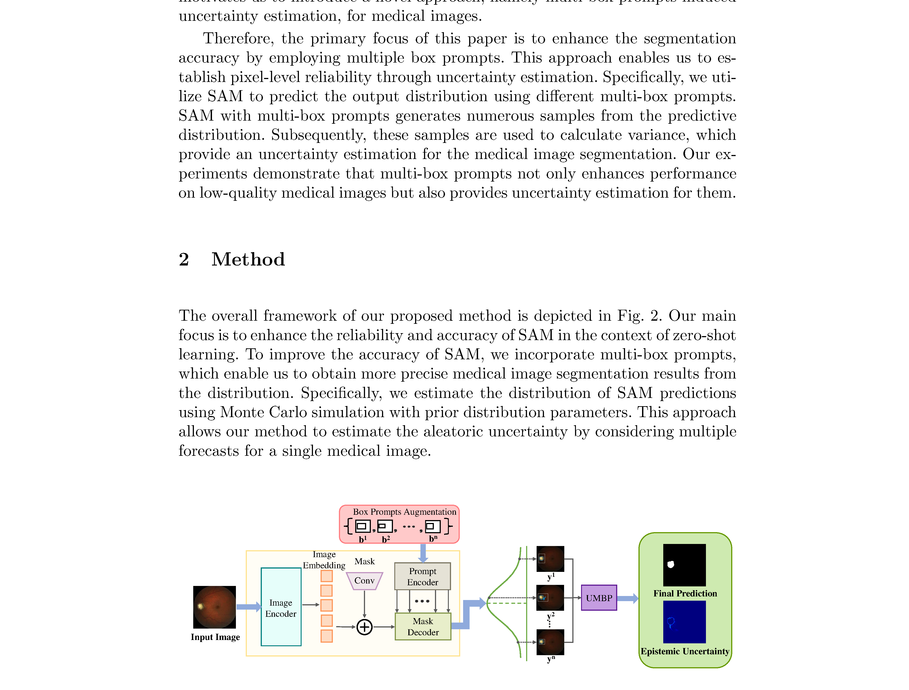

**Abstract**  
Recently, Segmenting Anything has taken an important step towards general artificial intelligence. At the same time, its reliability and fairness have also attracted great attention, especially in the field of health care. In this study, we propose multi-box prompts triggered uncertainty estimation for SAM cues to demonstrate the reliability of segmented lesions or tissues. We estimate the distribution of SAM predictions via Monte Carlo with prior distribution parameters, which employs different prompts as formulation of test-time augmentation. Our experimental results found that multi-box prompts augmentation improve the SAM performance, and endowed each pixel with uncertainty. This provides the first paradigm for a reliable SAM.

**Summary**  
TBD

[⬆ Back to Literature Table](#samothers)

---

### <a id="empirical-analysis-of-a-segmentation-foundation-77ccd932">Empirical Analysis of a Segmentation Foundation Model in Prostate Imaging</a>
> **Venue:** Lecture Notes in Computer Science 2023  
> **Authors:** H. Kim et al.  
> **Keywords:** OtherMIS, SAM
**Links**  
[Viewable Link](https://link.springer.com/10.1007/978-3-031-47401-9_14) [Original Link](https://arxiv.org/pdf/2307.03266.pdf)

  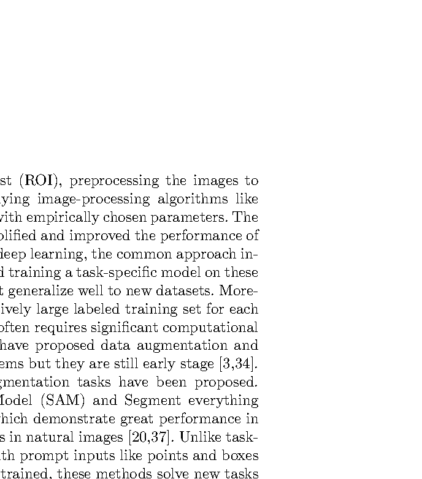

**Abstract**  
Most state-of-the-art techniques for medical image segmentation rely on deep-learning models. These models, however, are often trained on narrowly-defined tasks in a supervised fashion, which requires expensive labeled datasets. Recent advances in several machine learning domains, such as natural language generation have demonstrated the feasibility and utility of building foundation models that can be customized for various downstream tasks with little to no labeled data. This likely represents a paradigm shift for medical imaging, where we expect that foundation models may shape the future of the field. In this paper, we consider a recently developed foundation model for medical image segmentation, UniverSeg. We conduct an empirical evaluation study in the context of prostate imaging and compare it against the conventional approach of training a task-specific segmentation model. Our results and discussion highlight several important factors that will likely be important in the development and adoption of foundation models for medical image segmentation.

**Summary**  
TBD

[⬆ Back to Literature Table](#samothers)

---

### <a id="cross-modality-attention-adapter-a-glioma-segmen-e1b7ed27">Cross-modality Attention Adapter: A Glioma Segmentation Fine-tuning Method for SAM Using Multimodal Brain MR Images</a>
> **Venue:** arXiv.org 2023  
> **Authors:** X. Shi et al.  
> **Keywords:** OtherMIS, SAM
**Links**  
[Viewable Link](https://arxiv.org/abs/2307.01124) [Original Link](https://arxiv.org/pdf/2307.01124.pdf)

  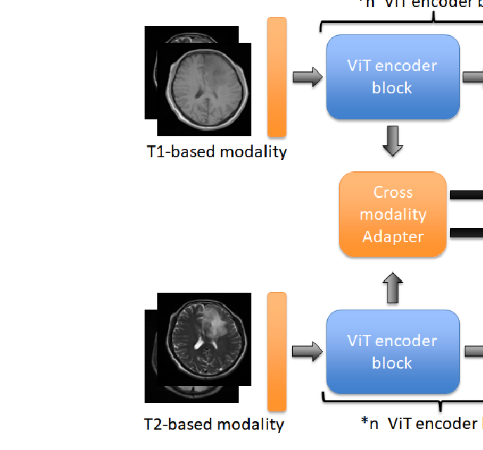

**Abstract**  
According to the 2021 World Health Organization (WHO) Classification scheme for gliomas, glioma segmentation is a very important basis for diagnosis and genotype prediction. In general, 3D multimodal brain MRI is an effective diagnostic tool. In the past decade, there has been an increase in the use of machine learning, particularly deep learning, for medical images processing. Thanks to the development of foundation models, models pre-trained with large-scale datasets have achieved better results on a variety of tasks. However, for medical images with small dataset sizes, deep learning methods struggle to achieve better results on real-world image datasets. In this paper, we propose a cross-modality attention adapter based on multimodal fusion to fine-tune the foundation model to accomplish the task of glioma segmentation in multimodal MRI brain images with better results. The effectiveness of the proposed method is validated via our private glioma data set from the First Affiliated Hospital of Zhengzhou University (FHZU) in Zhengzhou, China. Our proposed method is superior to current state-of-the-art methods with a Dice of 88.38% and Hausdorff distance of 10.64, thereby exhibiting a 4% increase in Dice to segment the glioma region for glioma treatment.

**Summary**  
TBD

[⬆ Back to Literature Table](#samothers)

---

### <a id="all-in-sam-from-weak-annotation-to-pixel-wise-nu-03843459">All-in-SAM: from Weak Annotation to Pixel-wise Nuclei Segmentation with Prompt-based Finetuning</a>
> **Venue:** Journal of Physics: Conference Series 2024  
> **Authors:** C. Cui et al.  
> **Keywords:** Zero-ShotMIS, SAM
**Links**  
[Viewable Link](https://iopscience.iop.org/article/10.1088/1742-6596/2722/1/012012) [Original Link](https://arxiv.org/pdf/2307.00290.pdf)

  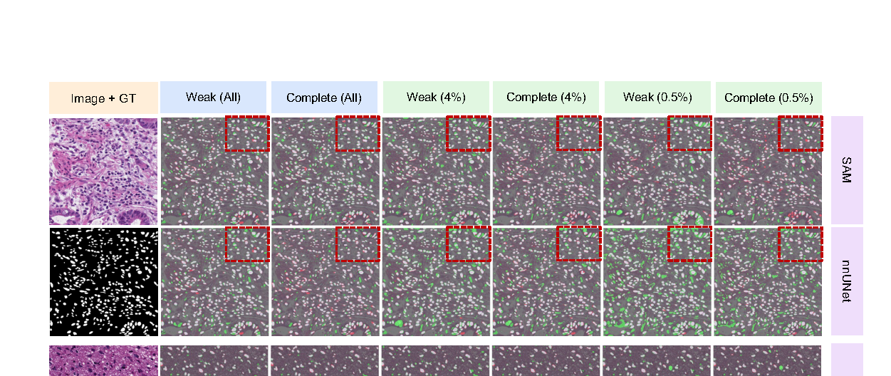

**Abstract**  
The Segment Anything Model (SAM) is a recently proposed prompt-based segmentation model in a generic zero-shot segmentation approach. With the zero-shot segmentation capacity, SAM achieved impressive flexibility and precision on various segmentation tasks. However, the current pipeline requires manual prompts during the inference stage, which is still resource intensive for biomedical image segmentation. In this paper, instead of using prompts during the inference stage, we introduce a pipeline that utilizes the SAM, called all-in-SAM, through the entire AI development workflow (from annotation generation to model finetuning) without requiring manual prompts during the inference stage. Specifically, SAM is first employed to generate pixel-level annotations from weak prompts (e.g., points, bounding box). Then, the pixel-level annotations are used to finetune the SAM segmentation model rather than training from scratch. Our experimental results reveal two key findings: 1) the proposed pipeline surpasses the state-of-the-art (SOTA) methods in a nuclei segmentation task on the public Monuseg dataset, and 2) the utilization of weak and few annotations for SAM finetuning achieves competitive performance compared to using strong pixel-wise annotated data.

**Summary**  
TBD

[⬆ Back to Literature Table](#samzsmis)

---

### <a id="utilizing-segment-anything-model-for-assessing-l-c85b1a12">Utilizing Segment Anything Model For Assessing Localization of GRAD-CAM in Medical Imaging</a>
> **Venue:** arXiv.org 2023  
> **Authors:** E. Kellener et al.  
> **Keywords:** OtherMIS, SAM
**Links**  
[Viewable Link](https://arxiv.org/abs/2306.15692) [Original Link](https://arxiv.org/pdf/2306.15692.pdf)

  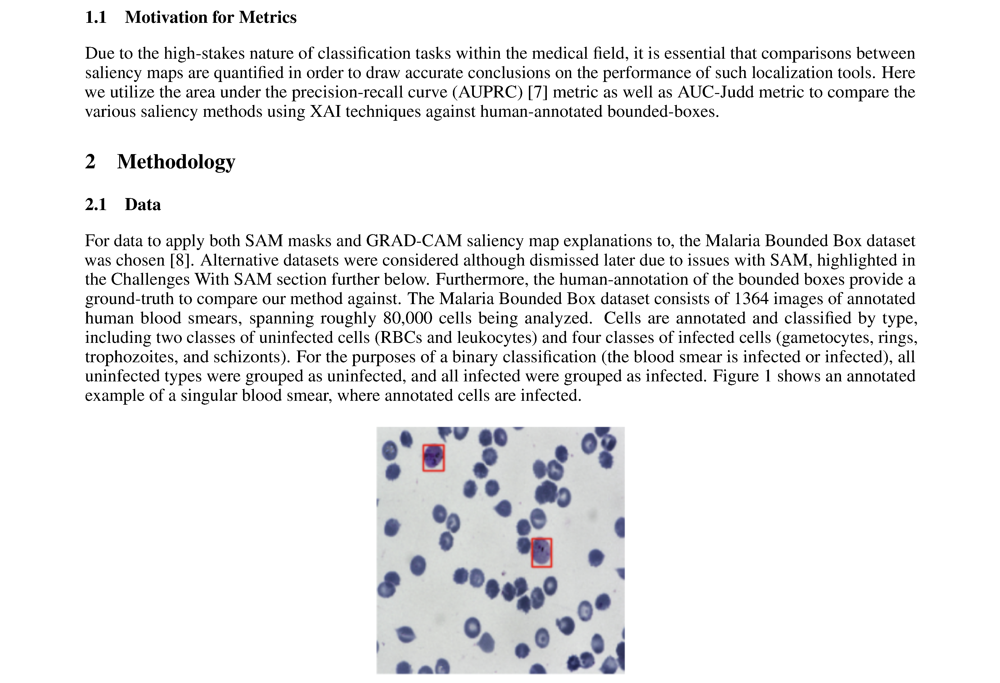

**Abstract**  
The introduction of saliency map algorithms as an approach for assessing the interoperability of images has allowed for a deeper understanding of current black-box models with Artificial Intelligence. Their rise in popularity has led to these algorithms being applied in multiple fields, including medical imaging. With a classification task as important as those in the medical domain, a need for rigorous testing of their capabilities arises. Current works examine capabilities through assessing the localization of saliency maps upon medical abnormalities within an image, through comparisons with human annotations. We propose utilizing Segment Anything Model (SAM) to both further the accuracy of such existing metrics, while also generalizing beyond the need for human annotations. Our results show both high degrees of similarity to existing metrics while also highlighting the capabilities of this methodology to beyond human-annotation. Furthermore, we explore the applications (and challenges) of SAM within the medical domain, including image pre-processing before segmenting, natural language proposals to SAM in the form of CLIP-SAM, and SAM accuracy across multiple medical imaging datasets.

**Summary**  
TBD

[⬆ Back to Literature Table](#samothers)

---

### <a id="cellvit-vision-transformers-for-precise-cell-seg-f3f0911c">CellViT: Vision Transformers for Precise Cell Segmentation and Classification</a>
> **Venue:** Medical Image Analysis 2024  
> **Authors:** F. Hörst et al.  
> **Keywords:** OtherMIS, SAM
**Links**  
[Viewable Link](https://linkinghub.elsevier.com/retrieve/pii/S1361841524000689) [Original Link](https://arxiv.org/pdf/2306.15350.pdf) [Code](https://github.com/TIO-IKIM/CellViT)

  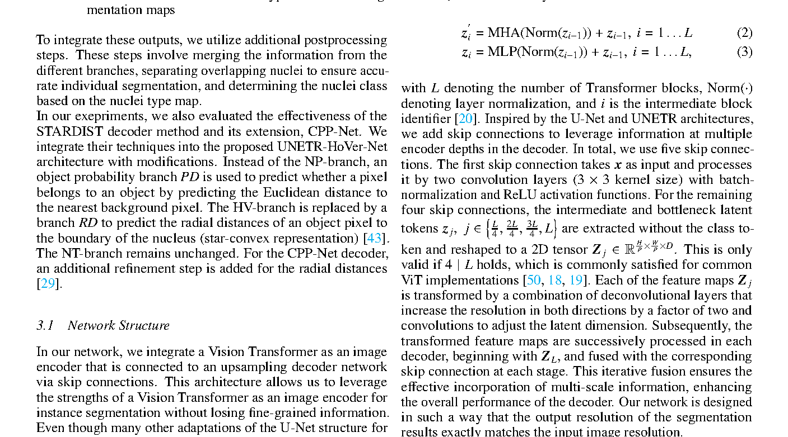

**Abstract**  
Nuclei detection and segmentation in hematoxylin and eosin-stained (H&amp;E) tissue images are important clinical tasks and crucial for a wide range of applications. However, it is a challenging task due to nuclei variances in staining and size, overlapping boundaries, and nuclei clustering. While convolutional neural networks have been extensively used for this task, we explore the potential of Transformer-based networks in this domain. Therefore, we introduce a new method for automated instance segmentation of cell nuclei in digitized tissue samples using a deep learning architecture based on Vision Transformer called CellViT. CellViT is trained and evaluated on the PanNuke dataset, which is one of the most challenging nuclei instance segmentation datasets, consisting of nearly 200,000 annotated Nuclei into 5 clinically important classes in 19 tissue types. We demonstrate the superiority of large-scale in-domain and out-of-domain pre-trained Vision Transformers by leveraging the recently published Segment Anything Model and a ViT-encoder pre-trained on 104 million histological image patches - achieving state-of-the-art nuclei detection and instance segmentation performance on the PanNuke dataset with a mean panoptic quality of 0.50 and an F1-detection score of 0.83. The code is publicly available at https://github.com/TIO-IKIM/CellViT

**Summary**  
TBD

[⬆ Back to Literature Table](#samothers)

---

### <a id="medlsam-localize-and-segment-anything-model-for-e7efd07e">MedLSAM: Localize and Segment Anything Model for 3D Medical Images</a>
> **Venue:** 2023  
> **Authors:** W. Lei et al.  
> **Keywords:** OtherMIS, SAM
**Links**  
[Viewable Link](https://arxiv.org/pdf/2306.14752.pdf) [Code](https://github.com/openmedlab/MedLSAM)

  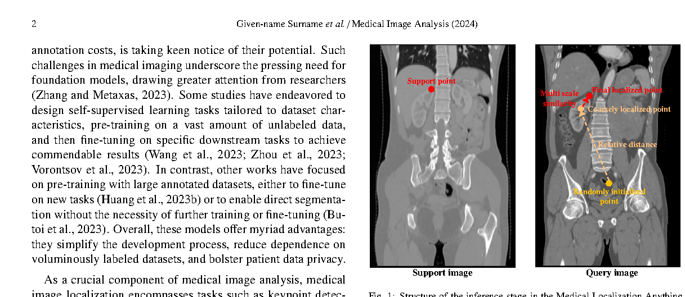

**Abstract**  
TBD

**Summary**  
TBD

[⬆ Back to Literature Table](#samothers)

---

### <a id="how-to-efficiently-adapt-large-segmentation-mode-3db90257">How to Efficiently Adapt Large Segmentation Model(SAM) to Medical Images</a>
> **Venue:** arXiv.org 2023  
> **Authors:** X. Hu et al.  
> **Keywords:** Zero-ShotMIS, SAM
**Links**  
[Viewable Link](https://arxiv.org/abs/2306.13731) [Original Link](https://arxiv.org/pdf/2306.13731.pdf) [Code](https://github.com/xhu248/AutoSAM)

  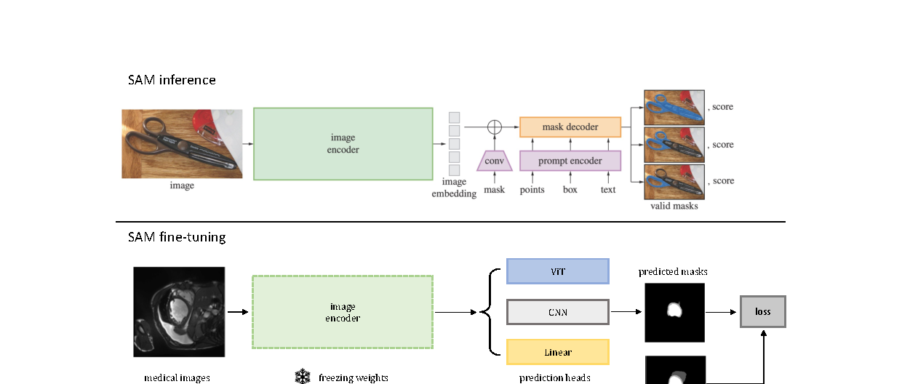

**Abstract**  
The emerging scale segmentation model, Segment Anything (SAM), exhibits impressive capabilities in zero-shot segmentation for natural images. However, when applied to medical images, SAM suffers from noticeable performance drop. To make SAM a real ``foundation model" for the computer vision community, it is critical to find an efficient way to customize SAM for medical image dataset. In this work, we propose to freeze SAM encoder and finetune a lightweight task-specific prediction head, as most of weights in SAM are contributed by the encoder. In addition, SAM is a promptable model, while prompt is not necessarily available in all application cases, and precise prompts for multiple class segmentation are also time-consuming. Therefore, we explore three types of prompt-free prediction heads in this work, include ViT, CNN, and linear layers. For ViT head, we remove the prompt tokens in the mask decoder of SAM, which is named AutoSAM. AutoSAM can also generate masks for different classes with one single inference after modification. To evaluate the label-efficiency of our finetuning method, we compare the results of these three prediction heads on a public medical image segmentation dataset with limited labeled data. Experiments demonstrate that finetuning SAM significantly improves its performance on medical image dataset, even with just one labeled volume. Moreover, AutoSAM and CNN prediction head also has better segmentation accuracy than training from scratch and self-supervised learning approaches when there is a shortage of annotations.

**Summary**  
TBD

[⬆ Back to Literature Table](#samzsmis)

---

### <a id="3dsam-adapter-holistic-adaptation-of-sam-from-2d-f48638a0">3DSAM-adapter: Holistic Adaptation of SAM from 2D to 3D for Promptable Medical Image Segmentation</a>
> **Venue:** 2023  
> **Authors:** S. Gong et al.  
> **Keywords:** OtherMIS, SAM
**Links**  
[Viewable Link](https://arxiv.org/pdf/2306.13465.pdf) [Code](https://github.com/med-air/3DSAM-adapter)

  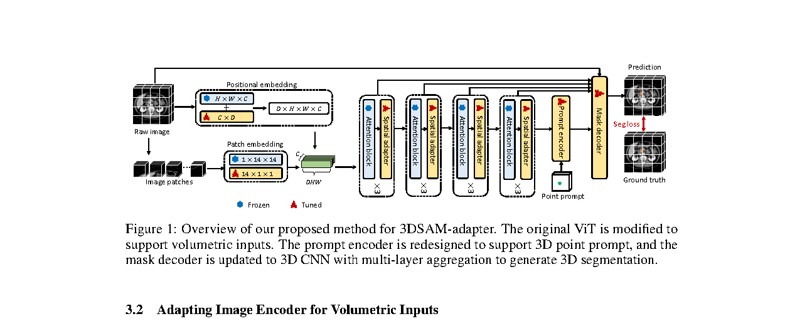

**Abstract**  
TBD

**Summary**  
TBD

[⬆ Back to Literature Table](#samothers)

---

### <a id="lvm-med-learning-large-scale-self-supervised-vis-273e08a6">LVM-Med: Learning Large-Scale Self-Supervised Vision Models for Medical Imaging via Second-order Graph Matching</a>
> **Venue:** Advances in Neural Information Processing Systems 36 2023  
> **Authors:** DMH. Nguyen et al.  
> **Keywords:** OtherMIS, SAM
**Links**  
[Viewable Link](http://www.proceedings.com/075280-1212.html) [Original Link](https://arxiv.org/pdf/2306.11925.pdf) [Code](https://github.com/duyhominhnguyen/LVM-Med)

  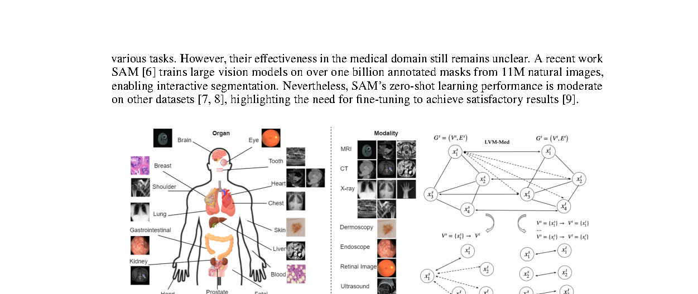

**Abstract**  
Obtaining large pre-trained models that can be fine-tuned to new tasks with limited annotated samples has remained an open challenge for medical imaging data. While pre-trained deep networks on ImageNet and vision-language foundation models trained on web-scale data are prevailing approaches, their effectiveness on medical tasks is limited due to the significant domain shift between natural and medical images. To bridge this gap, we introduce LVM-Med, the first family of deep networks trained on large-scale medical datasets. We have collected approximately 1.3 million medical images from 55 publicly available datasets, covering a large number of organs and modalities such as CT, MRI, X-ray, and Ultrasound. We benchmark several state-of-the-art self-supervised algorithms on this dataset and propose a novel self-supervised contrastive learning algorithm using a graph-matching formulation. The proposed approach makes three contributions: (i) it integrates prior pair-wise image similarity metrics based on local and global information; (ii) it captures the structural constraints of feature embeddings through a loss function constructed via a combinatorial graph-matching objective; and (iii) it can be trained efficiently end-to-end using modern gradient-estimation techniques for black-box solvers. We thoroughly evaluate the proposed LVM-Med on 15 downstream medical tasks ranging from segmentation and classification to object detection, and both for the in and out-of-distribution settings. LVM-Med empirically outperforms a number of state-of-the-art supervised, self-supervised, and foundation models. For challenging tasks such as Brain Tumor Classification or Diabetic Retinopathy Grading, LVM-Med improves previous vision-language models trained on 1 billion masks by 6-7% while using only a ResNet-50.

**Summary**  
TBD

[⬆ Back to Literature Table](#samothers)

---

### <a id="ladder-fine-tuning-approach-for-sam-integrating-33cb440d">Ladder Fine-tuning approach for SAM integrating complementary network</a>
> **Venue:** Procedia Computer Science 2024  
> **Authors:** S. Chai et al.  
> **Keywords:** OtherMIS, SAM
**Links**  
[Viewable Link](https://linkinghub.elsevier.com/retrieve/pii/S1877050924024931) [Original Link](https://arxiv.org/pdf/2306.12737.pdf) [Code](https://github.com/11yxk/SAM-LST)

  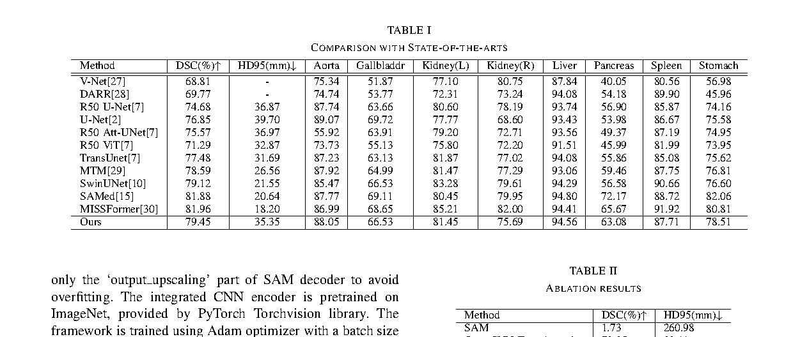

**Abstract**  
Recently, foundation models have been introduced demonstrating various tasks in the field of computer vision. These models such as Segment Anything Model (SAM) are generalized models trained using huge datasets. Currently, ongoing research focuses on exploring the effective utilization of these generalized models for specific domains, such as medical imaging. However, in medical imaging, the lack of training samples due to privacy concerns and other factors presents a major challenge for applying these generalized models to medical image segmentation task. To address this issue, the effective fine tuning of these models is crucial to ensure their optimal utilization. In this study, we propose to combine a complementary Convolutional Neural Network (CNN) along with the standard SAM network for medical image segmentation. To reduce the burden of fine tuning large foundation model and implement cost-efficient trainnig scheme, we focus only on fine-tuning the additional CNN network and SAM decoder part. This strategy significantly reduces trainnig time and achieves competitive results on publicly available dataset. The code is available at https://github.com/11yxk/SAM-LST.

**Summary**  
TBD

[⬆ Back to Literature Table](#samothers)

---

### <a id="segment-anything-model-sam-for-radiation-oncolog-3bc6f5c7">Segment Anything Model (SAM) for Radiation Oncology</a>
> **Venue:** arXiv.org 2023  
> **Authors:** L. Zhang et al.  
> **Keywords:** OtherMIS, SAM
**Links**  
[Viewable Link](https://arxiv.org/abs/2306.11730) [Original Link](https://arxiv.org/pdf/2306.11730.pdf)

  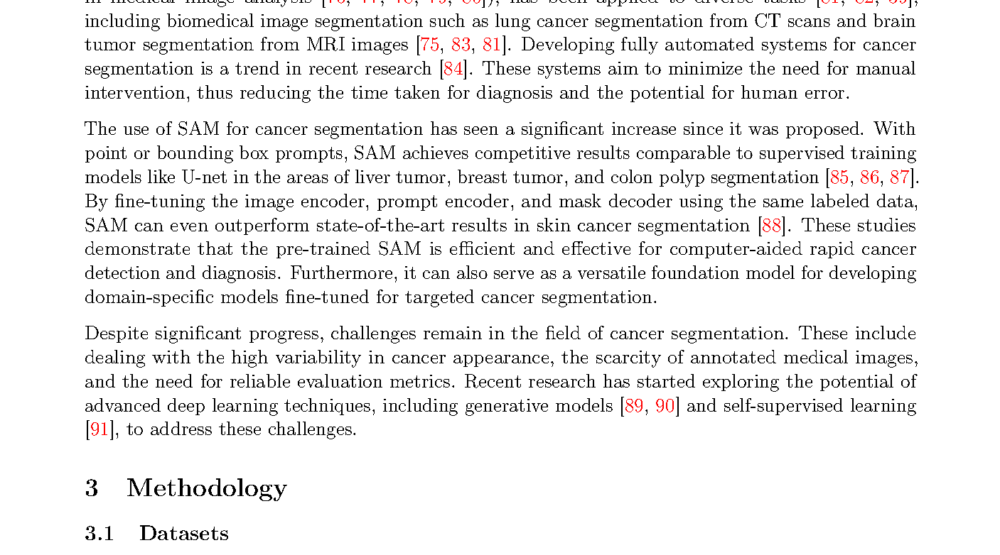

**Abstract**  
In this study, we evaluate the performance of the Segment Anything Model (SAM) in clinical radiotherapy. Our results indicate that SAM's 'segment anything' mode can achieve clinically acceptable segmentation results in most organs-at-risk (OARs) with Dice scores higher than 0.7. SAM's 'box prompt' mode further improves the Dice scores by 0.1 to 0.5. Considering the size of the organ and the clarity of its boundary, SAM displays better performance for large organs with clear boundaries but performs worse for smaller organs with unclear boundaries. Given that SAM, a model pre-trained purely on natural images, can handle the delineation of OARs from medical images with clinically acceptable accuracy, these results highlight SAM's robust generalization capabilities with consistent accuracy in automatic segmentation for radiotherapy. In other words, SAM can achieve delineation of different OARs at different sites using a generic automatic segmentation model. SAM's generalization capabilities across different disease sites suggest that it is technically feasible to develop a generic model for automatic segmentation in radiotherapy.

**Summary**  
TBD

[⬆ Back to Literature Table](#samothers)

---

### <a id="the-potential-of-segment-anything-sam-for-univer-9e0de980">The potential of 'Segment Anything' (SAM) for universal intelligent ultrasound image guidance</a>
> **Venue:** BioScience Trends 2023  
> **Authors:** G. Ning et al.  
> **Keywords:** OtherMIS, SAM
**Links**  
[Viewable Link](https://www.jstage.jst.go.jp/article/bst/17/3/17_2023.01119/_article) [Original Link](https://www.jstage.jst.go.jp/article/bst/advpub/0/advpub_2023.01119/_pdf)

  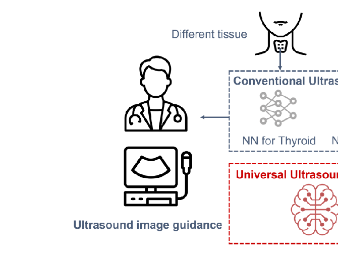

**Abstract**  
Ultrasound image guidance is a method often used to help provide care, and it relies on accurate perception of information, and particularly tissue recognition, to guide medical procedures. It is widely used in various scenarios that are often complex. Recent breakthroughs in large models, such as ChatGPT for natural language processing and Segment Anything Model (SAM) for image segmentation, have revolutionized interaction with information. These large models exhibit a revolutionized understanding of basic information, holding promise for medicine, including the potential for universal autonomous ultrasound image guidance. The current study evaluated the performance of SAM on commonly used ultrasound images and it discusses SAM's potential contribution to an intelligent image-guided framework, with a specific focus on autonomous and universal ultrasound image guidance. Results indicate that SAM performs well in ultrasound image segmentation and has the potential to enable universal intelligent ultrasound image guidance.

**Summary**  
TBD

[⬆ Back to Literature Table](#samothers)

---

### <a id="temporally-extended-prompts-optimization-for-sam-7cc38e10">Temporally-Extended Prompts Optimization for SAM in Interactive Medical Image Segmentation</a>
> **Venue:** 2023 IEEE International Conference on Bioinformatics and Biomedicine (BIBM)  
> **Authors:** C. Shen et al.  
> **Keywords:** Zero-ShotMIS, SAM
**Links**  
[Viewable Link](https://ieeexplore.ieee.org/document/10385291/) [Original Link](https://arxiv.org/pdf/2306.08958.pdf)

  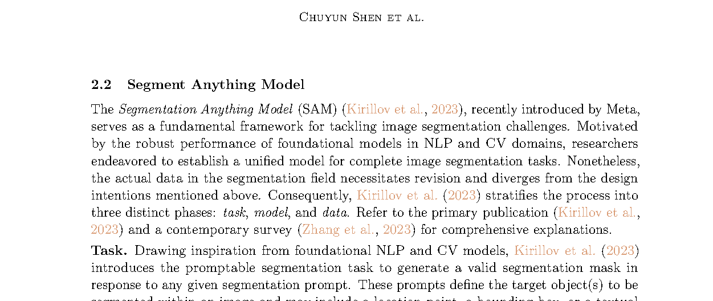

**Abstract**  
The Segmentation Anything Model (SAM) has recently emerged as a foundation model for addressing image segmentation. Owing to the intrinsic complexity of medical images and the high annotation cost, the medical image segmentation (MIS) community has been encouraged to investigate SAM's zero-shot capabilities to facilitate automatic annotation. Inspired by the extraordinary accomplishments of interactive medical image segmentation (IMIS) paradigm, this paper focuses on assessing the potential of SAM's zero-shot capabilities within the IMIS paradigm to amplify its benefits in the MIS domain. Regrettably, we observe that SAM's vulnerability to prompt forms (e.g., points, bounding boxes) becomes notably pronounced in IMIS. This leads us to develop a framework that adaptively offers suitable prompt forms for human experts. We refer to the framework above as temporally-extended prompts optimization (TEPO) and model it as a Markov decision process, solvable through reinforcement learning. Numerical experiments on the standardized benchmark BraTS2020 demonstrate that the learned TEPO agent can further enhance SAM's zero-shot capability in the MIS context.

**Summary**  
TBD

[⬆ Back to Literature Table](#samzsmis)

---

### <a id="autosam-adapting-sam-to-medical-images-by-overlo-a9383cb7">AutoSAM: Adapting SAM to Medical Images by Overloading the Prompt Encoder</a>
> **Venue:** arXiv.org 2023  
> **Authors:** T. Shaharabany et al.  
> **Keywords:** OtherMIS, SAM
**Links**  
[Viewable Link](https://arxiv.org/abs/2306.06370) [Original Link](https://arxiv.org/pdf/2306.06370.pdf)

  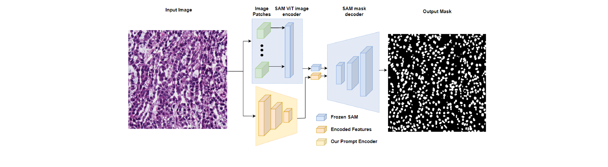

**Abstract**  
The recently introduced Segment Anything Model (SAM) combines a clever architecture and large quantities of training data to obtain remarkable image segmentation capabilities. However, it fails to reproduce such results for Out-Of-Distribution (OOD) domains such as medical images. Moreover, while SAM is conditioned on either a mask or a set of points, it may be desirable to have a fully automatic solution. In this work, we replace SAM's conditioning with an encoder that operates on the same input image. By adding this encoder and without further fine-tuning SAM, we obtain state-of-the-art results on multiple medical images and video benchmarks. This new encoder is trained via gradients provided by a frozen SAM. For inspecting the knowledge within it, and providing a lightweight segmentation solution, we also learn to decode it into a mask by a shallow deconvolution network.

**Summary**  
TBD

[⬆ Back to Literature Table](#samothers)

---

### <a id="desam-decoupling-segment-anything-model-for-gene-f735a442">DeSAM: Decoupling Segment Anything Model for Generalizable Medical Image Segmentation</a>
> **Venue:** 2023  
> **Authors:** Y. Gao et al.  
> **Keywords:** OtherMIS, SAM
**Links**  
[Viewable Link](https://arxiv.org/pdf/2306.00499.pdf) [Code](https://github.com/yifangao112/DeSAM)

  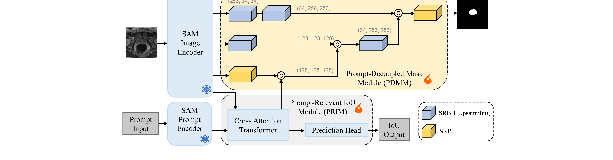

**Abstract**  
TBD

**Summary**  
TBD

[⬆ Back to Literature Table](#samothers)

---

### <a id="iamsam-image-based-analysis-of-molecular-signatu-bfad9d42">IAMSAM: image-based analysis of molecular signatures using the Segment Anything Model</a>
> **Venue:** Genome Biology 2024  
> **Authors:** D. Lee et al.  
> **Keywords:** OtherMIS, SAM
**Links**  
[Viewable Link](https://genomebiology.biomedcentral.com/articles/10.1186/s13059-024-03380-x) [Original Link](https://www.biorxiv.org/content/biorxiv/early/2023/05/25/2023.05.25.542052.full.pdf) [Code](https://github.com/portrai-io/IAMSAM)

  <!-- Add image to imgs/ and uncomment the img tag below. -->
  <!--  -->

**Abstract**  
Spatial transcriptomics is a cutting-edge technique that combines gene expression with spatial information, allowing researchers to study molecular patterns within tissue architecture. Here, we present IAMSAM, a user-friendly web-based tool for analyzing spatial transcriptomics data focusing on morphological features. IAMSAM accurately segments tissue images using the Segment Anything Model, allowing for the semi-automatic selection of regions of interest based on morphological signatures. Furthermore, IAMSAM provides downstream analysis, such as identifying differentially expressed genes, enrichment analysis, and cell type prediction within the selected regions. With its simple interface, IAMSAM empowers researchers to explore and interpret heterogeneous tissues in a streamlined manner.

**Summary**  
TBD

[⬆ Back to Literature Table](#samothers)

---

### <a id="breastsam-a-study-of-segment-anything-model-for-112e7382">BreastSAM: A Study of Segment Anything Model for Breast Tumor Detection in Ultrasound Images</a>
> **Venue:** arXiv.org 2023  
> **Authors:** M. Hu et al.  
> **Keywords:** InteractiveMIS, SAM
**Links**  
[Viewable Link](https://arxiv.org/abs/2305.12447) [Original Link](https://arxiv.org/pdf/2305.12447.pdf)

  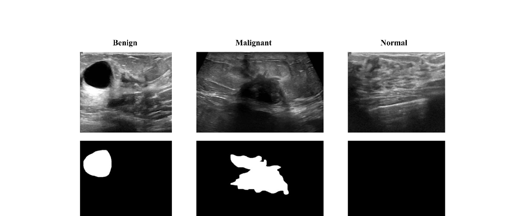

**Abstract**  
Breast cancer is one of the most common cancers among women worldwide, with early detection significantly increasing survival rates. Ultrasound imaging is a critical diagnostic tool that aids in early detection by providing real-time imaging of the breast tissue. We conducted a thorough investigation of the Segment Anything Model (SAM) for the task of interactive segmentation of breast tumors in ultrasound images. We explored three pre-trained model variants: ViT_h, ViT_l, and ViT_b, among which ViT_l demonstrated superior performance in terms of mean pixel accuracy, Dice score, and IoU score. The significance of prompt interaction in improving the model's segmentation performance was also highlighted, with substantial improvements in performance metrics when prompts were incorporated. The study further evaluated the model's differential performance in segmenting malignant and benign breast tumors, with the model showing exceptional proficiency in both categories, albeit with slightly better performance for benign tumors. Furthermore, we analyzed the impacts of various breast tumor characteristics - size, contrast, aspect ratio, and complexity - on segmentation performance. Our findings reveal that tumor contrast and size positively impact the segmentation result, while complex boundaries pose challenges. The study provides valuable insights for using SAM as a robust and effective algorithm for breast tumor segmentation in ultrasound images.

**Summary**  
TBD

[⬆ Back to Literature Table](#samiwmis)

---

### <a id="promptunet-toward-interactive-medical-image-segm-d4915601">PromptUNet: Toward Interactive Medical Image Segmentation</a>
> **Venue:** 2023  
> **Authors:** J. Wu  
> **Keywords:** InteractiveMIS, SAM
**Links**  
[Viewable Link](https://arxiv.org/pdf/2305.10300.pdf) [Code](https://github.com/WuJunde/PromptUNet)

  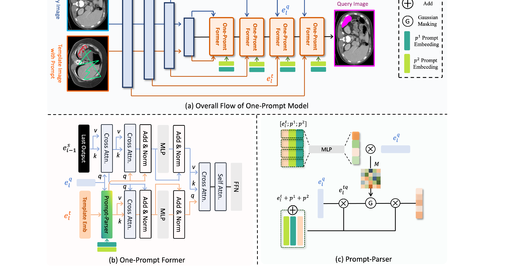

**Abstract**  
TBD

**Summary**  
TBD

[⬆ Back to Literature Table](#samiwmis)

---

### <a id="polyp-sam-transfer-sam-for-polyp-segmentation-e80de684">Polyp-SAM: Transfer SAM for Polyp Segmentation</a>
> **Venue:** Medical Imaging 2024: Computer-Aided Diagnosis  
> **Authors:** Y. Li et al.  
> **Keywords:** OtherMIS, SAM
**Links**  
[Viewable Link](https://www.spiedigitallibrary.org/conference-proceedings-of-spie/12927/3006809/Polyp-SAM-transfer-SAM-for-polyp-segmentation/10.1117/12.3006809.full) [Original Link](https://arxiv.org/pdf/2305.00293.pdf) [Code](https://github.com/ricklisz/Polyp-SAM)

  

**Abstract**  
Colon polyps are considered important precursors for colorectal cancer. Automatic segmentation of colon polyps can significantly reduce the misdiagnosis of colon cancer and improve physician annotation efficiency. While many methods have been proposed for polyp segmentation, training large-scale segmentation networks with limited colonoscopy data remains a challenge. Recently, the Segment Anything Model (SAM) has recently gained much attention in both natural and medical image segmentation. SAM demonstrates superior performance in several image benchmarks and therefore shows great potential for medical image segmentation. In this study, we propose Poly-SAM, a finetuned SAM model for polyp segmentation, and compare its performance to several state-of-the-art polyp segmentation models. We also compare two transfer learning strategies of SAM with and without finetuning its encoders. Evaluated on five public datasets, our Polyp-SAM achieves state-of-the-art performance on two datasets and impressive performance on three datasets, with dice scores all above 88%. This study demonstrates the great potential of adapting SAM to medical image segmentation tasks. We plan to release the code and model weights for this paper at: https://github.com/ricklisz/Polyp-SAM.

**Summary**  
TBD

[⬆ Back to Literature Table](#samothers)

---

### <a id="exploring-the-zero-shot-capabilities-of-the-segm-bd69bddc">Exploring the Zero-Shot Capabilities of the Segment Anything Model (SAM) in 2D Medical Imaging: A Comprehensive Evaluation and Practical Guideline</a>
> **Venue:** 2023  
> **Authors:** C. Mattjie et al.  
> **Keywords:** Zero-ShotMIS, SAM
**Links**  
[Viewable Link](https://arxiv.org/pdf/2305.00109.pdf)

  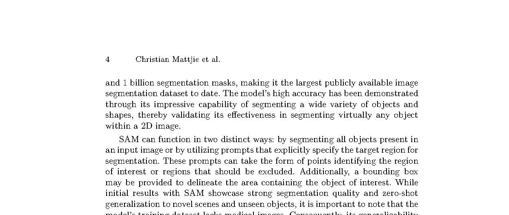

**Abstract**  
TBD

**Summary**  
TBD

[⬆ Back to Literature Table](#samzsmis)

---

### <a id="sam-on-medical-images-a-comprehensive-study-on-t-85b37784">SAM on Medical Images: A Comprehensive Study on Three Prompt Modes</a>
> **Venue:** arXiv.org 2023  
> **Authors:** D. Cheng et al.  
> **Keywords:** Zero-ShotMIS, SAM
**Links**  
[Viewable Link](https://arxiv.org/abs/2305.00035) [Original Link](https://arxiv.org/pdf/2305.00035.pdf)

  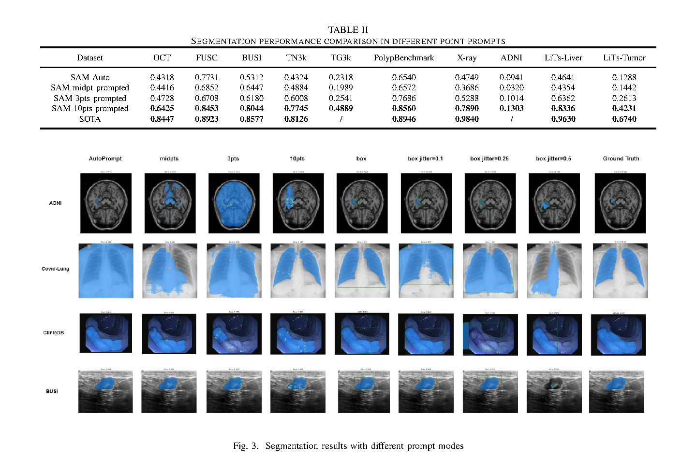

**Abstract**  
The Segment Anything Model (SAM) made an eye-catching debut recently and inspired many researchers to explore its potential and limitation in terms of zero-shot generalization capability. As the first promptable foundation model for segmentation tasks, it was trained on a large dataset with an unprecedented number of images and annotations. This large-scale dataset and its promptable nature endow the model with strong zero-shot generalization. Although the SAM has shown competitive performance on several datasets, we still want to investigate its zero-shot generalization on medical images. As we know, the acquisition of medical image annotation usually requires a lot of effort from professional practitioners. Therefore, if there exists a foundation model that can give high-quality mask prediction simply based on a few point prompts, this model will undoubtedly become the game changer for medical image analysis. To evaluate whether SAM has the potential to become the foundation model for medical image segmentation tasks, we collected more than 12 public medical image datasets that cover various organs and modalities. We also explore what kind of prompt can lead to the best zero-shot performance with different modalities. Furthermore, we find that a pattern shows that the perturbation of the box size will significantly change the prediction accuracy. Finally, Extensive experiments show that the predicted mask quality varied a lot among different datasets. And providing proper prompts, such as bounding boxes, to the SAM will significantly increase its performance.

**Summary**  
TBD

[⬆ Back to Literature Table](#samzsmis)

---

### <a id="sam-meets-robotic-surgery-an-empirical-study-in-99a4667c">SAM Meets Robotic Surgery: An Empirical Study in Robustness Perspective</a>
> **Venue:** arXiv.org 2023  
> **Authors:** A. Wang et al.  
> **Keywords:** Zero-ShotMIS, SAM
**Links**  
[Viewable Link](https://arxiv.org/abs/2304.14674) [Original Link](https://arxiv.org/pdf/2304.14674.pdf)

  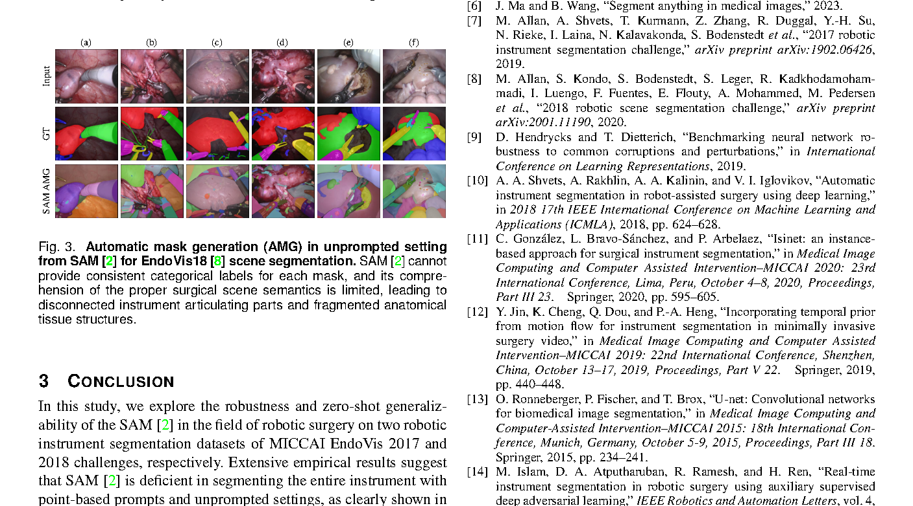

**Abstract**  
Segment Anything Model (SAM) is a foundation model for semantic segmentation and shows excellent generalization capability with the prompts. In this empirical study, we investigate the robustness and zero-shot generalizability of the SAM in the domain of robotic surgery in various settings of (i) prompted vs. unprompted; (ii) bounding box vs. points-based prompt; (iii) generalization under corruptions and perturbations with five severity levels; and (iv) state-of-the-art supervised model vs. SAM. We conduct all the observations with two well-known robotic instrument segmentation datasets of MICCAI EndoVis 2017 and 2018 challenges. Our extensive evaluation results reveal that although SAM shows remarkable zero-shot generalization ability with bounding box prompts, it struggles to segment the whole instrument with point-based prompts and unprompted settings. Furthermore, our qualitative figures demonstrate that the model either failed to predict the parts of the instrument mask (e.g., jaws, wrist) or predicted parts of the instrument as different classes in the scenario of overlapping instruments within the same bounding box or with the point-based prompt. In fact, it is unable to identify instruments in some complex surgical scenarios of blood, reflection, blur, and shade. Additionally, SAM is insufficiently robust to maintain high performance when subjected to various forms of data corruption. Therefore, we can argue that SAM is not ready for downstream surgical tasks without further domain-specific fine-tuning.

**Summary**  
TBD

[⬆ Back to Literature Table](#samzsmis)

---

### <a id="segment-anything-model-for-medical-images-e7b667c2">Segment anything model for medical images?</a>
> **Venue:** Medical Image Analysis 2024  
> **Authors:** Y. Huang et al.  
> **Keywords:** InteractiveMIS, SAM
**Links**  
[Viewable Link](https://linkinghub.elsevier.com/retrieve/pii/S1361841523003213) [Original Link](https://arxiv.org/pdf/2304.14660.pdf)

  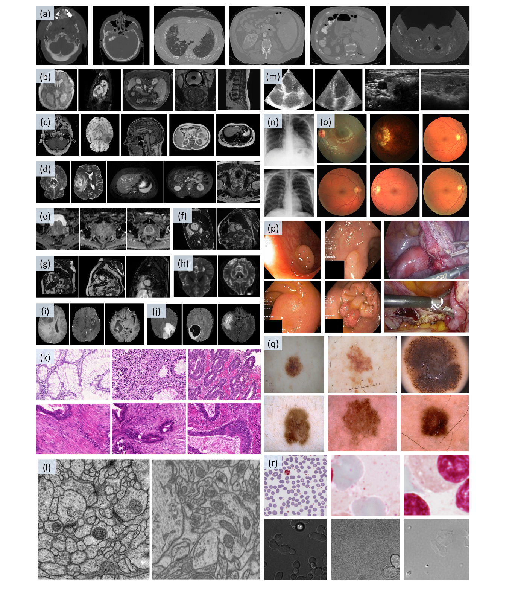

**Abstract**  
The Segment Anything Model (SAM) is the first foundation model for general image segmentation. It has achieved impressive results on various natural image segmentation tasks. However, medical image segmentation (MIS) is more challenging because of the complex modalities, fine anatomical structures, uncertain and complex object boundaries, and wide-range object scales. To fully validate SAM's performance on medical data, we collected and sorted 53 open-source datasets and built a large medical segmentation dataset with 18 modalities, 84 objects, 125 object-modality paired targets, 1050K 2D images, and 6033K masks. We comprehensively analyzed different models and strategies on the so-called COSMOS 1050K dataset. Our findings mainly include the following: 1) SAM showed remarkable performance in some specific objects but was unstable, imperfect, or even totally failed in other situations. 2) SAM with the large ViT-H showed better overall performance than that with the small ViT-B. 3) SAM performed better with manual hints, especially box, than the Everything mode. 4) SAM could help human annotation with high labeling quality and less time. 5) SAM was sensitive to the randomness in the center point and tight box prompts, and may suffer from a serious performance drop. 6) SAM performed better than interactive methods with one or a few points, but will be outpaced as the number of points increases. 7) SAM's performance correlated to different factors, including boundary complexity, intensity differences, etc. 8) Finetuning the SAM on specific medical tasks could improve its average DICE performance by 4.39% and 6.68% for ViT-B and ViT-H, respectively. We hope that this comprehensive report can help researchers explore the potential of SAM applications in MIS, and guide how to appropriately use and develop SAM.

**Summary**  
TBD

[⬆ Back to Literature Table](#samiwmis)

---

### <a id="skinsam-empowering-skin-cancer-segmentation-with-af706586">SkinSAM: Empowering Skin Cancer Segmentation with Segment Anything Model</a>
> **Venue:** arXiv.org 2023  
> **Authors:** M. Hu et al.  
> **Keywords:** OtherMIS, SAM
**Links**  
[Viewable Link](https://arxiv.org/abs/2304.13973) [Original Link](https://arxiv.org/pdf/2304.13973.pdf)

  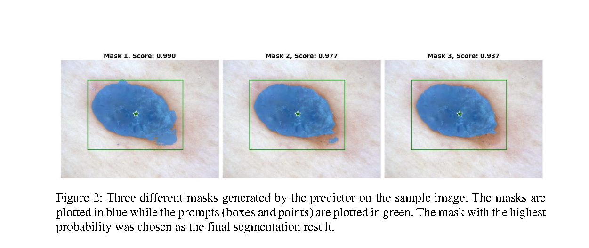

**Abstract**  
Skin cancer is a prevalent and potentially fatal disease that requires accurate and efficient diagnosis and treatment. Although manual tracing is the current standard in clinics, automated tools are desired to reduce human labor and improve accuracy. However, developing such tools is challenging due to the highly variable appearance of skin cancers and complex objects in the background. In this paper, we present SkinSAM, a fine-tuned model based on the Segment Anything Model that showed outstanding segmentation performance. The models are validated on HAM10000 dataset which includes 10015 dermatoscopic images. While larger models (ViT_L, ViT_H) performed better than the smaller one (ViT_b), the finetuned model (ViT_b_finetuned) exhibited the greatest improvement, with a Mean pixel accuracy of 0.945, Mean dice score of 0.8879, and Mean IoU score of 0.7843. Among the lesion types, vascular lesions showed the best segmentation results. Our research demonstrates the great potential of adapting SAM to medical image segmentation tasks.

**Summary**  
TBD

[⬆ Back to Literature Table](#samothers)

---

### <a id="gazesam-what-you-see-is-what-you-segment-5e7dace5">GazeSAM: What You See is What You Segment</a>
> **Venue:** arXiv.org 2023  
> **Authors:** B. Wang et al.  
> **Keywords:** OtherMIS, SAM
**Links**  
[Viewable Link](https://arxiv.org/abs/2304.13844) [Original Link](https://arxiv.org/pdf/2304.13844.pdf) [Code](https://github.com/ukaukaaaa/GazeSAM)

  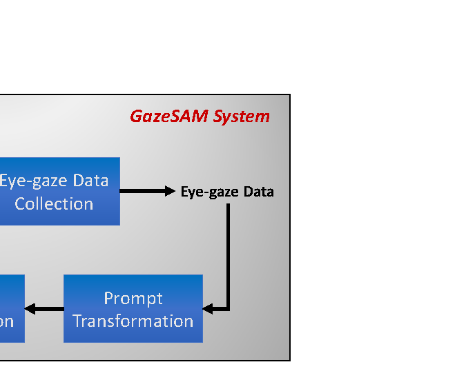

**Abstract**  
This study investigates the potential of eye-tracking technology and the Segment Anything Model (SAM) to design a collaborative human-computer interaction system that automates medical image segmentation. We present the \textbf{GazeSAM} system to enable radiologists to collect segmentation masks by simply looking at the region of interest during image diagnosis. The proposed system tracks radiologists' eye movement and utilizes the eye-gaze data as the input prompt for SAM, which automatically generates the segmentation mask in real time. This study is the first work to leverage the power of eye-tracking technology and SAM to enhance the efficiency of daily clinical practice. Moreover, eye-gaze data coupled with image and corresponding segmentation labels can be easily recorded for further advanced eye-tracking research. The code is available in \url{https://github.com/ukaukaaaa/GazeSAM}.

**Summary**  
TBD

[⬆ Back to Literature Table](#samothers)

---

### <a id="customized-segment-anything-model-for-medical-im-2c6385da">Customized Segment Anything Model for Medical Image Segmentation</a>
> **Venue:** 2025 44th Chinese Control Conference (CCC)  
> **Authors:** K. Zhang and D. Liu  
> **Keywords:** OtherMIS, SAM
**Links**  
[Viewable Link](https://ieeexplore.ieee.org/document/11178681/) [Original Link](https://arxiv.org/pdf/2304.13785.pdf) [Code](https://github.com/hitachinsk/SAMed)

  

**Abstract**  
We propose SAMed, a general solution for medical image segmentation. Different from the previous methods, SAMed is built upon the large-scale image segmentation model, Segment Anything Model (SAM), to explore the new research paradigm of customizing large-scale models for medical image segmentation. SAMed applies the low-rank-based (LoRA) finetuning strategy to the SAM image encoder and finetunes it together with the prompt encoder and the mask decoder on labeled medical image segmentation datasets. We also observe the warmup finetuning strategy and the AdamW optimizer lead SAMed to successful convergence and lower loss. Different from SAM, SAMed could perform semantic segmentation on medical images. Our trained SAMed model achieves 81.88 DSC and 20.64 HD on the Synapse multi-organ segmentation dataset, which is on par with the state-of-the-art methods. We conduct extensive experiments to validate the effectiveness of our design. Since SAMed only updates a small fraction of the SAM parameters, its deployment cost and storage cost are quite marginal in practical usage. The code of SAMed is available at https://github.com/hitachinsk/SAMed.

**Summary**  
TBD

[⬆ Back to Literature Table](#samothers)

---

### <a id="learnable-ophthalmology-sam-c51c154b">Learnable Ophthalmology SAM</a>
> **Venue:** arXiv.org 2023  
> **Authors:** Z. Qiu et al.  
> **Keywords:** Few-ShotMIS, SAM
**Links**  
[Viewable Link](https://arxiv.org/abs/2304.13425) [Original Link](https://arxiv.org/pdf/2304.13425.pdf) [Code](https://github.com/Qsingle/LearnablePromptSAM)

  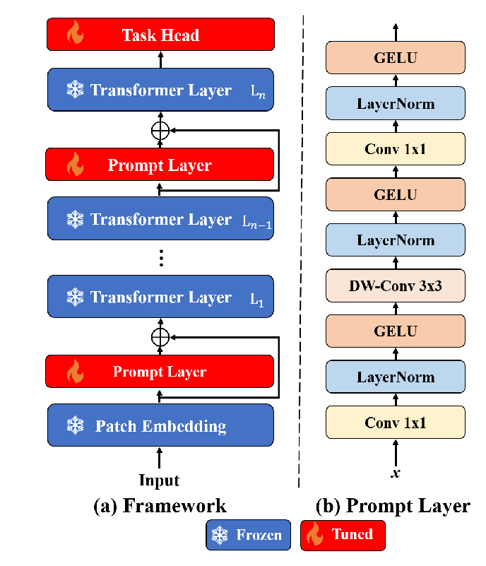

**Abstract**  
Segmentation is vital for ophthalmology image analysis. But its various modal images hinder most of the existing segmentation algorithms applications, as they rely on training based on a large number of labels or hold weak generalization ability. Based on Segment Anything (SAM), we propose a simple but effective learnable prompt layer suitable for multiple target segmentation in ophthalmology multi-modal images, named Learnable Ophthalmology Segment Anything (SAM). The learnable prompt layer learns medical prior knowledge from each transformer layer. During training, we only train the prompt layer and task head based on a one-shot mechanism. We demonstrate the effectiveness of our thought based on four medical segmentation tasks based on nine publicly available datasets. Moreover, we only provide a new improvement thought for applying the existing fundamental CV models in the medical field. Our codes are available at \href{https://github.com/Qsingle/LearnablePromptSAM}{website}.

**Summary**  
TBD

[⬆ Back to Literature Table](#samfsmis)

---

### <a id="generalist-vision-foundation-models-for-medical-79bcfb1d">Generalist Vision Foundation Models for Medical Imaging: A Case Study of Segment Anything Model on Zero-Shot Medical Segmentation</a>
> **Venue:** Diagnostics 2023  
> **Authors:** P. Shi et al.  
> **Keywords:** Zero-ShotMIS, SAM
**Links**  
[Viewable Link](https://www.mdpi.com/2075-4418/13/11/1947) [Original Link](https://arxiv.org/pdf/2304.12637.pdf)

  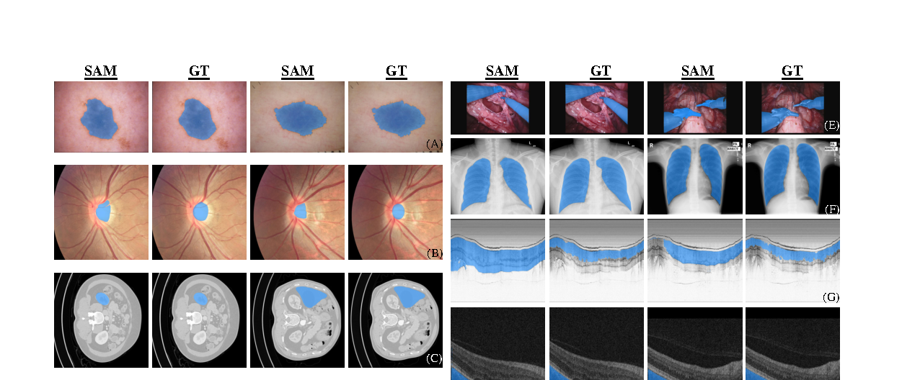

**Abstract**  
In this paper, we examine the recent Segment Anything Model (SAM) on medical images, and report both quantitative and qualitative zero-shot segmentation results on nine medical image segmentation benchmarks, covering various imaging modalities, such as optical coherence tomography (OCT), magnetic resonance imaging (MRI), and computed tomography (CT), as well as different applications including dermatology, ophthalmology, and radiology. Those benchmarks are representative and commonly used in model development. Our experimental results indicate that while SAM presents remarkable segmentation performance on images from the general domain, its zero-shot segmentation ability remains restricted for out-of-distribution images, e.g., medical images. In addition, SAM exhibits inconsistent zero-shot segmentation performance across different unseen medical domains. For certain structured targets, e.g., blood vessels, the zero-shot segmentation of SAM completely failed. In contrast, a simple fine-tuning of it with a small amount of data could lead to remarkable improvement of the segmentation quality, showing the great potential and feasibility of using fine-tuned SAM to achieve accurate medical image segmentation for a precision diagnostics. Our study indicates the versatility of generalist vision foundation models on medical imaging, and their great potential to achieve desired performance through fine-turning and eventually address the challenges associated with accessing large and diverse medical datasets in support of clinical diagnostics.

**Summary**  
TBD

[⬆ Back to Literature Table](#samzsmis)

---

### <a id="medical-sam-adapter-adapting-segment-anything-mo-596eb23c">Medical SAM Adapter: Adapting Segment Anything Model for Medical Image Segmentation</a>
> **Venue:** Medical Image Analysis 2025  
> **Authors:** J. Wu et al.  
> **Keywords:** OtherMIS, SAM
**Links**  
[Viewable Link](https://linkinghub.elsevier.com/retrieve/pii/S1361841525000945) [Original Link](https://arxiv.org/pdf/2304.12620.pdf) [Code](https://github.com/WuJunde/Medical-SAM-Adapter)

  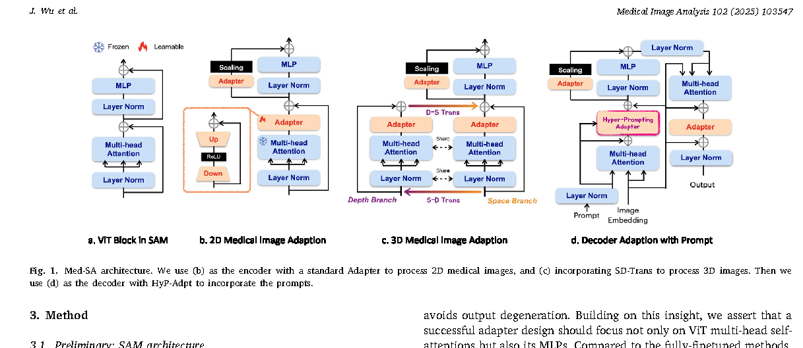

**Abstract**  
The Segment Anything Model (SAM) has recently gained popularity in the field of image segmentation due to its impressive capabilities in various segmentation tasks and its prompt-based interface. However, recent studies and individual experiments have shown that SAM underperforms in medical image segmentation, since the lack of the medical specific knowledge. This raises the question of how to enhance SAM's segmentation capability for medical images. In this paper, instead of fine-tuning the SAM model, we propose the Medical SAM Adapter (Med-SA), which incorporates domain-specific medical knowledge into the segmentation model using a light yet effective adaptation technique. In Med-SA, we propose Space-Depth Transpose (SD-Trans) to adapt 2D SAM to 3D medical images and Hyper-Prompting Adapter (HyP-Adpt) to achieve prompt-conditioned adaptation. We conduct comprehensive evaluation experiments on 17 medical image segmentation tasks across various image modalities. Med-SA outperforms several state-of-the-art (SOTA) medical image segmentation methods, while updating only 2\% of the parameters. Our code is released at https://github.com/KidsWithTokens/Medical-SAM-Adapter.

**Summary**  
TBD

[⬆ Back to Literature Table](#samothers)

---

### <a id="segment-anything-in-medical-images-571280f8">Segment Anything in Medical Images</a>
> **Venue:** Nature Communications 2024  
> **Authors:** J. Ma and B. Wang  
> **Keywords:** OtherMIS, SAM
**Links**  
[Viewable Link](https://www.nature.com/articles/s41467-024-44824-z) [Original Link](https://arxiv.org/pdf/2304.12306.pdf) [Code](https://github.com/bowang-lab/MedSAM)

  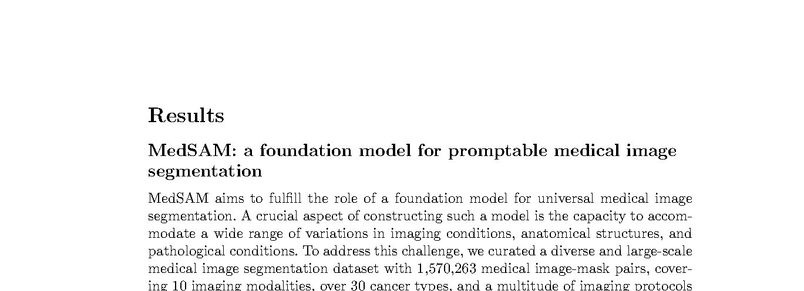

**Abstract**  
Medical image segmentation is a critical component in clinical practice, facilitating accurate diagnosis, treatment planning, and disease monitoring. However, existing methods, often tailored to specific modalities or disease types, lack generalizability across the diverse spectrum of medical image segmentation tasks. Here we present MedSAM, a foundation model designed for bridging this gap by enabling universal medical image segmentation. The model is developed on a large-scale medical image dataset with 1,570,263 image-mask pairs, covering 10 imaging modalities and over 30 cancer types. We conduct a comprehensive evaluation on 86 internal validation tasks and 60 external validation tasks, demonstrating better accuracy and robustness than modality-wise specialist models. By delivering accurate and efficient segmentation across a wide spectrum of tasks, MedSAM holds significant potential to expedite the evolution of diagnostic tools and the personalization of treatment plans.

**Summary**  
TBD

[⬆ Back to Literature Table](#samothers)

---

### <a id="input-augmentation-with-sam-boosting-medical-ima-da1c6730">Input Augmentation with SAM: Boosting Medical Image Segmentation with Segmentation Foundation Model</a>
> **Venue:** Lecture Notes in Computer Science 2023  
> **Authors:** Y. Zhang et al.  
> **Keywords:** OtherMIS, SAM
**Links**  
[Viewable Link](https://link.springer.com/10.1007/978-3-031-47401-9_13) [Original Link](https://arxiv.org/pdf/2304.11332.pdf)

  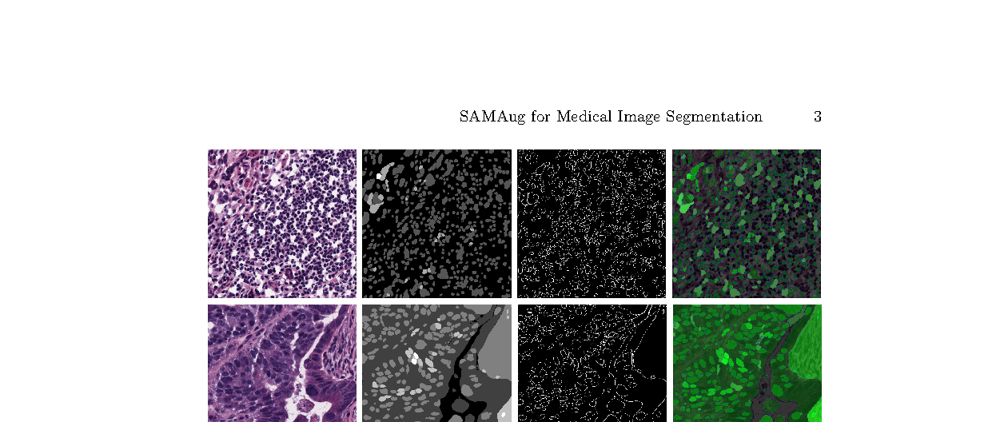

**Abstract**  
The Segment Anything Model (SAM) is a recently developed large model for general-purpose segmentation for computer vision tasks. SAM was trained using 11 million images with over 1 billion masks and can produce segmentation results for a wide range of objects in natural scene images. SAM can be viewed as a general perception model for segmentation (partitioning images into semantically meaningful regions). Thus, how to utilize such a large foundation model for medical image segmentation is an emerging research target. This paper shows that although SAM does not immediately give high-quality segmentation for medical image data, its generated masks, features, and stability scores are useful for building and training better medical image segmentation models. In particular, we demonstrate how to use SAM to augment image input for commonly-used medical image segmentation models (e.g., U-Net). Experiments on three segmentation tasks show the effectiveness of our proposed SAMAug method. The code is available at \url{https://github.com/yizhezhang2000/SAMAug}.

**Summary**  
TBD

[⬆ Back to Literature Table](#samothers)

---

### <a id="segment-anything-model-for-medical-image-analysi-27aff969">Segment Anything Model for Medical Image Analysis: an Experimental Study</a>
> **Venue:** Medical Image Analysis 2023  
> **Authors:** MA. Mazurowski et al.  
> **Keywords:** Zero-ShotMIS, SAM
**Links**  
[Viewable Link](https://linkinghub.elsevier.com/retrieve/pii/S1361841523001780) [Original Link](https://arxiv.org/pdf/2304.10517.pdf) [Code](https://github.com/mazurowski-lab/segment-anything-medical)

  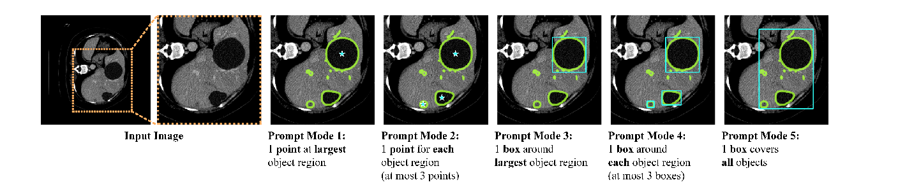

**Abstract**  
Training segmentation models for medical images continues to be challenging due to the limited availability of data annotations. Segment Anything Model (SAM) is a foundation model that is intended to segment user-defined objects of interest in an interactive manner. While the performance on natural images is impressive, medical image domains pose their own set of challenges. Here, we perform an extensive evaluation of SAM's ability to segment medical images on a collection of 19 medical imaging datasets from various modalities and anatomies. We report the following findings: (1) SAM's performance based on single prompts highly varies depending on the dataset and the task, from IoU=0.1135 for spine MRI to IoU=0.8650 for hip X-ray. (2) Segmentation performance appears to be better for well-circumscribed objects with prompts with less ambiguity and poorer in various other scenarios such as the segmentation of brain tumors. (3) SAM performs notably better with box prompts than with point prompts. (4) SAM outperforms similar methods RITM, SimpleClick, and FocalClick in almost all single-point prompt settings. (5) When multiple-point prompts are provided iteratively, SAM's performance generally improves only slightly while other methods' performance improves to the level that surpasses SAM's point-based performance. We also provide several illustrations for SAM's performance on all tested datasets, iterative segmentation, and SAM's behavior given prompt ambiguity. We conclude that SAM shows impressive zero-shot segmentation performance for certain medical imaging datasets, but moderate to poor performance for others. SAM has the potential to make a significant impact in automated medical image segmentation in medical imaging, but appropriate care needs to be applied when using it.

**Summary**  
TBD

[⬆ Back to Literature Table](#samzsmis)

---

### <a id="accuracy-of-segment-anything-model-sam-in-medica-aa280e13">Accuracy of Segment-Anything Model (SAM) in medical image segmentation tasks</a>
> **Venue:** 2023  
> **Authors:** S. He et al.  
> **Keywords:** OtherMIS, SAM
**Links**  
[Viewable Link](https://arxiv.org/pdf/2304.09324.pdf)

  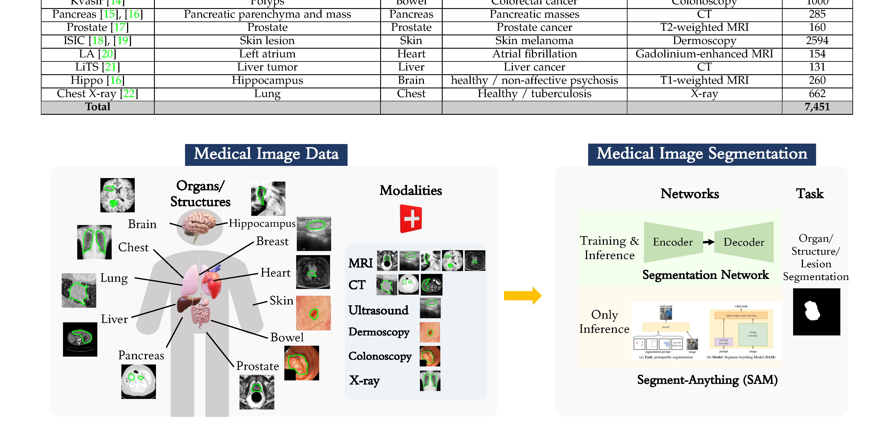

**Abstract**  
TBD

**Summary**  
TBD

[⬆ Back to Literature Table](#samothers)

---

### <a id="sam-fails-to-segment-anything-sam-adapter-adapti-3f0ab79d">SAM Fails to Segment Anything? -- SAM-Adapter: Adapting SAM in Underperformed Scenes: Camouflage, Shadow, Medical Image Segmentation, and More</a>
> **Venue:** arXiv.org 2023  
> **Authors:** T. Chen et al.  
> **Keywords:** OtherMIS, SAM
**Links**  
[Viewable Link](https://arxiv.org/abs/2304.09148) [Original Link](https://arxiv.org/pdf/2304.09148.pdf) [Code](http://tianrun-chen.github.io/SAM-Adaptor/)

  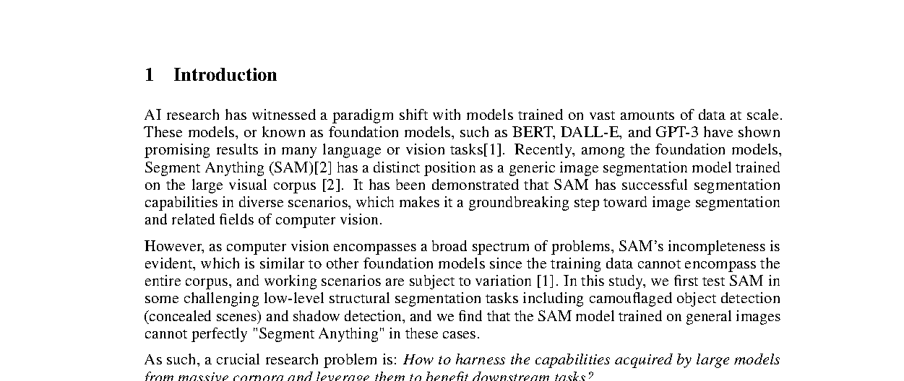

**Abstract**  
The emergence of large models, also known as foundation models, has brought significant advancements to AI research. One such model is Segment Anything (SAM), which is designed for image segmentation tasks. However, as with other foundation models, our experimental findings suggest that SAM may fail or perform poorly in certain segmentation tasks, such as shadow detection and camouflaged object detection (concealed object detection). This study first paves the way for applying the large pre-trained image segmentation model SAM to these downstream tasks, even in situations where SAM performs poorly. Rather than fine-tuning the SAM network, we propose \textbf{SAM-Adapter}, which incorporates domain-specific information or visual prompts into the segmentation network by using simple yet effective adapters. By integrating task-specific knowledge with general knowledge learnt by the large model, SAM-Adapter can significantly elevate the performance of SAM in challenging tasks as shown in extensive experiments. We can even outperform task-specific network models and achieve state-of-the-art performance in the task we tested: camouflaged object detection, shadow detection. We also tested polyp segmentation (medical image segmentation) and achieves better results. We believe our work opens up opportunities for utilizing SAM in downstream tasks, with potential applications in various fields, including medical image processing, agriculture, remote sensing, and more.

**Summary**  
TBD

[⬆ Back to Literature Table](#samothers)

---

### <a id="when-sam-meets-medical-images-an-investigation-o-b7a8dc2b">When SAM Meets Medical Images: An Investigation of Segment Anything Model (SAM) on Multi-phase Liver Tumor Segmentation</a>
> **Venue:** arXiv.org 2023  
> **Authors:** C. Hu and X. Li  
> **Keywords:** Zero-ShotMIS, SAM
**Links**  
[Viewable Link](https://arxiv.org/abs/2304.08506) [Original Link](https://arxiv.org/pdf/2304.08506.pdf)

  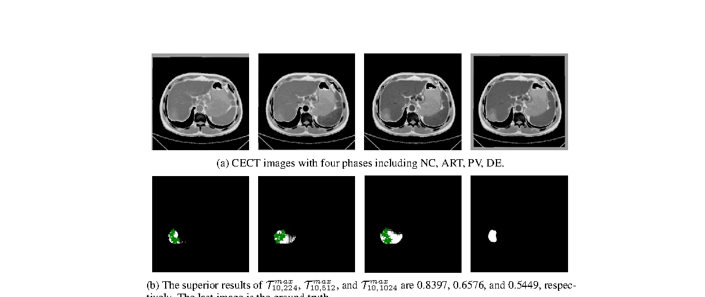

**Abstract**  
Learning to segmentation without large-scale samples is an inherent capability of human. Recently, Segment Anything Model (SAM) performs the significant zero-shot image segmentation, attracting considerable attention from the computer vision community. Here, we investigate the capability of SAM for medical image analysis, especially for multi-phase liver tumor segmentation (MPLiTS), in terms of prompts, data resolution, phases. Experimental results demonstrate that there might be a large gap between SAM and expected performance. Fortunately, the qualitative results show that SAM is a powerful annotation tool for the community of interactive medical image segmentation.

**Summary**  
TBD

[⬆ Back to Literature Table](#samzsmis)

---

### <a id="the-segment-anything-foundation-model-achieves-f-adaeacaf">The Segment Anything foundation model achieves favorable brain tumor autosegmentation accuracy on MRI to support radiotherapy treatment planning</a>
> **Venue:** Strahlentherapie und Onkologie 2025  
> **Authors:** F. Putz et al.  
> **Keywords:** Zero-ShotMIS, SAM
**Links**  
[Viewable Link](https://link.springer.com/10.1007/s00066-024-02313-8) [Original Link](https://arxiv.org/pdf/2304.07875.pdf)

  

**Abstract**  
Background: Tumor segmentation in MRI is crucial in radiotherapy (RT) treatment planning for brain tumor patients. Segment anything (SA), a novel promptable foundation model for autosegmentation, has shown high accuracy for multiple segmentation tasks but was not evaluated on medical datasets yet. Methods: SA was evaluated in a point-to-mask task for glioma brain tumor autosegmentation on 16744 transversal slices from 369 MRI datasets (BraTS 2020). Up to 9 point prompts were placed per slice. Tumor core (enhancing tumor + necrotic core) was segmented on contrast-enhanced T1w sequences. Out of the 3 masks predicted by SA, accuracy was evaluated for the mask with the highest calculated IoU (oracle mask) and with highest model predicted IoU (suggested mask). In addition to assessing SA on whole MRI slices, SA was also evaluated on images cropped to the tumor (max. 3D extent + 2 cm). Results: Mean best IoU (mbIoU) using oracle mask on full MRI slices was 0.762 (IQR 0.713-0.917). Best 2D mask was achieved after a mean of 6.6 point prompts (IQR 5-9). Segmentation accuracy was significantly better for high- compared to low-grade glioma cases (mbIoU 0.789 vs. 0.668). Accuracy was worse using MRI slices cropped to the tumor (mbIoU 0.759) and was much worse using suggested mask (full slices 0.572). For all experiments, accuracy was low on peripheral slices with few tumor voxels (mbIoU, &lt;300: 0.537 vs. &gt;=300: 0.841). Stacking best oracle segmentations from full axial MRI slices, mean 3D DSC for tumor core was 0.872, which was improved to 0.919 by combining axial, sagittal and coronal masks. Conclusions: The Segment Anything foundation model, while trained on photos, can achieve high zero-shot accuracy for glioma brain tumor segmentation on MRI slices. The results suggest that Segment Anything can accelerate and facilitate RT treatment planning, when properly integrated in a clinical application.

**Summary**  
TBD

[⬆ Back to Literature Table](#samzsmis)

---

### <a id="can-sam-segment-polyps-ba840d6d">Can SAM Segment Polyps?</a>
> **Venue:** arXiv.org 2023  
> **Authors:** T. Zhou et al.  
> **Keywords:** OtherMIS, SAM
**Links**  
[Viewable Link](https://arxiv.org/abs/2304.07583) [Original Link](https://arxiv.org/pdf/2304.07583.pdf) [Code](https://github.com/taozh2017/SAMPolyp)

  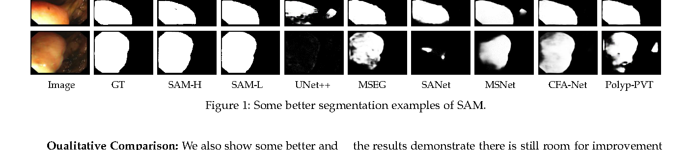

**Abstract**  
Recently, Meta AI Research releases a general Segment Anything Model (SAM), which has demonstrated promising performance in several segmentation tasks. As we know, polyp segmentation is a fundamental task in the medical imaging field, which plays a critical role in the diagnosis and cure of colorectal cancer. In particular, applying SAM to the polyp segmentation task is interesting. In this report, we evaluate the performance of SAM in segmenting polyps, in which SAM is under unprompted settings. We hope this report will provide insights to advance this polyp segmentation field and promote more interesting works in the future. This project is publicly at https://github.com/taozh2017/SAMPolyp.

**Summary**  
TBD

[⬆ Back to Literature Table](#samothers)

---

### <a id="samm-segment-any-medical-model-a-3d-slicer-integ-f797a472">SAMM (Segment Any Medical Model): A 3D Slicer Integration to SAM</a>
> **Venue:** arXiv.org 2023  
> **Authors:** Y. Liu et al.  
> **Keywords:** OtherMIS, SAM
**Links**  
[Viewable Link](https://arxiv.org/abs/2304.05622) [Original Link](https://arxiv.org/pdf/2304.05622.pdf) [Code](https://github.com/bingogome/samm)

  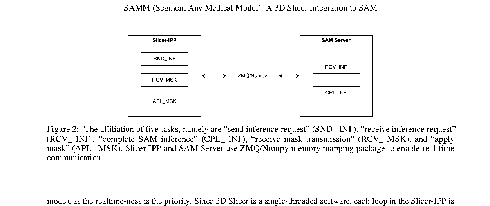

**Abstract**  
The Segment Anything Model (SAM) is a new image segmentation tool trained with the largest available segmentation dataset. The model has demonstrated that, with prompts, it can create high-quality masks for general images. However, the performance of the model on medical images requires further validation. To assist with the development, assessment, and application of SAM on medical images, we introduce Segment Any Medical Model (SAMM), an extension of SAM on 3D Slicer - an image processing and visualization software extensively used by the medical imaging community. This open-source extension to 3D Slicer and its demonstrations are posted on GitHub (https://github.com/bingogome/samm). SAMM achieves 0.6-second latency of a complete cycle and can infer image masks in nearly real-time.

**Summary**  
TBD

[⬆ Back to Literature Table](#samothers)

---

### <a id="sam-md-zero-shot-medical-image-segmentation-capa-d27997b8">SAM.MD: Zero-shot medical image segmentation capabilities of the Segment Anything Model</a>
> **Venue:** arXiv.org 2023  
> **Authors:** S. Roy et al.  
> **Keywords:** Zero-ShotMIS, SAM
**Links**  
[Viewable Link](https://arxiv.org/abs/2304.05396) [Original Link](https://arxiv.org/pdf/2304.05396.pdf)

  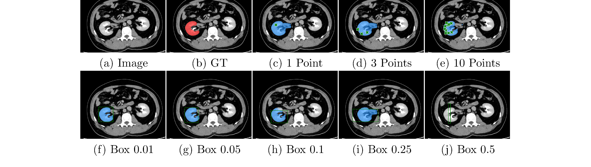

**Abstract**  
Foundation models have taken over natural language processing and image generation domains due to the flexibility of prompting. With the recent introduction of the Segment Anything Model (SAM), this prompt-driven paradigm has entered image segmentation with a hitherto unexplored abundance of capabilities. The purpose of this paper is to conduct an initial evaluation of the out-of-the-box zero-shot capabilities of SAM for medical image segmentation, by evaluating its performance on an abdominal CT organ segmentation task, via point or bounding box based prompting. We show that SAM generalizes well to CT data, making it a potential catalyst for the advancement of semi-automatic segmentation tools for clinicians. We believe that this foundation model, while not reaching state-of-the-art segmentation performance in our investigations, can serve as a highly potent starting point for further adaptations of such models to the intricacies of the medical domain. Keywords: medical image segmentation, SAM, foundation models, zero-shot learning

**Summary**  
TBD

[⬆ Back to Literature Table](#samzsmis)

---

### <a id="sam-vs-bet-a-comparative-study-for-brain-extract-917316c8">SAM vs BET: A Comparative Study for Brain Extraction and Segmentation of Magnetic Resonance Images using Deep Learning</a>
> **Venue:** arXiv.org 2023  
> **Authors:** S. Mohapatra et al.  
> **Keywords:** Zero-ShotMIS, SAM
**Links**  
[Viewable Link](https://arxiv.org/abs/2304.04738) [Original Link](https://arxiv.org/pdf/2304.04738.pdf)

  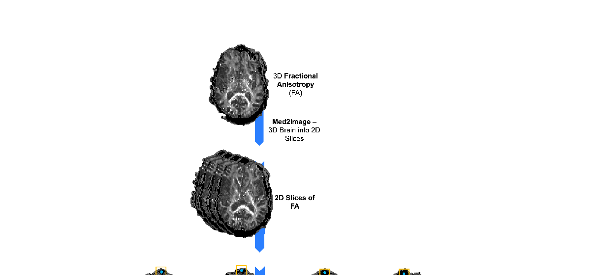

**Abstract**  
Brain extraction is a critical preprocessing step in various neuroimaging studies, particularly enabling accurate separation of brain from non-brain tissue and segmentation of relevant within-brain tissue compartments and structures using Magnetic Resonance Imaging (MRI) data. FSL's Brain Extraction Tool (BET), although considered the current gold standard for automatic brain extraction, presents limitations and can lead to errors such as over-extraction in brains with lesions affecting the outer parts of the brain, inaccurate differentiation between brain tissue and surrounding meninges, and susceptibility to image quality issues. Recent advances in computer vision research have led to the development of the Segment Anything Model (SAM) by Meta AI, which has demonstrated remarkable potential in zero-shot segmentation of objects in real-world scenarios. In the current paper, we present a comparative analysis of brain extraction techniques comparing SAM with a widely used and current gold standard technique called BET on a variety of brain scans with varying image qualities, MR sequences, and brain lesions affecting different brain regions. We find that SAM outperforms BET based on average Dice coefficient, IoU and accuracy metrics, particularly in cases where image quality is compromised by signal inhomogeneities, non-isotropic voxel resolutions, or the presence of brain lesions that are located near (or involve) the outer regions of the brain and the meninges. In addition, SAM has also unsurpassed segmentation properties allowing a fine grain separation of different issue compartments and different brain structures. These results suggest that SAM has the potential to emerge as a more accurate, robust and versatile tool for a broad range of brain extraction and segmentation applications.

**Summary**  
TBD

[⬆ Back to Literature Table](#samzsmis)

---

### <a id="segment-anything-model-sam-for-digital-pathology-d6209219">Segment Anything Model (SAM) for Digital Pathology: Assess Zero-shot Segmentation on Whole Slide Imaging</a>
> **Venue:** Electronic Imaging 2025  
> **Authors:** R. Deng et al.  
> **Keywords:** Zero-ShotMIS, SAM
**Links**  
[Viewable Link](https://library.imaging.org/ei/articles/37/14/COIMG-132) [Original Link](https://arxiv.org/pdf/2304.04155.pdf)

  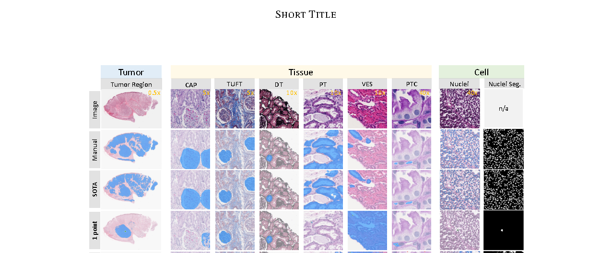

**Abstract**  
The results suggest that the zero-shot SAM model achieves remarkable segmentation performance for large connected objects. However, it does not consistently achieve satisfying performance for dense instance object segmentation, even with 20 prompts (clicks/boxes) on each image. We also summarized the identified limitations for digital pathology: (1) image resolution, (2) multiple scales, (3) prompt selection, and (4) model fine-tuning. In the future, the few-shot fine-tuning with images from downstream pathological segmentation tasks might help the model to achieve better performance in dense object segmentation.

**Summary**  
TBD

[⬆ Back to Literature Table](#samzsmis)

---

<!-- Preserved detail blocks not currently matched from origin.md -->

<!-- Preserved detail blocks not currently matched from origin.md -->

<!-- Preserved detail blocks not currently matched from origin.md -->

<!-- Preserved detail blocks not currently matched from origin.md -->

### <a id="zhai2026neuro">SAM2-driven dual-teacher framework using hierarchical cross-slice context for semi-supervised 3D medical image segmentation</a>

> **Venue:** Neurocomputing 2026  
> **Authors:** Rui Zhai et al.  
> **Keywords:** Semi-supervised 3D segmentation, SAM2, cross-slice context, prompt learning

  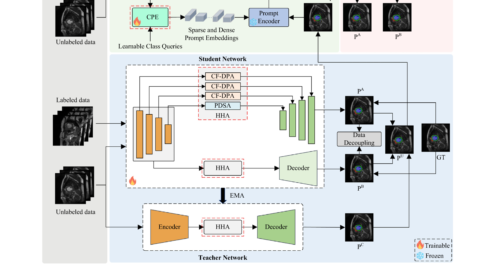

**Abstract**  
Semi-supervised learning (SSL) has emerged as an effective paradigm to alleviate the dependency on large-scale annotated data for 3D medical image segmentation. Large-scale foundation models, such as the Segment Anything Model (SAM), exhibit strong generalization on natural images. However, exploiting volumetric context efficiently in 3D data remains difficult, and transferring foundation models directly to medical imaging often yields substantial performance degradation due to the domain gap. In this paper, we propose HCCP-SAM2, a semi-supervised framework that integrates Hierarchical Cross-Slice Context Modeling and Class-Aware Prompting with SAM2 for 3D medical image segmentation. First, we introduce a Hierarchical Hybrid Attention (HHA) mechanism. This hierarchical design efficiently fuses cross-slice context while preserving both fine-grained features and maintaining computational efficiency. Second, we design a Class-aware Promptable Embedding (CPE) module that automatically generates high-quality prompts for the SAM2, significantly enhancing pseudo-label reliability. Third, we propose an Uncertainty-guided Hybrid Distillation (UHD) strategy, which enables the student network to dynamically learn from the SAM2 teacher based on its predictive uncertainty, facilitating efficient and robust knowledge transfer. Extensive experiments on multiple public 3D medical segmentation datasets demonstrate that our proposed model significantly outperforms state-of-the-art semi-supervised methods.

**Summary**  
This paper proposes a SAM2-driven dual-teacher framework for semi-supervised 3D medical image segmentation. The method leverages hierarchical cross-slice contextual information to improve representation consistency across volumetric slices, enhancing segmentation quality under limited annotations.

[⬆ Back to Literature Table](#sam234mis)

---

<!-- Article details section. Starting ⬇️ -->

### <a id="su2026jbhi">Zero-Shot Capillary Segmentation in Dermoscopy Images via SAM2: A Case Study on Oral Mucosa</a>  
> **Venue:** JBHI 2025  
> **Authors:** W. Su et al.  
> **Keywords:** Oral Mucosa , Dermoscopy , Capillary Segmentation , Segment Anything Model (SAM) , Zero-Shot Learning

  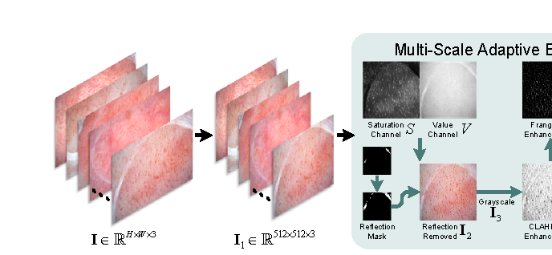

**Abstract**  
Morphological changes in oral mucosal microvasculature serve as early diagnostic markers for various diseases. However, existing dermoscopy image analysis relies heavily on physician expertise, leading to high subjectivity and low efficiency. This paper proposes a zero-shot capillary segmentation method for oral mucosa based on Segment Anything Model 2 (SAM2), which effectively handles reflection artifacts and highlights minute vascular structures through a multi-scale adaptive enhancement algorithm. The method employs a morphology-aware automatic prompt annotation strategy to generate composite guidance containing bounding boxes, foreground points, and background points for SAM2. Without requiring annotated data or model training, this approach achieves precise instance segmentation of capillaries through an “enhancement-annotation-segmentation” collaborative paradigm. On a clinical dataset comprising 212 dermoscopy images from 106 subjects, our method achieved a Dice coefficient of 0.7278 and an IoU of 0.5721, representing improvements of 17.12% and 26.9% respectively compared to the medical-specific baseline MedSAM. This provides an objective auxiliary diagnostic method for oral mucosal diseases that depend on capillary morphology analysis.

**Summary**  
This paper proposes a ....

[⬆ Back to Literature Table](#sam234zsmis)

---
<!-- Article details section. Ending ⬆️ -->

<!-- Article details section. Starting ⬇️ -->

### <a id="huang2024tmi">Learnable Prompting SAM-Induced Knowledge  Distillation for Semi-Supervised Medical  Image Segmentation</a>
> **Venue:** TMI 2025   
> **Authors:** Kaiwen Huang et al.   
> **Keywords:** Semi-supervised 3D segmentation, SAM, knowledge distillation, prompt learning

  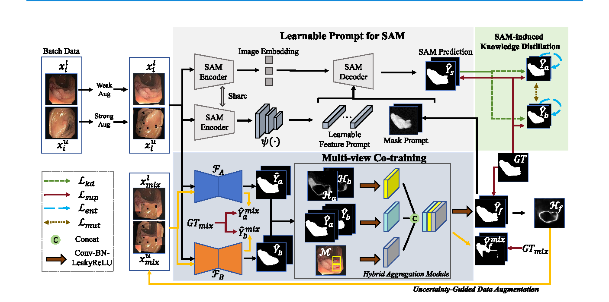

**Abstract**  
The limited availability of labeled data has driven advancements in semi-supervised learning for medical image segmentation. Modern large-scale models tailored for general segmentation, such as the Segment Anything Model (SAM), have revealed robust generalization capabilities. However, applying these models directly to medical image segmentation still exposes performance degradation. In this paper, we propose a learnable prompting SAM-induced Knowledge distillation framework (KnowSAM) for semi-supervised medical image segmentation. Firstly, we propose a Multi-view Co-training (MC) strategy that employs two distinct sub-networks to employ a co-teaching paradigm, resulting in more robust outcomes. Secondly, we present a Learnable Prompt Strategy (LPS) to dynamically produce dense prompts and integrate an adapter to fine-tune SAM specifically for medical image segmentation tasks. Moreover, we propose SAM-induced Knowledge Distillation (SKD) to transfer useful knowledge from SAM to two sub-networks, enabling them to learn from SAM’s predictions and alleviate the effects of incorrect pseudo-labels during training. Notably, the predictions generated by our subnets are used to produce mask prompts for SAM, facilitating effective inter-module information exchange. Extensive experimental results on various medical segmentation tasks demonstrate that our model outperforms the state-of-the-art semi-supervised segmentation approaches. Crucially, our SAM distillation framework can be seamlessly integrated into other semi-supervised segmentation methods to enhance performance. The code will be released upon acceptance of this manuscript at https://github.com/taozh2017/KnowSAM.

**Summary**  
This paper proposes a SAM-driven dual-teacher framework for semi-supervised 3D medical image segmentation....

[⬆ Back to Literature Table](#sam234mis)

---
<!-- Article details section. Ending ⬆️ -->

<!-- Article details section. Starting ⬇️ -->

### <a id="template">Template</a>
> **Venue:** Neurocomputing 2026   
> **Authors:** Rui Zhai et al.   
> **Keywords:** Semi-supervised 3D segmentation, SAM2, cross-slice context, prompt learning

  

**Abstract**  
Semi-supervised learning (SSL) ...

**Summary**  
This paper proposes a SAM2-driven dual-teacher framework for semi-supervised 3D medical image segmentation....

[⬆ Back to Literature Table](#sam234mis)

---
<!-- Article details section. Ending ⬆️ -->
